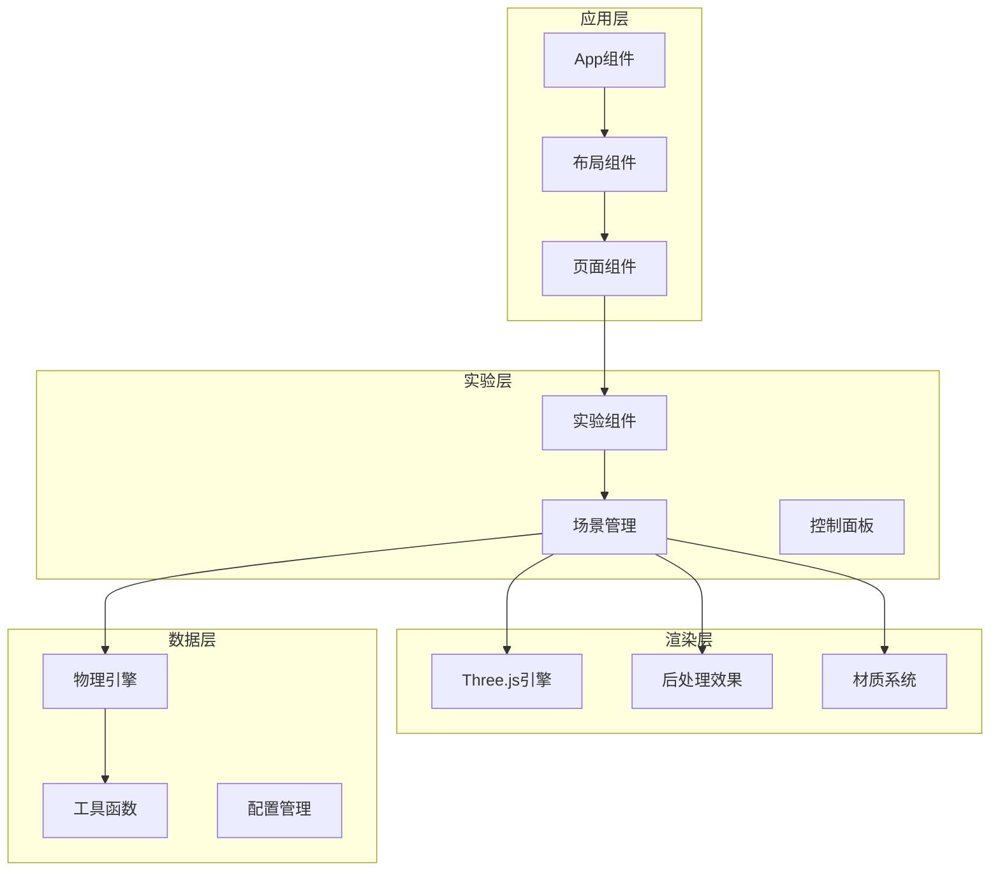
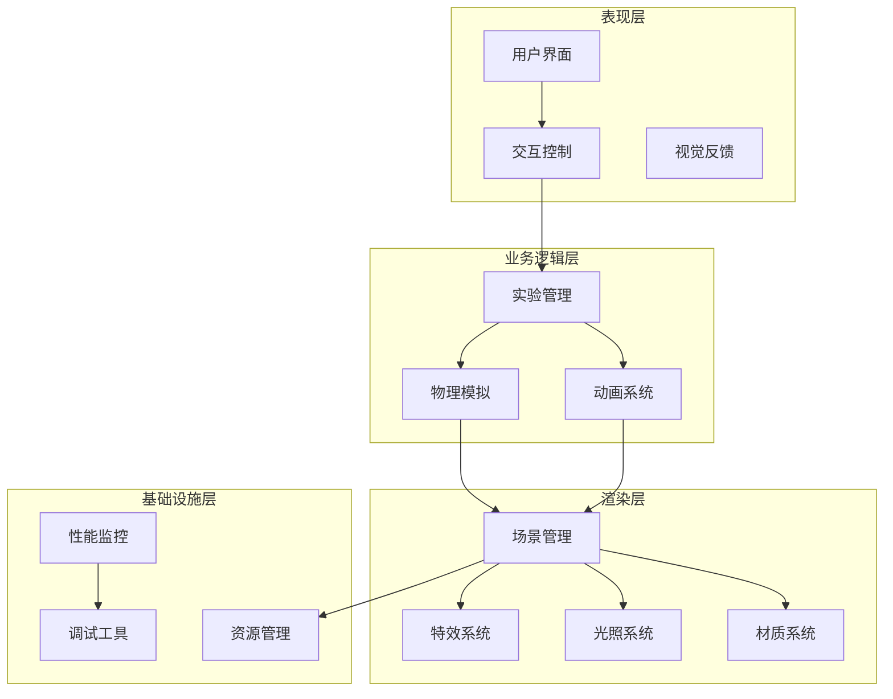
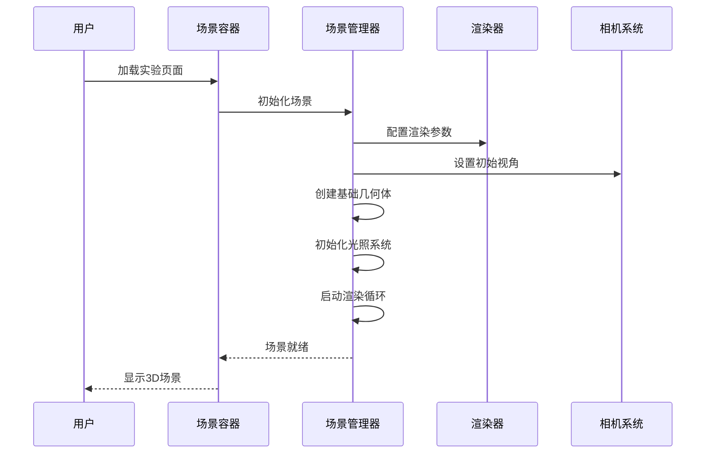
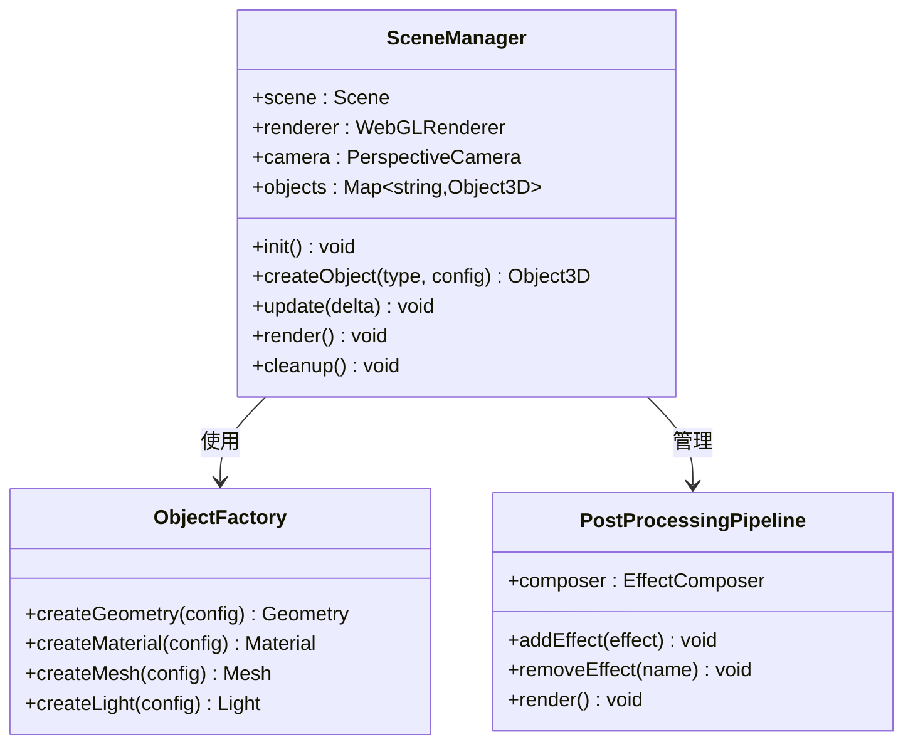
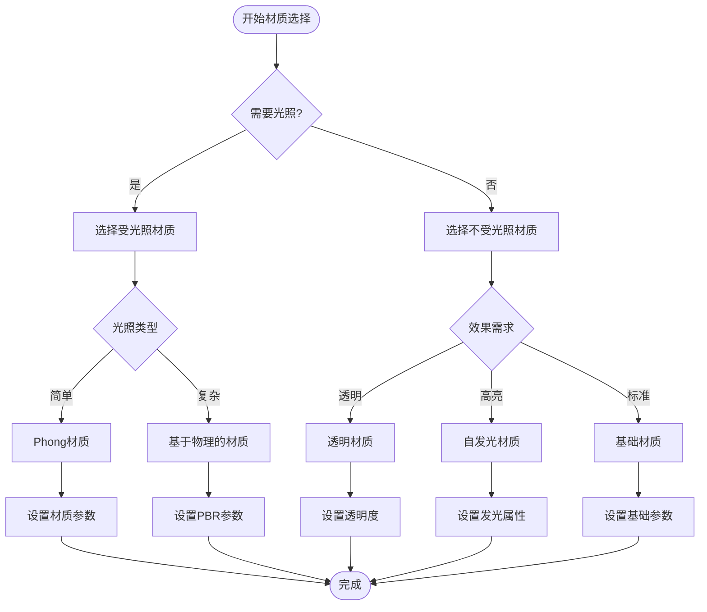
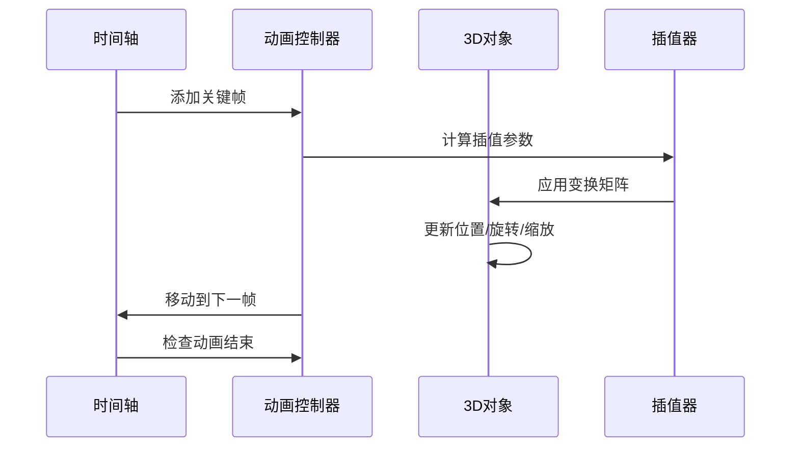
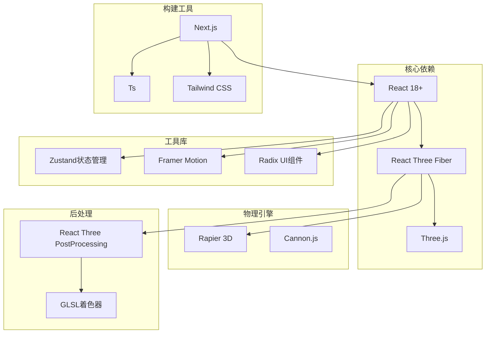

# 3D渲染系统

<cite>
**本文档引用的文件**
- [package.json](file://package.json)
- [next.config.ts](file://next.config.ts)
- [tsconfig.json](file://tsconfig.json)
- [src/app/layout.tsx](file://src/app/layout.tsx)
- [src/app/page.tsx](file://src/app/page.tsx)
- [src/components/experiment-ui/ExperimentContainer.tsx](file://src/components/experiment-ui/ExperimentContainer.tsx)
- [src/components/experiment-ui/SimulationController.tsx](file://src/components/experiment-ui/SimulationController.tsx)
- [src/components/experiment-ui/ExperimentControls.tsx](file://src/components/experiment-ui/ExperimentControls.tsx)
- [src/data/experiments.ts](file://src/data/experiments.ts)
- [src/experiments/3d-geometry-scene.tsx](file://src/experiments/3d-geometry-scene.tsx)
- [src/experiments/3d-geometry-page.tsx](file://src/experiments/3d-geometry-page.tsx)
- [src/utils/physics.ts](file://src/utils/physics.ts)
</cite>

## 目录
1. [引言](#引言)
2. [项目结构](#项目结构)
3. [核心组件](#核心组件)
4. [架构概览](#架构概览)
5. [详细组件分析](#详细组件分析)
6. [依赖关系分析](#依赖关系分析)
7. [性能考虑](#性能考虑)
8. [故障排除指南](#故障排除指南)
9. [结论](#结论)

## 引言

ScienceLab3D是一个基于React和Three.js构建的科学实验3D可视化平台。该项目旨在为科学教育提供沉浸式的3D交互体验，涵盖化学、物理、生物等多个学科领域的复杂概念可视化。

本项目采用现代Web技术栈，结合React的组件化开发模式与Three.js的强大3D渲染能力，为用户提供直观的科学实验模拟环境。系统支持多种实验类型的3D可视化，包括分子结构、物理运动、几何变换等复杂的科学现象展示。

## 项目结构

项目采用模块化的组织结构，主要分为以下几个核心部分：

**图表来源**
- [src/app/layout.tsx](file://src/app/layout.tsx)
- [src/app/page.tsx](file://src/app/page.tsx)
- [src/components/experiment-ui/ExperimentContainer.tsx](file://src/components/experiment-ui/ExperimentContainer.tsx)

**章节来源**
- [src/app/layout.tsx](file://src/app/layout.tsx)
- [src/app/page.tsx](file://src/app/page.tsx)
- [src/data/experiments.ts](file://src/data/experiments.ts)

## 核心组件

### 渲染引擎集成

项目采用React Three Fiber作为Three.js的React绑定库，实现了声明式的3D场景管理。核心集成点包括：

- **场景容器**: 使用Canvas组件作为3D场景的根容器
- **相机管理**: 自动化的透视相机和正交相机切换
- **渲染器配置**: 高质量的渲染参数设置
- **后处理管道**: 基于React Three PostProcessing的实时效果链

### 实验场景系统

每个科学实验都有专门的场景组件，负责：
- 场景初始化和生命周期管理
- 物体创建和动态更新
- 用户交互事件处理
- 性能优化和资源管理

### 控制面板系统

提供统一的实验控制界面，包括：
- 播放/暂停/重置功能
- 参数调节滑块
- 实时数据显示
- 视觉反馈机制

**章节来源**
- [src/experiments/3d-geometry-scene.tsx](file://src/experiments/3d-geometry-scene.tsx)
- [src/components/experiment-ui/ExperimentContainer.tsx](file://src/components/experiment-ui/ExperimentContainer.tsx)
- [src/components/experiment-ui/SimulationController.tsx](file://src/components/experiment-ui/SimulationController.tsx)

## 架构概览

系统采用分层架构设计，确保了良好的可维护性和扩展性：

**图表来源**
- [src/experiments/3d-geometry-scene.tsx](file://src/experiments/3d-geometry-scene.tsx)
- [src/components/experiment-ui/ExperimentControls.tsx](file://src/components/experiment-ui/ExperimentControls.tsx)

## 详细组件分析

### 场景管理系统

场景管理系统是整个3D渲染系统的核心，负责协调所有3D元素的创建、更新和销毁。

#### 场景初始化流程

**图表来源**
- [src/experiments/3d-geometry-scene.tsx](file://src/experiments/3d-geometry-scene.tsx)
- [src/components/experiment-ui/ExperimentContainer.tsx](file://src/components/experiment-ui/ExperimentContainer.tsx)

#### 对象创建和管理

场景管理系统采用工厂模式创建各种3D对象：

**图表来源**
- [src/experiments/3d-geometry-scene.tsx](file://src/experiments/3d-geometry-scene.tsx)

#### 渲染循环优化

系统实现了高效的渲染循环，包含以下优化策略：

- **按需渲染**: 只有在场景发生变化时才触发渲染
- **帧率控制**: 动态调整渲染频率以平衡性能和流畅度
- **批量更新**: 将多个对象的更新合并到单个渲染周期
- **内存池**: 复用频繁创建和销毁的对象

**章节来源**
- [src/experiments/3d-geometry-scene.tsx](file://src/experiments/3d-geometry-scene.tsx)

### 材质系统设计

材质系统是实现高质量视觉效果的关键组件，支持多种材质类型和着色器配置。

#### 材质类型选择策略

**图表来源**
- [src/experiments/3d-geometry-scene.tsx](file://src/experiments/3d-geometry-scene.tsx)

#### 光照系统配置

光照系统采用多层次配置，支持不同场景的光照需求：

- **环境光**: 提供基础的全局照明
- **方向光**: 模拟太阳光等平行光源
- **点光源**: 用于局部高亮和强调效果
- **聚光灯**: 创建聚焦的照明区域

#### 着色器配置

系统支持自定义着色器程序，允许实现特殊的视觉效果：

- **顶点着色器**: 控制几何体的变形和动画
- **片段着色器**: 实现复杂的表面效果和材质属性
- **着色器组合**: 支持多着色器效果的叠加

**章节来源**
- [src/experiments/3d-geometry-scene.tsx](file://src/experiments/3d-geometry-scene.tsx)

### 动画系统实现

动画系统提供了三种主要的动画类型，满足不同科学实验的需求。

#### 关键帧动画系统

关键帧动画用于精确控制物体的运动轨迹和形态变化：

**图表来源**
- [src/experiments/3d-geometry-scene.tsx](file://src/experiments/3d-geometry-scene.tsx)

#### 物理驱动动画

物理驱动动画通过物理引擎实现真实的物理行为：

- **刚体动力学**: 处理物体的运动和碰撞
- **约束系统**: 实现关节和连接关系
- **流体模拟**: 支持液体和气体的模拟
- **粒子系统**: 创建烟雾、火焰等效果

#### 用户交互动画

用户交互动画响应用户的操作输入：

- **鼠标交互**: 支持旋转、缩放、平移操作
- **触摸手势**: 适配移动设备的触摸操作
- **键盘控制**: 提供快捷键和热键支持
- **VR支持**: 扩展到虚拟现实环境

**章节来源**
- [src/experiments/3d-geometry-scene.tsx](file://src/experiments/3d-geometry-scene.tsx)
- [src/utils/physics.ts](file://src/utils/physics.ts)

### 性能优化策略

系统实施了多层次的性能优化策略，确保在各种硬件配置下都能提供流畅的用户体验。

#### 渲染优化

- **视锥剔除**: 只渲染可见的3D对象
- **细节层次**: 根据距离自动调整模型细节
- **实例化渲染**: 批量渲染相似的对象
- **渲染队列优化**: 合理安排渲染顺序减少状态切换

#### 内存管理

- **对象池**: 复用频繁创建的对象实例
- **纹理压缩**: 使用合适的纹理格式减少内存占用
- **延迟加载**: 按需加载资源避免内存峰值
- **垃圾回收**: 定期清理不再使用的资源

#### GPU利用优化

- **着色器优化**: 减少着色器的复杂度和分支
- **批处理**: 合并多个小对象的渲染调用
- **多重采样**: 在质量与性能间找到平衡点
- **后处理优化**: 合理配置后处理效果的强度

**章节来源**
- [src/experiments/3d-geometry-scene.tsx](file://src/experiments/3d-geometry-scene.tsx)

## 依赖关系分析

项目的技术栈基于现代Web开发最佳实践构建，各依赖项之间存在清晰的层次关系。

**图表来源**
- [package.json](file://package.json)
- [next.config.ts](file://next.config.ts)

**章节来源**
- [package.json](file://package.json)
- [tsconfig.json](file://tsconfig.json)

## 性能考虑

### 渲染性能监控

系统内置了完整的性能监控机制：

- **帧率监控**: 实时显示当前帧率和性能指标
- **内存使用**: 跟踪GPU和CPU内存使用情况
- **渲染统计**: 统计渲染调用次数和绘制命令数量
- **对象计数**: 跟踪场景中对象的数量和类型分布

### 优化建议

1. **资源优化**
   - 使用纹理图集减少纹理切换
   - 合并相似材质避免重复创建
   - 实施LOD系统根据距离调整细节

2. **代码优化**
   - 避免在渲染循环中进行昂贵的操作
   - 使用对象池复用临时对象
   - 合理使用缓存避免重复计算

3. **硬件优化**
   - 根据设备能力调整渲染质量
   - 实施渐进式加载策略
   - 优化着色器程序减少分支

## 故障排除指南

### 常见问题诊断

#### 渲染异常问题

**症状**: 场景无法正常显示或显示异常

**可能原因**:
- WebGL不兼容或禁用
- 着色器编译错误
- 资源加载失败
- 内存不足

**解决步骤**:
1. 检查浏览器对WebGL的支持
2. 查看控制台中的错误信息
3. 验证着色器代码的正确性
4. 确认所有资源文件的可用性

#### 性能问题

**症状**: 场景运行缓慢或卡顿

**诊断方法**:
1. 使用浏览器开发者工具的性能面板
2. 检查帧率和内存使用情况
3. 分析渲染调用的开销
4. 识别性能瓶颈所在

**优化措施**:
1. 减少场景中的对象数量
2. 降低纹理分辨率
3. 简化着色器程序
4. 实施适当的缓存策略

#### 交互问题

**症状**: 用户交互无响应或响应异常

**排查步骤**:
1. 验证事件监听器的正确性
2. 检查对象的可拾取性设置
3. 确认相机控制的启用状态
4. 测试不同输入设备的兼容性

**解决方案**:
1. 修复事件处理逻辑
2. 调整交互检测的灵敏度
3. 实现输入设备的降级方案
4. 添加适当的错误处理机制

**章节来源**
- [src/experiments/3d-geometry-scene.tsx](file://src/experiments/3d-geometry-scene.tsx)
- [src/components/experiment-ui/ExperimentControls.tsx](file://src/components/experiment-ui/ExperimentControls.tsx)

## 结论

ScienceLab3D的3D渲染系统展现了现代Web 3D应用开发的最佳实践。通过合理的架构设计、完善的性能优化策略和丰富的交互功能，系统为科学教育提供了强大而直观的可视化工具。

系统的主要优势包括：

- **模块化设计**: 清晰的组件分离便于维护和扩展
- **高性能渲染**: 多层次的优化策略确保流畅的用户体验
- **丰富的交互**: 支持多种交互方式满足不同用户需求
- **可扩展性**: 灵活的架构为未来功能扩展奠定基础

随着Web技术的不断发展，该系统将继续演进，为科学教育领域提供更加先进和实用的3D可视化解决方案。