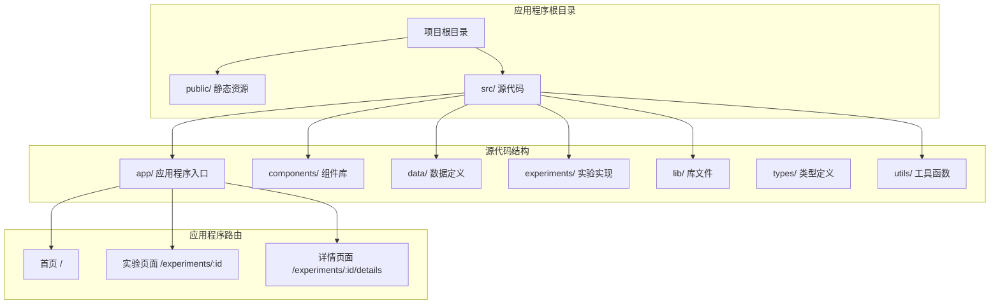
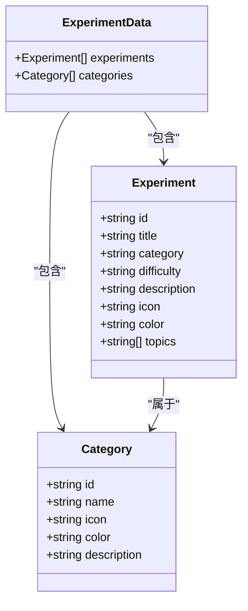
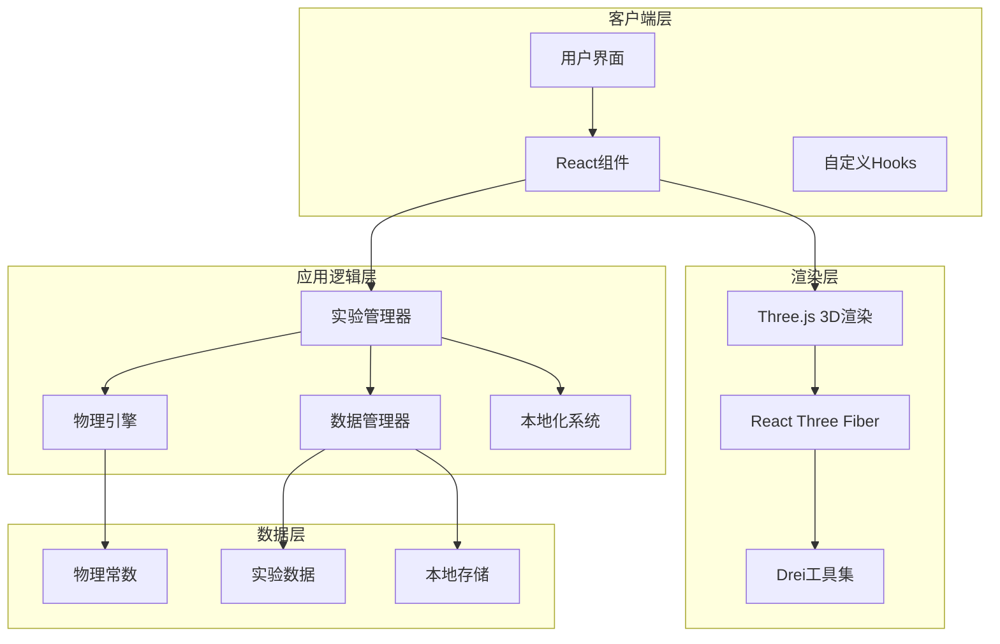
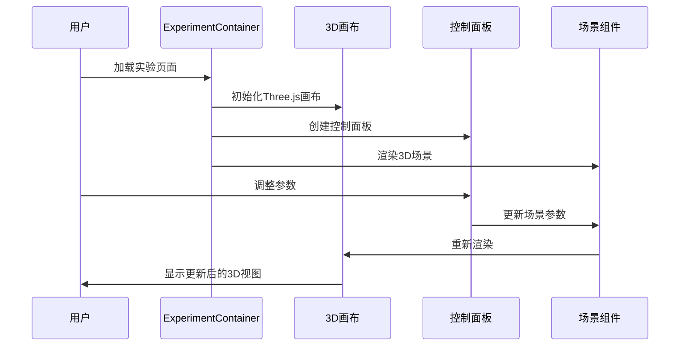
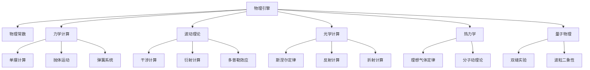
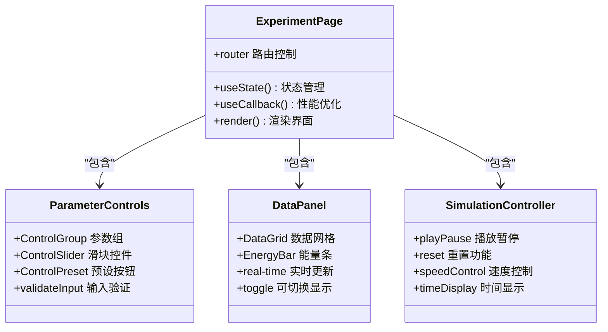
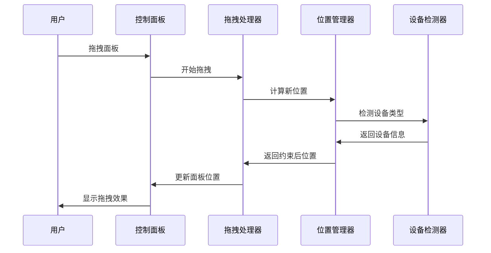

# Karpathy深度学习指南

<cite>
**本文档引用的文件**
- [README.md](file://README.md)
- [package.json](file://package.json)
- [src/app/layout.tsx](file://src/app/layout.tsx)
- [src/app/page.tsx](file://src/app/page.tsx)
- [src/data/experiments.ts](file://src/data/experiments.ts)
- [src/lib/i18n/locales.ts](file://src/lib/i18n/locales.ts)
- [src/lib/i18n/dictionaries/en.json](file://src/lib/i18n/dictionaries/en.json)
- [src/lib/i18n/dictionaries/zh-CN.json](file://src/lib/i18n/dictionaries/zh-CN.json)
- [src/components/experiment-ui/index.ts](file://src/components/experiment-ui/index.ts)
- [src/components/experiment-ui/ExperimentContainer.tsx](file://src/components/experiment-ui/ExperimentContainer.tsx)
- [src/components/experiment-ui/ControlPanel.tsx](file://src/components/experiment-ui/ControlPanel.tsx)
- [src/components/experiment-ui/DataPanel.tsx](file://src/components/experiment-ui/DataPanel.tsx)
- [src/components/experiment-ui/SimulationController.tsx](file://src/components/experiment-ui/SimulationController.tsx)
- [src/utils/physics.ts](file://src/utils/physics.ts)
- [src/experiments/pendulum-page.tsx](file://src/experiments/pendulum-page.tsx)
</cite>

## 目录
1. [项目简介](#项目简介)
2. [项目结构](#项目结构)
3. [核心组件](#核心组件)
4. [架构概览](#架构概览)
5. [详细组件分析](#详细组件分析)
6. [依赖分析](#依赖分析)
7. [性能考虑](#性能考虑)
8. [故障排除指南](#故障排除指南)
9. [结论](#结论)

## 项目简介

ScienceLab 3D是一个完全交互式的浏览器端3D科学实验室平台，提供40多个跨学科的科学实验，包括物理、化学、生物学和数学领域。该项目基于React 19和Next.js 15构建，使用Three.js和React Three Fiber进行3D图形渲染，为学生、教师和自学者提供了一个免费、开源且完全响应式的科学学习平台。

该项目的核心特色包括：
- **40+ 交互式实验**：涵盖物理、化学、生物和数学四大科学领域
- **实时控制系统**：通过滑块和控件调整变量，即时观察结果
- **3D可视化**：使用Three.js和React Three Fiber提供沉浸式3D体验
- **响应式设计**：支持桌面、平板和移动端设备
- **国际化支持**：支持英语和中文双语界面
- **暗黑/明亮主题**：用户友好的主题切换功能

## 项目结构

项目采用现代化的Next.js 15 App Router架构，具有清晰的模块化组织：



**图表来源**
- [src/app/layout.tsx:1-207](file://src/app/layout.tsx#L1-L207)
- [src/app/page.tsx:1-632](file://src/app/page.tsx#L1-L632)

**章节来源**
- [README.md:1-227](file://README.md#L1-L227)
- [package.json:1-38](file://package.json#L1-L38)

## 核心组件

### 实验数据管理系统

项目的核心是统一的实验数据管理，通过类型安全的接口定义了完整的实验信息结构：



**图表来源**
- [src/data/experiments.ts:1-514](file://src/data/experiments.ts#L1-L514)

### 国际化系统

项目实现了完整的多语言支持，支持英语和中文两种语言环境：

```mermaid
flowchart TD
LocaleDetection[检测用户语言偏好] --> CheckLocalStorage[检查本地存储]
CheckLocalStorage --> HasSaved[已保存语言设置?]
HasSaved --> |是| LoadSaved[加载保存的语言]
HasSaved --> |否| DetectBrowser[检测浏览器语言]
DetectBrowser --> SetDefault[设置默认语言(en)]
LoadSaved --> ApplyLocale[应用语言设置]
SetDefault --> ApplyLocale
ApplyLocale --> LoadDictionary[加载对应字典]
LoadDictionary --> RenderUI[渲染界面]
```

**图表来源**
- [src/lib/i18n/locales.ts:1-9](file://src/lib/i18n/locales.ts#L1-L9)
- [src/lib/i18n/dictionaries/en.json:1-264](file://src/lib/i18n/dictionaries/en.json#L1-L264)
- [src/lib/i18n/dictionaries/zh-CN.json:1-269](file://src/lib/i18n/dictionaries/zh-CN.json#L1-L269)

**章节来源**
- [src/data/experiments.ts:1-514](file://src/data/experiments.ts#L1-L514)
- [src/lib/i18n/locales.ts:1-9](file://src/lib/i18n/locales.ts#L1-L9)

## 架构概览

ScienceLab 3D采用了现代前端架构，结合了React的组件化开发和Next.js的服务端渲染优势：



**图表来源**
- [src/app/layout.tsx:1-207](file://src/app/layout.tsx#L1-L207)
- [src/utils/physics.ts:1-687](file://src/utils/physics.ts#L1-L687)

## 详细组件分析

### 实验容器组件

ExperimentContainer是所有实验场景的核心容器组件，提供了统一的3D渲染环境和控制面板：



**图表来源**
- [src/components/experiment-ui/ExperimentContainer.tsx:1-373](file://src/components/experiment-ui/ExperimentContainer.tsx#L1-L373)

该组件的关键特性包括：
- **响应式布局**：自动适配不同屏幕尺寸
- **拖拽控制**：支持鼠标和触摸操作
- **性能优化**：智能的渲染和内存管理
- **设备检测**：针对移动设备进行特殊优化

**章节来源**
- [src/components/experiment-ui/ExperimentContainer.tsx:1-373](file://src/components/experiment-ui/ExperimentContainer.tsx#L1-L373)

### 物理引擎系统

项目内置了完整的物理计算引擎，涵盖了从基础物理学到复杂科学现象的广泛范围：



**图表来源**
- [src/utils/physics.ts:1-687](file://src/utils/physics.ts#L1-L687)

**章节来源**
- [src/utils/physics.ts:1-687](file://src/utils/physics.ts#L1-L687)

### 实验页面架构

每个实验都遵循统一的页面架构模式，确保用户体验的一致性：



**图表来源**
- [src/experiments/pendulum-page.tsx:1-214](file://src/experiments/pendulum-page.tsx#L1-L214)

**章节来源**
- [src/experiments/pendulum-page.tsx:1-214](file://src/experiments/pendulum-page.tsx#L1-L214)

### 控制面板系统

项目实现了灵活的控制面板系统，支持多种交互模式：



**图表来源**
- [src/components/experiment-ui/ControlPanel.tsx:1-300](file://src/components/experiment-ui/ControlPanel.tsx#L1-L300)

**章节来源**
- [src/components/experiment-ui/ControlPanel.tsx:1-300](file://src/components/experiment-ui/ControlPanel.tsx#L1-L300)

## 依赖分析

项目使用了现代化的前端技术栈，具有清晰的依赖关系：

```mermaid
graph TB
subgraph "核心框架"
NextJS[Next.js 15]
React[React 19]
TypeScript[TypeScript]
end
subgraph "3D图形"
ThreeJS[Three.js 0.184]
Fiber[React Three Fiber]
Drei[@react-three/drei]
PostProcessing[@react-three/postprocessing]
end
subgraph "动画和UI"
FramerMotion[Framer Motion 12.40]
TailwindCSS[Tailwind CSS 4.0]
LucideReact[Lucide React 1.18]
end
subgraph "国际化"
NextIntl[next-intl 4.13]
end
subgraph "开发工具"
CrossEnv[cross-env 10.1]
PostCSS[PostCSS 8.5]
DevDependencies[开发依赖]
end
NextJS --> React
NextJS --> NextIntl
React --> Fiber
Fiber --> ThreeJS
Fiber --> Drei
React --> FramerMotion
React --> LucideReact
TailwindCSS --> PostCSS
```

**图表来源**
- [package.json:1-38](file://package.json#L1-L38)

**章节来源**
- [package.json:1-38](file://package.json#L1-L38)

## 性能考虑

项目在多个层面进行了性能优化：

### 渲染性能优化
- **设备检测**：根据设备能力调整渲染质量
- **像素比限制**：移动端限制像素比避免过度渲染
- **阴影优化**：合理配置阴影贴图大小
- **抗锯齿策略**：桌面端启用抗锯齿，移动端禁用

### 内存管理
- **组件卸载清理**：自动清理事件监听器和定时器
- **状态管理优化**：使用useCallback减少不必要的重渲染
- **资源池化**：复用Three.js对象避免频繁创建销毁

### 网络优化
- **按需加载**：实验组件按需加载
- **缓存策略**：利用浏览器缓存静态资源
- **CDN集成**：外部依赖通过CDN加速

## 故障排除指南

### 常见问题及解决方案

**3D场景不显示**
1. 检查浏览器是否支持WebGL
2. 确认GPU驱动程序正常
3. 尝试禁用硬件加速测试

**性能问题**
1. 关闭不必要的实验标签页
2. 降低渲染质量设置
3. 清理浏览器缓存
4. 更新显卡驱动程序

**国际化问题**
1. 检查本地存储的语言设置
2. 清除浏览器Cookie和本地存储
3. 刷新页面强制重新加载字典

**移动端兼容性**
1. 确保触摸事件正常工作
2. 检查手势操作是否被阻止
3. 尝试不同的浏览器

**章节来源**
- [src/components/experiment-ui/ExperimentContainer.tsx:78-121](file://src/components/experiment-ui/ExperimentContainer.tsx#L78-L121)

## 结论

ScienceLab 3D项目展现了现代前端开发的最佳实践，成功地将复杂的科学概念通过交互式3D可视化呈现给用户。项目的技术架构清晰，组件化程度高，具有良好的可维护性和扩展性。

项目的主要优势包括：
- **教育价值**：为科学教育提供了创新的数字化工具
- **技术先进**：采用最新的前端技术和3D图形渲染
- **用户体验**：直观的界面设计和流畅的交互体验
- **国际化支持**：支持多语言，具有全球化的视野
- **开源生态**：基于优秀的开源技术栈，社区活跃

未来的发展方向可以包括：
- 扩展更多科学领域的实验内容
- 增强VR/AR支持
- 集成更多的学习分析功能
- 开发移动端专用的应用版本

该项目不仅是一个技术展示，更是科学教育数字化转型的重要实践，为未来的教育科技发展提供了宝贵的参考经验。