# Three.js交互技能

<cite>
**本文档引用的文件**
- [README.md](file://README.md)
- [package.json](file://package.json)
- [src/app/layout.tsx](file://src/app/layout.tsx)
- [src/data/experiments.ts](file://src/data/experiments.ts)
- [src/components/experiment-ui/index.ts](file://src/components/experiment-ui/index.ts)
- [src/experiments/3d-geometry-scene.tsx](file://src/experiments/3d-geometry-scene.tsx)
- [src/experiments/3d-geometry-page.tsx](file://src/experiments/3d-geometry-page.tsx)
- [src/components/experiment-ui/ExperimentContainer.tsx](file://src/components/experiment-ui/ExperimentContainer.tsx)
- [src/components/experiment-ui/SimulationController.tsx](file://src/components/experiment-ui/SimulationController.tsx)
- [src/components/experiment-ui/ExperimentControls.tsx](file://src/components/experiment-ui/ExperimentControls.tsx)
- [src/app/page.tsx](file://src/app/page.tsx)
- [src/lib/i18n/locales.ts](file://src/lib/i18n/locales.ts)
- [src/lib/i18n/dictionaries/en.json](file://src/lib/i18n/dictionaries/en.json)
- [src/utils/physics.ts](file://src/utils/physics.ts)
- [next.config.ts](file://next.config.ts)
</cite>

## 目录
1. [项目概述](#项目概述)
2. [技术架构](#技术架构)
3. [Three.js交互系统](#threethree-js交互系统)
4. [实验场景架构](#实验场景架构)
5. [用户界面组件](#用户界面组件)
6. [物理引擎集成](#物理引擎集成)
7. [国际化支持](#国际化支持)
8. [性能优化策略](#性能优化策略)
9. [开发指南](#开发指南)
10. [总结](#总结)

## 项目概述

ScienceLab 3D是一个基于Three.js的交互式3D科学学习平台，提供40多个跨学科的虚拟实验。该项目采用现代Web技术栈构建，专注于为学生、教师和自学者提供沉浸式的科学学习体验。

### 核心特性

- **40+ 交互式实验**：涵盖物理、化学、生物和数学四个学科领域
- **实时控制面板**：通过滑块、按钮等控件调整实验参数
- **3D可视化渲染**：使用Three.js和React Three Fiber实现高质量图形渲染
- **响应式设计**：支持桌面、平板和移动设备访问
- **暗/亮主题模式**：可切换的用户界面主题
- **收藏功能**：用户可以保存喜欢的实验
- **智能搜索**：按名称、主题或学科搜索实验

### 技术栈

项目采用以下核心技术栈：

- **前端框架**：Next.js 15 + React 19
- **3D图形**：Three.js 0.184 + React Three Fiber
- **动画库**：Framer Motion
- **UI框架**：Tailwind CSS
- **图标库**：Lucide React
- **状态管理**：React Hooks + LocalStorage
- **类型安全**：TypeScript

## 技术架构

### 整体架构设计

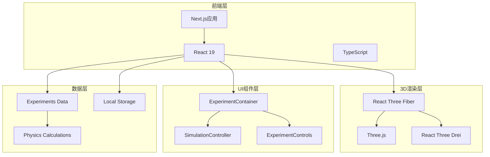

**图表来源**
- [src/app/layout.tsx:1-207](file://src/app/layout.tsx#L1-L207)
- [package.json:10-22](file://package.json#L10-L22)

### 依赖关系分析

```mermaid
graph LR
subgraph "核心依赖"
three[three@^0.184.0]
r3f[@react-three/fiber@^9.1.0]
drei[@react-three/drei@^10.0.0]
next[next@^15.4.4]
end
subgraph "工具库"
framer[framer-motion@^12.40.0]
lucide[lucide-react@^1.18.0]
tailwind[tailwindcss@^4.0.0]
end
subgraph "开发依赖"
typescript[typescript@^5.8.0]
types_three[@types/three@^0.184.1]
postcss[postcss@^8.5.15]
end
three --> r3f
r3f --> drei
next --> r3f
next --> drei
```

**图表来源**
- [package.json:10-37](file://package.json#L10-L37)

**章节来源**
- [package.json:1-38](file://package.json#L1-L38)
- [next.config.ts:1-9](file://next.config.ts#L1-L9)

## Three.js交互系统

### 3D场景基础架构

项目中的3D交互系统基于React Three Fiber构建，提供了完整的3D场景管理能力：

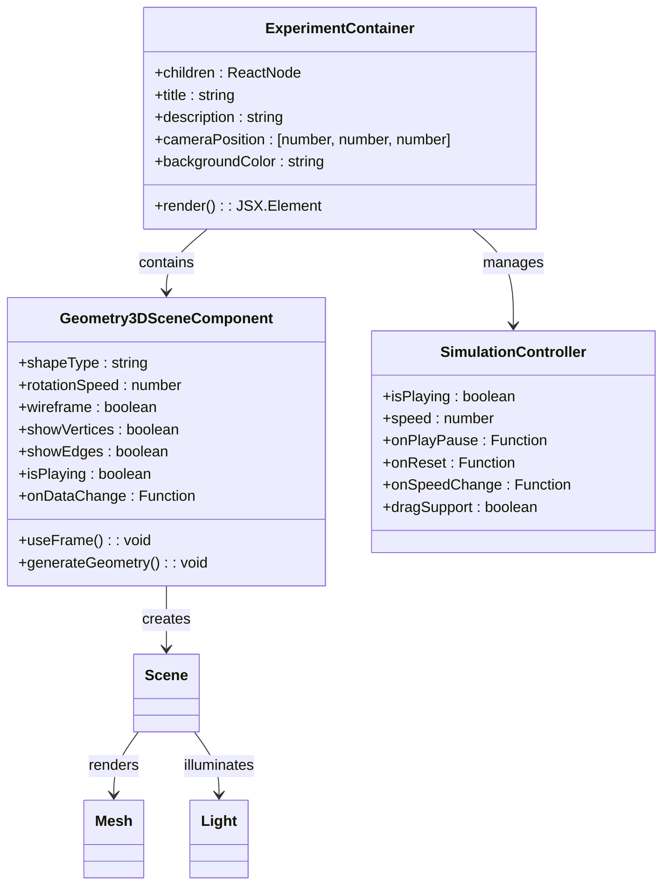

**图表来源**
- [src/components/experiment-ui/ExperimentContainer.tsx:55-373](file://src/components/experiment-ui/ExperimentContainer.tsx#L55-L373)
- [src/experiments/3d-geometry-scene.tsx:30-243](file://src/experiments/3d-geometry-scene.tsx#L30-L243)
- [src/components/experiment-ui/SimulationController.tsx:27-228](file://src/components/experiment-ui/SimulationController.tsx#L27-L228)

### 场景渲染流程

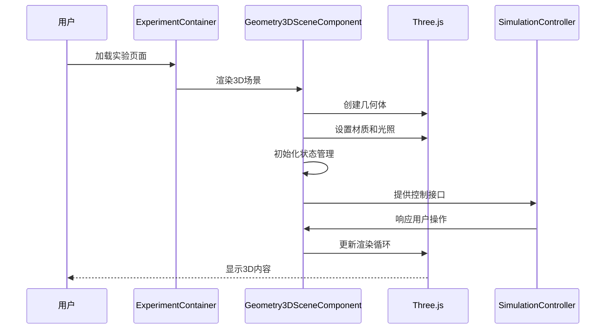

**图表来源**
- [src/experiments/3d-geometry-page.tsx:18-190](file://src/experiments/3d-geometry-page.tsx#L18-L190)
- [src/experiments/3d-geometry-scene.tsx:131-153](file://src/experiments/3d-geometry-scene.tsx#L131-L153)

### 交互控制机制

项目实现了多层次的交互控制：

1. **相机控制系统**：支持拖拽旋转、缩放和平移
2. **实验控制面板**：实时调整实验参数
3. **模拟控制器**：播放/暂停、重置、速度调节
4. **数据可视化**：实时显示实验数据

**章节来源**
- [src/components/experiment-ui/ExperimentContainer.tsx:163-180](file://src/components/experiment-ui/ExperimentContainer.tsx#L163-L180)
- [src/components/experiment-ui/SimulationController.tsx:36-144](file://src/components/experiment-ui/SimulationController.tsx#L36-L144)

## 实验场景架构

### 3D几何体实验

3D几何体实验是项目的核心功能之一，展示了五种柏拉图立体的交互式可视化：

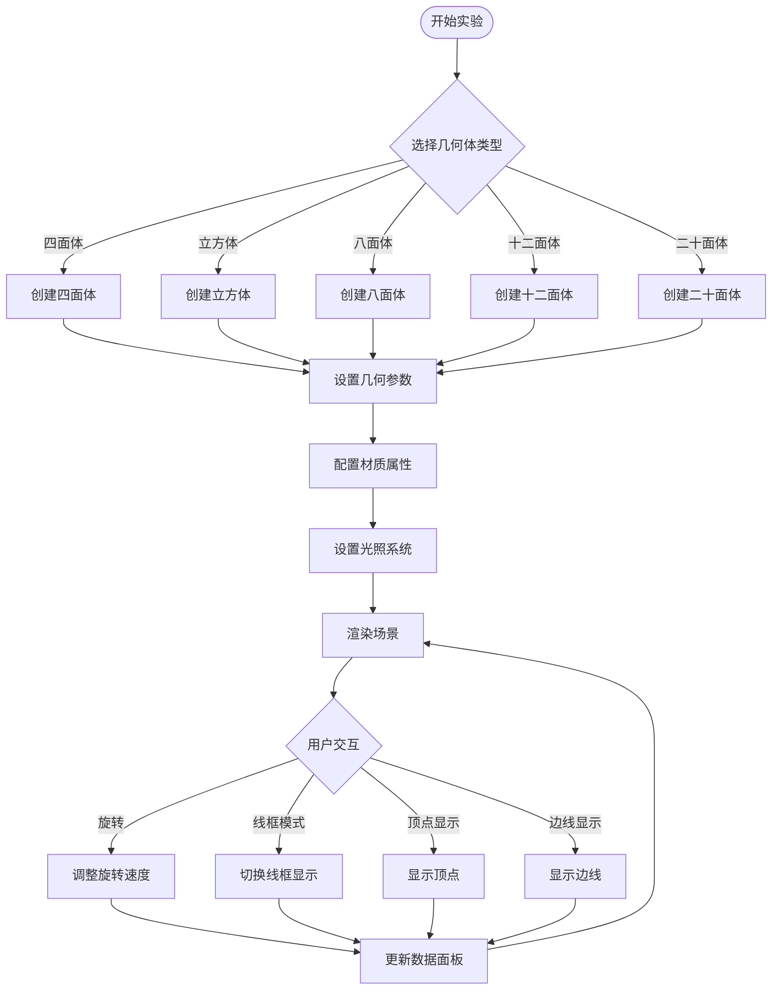

**图表来源**
- [src/experiments/3d-geometry-scene.tsx:49-70](file://src/experiments/3d-geometry-scene.tsx#L49-L70)
- [src/experiments/3d-geometry-page.tsx:42-120](file://src/experiments/3d-geometry-page.tsx#L42-L120)

### 柏拉图立体数据结构

每个柏拉图立体都有固定的拓扑属性：

| 几何体 | 顶点数(V) | 边数(E) | 面数(F) | 欧拉示性数(χ) |
|--------|-----------|---------|---------|---------------|
| 四面体 | 4         | 6       | 4       | 2             |
| 立方体 | 8         | 12      | 6       | 2             |
| 八面体 | 6         | 12      | 8       | 2             |
| 十二面体 | 20      | 30      | 12      | 2             |
| 二十面体 | 12      | 30      | 20      | 2             |

### 材质和光照系统

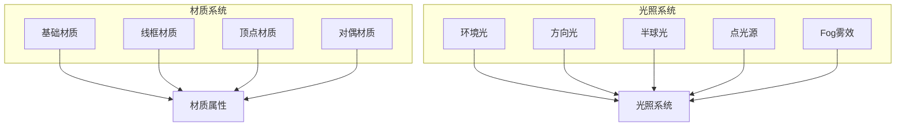

**图表来源**
- [src/experiments/3d-geometry-scene.tsx:168-179](file://src/experiments/3d-geometry-scene.tsx#L168-L179)
- [src/experiments/3d-geometry-scene.tsx:157-161](file://src/experiments/3d-geometry-scene.tsx#L157-L161)

**章节来源**
- [src/experiments/3d-geometry-scene.tsx:1-243](file://src/experiments/3d-geometry-scene.tsx#L1-L243)
- [src/experiments/3d-geometry-page.tsx:1-190](file://src/experiments/3d-geometry-page.tsx#L1-L190)

## 用户界面组件

### 实验容器系统

ExperimentContainer是所有3D实验的基础容器，提供了统一的界面布局和交互控制：

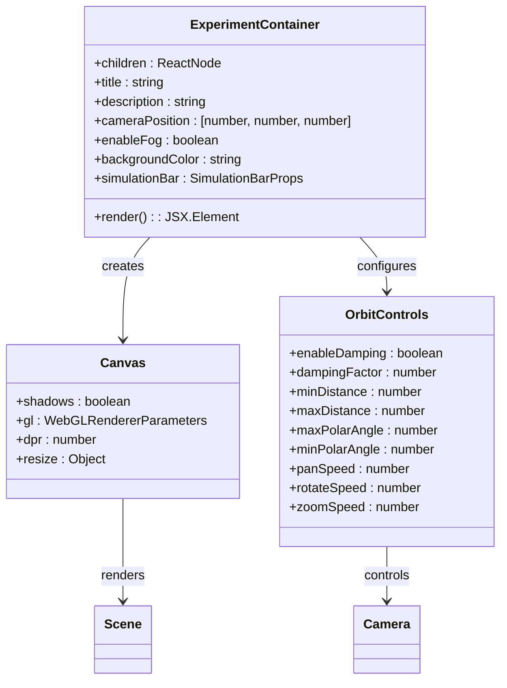

**图表来源**
- [src/components/experiment-ui/ExperimentContainer.tsx:55-207](file://src/components/experiment-ui/ExperimentContainer.tsx#L55-L207)

### 控制面板组件

项目提供了丰富的UI组件用于实验控制：

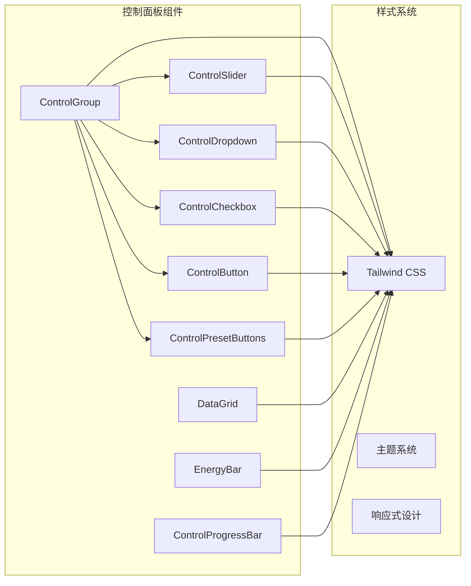

**图表来源**
- [src/components/experiment-ui/ExperimentControls.tsx:13-498](file://src/components/experiment-ui/ExperimentControls.tsx#L13-L498)

### 浮动控制面板

FloatingControlPanel提供了可拖拽的实验参数控制界面：

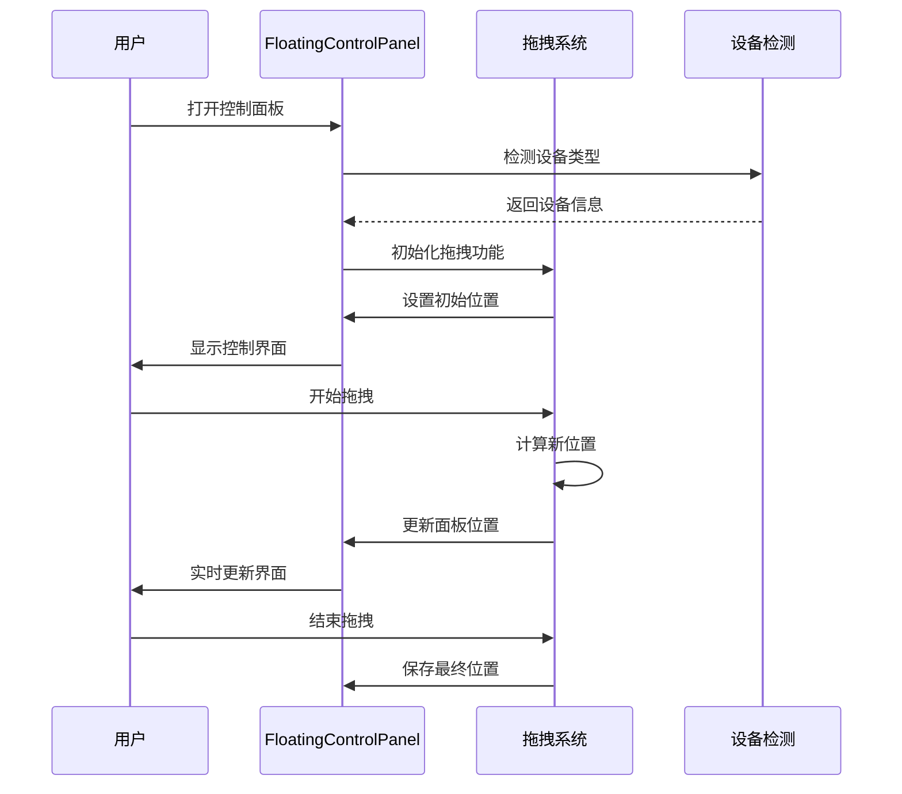

**图表来源**
- [src/components/experiment-ui/ExperimentControls.tsx:428-455](file://src/components/experiment-ui/ExperimentControls.tsx#L428-L455)

**章节来源**
- [src/components/experiment-ui/ExperimentContainer.tsx:1-373](file://src/components/experiment-ui/ExperimentContainer.tsx#L1-L373)
- [src/components/experiment-ui/ExperimentControls.tsx:1-498](file://src/components/experiment-ui/ExperimentControls.tsx#L1-L498)

## 物理引擎集成

### 物理计算模块

项目集成了全面的物理计算函数库，为各种科学实验提供精确的物理模拟：

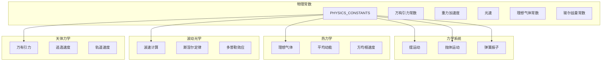

**图表来源**
- [src/utils/physics.ts:10-22](file://src/utils/physics.ts#L10-L22)

### 实际应用场景

以3D几何体实验为例，物理引擎主要应用于：

1. **旋转动力学**：计算不同几何体的旋转惯量和角动量
2. **拓扑分析**：验证欧拉公式 V-E+F=2
3. **对偶关系**：展示正多面体与其对偶体的关系
4. **空间几何**：计算顶点、边和面的空间分布

### 数学公式实现

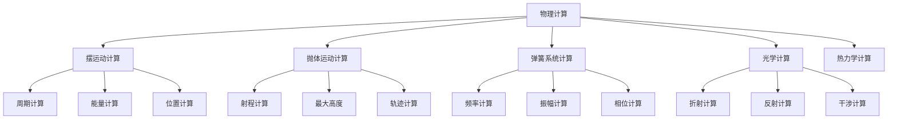

**图表来源**
- [src/utils/physics.ts:28-63](file://src/utils/physics.ts#L28-L63)

**章节来源**
- [src/utils/physics.ts:1-687](file://src/utils/physics.ts#L1-L687)

## 国际化支持

### 多语言架构

项目实现了完整的国际化支持，当前支持英语和中文两种语言：

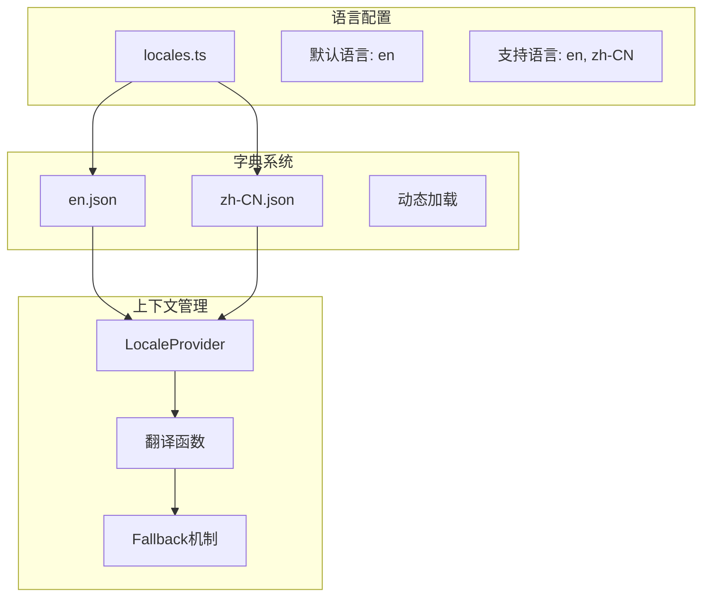

**图表来源**
- [src/lib/i18n/locales.ts:1-9](file://src/lib/i18n/locales.ts#L1-L9)
- [src/lib/i18n/dictionaries/en.json:1-264](file://src/lib/i18n/dictionaries/en.json#L1-L264)

### 字典结构设计

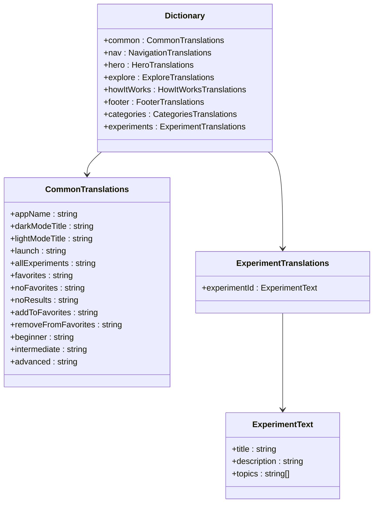

**图表来源**
- [src/lib/i18n/dictionaries/en.json:1-264](file://src/lib/i18n/dictionaries/en.json#L1-L264)

**章节来源**
- [src/lib/i18n/locales.ts:1-9](file://src/lib/i18n/locales.ts#L1-L9)
- [src/lib/i18n/dictionaries/en.json:1-264](file://src/lib/i18n/dictionaries/en.json#L1-L264)

## 性能优化策略

### 渲染性能优化

项目采用了多项性能优化措施来确保流畅的3D渲染体验：

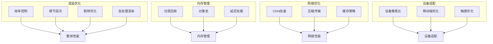

### 代码分割和懒加载

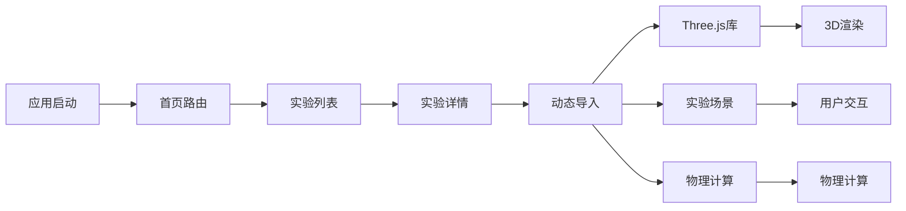

### 内存管理策略

项目实现了智能的内存管理机制：

1. **组件卸载清理**：自动清理Three.js资源
2. **事件监听器管理**：防止内存泄漏
3. **定时器清理**：及时清除定时任务
4. **图像资源管理**：优化纹理加载

## 开发指南

### 项目结构说明

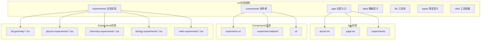

**图表来源**
- [src/app/layout.tsx:1-207](file://src/app/layout.tsx#L1-L207)
- [src/data/experiments.ts:12-514](file://src/data/experiments.ts#L12-L514)

### 新增实验步骤

1. **定义实验数据**：在`src/data/experiments.ts`中添加新的实验条目
2. **创建场景组件**：在`src/experiments/`目录下创建对应的场景文件
3. **实现页面逻辑**：创建实验页面组件
4. **添加路由配置**：更新路由映射
5. **测试和调试**：确保功能正常运行

### 开发环境设置

```bash
# 克隆项目
git clone https://github.com/rudra496/sciencelab3d.git
cd sciencelab3d

# 安装依赖
npm install

# 启动开发服务器
npm run dev

# 访问 http://localhost:3000
```

### 构建和部署

```bash
# 生产环境构建
npm run build

# 启动生产服务器
npm run start

# 部署到Vercel
vercel
```

**章节来源**
- [README.md:108-135](file://README.md#L108-L135)

## 总结

ScienceLab 3D项目展现了现代Web 3D应用开发的最佳实践，成功地将复杂的科学概念通过直观的3D可视化呈现给用户。项目的主要优势包括：

### 技术成就

1. **完整的3D生态系统**：从基础的几何渲染到复杂的物理模拟
2. **优秀的用户体验**：直观的交互设计和流畅的性能表现
3. **可扩展的架构**：模块化的组件设计便于功能扩展
4. **国际化支持**：完善的多语言解决方案

### 学习价值

该项目为开发者提供了宝贵的Three.js应用开发经验，包括：
- React Three Fiber的实际应用
- 复杂3D场景的性能优化
- 用户交互设计的最佳实践
- 科学可视化的技术实现

### 未来发展方向

1. **VR/AR集成**：探索虚拟现实和增强现实的应用
2. **云端协作**：实现实验室的在线协作功能
3. **AI辅助教学**：利用人工智能提供个性化学习体验
4. **更多学科覆盖**：扩展到更多科学领域的实验

ScienceLab 3D不仅是一个教育工具，更是Web 3D技术应用的优秀范例，为未来的科学教育数字化转型提供了重要参考。