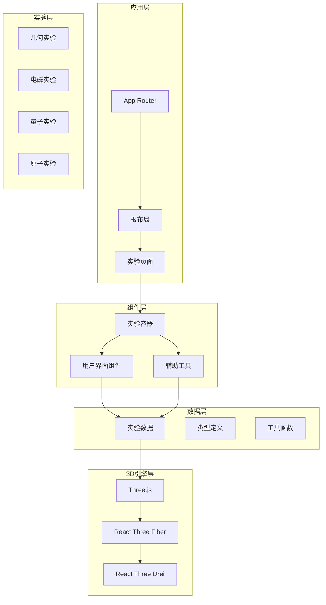
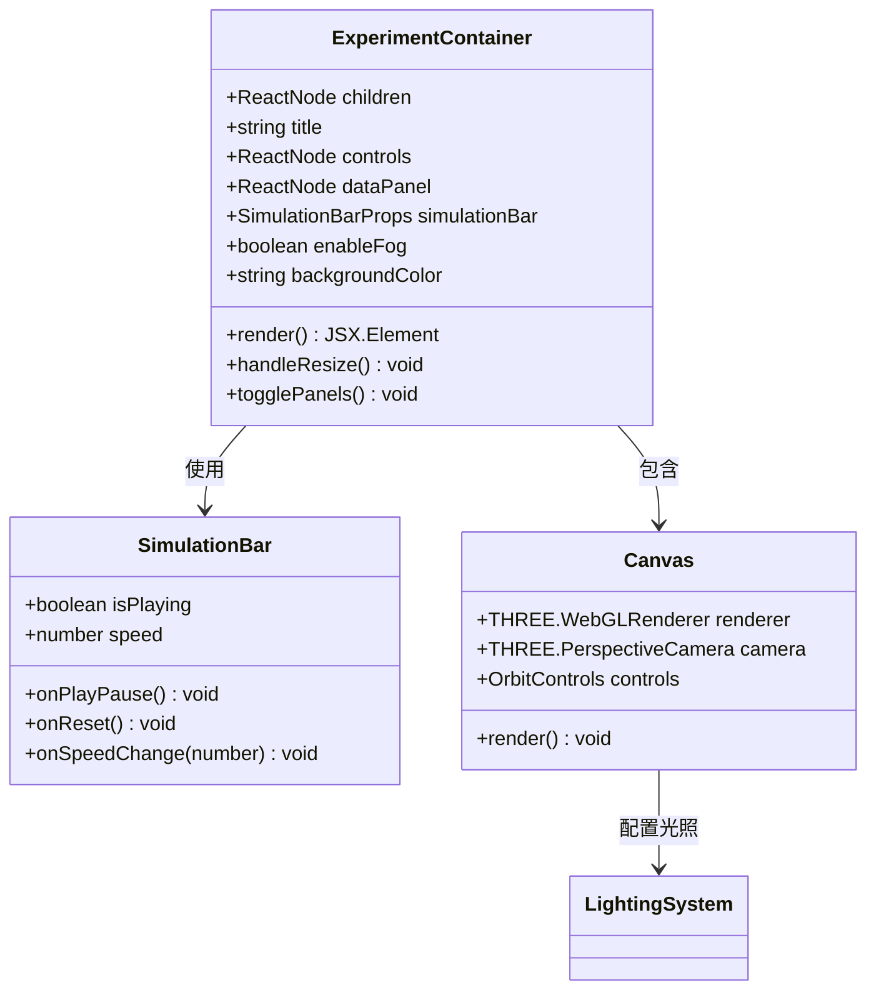
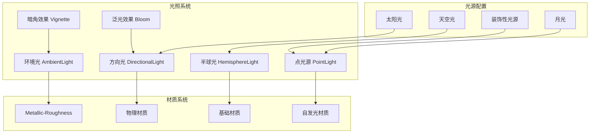
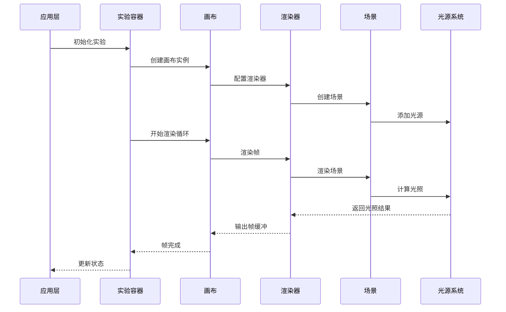
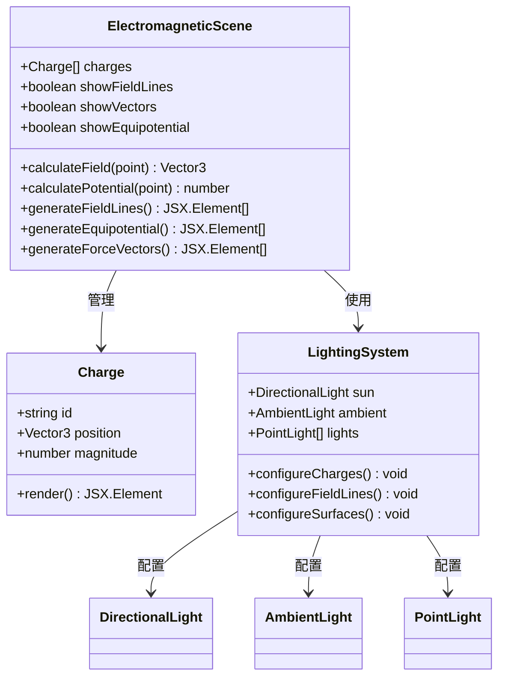
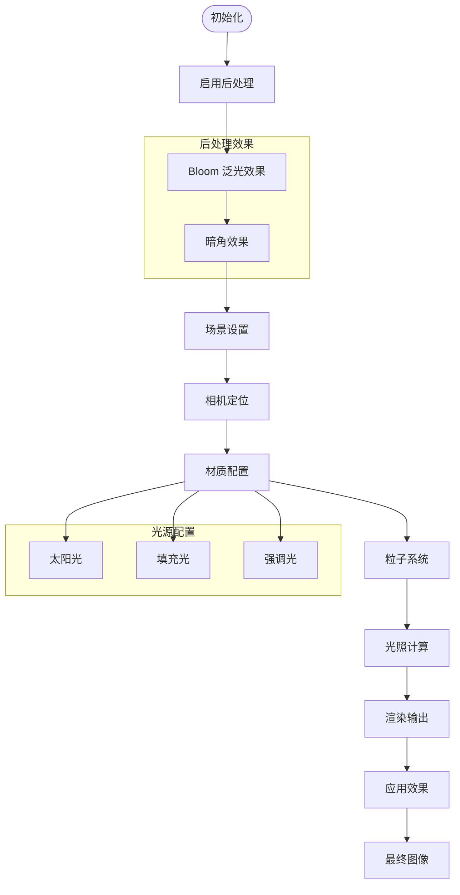
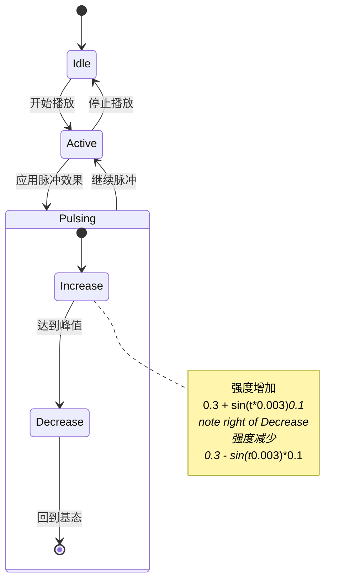
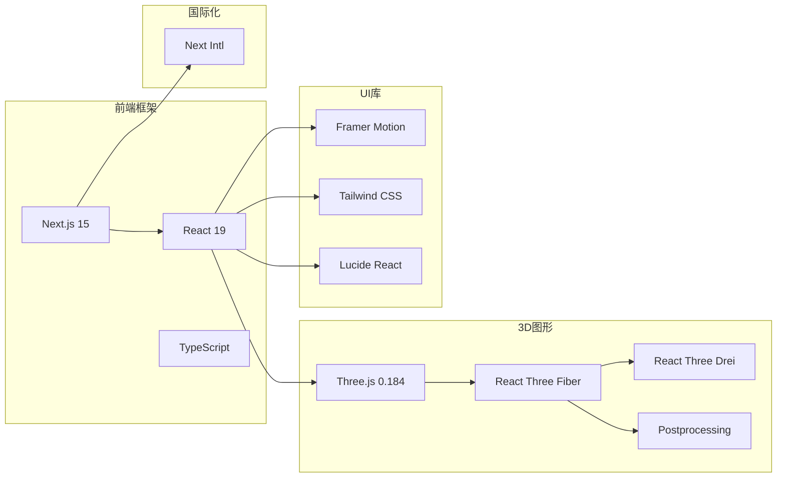

# Three.js光照技能

<cite>
**本文档引用的文件**
- [README.md](file://README.md)
- [package.json](file://package.json)
- [layout.tsx](file://src/app/layout.tsx)
- [experiments.ts](file://src/data/experiments.ts)
- [ExperimentContainer.tsx](file://src/components/experiment-ui/ExperimentContainer.tsx)
- [3d-geometry-scene.tsx](file://src/experiments/3d-geometry-scene.tsx)
- [electromagnetic-scene.tsx](file://src/experiments/electromagnetic-scene.tsx)
- [double-slit-scene.tsx](file://src/experiments/double-slit-scene.tsx)
- [atomic-structure-scene.tsx](file://src/experiments/atomic-structure-scene.tsx)
- [3d-geometry-details-page.tsx](file://src/app/experiments/3d-geometry/details/page.tsx)
- [electromagnetic-details-page.tsx](file://src/app/experiments/electromagnetic/details/page.tsx)
- [double-slit-details-page.tsx](file://src/app/experiments/double-slit/details/page.tsx)
- [atomic-structure-details-page.tsx](file://src/app/experiments/atomic-structure/details/page.tsx)
</cite>

## 目录
1. [项目概述](#项目概述)
2. [项目结构](#项目结构)
3. [核心组件](#核心组件)
4. [架构概览](#架构概览)
5. [详细组件分析](#详细组件分析)
6. [依赖关系分析](#依赖关系分析)
7. [性能考虑](#性能考虑)
8. [故障排除指南](#故障排除指南)
9. [结论](#结论)

## 项目概述

ScienceLab 3D是一个基于Three.js的交互式3D科学学习平台，提供40多个虚拟科学实验。该项目采用现代Web技术栈，包括Next.js 15、React 19、TypeScript和Three.js，专注于物理、化学、生物和数学领域的3D可视化教学。

该项目的核心特色是其强大的光照系统，通过多种光源类型和材质属性创造出逼真的3D视觉效果，帮助学生更好地理解复杂的科学概念。

## 项目结构

项目采用模块化的文件组织结构，主要分为以下几个部分：



**图表来源**
- [layout.tsx:1-207](file://src/app/layout.tsx#L1-L207)
- [experiments.ts:1-503](file://src/data/experiments.ts#L1-L503)

**章节来源**
- [README.md:1-227](file://README.md#L1-L227)
- [package.json:1-38](file://package.json#L1-L38)

## 核心组件

### 实验容器组件

实验容器是整个光照系统的核心组件，负责管理3D场景的渲染和光照配置：



**图表来源**
- [ExperimentContainer.tsx:55-373](file://src/components/experiment-ui/ExperimentContainer.tsx#L55-L373)

### 光照系统架构

项目实现了多层次的光照系统，包括环境光、方向光、半球光和点光源：



**图表来源**
- [ExperimentContainer.tsx:182-204](file://src/components/experiment-ui/ExperimentContainer.tsx#L182-L204)
- [3d-geometry-scene.tsx:157-179](file://src/experiments/3d-geometry-scene.tsx#L157-L179)

**章节来源**
- [ExperimentContainer.tsx:137-207](file://src/components/experiment-ui/ExperimentContainer.tsx#L137-L207)

## 架构概览

### 渲染管线

项目采用React Three Fiber作为Three.js的React绑定，实现了高效的3D渲染管线：



**图表来源**
- [ExperimentContainer.tsx:139-154](file://src/components/experiment-ui/ExperimentContainer.tsx#L139-L154)

### 光照配置策略

不同实验采用了不同的光照配置策略以突出特定的视觉效果：

| 实验类型 | 主要光源 | 材质特性 | 特殊效果 |
|---------|---------|---------|---------|
| 3D几何 | 环境光 + 多个点光源 | 金属度0.5，粗糙度0.2 | 自发光边框 |
| 电磁场 | 方向光 + 半球光 + 点光源 | 透明材质 | 力线可视化 |
| 双缝实验 | 泛光 + 暗角 | 发光粒子 | 干涉图案 |
| 原子结构 | 环境光 + 点光源 | 脉冲发光 | 电子轨道 |

**章节来源**
- [3d-geometry-scene.tsx:157-204](file://src/experiments/3d-geometry-scene.tsx#L157-L204)
- [electromagnetic-scene.tsx:394-516](file://src/experiments/electromagnetic-scene.tsx#L394-L516)
- [double-slit-scene.tsx:315-318](file://src/experiments/double-slit-scene.tsx#L315-L318)
- [atomic-structure-scene.tsx:354-359](file://src/experiments/atomic-structure-scene.tsx#L354-L359)

## 详细组件分析

### 3D几何实验光照系统

3D几何实验展示了五种柏拉图立体的光照效果，重点突出了几何形状的轮廓和材质特性：

```mermaid
flowchart TD
Start([开始渲染]) --> SetupLights[设置光源]
SetupLights --> Ambient[环境光 0.5强度]
Ambient --> Point1[点光源1 位置(10,10,10) 强度1.2]
Point1 --> Point2[点光源2 位置(-10,-10,-10) 强度0.5 蓝色]
Point2 --> Point3[点光源3 位置(0,-5,5) 强度0.3 绿色]
Point3 --> Material[设置材质]
Material --> Standard[标准材质 金属度0.5 粗糙度0.2]
Standard --> Wireframe{是否线框模式?}
Wireframe --> |是| Emissive[自发光 0.3强度]
Wireframe --> |否| Transparent[透明度0.9]
Emissive --> Mesh[渲染网格]
Transparent --> Mesh
Mesh --> End([渲染完成])
```

**图表来源**
- [3d-geometry-scene.tsx:157-179](file://src/experiments/3d-geometry-scene.tsx#L157-L179)

该实验使用了多层次的光照设计：
- **环境光**：提供基础的全局照明
- **点光源阵列**：从不同角度照亮几何体，创造立体感
- **材质属性**：通过金属度和粗糙度控制反射特性
- **自发光效果**：在线框模式下增强轮廓清晰度

**章节来源**
- [3d-geometry-scene.tsx:1-243](file://src/experiments/3d-geometry-scene.tsx#L1-L243)

### 电磁场实验光照系统

电磁场实验实现了复杂的电场可视化，需要精确的光照控制来表现电场线和等势面：



**图表来源**
- [electromagnetic-scene.tsx:43-520](file://src/experiments/electromagnetic-scene.tsx#L43-L520)

该实验的光照特点：
- **地面材质**：高粗糙度的深色材质模拟实验室台面
- **电荷发光**：正负电荷使用不同颜色的自发光材质
- **场线可视化**：使用半透明材质表现电场线的连续性
- **等势面渲染**：通过环形几何体和透明材质表现等势面

**章节来源**
- [electromagnetic-scene.tsx:1-520](file://src/experiments/electromagnetic-scene.tsx#L1-L520)

### 双缝实验光照系统

双缝实验是最复杂的光照系统，结合了后处理效果和粒子系统的光照：



**图表来源**
- [double-slit-scene.tsx:315-318](file://src/experiments/double-slit-scene.tsx#L315-L318)

该实验的特殊光照需求：
- **泛光效果**：用于表现光的散射和干涉现象
- **暗角效果**：增强场景的深度感和焦点
- **粒子发光**：单个粒子的自发光材质
- **屏幕纹理**：动态生成的干涉图案纹理

**章节来源**
- [double-slit-scene.tsx:1-478](file://src/experiments/double-slit-scene.tsx#L1-L478)

### 原子结构实验光照系统

原子结构实验使用脉冲光源来模拟原子核的动态发光效果：



**图表来源**
- [atomic-structure-scene.tsx:226-237](file://src/experiments/atomic-structure-scene.tsx#L226-L237)

该实验的光照特色：
- **脉冲光源**：模拟原子核的闪烁效果
- **轨道环**：半透明的轨道显示电子能级
- **电子轨迹**：使用线条几何体表现电子运动轨迹
- **渐变色彩**：从深蓝到亮蓝的色彩过渡

**章节来源**
- [atomic-structure-scene.tsx:1-365](file://src/experiments/atomic-structure-scene.tsx#L1-L365)

## 依赖关系分析

### 技术栈依赖

项目的技术栈选择体现了对性能和功能的平衡：



**图表来源**
- [package.json:10-22](file://package.json#L10-L22)

### 光照相关依赖

光照系统的实现依赖于以下关键包：

| 包名 | 版本 | 用途 |
|------|------|------|
| three | ^0.184.0 | 3D图形引擎 |
| @react-three/fiber | ^9.1.0 | Three.js React绑定 |
| @react-three/drei | ^10.0.0 | Three.js实用工具 |
| @react-three/postprocessing | ^3.0.0 | 后处理效果 |

**章节来源**
- [package.json:1-38](file://package.json#L1-L38)

## 性能考虑

### 光照性能优化

项目在光照性能方面采用了多项优化策略：

1. **光源数量控制**：每个实验限制光源数量，避免过度渲染
2. **材质优化**：使用高效的材质属性组合
3. **阴影优化**：合理配置阴影贴图大小和质量
4. **后处理优化**：按需启用后处理效果

### 内存管理

- **几何体复用**：使用InstancedMesh减少几何体创建开销
- **纹理缓存**：动态纹理只在需要时更新
- **对象池**：粒子系统使用对象池管理

## 故障排除指南

### 常见光照问题

| 问题 | 可能原因 | 解决方案 |
|------|----------|----------|
| 光照不均匀 | 光源位置不当 | 调整光源位置和强度 |
| 材质反光异常 | 金属度/粗糙度设置错误 | 重新配置材质参数 |
| 阴影模糊 | 阴影贴图分辨率过低 | 提高阴影贴图尺寸 |
| 性能下降 | 光源过多或后处理效果复杂 | 简化光照配置 |

### 调试技巧

1. **使用光照调试工具**：检查光源位置和影响范围
2. **材质分离渲染**：分别渲染不同材质类型
3. **性能分析**：监控GPU使用率和帧率
4. **设备兼容性测试**：在不同设备上验证光照效果

## 结论

ScienceLab 3D项目展现了现代Web 3D技术的强大能力，特别是在光照系统方面的创新应用。通过精心设计的多层次光照架构，项目成功地将复杂的科学概念转化为直观的3D可视化体验。

项目的光照系统不仅在技术上实现了高性能渲染，更重要的是为教育目的提供了最佳的视觉效果。每种实验都针对其特定的教学目标选择了最合适的光照策略，这种专业化的设计思路值得其他3D教育项目借鉴。

未来的发展方向可以包括：
- 更高级的物理光照模型
- 实时光线追踪支持
- 更丰富的材质和着色器效果
- 移动端性能优化