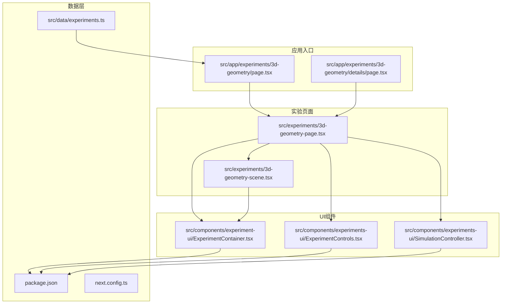
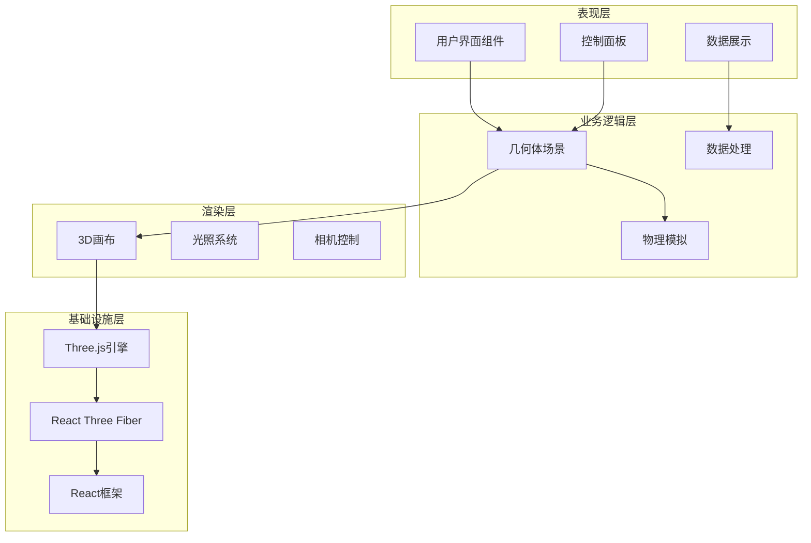
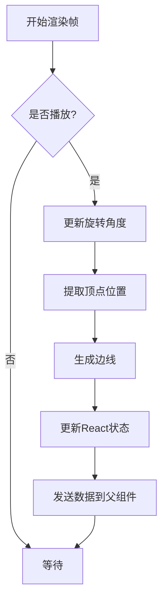
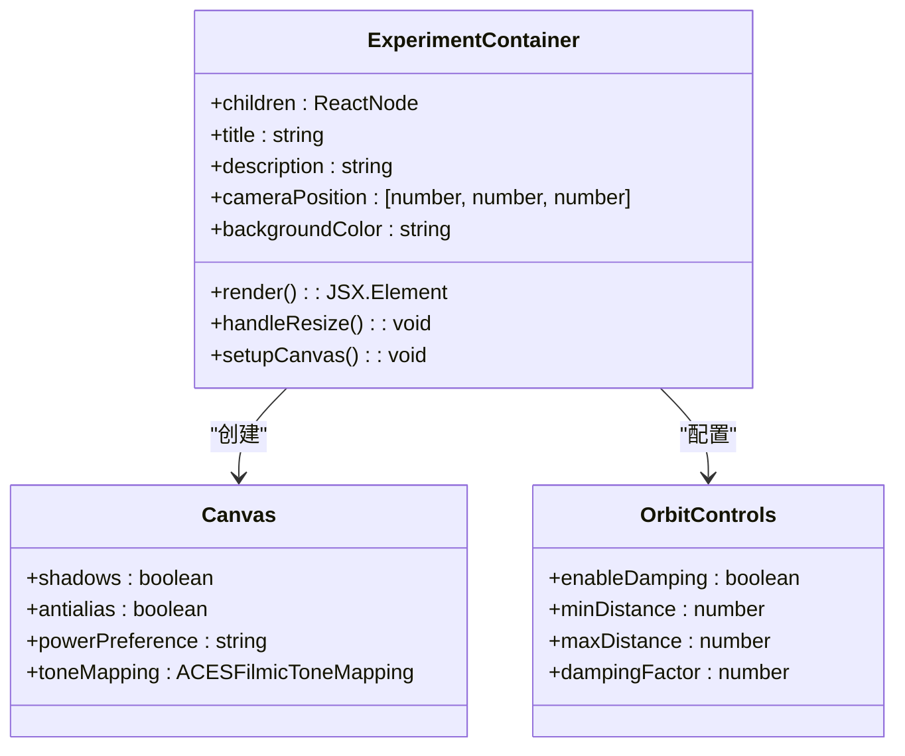
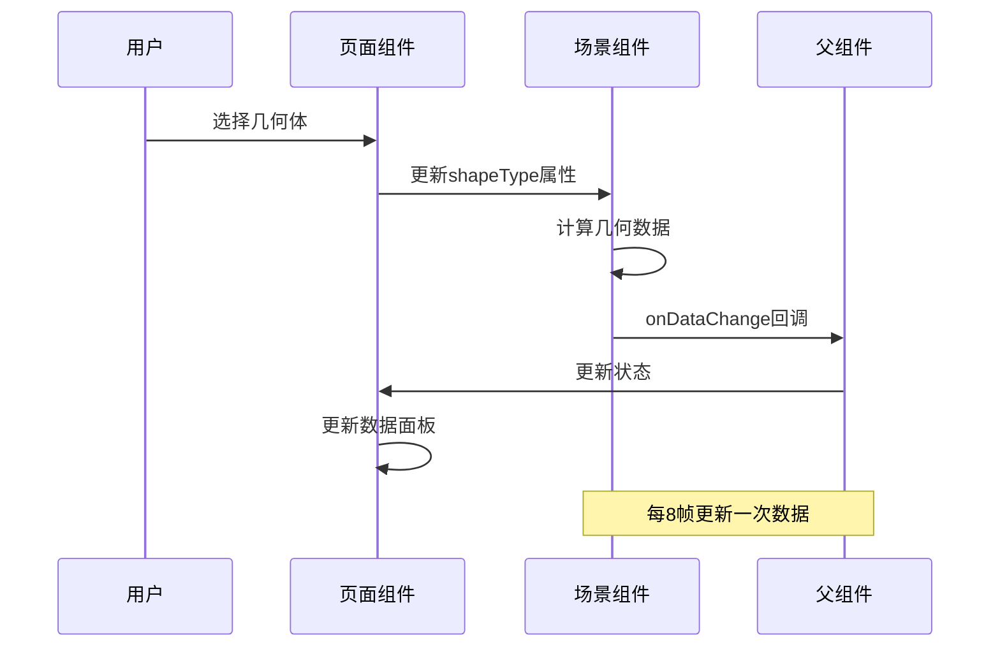

# Three.js几何体技能

<cite>
**本文档引用的文件**
- [3d-geometry-page.tsx](file://src/experiments/3d-geometry-page.tsx)
- [3d-geometry-scene.tsx](file://src/experiments/3d-geometry-scene.tsx)
- [page.tsx](file://src/app/experiments/3d-geometry/page.tsx)
- [details/page.tsx](file://src/app/experiments/3d-geometry/details/page.tsx)
- [ExperimentContainer.tsx](file://src/components/experiment-ui/ExperimentContainer.tsx)
- [ExperimentControls.tsx](file://src/components/experiment-ui/ExperimentControls.tsx)
- [SimulationController.tsx](file://src/components/experiment-ui/SimulationController.tsx)
- [index.ts](file://src/components/experiment-ui/index.ts)
- [experiments.ts](file://src/data/experiments.ts)
- [package.json](file://package.json)
- [next.config.ts](file://next.config.ts)
- [README.md](file://README.md)
</cite>

## 目录
1. [简介](#简介)
2. [项目结构](#项目结构)
3. [核心组件](#核心组件)
4. [架构概览](#架构概览)
5. [详细组件分析](#详细组件分析)
6. [依赖关系分析](#依赖关系分析)
7. [性能考虑](#性能考虑)
8. [故障排除指南](#故障排除指南)
9. [结论](#结论)

## 简介

Three.js几何体技能是ScienceLab 3D项目中的一个数学实验模块，专注于三维几何学教育。该实验允许用户交互式探索五种柏拉图立体（正四面体、立方体、正八面体、正十二面体、正二十面体），直观地理解欧拉公式V-E+F=2，并学习多面体的对偶关系。

该项目基于现代Web技术栈构建，使用Next.js 15作为框架，React Three Fiber进行Three.js渲染，提供流畅的3D可视化体验。整个应用支持响应式设计，在桌面和移动设备上都能提供优质的用户体验。

## 项目结构

ScienceLab 3D采用模块化的项目结构，按照功能域进行组织：



**图表来源**
- [page.tsx:1-9](file://src/app/experiments/3d-geometry/page.tsx#L1-L9)
- [3d-geometry-page.tsx:1-190](file://src/experiments/3d-geometry-page.tsx#L1-L190)
- [3d-geometry-scene.tsx:1-243](file://src/experiments/3d-geometry-scene.tsx#L1-L243)

**章节来源**
- [README.md:1-227](file://README.md#L1-L227)
- [package.json:1-38](file://package.json#L1-L38)

## 核心组件

### 实验容器组件

ExperimentContainer是整个实验的核心容器，负责管理3D画布、光照系统、相机控制和UI布局。它提供了完整的实验环境，包括轨道控制器、环境光、方向光等。

### 几何体场景组件

Geometry3DSceneComponent专门处理三维几何体的渲染，支持多种柏拉图立体的动态切换。该组件实现了复杂的几何计算，包括顶点提取、边线生成和实时数据更新。

### 控制面板系统

实验UI系统包含多个专用组件：
- **FloatingControlPanel**: 可拖拽的参数控制面板
- **SimulationController**: 模拟控制器，支持播放/暂停、重置和速度调节
- **DataPanel**: 实时数据显示面板
- **ExperimentControls**: 通用控件集合

**章节来源**
- [ExperimentContainer.tsx:55-373](file://src/components/experiment-ui/ExperimentContainer.tsx#L55-L373)
- [3d-geometry-scene.tsx:30-243](file://src/experiments/3d-geometry-scene.tsx#L30-L243)
- [ExperimentControls.tsx:1-498](file://src/components/experiment-ui/ExperimentControls.tsx#L1-L498)

## 架构概览

Three.js几何体技能采用分层架构设计，确保了良好的可维护性和扩展性：



**图表来源**
- [3d-geometry-scene.tsx:1-243](file://src/experiments/3d-geometry-scene.tsx#L1-L243)
- [ExperimentContainer.tsx:1-373](file://src/components/experiment-ui/ExperimentContainer.tsx#L1-L373)

该架构的优势在于：
- **分离关注点**: 渲染、逻辑和UI完全分离
- **可测试性**: 每个组件都有明确的职责边界
- **可扩展性**: 新增几何体类型只需修改场景组件
- **性能优化**: 使用useMemo和useRef避免不必要的重渲染

## 详细组件分析

### 几何体场景组件深度解析

Geometry3DSceneComponent是整个实验的核心，实现了以下关键功能：

#### 柏拉图立体支持

系统支持五种标准柏拉图立体，每种都有特定的几何属性：

| 立体名称 | 顶点数(V) | 边数(E) | 面数(F) | 欧拉特征数 |
|---------|----------|--------|--------|-----------|
| 正四面体 | 4 | 6 | 4 | 2 |
| 立方体 | 8 | 12 | 6 | 2 |
| 正八面体 | 6 | 12 | 8 | 2 |
| 正十二面体 | 20 | 30 | 12 | 2 |
| 正二十面体 | 12 | 30 | 20 | 2 |

#### 实时几何数据提取

组件通过Three.js的几何属性自动提取顶点、边和面信息：



**图表来源**
- [3d-geometry-scene.tsx:131-153](file://src/experiments/3d-geometry-scene.tsx#L131-L153)

#### 光照和材质系统

系统使用多层次光照增强视觉效果：
- **环境光**: 提供基础照明
- **方向光**: 模拟太阳光效果
- **点光源**: 增加阴影和立体感
- **材质属性**: 金属度、粗糙度、发射光等

**章节来源**
- [3d-geometry-scene.tsx:157-179](file://src/experiments/3d-geometry-scene.tsx#L157-L179)

### 用户界面组件分析

#### 实验容器组件

ExperimentContainer提供了完整的实验环境，包括：



**图表来源**
- [ExperimentContainer.tsx:55-373](file://src/components/experiment-ui/ExperimentContainer.tsx#L55-L373)

#### 控制面板系统

系统提供了丰富的交互控制选项：

| 控制类型 | 功能描述 | 默认值 | 范围 |
|---------|----------|--------|------|
| 形状选择 | 切换柏拉图立体 | 立方体 | 正四面体/立方体/正八面体/正十二面体/正二十面体 |
| 旋转速度 | 控制模型旋转速度 | 0.5 | 0-2 |
| 线框模式 | 显示线框或实体渲染 | 关闭 | 开启/关闭 |
| 顶点显示 | 高亮显示顶点 | 开启 | 开启/关闭 |
| 边线显示 | 显示连接边线 | 开启 | 开启/关闭 |

**章节来源**
- [3d-geometry-page.tsx:42-120](file://src/experiments/3d-geometry-page.tsx#L42-L120)
- [ExperimentControls.tsx:66-89](file://src/components/experiments-ui/ExperimentControls.tsx#L66-L89)

### 数据流和状态管理



**图表来源**
- [3d-geometry-page.tsx:155-163](file://src/experiments/3d-geometry-page.tsx#L155-L163)
- [3d-geometry-scene.tsx:122-152](file://src/experiments/3d-geometry-scene.tsx#L122-L152)

## 依赖关系分析

### 技术栈依赖

项目采用现代化的前端技术栈，各依赖项的作用如下：

```mermaid
graph LR
subgraph "核心框架"
Next[Next.js 15]
React[React 19]
TS[TypeScript]
end
subgraph "3D图形"
Three[Three.js 0.184]
Fiber[React Three Fiber 9.1]
Drei[@react-three/drei 10.0]
end
subgraph "UI和工具"
Tailwind[Tailwind CSS 4.0]
Motion[Framer Motion 12.4]
Icons[Lucide React 1.18]
end
subgraph "开发工具"
PostCSS[PostCSS 8.5]
DevTools[TypeScript Types]
end
Next --> React
React --> Fiber
Fiber --> Three
Fiber --> Drei
Next --> Tailwind
Next --> Motion
Next --> Icons
Next --> PostCSS
React --> DevTools
```

**图表来源**
- [package.json:10-22](file://package.json#L10-L22)

### 性能优化策略

项目实施了多项性能优化措施：

1. **渲染优化**: 使用`useMemo`缓存几何计算结果
2. **状态更新节流**: 每8帧才更新一次React状态
3. **资源管理**: 合理的内存管理和对象复用
4. **响应式设计**: 针对不同设备的性能调整

**章节来源**
- [package.json:1-38](file://package.json#L1-L38)
- [next.config.ts:1-9](file://next.config.ts#L1-L9)

## 性能考虑

### 渲染性能优化

- **几何缓存**: 使用`useMemo`避免重复计算几何属性
- **状态更新频率**: 通过帧计数器实现8帧一次的状态更新
- **材质优化**: 合理设置透明度和发射光属性
- **光照优化**: 使用多层次光照但避免过度计算

### 内存管理

- **对象池模式**: 复用Three.js对象实例
- **事件监听器清理**: 组件卸载时移除所有事件监听
- **定时器清理**: 确保动画循环正确停止

### 移动端适配

- **分辨率自适应**: 根据设备像素比调整渲染质量
- **触摸交互优化**: 支持多点触控和手势操作
- **性能降级**: 在低端设备上自动降低渲染质量

## 故障排除指南

### 常见问题及解决方案

#### 3D场景不显示

**症状**: 页面加载后只显示空白或错误信息

**可能原因**:
1. Three.js依赖未正确安装
2. 浏览器兼容性问题
3. WebGL不支持

**解决方法**:
1. 检查浏览器控制台错误信息
2. 确认Three.js版本兼容性
3. 测试其他Three.js示例是否正常

#### 旋转动画卡顿

**症状**: 几何体旋转不流畅，出现跳帧现象

**可能原因**:
1. 设备性能不足
2. 过多的UI组件同时渲染
3. 状态更新过于频繁

**解决方法**:
1. 降低旋转速度设置
2. 关闭不必要的视觉效果
3. 检查是否有其他重负载任务

#### 控制面板无法拖拽

**症状**: 控制面板固定在屏幕某个位置，无法移动

**可能原因**:
1. 触摸事件处理冲突
2. CSS样式覆盖
3. JavaScript错误

**解决方法**:
1. 检查浏览器开发者工具中的JavaScript错误
2. 确认CSS类名没有被意外覆盖
3. 尝试禁用浏览器扩展程序

### 调试技巧

1. **启用React DevTools**: 检查组件树和状态变化
2. **使用浏览器性能面板**: 分析渲染性能瓶颈
3. **检查Three.js调试工具**: 验证几何体和材质设置
4. **监控内存使用**: 确保没有内存泄漏

**章节来源**
- [ExperimentContainer.tsx:78-133](file://src/components/experiment-ui/ExperimentContainer.tsx#L78-L133)
- [3d-geometry-scene.tsx:131-153](file://src/experiments/3d-geometry-scene.tsx#L131-L153)

## 结论

Three.js几何体技能是一个设计精良的教育型3D可视化应用，成功地将复杂的数学概念转化为直观的交互体验。项目展现了现代Web开发的最佳实践：

### 主要成就

1. **教育价值**: 有效传达柏拉图立体和欧拉公式的概念
2. **技术实现**: 展示了React Three Fiber的强大能力
3. **用户体验**: 提供流畅、直观的交互界面
4. **性能优化**: 在保证视觉效果的同时保持良好性能

### 技术亮点

- **模块化架构**: 清晰的组件分离和职责划分
- **性能优化**: 多层次的渲染和状态管理优化
- **响应式设计**: 适配多种设备和屏幕尺寸
- **可扩展性**: 易于添加新的几何体类型和功能

### 应用前景

该项目为科学教育的数字化转型提供了优秀的范例，其设计理念和技术实现可以应用于其他科学学科的教学中。通过持续的改进和扩展，可以进一步提升用户体验和教育效果。