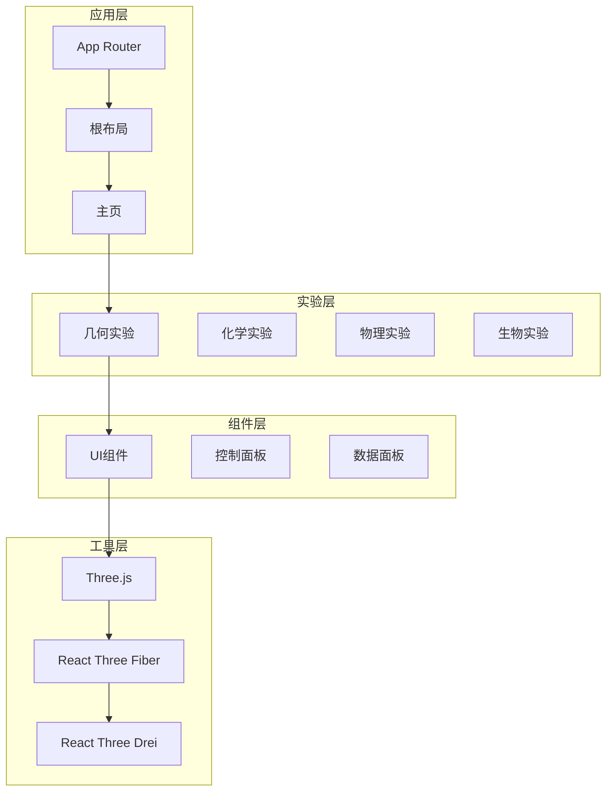
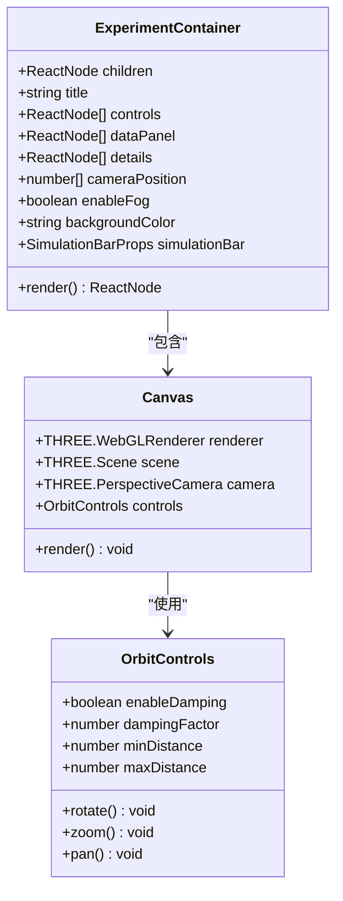
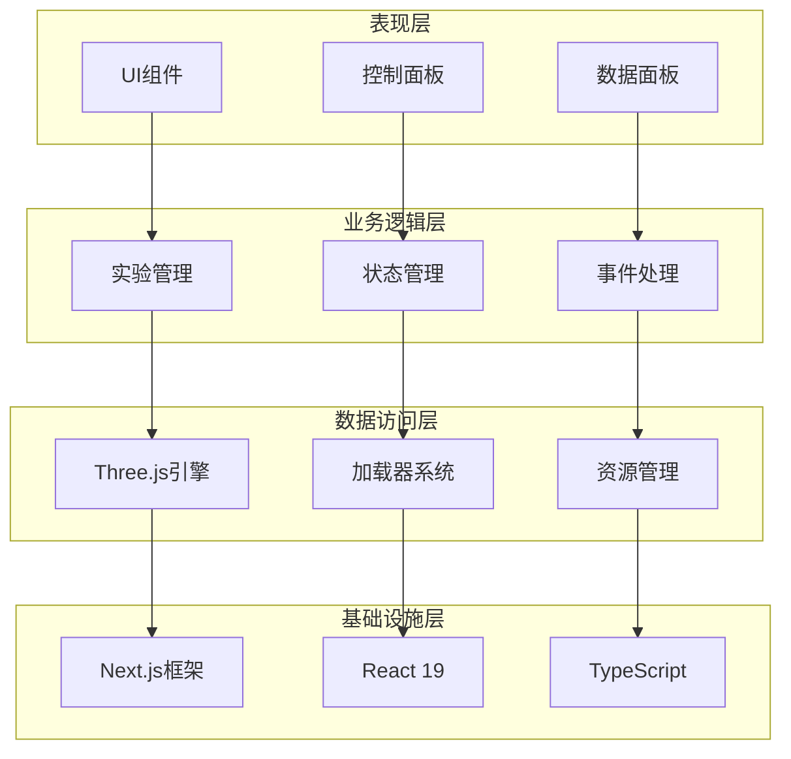
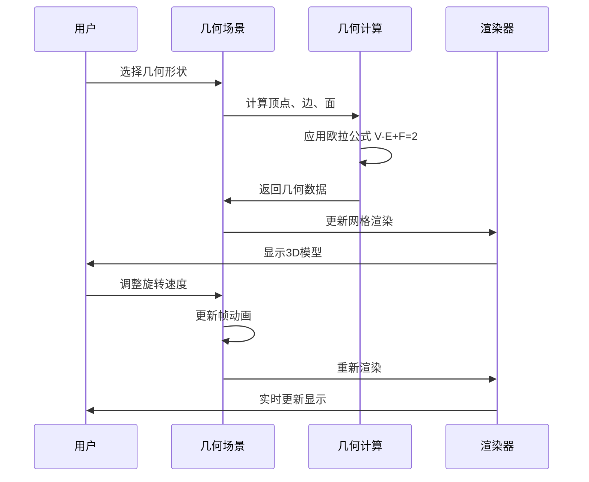
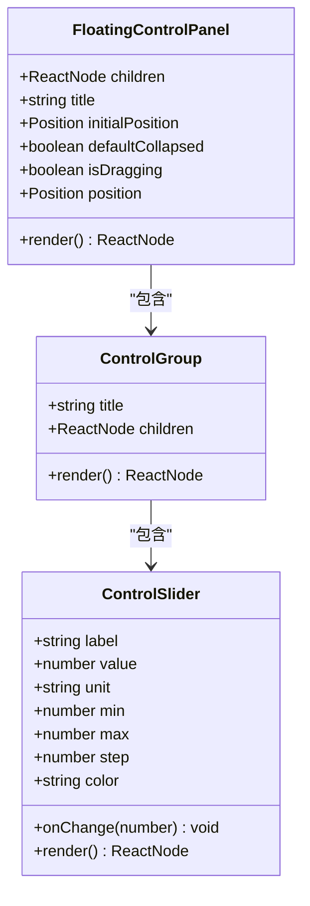
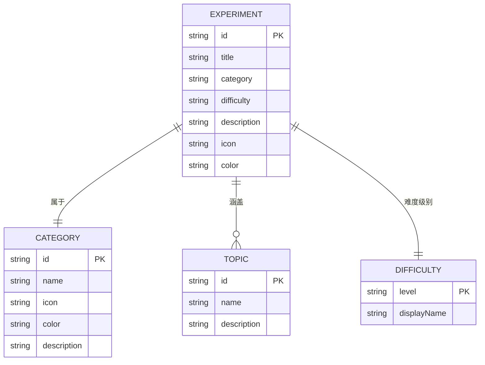
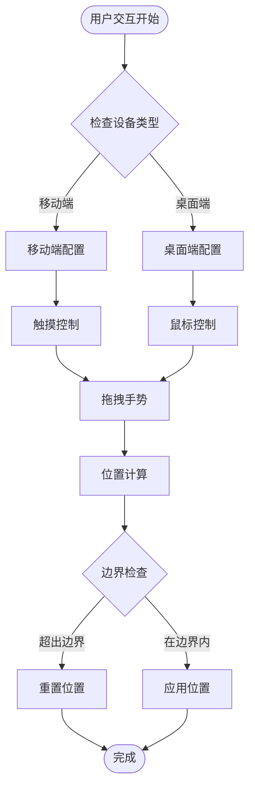
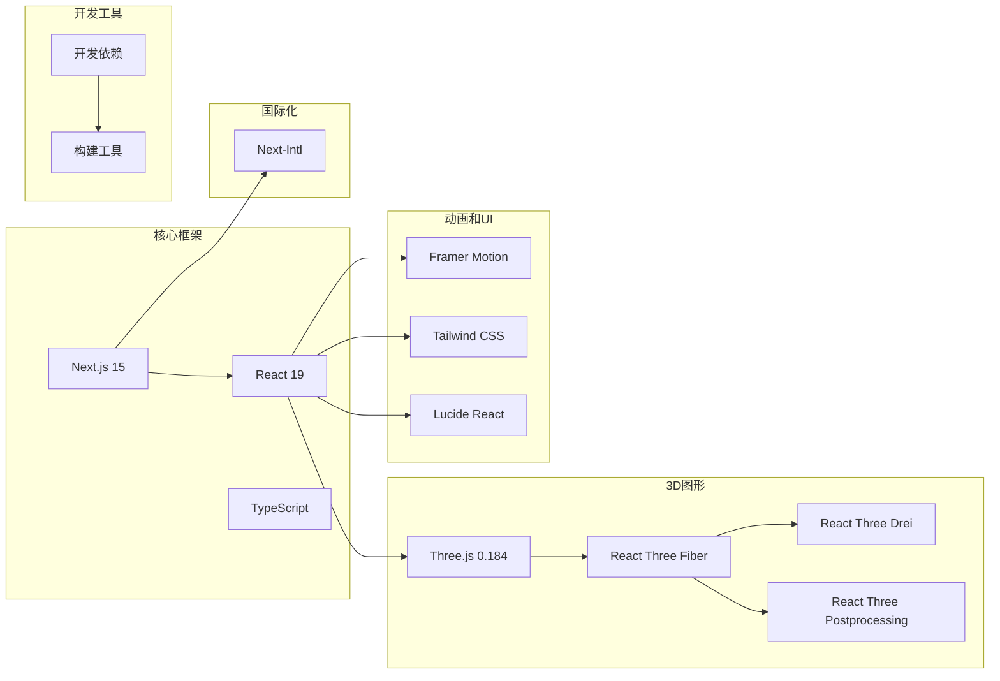

# Three.js加载器技能

<cite>
**本文档引用的文件**
- [README.md](file://README.md)
- [package.json](file://package.json)
- [3d-geometry-scene.tsx](file://src/experiments/3d-geometry-scene.tsx)
- [3d-geometry-page.tsx](file://src/experiments/3d-geometry-page.tsx)
- [ExperimentContainer.tsx](file://src/components/experiment-ui/ExperimentContainer.tsx)
- [SimulationController.tsx](file://src/components/experiment-ui/SimulationController.tsx)
- [FloatingControlPanel.tsx](file://src/components/experiment-ui/FloatingControlPanel.tsx)
- [DataPanel.tsx](file://src/components/experiment-ui/DataPanel.tsx)
- [ControlPanel.tsx](file://src/components/experiment-ui/ControlPanel.tsx)
- [experiments.ts](file://src/data/experiments.ts)
- [page.tsx](file://src/app/page.tsx)
- [SKILL.md](file://.trae/skills/threejs-loaders/SKILL.md)
</cite>

## 目录
1. [简介](#简介)
2. [项目结构](#项目结构)
3. [核心组件](#核心组件)
4. [架构概览](#架构概览)
5. [详细组件分析](#详细组件分析)
6. [依赖关系分析](#依赖关系分析)
7. [性能考虑](#性能考虑)
8. [故障排除指南](#故障排除指南)
9. [结论](#结论)

## 简介

ScienceLab 3D 是一个基于 Three.js 的交互式 3D 科学学习平台，提供超过 40 个虚拟科学实验。该项目使用 Next.js 15 和 React 19 构建，专注于物理、化学、生物和数学领域的教育内容。

本项目的核心特色包括：
- 40+ 交互式科学实验
- 基于 Three.js 和 React Three Fiber 的 3D 可视化
- 实时控制面板和数据可视化
- 响应式设计，支持桌面、平板和移动设备
- 深色/浅色主题切换
- 收藏功能和智能搜索

## 项目结构

项目采用模块化的文件组织方式，主要分为以下几个部分：

**图表来源**
- [package.json:10-22](file://package.json#L10-L22)
- [README.md:138-150](file://README.md#L138-L150)

**章节来源**
- [package.json:1-38](file://package.json#L1-L38)
- [README.md:1-227](file://README.md#L1-L227)

## 核心组件

### Three.js 加载器系统

项目使用多种 Three.js 加载器来处理不同的 3D 资产格式：

| 加载器类型 | 文件格式 | 使用场景 | 性能特点 |
|-----------|----------|----------|----------|
| GLTFLoader | GLB/GLTF | 主要模型格式 | 支持动画、材质、纹理 |
| STLLoader | STL | 制造和工程模型 | 快速加载，无动画 |
| PLYLoader | PLY | 点云和扫描数据 | 支持顶点颜色 |
| OBJLoader | OBJ | 传统 3D 格式 | 需要 MTL 材质文件 |
| FBXLoader | FBX | 动画和复杂场景 | 大尺寸，支持动画 |

### 实验容器系统

实验容器负责管理 3D 场景的渲染和用户交互：

**图表来源**
- [ExperimentContainer.tsx:55-207](file://src/components/experiment-ui/ExperimentContainer.tsx#L55-L207)

**章节来源**
- [ExperimentContainer.tsx:1-373](file://src/components/experiment-ui/ExperimentContainer.tsx#L1-L373)

## 架构概览

ScienceLab 3D 采用分层架构设计，确保代码的可维护性和扩展性：

**图表来源**
- [package.json:10-22](file://package.json#L10-L22)
- [page.tsx:328-632](file://src/app/page.tsx#L328-L632)

## 详细组件分析

### 3D 几何实验系统

3D 几何实验是项目的核心组件之一，展示了五种柏拉图立体的可视化：

**图表来源**
- [3d-geometry-scene.tsx:30-240](file://src/experiments/3d-geometry-scene.tsx#L30-L240)

#### 几何数据结构

| 参数名称 | 类型 | 描述 | 默认值 |
|---------|------|------|--------|
| vertices | number | 顶点数量 | 4-12 |
| edges | number | 边的数量 | 6-30 |
| faces | number | 面的数量 | 4-20 |
| eulerCharacteristic | number | 欧拉示性数 | 2 |
| currentRotation | number | 当前旋转角度 | 0 |

#### 控制面板组件

**图表来源**
- [FloatingControlPanel.tsx:21-195](file://src/components/experiment-ui/FloatingControlPanel.tsx#L21-L195)

**章节来源**
- [3d-geometry-scene.tsx:1-243](file://src/experiments/3d-geometry-scene.tsx#L1-L243)
- [3d-geometry-page.tsx:1-190](file://src/experiments/3d-geometry-page.tsx#L1-L190)

### 实验管理系统

项目包含完整的实验管理系统，支持 40+ 个实验的分类和管理：

**图表来源**
- [experiments.ts:1-514](file://src/data/experiments.ts#L1-L514)

#### 实验分类体系

| 学科领域 | 实验数量 | 难度分布 | 特色功能 |
|---------|----------|----------|----------|
| 物理学 | 10个 | 初级: 3 中级: 5 高级: 2 | 运动、波、场论 |
| 化学 | 10个 | 初级: 4 中级: 4 高级: 2 | 反应、结构、热力学 |
| 生物学 | 10个 | 初级: 3 中级: 5 高级: 2 | 细胞、分子、生态 |
| 数学 | 10个 | 初级: 3 中级: 5 高级: 2 | 几何、代数、分析 |

**章节来源**
- [experiments.ts:12-482](file://src/data/experiments.ts#L12-L482)

### 用户界面组件

项目提供了丰富的 UI 组件来增强用户体验：

**图表来源**
- [FloatingControlPanel.tsx:103-150](file://src/components/experiment-ui/FloatingControlPanel.tsx#L103-L150)

**章节来源**
- [FloatingControlPanel.tsx:1-195](file://src/components/experiment-ui/FloatingControlPanel.tsx#L1-L195)
- [DataPanel.tsx:1-219](file://src/components/experiment-ui/DataPanel.tsx#L1-L219)
- [ControlPanel.tsx:1-300](file://src/components/experiment-ui/ControlPanel.tsx#L1-L300)

## 依赖关系分析

项目的技术栈采用了现代化的前端开发技术组合：

**图表来源**
- [package.json:10-36](file://package.json#L10-L36)

**章节来源**
- [package.json:1-38](file://package.json#L1-L38)
- [README.md:138-150](file://README.md#L138-L150)

## 性能考虑

### 渲染优化策略

项目采用了多种性能优化技术来确保流畅的 3D 体验：

1. **帧率控制**：使用 `useFrame` 钩子进行高效的动画循环
2. **内存管理**：及时释放不再使用的几何体和纹理
3. **懒加载**：按需加载实验内容
4. **缓存机制**：利用 Three.js 内置缓存系统

### 移动端适配

针对不同设备进行了专门的优化：

| 设备类型 | 分辨率 | 抗锯齿 | DPR设置 |
|---------|--------|--------|---------|
| 高端手机 | 4K+ | 开启 | 1.5 |
| 中端手机 | 1080p | 关闭 | 1.0 |
| 平板设备 | 2K+ | 开启 | 1.0-1.5 |
| 桌面设备 | 1440p+ | 开启 | 1.0-2.0 |

## 故障排除指南

### 常见问题及解决方案

#### 加载器相关问题

**问题**：GLTF 模型加载失败
**解决方案**：
1. 检查文件路径是否正确
2. 确认模型文件完整性
3. 验证材质和纹理路径

**问题**：纹理加载错误
**解决方案**：
1. 检查纹理文件格式支持
2. 验证颜色空间设置
3. 确认跨域访问权限

#### 性能问题

**问题**：3D 场景卡顿
**解决方案**：
1. 降低几何复杂度
2. 启用阴影贴图优化
3. 减少同时渲染的对象数量

**章节来源**
- [SKILL.md:554-595](file://.trae/skills/threejs-loaders/SKILL.md#L554-L595)

## 结论

ScienceLab 3D 展示了现代 Web 3D 应用的最佳实践，通过精心设计的架构和丰富的功能特性，为用户提供了一个沉浸式的科学学习环境。项目不仅在技术实现上表现出色，在教育内容的设计上也体现了深度的专业性和创新性。

项目的成功关键在于：
- 清晰的模块化架构设计
- 高效的 Three.js 集成方案
- 用户友好的交互设计
- 完善的性能优化策略
- 丰富的教育资源内容

这些特点使得 ScienceLab 3D 成为了一个值得学习和参考的优秀开源项目。