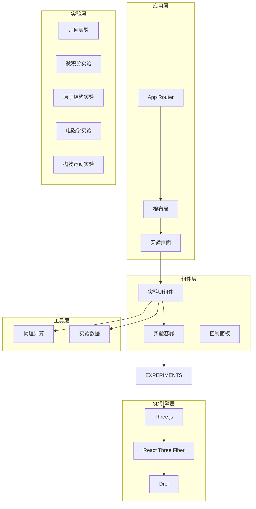
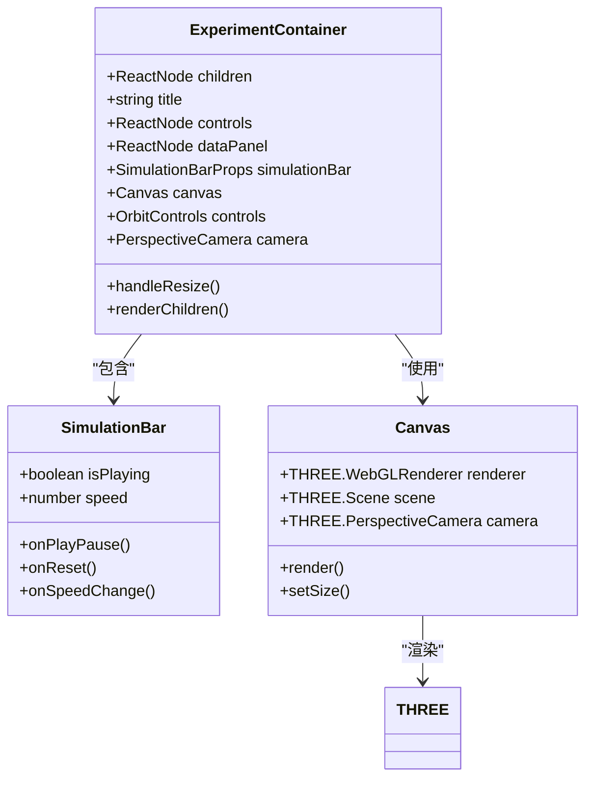
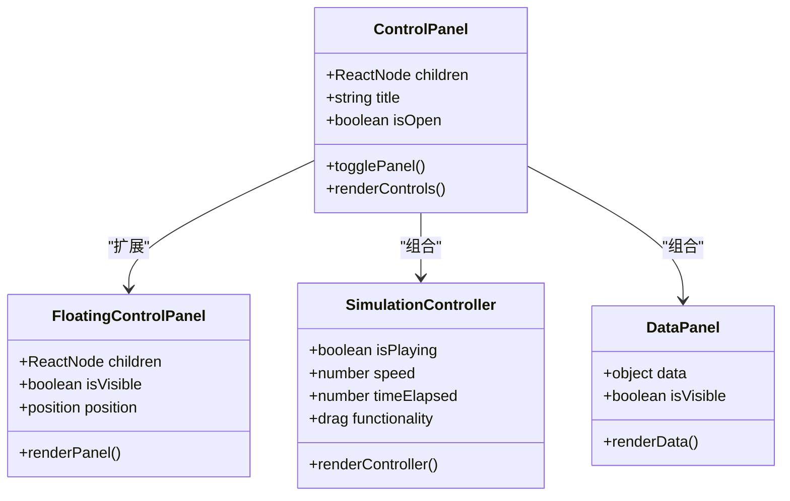
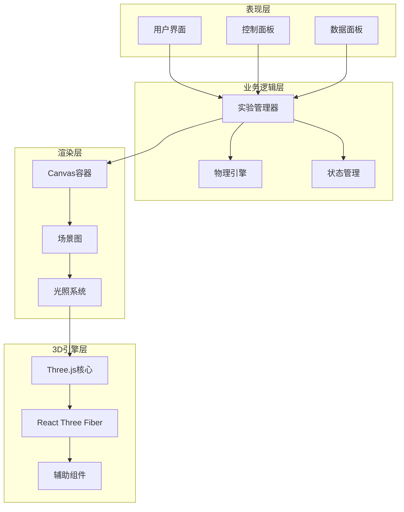
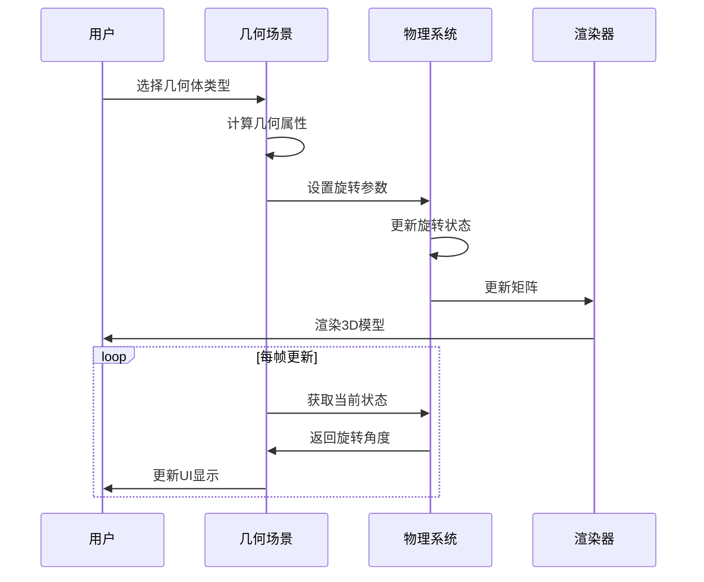
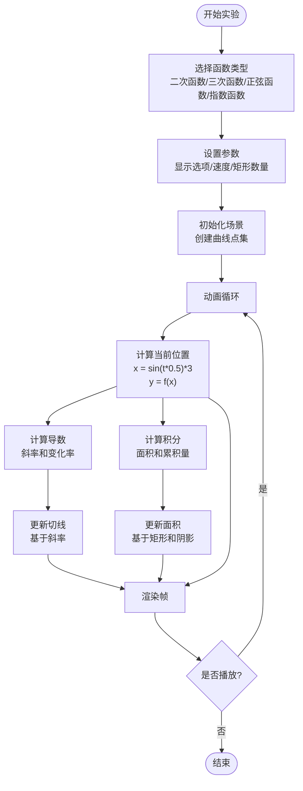
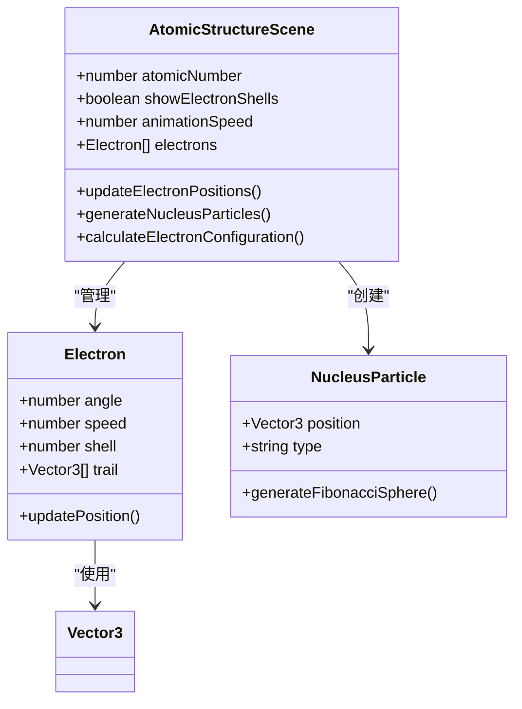
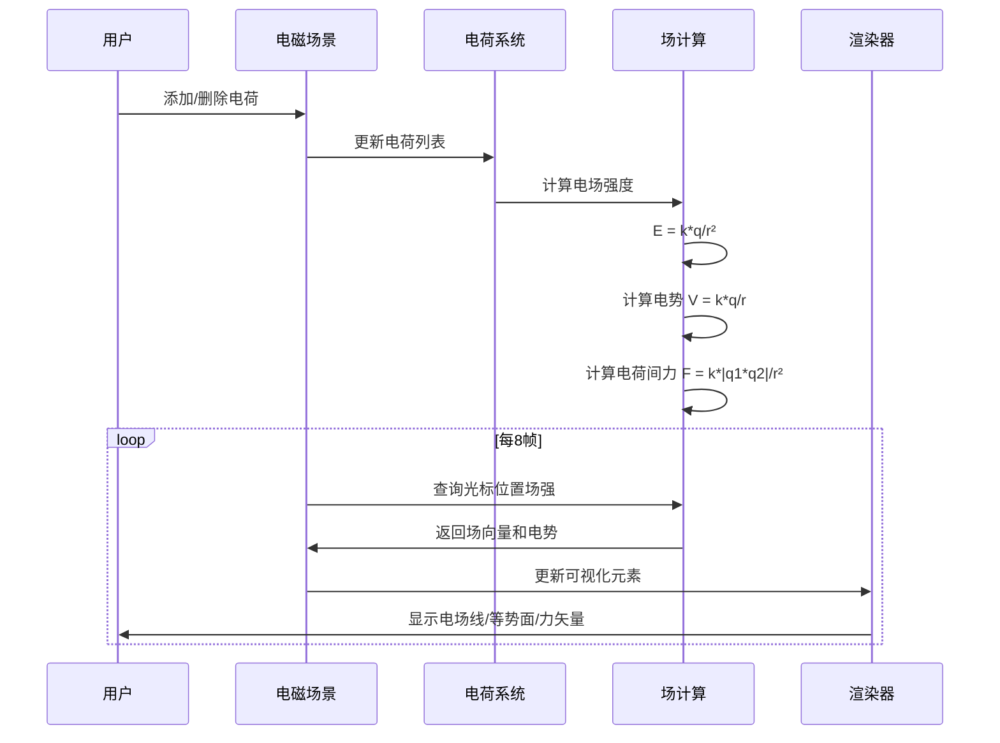
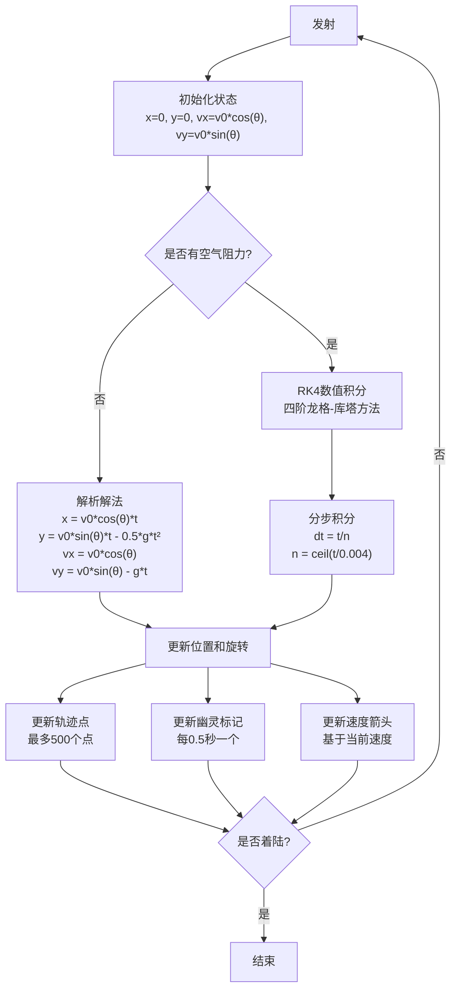

# Three.js动画技能

<cite>
**本文档引用的文件**
- [README.md](file://README.md)
- [package.json](file://package.json)
- [src/app/layout.tsx](file://src/app/layout.tsx)
- [src/data/experiments.ts](file://src/data/experiments.ts)
- [src/components/experiment-ui/index.ts](file://src/components/experiment-ui/index.ts)
- [src/components/experiment-ui/ExperimentContainer.tsx](file://src/components/experiment-ui/ExperimentContainer.tsx)
- [src/components/experiment-ui/SimulationController.tsx](file://src/components/experiment-ui/SimulationController.tsx)
- [src/utils/physics.ts](file://src/utils/physics.ts)
- [src/experiments/3d-geometry-scene.tsx](file://src/experiments/3d-geometry-scene.tsx)
- [src/experiments/calculus-visualizer-scene.tsx](file://src/experiments/calculus-visualizer-scene.tsx)
- [src/experiments/atomic-structure-scene.tsx](file://src/experiments/atomic-structure-scene.tsx)
- [src/experiments/electromagnetic-scene.tsx](file://src/experiments/electromagnetic-scene.tsx)
- [src/experiments/projectile-motion-scene.tsx](file://src/experiments/projectile-motion-scene.tsx)
- [src/app/experiments/3d-geometry/details/page.tsx](file://src/app/experiments/3d-geometry/details/page.tsx)
- [next.config.ts](file://next.config.ts)
</cite>

## 目录
1. [项目简介](#项目简介)
2. [项目结构](#项目结构)
3. [核心组件](#核心组件)
4. [架构概览](#架构概览)
5. [详细组件分析](#详细组件分析)
6. [依赖关系分析](#依赖关系分析)
7. [性能考虑](#性能考虑)
8. [故障排除指南](#故障排除指南)
9. [结论](#结论)

## 项目简介

ScienceLab 3D是一个基于Three.js的交互式3D科学学习平台，提供40多个虚拟科学实验，涵盖物理、化学、生物和数学四个学科领域。该项目使用Next.js 15和React 19构建，采用TypeScript进行类型安全编程，通过React Three Fiber实现高性能的3D渲染。

该项目的核心特色包括：
- **40+ 交互式实验**：涵盖从基础到高级的科学概念
- **实时控制面板**：可调整变量并即时看到视觉反馈
- **3D可视化**：使用Three.js和React Three Fiber创建沉浸式体验
- **响应式设计**：支持桌面、平板和移动设备
- **开源免费**：完全免费且开源的教育资源

## 项目结构

项目采用模块化架构，主要目录结构如下：



**图表来源**
- [src/app/layout.tsx:1-207](file://src/app/layout.tsx#L1-L207)
- [src/components/experiment-ui/index.ts:1-43](file://src/components/experiment-ui/index.ts#L1-L43)

**章节来源**
- [README.md:108-135](file://README.md#L108-L135)
- [package.json:1-38](file://package.json#L1-L38)

## 核心组件

### 实验容器系统

实验容器是整个3D实验系统的基础设施，提供了统一的3D渲染环境和用户界面框架。



**图表来源**
- [src/components/experiment-ui/ExperimentContainer.tsx:55-373](file://src/components/experiment-ui/ExperimentContainer.tsx#L55-L373)

### 实验UI组件系统

项目实现了完整的实验UI组件生态系统，包括控制面板、数据面板和模拟控制器。



**图表来源**
- [src/components/experiment-ui/index.ts:1-43](file://src/components/experiment-ui/index.ts#L1-L43)

**章节来源**
- [src/components/experiment-ui/ExperimentContainer.tsx:1-373](file://src/components/experiment-ui/ExperimentContainer.tsx#L1-L373)
- [src/components/experiment-ui/SimulationController.tsx:1-228](file://src/components/experiment-ui/SimulationController.tsx#L1-L228)

## 架构概览

项目采用分层架构设计，确保了良好的可维护性和扩展性：



**图表来源**
- [src/app/layout.tsx:181-206](file://src/app/layout.tsx#L181-L206)
- [src/utils/physics.ts:1-687](file://src/utils/physics.ts#L1-L687)

## 详细组件分析

### 3D几何实验场景

3D几何实验展示了五个柏拉图立体（正多面体），包括四面体、立方体、八面体、十二面体和二十面体。



**图表来源**
- [src/experiments/3d-geometry-scene.tsx:30-243](file://src/experiments/3d-geometry-scene.tsx#L30-L243)

该场景的关键特性包括：
- **动态几何生成**：根据选择的几何体类型生成相应的Three.js几何体
- **实时旋转控制**：支持独立的X轴和Y轴旋转速度控制
- **可视化元素**：可选的顶点显示、边线绘制和欧拉示性数计算
- **性能优化**：使用useMemo缓存几何数据，useFrame节流更新频率

**章节来源**
- [src/experiments/3d-geometry-scene.tsx:1-243](file://src/experiments/3d-geometry-scene.tsx#L1-L243)

### 微积分可视化实验场景

微积分可视化实验展示了函数曲线、导数曲线、切线和积分区域的实时可视化。



**图表来源**
- [src/experiments/calculus-visualizer-scene.tsx:32-296](file://src/experiments/calculus-visualizer-scene.tsx#L32-L296)

**章节来源**
- [src/experiments/calculus-visualizer-scene.tsx:1-296](file://src/experiments/calculus-visualizer-scene.tsx#L1-L296)

### 原子结构实验场景

原子结构实验基于玻尔模型，展示了原子核和电子壳层的动态可视化。



**图表来源**
- [src/experiments/atomic-structure-scene.tsx:72-365](file://src/experiments/atomic-structure-scene.tsx#L72-L365)

该场景实现了复杂的物理模拟：
- **电子轨道模型**：基于玻尔模型的电子轨道半径和速度计算
- **斐波那契球分布**：用于均匀分布原子核粒子
- **轨迹可视化**：每个电子都绘制其运动轨迹
- **实时数据更新**：每8帧更新一次实验数据

**章节来源**
- [src/experiments/atomic-structure-scene.tsx:1-365](file://src/experiments/atomic-structure-scene.tsx#L1-L365)

### 电磁场实验场景

电磁场实验展示了电荷产生的电场线、等势面和力矢量的实时可视化。



**图表来源**
- [src/experiments/electromagnetic-scene.tsx:43-520](file://src/experiments/electromagnetic-scene.tsx#L43-L520)

**章节来源**
- [src/experiments/electromagnetic-scene.tsx:1-520](file://src/experiments/electromagnetic-scene.tsx#L1-L520)

### 抛物运动实验场景

抛物运动实验实现了精确的物理模拟，包括无空气阻力和有空气阻力两种模式。



**图表来源**
- [src/experiments/projectile-motion-scene.tsx:56-592](file://src/experiments/projectile-motion-scene.tsx#L56-L592)

**章节来源**
- [src/experiments/projectile-motion-scene.tsx:1-592](file://src/experiments/projectile-motion-scene.tsx#L1-L592)

## 依赖关系分析

项目的技术栈和依赖关系如下：

```mermaid
graph TB
subgraph "前端框架"
NEXT[Next.js 15]
REACT[React 19]
TYPESCRIPT[TypeScript]
end
subgraph "3D图形库"
THREE[Three.js 0.184]
R3F[React Three Fiber 9.1.0]
DREI[@react-three/drei 10.0.0]
POSTPROCESSING[@react-three/postprocessing 3.0.0]
end
subgraph "动画和UI"
FRAMER[Motion 12.40.0]
TAILWIND[Tailwind CSS 4.0.0]
LUCIDE[Lucide React 1.18.0]
end
subgraph "开发工具"
DEVTOOLS[开发工具链]
BUILD[Babel/ESLint配置]
end
NEXT --> REACT
REACT --> THREE
THREE --> R3F
R3F --> DREI
NEXT --> TYPESCRIPT
NEXT --> FRAMER
NEXT --> TAILWIND
NEXT --> LUCIDE
```

**图表来源**
- [package.json:10-22](file://package.json#L10-L22)

**章节来源**
- [package.json:1-38](file://package.json#L1-L38)
- [next.config.ts:1-9](file://next.config.ts#L1-L9)

## 性能考虑

项目在性能优化方面采用了多种策略：

### 渲染性能优化
- **useFrame节流**：大多数场景使用8帧间隔更新，减少不必要的重绘
- **实例化网格**：大量电子和幽灵标记使用InstancedMesh提高渲染效率
- **几何数据缓存**：使用useMemo缓存几何属性和曲线点集
- **条件渲染**：根据用户选择动态启用/禁用可视化元素

### 内存管理
- **引用优化**：大量物理状态存储在useRef中，避免组件重新渲染
- **对象池模式**：复用THREE.Object3D实例，减少垃圾回收压力
- **轨迹点限制**：限制最大轨迹点数量，防止内存泄漏

### 移动端适配
- **分辨率自适应**：根据设备像素比调整渲染质量
- **触摸控制优化**：针对移动端触摸手势优化OrbitControls
- **性能降级**：在低端设备上自动降低渲染质量

## 故障排除指南

### 常见问题及解决方案

**问题1：3D场景无法渲染**
- 检查浏览器对WebGL的支持
- 确认Canvas容器尺寸正确设置
- 验证Three.js版本兼容性

**问题2：动画卡顿**
- 调整useFrame更新频率
- 关闭不必要的可视化元素
- 检查设备性能规格

**问题3：物理模拟不准确**
- 验证时间步长设置
- 检查数值积分方法
- 确认单位制一致性

**问题4：移动端触摸问题**
- 检查OrbitControls配置
- 验证触摸事件处理
- 测试不同设备兼容性

**章节来源**
- [src/components/experiment-ui/ExperimentContainer.tsx:78-133](file://src/components/experiment-ui/ExperimentContainer.tsx#L78-L133)

## 结论

ScienceLab 3D项目展现了现代Web 3D技术的强大能力，通过精心设计的架构和优化策略，成功地将复杂的科学概念转化为直观的3D可视化体验。项目的主要优势包括：

1. **教育价值**：为学生提供了沉浸式的学习环境
2. **技术先进**：采用最新的Web技术栈
3. **性能优秀**：通过多种优化策略确保流畅体验
4. **易于扩展**：模块化的架构便于添加新的实验
5. **开源免费**：为全球教育事业做出贡献

该项目不仅是一个技术展示，更是教育技术创新的典范，为未来的在线科学教育平台提供了宝贵的参考经验。