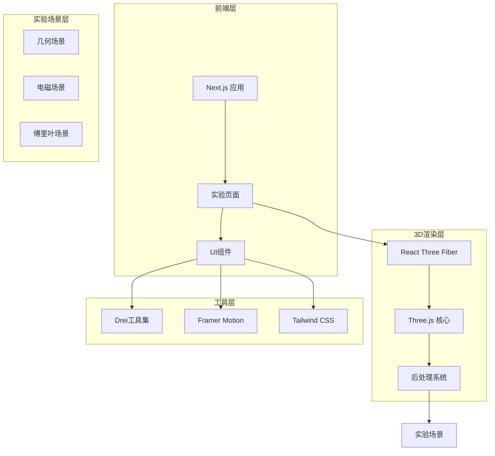
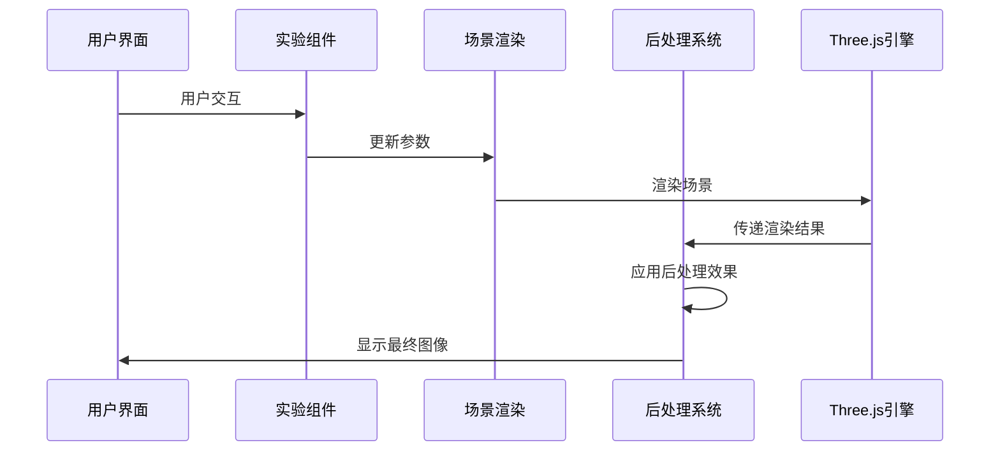
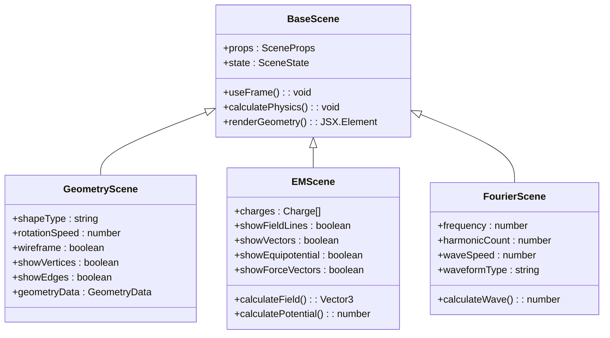
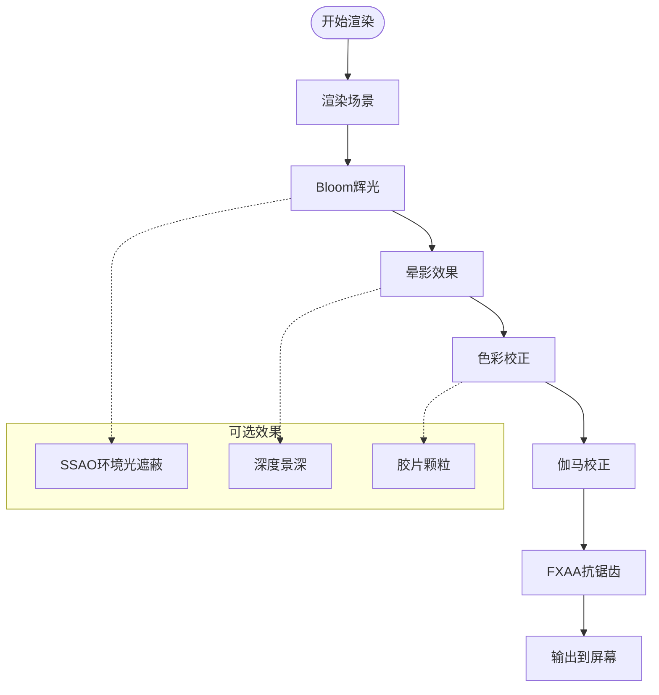
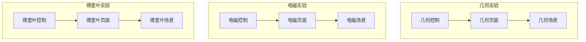

# Three.js后处理技能

<cite>
**本文档引用的文件**
- [README.md](file://README.md)
- [package.json](file://package.json)
- [3d-geometry-scene.tsx](file://src/experiments/3d-geometry-scene.tsx)
- [3d-geometry-page.tsx](file://src/experiments/3d-geometry-page.tsx)
- [electromagnetic-scene.tsx](file://src/experiments/electromagnetic-scene.tsx)
- [electromagnetic-page.tsx](file://src/experiments/electromagnetic-page.tsx)
- [fourier-transform-scene.tsx](file://src/experiments/fourier-transform-scene.tsx)
- [fourier-transform-page.tsx](file://src/experiments/fourier-transform-page.tsx)
- [ExperimentContainer.tsx](file://src/components/experiment-ui/ExperimentContainer.tsx)
- [SKILL.md](file://.trae/skills/threejs-postprocessing/SKILL.md)
</cite>

## 目录
1. [项目概述](#项目概述)
2. [技术架构](#技术架构)
3. [核心组件](#核心组件)
4. [架构概览](#架构概览)
5. [详细组件分析](#详细组件分析)
6. [依赖关系分析](#依赖关系分析)
7. [性能考虑](#性能考虑)
8. [故障排除指南](#故障排除指南)
9. [结论](#结论)

## 项目概述

ScienceLab 3D是一个基于Three.js的交互式3D科学学习平台，包含40多个实验，涵盖物理、化学、生物和数学四个学科领域。该项目采用现代Web技术栈，提供浏览器端的3D可视化体验。

### 主要特性
- **40+ 交互式实验**：涵盖物理、化学、生物、数学四大领域
- **实时控制**：可调整变量并即时看到视觉反馈
- **3D可视化**：基于Three.js和React Three Fiber
- **响应式设计**：支持桌面、平板和移动设备
- **高性能渲染**：基于Next.js 15和React 19

### 技术栈
- **前端框架**：Next.js 15 + React 19
- **3D图形**：Three.js 0.184.0 + React Three Fiber
- **后处理**：@react-three/postprocessing 3.0.0
- **动画**：Framer Motion 12.40.0
- **UI框架**：Tailwind CSS 4.0.0
- **类型系统**：TypeScript 5.8.0

**章节来源**
- [README.md:1-227](file://README.md#L1-L227)
- [package.json:1-38](file://package.json#L1-L38)

## 技术架构

### 系统架构图



**图表来源**
- [package.json:10-22](file://package.json#L10-L22)
- [ExperimentContainer.tsx:139-207](file://src/components/experiment-ui/ExperimentContainer.tsx#L139-L207)

### 数据流架构



**图表来源**
- [ExperimentContainer.tsx:139-207](file://src/components/experiment-ui/ExperimentContainer.tsx#L139-L207)
- [package.json:11-13](file://package.json#L11-L13)

## 核心组件

### 实验容器组件

ExperimentContainer是所有实验场景的基础容器，提供了统一的3D渲染环境和用户界面布局。

#### 核心功能
- **Canvas管理**：创建和管理Three.js渲染器
- **相机控制**：集成OrbitControls和PerspectiveCamera
- **光照系统**：配置环境光、方向光和点光源
- **响应式布局**：适配不同屏幕尺寸
- **UI集成**：提供控制面板、数据面板和模拟控制器

#### 性能优化
- **设备检测**：根据设备类型调整渲染质量
- **像素比管理**：限制移动端像素比避免过度渲染
- **抗锯齿设置**：智能启用/禁用抗锯齿
- **着色空间**：配置ACES Filmic色调映射

**章节来源**
- [ExperimentContainer.tsx:55-207](file://src/components/experiment-ui/ExperimentContainer.tsx#L55-L207)

### 场景组件模式

所有实验场景都遵循相似的组件模式：



**图表来源**
- [3d-geometry-scene.tsx:30-240](file://src/experiments/3d-geometry-scene.tsx#L30-L240)
- [electromagnetic-scene.tsx:43-520](file://src/experiments/electromagnetic-scene.tsx#L43-L520)
- [fourier-transform-scene.tsx:28-287](file://src/experiments/fourier-transform-scene.tsx#L28-L287)

**章节来源**
- [3d-geometry-scene.tsx:30-240](file://src/experiments/3d-geometry-scene.tsx#L30-L240)
- [electromagnetic-scene.tsx:43-520](file://src/experiments/electromagnetic-scene.tsx#L43-L520)
- [fourier-transform-scene.tsx:28-287](file://src/experiments/fourier-transform-scene.tsx#L28-L287)

## 架构概览

### 后处理系统集成

项目集成了@react-three/postprocessing库，为3D场景提供丰富的视觉效果。

#### 支持的后处理效果
- **Bloom（辉光）**：创建发光效果
- **FXAA（快速近似抗锯齿）**：高性能抗锯齿
- **SMAA（改进的近似抗锯齿）**：高质量抗锯齿
- **SSAO（环境光遮蔽）**：增强立体感
- **深度景深（DOF）**：焦点虚化效果
- **胶片颗粒**：复古胶片质感
- **晕影**：画面边缘暗化
- **色彩校正**：颜色调整
- **伽马校正**：亮度调整
- **像素化**：像素艺术效果
- **故障效果**：模拟故障艺术
- **半色调**：印刷效果
- **轮廓**：对象边界描边

#### 后处理管道



**图表来源**
- [SKILL.md:439-479](file://.trae/skills/threejs-postprocessing/SKILL.md#L439-L479)

### 实验场景架构



**图表来源**
- [3d-geometry-page.tsx:18-190](file://src/experiments/3d-geometry-page.tsx#L18-L190)
- [electromagnetic-page.tsx:26-409](file://src/experiments/electromagnetic-page.tsx#L26-L409)
- [fourier-transform-page.tsx:18-209](file://src/experiments/fourier-transform-page.tsx#L18-L209)

**章节来源**
- [3d-geometry-page.tsx:18-190](file://src/experiments/3d-geometry-page.tsx#L18-L190)
- [electromagnetic-page.tsx:26-409](file://src/experiments/electromagnetic-page.tsx#L26-L409)
- [fourier-transform-page.tsx:18-209](file://src/experiments/fourier-transform-page.tsx#L18-L209)

## 详细组件分析

### 几何实验场景

几何实验场景展示了五种柏拉图立体（四面体、立方体、八面体、十二面体、二十面体），并提供实时旋转和显示控制。

#### 核心功能
- **形状生成**：动态创建各种柏拉图立体
- **顶点显示**：可选显示顶点和边框
- **欧拉公式验证**：实时计算V-E+F=2
- **材质系统**：支持线框和实体渲染
- **光照系统**：多光源配置增强视觉效果

#### 物理模拟
场景使用useFrame钩子实现平滑动画，支持不同的旋转速度和播放状态控制。

**章节来源**
- [3d-geometry-scene.tsx:30-240](file://src/experiments/3d-geometry-scene.tsx#L30-L240)
- [3d-geometry-page.tsx:18-190](file://src/experiments/3d-geometry-page.tsx#L18-L190)

### 电磁实验场景

电磁实验场景模拟了电场、电势和力的作用，提供了复杂的物理可视化。

#### 核心功能
- **电荷系统**：动态添加、删除和编辑电荷
- **电场线绘制**：使用管状几何体创建电场线
- **等势面显示**：透明环形表面表示等电势区域
- **力向量计算**：计算电荷间的相互作用力
- **游标测量**：可移动游标测量特定位置的场强

#### 数学模型
场景实现了库仑定律的完整实现，包括：
- 电场强度计算：E = k·q/r²
- 电势计算：V = k·q/r
- 力的计算：F = k·|q₁·q₂|/r²

**章节来源**
- [electromagnetic-scene.tsx:43-520](file://src/experiments/electromagnetic-scene.tsx#L43-L520)
- [electromagnetic-page.tsx:26-409](file://src/experiments/electromagnetic-page.tsx#L26-L409)

### 傅里叶变换实验场景

傅里叶变换实验场景展示了如何通过叠加正弦波来构建复杂的波形。

#### 核心功能
- **波形合成**：支持方波、三角波、锯齿波和自定义波形
- **谐波分析**：显示各次谐波的频率和振幅
- **相量图**：可视化谐波的相位关系
- **频谱显示**：柱状图显示频率分布

#### 数学实现
场景实现了四种标准波形的傅里叶级数展开：
- 方波：仅奇次谐波
- 三角波：奇次谐波但振幅递减
- 锯齿波：所有谐波
- 自定义：可调节的谐波组合

**章节来源**
- [fourier-transform-scene.tsx:28-287](file://src/experiments/fourier-transform-scene.tsx#L28-L287)
- [fourier-transform-page.tsx:18-209](file://src/experiments/fourier-transform-page.tsx#L18-L209)

## 依赖关系分析

### 核心依赖关系

```mermaid
graph TB
subgraph "应用层"
App[主应用]
Pages[实验页面]
Components[UI组件]
end
subgraph "3D渲染层"
ReactThreeFiber[@react-three/fiber]
ThreeJS[three]
PostProcessing[@react-three/postprocessing]
end
subgraph "工具层"
Drei[@react-three/drei]
FramerMotion[framer-motion]
Leva[leva]
end
subgraph "样式层"
TailwindCSS[tailwindcss]
LucideReact[lucide-react]
end
App --> Pages
Pages --> ReactThreeFiber
ReactThreeFiber --> ThreeJS
ReactThreeFiber --> PostProcessing
Pages --> Components
Components --> Drei
Components --> FramerMotion
Components --> Leva
Components --> TailwindCSS
Components --> LucideReact
```

**图表来源**
- [package.json:10-22](file://package.json#L10-L22)

### 后处理依赖分析

项目对后处理系统的依赖主要体现在以下方面：

#### 直接依赖
- **@react-three/postprocessing**: React Three Fiber的后处理包装器
- **postprocessing**: 核心后处理库
- **maath**: 数学辅助工具
- **n8ao**: 环境光遮蔽实现

#### 间接依赖
- **@react-three/fiber**: React Three Fiber渲染器
- **three**: Three.js核心库
- **@react-three/drei**: Three.js实用工具集

**章节来源**
- [package.json:10-22](file://package.json#L10-L22)
- [package.json:1605-1616](file://package.json#L1605-L1616)

## 性能考虑

### 渲染性能优化

#### 设备适配策略
- **移动端优化**：降低像素比至0.75，禁用抗锯齿
- **桌面端优化**：启用抗锯齿，提高渲染质量
- **分辨率管理**：根据设备像素比动态调整

#### 渲染管线优化
- **批量渲染**：合并相似材质的对象
- **实例化渲染**：大量重复几何体使用instanced rendering
- **LOD系统**：远距离物体使用简化版本
- **视锥剔除**：只渲染可见对象

#### 内存管理
- **几何体复用**：重用几何体对象减少内存分配
- **纹理压缩**：使用WebP或ASTC格式
- **垃圾回收**：及时释放不再使用的资源

### 后处理性能考虑

#### 效果优先级
1. **Bloom**：高成本，建议在桌面端启用
2. **SSAO**：中等成本，可选启用
3. **FXAA**：低成本，始终启用
4. **Vignette**：低成本，始终启用

#### 性能监控
- **帧率监控**：实时显示FPS和渲染时间
- **GPU使用率**：监控显存使用情况
- **内存使用**：跟踪JavaScript和WebGL内存

## 故障排除指南

### 常见问题及解决方案

#### 渲染问题
- **黑屏或白屏**：检查Three.js版本兼容性和着色器编译错误
- **闪烁现象**：确认抗锯齿设置和像素比配置
- **渲染卡顿**：检查场景复杂度和后处理效果数量

#### 性能问题
- **帧率下降**：减少后处理效果数量或降低分辨率
- **内存泄漏**：确保及时清理事件监听器和定时器
- **GPU过载**：关闭昂贵的效果如Bloom和SSAO

#### 浏览器兼容性
- **WebGL不支持**：提供降级方案或提示用户更新浏览器
- **性能差异**：针对不同设备提供性能预设
- **触摸设备**：优化触摸控制和响应速度

### 调试工具

#### 开发工具
- **React DevTools**：检查组件树和状态变化
- **Three.js DevTools**：调试3D场景和材质
- **浏览器开发者工具**：监控网络请求和内存使用

#### 性能分析
- **Chrome DevTools**：CPU和GPU性能分析
- **WebGL Inspector**：WebGL调用跟踪
- **渲染统计**：FPS计数器和帧时间分析

**章节来源**
- [ExperimentContainer.tsx:139-207](file://src/components/experiment-ui/ExperimentContainer.tsx#L139-L207)

## 结论

ScienceLab 3D项目展现了现代Web 3D应用的最佳实践，通过精心设计的架构和优化的渲染管线，为用户提供流畅的交互式科学学习体验。

### 技术亮点
- **模块化设计**：清晰的组件分离和职责划分
- **性能优化**：针对不同设备的自适应渲染策略
- **用户体验**：直观的控制界面和实时反馈机制
- **扩展性**：易于添加新实验和功能的架构设计

### 未来发展方向
- **WebGPU支持**：利用新兴WebGPU API提升性能
- **VR/AR集成**：扩展虚拟现实和增强现实功能
- **机器学习**：集成AI驱动的个性化学习体验
- **云端协作**：支持多人实时协作实验

该项目为Web 3D应用开发提供了优秀的参考模板，展示了如何在保持高性能的同时提供丰富的交互体验。