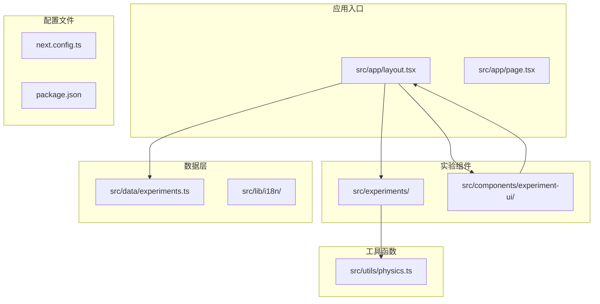
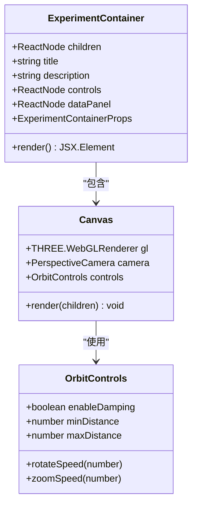
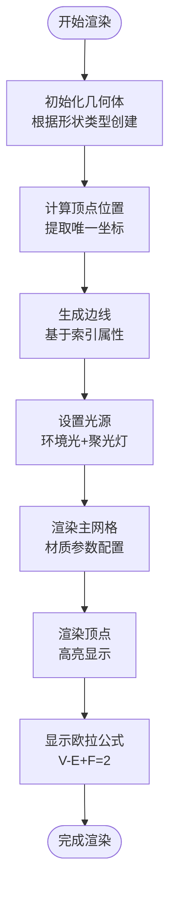
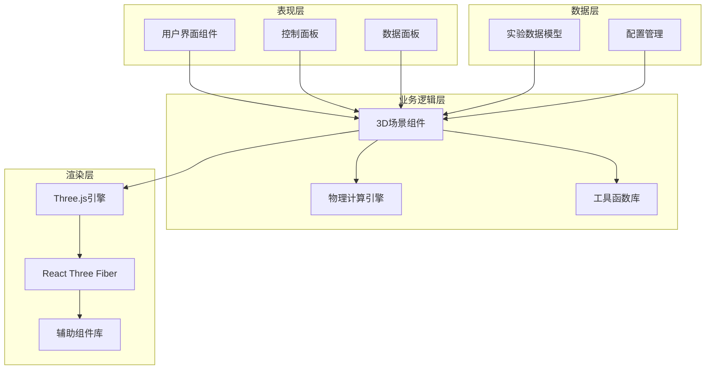
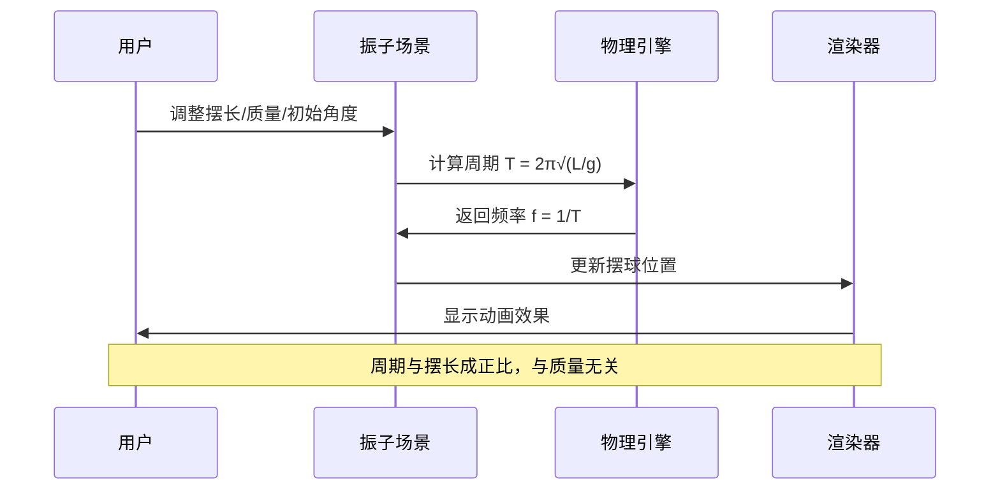
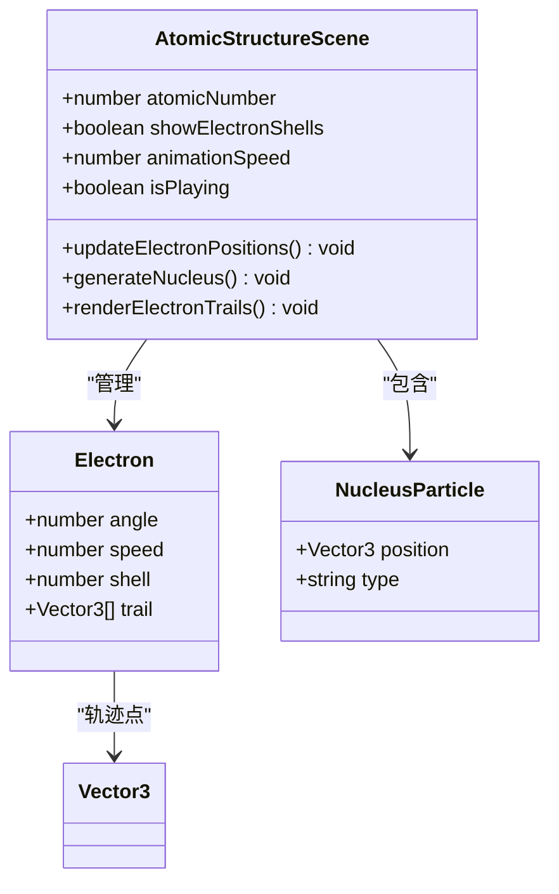
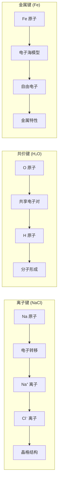
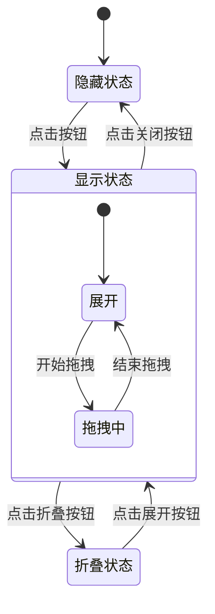
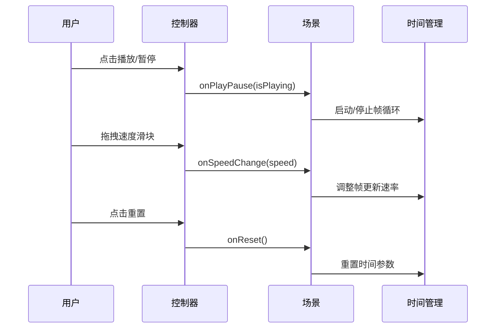

# Three.js基础技能

<cite>
**本文档引用的文件**
- [README.md](file://README.md)
- [package.json](file://package.json)
- [src/app/layout.tsx](file://src/app/layout.tsx)
- [src/data/experiments.ts](file://src/data/experiments.ts)
- [src/lib/i18n/locales.ts](file://src/lib/i18n/locales.ts)
- [src/experiments/3d-geometry-scene.tsx](file://src/experiments/3d-geometry-scene.tsx)
- [src/experiments/3d-geometry-page.tsx](file://src/experiments/3d-geometry-page.tsx)
- [src/components/experiment-ui/ExperimentContainer.tsx](file://src/components/experiment-ui/ExperimentContainer.tsx)
- [src/components/experiment-ui/SimulationController.tsx](file://src/components/experiment-ui/SimulationController.tsx)
- [src/utils/physics.ts](file://src/utils/physics.ts)
- [src/experiments/atomic-structure-scene.tsx](file://src/experiments/atomic-structure-scene.tsx)
- [src/experiments/chemical-bonding-scene.tsx](file://src/experiments/chemical-bonding-scene.tsx)
- [src/components/experiment-ui/ControlPanel.tsx](file://src/components/experiment-ui/ControlPanel.tsx)
- [src/components/experiment-ui/DataPanel.tsx](file://src/components/experiment-ui/DataPanel.tsx)
- [next.config.ts](file://next.config.ts)
</cite>

## 目录
1. [项目简介](#项目简介)
2. [项目结构](#项目结构)
3. [核心组件](#核心组件)
4. [架构概览](#架构概览)
5. [详细组件分析](#详细组件分析)
6. [依赖关系分析](#依赖关系分析)
7. [性能考虑](#性能考虑)
8. [故障排除指南](#故障排除指南)
9. [结论](#结论)

## 项目简介

ScienceLab 3D是一个基于Three.js的交互式3D科学学习平台，提供40多个虚拟科学实验，涵盖物理、化学、生物和数学四个学科领域。该项目使用Next.js 15和React 19构建，采用TypeScript进行类型安全编程，通过Three.js和React Three Fiber实现3D图形渲染。

该平台的核心目标是通过沉浸式的3D可视化体验，让学习者能够直观地理解和探索复杂的科学概念，从简单的原子结构到高级的量子力学现象。

## 项目结构

项目采用模块化的文件组织结构，主要分为以下几个核心目录：



**图表来源**
- [src/app/layout.tsx:1-207](file://src/app/layout.tsx#L1-L207)
- [src/data/experiments.ts:1-503](file://src/data/experiments.ts#L1-L503)

**章节来源**
- [README.md:108-135](file://README.md#L108-L135)
- [package.json:1-38](file://package.json#L1-L38)

## 核心组件

### 实验容器组件

ExperimentContainer是所有3D实验的基础容器组件，提供了统一的3D画布环境和用户界面框架：



**图表来源**
- [src/components/experiment-ui/ExperimentContainer.tsx:55-373](file://src/components/experiment-ui/ExperimentContainer.tsx#L55-L373)

### 3D几何实验

3D几何实验展示了五个柏拉图立体（正四面体、立方体、正八面体、正十二面体、正二十面体）的可视化：



**图表来源**
- [src/experiments/3d-geometry-scene.tsx:30-243](file://src/experiments/3d-geometry-scene.tsx#L30-L243)

**章节来源**
- [src/experiments/3d-geometry-scene.tsx:1-243](file://src/experiments/3d-geometry-scene.tsx#L1-L243)
- [src/experiments/3d-geometry-page.tsx:1-190](file://src/experiments/3d-geometry-page.tsx#L1-L190)

## 架构概览

ScienceLab 3D采用了分层架构设计，确保了良好的可维护性和扩展性：



**图表来源**
- [src/components/experiment-ui/ExperimentContainer.tsx:137-207](file://src/components/experiment-ui/ExperimentContainer.tsx#L137-L207)
- [src/utils/physics.ts:1-687](file://src/utils/physics.ts#L1-L687)

## 详细组件分析

### 物理计算引擎

项目内置了完整的物理计算模块，涵盖了从经典力学到量子物理的广泛领域：

#### 简谐振动系统

简谐振动是物理学中最基本的周期运动模型之一：



**图表来源**
- [src/utils/physics.ts:35-92](file://src/utils/physics.ts#L35-L92)

#### 原子结构可视化

原子结构实验实现了玻尔模型的3D可视化：



**图表来源**
- [src/experiments/atomic-structure-scene.tsx:72-365](file://src/experiments/atomic-structure-scene.tsx#L72-L365)

#### 化学键合模拟

化学键合实验展示了三种主要的化学键类型：



**图表来源**
- [src/experiments/chemical-bonding-scene.tsx:513-751](file://src/experiments/chemical-bonding-scene.tsx#L513-L751)

**章节来源**
- [src/utils/physics.ts:25-687](file://src/utils/physics.ts#L25-L687)
- [src/experiments/atomic-structure-scene.tsx:1-365](file://src/experiments/atomic-structure-scene.tsx#L1-L365)
- [src/experiments/chemical-bonding-scene.tsx:1-943](file://src/experiments/chemical-bonding-scene.tsx#L1-L943)

### 用户界面组件

#### 实时数据面板

数据面板组件提供了灵活的拖拽和折叠功能：



**图表来源**
- [src/components/experiment-ui/DataPanel.tsx:29-219](file://src/components/experiment-ui/DataPanel.tsx#L29-L219)

#### 模拟控制器

模拟控制器提供了统一的播放/暂停、重置和速度控制功能：



**图表来源**
- [src/components/experiment-ui/SimulationController.tsx:27-228](file://src/components/experiment-ui/SimulationController.tsx#L27-L228)

**章节来源**
- [src/components/experiment-ui/ControlPanel.tsx:1-300](file://src/components/experiment-ui/ControlPanel.tsx#L1-L300)
- [src/components/experiment-ui/DataPanel.tsx:1-219](file://src/components/experiment-ui/DataPanel.tsx#L1-L219)
- [src/components/experiment-ui/SimulationController.tsx:1-228](file://src/components/experiment-ui/SimulationController.tsx#L1-L228)

## 依赖关系分析

项目的技术栈采用了现代化的前端开发工具链：

```mermaid
graph TB
subgraph "核心框架"
NextJS[Next.js 15]
React[React 19]
TypeScript[TypeScript]
end
subgraph "3D图形"
ThreeJS[Three.js 0.184]
Fiber[React Three Fiber]
Drei[@react-three/drei]
PostProcessing[@react-three/postprocessing]
end
subgraph "动画与UI"
Framer[Framer Motion]
TailwindCSS[Tailwind CSS]
Lucide[Lucide React]
end
subgraph "国际化"
NextIntl[next-intl]
end
subgraph "开发工具"
Leva[Leva]
CrossEnv[cross-env]
end
NextJS --> React
NextJS --> TypeScript
React --> Fiber
Fiber --> ThreeJS
Fiber --> Drei
ThreeJS --> PostProcessing
React --> Framer
React --> TailwindCSS
React --> Lucide
NextJS --> NextIntl
React --> Leva
```

**图表来源**
- [package.json:10-22](file://package.json#L10-L22)

**章节来源**
- [package.json:1-38](file://package.json#L1-L38)
- [next.config.ts:1-9](file://next.config.ts#L1-L9)

## 性能考虑

### 渲染优化策略

项目采用了多种性能优化技术来确保流畅的3D渲染体验：

1. **实例化渲染**：使用InstancedMesh减少绘制调用
2. **帧率控制**：限制最大帧时间避免过载
3. **条件渲染**：仅在需要时更新复杂几何体
4. **内存管理**：及时清理未使用的对象和纹理

### 移动端适配

针对不同设备进行了专门的优化：

- **高DPR处理**：桌面设备使用更高像素比
- **触摸控制**：优化移动端手势操作
- **性能降级**：移动设备自动降低渲染质量

## 故障排除指南

### 常见问题及解决方案

#### Three.js相关错误

**问题**：Three.js版本不兼容
**解决方案**：检查package.json中的three版本，确保与React Three Fiber兼容

**问题**：渲染异常或白屏
**解决方案**：确认Canvas组件正确挂载，检查浏览器控制台错误信息

#### 性能问题

**问题**：帧率下降
**解决方案**：
1. 减少同时渲染的对象数量
2. 使用LOD（细节层次）技术
3. 优化材质和纹理大小
4. 启用适当的抗锯齿设置

#### 移动端问题

**问题**：触摸事件无响应
**解决方案**：检查OrbitControls的touches配置，确保启用适当的触摸模式

**章节来源**
- [src/components/experiment-ui/ExperimentContainer.tsx:78-133](file://src/components/experiment-ui/ExperimentContainer.tsx#L78-L133)

## 结论

ScienceLab 3D项目展现了现代Web 3D应用开发的最佳实践。通过精心设计的架构和丰富的教学内容，该项目成功地将复杂的科学概念转化为直观的3D可视化体验。

项目的主要优势包括：

1. **教育价值**：涵盖4个学科领域的40多个实验，满足不同学习需求
2. **技术先进**：采用最新的React 19和Next.js 15框架
3. **用户体验**：提供流畅的交互式3D体验
4. **可扩展性**：模块化设计便于添加新的实验内容
5. **开源生态**：充分利用Three.js生态系统的优势

该项目为学习者提供了一个沉浸式的科学探索环境，使抽象的理论概念变得具体可感，是Web 3D教育应用的优秀范例。