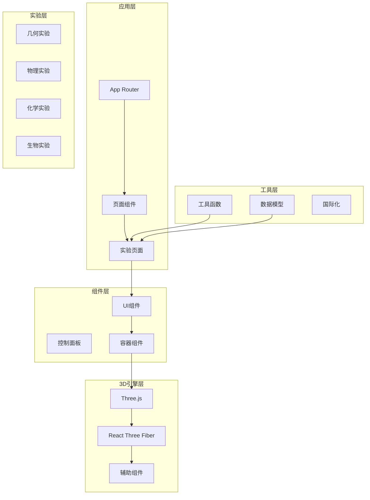
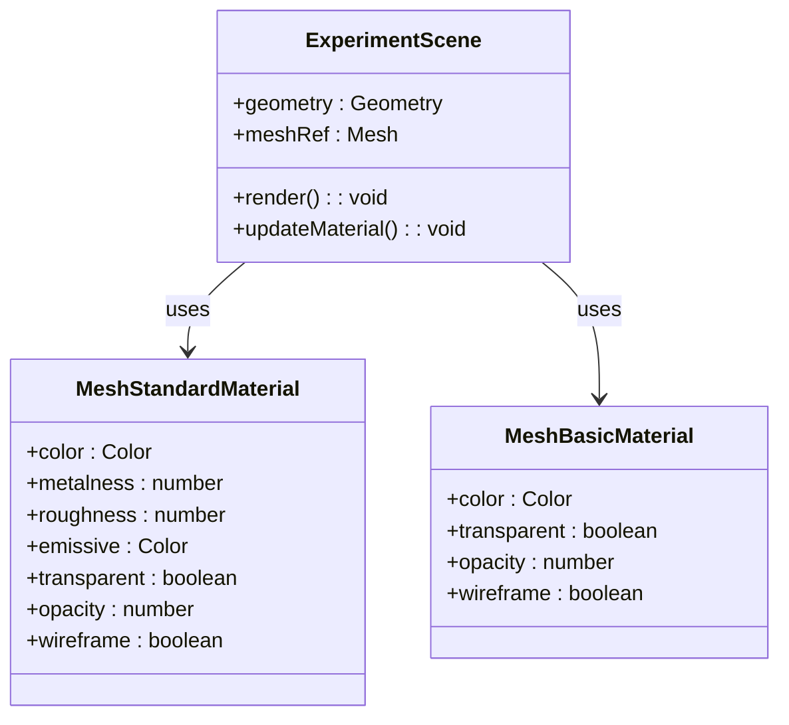
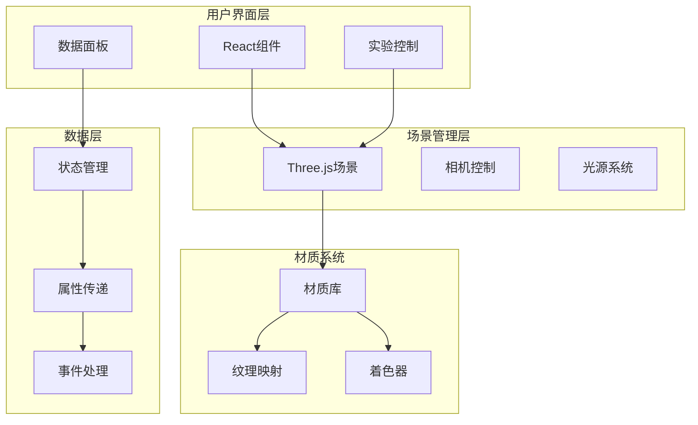
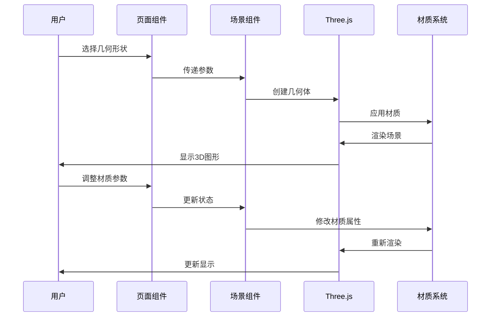
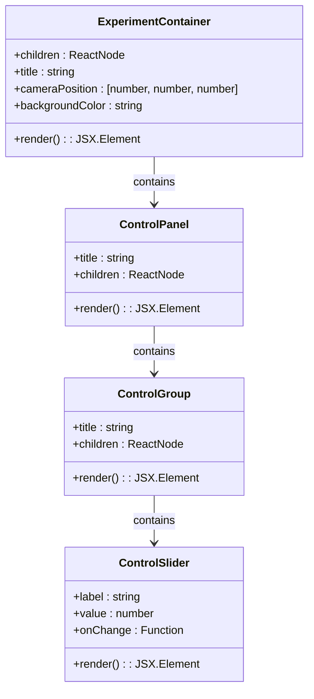
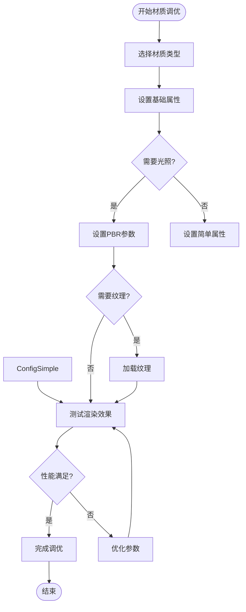
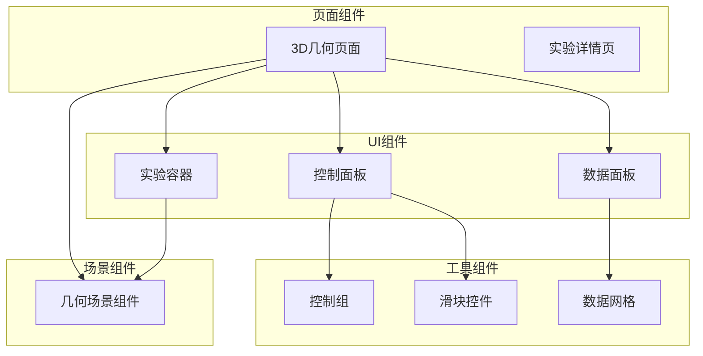
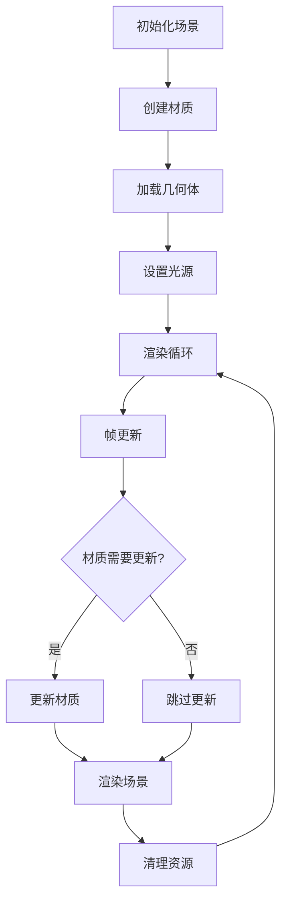

# Three.js材质技能

<cite>
**本文档引用的文件**
- [README.md](file://README.md)
- [package.json](file://package.json)
- [src\experiments\3d-geometry-scene.tsx](file://src/experiments/3d-geometry-scene.tsx)
- [src\experiments\3d-geometry-page.tsx](file://src/experiments/3d-geometry-page.tsx)
- [src\components\experiment-ui\ExperimentContainer.tsx](file://src/components/experiment-ui/ExperimentContainer.tsx)
- [src\components\experiment-ui\ExperimentControls.tsx](file://src/components/experiment-ui/ExperimentControls.tsx)
- [src\components\experiment-ui\index.ts](file://src/components/experiment-ui/index.ts)
- [src\app\experiments\3d-geometry\details\page.tsx](file://src/app/experiments/3d-geometry/details/page.tsx)
- [src\data\experiments.ts](file://src/data/experiments.ts)
- [.trae\skills\threejs-materials\SKILL.md](file://.trae/skills/threejs-materials/SKILL.md)
</cite>

## 目录
1. [简介](#简介)
2. [项目结构](#项目结构)
3. [核心组件](#核心组件)
4. [架构概览](#架构概览)
5. [详细组件分析](#详细组件分析)
6. [依赖关系分析](#依赖关系分析)
7. [性能考虑](#性能考虑)
8. [故障排除指南](#故障排除指南)
9. [结论](#结论)

## 简介

ScienceLab 3D是一个基于Three.js的交互式3D科学学习平台，包含40多个虚拟科学实验。该项目使用React Three Fiber作为Three.js的React渲染器，提供了丰富的3D可视化体验。

本项目特别专注于Three.js材质技能的展示和应用，通过3D几何实验演示了各种材质类型的使用方法和效果。项目采用现代前端技术栈，包括Next.js 15、React 19、TypeScript等。

## 项目结构

项目采用模块化组织结构，主要分为以下几个部分：



**图表来源**
- [package.json:10-22](file://package.json#L10-L22)
- [src\experiments\3d-geometry-scene.tsx:1-243](file://src/experiments/3d-geometry-scene.tsx#L1-L243)

**章节来源**
- [README.md:108-135](file://README.md#L108-L135)
- [package.json:1-38](file://package.json#L1-L38)

## 核心组件

### Three.js材质系统

项目中的3D几何实验展示了多种Three.js材质的使用：

#### 主要材质类型

1. **MeshStandardMaterial** - 基于物理的渲染材质
   - 用于立方体主体的蓝色半透明材质
   - 支持金属度和粗糙度参数
   - 实现了真实的光照效果

2. **MeshBasicMaterial** - 基础材质
   - 用于形状标签的不透明材质
   - 不受光照影响，渲染速度快

3. **特殊材质应用**
   - 线条材质用于边框显示
   - 球体材质用于顶点高亮
   - 发光材质用于视觉效果增强

#### 材质属性配置



**图表来源**
- [src\experiments\3d-geometry-scene.tsx:168-179](file://src/experiments/3d-geometry-scene.tsx#L168-L179)
- [src\experiments\3d-geometry-scene.tsx:184-203](file://src/experiments/3d-geometry-scene.tsx#L184-L203)

**章节来源**
- [src\experiments\3d-geometry-scene.tsx:8-24](file://src/experiments/3d-geometry-scene.tsx#L8-L24)

## 架构概览

项目采用分层架构设计，从底层的3D渲染到上层的应用逻辑都有清晰的职责分离：



**图表来源**
- [src\components\experiment-ui\ExperimentContainer.tsx:139-207](file://src/components/experiment-ui/ExperimentContainer.tsx#L139-L207)
- [src\experiments\3d-geometry-scene.tsx:155-239](file://src/experiments/3d-geometry-scene.tsx#L155-L239)

## 详细组件分析

### 3D几何场景组件

#### 组件架构



**图表来源**
- [src\experiments\3d-geometry-page.tsx:155-163](file://src/experiments/3d-geometry-page.tsx#L155-L163)
- [src\experiments\3d-geometry-scene.tsx:30-47](file://src/experiments/3d-geometry-scene.tsx#L30-L47)

#### 材质实现细节

场景中使用了多种材质组合来实现不同的视觉效果：

1. **主体材质** (`MeshStandardMaterial`)
   - 蓝色半透明立方体
   - 金属度：0.5
   - 粗糙度：0.2
   - 发光效果：根据wireframe模式调整

2. **顶点材质** (`MeshStandardMaterial`)
   - 红色发光球体
   - 金属度：0.7
   - 发光强度：0.6

3. **线框材质** (`Line`)
   - 蓝色线条
   - 不受光照影响

**章节来源**
- [src\experiments\3d-geometry-scene.tsx:168-204](file://src/experiments/3d-geometry-scene.tsx#L168-L204)

### 实验控制面板

#### 控制组件体系



**图表来源**
- [src\components\experiment-ui\ExperimentContainer.tsx:55-66](file://src/components/experiment-ui/ExperimentContainer.tsx#L55-L66)
- [src\components\experiment-ui\ExperimentControls.tsx:13-24](file://src/components/experiment-ui/ExperimentControls.tsx#L13-L24)

#### 参数控制系统

页面提供了完整的参数控制系统：

1. **几何形状选择**
   - 四种不同类型的柏拉图立体
   - 实时切换和预览

2. **显示设置**
   - 旋转速度控制
   - 线框模式开关
   - 顶点显示开关
   - 边框显示开关

3. **实时数据反馈**
   - 欧拉示性数计算
   - 几何参数实时更新

**章节来源**
- [src\experiments\3d-geometry-page.tsx:42-120](file://src/experiments/3d-geometry-page.tsx#L42-L120)

### 材质技能展示

#### 材质类型对比

项目中使用的材质类型体现了不同的渲染特性和应用场景：

| 材质类型 | 特点 | 应用场景 | 性能特性 |
|---------|------|----------|----------|
| MeshBasicMaterial | 无光照计算 | 快速渲染、标签显示 | 最快 |
| MeshStandardMaterial | 基于物理渲染 | 主体几何、真实感 | 中等 |
| Line材质 | 线条渲染 | 边框、轮廓 | 快速 |
| 球体材质 | 发光效果 | 顶点高亮 | 中等 |

#### 材质属性调优



**图表来源**
- [.trae\skills\threejs-materials\SKILL.md:386-421](file://.trae/skills/threejs-materials/SKILL.md#L386-L421)

**章节来源**
- [.trae\skills\threejs-materials\SKILL.md:38-134](file://.trae/skills/threejs-materials/SKILL.md#L38-L134)

## 依赖关系分析

### 技术栈依赖

项目的技术栈采用了现代化的组合，每个依赖都有其特定的作用：

```mermaid
graph LR
subgraph "核心框架"
NextJS[Next.js 15]
React[React 19]
TypeScript[TypeScript]
end
subgraph "3D渲染"
ThreeJS[Three.js 0.184]
Fiber[React Three Fiber]
Drei[@react-three/drei]
end
subgraph "辅助库"
PostProcessing[@react-three/postprocessing]
FramerMotion[Framer Motion]
Leva[Leva]
end
subgraph "样式与工具"
TailwindCSS[Tailwind CSS]
LucideReact[Lucide React]
end
NextJS --> React
React --> Fiber
Fiber --> ThreeJS
ThreeJS --> Drei
ThreeJS --> PostProcessing
React --> FramerMotion
React --> Leva
NextJS --> TailwindCSS
NextJS --> LucideReact
```

**图表来源**
- [package.json:10-32](file://package.json#L10-L32)

### 组件间依赖关系



**图表来源**
- [src\experiments\3d-geometry-page.tsx:1-190](file://src/experiments/3d-geometry-page.tsx#L1-L190)
- [src\components\experiment-ui\index.ts:1-43](file://src/components/experiment-ui/index.ts#L1-L43)

**章节来源**
- [package.json:10-32](file://package.json#L10-L32)

## 性能考虑

### 渲染性能优化

项目在材质使用方面遵循了多项性能优化原则：

1. **材质复用策略**
   - 相同材质对象在场景中重复使用
   - 避免不必要的材质创建和销毁

2. **透明度处理**
   - 使用alphaTest替代完全透明材质
   - 减少透明物体的排序开销

3. **光照优化**
   - 合理控制光源数量
   - 使用环境光替代昂贵的实时光源

4. **几何优化**
   - 使用适当的细分级别
   - 避免过度复杂的几何体

### 内存管理



**图表来源**
- [src\experiments\3d-geometry-scene.tsx:131-153](file://src/experiments/3d-geometry-scene.tsx#L131-L153)

## 故障排除指南

### 常见问题及解决方案

#### 材质渲染问题

1. **材质不显示**
   - 检查光源设置
   - 验证材质属性配置
   - 确认几何体有正确的法向量

2. **性能问题**
   - 减少透明材质使用
   - 降低纹理分辨率
   - 简化几何复杂度

3. **颜色异常**
   - 检查色调映射设置
   - 验证环境光配置
   - 确认材质颜色值范围

#### 交互问题

1. **控制面板不响应**
   - 检查事件绑定
   - 验证状态更新逻辑
   - 确认组件重新渲染

2. **3D场景无响应**
   - 检查相机控制设置
   - 验证鼠标事件处理
   - 确认触摸设备支持

**章节来源**
- [src\components\experiment-ui\ExperimentContainer.tsx:78-133](file://src/components/experiment-ui/ExperimentContainer.tsx#L78-L133)

## 结论

ScienceLab 3D项目成功地展示了Three.js材质系统的强大功能和应用技巧。通过3D几何实验，项目不仅演示了各种材质类型的使用方法，还体现了现代3D应用开发的最佳实践。

项目的主要优势包括：

1. **教育价值** - 为学习者提供了直观的3D材质概念理解
2. **技术先进** - 采用最新的React和Three.js技术栈
3. **用户体验** - 提供流畅的交互式学习体验
4. **可扩展性** - 模块化的架构便于添加新的实验内容

该项目为开发者提供了宝贵的Three.js材质使用参考，特别是在实际教学和学习场景中的应用案例。通过深入理解项目中的材质实现，开发者可以更好地掌握3D渲染的核心概念和技术要点。