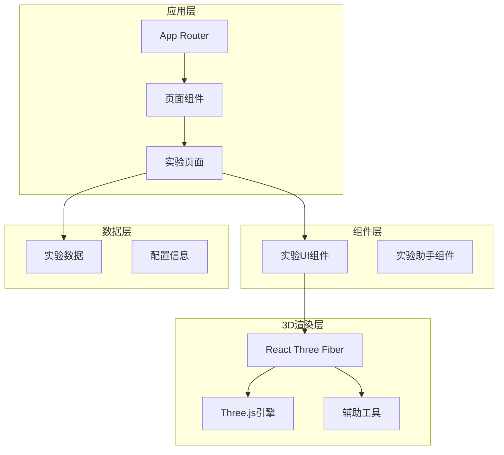
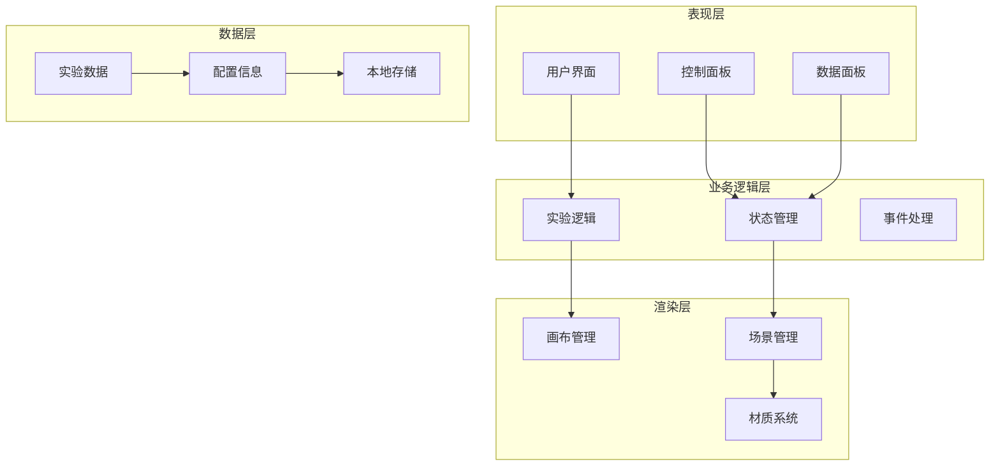
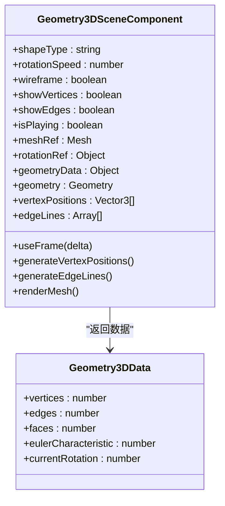
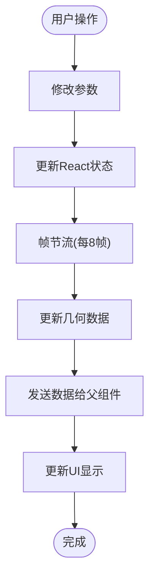
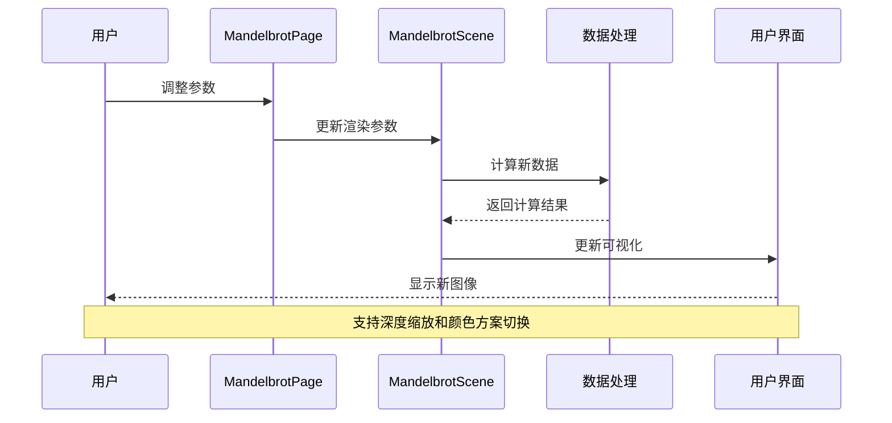
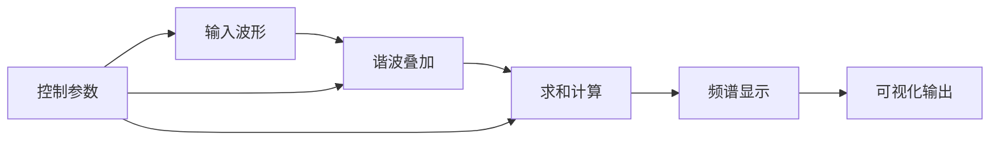

# Three.js着色器技能

<cite>
**本文档引用的文件**
- [README.md](file://README.md)
- [package.json](file://package.json)
- [src/app/layout.tsx](file://src/app/layout.tsx)
- [src/app/page.tsx](file://src/app/page.tsx)
- [src/data/experiments.ts](file://src/data/experiments.ts)
- [src/experiments/3d-geometry-page.tsx](file://src/experiments/3d-geometry-page.tsx)
- [src/experiments/3d-geometry-scene.tsx](file://src/experiments/3d-geometry-scene.tsx)
- [src/experiments/fourier-transform-page.tsx](file://src/experiments/fourier-transform-page.tsx)
- [src/experiments/mandelbrot-page.tsx](file://src/experiments/mandelbrot-page.tsx)
- [src/experiments/topology-surfaces-page.tsx](file://src/experiments/topology-surfaces-page.tsx)
- [src/components/experiment-ui/index.ts](file://src/components/experiment-ui/index.ts)
- [src/components/experiment-ui/ExperimentContainer.tsx](file://src/components/experiment-ui/ExperimentContainer.tsx)
- [src/components/experiment-ui/SimulationController.tsx](file://src/components/experiment-ui/SimulationController.tsx)
</cite>

## 目录
1. [项目简介](#项目简介)
2. [项目结构](#项目结构)
3. [核心组件](#核心组件)
4. [架构概览](#架构概览)
5. [详细组件分析](#详细组件分析)
6. [依赖关系分析](#依赖关系分析)
7. [性能考虑](#性能考虑)
8. [故障排除指南](#故障排除指南)
9. [结论](#结论)

## 项目简介

ScienceLab 3D是一个基于浏览器的交互式3D科学学习平台，提供40多个虚拟科学实验。该项目使用Three.js和React Three Fiber构建，支持物理、化学、生物和数学四个学科的3D可视化教学。

该项目的核心特色包括：
- 40+ 交互式实验，涵盖从基础到高级的科学概念
- 实时控制面板，可调整变量并即时看到视觉反馈
- 基于Three.js的3D图形渲染
- 响应式设计，支持桌面、平板和移动设备
- 深色/浅色主题切换
- 智能搜索功能

## 项目结构

项目采用模块化架构，主要分为以下几个核心部分：



**图表来源**
- [src/app/layout.tsx:1-207](file://src/app/layout.tsx#L1-L207)
- [src/app/page.tsx:1-632](file://src/app/page.tsx#L1-L632)
- [src/data/experiments.ts:1-514](file://src/data/experiments.ts#L1-L514)

**章节来源**
- [README.md:1-227](file://README.md#L1-L227)
- [package.json:1-38](file://package.json#L1-L38)

## 核心组件

### 实验容器组件
ExperimentContainer提供了完整的3D实验环境，包含画布、控制面板、数据面板和模拟控制器。

### 模拟控制器
SimulationController实现了可拖拽的浮动控制面板，提供播放/暂停、重置和速度调节功能。

### 实验UI组件系统
- ControlGroup：参数控制组
- ControlSlider：滑块控件
- DataGrid：数据网格显示
- FloatingControlPanel：浮动控制面板

**章节来源**
- [src/components/experiment-ui/ExperimentContainer.tsx:1-373](file://src/components/experiment-ui/ExperimentContainer.tsx#L1-L373)
- [src/components/experiment-ui/SimulationController.tsx:1-228](file://src/components/experiment-ui/SimulationController.tsx#L1-L228)
- [src/components/experiment-ui/index.ts:1-43](file://src/components/experiment-ui/index.ts#L1-L43)

## 架构概览

项目采用分层架构设计，每层职责明确：



**图表来源**
- [src/experiments/3d-geometry-page.tsx:1-190](file://src/experiments/3d-geometry-page.tsx#L1-L190)
- [src/experiments/3d-geometry-scene.tsx:1-243](file://src/experiments/3d-geometry-scene.tsx#L1-L243)

## 详细组件分析

### 3D几何实验组件

#### 几何体场景组件
Geometry3DSceneComponent是3D几何实验的核心组件，负责渲染各种柏拉图立体并提供实时数据更新。



**图表来源**
- [src/experiments/3d-geometry-scene.tsx:8-24](file://src/experiments/3d-geometry-scene.tsx#L8-L24)

#### 参数控制流程


**图表来源**
- [src/experiments/3d-geometry-page.tsx:42-120](file://src/experiments/3d-geometry-page.tsx#L42-L120)

**章节来源**
- [src/experiments/3d-geometry-scene.tsx:1-243](file://src/experiments/3d-geometry-scene.tsx#L1-L243)
- [src/experiments/3d-geometry-page.tsx:1-190](file://src/experiments/3d-geometry-page.tsx#L1-L190)

### 分形几何实验组件

#### 曼德布洛特集合组件
MandelbrotPage展示了复杂的分形数学概念，通过交互式着色器渲染实现无限细节的视觉体验。



**图表来源**
- [src/experiments/mandelbrot-page.tsx:1-234](file://src/experiments/mandelbrot-page.tsx#L1-L234)

**章节来源**
- [src/experiments/mandelbrot-page.tsx:1-234](file://src/experiments/mandelbrot-page.tsx#L1-L234)

### 数学可视化实验组件

#### 傅里叶变换组件
FourierTransformPage演示了如何将复杂波形分解为简单的正弦波组合。



**图表来源**
- [src/experiments/fourier-transform-page.tsx:1-209](file://src/experiments/fourier-transform-page.tsx#L1-L209)

**章节来源**
- [src/experiments/fourier-transform-page.tsx:1-209](file://src/experiments/fourier-transform-page.tsx#L1-L209)

### 拓扑学表面组件

#### 流形表面组件
TopologySurfacesPage展示了拓扑学中的重要概念，如莫比乌斯带、克莱因瓶和环面。

**章节来源**
- [src/experiments/topology-surfaces-page.tsx:1-147](file://src/experiments/topology-surfaces-page.tsx#L1-L147)

## 依赖关系分析

项目的技术栈采用现代化的前端技术组合：

```mermaid
graph TB
subgraph "核心框架"
Next[Next.js 15]
React[React 19]
TypeScript[TypeScript]
end
subgraph "3D图形"
Three[Three.js 0.184]
Fiber[React Three Fiber]
Drei[@react-three/drei]
PostProcessing[@react-three/postprocessing]
end
subgraph "动画和UI"
Framer[Framer Motion]
Tailwind[Tailwind CSS]
Lucide[Lucide React]
end
subgraph "开发工具"
Leva[Leva]
Intl[next-intl]
end
Next --> React
React --> Fiber
Fiber --> Three
Fiber --> Drei
Fiber --> PostProcessing
UI --> Framer
UI --> Tailwind
UI --> Lucide
Dev --> Leva
Dev --> Intl
```

**图表来源**
- [package.json:10-32](file://package.json#L10-L32)

**章节来源**
- [package.json:1-38](file://package.json#L1-L38)

## 性能考虑

### 渲染优化策略
1. **帧率节流**：几何体实验使用8帧节流机制，避免频繁的状态更新
2. **条件渲染**：根据用户设置动态决定是否渲染顶点、边框等元素
3. **材质优化**：使用透明度和发光效果时进行性能权衡
4. **响应式设计**：移动端使用较低的渲染质量以保证流畅度

### 内存管理
- 使用useMemo缓存几何数据计算结果
- 合理的垃圾回收策略
- 避免内存泄漏的事件监听器清理

## 故障排除指南

### 常见问题及解决方案

#### 3D渲染问题
1. **模型不显示**：检查几何体参数和材质设置
2. **渲染卡顿**：降低分辨率或减少复杂度
3. **光照异常**：验证光源位置和强度设置

#### 交互问题
1. **控制面板无响应**：确认事件绑定和状态更新逻辑
2. **数据面板显示错误**：检查数据传递和格式化函数
3. **模拟控制器拖拽失效**：验证触摸事件处理

#### 性能问题
1. **帧率下降**：减少同时渲染的对象数量
2. **内存占用过高**：及时清理不再使用的几何体和纹理
3. **CPU使用率高**：优化算法复杂度和循环次数

**章节来源**
- [src/experiments/3d-geometry-scene.tsx:131-153](file://src/experiments/3d-geometry-scene.tsx#L131-L153)

## 结论

ScienceLab 3D项目展现了现代Web 3D图形技术的强大能力。通过精心设计的架构和优化的渲染策略，该项目成功地将复杂的科学概念转化为直观的3D可视化体验。

项目的主要优势包括：
- **教育价值**：为学生和教师提供了强大的3D科学教学工具
- **技术先进性**：采用了最新的Web 3D技术和最佳实践
- **用户体验**：提供了流畅、直观的交互式学习体验
- **可扩展性**：模块化的架构便于添加新的实验内容

该平台不仅展示了Three.js在教育领域的应用潜力，也为其他类似项目提供了宝贵的参考和借鉴价值。