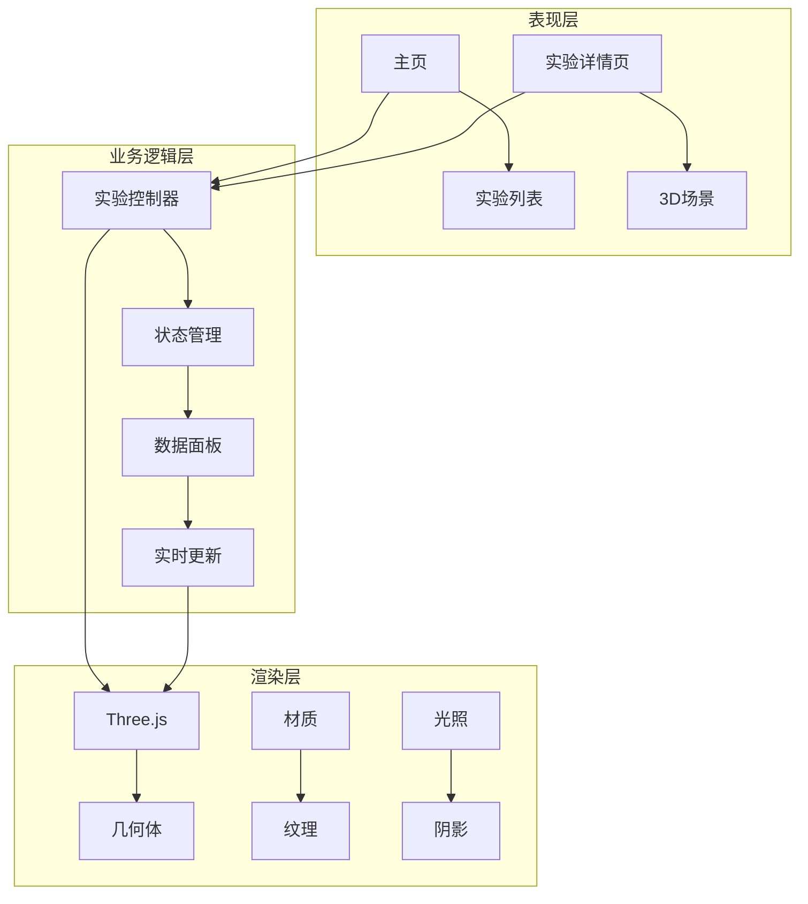
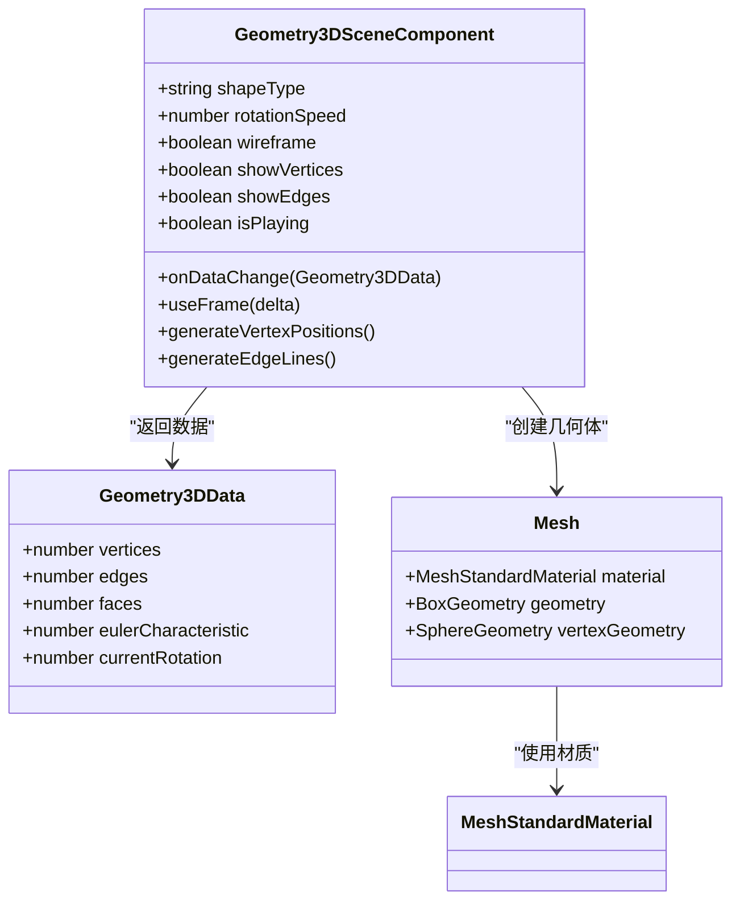
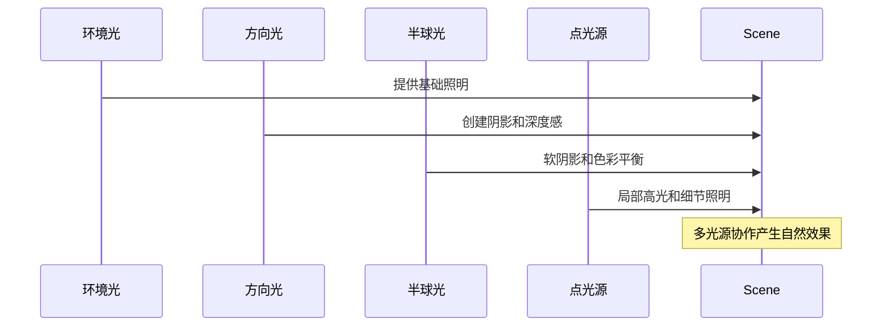
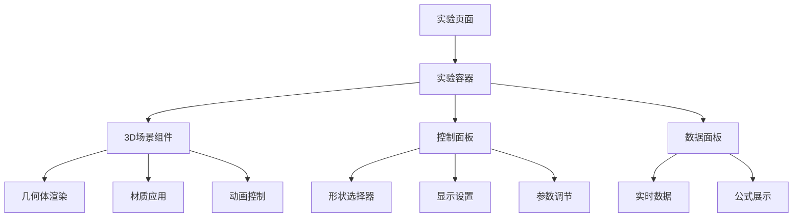
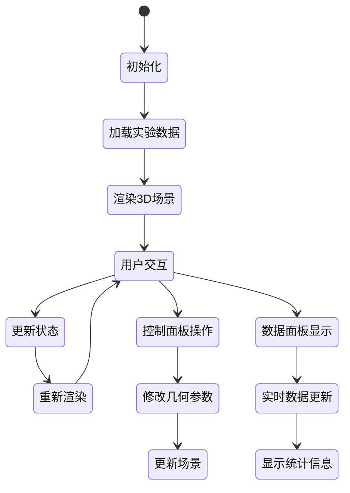
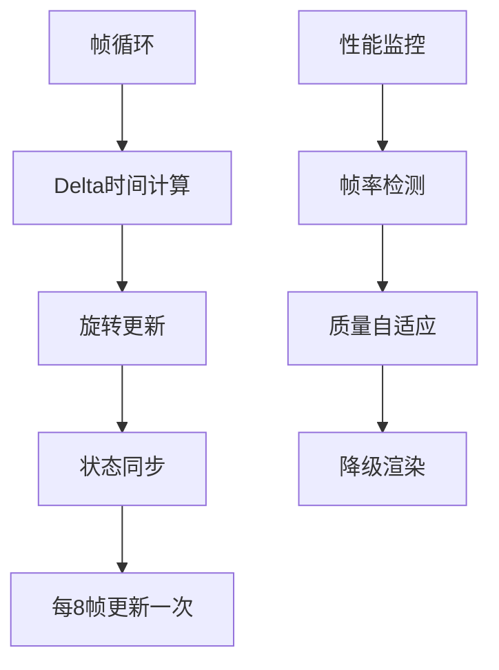

# Three.js纹理技能

<cite>
**本文档引用的文件**
- [README.md](file://README.md)
- [package.json](file://package.json)
- [src/app/layout.tsx](file://src/app/layout.tsx)
- [src/app/page.tsx](file://src/app/page.tsx)
- [src/data/experiments.ts](file://src/data/experiments.ts)
- [src/experiments/3d-geometry-scene.tsx](file://src/experiments/3d-geometry-scene.tsx)
- [src/experiments/3d-geometry-page.tsx](file://src/experiments/3d-geometry-page.tsx)
- [src/app/experiments/3d-geometry/details/page.tsx](file://src/app/experiments/3d-geometry/details/page.tsx)
- [src/components/experiment-ui/index.ts](file://src/components/experiment-ui/index.ts)
- [src/components/experiment-ui/ExperimentContainer.tsx](file://src/components/experiment-ui/ExperimentContainer.tsx)
- [src/components/experiment-ui/ExperimentControls.tsx](file://src/components/experiment-ui/ExperimentControls.tsx)
- [src/lib/i18n/locales.ts](file://src/lib/i18n/locales.ts)
- [src/lib/i18n/dictionaries/en.json](file://src/lib/i18n/dictionaries/en.json)
</cite>

## 目录
1. [项目简介](#项目简介)
2. [项目结构](#项目结构)
3. [核心组件](#核心组件)
4. [架构概览](#架构概览)
5. [详细组件分析](#详细组件分析)
6. [依赖关系分析](#依赖关系分析)
7. [性能考虑](#性能考虑)
8. [故障排除指南](#故障排除指南)
9. [结论](#结论)

## 项目简介

ScienceLab 3D是一个基于浏览器的交互式3D科学学习平台，提供40多个虚拟科学实验，涵盖物理、化学、生物和数学四个学科领域。该项目使用Three.js和React Three Fiber构建3D可视化效果，为学生和教师提供直观的科学学习体验。

该项目的核心特色包括：
- 40+ 交互式实验，实时控制变量并观察即时视觉反馈
- 基于Three.js的3D图形渲染引擎
- 响应式设计，支持桌面、平板和移动设备
- 深色/浅色主题切换功能
- 智能搜索和收藏功能

## 项目结构

项目采用现代化的Next.js 15架构，使用App Router模式组织代码结构：

```mermaid
graph TB
subgraph "应用层"
A[src/app/*] --> B[页面路由]
C[src/components/*] --> D[可复用组件]
E[src/experiments/*] --> F[实验场景]
end
subgraph "数据层"
G[src/data/*] --> H[实验数据]
I[src/lib/i18n/*] --> J[国际化]
end
subgraph "3D渲染层"
K[Three.js] --> L[React Three Fiber]
M[@react-three/drei] --> N[辅助工具]
end
A --> K
C --> K
E --> K
```

**图表来源**
- [src/app/layout.tsx:1-207](file://src/app/layout.tsx#L1-L207)
- [src/app/page.tsx:1-632](file://src/app/page.tsx#L1-L632)

**章节来源**
- [README.md:1-227](file://README.md#L1-L227)
- [package.json:1-38](file://package.json#L1-L38)

## 核心组件

### 实验容器组件
ExperimentContainer是所有3D实验的核心容器，提供了完整的3D场景管理功能：

- **Canvas管理**：自动处理画布尺寸调整和像素比设置
- **相机控制**：集成OrbitControls实现拖拽旋转、缩放和平移
- **光照系统**：配置环境光、方向光、半球光和点光源
- **响应式设计**：根据设备类型调整渲染参数和控件布局

### 实验UI组件库
项目提供了完整的实验控制组件库，包括：

- **ControlGroup**：控件分组容器
- **ControlSlider**：滑块控件，支持数值范围和步长设置
- **ControlCheckbox**：复选框控件，用于布尔值切换
- **DataGrid**：数据网格显示，支持多列布局
- **SimulationController**：模拟控制器，管理播放/暂停和速度调节

### 国际化系统
项目支持中英文双语界面，通过字典文件管理本地化文本：

- 动态语言切换功能
- 实验标题和描述的本地化
- 用户界面文本的国际化

**章节来源**
- [src/components/experiment-ui/ExperimentContainer.tsx:1-373](file://src/components/experiment-ui/ExperimentContainer.tsx#L1-L373)
- [src/components/experiment-ui/ExperimentControls.tsx:1-498](file://src/components/experiment-ui/ExperimentControls.tsx#L1-L498)
- [src/lib/i18n/dictionaries/en.json:1-264](file://src/lib/i18n/dictionaries/en.json#L1-L264)

## 架构概览

ScienceLab 3D采用了模块化的三层架构设计：



**图表来源**
- [src/app/page.tsx:328-632](file://src/app/page.tsx#L328-L632)
- [src/experiments/3d-geometry-page.tsx:18-190](file://src/experiments/3d-geometry-page.tsx#L18-L190)

### 技术栈分析

项目使用了现代前端技术栈，确保高性能和良好的用户体验：

- **Next.js 15**：提供SSR、静态生成和优化的构建系统
- **React 19**：最新的React版本，支持并发特性和新的Hooks
- **Three.js 0.184**：强大的3D图形库，支持复杂的3D场景渲染
- **React Three Fiber**：React的Three.js渲染器，提供声明式3D编程
- **TypeScript**：提供类型安全和更好的开发体验

**章节来源**
- [package.json:10-22](file://package.json#L10-L22)
- [README.md:138-150](file://README.md#L138-L150)

## 详细组件分析

### 3D几何实验场景

3D几何实验是项目中最复杂的3D场景之一，展示了五种柏拉图立体（Platonic Solids）：



**图表来源**
- [src/experiments/3d-geometry-scene.tsx:30-243](file://src/experiments/3d-geometry-scene.tsx#L30-L243)

#### 材质和纹理系统

该场景使用了多种材质类型来实现不同的视觉效果：

| 材质类型 | 属性配置 | 视觉效果 |
|---------|---------|---------|
| MeshStandardMaterial | 金属度0.5，粗糙度0.2 | 标准3D表面渲染 |
| Wireframe材质 | 透明度0.8 | 线框模式显示 |
| 发光材质 | 发光强度0.3 | 边缘高亮效果 |
| 平面材质 | 透明度0.8 | 标签背景 |

#### 光照系统设计

场景包含多层次的光照系统：



**图表来源**
- [src/experiments/3d-geometry-scene.tsx:157-160](file://src/experiments/3d-geometry-scene.tsx#L157-L160)

**章节来源**
- [src/experiments/3d-geometry-scene.tsx:1-243](file://src/experiments/3d-geometry-scene.tsx#L1-L243)
- [src/experiments/3d-geometry-page.tsx:1-190](file://src/experiments/3d-geometry-page.tsx#L1-L190)

### 实验页面架构

每个实验都遵循统一的页面架构模式：



**图表来源**
- [src/experiments/3d-geometry-page.tsx:155-164](file://src/experiments/3d-geometry-page.tsx#L155-L164)

**章节来源**
- [src/experiments/3d-geometry-page.tsx:18-190](file://src/experiments/3d-geometry-page.tsx#L18-L190)

### 数据流管理

项目实现了复杂的数据流管理系统：



**图表来源**
- [src/experiments/3d-geometry-scene.tsx:122-153](file://src/experiments/3d-geometry-scene.tsx#L122-L153)

**章节来源**
- [src/experiments/3d-geometry-scene.tsx:121-153](file://src/experiments/3d-geometry-scene.tsx#L121-L153)

## 依赖关系分析

### 核心依赖关系

```mermaid
graph LR
subgraph "运行时依赖"
A[three] --> B[Three.js核心]
C[@react-three/fiber] --> D[React Three渲染器]
E[@react-three/drei] --> F[Three.js辅助工具]
G[framer-motion] --> H[动画库]
end
subgraph "开发依赖"
I[next] --> J[Next.js框架]
K[typescript] --> L[类型系统]
M[tailwindcss] --> N[样式框架]
end
subgraph "应用层"
O[ExperimentContainer] --> P[Canvas管理]
Q[ExperimentControls] --> R[UI组件]
S[3D场景] --> T[几何体渲染]
end
A --> S
C --> S
E --> S
I --> O
K --> O
M --> O
```

**图表来源**
- [package.json:10-32](file://package.json#L10-L32)

### 组件耦合分析

项目中的组件设计遵循低耦合高内聚的原则：

- **实验容器**：独立管理3D场景生命周期
- **UI组件**：可复用的实验控制界面
- **数据层**：实验数据和配置分离
- **渲染层**：Three.js相关逻辑封装

**章节来源**
- [package.json:10-32](file://package.json#L10-L32)
- [src/components/experiment-ui/index.ts:1-43](file://src/components/experiment-ui/index.ts#L1-L43)

## 性能考虑

### 渲染优化策略

项目采用了多项性能优化措施：

1. **设备检测和适配**
   - 移动端降低渲染质量
   - 自适应像素比设置
   - 动态分辨率调整

2. **内存管理**
   - 几何体对象复用
   - 材质缓存机制
   - 及时释放不再使用的资源

3. **渲染管线优化**
   - 分层光照减少计算量
   - 阴影映射优化
   - 批处理渲染

### 动画性能



**图表来源**
- [src/experiments/3d-geometry-scene.tsx:131-153](file://src/experiments/3d-geometry-scene.tsx#L131-L153)

**章节来源**
- [src/experiments/3d-geometry-scene.tsx:131-153](file://src/experiments/3d-geometry-scene.tsx#L131-L153)

## 故障排除指南

### 常见问题诊断

1. **3D场景不显示**
   - 检查浏览器兼容性
   - 验证WebGL支持
   - 确认权限设置

2. **性能问题**
   - 降低渲染质量设置
   - 关闭不必要的特效
   - 检查设备性能

3. **交互无响应**
   - 刷新页面重试
   - 检查触摸事件处理
   - 验证事件监听器

### 开发调试技巧

- 使用浏览器开发者工具检查Three.js渲染状态
- 监控帧率和内存使用情况
- 利用React DevTools调试组件状态
- 检查网络请求和资源加载

**章节来源**
- [src/components/experiment-ui/ExperimentContainer.tsx:78-97](file://src/components/experiment-ui/ExperimentContainer.tsx#L78-L97)

## 结论

ScienceLab 3D项目展现了现代Web 3D应用的最佳实践，通过精心设计的架构和优化的性能策略，成功地将复杂的3D科学可视化带到了浏览器中。项目的核心优势包括：

1. **技术架构先进**：采用最新的React 19和Next.js 15技术栈
2. **用户体验优秀**：流畅的3D交互和响应式设计
3. **教育价值显著**：为科学教育提供了创新的数字化工具
4. **扩展性强**：模块化的组件设计便于添加新实验

该项目为Web 3D应用开发提供了宝贵的参考案例，特别是在教育科技领域的应用实践。