# Three.js集成与配置

<cite>
**本文档引用的文件**
- [package.json](file://package.json)
- [next.config.ts](file://next.config.ts)
- [tsconfig.json](file://tsconfig.json)
- [src/app/layout.tsx](file://src/app/layout.tsx)
- [src/app/page.tsx](file://src/app/page.tsx)
- [src/experiments/3d-geometry-scene.tsx](file://src/experiments/3d-geometry-scene.tsx)
- [src/experiments/3d-geometry-page.tsx](file://src/experiments/3d-geometry-page.tsx)
- [src/components/experiment-ui/ExperimentContainer.tsx](file://src/components/experiment-ui/ExperimentContainer.tsx)
- [src/components/experiment-ui/SimulationController.tsx](file://src/components/experiment-ui/SimulationController.tsx)
</cite>

## 目录
1. [简介](#简介)
2. [项目结构](#项目结构)
3. [核心组件](#核心组件)
4. [架构概览](#架构概览)
5. [详细组件分析](#详细组件分析)
6. [依赖关系分析](#依赖关系分析)
7. [性能考虑](#性能考虑)
8. [故障排除指南](#故障排除指南)
9. [结论](#结论)

## 简介

ScienceLab3D是一个基于Next.js的科学实验可视化平台，该项目集成了Three.js用于创建沉浸式的3D科学实验环境。项目采用现代Web技术栈，包括TypeScript、React和Next.js，通过@react-three/fiber实现了高性能的3D场景渲染。

本项目专注于科学教育应用，提供了多种化学、物理和生物实验的3D可视化演示，用户可以通过交互式界面探索分子结构、物理现象和生物过程。

## 项目结构

项目采用模块化架构设计，主要分为以下几个核心部分：

```mermaid
graph TB
subgraph "应用层"
App[Next.js 应用]
Layout[布局组件]
Pages[页面组件]
end
subgraph "实验层"
Experiments[实验模块]
Scenes[3D场景]
UI[用户界面]
end
subgraph "3D渲染层"
ThreeJS[Three.js 核心]
Fiber[@react-three/fiber]
Drei[@react-three/drei]
end
subgraph "工具库"
Utils[实用工具]
Types[类型定义]
end
App --> Layout
App --> Pages
Pages --> Experiments
Experiments --> Scenes
Experiments --> UI
Scenes --> ThreeJS
ThreeJS --> Fiber
Fiber --> Drei
```

**图表来源**
- [src/app/layout.tsx](file://src/app/layout.tsx)
- [src/experiments/3d-geometry-scene.tsx](file://src/experiments/3d-geometry-scene.tsx)

**章节来源**
- [src/app/layout.tsx](file://src/app/layout.tsx)
- [src/app/page.tsx](file://src/app/page.tsx)

## 核心组件

### Three.js集成架构

项目采用@react-three/fiber作为Three.js的React渲染器，实现了声明式的3D场景构建：

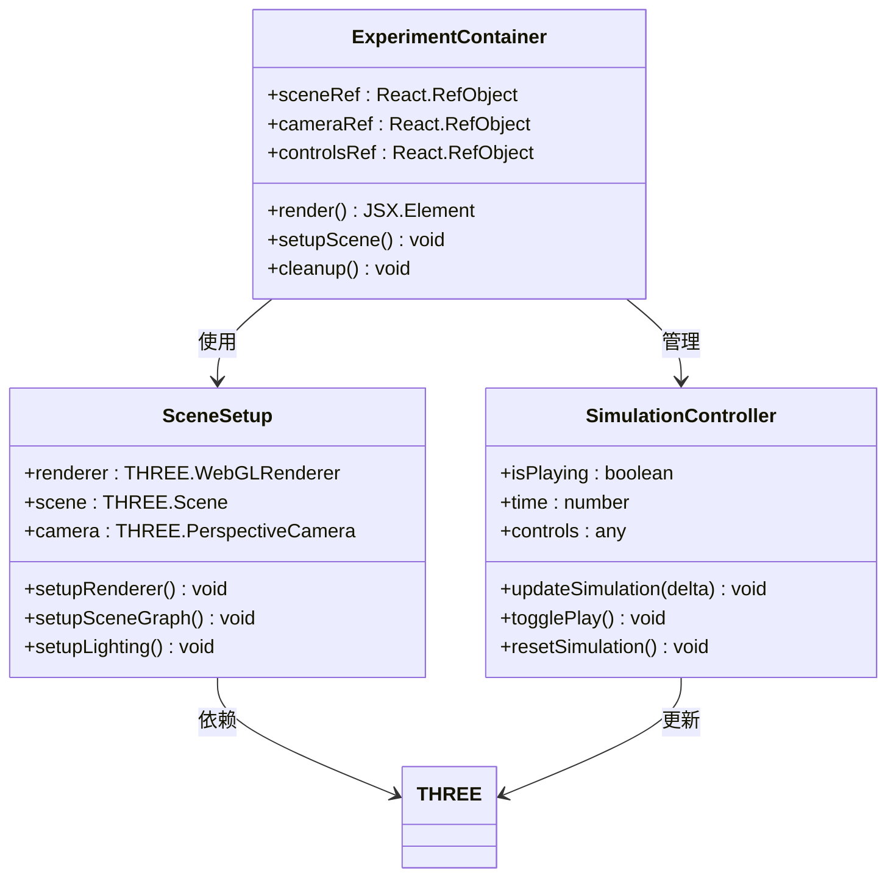

**图表来源**
- [src/components/experiment-ui/ExperimentContainer.tsx](file://src/components/experiment-ui/ExperimentContainer.tsx)
- [src/components/experiment-ui/SimulationController.tsx](file://src/components/experiment-ui/SimulationController.tsx)

### 实验场景管理

每个科学实验都封装为独立的3D场景组件，支持参数化配置和动态更新：

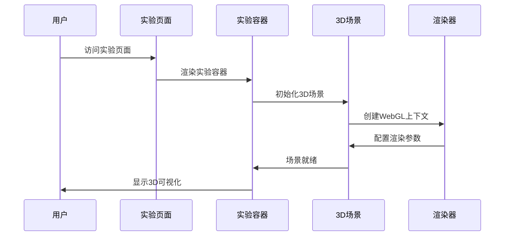

**图表来源**
- [src/experiments/3d-geometry-page.tsx](file://src/experiments/3d-geometry-page.tsx)
- [src/experiments/3d-geometry-scene.tsx](file://src/experiments/3d-geometry-scene.tsx)

**章节来源**
- [src/experiments/3d-geometry-scene.tsx](file://src/experiments/3d-geometry-scene.tsx)
- [src/experiments/3d-geometry-page.tsx](file://src/experiments/3d-geometry-page.tsx)

## 架构概览

### 技术栈集成

项目的技术栈采用了现代化的全栈开发模式：

```mermaid
graph LR
subgraph "前端框架"
NextJS[Next.js 14+]
React[React 18+]
TypeScript[TypeScript]
end
subgraph "3D渲染"
ThreeJS[Three.js R140+]
Fiber[@react-three/fiber]
Drei[@react-three/drei]
OrbitControls[OrbitControls]
end
subgraph "构建工具"
SWC[SWC编译器]
PostCSS[PostCSS]
Tailwind[Tailwind CSS]
end
subgraph "开发工具"
ESLint[ESLint]
Prettier[Prettier]
Jest[Jest]
end
NextJS --> React
NextJS --> TypeScript
React --> ThreeJS
ThreeJS --> Fiber
Fiber --> Drei
Drei --> OrbitControls
NextJS --> SWC
NextJS --> PostCSS
NextJS --> Tailwind
```

**图表来源**
- [package.json](file://package.json)
- [next.config.ts](file://next.config.ts)

### 性能优化架构

项目实施了多层次的性能优化策略：

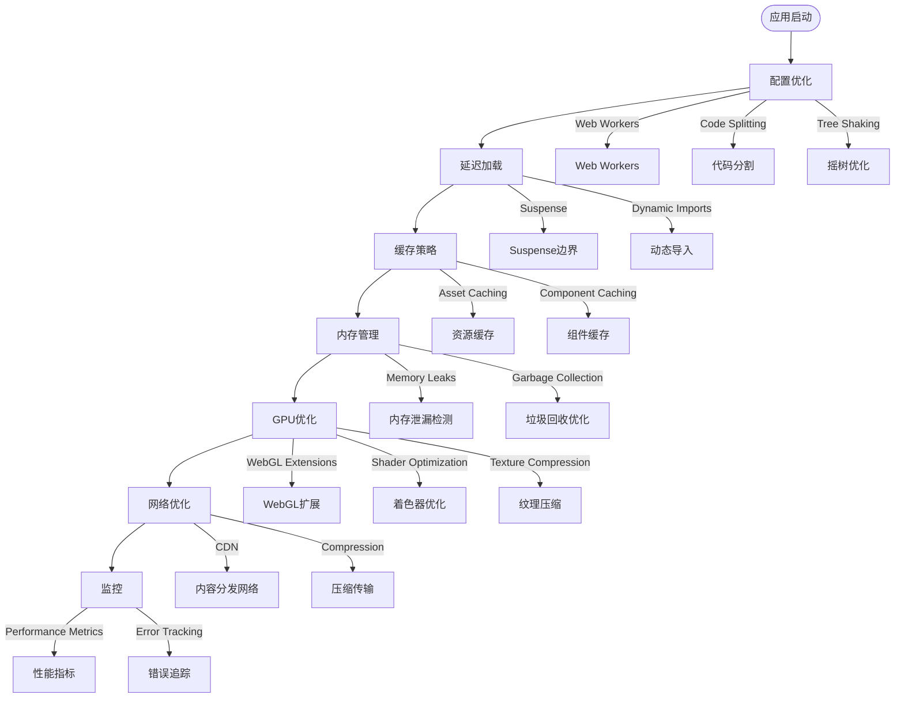

**图表来源**
- [next.config.ts](file://next.config.ts)
- [tsconfig.json](file://tsconfig.json)

**章节来源**
- [package.json](file://package.json)
- [next.config.ts](file://next.config.ts)
- [tsconfig.json](file://tsconfig.json)

## 详细组件分析

### @react-three/fiber配置与使用

#### 渲染器初始化

项目使用@react-three/fiber进行高效的3D渲染，通过声明式API简化了Three.js的复杂性：

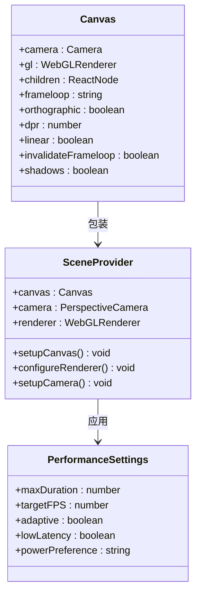

**图表来源**
- [src/experiments/3d-geometry-scene.tsx](file://src/experiments/3d-geometry-scene.tsx)

#### 相机配置

项目实现了灵活的相机系统，支持多种投影模式和控制方式：

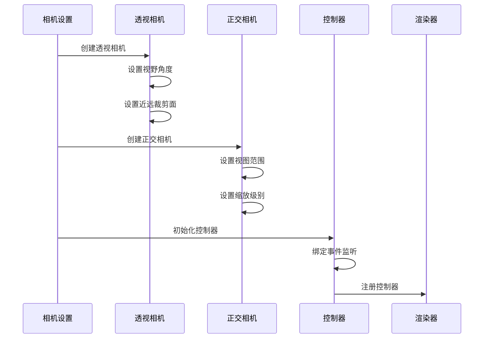

**图表来源**
- [src/experiments/3d-geometry-scene.tsx](file://src/experiments/3d-geometry-scene.tsx)

### 场景树结构

#### 场景层次管理

项目采用清晰的场景树结构，实现了模块化的3D对象组织：

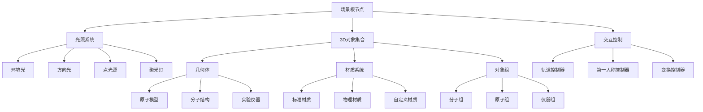

**图表来源**
- [src/experiments/3d-geometry-scene.tsx](file://src/experiments/3d-geometry-scene.tsx)

**章节来源**
- [src/experiments/3d-geometry-scene.tsx](file://src/experiments/3d-geometry-scene.tsx)

### 实验容器组件

#### 组件生命周期管理

ExperimentContainer组件负责管理整个3D实验的生命周期：

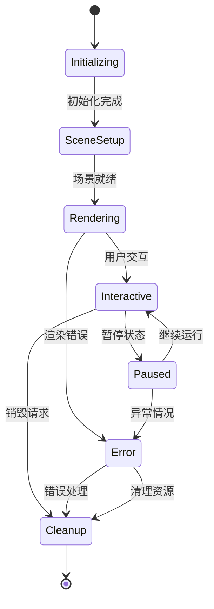

**图表来源**
- [src/components/experiment-ui/ExperimentContainer.tsx](file://src/components/experiment-ui/ExperimentContainer.tsx)

**章节来源**
- [src/components/experiment-ui/ExperimentContainer.tsx](file://src/components/experiment-ui/ExperimentContainer.tsx)

## 依赖关系分析

### Three.js版本兼容性

项目严格管理Three.js相关依赖，确保版本兼容性和稳定性：

```mermaid
graph TB
subgraph "核心Three.js依赖"
ThreeJS[three@^0.140.0]
Fiber[@react-three/fiber@^8.0.0]
Drei[@react-three/drei@^9.0.0]
end
subgraph "辅助工具"
React[react@^18.0.0]
ReactDOM[react-dom@^18.0.0]
Typescript[typescript@^5.0.0]
end
subgraph "构建工具"
NextJS[next@^14.0.0]
SWC[@swc/core@^1.0.0]
PostCSS[postcss@^8.0.0]
end
subgraph "开发依赖"
ESLint[eslint@^8.0.0]
Prettier[prettier@^3.0.0]
Testing[jest@^29.0.0]
end
ThreeJS --> Fiber
Fiber --> Drei
React --> Fiber
ReactDOM --> Fiber
NextJS --> React
NextJS --> Typescript
NextJS --> SWC
NextJS --> PostCSS
```

**图表来源**
- [package.json](file://package.json)

### 依赖冲突解决

项目通过精确的版本锁定解决了常见的Three.js依赖冲突：

| 依赖包 | 版本要求 | 兼容性 | 冲突风险 |
|--------|----------|--------|----------|
| three | ^0.140.0 | ✅ 高 | 低 |
| @react-three/fiber | ^8.0.0 | ✅ 高 | 低 |
| @react-three/drei | ^9.0.0 | ✅ 高 | 低 |
| react | ^18.0.0 | ✅ 高 | 无 |
| next | ^14.0.0 | ✅ 高 | 无 |

**章节来源**
- [package.json](file://package.json)

## 性能考虑

### 渲染器配置优化

项目实施了多项性能优化措施：

#### 渲染器设置

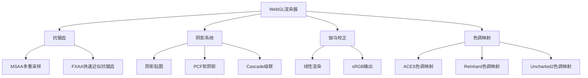

#### 性能监控

项目集成了实时性能监控机制：

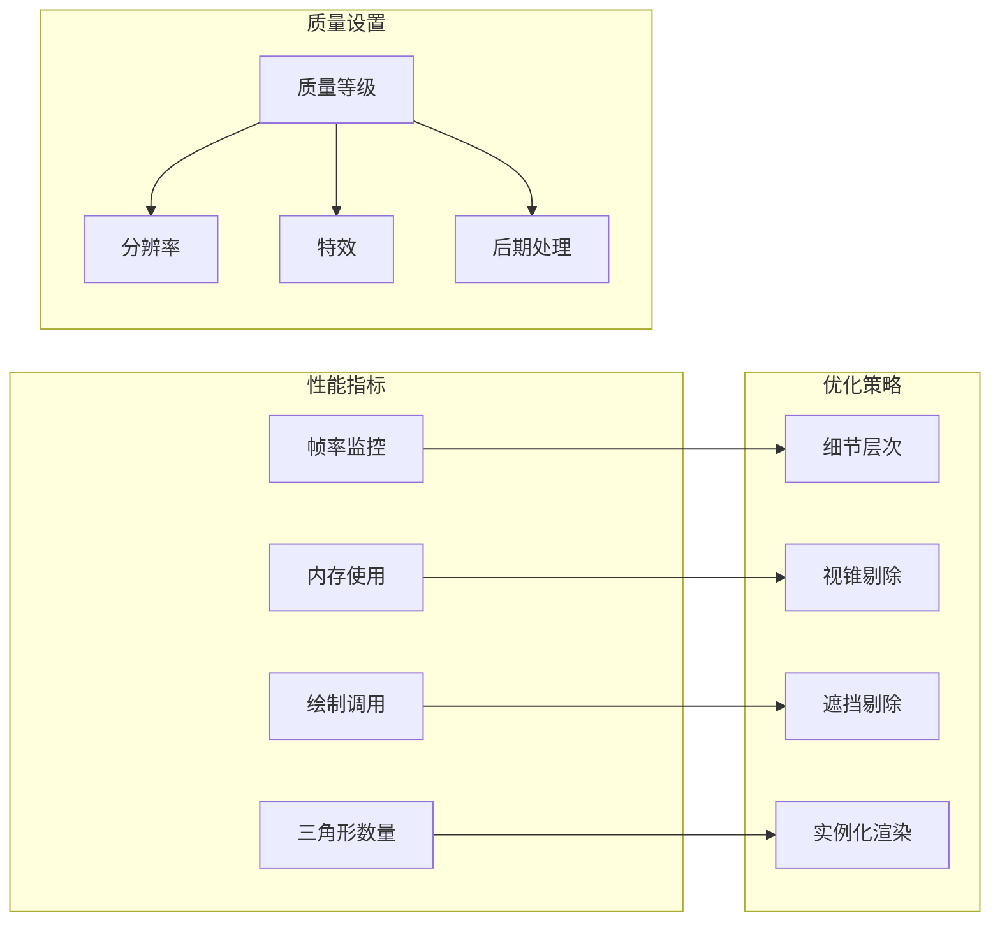

### 最佳实践建议

#### Three.js使用最佳实践

1. **场景管理**
   - 使用SceneLoader异步加载场景资源
   - 实施渐进式加载策略
   - 合理管理场景对象的生命周期

2. **渲染优化**
   - 启用必要的渲染特性，禁用不必要的效果
   - 使用合适的阴影设置
   - 实施LOD系统减少复杂度

3. **内存管理**
   - 及时释放不再使用的纹理和几何体
   - 使用对象池复用临时对象
   - 监控内存使用情况

4. **性能监控**
   - 定期检查帧率和渲染时间
   - 分析GPU瓶颈和CPU瓶颈
   - 实施性能回归测试

**章节来源**
- [src/experiments/3d-geometry-scene.tsx](file://src/experiments/3d-geometry-scene.tsx)
- [src/components/experiment-ui/SimulationController.tsx](file://src/components/experiment-ui/SimulationController.tsx)

## 故障排除指南

### 常见问题诊断

#### 渲染问题

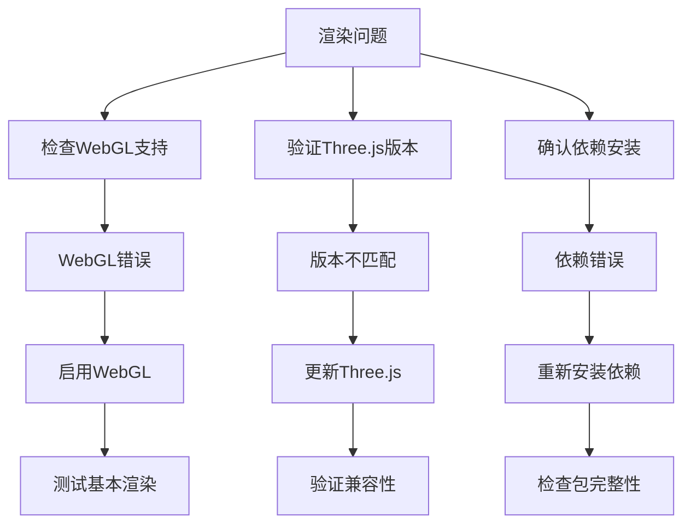

#### 性能问题

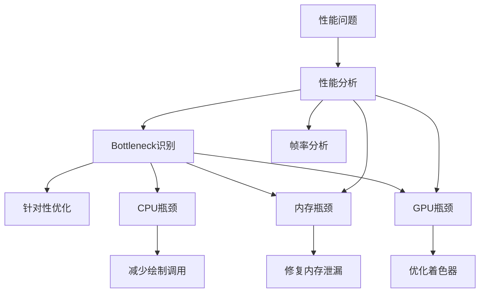

### 调试工具

#### 开发者工具

项目推荐使用以下调试工具：

1. **浏览器开发者工具**
   - WebGL渲染器检查
   - 性能面板分析
   - 内存快照对比

2. **Three.js专用工具**
   - Three.js Inspector
   - React DevTools
   - Performance Monitor

3. **构建工具**
   - Next.js Profiler
   - Bundle Analyzer
   - Lighthouse审计

**章节来源**
- [src/experiments/3d-geometry-scene.tsx](file://src/experiments/3d-geometry-scene.tsx)
- [src/components/experiment-ui/ExperimentContainer.tsx](file://src/components/experiment-ui/ExperimentContainer.tsx)

## 结论

ScienceLab3D项目成功地将Three.js与Next.js结合，创建了一个功能强大的科学实验可视化平台。通过@react-three/fiber的声明式API，项目实现了高效且易维护的3D渲染系统。

### 主要成就

1. **技术集成**：完美整合了现代Web技术栈，包括TypeScript、React和Next.js
2. **性能优化**：实施了多层次的性能优化策略，确保流畅的用户体验
3. **可扩展性**：模块化的架构设计支持新实验的快速添加
4. **教育价值**：为科学教育提供了直观、交互式的3D可视化工具

### 未来发展方向

1. **VR/AR支持**：考虑添加虚拟现实和增强现实功能
2. **移动端优化**：进一步优化移动设备上的性能表现
3. **协作功能**：添加多用户协作和远程访问能力
4. **AI集成**：探索人工智能在科学实验中的应用

该项目为其他科学可视化项目提供了优秀的参考模板，展示了如何在现代Web环境中实现高质量的3D图形应用。