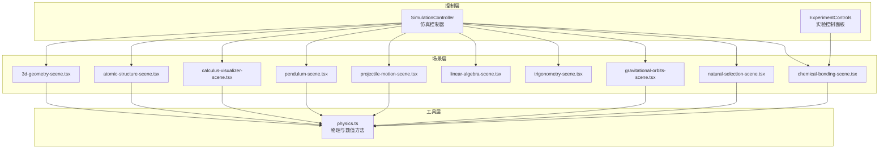
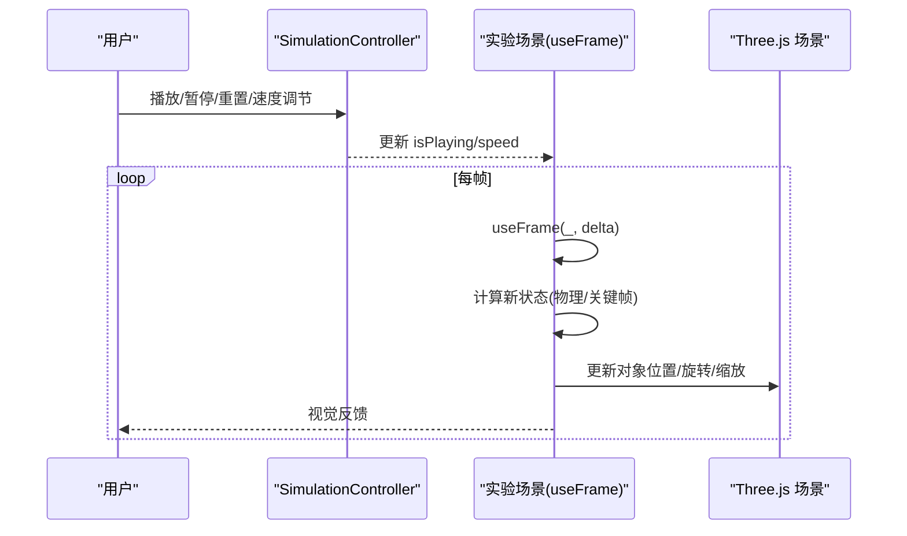
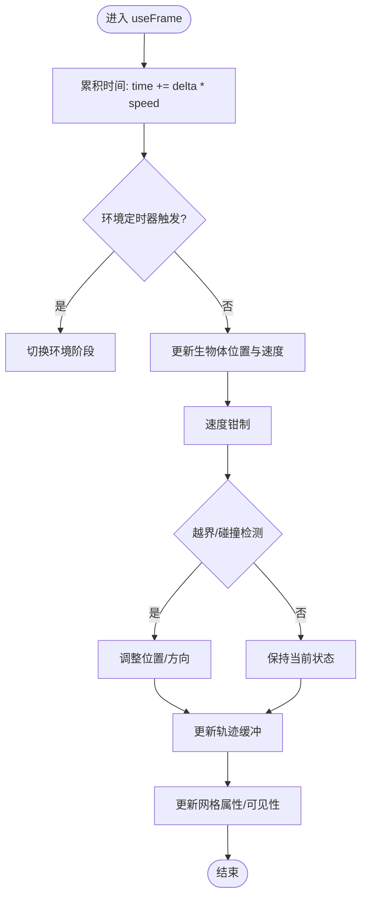
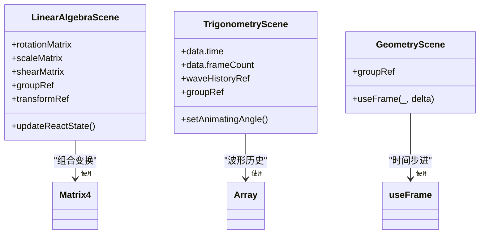
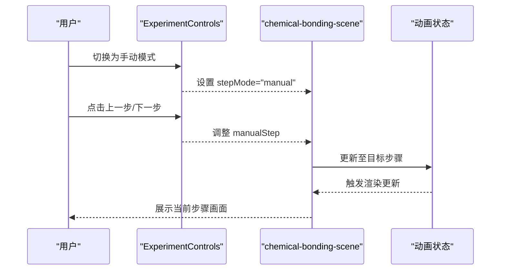
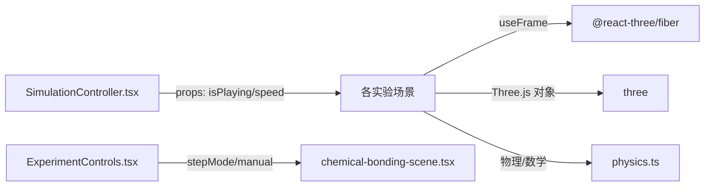

# 动画系统

<cite>
**本文档引用的文件**
- [README.md](file://README.md)
- [package.json](file://package.json)
- [src/components/experiment-ui/SimulationController.tsx](file://src/components/experiment-ui/SimulationController.tsx)
- [src/components/experiment-ui/ExperimentControls.tsx](file://src/components/experiment-ui/ExperimentControls.tsx)
- [src/experiments/3d-geometry-scene.tsx](file://src/experiments/3d-geometry-scene.tsx)
- [src/experiments/atomic-structure-scene.tsx](file://src/experiments/atomic-structure-scene.tsx)
- [src/experiments/calculus-visualizer-scene.tsx](file://src/experiments/calculus-visualizer-scene.tsx)
- [src/experiments/pendulum-scene.tsx](file://src/experiments/pendulum-scene.tsx)
- [src/experiments/projectile-motion-scene.tsx](file://src/experiments/projectile-motion-scene.tsx)
- [src/experiments/linear-algebra-scene.tsx](file://src/experiments/linear-algebra-scene.tsx)
- [src/experiments/trigonometry-scene.tsx](file://src/experiments/trigonometry-scene.tsx)
- [src/experiments/gravitational-orbits-scene.tsx](file://src/experiments/gravitational-orbits-scene.tsx)
- [src/experiments/natural-selection-scene.tsx](file://src/experiments/natural-selection-scene.tsx)
- [src/experiments/chemical-bonding-scene.tsx](file://src/experiments/chemical-bonding-scene.tsx)
- [src/utils/physics.ts](file://src/utils/physics.ts)
</cite>

## 目录
1. [简介](#简介)
2. [项目结构](#项目结构)
3. [核心组件](#核心组件)
4. [架构总览](#架构总览)
5. [详细组件分析](#详细组件分析)
6. [依赖关系分析](#依赖关系分析)
7. [性能考虑](#性能考虑)
8. [故障排除指南](#故障排除指南)
9. [结论](#结论)
10. [附录](#附录)

## 简介
本动画系统基于 React Three Fiber（@react-three/fiber）构建，采用帧循环驱动的实时渲染架构，支持多种动画类型：物理驱动动画、关键帧动画以及用户交互动画。系统通过统一的时间管理机制（useFrame 回调、delta 时间步进）实现稳定的帧率控制，并提供播放控制（播放/暂停/重置/速度调节）、状态管理与数据面板展示。同时，系统集成了实验场景中的可视化效果与交互控件，覆盖从基础几何到复杂物理模拟的广泛领域。

## 项目结构
动画系统主要由以下层次构成：
- 实验场景层：每个实验页面包含独立的场景文件，使用 useFrame 进行动画更新与渲染。
- 控制组件层：提供全局或浮动的仿真控制器与实验控制面板，负责播放控制、参数调节与进度反馈。
- 工具与物理层：封装通用物理计算与数值积分方法，供多个实验共享。
- 渲染与后处理：利用 @react-three/fiber 的帧循环与 Three.js 场景树进行高效渲染。

**图表来源**
- [src/components/experiment-ui/SimulationController.tsx:1-47](file://src/components/experiment-ui/SimulationController.tsx#L1-L47)
- [src/components/experiment-ui/ExperimentControls.tsx:453-497](file://src/components/experiment-ui/ExperimentControls.tsx#L453-L497)
- [src/experiments/3d-geometry-scene.tsx:120-140](file://src/experiments/3d-geometry-scene.tsx#L120-L140)
- [src/experiments/atomic-structure-scene.tsx:160-185](file://src/experiments/atomic-structure-scene.tsx#L160-L185)
- [src/experiments/calculus-visualizer-scene.tsx:140-170](file://src/experiments/calculus-visualizer-scene.tsx#L140-L170)
- [src/experiments/pendulum-scene.tsx:360-400](file://src/experiments/pendulum-scene.tsx#L360-L400)
- [src/experiments/projectile-motion-scene.tsx:280-350](file://src/experiments/projectile-motion-scene.tsx#L280-L350)
- [src/experiments/linear-algebra-scene.tsx:120-160](file://src/experiments/linear-algebra-scene.tsx#L120-L160)
- [src/experiments/trigonometry-scene.tsx:129-175](file://src/experiments/trigonometry-scene.tsx#L129-L175)
- [src/experiments/gravitational-orbits-scene.tsx:150-190](file://src/experiments/gravitational-orbits-scene.tsx#L150-L190)
- [src/experiments/natural-selection-scene.tsx:150-195](file://src/experiments/natural-selection-scene.tsx#L150-L195)
- [src/experiments/chemical-bonding-scene.tsx:150-170](file://src/experiments/chemical-bonding-scene.tsx#L150-L170)
- [src/utils/physics.ts:1-200](file://src/utils/physics.ts#L1-L200)

**章节来源**
- [README.md:1-100](file://README.md#L1-L100)
- [package.json:1-120](file://package.json#L1-L120)

## 核心组件
- 仿真控制器（SimulationController）
  - 提供播放/暂停切换、重置、速度调节、时间显示与拖拽布局等能力，确保在移动端与桌面端均友好。
  - 关键职责：接收 isPlaying、speed、onPlayPause、onReset、onSpeedChange 等属性；内部维护拖拽状态、位置约束与视口边界检测。
- 实验控制面板（ExperimentControls）
  - 提供实验级控制项，如进度条、模式切换（自动/手动）、步进控制等，用于精细调节动画行为。
  - 关键职责：封装进度条组件与按钮组，支持禁用态与颜色配置。

**章节来源**
- [src/components/experiment-ui/SimulationController.tsx:1-47](file://src/components/experiment-ui/SimulationController.tsx#L1-L47)
- [src/components/experiment-ui/ExperimentControls.tsx:453-497](file://src/components/experiment-ui/ExperimentControls.tsx#L453-L497)

## 架构总览
动画系统采用“场景驱动 + 统一时间管理”的架构：
- 帧循环：所有场景通过 useFrame 获取每帧的 delta 时间，按需更新状态并驱动 Three.js 对象变换。
- 物理驱动：部分场景使用数值积分（如 RK4）与物理定律（重力、阻尼、轨道力学）推进状态演进。
- 关键帧动画：通过矩阵组合、正弦余弦函数与周期性变化实现平滑过渡。
- 用户交互动画：通过控制器与实验面板调整参数，即时影响动画状态与渲染结果。

**图表来源**
- [src/components/experiment-ui/SimulationController.tsx:15-47](file://src/components/experiment-ui/SimulationController.tsx#L15-L47)
- [src/experiments/pendulum-scene.tsx:360-400](file://src/experiments/pendulum-scene.tsx#L360-L400)

## 详细组件分析

### 物理驱动动画（重力抛体、摆、轨道、自然选择）
- 抛体运动（projectile-motion-scene.tsx）
  - 使用数值积分（RK4）在有/无空气阻力条件下推进位移，动态生成轨迹点与虚影标记。
  - 关键点：根据时间步长分段积分，避免显式解析解误差累积；实例化渲染优化（instanced meshes）。
- 单摆（pendulum-scene.tsx）
  - 基于角加速度与阻尼模型推进角度与角速度，绘制轨迹带并按速度着色渐变。
  - 关键点：轨迹缓冲区年龄衰减实现淡出效果；颜色随瞬时速度映射。
- 二体轨道（gravitational-orbits-scene.tsx）
  - 使用 Verlet 或半步积分推进两颗行星位置与速度，记录轨迹点并周期性更新几何属性。
  - 关键点：双星系统可选；轨迹长度限制与周期更新减少开销。
- 自然选择（natural-selection-scene.tsx）
  - 生物体执行布朗运动，速度与尺寸相关，环境周期性切换，计时器驱动阶段轮换。
  - 关键点：速度钳制与随机扰动结合，保证稳定性与真实感。

**图表来源**
- [src/experiments/natural-selection-scene.tsx:150-195](file://src/experiments/natural-selection-scene.tsx#L150-L195)
- [src/experiments/pendulum-scene.tsx:360-400](file://src/experiments/pendulum-scene.tsx#L360-L400)
- [src/experiments/projectile-motion-scene.tsx:280-350](file://src/experiments/projectile-motion-scene.tsx#L280-L350)
- [src/experiments/gravitational-orbits-scene.tsx:150-190](file://src/experiments/gravitational-orbits-scene.tsx#L150-L190)

**章节来源**
- [src/experiments/projectile-motion-scene.tsx:285-349](file://src/experiments/projectile-motion-scene.tsx#L285-L349)
- [src/experiments/pendulum-scene.tsx:363-397](file://src/experiments/pendulum-scene.tsx#L363-L397)
- [src/experiments/gravitational-orbits-scene.tsx:152-188](file://src/experiments/gravitational-orbits-scene.tsx#L152-L188)
- [src/experiments/natural-selection-scene.tsx:154-190](file://src/experiments/natural-selection-scene.tsx#L154-L190)

### 关键帧动画（线性代数、三角函数、3D几何）
- 线性代数（linear-algebra-scene.tsx）
  - 通过旋转、缩放、剪切矩阵组合实现变换动画；每 N 帧更新一次 React 状态以降低更新频率。
  - 关键点：矩阵乘法顺序决定最终变换；组整体微小旋转增强视觉效果。
- 三角函数（trigonometry-scene.tsx）
  - 角度随时间自增，记录波形历史并在 3D 空间中绘制正弦曲线；组对象轻微旋转提升立体感。
  - 关键点：状态每 N 帧同步一次，平衡流畅度与性能。
- 3D 几何（3d-geometry-scene.tsx）
  - 基于时间的连续旋转与缩放，配合组内微小扰动，形成动态几何体演示。

**图表来源**
- [src/experiments/linear-algebra-scene.tsx:120-166](file://src/experiments/linear-algebra-scene.tsx#L120-L166)
- [src/experiments/trigonometry-scene.tsx:129-175](file://src/experiments/trigonometry-scene.tsx#L129-L175)
- [src/experiments/3d-geometry-scene.tsx:120-140](file://src/experiments/3d-geometry-scene.tsx#L120-L140)

**章节来源**
- [src/experiments/linear-algebra-scene.tsx:122-166](file://src/experiments/linear-algebra-scene.tsx#L122-L166)
- [src/experiments/trigonometry-scene.tsx:141-173](file://src/experiments/trigonometry-scene.tsx#L141-L173)
- [src/experiments/3d-geometry-scene.tsx:129-138](file://src/experiments/3d-geometry-scene.tsx#L129-L138)

### 用户交互动画（化学键动画、实验控制）
- 化学键（chemical-bonding-scene.tsx）
  - 支持自动/手动两种模式，手动模式下提供上一步/下一步按钮，便于教学演示。
  - 关键点：stepMode 切换与手动步进控制，禁用态按钮避免误操作。
- 实验控制面板（ExperimentControls）
  - 提供进度条组件，用于直观展示反应/动画进度；支持颜色与百分比显示配置。

**图表来源**
- [src/experiments/chemical-bonding-scene.tsx:112-150](file://src/experiments/chemical-bonding-scene.tsx#L112-L150)
- [src/components/experiment-ui/ExperimentControls.tsx:453-497](file://src/components/experiment-ui/ExperimentControls.tsx#L453-L497)

**章节来源**
- [src/experiments/chemical-bonding-scene.tsx:117-150](file://src/experiments/chemical-bonding-scene.tsx#L117-L150)
- [src/components/experiment-ui/ExperimentControls.tsx:458-497](file://src/components/experiment-ui/ExperimentControls.tsx#L458-L497)

### 动画循环与时间管理
- 帧循环与 delta 时间
  - 所有场景使用 useFrame 获取每帧时间增量 delta，累积到总时间或局部计时器，作为物理积分与动画插值的基础。
  - 示例路径：[useFrame 回调:360-400](file://src/experiments/pendulum-scene.tsx#L360-L400)，[useFrame 回调:141-173](file://src/experiments/trigonometry-scene.tsx#L141-L173)，[useFrame 回调:120-166](file://src/experiments/linear-algebra-scene.tsx#L120-L166)。
- 时间步进与速度控制
  - 通过控制器传入的速度参数乘以 delta，实现 0.1x 到 3x 的可变速度播放；同时对轨迹更新与状态同步进行节流。
  - 示例路径：[速度乘法与节流:285-349](file://src/experiments/projectile-motion-scene.tsx#L285-L349)。

**章节来源**
- [src/experiments/pendulum-scene.tsx:363-397](file://src/experiments/pendulum-scene.tsx#L363-L397)
- [src/experiments/trigonometry-scene.tsx:141-173](file://src/experiments/trigonometry-scene.tsx#L141-L173)
- [src/experiments/linear-algebra-scene.tsx:122-166](file://src/experiments/linear-algebra-scene.tsx#L122-L166)
- [src/experiments/projectile-motion-scene.tsx:285-349](file://src/experiments/projectile-motion-scene.tsx#L285-L349)

### 动画状态管理与播放控制
- 播放/暂停/重置
  - 控制器暴露 onPlayPause 与 onReset 回调，场景根据 isPlaying 决定是否更新状态；重置时清空计时与轨迹缓冲。
  - 示例路径：[控制器接口定义:5-13](file://src/components/experiment-ui/SimulationController.tsx#L5-L13)。
- 暂停与恢复
  - 在暂停状态下跳过 useFrame 中的状态更新逻辑，恢复后继续从上次时间点推进。
  - 示例路径：[暂停判断:360-370](file://src/experiments/pendulum-scene.tsx#L360-L370)。
- 重置
  - 将时间、速度、轨迹与标志位归零或初始值，确保实验可重复演示。
  - 示例路径：[轨迹重置与长度限制:160-167](file://src/experiments/gravitational-orbits-scene.tsx#L160-L167)。

**章节来源**
- [src/components/experiment-ui/SimulationController.tsx:15-47](file://src/components/experiment-ui/SimulationController.tsx#L15-L47)
- [src/experiments/pendulum-scene.tsx:360-370](file://src/experiments/pendulum-scene.tsx#L360-L370)
- [src/experiments/gravitational-orbits-scene.tsx:160-167](file://src/experiments/gravitational-orbits-scene.tsx#L160-L167)

### 动画性能优化策略
- 实例化渲染（Instanced Meshes）
  - 抛体场景使用实例化网格批量渲染虚影点，通过矩阵更新减少几何体数量与绘制调用。
  - 示例路径：[实例化更新:292-323](file://src/experiments/projectile-motion-scene.tsx#L292-L323)。
- 轨迹缓冲与节流更新
  - 摆与轨道场景使用环形缓冲区存储轨迹点，按固定间隔更新几何属性，避免每帧重建顶点数组。
  - 示例路径：[轨迹缓冲与年龄衰减:365-397](file://src/experiments/pendulum-scene.tsx#L365-L397)，[轨迹队列更新:160-167](file://src/experiments/gravitational-orbits-scene.tsx#L160-L167)。
- 状态同步节流
  - 关键帧场景每 N 帧才更新 React 状态，降低频繁重渲染带来的开销。
  - 示例路径：[状态同步节流:153-156](file://src/experiments/linear-algebra-scene.tsx#L153-L156)。
- 数值积分优化
  - 抛体场景在有阻尼时采用分步子时间步的 RK4 积分，提高稳定性与精度。
  - 示例路径：[RK4 分步积分:304-311](file://src/experiments/projectile-motion-scene.tsx#L304-L311)。

**章节来源**
- [src/experiments/projectile-motion-scene.tsx:292-323](file://src/experiments/projectile-motion-scene.tsx#L292-L323)
- [src/experiments/pendulum-scene.tsx:365-397](file://src/experiments/pendulum-scene.tsx#L365-L397)
- [src/experiments/gravitational-orbits-scene.tsx:160-167](file://src/experiments/gravitational-orbits-scene.tsx#L160-L167)
- [src/experiments/linear-algebra-scene.tsx:153-156](file://src/experiments/linear-algebra-scene.tsx#L153-L156)
- [src/experiments/projectile-motion-scene.tsx:304-311](file://src/experiments/projectile-motion-scene.tsx#L304-L311)

### 动画调试工具与性能监控
- 进度条组件（ControlProgressBar）
  - 用于展示实验进度与动画完成度，支持颜色与百分比显示，便于教学演示与用户反馈。
  - 示例路径：[进度条组件:458-497](file://src/components/experiment-ui/ExperimentControls.tsx#L458-L497)。
- 数据回调节流
  - 部分场景将数据回调频率限制在约 6 FPS（每 166ms），平衡数据输出与性能。
  - 示例路径：[数据回调节流:346-349](file://src/experiments/projectile-motion-scene.tsx#L346-L349)。
- 性能建议
  - 合理设置速度上限与帧同步频率；对轨迹与实例化渲染进行批处理；在移动端启用更低的分辨率或简化几何。

**章节来源**
- [src/components/experiment-ui/ExperimentControls.tsx:458-497](file://src/components/experiment-ui/ExperimentControls.tsx#L458-L497)
- [src/experiments/projectile-motion-scene.tsx:346-349](file://src/experiments/projectile-motion-scene.tsx#L346-L349)

## 依赖关系分析
- 外部库
  - @react-three/fiber：提供 useFrame、useThree 等钩子，统一帧循环与渲染上下文。
  - three：三维图形库，支撑场景、几何、材质与相机等。
- 内部依赖
  - 控制器组件依赖场景文件暴露的播放状态与速度参数。
  - 场景文件依赖物理工具模块提供的数值方法与常量。

**图表来源**
- [src/components/experiment-ui/SimulationController.tsx:15-47](file://src/components/experiment-ui/SimulationController.tsx#L15-L47)
- [src/experiments/chemical-bonding-scene.tsx:112-150](file://src/experiments/chemical-bonding-scene.tsx#L112-L150)
- [src/utils/physics.ts:1-200](file://src/utils/physics.ts#L1-L200)

**章节来源**
- [package.json:1-120](file://package.json#L1-L120)

## 性能考虑
- 帧率与时间步进
  - 使用 delta 时间步进确保在不同帧率下的稳定演进；速度参数与 delta 相乘实现可变速播放。
- 渲染优化
  - 实例化渲染与轨迹缓冲减少几何与绘制开销；状态同步节流避免过度重渲染。
- 物理稳定性
  - 在需要时采用更精细的积分步长与数值方法（如 RK4），提升长期稳定性与精度。

## 故障排除指南
- 动画不响应或卡顿
  - 检查 isPlaying 状态与控制器速度设置；确认 useFrame 是否被正确调用。
  - 参考路径：[控制器状态传递:27-47](file://src/components/experiment-ui/SimulationController.tsx#L27-L47)。
- 轨迹异常或闪烁
  - 确认轨迹缓冲索引与年龄衰减逻辑；检查几何属性更新频率与 TRAIL_UPDATE_INTERVAL。
  - 参考路径：[轨迹缓冲更新:365-397](file://src/experiments/pendulum-scene.tsx#L365-L397)。
- 抛体轨迹偏差
  - 检查空气阻力与积分步长设置；确保子时间步足够小以抑制误差累积。
  - 参考路径：[RK4 子步长积分:304-311](file://src/experiments/projectile-motion-scene.tsx#L304-L311)。

**章节来源**
- [src/components/experiment-ui/SimulationController.tsx:27-47](file://src/components/experiment-ui/SimulationController.tsx#L27-L47)
- [src/experiments/pendulum-scene.tsx:365-397](file://src/experiments/pendulum-scene.tsx#L365-L397)
- [src/experiments/projectile-motion-scene.tsx:304-311](file://src/experiments/projectile-motion-scene.tsx#L304-L311)

## 结论
该动画系统通过统一的帧循环与时间管理机制，实现了从基础几何变换到复杂物理模拟的多样化动画效果。结合实例化渲染、轨迹缓冲与状态节流等优化策略，在保证视觉质量的同时兼顾了性能表现。控制器与实验面板提供了完善的播放控制与交互体验，适用于教学与演示场景。

## 附录
- 相关文件清单
  - 控制器与面板：[SimulationController.tsx](file://src/components/experiment-ui/SimulationController.tsx)，[ExperimentControls.tsx](file://src/components/experiment-ui/ExperimentControls.tsx)
  - 场景文件：[3d-geometry-scene.tsx](file://src/experiments/3d-geometry-scene.tsx)，[atomic-structure-scene.tsx](file://src/experiments/atomic-structure-scene.tsx)，[calculus-visualizer-scene.tsx](file://src/experiments/calculus-visualizer-scene.tsx)，[pendulum-scene.tsx](file://src/experiments/pendulum-scene.tsx)，[projectile-motion-scene.tsx](file://src/experiments/projectile-motion-scene.tsx)，[linear-algebra-scene.tsx](file://src/experiments/linear-algebra-scene.tsx)，[trigonometry-scene.tsx](file://src/experiments/trigonometry-scene.tsx)，[gravitational-orbits-scene.tsx](file://src/experiments/gravitational-orbits-scene.tsx)，[natural-selection-scene.tsx](file://src/experiments/natural-selection-scene.tsx)，[chemical-bonding-scene.tsx](file://src/experiments/chemical-bonding-scene.tsx)
  - 物理工具：[physics.ts](file://src/utils/physics.ts)