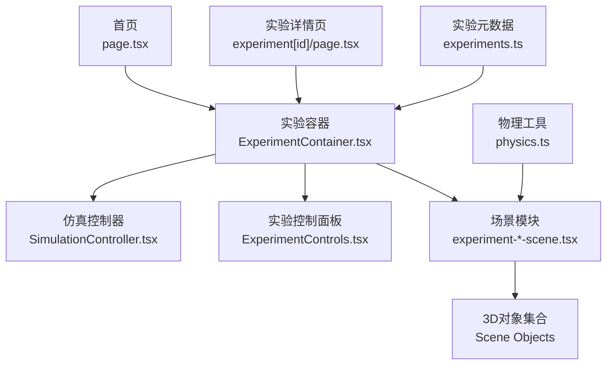
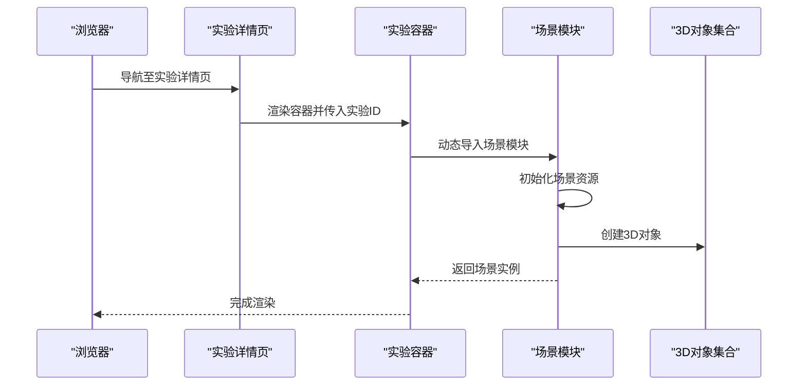
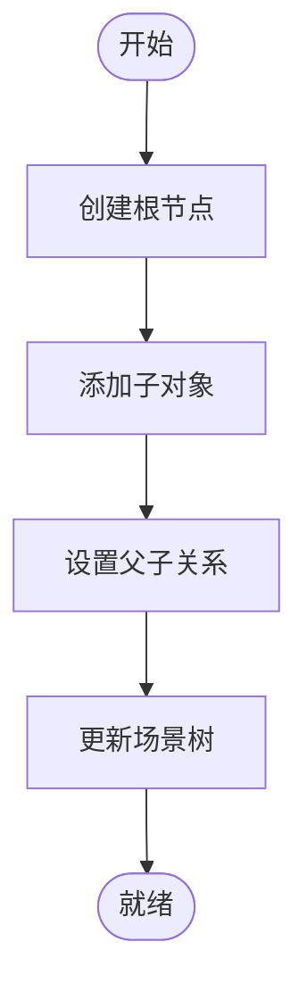
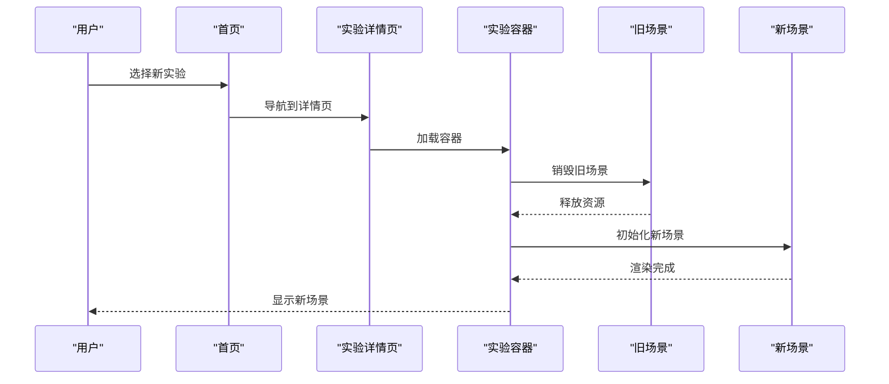
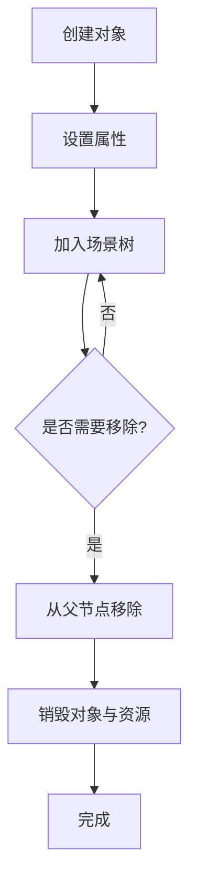
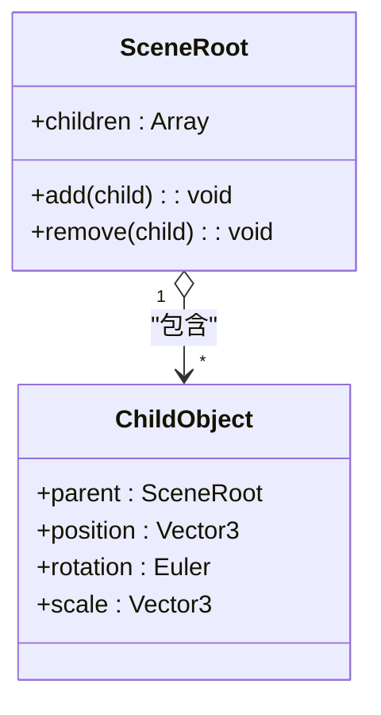
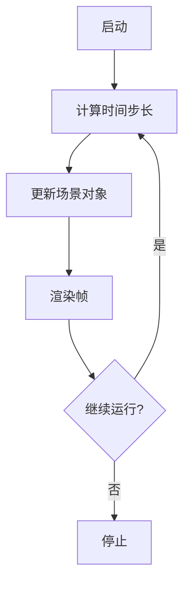
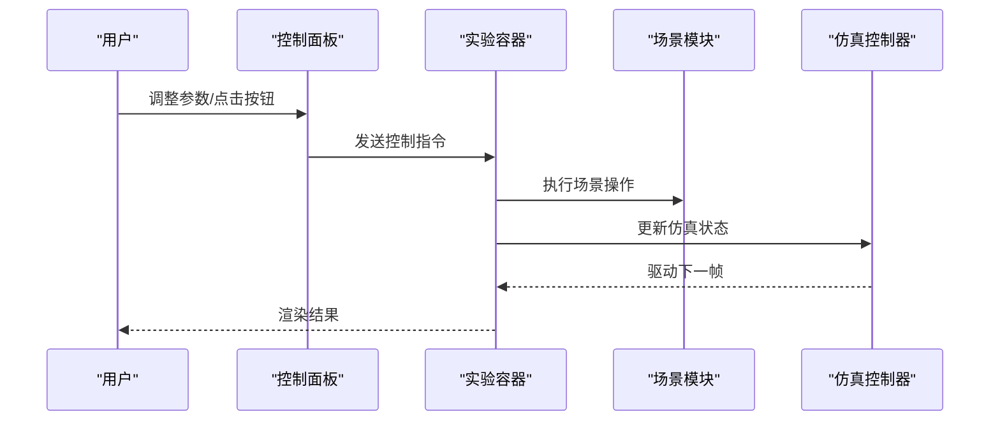
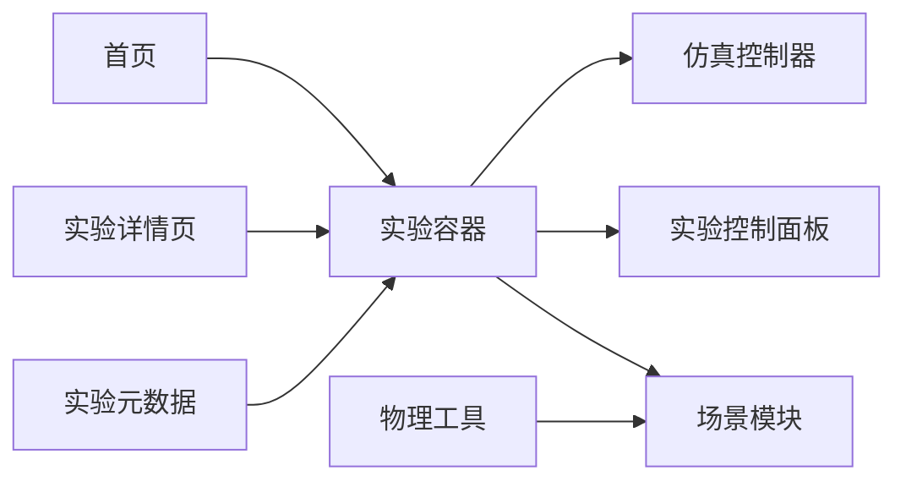

# 场景管理

<cite>
**本文档引用的文件**
- [layout.tsx](file://src/app/layout.tsx)
- [page.tsx](file://src/app/page.tsx)
- [experiment\[id]\page.tsx](file://src/app/experiment[id]/page.tsx)
- [experiments.ts](file://src/data/experiments.ts)
- [ExperimentContainer.tsx](file://src/components/experiment-ui/ExperimentContainer.tsx)
- [ExperimentControls.tsx](file://src/components/experiment-ui/ExperimentControls.tsx)
- [SimulationController.tsx](file://src/components/experiment-ui/SimulationController.tsx)
- [3d-geometry-scene.tsx](file://src/experiments/3d-geometry-scene.tsx)
- [3d-geometry-page.tsx](file://src/experiments/3d-geometry-page.tsx)
- [acid-base-reactions-scene.tsx](file://src/experiments/acid-base-reactions-scene.tsx)
- [atomic-structure-scene.tsx](file://src/experiments/atomic-structure-scene.tsx)
- [calculus-visualizer-scene.tsx](file://src/experiments/calculus-visualizer-scene.tsx)
- [cell-structure-scene.tsx](file://src/experiments/cell-structure-scene.tsx)
- [cellular-respiration-scene.tsx](file://src/experiments/cellular-respiration-scene.tsx)
- [chemical-bonding-scene.tsx](file://src/experiments/chemical-bonding-scene.tsx)
- [complex-numbers-scene.tsx](file://src/experiments/complex-numbers-scene.tsx)
- [crystal-lattice-scene.tsx](file://src/experiments/crystal-lattice-scene.tsx)
- [diffusion-scene.tsx](file://src/experiments/diffusion-scene.tsx)
- [dna-replication-scene.tsx](file://src/experiments/dna-replication-scene.tsx)
- [doppler-scene.tsx](file://src/experiments/doppler-scene.tsx)
- [double-slit-scene.tsx](file://src/experiments/double-slit-scene.tsx)
- [ecosystem-scene.tsx](file://src/experiments/ecosystem-scene.tsx)
- [electrolysis-scene.tsx](file://src/experiments/electrolysis-scene.tsx)
- [electromagnetic-scene.tsx](file://src/experiments/electromagnetic-scene.tsx)
- [fibonacci-spiral-scene.tsx](file://src/experiments/fibonacci-spiral-scene.tsx)
- [fourier-transform-scene.tsx](file://src/experiments/fourier-transform-scene.tsx)
- [gas-laws-scene.tsx](file://src/experiments/gas-laws-scene.tsx)
- [gravitational-orbits-scene.tsx](file://src/experiments/gravitational-orbits-scene.tsx)
- [immune-response-scene.tsx](file://src/experiments/immune-response-scene.tsx)
- [linear-algebra-scene.tsx](file://src/experiments/linear-algebra-scene.tsx)
- [mandelbrot-scene.tsx](file://src/experiments/mandelbrot-scene.tsx)
- [mitosis-meiosis-scene.tsx](file://src/experiments/mitosis-meiosis-scene.tsx)
- [natural-selection-scene.tsx](file://src/experiments/natural-selection-scene.tsx)
- [nervous-system-scene.tsx](file://src/experiments/nervous-system-scene.tsx)
- [ohms-law-scene.tsx](file://src/experiments/ohms-law-scene.tsx)
- [pendulum-scene.tsx](file://src/experiments/pendulum-scene.tsx)
- [periodic-trends-scene.tsx](file://src/experiments/periodic-trends-scene.tsx)
- [photosynthesis-scene.tsx](file://src/experiments/photosynthesis-scene.tsx)
- [probability-distributions-scene.tsx](file://src/experiments/probability-distributions-scene.tsx)
- [projectile-motion-scene.tsx](file://src/experiments/projectile-motion-scene.tsx)
- [protein-synthesis-scene.tsx](file://src/experiments/protein-synthesis-scene.tsx)
- [refraction-scene.tsx](file://src/experiments/refraction-scene.tsx)
- [spring-mass-scene.tsx](file://src/experiments/spring-mass-scene.tsx)
- [thermochemistry-scene.tsx](file://src/experiments/thermochemistry-scene.tsx)
- [titration-scene.tsx](file://src/experiments/titration-scene.tsx)
- [topology-surfaces-scene.tsx](file://src/experiments/topology-surfaces-scene.tsx)
- [trigonometry-scene.tsx](file://src/experiments/trigonometry-scene.tsx)
- [wave-interference-scene.tsx](file://src/experiments/wave-interference-scene.tsx)
- [physics.ts](file://src/utils/physics.ts)
</cite>

## 目录
1. [引言](#引言)
2. [项目结构](#项目结构)
3. [核心组件](#核心组件)
4. [架构总览](#架构总览)
5. [详细组件分析](#详细组件分析)
6. [依赖分析](#依赖分析)
7. [性能考虑](#性能考虑)
8. [故障排除指南](#故障排除指南)
9. [结论](#结论)

## 引言
本文件系统性梳理 ScienceLab3D 的场景管理系统，重点覆盖以下方面：
- 实验场景的组织结构与管理方式：场景初始化、对象加载与生命周期管理
- 场景切换机制与状态保持策略
- 3D 对象的创建、添加与移除流程
- 场景层次结构与父子关系管理
- 场景优化策略：对象池、延迟加载与内存管理
- 场景调试与性能监控方法

该系统采用基于 Next.js App Router 的页面驱动架构，每个实验对应一个独立页面与对应的场景模块，通过统一的容器组件进行渲染与控制。

## 项目结构
项目采用按功能域划分的目录结构，核心与场景相关的模块分布如下：
- 页面层：位于 src/app 下，负责路由与页面渲染
- 实验页面与场景：位于 src/experiments 下，每个实验包含 page.tsx（页面）与 scene.tsx（场景逻辑）
- UI 控制组件：位于 src/components/experiment-ui 下，提供统一的实验容器与控制器
- 数据配置：位于 src/data 下，集中管理实验元数据
- 工具与物理：位于 src/utils 下，提供通用工具与物理常量

```mermaid
graph TB
subgraph "应用层"
L["布局<br/>layout.tsx"]
HP["首页<br/>page.tsx"]
EP["实验详情页<br/>experiment[id]/page.tsx"]
end
subgraph "实验页面与场景"
E3DG["3D几何页面/场景<br/>3d-geometry-page.tsx / 3d-geometry-scene.tsx"]
EABR["酸碱反应页面/场景<br/>acid-base-reactions-page.tsx / acid-base-reactions-scene.tsx"]
EAS["原子结构页面/场景<br/>atomic-structure-page.tsx / atomic-structure-scene.tsx"]
ECV["微积分可视化页面/场景<br/>calculus-visualizer-page.tsx / calculus-visualizer-scene.tsx"]
ECS["细胞结构页面/场景<br/>cell-structure-page.tsx / cell-structure-scene.tsx"]
ECR["细胞呼吸页面/场景<br/>cellular-respiration-page.tsx / cellular-respiration-scene.tsx"]
ECB["化学键合页面/场景<br/>chemical-bonding-page.tsx / chemical-bonding-scene.tsx"]
ECN["复数页面/场景<br/>complex-numbers-page.tsx / complex-numbers-scene.tsx"]
ECL["晶体结构页面/场景<br/>crystal-lattice-page.tsx / crystal-lattice-scene.tsx"]
ED["扩散页面/场景<br/>diffusion-page.tsx / diffusion-scene.tsx"]
EDNA["DNA复制页面/场景<br/>dna-replication-page.tsx / dna-replication-scene.tsx"]
ED["多普勒页面/场景<br/>doppler-page.tsx / doppler-scene.tsx"]
EDS["双缝干涉页面/场景<br/>double-slit-page.tsx / double-slit-scene.tsx"]
EE["生态系统页面/场景<br/>ecosystem-page.tsx / ecosystem-scene.tsx"]
EEL["电解页面/场景<br/>electrolysis-page.tsx / electrolysis-scene.tsx"]
EEM["电磁页面/场景<br/>electromagnetic-page.tsx / electromagnetic-scene.tsx"]
EFS["斐波那契页面/场景<br/>fibonacci-spiral-page.tsx / fibonacci-spiral-scene.tsx"]
EFT["傅里叶变换页面/场景<br/>fourier-transform-page.tsx / fourier-transform-scene.tsx"]
EGL["气体定律页面/场景<br/>gas-laws-page.tsx / gas-laws-scene.tsx"]
EGO["引力轨道页面/场景<br/>gravitational-orbits-page.tsx / gravitational-orbits-scene.tsx"]
EIR["免疫反应页面/场景<br/>immune-response-page.tsx / immune-response-scene.tsx"]
ELA["线性代数页面/场景<br/>linear-algebra-page.tsx / linear-algebra-scene.tsx"]
EM["曼德布洛特页面/场景<br/>mandelbrot-page.tsx / mandelbrot-scene.tsx"]
EMM["有丝分裂页面/场景<br/>mitosis-meiosis-page.tsx / mitosis-meiosis-scene.tsx"]
ENS["自然选择页面/场景<br/>natural-selection-page.tsx / natural-selection-scene.tsx"]
ENSY["神经系统页面/场景<br/>nervous-system-page.tsx / nervous-system-scene.tsx"]
EO["欧姆定律页面/场景<br/>ohms-law-page.tsx / ohms-law-scene.tsx"]
EPD["单摆页面/场景<br/>pendulum-page.tsx / pendulum-scene.tsx"]
EPT["周期性趋势页面/场景<br/>periodic-trends-page.tsx / periodic-trends-scene.tsx"]
EPS["光合作用页面/场景<br/>photosynthesis-page.tsx / photosynthesis-scene.tsx"]
EPD2["概率分布页面/场景<br/>probability-distributions-page.tsx / probability-distributions-scene.tsx"]
EPM["抛物运动页面/场景<br/>projectile-motion-page.tsx / projectile-motion-scene.tsx"]
EPS2["蛋白质合成页面/场景<br/>protein-synthesis-page.tsx / protein-synthesis-scene.tsx"]
ER["折射页面/场景<br/>refraction-page.tsx / refraction-scene.tsx"]
ESM["弹簧振子页面/场景<br/>spring-mass-page.tsx / spring-mass-scene.tsx"]
ETC["热化学页面/场景<br/>thermochemistry-page.tsx / thermochemistry-scene.tsx"]
ET["滴定页面/场景<br/>titration-page.tsx / titration-scene.tsx"]
ETS["拓扑曲面页面/场景<br/>topology-surfaces-page.tsx / topology-surfaces-scene.tsx"]
ET["三角函数页面/场景<br/>trigonometry-page.tsx / trigonometry-scene.tsx"]
EI["波的干涉页面/场景<br/>wave-interference-page.tsx / wave-interference-scene.tsx"]
end
subgraph "UI组件"
EC["实验容器<br/>ExperimentContainer.tsx"]
ECTL["实验控制面板<br/>ExperimentControls.tsx"]
ESC["仿真控制器<br/>SimulationController.tsx"]
end
subgraph "数据与工具"
D["实验元数据<br/>experiments.ts"]
U["物理工具<br/>physics.ts"]
end
L --> HP
L --> EP
HP --> EC
EP --> EC
EC --> ESC
EC --> ECTL
EC --> E3DG
EC --> EABR
EC --> EAS
EC --> ECV
EC --> ECS
EC --> ECR
EC --> ECB
EC --> ECN
EC --> ECL
EC --> ED
EC --> EDNA
EC --> ED
EC --> EDS
EC --> EE
EC --> EEL
EC --> EEM
EC --> EFS
EC --> EFT
EC --> EGL
EC --> EGO
EC --> EIR
EC --> ELA
EC --> EM
EC --> EMM
EC --> ENS
EC --> ENSY
EC --> EO
EC --> EPD
EC --> EPT
EC --> EPS
EC --> EPD2
EC --> EPM
EC --> EPS2
EC --> ER
EC --> ESM
EC --> ETC
EC --> ET
EC --> EI
D --> EC
U --> EC
```

**图表来源**
- [layout.tsx](file://src/app/layout.tsx)
- [page.tsx](file://src/app/page.tsx)
- [experiment[id]/page.tsx](file://src/app/experiment[id]/page.tsx)
- [ExperimentContainer.tsx](file://src/components/experiment-ui/ExperimentContainer.tsx)
- [SimulationController.tsx](file://src/components/experiment-ui/SimulationController.tsx)
- [experiments.ts](file://src/data/experiments.ts)
- [3d-geometry-scene.tsx](file://src/experiments/3d-geometry-scene.tsx)
- [3d-geometry-page.tsx](file://src/experiments/3d-geometry-page.tsx)

**章节来源**
- [layout.tsx](file://src/app/layout.tsx)
- [page.tsx](file://src/app/page.tsx)
- [experiment[id]/page.tsx](file://src/app/experiment[id]/page.tsx)

## 核心组件
- 布局与导航：顶层布局负责全局样式与导航；首页展示实验列表；实验详情页承载具体实验场景
- 实验容器：封装统一的实验渲染区域，负责场景挂载、控制面板与仿真控制器的组合
- 仿真控制器：抽象出时间步进、暂停/恢复、重置等通用控制能力
- 实验控制面板：提供参数调节、状态切换等交互入口
- 场景模块：每个实验的 scene.tsx 定义该实验的 3D 对象集合、初始化逻辑、更新循环与销毁流程
- 元数据与工具：experiments.ts 提供实验清单与配置；physics.ts 提供物理常量与工具函数

**章节来源**
- [ExperimentContainer.tsx](file://src/components/experiment-ui/ExperimentContainer.tsx)
- [SimulationController.tsx](file://src/components/experiment-ui/SimulationController.tsx)
- [experiments.ts](file://src/data/experiments.ts)
- [physics.ts](file://src/utils/physics.ts)

## 架构总览
下图展示了从页面到场景模块的整体调用链路与职责分工：

**图表来源**
- [page.tsx](file://src/app/page.tsx)
- [experiment[id]/page.tsx](file://src/app/experiment[id]/page.tsx)
- [ExperimentContainer.tsx](file://src/components/experiment-ui/ExperimentContainer.tsx)
- [SimulationController.tsx](file://src/components/experiment-ui/SimulationController.tsx)
- [experiments.ts](file://src/data/experiments.ts)
- [physics.ts](file://src/utils/physics.ts)

## 详细组件分析

### 场景初始化与生命周期管理
- 初始化阶段：页面加载时，实验详情页根据路由参数确定目标实验，随后由实验容器加载对应场景模块并执行初始化逻辑
- 生命周期钩子：场景模块应提供初始化、每帧更新、销毁等生命周期回调，确保资源正确分配与释放
- 资源管理：纹理、几何体、材质等资源在初始化时创建，在销毁时释放，避免内存泄漏

**图表来源**
- [experiment[id]/page.tsx](file://src/app/experiment[id]/page.tsx)
- [ExperimentContainer.tsx](file://src/components/experiment-ui/ExperimentContainer.tsx)
- [3d-geometry-scene.tsx](file://src/experiments/3d-geometry-scene.tsx)

**章节来源**
- [experiment[id]/page.tsx](file://src/app/experiment[id]/page.tsx)
- [ExperimentContainer.tsx](file://src/components/experiment-ui/ExperimentContainer.tsx)
- [3d-geometry-scene.tsx](file://src/experiments/3d-geometry-scene.tsx)

### 对象加载与层次结构管理
- 对象创建：场景初始化时批量创建所需 3D 对象，设置初始位置、旋转、缩放与材质属性
- 层次结构：通过父子关系建立场景树，父对象变换影响所有子对象，便于整体动画与局部细节分离
- 父子关系维护：新增子对象时设置 parent，删除时解除引用并确保层级一致性

**图表来源**
- [3d-geometry-scene.tsx](file://src/experiments/3d-geometry-scene.tsx)

**章节来源**
- [3d-geometry-scene.tsx](file://src/experiments/3d-geometry-scene.tsx)

### 场景切换机制与状态保持
- 切换触发：用户在首页或实验容器中选择新实验，路由变化导致页面卸载旧场景并加载新场景
- 状态保持策略：对于需要跨场景保留的状态（如用户偏好、当前进度），可存储于本地持久化或全局状态管理；对临时状态（如当前动画进度）可在卸载前清理
- 卸载与回收：切换前调用场景销毁流程，释放资源并停止动画；切换后重新初始化新场景

**图表来源**
- [page.tsx](file://src/app/page.tsx)
- [experiment[id]/page.tsx](file://src/app/experiment[id]/page.tsx)
- [ExperimentContainer.tsx](file://src/components/experiment-ui/ExperimentContainer.tsx)
- [3d-geometry-scene.tsx](file://src/experiments/3d-geometry-scene.tsx)

**章节来源**
- [page.tsx](file://src/app/page.tsx)
- [experiment[id]/page.tsx](file://src/app/experiment[id]/page.tsx)
- [ExperimentContainer.tsx](file://src/components/experiment-ui/ExperimentContainer.tsx)

### 3D 对象的创建、添加与移除流程
- 创建：在场景初始化中根据实验需求创建几何体、材质与网格对象，必要时加载外部资源
- 添加：将对象加入场景根节点或指定父对象，确保层级正确
- 移除：移除前先从父节点解绑，再销毁对象与关联资源，防止悬挂引用

**图表来源**
- [3d-geometry-scene.tsx](file://src/experiments/3d-geometry-scene.tsx)

**章节来源**
- [3d-geometry-scene.tsx](file://src/experiments/3d-geometry-scene.tsx)

### 场景层次结构与父子关系管理
- 场景树：以根节点为起点，子节点继承父节点的变换矩阵，形成层次化的空间关系
- 父子绑定：新增子对象时设置 parent，删除时解除引用并检查层级完整性
- 变换传播：父对象的平移、旋转、缩放会自动传递给子对象，简化复杂动画的编写

**图表来源**
- [3d-geometry-scene.tsx](file://src/experiments/3d-geometry-scene.tsx)

**章节来源**
- [3d-geometry-scene.tsx](file://src/experiments/3d-geometry-scene.tsx)

### 仿真控制器与时间步进
- 时间步进：仿真控制器统一管理时间步长与累计时间，驱动场景中的对象更新
- 暂停/恢复：支持暂停与恢复，暂停期间跳过更新逻辑但保持渲染
- 重置：重置场景到初始状态，释放中间状态并重建对象

**图表来源**
- [SimulationController.tsx](file://src/components/experiment-ui/SimulationController.tsx)

**章节来源**
- [SimulationController.tsx](file://src/components/experiment-ui/SimulationController.tsx)

### 实验容器与控制面板集成
- 实验容器：聚合场景模块、控制面板与仿真控制器，提供统一的渲染与交互接口
- 控制面板：暴露参数调节与状态切换按钮，向场景模块下发指令
- 组件协作：容器作为协调者，确保控制命令正确传递到场景模块并驱动渲染更新

**图表来源**
- [ExperimentContainer.tsx](file://src/components/experiment-ui/ExperimentContainer.tsx)
- [ExperimentControls.tsx](file://src/components/experiment-ui/ExperimentControls.tsx)
- [SimulationController.tsx](file://src/components/experiment-ui/SimulationController.tsx)

**章节来源**
- [ExperimentContainer.tsx](file://src/components/experiment-ui/ExperimentContainer.tsx)
- [ExperimentControls.tsx](file://src/components/experiment-ui/ExperimentControls.tsx)
- [SimulationController.tsx](file://src/components/experiment-ui/SimulationController.tsx)

## 依赖分析
- 页面到容器：页面层通过实验容器承载场景模块，形成清晰的分层
- 容器到场景：容器动态导入各实验的 scene.tsx，实现按需加载
- 控制器到场景：仿真控制器与实验控制面板共同驱动场景更新
- 数据与工具：实验元数据与物理工具为场景提供配置与基础常量

**图表来源**
- [page.tsx](file://src/app/page.tsx)
- [experiment[id]/page.tsx](file://src/app/experiment[id]/page.tsx)
- [ExperimentContainer.tsx](file://src/components/experiment-ui/ExperimentContainer.tsx)
- [SimulationController.tsx](file://src/components/experiment-ui/SimulationController.tsx)
- [experiments.ts](file://src/data/experiments.ts)
- [physics.ts](file://src/utils/physics.ts)

**章节来源**
- [page.tsx](file://src/app/page.tsx)
- [experiment[id]/page.tsx](file://src/app/experiment[id]/page.tsx)
- [ExperimentContainer.tsx](file://src/components/experiment-ui/ExperimentContainer.tsx)
- [experiments.ts](file://src/data/experiments.ts)
- [physics.ts](file://src/utils/physics.ts)

## 性能考虑
- 对象池：对频繁创建/销毁的对象（如粒子、特效）使用对象池减少 GC 压力
- 延迟加载：仅在进入实验页面时加载场景模块与资源，离开时释放
- 内存管理：在场景销毁时显式释放纹理、几何体与材质；避免循环引用
- 渲染优化：合并静态几何、剔除不可见对象、使用 LOD 与实例化渲染
- 控制器节流：合理设置时间步长与帧率上限，避免过度更新

[本节为通用指导，无需列出章节来源]

## 故障排除指南
- 场景未显示：检查实验容器是否正确导入场景模块，确认初始化流程无异常
- 对象不更新：验证仿真控制器的时间步进是否正常，场景更新逻辑是否被暂停
- 内存泄漏：排查场景销毁流程是否释放了所有资源引用，是否存在全局持有者
- 路由切换异常：确认页面卸载顺序与场景销毁时机，避免竞态条件

**章节来源**
- [ExperimentContainer.tsx](file://src/components/experiment-ui/ExperimentContainer.tsx)
- [SimulationController.tsx](file://src/components/experiment-ui/SimulationController.tsx)
- [3d-geometry-scene.tsx](file://src/experiments/3d-geometry-scene.tsx)

## 结论
本场景管理系统以页面驱动与模块化场景为核心，结合统一的实验容器与仿真控制器，实现了清晰的职责分离与良好的扩展性。通过合理的初始化、生命周期管理与资源回收策略，系统能够在保证交互流畅的同时维持稳定的性能表现。建议在实际开发中进一步完善对象池、延迟加载与内存监控机制，持续优化用户体验。