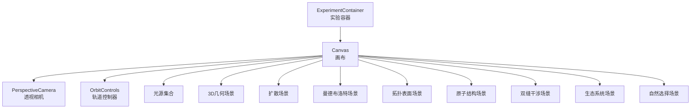
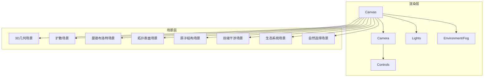
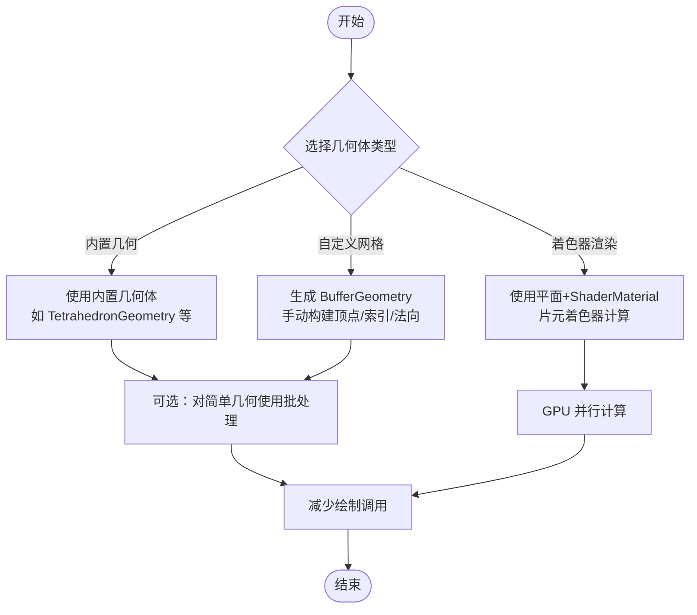
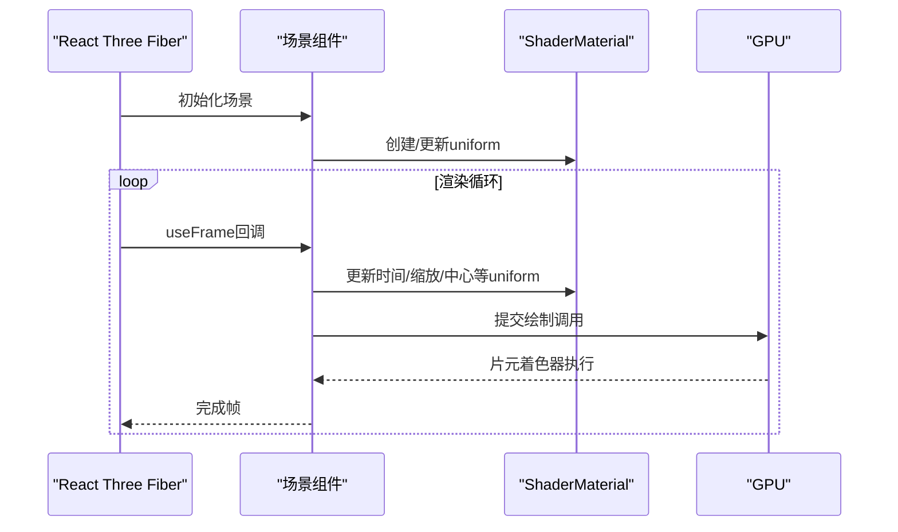
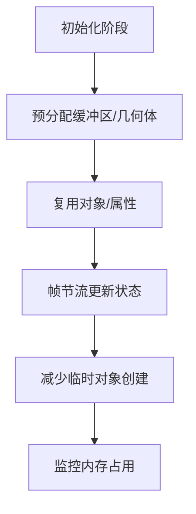
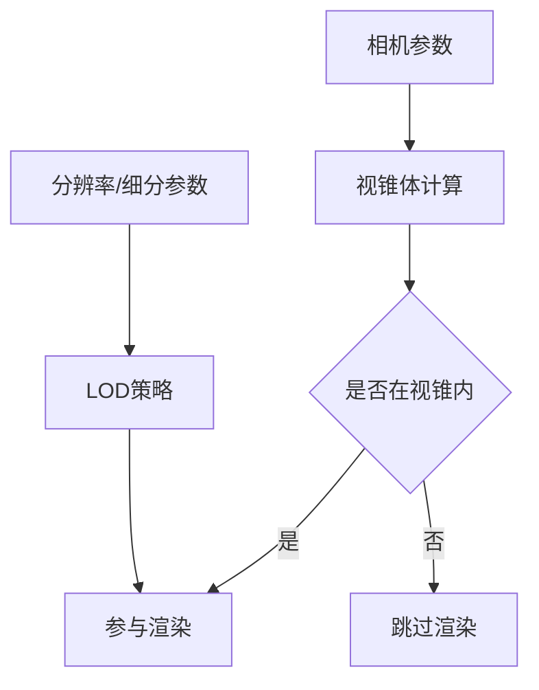
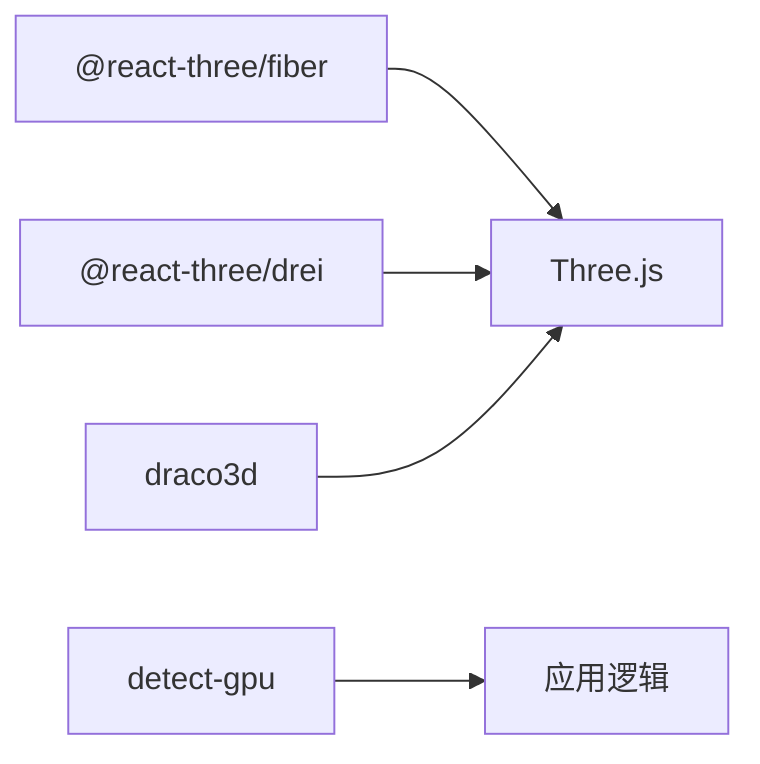

# 性能优化

<cite>
**本文档引用的文件**
- [3d-geometry-scene.tsx](file://src/experiments/3d-geometry-scene.tsx)
- [diffusion-scene.tsx](file://src/experiments/diffusion-scene.tsx)
- [mandelbrot-scene.tsx](file://src/experiments/mandelbrot-scene.tsx)
- [ExperimentContainer.tsx](file://src/components/experiment-ui/ExperimentContainer.tsx)
- [topology-surfaces-scene.tsx](file://src/experiments/topology-surfaces-scene.tsx)
- [atomic-structure-scene.tsx](file://src/experiments/atomic-structure-scene.tsx)
- [double-slit-scene.tsx](file://src/experiments/double-slit-scene.tsx)
- [ecosystem-scene.tsx](file://src/experiments/ecosystem-scene.tsx)
- [natural-selection-scene.tsx](file://src/experiments/natural-selection-scene.tsx)
- [package-lock.json](file://package-lock.json)
</cite>

## 目录
1. [简介](#简介)
2. [项目结构](#项目结构)
3. [核心组件](#核心组件)
4. [架构总览](#架构总览)
5. [详细组件分析](#详细组件分析)
6. [依赖关系分析](#依赖关系分析)
7. [性能考量](#性能考量)
8. [故障排查指南](#故障排查指南)
9. [结论](#结论)
10. [附录](#附录)

## 简介
本文件面向3D渲染性能优化，结合代码库中的实际实现，系统梳理几何体简化、纹理压缩与批处理渲染策略；总结内存管理最佳实践（对象池、垃圾回收与内存泄漏预防）；阐述GPU利用优化（着色器优化、渲染状态管理与绘制调用减少）；说明LOD与视锥剔除的实现思路；并提供性能监控与基准测试方法，以及移动设备优化与浏览器兼容性建议。

## 项目结构
该项目采用基于实验页面的模块化组织方式，每个实验场景独立封装为组件，统一由实验容器进行画布初始化、相机控制与光照配置。渲染引擎基于 Three.js 与 @react-three/fiber，通过 Canvas 统一注入 WebGL 上下文与渲染循环。

**图表来源**
- [ExperimentContainer.tsx:137-208](file://src/components/experiment-ui/ExperimentContainer.tsx#L137-L208)
- [3d-geometry-scene.tsx:155-240](file://src/experiments/3d-geometry-scene.tsx#L155-L240)
- [diffusion-scene.tsx:278-506](file://src/experiments/diffusion-scene.tsx#L278-L506)
- [mandelbrot-scene.tsx:312-339](file://src/experiments/mandelbrot-scene.tsx#L312-L339)
- [topology-surfaces-scene.tsx:79-187](file://src/experiments/topology-surfaces-scene.tsx#L79-L187)
- [atomic-structure-scene.tsx:174-192](file://src/experiments/atomic-structure-scene.tsx#L174-L192)
- [double-slit-scene.tsx:232-277](file://src/experiments/double-slit-scene.tsx#L232-L277)
- [ecosystem-scene.tsx:213-329](file://src/experiments/ecosystem-scene.tsx#L213-L329)
- [natural-selection-scene.tsx:82-123](file://src/experiments/natural-selection-scene.tsx#L82-L123)

**章节来源**
- [ExperimentContainer.tsx:137-208](file://src/components/experiment-ui/ExperimentContainer.tsx#L137-L208)

## 核心组件
- 实验容器：负责画布初始化、相机与控制器、光照、环境与雾效设置，以及移动端自适应参数。
- 场景组件：各实验场景分别实现几何体生成、动画更新、UI数据上报与可视化元素组合。

**章节来源**
- [ExperimentContainer.tsx:137-208](file://src/components/experiment-ui/ExperimentContainer.tsx#L137-L208)
- [3d-geometry-scene.tsx:30-240](file://src/experiments/3d-geometry-scene.tsx#L30-L240)
- [diffusion-scene.tsx:39-509](file://src/experiments/diffusion-scene.tsx#L39-L509)
- [mandelbrot-scene.tsx:147-342](file://src/experiments/mandelbrot-scene.tsx#L147-L342)
- [topology-surfaces-scene.tsx:61-245](file://src/experiments/topology-surfaces-scene.tsx#L61-L245)
- [atomic-structure-scene.tsx:174-192](file://src/experiments/atomic-structure-scene.tsx#L174-L192)
- [double-slit-scene.tsx:232-277](file://src/experiments/double-slit-scene.tsx#L232-L277)
- [ecosystem-scene.tsx:213-329](file://src/experiments/ecosystem-scene.tsx#L213-L329)
- [natural-selection-scene.tsx:82-123](file://src/experiments/natural-selection-scene.tsx#L82-L123)

## 架构总览
整体渲染管线以 Canvas 为中心，统一管理 WebGL 上下文、相机与控制器、光源与环境，各场景在渲染循环中按需更新几何属性与材质参数，同时通过帧节流降低UI状态更新频率，避免不必要的重渲染。

**图表来源**
- [ExperimentContainer.tsx:137-208](file://src/components/experiment-ui/ExperimentContainer.tsx#L137-L208)
- [3d-geometry-scene.tsx:155-240](file://src/experiments/3d-geometry-scene.tsx#L155-L240)
- [diffusion-scene.tsx:278-506](file://src/experiments/diffusion-scene.tsx#L278-L506)
- [mandelbrot-scene.tsx:312-339](file://src/experiments/mandelbrot-scene.tsx#L312-L339)
- [topology-surfaces-scene.tsx:79-187](file://src/experiments/topology-surfaces-scene.tsx#L79-L187)
- [atomic-structure-scene.tsx:174-192](file://src/experiments/atomic-structure-scene.tsx#L174-L192)
- [double-slit-scene.tsx:232-277](file://src/experiments/double-slit-scene.tsx#L232-L277)
- [ecosystem-scene.tsx:213-329](file://src/experiments/ecosystem-scene.tsx#L213-L329)
- [natural-selection-scene.tsx:82-123](file://src/experiments/natural-selection-scene.tsx#L82-L123)

## 详细组件分析

### 几何体简化与批处理渲染
- 3D几何场景：使用 Three.js 内置几何体（正多面体等），通过顶点与索引属性生成边线与顶点高亮，避免动态几何重建。
- 扩散场景：采用 InstancedMesh 批处理渲染大量粒子，仅更新实例矩阵与颜色属性，显著减少绘制调用。
- 拓扑表面场景：根据表面类型生成 BufferGeometry，手动构建顶点与索引数组，计算法向量后用于平滑着色。
- 曼德布洛特场景：使用平面几何配合 ShaderMaterial 在片元着色器内完成迭代与上色，GPU并行处理像素级计算。
- 双缝干涉场景：使用集中式位置数组与单个 InstancedMesh 更新粒子位置，避免频繁创建销毁对象。

**图表来源**
- [3d-geometry-scene.tsx:61-70](file://src/experiments/3d-geometry-scene.tsx#L61-L70)
- [diffusion-scene.tsx:359-369](file://src/experiments/diffusion-scene.tsx#L359-L369)
- [topology-surfaces-scene.tsx:112-149](file://src/experiments/topology-surfaces-scene.tsx#L112-L149)
- [mandelbrot-scene.tsx:314-322](file://src/experiments/mandelbrot-scene.tsx#L314-L322)
- [double-slit-scene.tsx:250-264](file://src/experiments/double-slit-scene.tsx#L250-L264)

**章节来源**
- [3d-geometry-scene.tsx:61-70](file://src/experiments/3d-geometry-scene.tsx#L61-L70)
- [diffusion-scene.tsx:359-369](file://src/experiments/diffusion-scene.tsx#L359-L369)
- [topology-surfaces-scene.tsx:112-149](file://src/experiments/topology-surfaces-scene.tsx#L112-L149)
- [mandelbrot-scene.tsx:314-322](file://src/experiments/mandelbrot-scene.tsx#L314-L322)
- [double-slit-scene.tsx:250-264](file://src/experiments/double-slit-scene.tsx#L250-L264)

### 着色器优化与渲染状态管理
- 曼德布洛特场景：在片元着色器中实现平滑着色与多种配色方案，统一通过 uniform 传递参数，避免多次材质切换。
- 原子结构场景：使用 ref 存储物理状态，仅在需要时更新几何或材质属性，减少状态变更带来的状态切换。
- 实验容器：启用抗锯齿与高帧率模式，合理设置色调映射与输出色彩空间，平衡质量与性能。

**图表来源**
- [mandelbrot-scene.tsx:187-202](file://src/experiments/mandelbrot-scene.tsx#L187-L202)
- [mandelbrot-scene.tsx:248-302](file://src/experiments/mandelbrot-scene.tsx#L248-L302)
- [ExperimentContainer.tsx:139-154](file://src/components/experiment-ui/ExperimentContainer.tsx#L139-L154)

**章节来源**
- [mandelbrot-scene.tsx:187-202](file://src/experiments/mandelbrot-scene.tsx#L187-L202)
- [mandelbrot-scene.tsx:248-302](file://src/experiments/mandelbrot-scene.tsx#L248-L302)
- [ExperimentContainer.tsx:139-154](file://src/components/experiment-ui/ExperimentContainer.tsx#L139-L154)

### 内存管理最佳实践
- 对象池与复用：扩散场景使用固定大小的 InstancedMesh 与共享的 Float32Array 颜色缓冲，避免频繁分配与GC压力。
- 引用存储状态：多个场景使用 useRef 存储相机、材质、几何与动画状态，减少闭包与对象创建。
- 节流更新：通过帧计数器每N帧更新一次React状态，降低渲染与调度开销。
- 预分配与复用：拓扑表面场景预分配顶点与索引数组，避免运行时扩容。

**图表来源**
- [diffusion-scene.tsx:66-111](file://src/experiments/diffusion-scene.tsx#L66-L111)
- [diffusion-scene.tsx:113-148](file://src/experiments/diffusion-scene.tsx#L113-L148)
- [topology-surfaces-scene.tsx:80-187](file://src/experiments/topology-surfaces-scene.tsx#L80-L187)

**章节来源**
- [diffusion-scene.tsx:66-111](file://src/experiments/diffusion-scene.tsx#L66-L111)
- [diffusion-scene.tsx:113-148](file://src/experiments/diffusion-scene.tsx#L113-L148)
- [topology-surfaces-scene.tsx:80-187](file://src/experiments/topology-surfaces-scene.tsx#L80-L187)

### LOD（细节层次）与视锥剔除
- 视锥剔除：实验容器中使用 PerspectiveCamera 与 OrbitControls，结合远近裁剪面与相机参数，减少不可见几何的渲染。
- LOD思路：对于复杂拓扑表面，可通过降低分辨率参数（如细分段数）实现LOD；对大量粒子场景，可按距离动态调整可见数量。

**图表来源**
- [ExperimentContainer.tsx:156-162](file://src/components/experiment-ui/ExperimentContainer.tsx#L156-L162)
- [topology-surfaces-scene.tsx:80-187](file://src/experiments/topology-surfaces-scene.tsx#L80-L187)

**章节来源**
- [ExperimentContainer.tsx:156-162](file://src/components/experiment-ui/ExperimentContainer.tsx#L156-L162)
- [topology-surfaces-scene.tsx:80-187](file://src/experiments/topology-surfaces-scene.tsx#L80-L187)

### 移动端优化与浏览器兼容性
- 移动端参数：实验容器根据设备宽度设置FOV、抗锯齿与 DPR，降低移动端功耗与发热。
- 浏览器兼容：通过 detect-gpu 等库检测WebGL能力，合理降级特性；确保着色器语法与扩展兼容。

**章节来源**
- [ExperimentContainer.tsx:78-97](file://src/components/experiment-ui/ExperimentContainer.tsx#L78-L97)
- [ExperimentContainer.tsx:139-154](file://src/components/experiment-ui/ExperimentContainer.tsx#L139-L154)
- [package-lock.json:1940-1947](file://package-lock.json#L1940-L1947)

## 依赖关系分析
- 渲染框架：@react-three/fiber 提供渲染循环与组件化抽象；Three.js 提供底层图形API。
- 工具库：@react-three/drei 提供辅助组件（如 Line、Environment等）。
- 设备检测：detect-gpu 用于识别GPU能力，指导性能策略。
- 几何压缩：draco3d 用于模型压缩，减少传输与内存占用。

**图表来源**
- [package-lock.json:1940-1947](file://package-lock.json#L1940-L1947)
- [package-lock.json:1959-1964](file://package-lock.json#L1959-L1964)

**章节来源**
- [package-lock.json:1940-1947](file://package-lock.json#L1940-L1947)
- [package-lock.json:1959-1964](file://package-lock.json#L1959-L1964)

## 性能考量
- 绘制调用减少：优先使用 InstancedMesh 与 ShaderMaterial，避免逐对象绘制。
- 状态变更最小化：通过 uniform 与属性更新替代材质切换，减少渲染状态切换。
- 帧节流与批量更新：UI状态每N帧更新一次，物理与几何更新保持高频但仅在必要时触发。
- 移动端适配：降低DPR、关闭移动端抗锯齿、调整阴影与后处理参数。

**章节来源**
- [diffusion-scene.tsx:201-244](file://src/experiments/diffusion-scene.tsx#L201-L244)
- [mandelbrot-scene.tsx:248-302](file://src/experiments/mandelbrot-scene.tsx#L248-L302)
- [ExperimentContainer.tsx:139-154](file://src/components/experiment-ui/ExperimentContainer.tsx#L139-L154)

## 故障排查指南
- 卡顿与掉帧：检查是否有每帧创建临时对象、频繁材质切换或未节流的状态更新；确认是否使用了 InstancedMesh 或 ShaderMaterial。
- 内存泄漏：核查是否存在未释放的几何/材质/纹理引用；确保在组件卸载时清理事件监听与定时器。
- 移动端发热：适当降低DPR、禁用抗锯齿、减少阴影与高成本后处理；验证 detect-gpu 的能力评估结果。

**章节来源**
- [diffusion-scene.tsx:113-148](file://src/experiments/diffusion-scene.tsx#L113-L148)
- [ExperimentContainer.tsx:78-97](file://src/components/experiment-ui/ExperimentContainer.tsx#L78-L97)

## 结论
通过在几何体层面采用 InstancedMesh 与自定义 BufferGeometry，在渲染层使用 ShaderMaterial 与统一uniform管理，在内存层采用对象复用与帧节流策略，项目在保证视觉效果的同时有效降低了CPU/GPU负载。结合移动端参数与设备检测，进一步提升了跨平台性能稳定性。

## 附录
- 性能监控：可在 useFrame 中记录帧耗时与绘制调用次数，结合浏览器开发者工具的时间线与GPU分析面板定位瓶颈。
- 基准测试：针对不同场景与设备，建立标准化的帧率、内存占用与功耗指标，定期回归测试以发现回归问题。