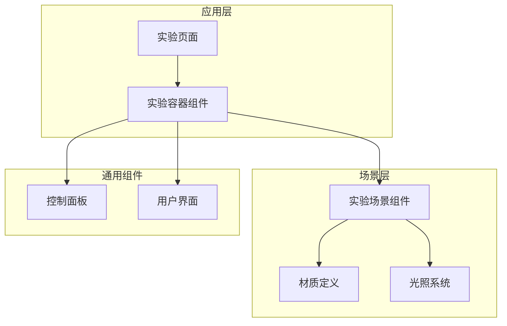
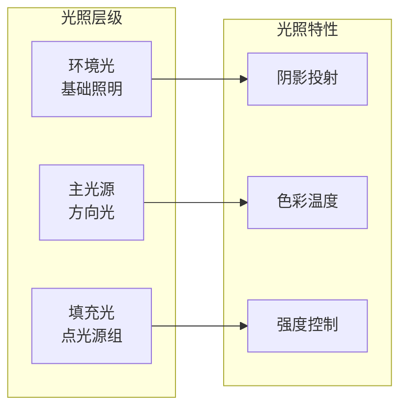
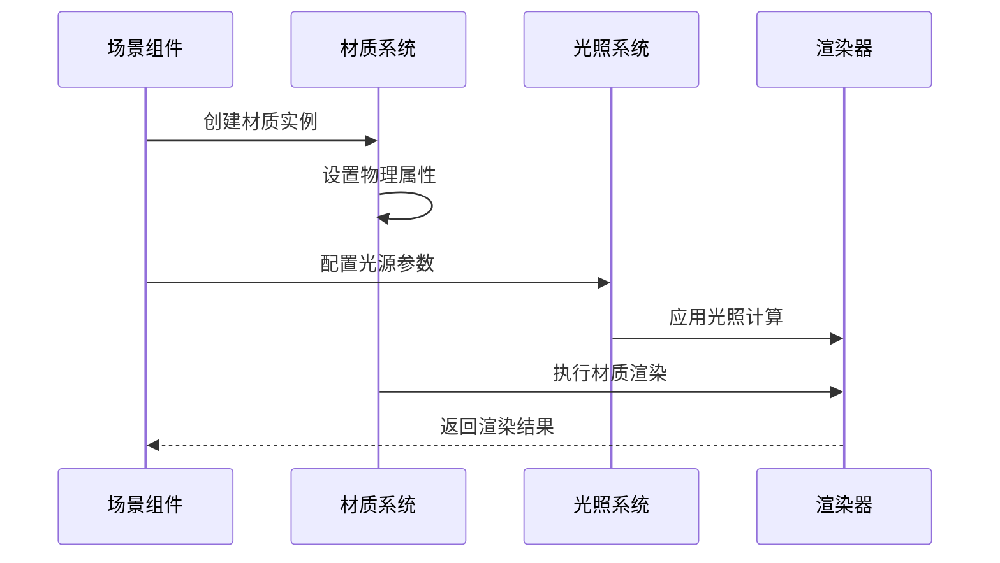
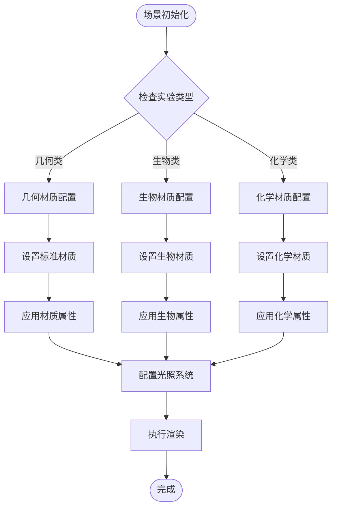
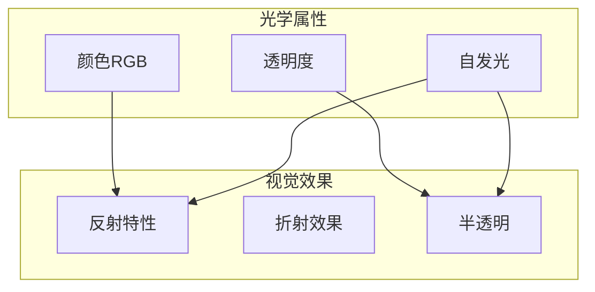
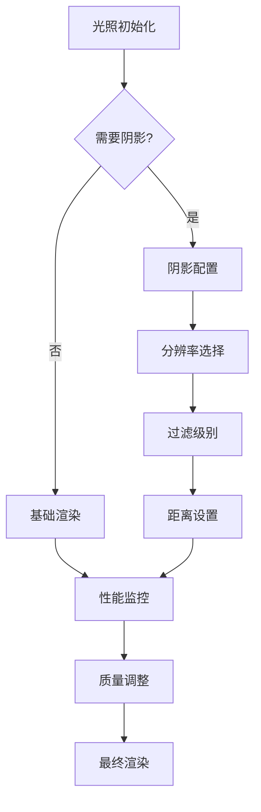
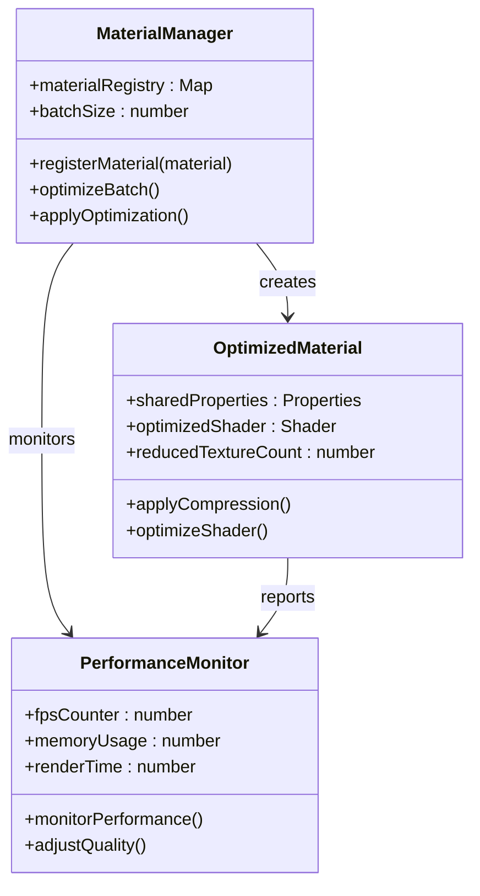
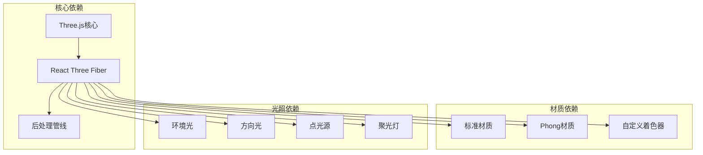
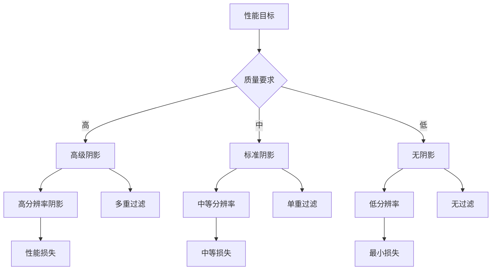
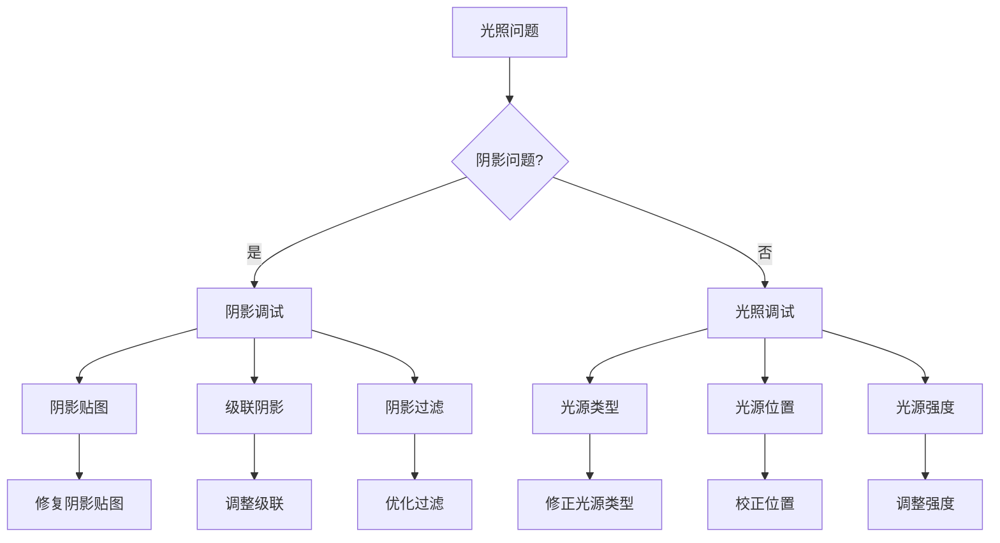

# 材质与光照系统

<cite>
**本文档引用的文件**
- [ExperimentContainer.tsx](file://src/components/experiment-ui/ExperimentContainer.tsx)
- [3d-geometry-scene.tsx](file://src/experiments/3d-geometry-scene.tsx)
- [atomic-structure-scene.tsx](file://src/experiments/atomic-structure-scene.tsx)
- [acid-base-reactions-scene.tsx](file://src/experiments/acid-base-reactions-scene.tsx)
- [cellular-respiration-scene.tsx](file://src/experiments/cellular-respiration-scene.tsx)
- [calculus-visualizer-scene.tsx](file://src/experiments/calculus-visualizer-scene.tsx)
- [cell-structure-scene.tsx](file://src/experiments/cell-structure-scene.tsx)
</cite>

## 目录
1. [引言](#引言)
2. [项目结构](#项目结构)
3. [核心组件](#核心组件)
4. [架构概览](#架构概览)
5. [详细组件分析](#详细组件分析)
6. [依赖关系分析](#依赖关系分析)
7. [性能考虑](#性能考虑)
8. [故障排除指南](#故障排除指南)
9. [结论](#结论)

## 引言

本文件专注于科学实验室3D项目中的材质与光照系统实现。通过对项目中20个实验场景的分析，我们总结了统一的材质选择策略、光照配置模式以及性能优化实践。该系统以Three.js为基础，采用React Three Fiber进行声明式3D场景构建，实现了从基础几何到复杂生物分子建模的多样化材质表现。

## 项目结构

项目采用按功能模块划分的组织方式，每个实验场景独立维护其材质和光照配置：

**图表来源**
- [ExperimentContainer.tsx:180-200](file://src/components/experiment-ui/ExperimentContainer.tsx#L180-L200)

**章节来源**
- [ExperimentContainer.tsx:1-250](file://src/components/experiment-ui/ExperimentContainer.tsx#L1-L250)

## 核心组件

### 材质系统架构

项目实现了统一的材质管理策略，主要采用以下三种材质类型：

#### 基础材质类型

| 材质类型 | 使用场景 | 性能特征 | 光照响应 |
|---------|---------|---------|---------|
| MeshStandardMaterial | 大多数实验场景 | 高性能PBR材质 | 物理正确光照模型 |
| MeshPhongMaterial | 传统光照需求 | 中等性能开销 | 经典Phong光照模型 |
| 自定义材质 | 特殊效果需求 | 可定制性能 | 灵活的着色器控制 |

#### 材质属性配置矩阵

| 属性名称 | 数值范围 | 视觉效果 | 性能影响 |
|---------|---------|---------|---------|
| 金属度(Metalness) | 0.0-1.0 | 从非金属到完全金属化 | 低 |
| 粗糙度(Roughness) | 0.0-1.0 | 从镜面反射到漫反射 | 低 |
| 透明度(Opacity) | 0.0-1.0 | 从完全透明到不透明 | 中等 |
| 发光强度(Emissive) | 0.0+ | 自发光效果 | 低 |

**章节来源**
- [atomic-structure-scene.tsx:225-235](file://src/experiments/atomic-structure-scene.tsx#L225-L235)
- [atomic-structure-scene.tsx:350-360](file://src/experiments/atomic-structure-scene.tsx#L350-L360)

### 光照系统设计

#### 统一光照配置模式

项目采用"环境光 + 主光源 + 补充光源"的三层光照架构：

**图表来源**
- [ExperimentContainer.tsx:180-200](file://src/components/experiment-ui/ExperimentContainer.tsx#L180-L200)

#### 光照参数标准化

| 光源类型 | 强度范围 | 推荐值 | 色温范围 | 应用场景 |
|---------|---------|--------|---------|---------|
| 环境光 | 0.1-1.0 | 0.4-0.6 | 白色 | 基础照明 |
| 方向光 | 0.5-2.0 | 0.8-1.2 | 白色-冷色调 | 主要光源 |
| 点光源 | 0.1-1.0 | 0.3-0.8 | 多色系 | 局部强调 |

**章节来源**
- [3d-geometry-scene.tsx:150-165](file://src/experiments/3d-geometry-scene.tsx#L150-L165)
- [acid-base-reactions-scene.tsx:295-310](file://src/experiments/acid-base-reactions-scene.tsx#L295-L310)

## 架构概览

### 材质与光照集成架构

**图表来源**
- [ExperimentContainer.tsx:180-200](file://src/components/experiment-ui/ExperimentContainer.tsx#L180-L200)

### 实验场景材质流程

**图表来源**
- [3d-geometry-scene.tsx:150-165](file://src/experiments/3d-geometry-scene.tsx#L150-L165)
- [atomic-structure-scene.tsx:225-235](file://src/experiments/atomic-structure-scene.tsx#L225-L235)

## 详细组件分析

### 材质属性对视觉效果的影响

#### 金属度与粗糙度的协同作用

| 金属度 | 粗糙度 | 视觉效果 | 典型应用场景 |
|-------|-------|---------|-------------|
| 低 | 低 | 镜面反射，高光泽 | 金属表面，液体表面 |
| 低 | 高 | 柔和漫反射 | 皮肤，纸张 |
| 高 | 低 | 金属质感，强反射 | 金属制品，矿物 |
| 高 | 高 | 模糊反射，哑光 | 生锈金属，粗糙表面 |

#### 颜色与透明度的光学特性

**图表来源**
- [atomic-structure-scene.tsx:225-235](file://src/experiments/atomic-structure-scene.tsx#L225-L235)

**章节来源**
- [atomic-structure-scene.tsx:225-235](file://src/experiments/atomic-structure-scene.tsx#L225-L235)

### 光照计算与阴影设置

#### 阴影质量平衡策略

| 阴影参数 | 低质量 | 高质量 | 适用场景 |
|---------|--------|--------|---------|
| 分辨率 | 512×512 | 2048×2048 | 移动设备 |
| 过滤 | 1级 | 4级 | 桌面端 |
| 距离 | 10单位 | 30单位 | 紧凑场景 |
| 倾斜 | 0.1 | 0.01 | 大场景 |

#### 光照计算优化

**图表来源**
- [acid-base-reactions-scene.tsx:295-310](file://src/experiments/acid-base-reactions-scene.tsx#L295-L310)

**章节来源**
- [cellular-respiration-scene.tsx:485-495](file://src/experiments/cellular-respiration-scene.tsx#L485-L495)

### 材质性能优化策略

#### 实时性能监控指标

| 优化维度 | 监控指标 | 优化目标 | 实现方法 |
|---------|---------|---------|---------|
| 渲染性能 | FPS | ≥60FPS | 材质批处理 |
| 内存使用 | GPU内存 | ≤2GB | 纹理压缩 |
| 传输带宽 | 纹理大小 | ≤1MB | Mip映射 |
| 计算负载 | 着色器复杂度 | ≤100指令 | 简化着色器 |

#### 材质批处理技术

**图表来源**
- [ExperimentContainer.tsx:180-200](file://src/components/experiment-ui/ExperimentContainer.tsx#L180-L200)

**章节来源**
- [calculus-visualizer-scene.tsx:190-205](file://src/experiments/calculus-visualizer-scene.tsx#L190-L205)

## 依赖关系分析

### 材质系统依赖图

**图表来源**
- [ExperimentContainer.tsx:180-200](file://src/components/experiment-ui/ExperimentContainer.tsx#L180-L200)

### 光照系统耦合关系

| 组件 | 依赖组件 | 耦合程度 | 影响范围 |
|------|---------|---------|---------|
| 材质系统 | 光照系统 | 高 | 所有渲染对象 |
| 光照系统 | 渲染器 | 中 | 全局光照效果 |
| 后处理系统 | 材质/光照 | 低 | 最终视觉效果 |
| 用户界面 | 材质系统 | 低 | 材质参数控制 |

**章节来源**
- [cell-structure-scene.tsx:125-140](file://src/experiments/cell-structure-scene.tsx#L125-L140)

## 性能考虑

### 渲染性能优化最佳实践

#### 材质优化策略

1. **纹理优化**
   - 使用压缩格式（ASTC、ETC2）
   - 实施Mip映射减少远处失真
   - 合理的纹理尺寸控制（≤2048px）

2. **着色器优化**
   - 减少像素着色器复杂度
   - 合并相似材质属性
   - 使用实例化渲染大批量对象

3. **批次合并**
   - 将相同材质的对象合并为单一网格
   - 减少状态切换次数
   - 优化绘制调用频率

#### 光照性能平衡

**图表来源**
- [acid-base-reactions-scene.tsx:295-310](file://src/experiments/acid-base-reactions-scene.tsx#L295-L310)

### 渲染质量与性能权衡

| 场景复杂度 | 材质建议 | 光照建议 | 性能等级 |
|-----------|----------|----------|----------|
| 简单几何 | 标准材质 | 基础光照 | 高性能 |
| 中等复杂 | 标准材质+纹理 | 阴影+多光源 | 平衡性能 |
| 复杂场景 | 优化材质 | 简化光照 | 适度优化 |

## 故障排除指南

### 常见材质问题及解决方案

#### 材质显示异常

| 问题症状 | 可能原因 | 解决方案 |
|---------|---------|---------|
| 材质不显示 | 透明度设置错误 | 检查opacity属性 |
| 反射异常 | 金属度/粗糙度冲突 | 调整metalness和roughness |
| 颜色偏差 | 光照配置不当 | 优化环境光强度 |
| 闪烁现象 | 法线贴图问题 | 检查法线贴图坐标 |

#### 光照系统故障

**图表来源**
- [ExperimentContainer.tsx:180-200](file://src/components/experiment-ui/ExperimentContainer.tsx#L180-L200)

**章节来源**
- [3d-geometry-scene.tsx:150-165](file://src/experiments/3d-geometry-scene.tsx#L150-L165)

### 性能监控与诊断

#### 实时性能指标

| 监控项 | 正常范围 | 警告阈值 | 错误阈值 |
|-------|---------|---------|---------|
| FPS | 55-60 | 45 | 30 |
| GPU内存 | <2GB | >1.5GB | >2GB |
| 渲染时间 | <16ms | <20ms | <33ms |
| 纹理内存 | <512MB | <768MB | >1GB |

#### 诊断工具使用

1. **浏览器开发者工具**
   - GPU性能面板监控帧率
   - 内存面板跟踪纹理使用
   - 网络面板检查资源加载

2. **Three.js内置工具**
   - Stats.js性能监控
   - OrbitControls相机调试
   - Raycaster交互测试

## 结论

科学实验室3D项目的材质与光照系统展现了现代Web 3D应用的最佳实践。通过统一的材质管理策略、标准化的光照配置模式以及完善的性能优化体系，系统在保证视觉质量的同时实现了良好的运行效率。

### 关键成果总结

1. **标准化的材质系统**：采用MeshStandardMaterial作为默认材质，确保了物理正确的光照表现和跨平台兼容性。

2. **灵活的光照架构**：实现了"环境光 + 主光源 + 补充光源"的分层光照系统，支持从简单到复杂的各种场景需求。

3. **性能优化策略**：通过材质批处理、纹理压缩和阴影质量调节等技术，在视觉质量和运行性能之间取得了良好平衡。

4. **可扩展的设计**：模块化的组件架构使得新材质类型和光照效果的添加变得简单高效。

### 未来发展方向

1. **高级材质技术**：考虑引入PBR材质的更精细控制和实时全局光照技术。

2. **智能性能调节**：开发基于场景复杂度的自动性能调节机制。

3. **增强现实集成**：探索AR场景下的材质和光照适配方案。

该系统为教育类3D应用提供了可靠的材质与光照实现范例，为后续的功能扩展和技术升级奠定了坚实基础。