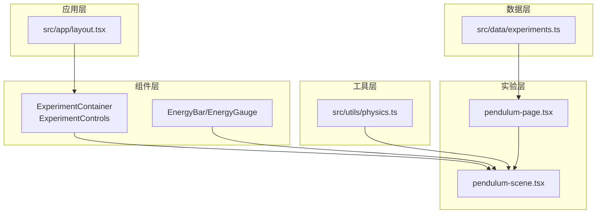
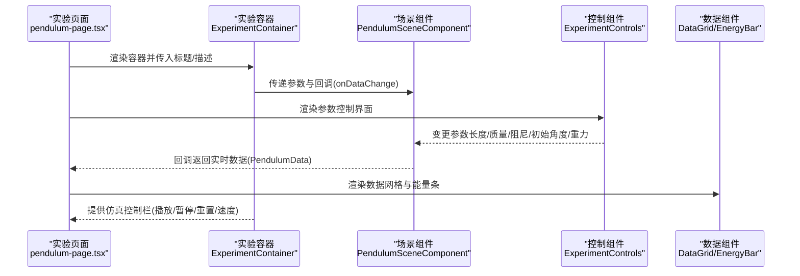
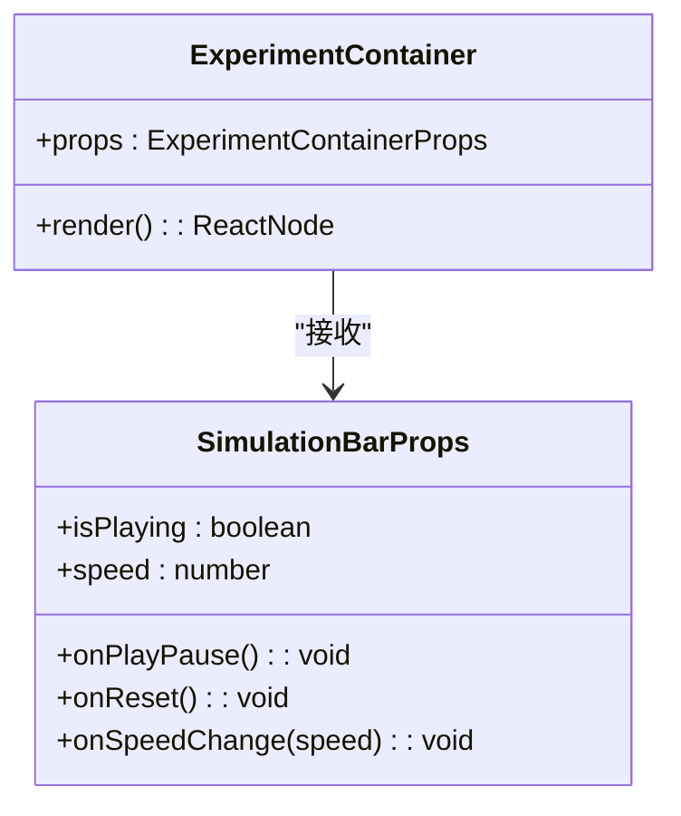
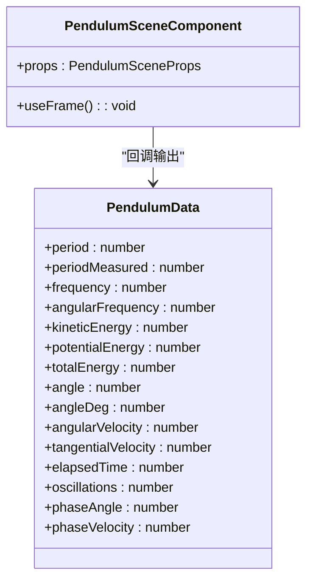
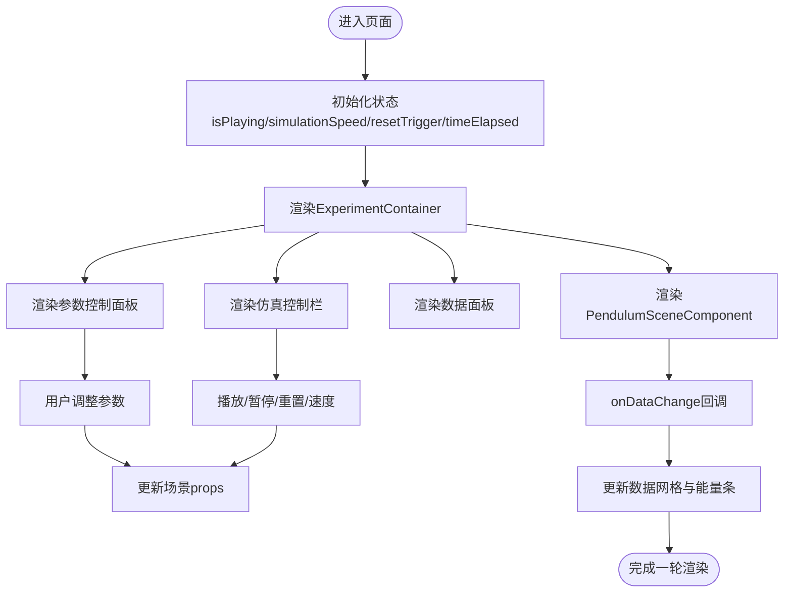
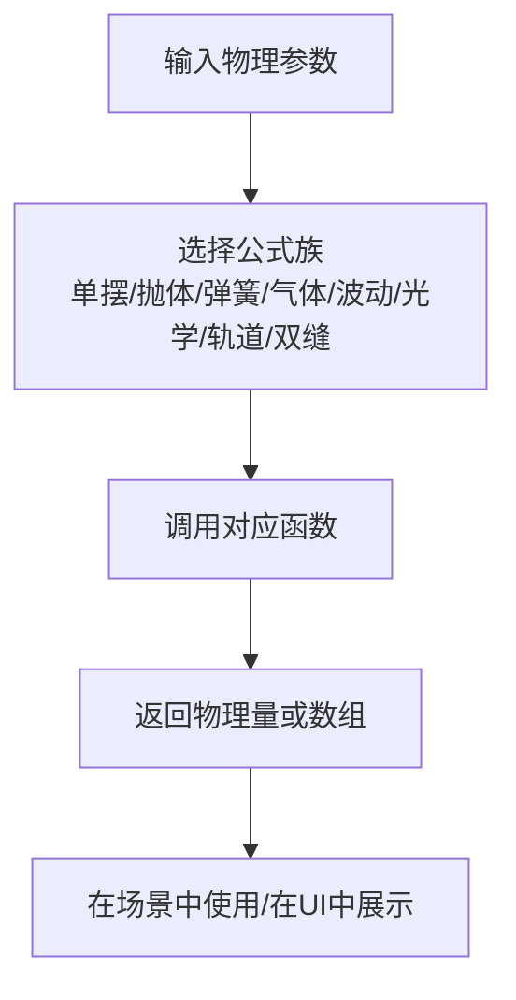
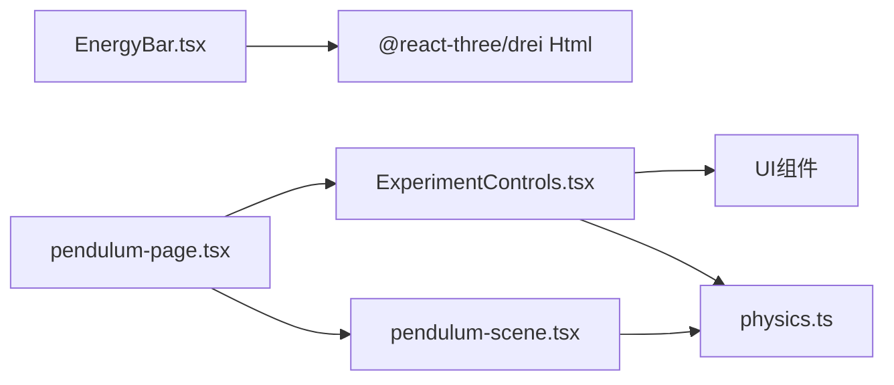

# API参考

<cite>
**本文档引用的文件**
- [package.json](file://package.json)
- [src/app/layout.tsx](file://src/app/layout.tsx)
- [src/data/experiments.ts](file://src/data/experiments.ts)
- [src/types/css.d.ts](file://src/types/css.d.ts)
- [src/components/experiment-ui/index.ts](file://src/components/experiment-ui/index.ts)
- [src/components/experiment-ui/ExperimentContainer.tsx](file://src/components/experiment-ui/ExperimentContainer.tsx)
- [src/components/experiment-ui/ExperimentControls.tsx](file://src/components/experiment-ui/ExperimentControls.tsx)
- [src/components/experiment-helpers/index.ts](file://src/components/experiment-helpers/index.ts)
- [src/components/experiment-helpers/EnergyBar.tsx](file://src/components/experiment-helpers/EnergyBar.tsx)
- [src/utils/physics.ts](file://src/utils/physics.ts)
- [src/experiments/pendulum-page.tsx](file://src/experiments/pendulum-page.tsx)
- [src/experiments/pendulum-scene.tsx](file://src/experiments/pendulum-scene.tsx)
</cite>

## 目录
1. [简介](#简介)
2. [项目结构](#项目结构)
3. [核心组件](#核心组件)
4. [架构总览](#架构总览)
5. [详细组件分析](#详细组件分析)
6. [依赖关系分析](#依赖关系分析)
7. [性能考虑](#性能考虑)
8. [故障排查指南](#故障排查指南)
9. [结论](#结论)
10. [附录](#附录)

## 简介
本API参考面向ScienceLab3D的前端开发者与实验作者，系统性梳理了实验容器、控制面板、数据面板、可视化组件以及物理计算工具的公共接口与类型定义。文档覆盖以下方面：
- 实验容器与3D画布管理
- 参数控制组件（滑块、下拉、按钮、复选框、预设按钮、进度条）
- 数据展示组件（数据网格、能量条）
- 物理计算工具函数（常量、运动学、波动光学、轨道力学等）
- 实验页面与场景组件的集成方式
- 类型定义与接口规范
- 使用示例与最佳实践
- 版本兼容性与变更历史
- 调试与测试方法

## 项目结构
项目采用Next.js应用结构，核心模块如下：
- 应用层：根布局与元数据配置
- 数据层：实验清单与分类定义
- 组件层：实验UI组件与辅助组件
- 工具层：通用物理计算工具
- 实验层：各实验页面与场景组件

**图表来源**
- [src/app/layout.tsx:1-204](file://src/app/layout.tsx#L1-L204)
- [src/data/experiments.ts:1-492](file://src/data/experiments.ts#L1-L492)
- [src/components/experiment-ui/ExperimentContainer.tsx:1-374](file://src/components/experiment-ui/ExperimentContainer.tsx#L1-L374)
- [src/components/experiment-ui/ExperimentControls.tsx:1-498](file://src/components/experiment-ui/ExperimentControls.tsx#L1-L498)
- [src/components/experiment-helpers/EnergyBar.tsx:1-142](file://src/components/experiment-helpers/EnergyBar.tsx#L1-L142)
- [src/utils/physics.ts:1-687](file://src/utils/physics.ts#L1-L687)
- [src/experiments/pendulum-page.tsx:1-214](file://src/experiments/pendulum-page.tsx#L1-L214)
- [src/experiments/pendulum-scene.tsx:1-859](file://src/experiments/pendulum-scene.tsx#L1-L859)

**章节来源**
- [src/app/layout.tsx:1-204](file://src/app/layout.tsx#L1-L204)
- [src/data/experiments.ts:1-492](file://src/data/experiments.ts#L1-L492)

## 核心组件
本节概述实验容器与控制组件的公共接口。

- 实验容器（ExperimentContainer）
  - 功能：封装3D画布、相机、光照、控件面板、数据面板、仿真控制栏
  - 关键属性
    - children: ReactNode
    - title: string
    - description?: string
    - controls?: ReactNode
    - dataPanel?: ReactNode
    - details?: ReactNode
    - cameraPosition?: [number, number, number]
    - enableFog?: boolean
    - backgroundColor?: string
    - simulationBar?: SimulationBarProps
  - 仿真控制栏属性（SimulationBarProps）
    - isPlaying: boolean
    - onPlayPause: () => void
    - onReset: () => void
    - speed: number
    - onSpeedChange: (speed: number) => void

- 控制组与单项（ControlGroup, ControlItem）
  - ControlGroupProps: title, children
  - ControlItemProps: label, value, unit?, color?

- 滑块控件（ControlSlider）
  - ControlSliderProps: label, value, unit?, min, max, step, color?, onChange(value), decimals?, disabled?

- 数据网格（DataGrid）
  - DataGridProps: data: Record<string, { value, unit, color?, decimals? }>, columns?: 1|2|3

- 能量条（EnergyBar）
  - EnergyBarProps: kinetic, potential, total, maxEnergy?

- 下拉选择（ControlDropdown）
  - ControlDropdownProps<T>: label, value:T, options: DropdownOption[], onChange, color?, disabled?
  - DropdownOption: label, value, emoji?, color?

- 按钮（ControlButton）
  - ControlButtonProps: label, onClick, variant?, icon?, disabled?, fullWidth?, size?
  - ButtonVariant: "primary"|"secondary"|"danger"|"success"|"warning"

- 复选框（ControlCheckbox）
  - ControlCheckboxProps: label, checked, onChange, color?, disabled?

- 预设按钮（ControlPresetButtons）
  - ControlPresetButtonsProps: label, value, presets: PresetOption[], onChange, displayValue?
  - PresetOption: label, value, emoji?, color?

- 进度条（ControlProgressBar）
  - ControlProgressBarProps: label, value: 0..1, color?, showPercentage?

- 辅助组件（EnergyBar/EnergyGauge）
  - EnergyBarProps: kinetic, potential, total?, position?, showLabels?
  - EnergyGaugeProps: kinetic, potential, total?, size?

**章节来源**
- [src/components/experiment-ui/ExperimentContainer.tsx:34-53](file://src/components/experiment-ui/ExperimentContainer.tsx#L34-L53)
- [src/components/experiment-ui/ExperimentControls.tsx:5-498](file://src/components/experiment-ui/ExperimentControls.tsx#L5-L498)
- [src/components/experiment-helpers/EnergyBar.tsx:6-142](file://src/components/experiment-helpers/EnergyBar.tsx#L6-L142)

## 架构总览
实验页面通过ExperimentContainer承载3D场景，场景组件负责物理仿真与可视化，控制组件提供参数调节，数据组件展示实时结果。

**图表来源**
- [src/experiments/pendulum-page.tsx:1-214](file://src/experiments/pendulum-page.tsx#L1-L214)
- [src/experiments/pendulum-scene.tsx:1-859](file://src/experiments/pendulum-scene.tsx#L1-L859)
- [src/components/experiment-ui/ExperimentContainer.tsx:1-374](file://src/components/experiment-ui/ExperimentContainer.tsx#L1-L374)
- [src/components/experiment-ui/ExperimentControls.tsx:1-498](file://src/components/experiment-ui/ExperimentControls.tsx#L1-L498)

## 详细组件分析

### 实验容器（ExperimentContainer）
- 角色：统一管理3D画布、相机、光照、控件面板、数据面板、仿真控制栏
- 关键行为
  - 自适应画布尺寸与像素比
  - OrbitControls交互（旋转/平移/缩放）
  - 环境光、方向光、半球光、点光源组合
  - 可选雾化效果
  - 控件/数据面板的显示/隐藏切换
  - 仿真控制栏（播放/暂停/重置/速度）

**图表来源**
- [src/components/experiment-ui/ExperimentContainer.tsx:34-53](file://src/components/experiment-ui/ExperimentContainer.tsx#L34-L53)

**章节来源**
- [src/components/experiment-ui/ExperimentContainer.tsx:1-374](file://src/components/experiment-ui/ExperimentContainer.tsx#L1-L374)

### 控制组件（ExperimentControls）
- 角色：提供参数调节与数据展示的UI组件
- 主要组件
  - ControlGroup/ControlItem：分组与单项显示
  - ControlSlider：数值范围调节
  - DataGrid：多列数据网格
  - EnergyBar：能量占比可视化
  - ControlDropdown：选项选择
  - ControlButton：动作触发
  - ControlCheckbox：布尔开关
  - ControlPresetButtons：快速预设
  - ControlProgressBar：进度指示

```mermaid
classDiagram
class ControlGroup {
+props : ControlGroupProps
}
class ControlItem {
+props : ControlItemProps
}
class ControlSlider {
+props : ControlSliderProps
}
class DataGrid {
+props : DataGridProps
}
class EnergyBar {
+props : EnergyBarProps
}
class ControlDropdown {
+props : ControlDropdownProps
}
class ControlButton {
+props : ControlButtonProps
}
class ControlCheckbox {
+props : ControlCheckboxProps
}
class ControlPresetButtons {
+props : ControlPresetButtonsProps
}
class ControlProgressBar {
+props : ControlProgressBarProps
}
```

**图表来源**
- [src/components/experiment-ui/ExperimentControls.tsx:5-498](file://src/components/experiment-ui/ExperimentControls.tsx#L5-L498)

**章节来源**
- [src/components/experiment-ui/ExperimentControls.tsx:1-498](file://src/components/experiment-ui/ExperimentControls.tsx#L1-L498)

### 场景组件（以单摆为例）
- 角色：执行物理仿真、更新3D模型、输出实时数据
- 关键接口
  - PendulumSceneComponent(props)
    - onDataChange?: (data: PendulumData) => void
    - length?: number
    - gravity?: number
    - mass?: number
    - damping?: number
    - initialAngle?: number
    - showTrail?: boolean
    - showVectors?: boolean
    - showAngleArc?: boolean
    - showProtractor?: boolean
    - isPlaying?: boolean
    - simulationSpeed?: number
    - resetTrigger?: number
  - PendulumData：周期、频率、角频率、动能、势能、总能、角度、角速度、切向速度、相位、振荡次数等

**图表来源**
- [src/experiments/pendulum-scene.tsx:12-44](file://src/experiments/pendulum-scene.tsx#L12-L44)

**章节来源**
- [src/experiments/pendulum-scene.tsx:1-859](file://src/experiments/pendulum-scene.tsx#L1-L859)

### 页面组件（以单摆为例）
- 角色：组织实验容器、控制面板、数据面板与仿真控制栏
- 关键流程
  - 状态管理：播放/暂停、速度、重置触发、时间累计
  - 参数控制：长度、质量、初始角度、阻尼、重力（含预设）
  - 显示选项：轨迹、矢量、角度弧、量角器
  - 数据展示：数据网格与能量条

**图表来源**
- [src/experiments/pendulum-page.tsx:1-214](file://src/experiments/pendulum-page.tsx#L1-L214)
- [src/experiments/pendulum-scene.tsx:1-859](file://src/experiments/pendulum-scene.tsx#L1-L859)

**章节来源**
- [src/experiments/pendulum-page.tsx:1-214](file://src/experiments/pendulum-page.tsx#L1-L214)

### 物理工具函数（physics.ts）
- 常量：万有引力常数、重力加速度、光速、普适气体常量、玻尔兹曼常量、普朗克常量、基本电荷、电子/质子质量、真空介电/磁导率
- 单摆：周期、频率、角频率、势能、动能
- 抛体运动：射程、最大高度、飞行时间、位置、带空气阻力的速度
- 弹簧-质量系统：周期、角频率、弹性势能、动能
- 理想气体：压强、温度、平均动能、方均根速率
- 波动：波速、波长、多普勒频移、波数、角频率
- 光学：折射角、临界角、反射率、透射率、斯涅尔定律
- 引力轨道：万有引力、逃逸速度、圆轨道速度、轨道周期、轨道能量、半长轴、离心率、角动量
- 双缝干涉：条纹间距、强度分布
- 工具：角度换算、夹取、线性插值、区间映射

**图表来源**
- [src/utils/physics.ts:10-687](file://src/utils/physics.ts#L10-L687)

**章节来源**
- [src/utils/physics.ts:1-687](file://src/utils/physics.ts#L1-L687)

### 实验配置接口与场景状态类型
- 实验配置接口（实验清单）
  - Experiment接口：id, title, category, difficulty, description, icon, color, topics[]
  - 分类信息：id(name), name, icon, color, description
- 场景状态类型（以单摆为例）
  - PendulumSceneProps：场景参数与回调
  - PendulumData：实时物理量集合

**章节来源**
- [src/data/experiments.ts:1-492](file://src/data/experiments.ts#L1-L492)
- [src/experiments/pendulum-scene.tsx:12-44](file://src/experiments/pendulum-scene.tsx#L12-L44)

## 依赖关系分析
- 组件依赖
  - ExperimentContainer依赖@react-three/fiber与@react-three/drei进行3D渲染
  - ExperimentControls为纯UI组件，无外部3D依赖
  - EnergyBar/EnergyGauge基于@react-three/drei的Html组件实现3D内文本/图形
- 实验页面与场景
  - 页面通过props驱动场景组件，场景通过回调输出数据
- 物理工具
  - 场景组件直接调用physics.ts中的函数进行物理计算

**图表来源**
- [src/components/experiment-ui/ExperimentControls.tsx:1-498](file://src/components/experiment-ui/ExperimentControls.tsx#L1-L498)
- [src/components/experiment-helpers/EnergyBar.tsx:1-142](file://src/components/experiment-helpers/EnergyBar.tsx#L1-L142)
- [src/experiments/pendulum-scene.tsx:1-859](file://src/experiments/pendulum-scene.tsx#L1-L859)
- [src/utils/physics.ts:1-687](file://src/utils/physics.ts#L1-L687)
- [src/experiments/pendulum-page.tsx:1-214](file://src/experiments/pendulum-page.tsx#L1-L214)

**章节来源**
- [src/components/experiment-ui/ExperimentControls.tsx:1-498](file://src/components/experiment-ui/ExperimentControls.tsx#L1-L498)
- [src/components/experiment-helpers/EnergyBar.tsx:1-142](file://src/components/experiment-helpers/EnergyBar.tsx#L1-L142)
- [src/experiments/pendulum-scene.tsx:1-859](file://src/experiments/pendulum-scene.tsx#L1-L859)
- [src/utils/physics.ts:1-687](file://src/utils/physics.ts#L1-L687)
- [src/experiments/pendulum-page.tsx:1-214](file://src/experiments/pendulum-page.tsx#L1-L214)

## 性能考虑
- 3D渲染
  - OrbitControls启用阻尼与距离限制，减少不必要的重绘
  - 移动端降低抗锯齿与DPR，提升帧率稳定性
  - 合理设置阴影贴图与投影矩阵
- 帧循环
  - 场景组件使用useFrame按delta时间步进，支持sub-steps保证高倍速下的数值稳定
  - 能量数据每若干帧才更新React状态，降低状态抖动
- 几何与材质
  - BufferGeometry与顶点属性按需更新，避免全量重绘
  - 材质使用金属度/粗糙度增强真实感同时保持性能
- UI组件
  - 控制组件采用受控组件模式，避免重复渲染
  - 数据网格按列数动态生成，减少DOM节点数量

[本节为通用指导，不直接分析具体文件]

## 故障排查指南
- 3D画布不渲染
  - 检查ExperimentContainer是否检测到窗口尺寸变化
  - 确认设备像素比与画布尺寸设置
- 控制面板无法打开
  - 检查controls/dataPanel参数是否传入
  - 确认面板样式与z-index未被覆盖
- 数据不更新
  - 确认场景组件的onDataChange回调是否正确触发
  - 检查帧循环中的数据计算逻辑与throttle策略
- 性能问题
  - 在移动端开启更低DPR与关闭抗锯齿
  - 减少复杂几何体与高分辨率纹理
  - 合理使用阴影与环境贴图

**章节来源**
- [src/components/experiment-ui/ExperimentContainer.tsx:78-133](file://src/components/experiment-ui/ExperimentContainer.tsx#L78-L133)
- [src/experiments/pendulum-scene.tsx:314-502](file://src/experiments/pendulum-scene.tsx#L314-L502)

## 结论
ScienceLab3D通过清晰的组件分层与完善的类型定义，提供了可扩展的实验开发框架。实验作者可通过ExperimentContainer快速搭建3D场景，利用ExperimentControls与DataPanel构建直观的交互与数据展示，并借助physics.ts提供的物理计算工具实现高保真的科学模拟。

[本节为总结性内容，不直接分析具体文件]

## 附录

### API使用示例与最佳实践
- 在实验页面中组合使用
  - 使用ExperimentContainer包裹场景组件
  - 通过ControlSlider/ControlDropdown等控件绑定场景参数
  - 使用DataGrid/EnergyBar展示实时数据
  - 使用SimulationBar控制播放/暂停/重置/速度
- 最佳实践
  - 将物理计算与渲染分离，保持场景组件职责单一
  - 对高频状态更新进行节流处理
  - 为移动端优化渲染参数与交互体验
  - 为每个实验提供简明的描述与说明面板

**章节来源**
- [src/experiments/pendulum-page.tsx:1-214](file://src/experiments/pendulum-page.tsx#L1-L214)
- [src/experiments/pendulum-scene.tsx:1-859](file://src/experiments/pendulum-scene.tsx#L1-L859)
- [src/components/experiment-ui/ExperimentControls.tsx:1-498](file://src/components/experiment-ui/ExperimentControls.tsx#L1-L498)
- [src/components/experiment-helpers/EnergyBar.tsx:1-142](file://src/components/experiment-helpers/EnergyBar.tsx#L1-L142)

### 版本兼容性与变更历史
- 项目版本
  - 当前版本：1.0.0
  - 依赖生态：Next.js、React、Three.js、@react-three/fiber、@react-three/drei、levea、framer-motion等
- 兼容性建议
  - TypeScript版本：^5.8.0
  - React/ReactDOM：^19.0.0
  - Three.js：^0.184.0
- 变更注意事项
  - 更新Three.js时注意API变更与着色器兼容性
  - 更新@react-three/*系列包时检查useFrame与组件签名
  - 升级Next.js时关注实验页面路由与客户端渲染标记

**章节来源**
- [package.json:1-37](file://package.json#L1-L37)

### 调试与测试方法
- 调试
  - 使用浏览器开发者工具检查3D渲染与帧率
  - 在场景组件中打印关键变量（如角度、角速度、能量）验证物理一致性
  - 使用控制台输出onDataChange的数据结构，确认字段完整性
- 测试
  - 编写单元测试验证physics.ts函数的数学正确性
  - 使用快照测试验证UI组件在不同props下的渲染一致性
  - 端到端测试验证从参数调整到数据更新的完整链路

**章节来源**
- [src/utils/physics.ts:1-687](file://src/utils/physics.ts#L1-L687)
- [src/experiments/pendulum-scene.tsx:484-501](file://src/experiments/pendulum-scene.tsx#L484-L501)