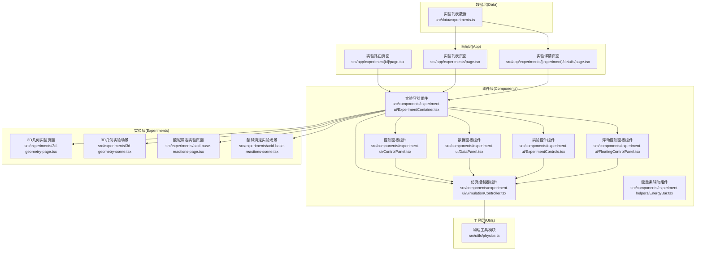
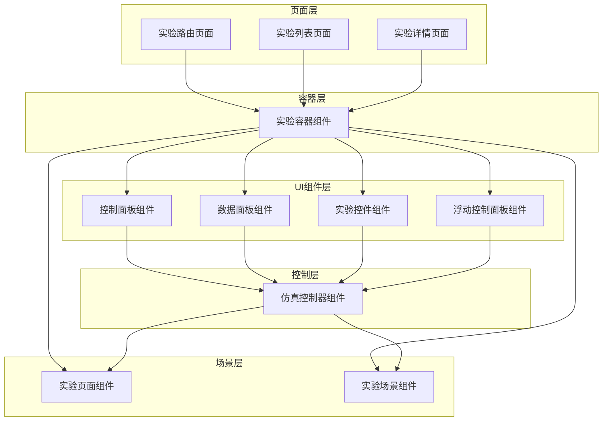
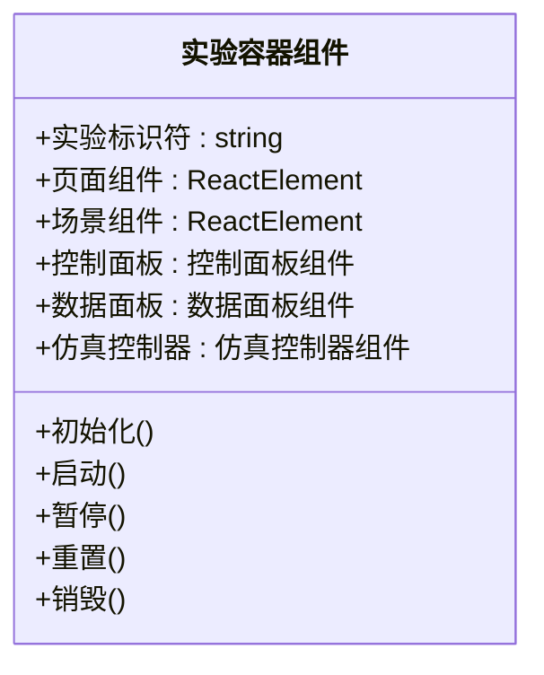
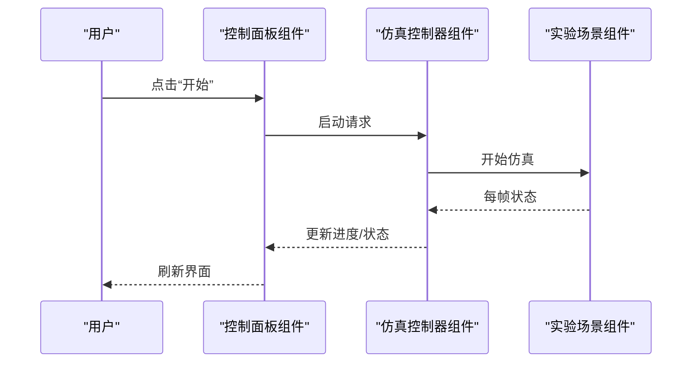
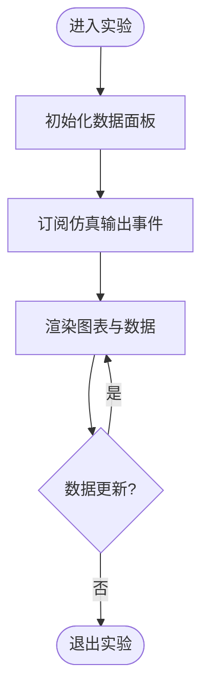
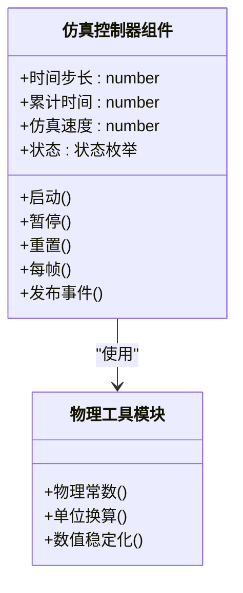
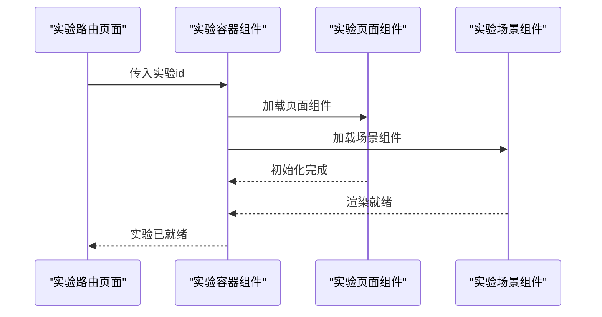
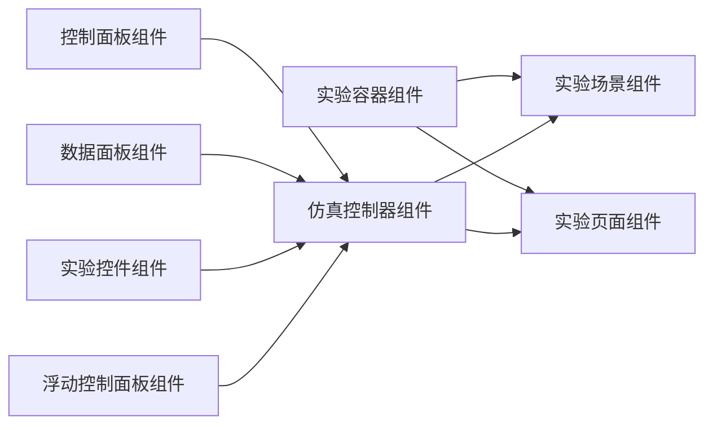

# 实验接口

<cite>
**本文引用的文件**
- [实验列表数据](file://src/data/experiments.ts)
- [实验容器组件](file://src/components/experiment-ui/ExperimentContainer.tsx)
- [控制面板组件](file://src/components/experiment-ui/ControlPanel.tsx)
- [数据面板组件](file://src/components/experiment-ui/DataPanel.tsx)
- [实验控件组件](file://src/components/experiment-ui/ExperimentControls.tsx)
- [浮动控制面板组件](file://src/components/experiment-ui/FloatingControlPanel.tsx)
- [仿真控制器组件](file://src/components/experiment-ui/SimulationController.tsx)
- [能量条辅助组件](file://src/components/experiment-helpers/EnergyBar.tsx)
- [物理工具模块](file://src/utils/physics.ts)
- [3D几何实验页面](file://src/experiments/3d-geometry-page.tsx)
- [3D几何实验场景](file://src/experiments/3d-geometry-scene.tsx)
- [酸碱滴定实验页面](file://src/experiments/acid-base-reactions-page.tsx)
- [酸碱滴定实验场景](file://src/experiments/acid-base-reactions-scene.tsx)
- [实验路由页面](file://src/app/experiment[id]/page.tsx)
- [实验列表页面](file://src/app/experiments/page.tsx)
- [实验详情页面](file://src/app/experiments/[experiment]/details/page.tsx)
- [全局样式](file://src/app/globals.css)
- [应用布局](file://src/app/layout.tsx)
- [应用入口页](file://src/app/page.tsx)
- [应用未找到页](file://src/app/not-found.tsx)
- [应用站点地图](file://src/app/sitemap.ts)
- [Next.js 配置](file://next.config.ts)
- [包配置](file://package.json)
- [类型声明](file://src/types/css.d.ts)
</cite>

## 目录
1. [引言](#引言)
2. [项目结构](#项目结构)
3. [核心组件](#核心组件)
4. [架构总览](#架构总览)
5. [详细组件分析](#详细组件分析)
6. [依赖关系分析](#依赖关系分析)
7. [性能考虑](#性能考虑)
8. [故障排除指南](#故障排除指南)
9. [结论](#结论)
10. [附录](#附录)

## 引言
本文件面向ScienceLab3D实验系统的接口设计与实现，聚焦于实验配置接口、场景组件接口、实验数据结构、参数配置与状态管理、实验页面与场景组件的接口规范、实验扩展与自定义机制、实验间数据共享与通信接口、实验配置的验证规则与约束条件，以及完整的实验接口使用示例。目标是帮助开发者快速理解并正确集成新的实验或扩展现有实验。

## 项目结构
项目采用基于功能域的组织方式：页面层（app）、组件层（components）、实验实现层（experiments）、数据层（data）、工具层（utils）与类型声明（types）。页面层通过Next.js App Router组织实验路由；组件层提供可复用的UI与实验控制组件；实验层包含每个实验的页面与场景实现；数据层提供实验元数据；工具层提供通用物理计算等能力。

图表来源
- [实验容器组件](file://src/components/experiment-ui/ExperimentContainer.tsx)
- [控制面板组件](file://src/components/experiment-ui/ControlPanel.tsx)
- [数据面板组件](file://src/components/experiment-ui/DataPanel.tsx)
- [实验控件组件](file://src/components/experiment-ui/ExperimentControls.tsx)
- [浮动控制面板组件](file://src/components/experiment-ui/FloatingControlPanel.tsx)
- [仿真控制器组件](file://src/components/experiment-ui/SimulationController.tsx)
- [3D几何实验页面](file://src/experiments/3d-geometry-page.tsx)
- [3D几何实验场景](file://src/experiments/3d-geometry-scene.tsx)
- [酸碱滴定实验页面](file://src/experiments/acid-base-reactions-page.tsx)
- [酸碱滴定实验场景](file://src/experiments/acid-base-reactions-scene.tsx)
- [实验列表数据](file://src/data/experiments.ts)

章节来源
- [实验容器组件](file://src/components/experiment-ui/ExperimentContainer.tsx)
- [实验列表数据](file://src/data/experiments.ts)
- [实验路由页面](file://src/app/experiment[id]/page.tsx)
- [实验列表页面](file://src/app/experiments/page.tsx)
- [实验详情页面](file://src/app/experiments/[experiment]/details/page.tsx)

## 核心组件
本节概述实验系统的核心接口与职责边界，包括实验容器、控制面板、数据面板、实验控件、浮动控制面板、仿真控制器等组件，以及它们如何协作以提供一致的实验体验。

- 实验容器组件：作为实验页面的根容器，负责加载实验页面与场景、注入实验上下文、协调控制面板与数据面板的显示与交互。
- 控制面板组件：提供实验参数设置、重置、暂停/继续等基础控制入口。
- 数据面板组件：展示实验过程中的实时数据、统计信息与结果。
- 实验控件组件：封装具体实验的交互控件，如滑块、按钮、输入框等。
- 浮动控制面板组件：在特定场景下提供便捷的悬浮式控制入口。
- 仿真控制器组件：统一管理仿真时间步进、速度调节、状态切换等。

章节来源
- [实验容器组件](file://src/components/experiment-ui/ExperimentContainer.tsx)
- [控制面板组件](file://src/components/experiment-ui/ControlPanel.tsx)
- [数据面板组件](file://src/components/experiment-ui/DataPanel.tsx)
- [实验控件组件](file://src/components/experiment-ui/ExperimentControls.tsx)
- [浮动控制面板组件](file://src/components/experiment-ui/FloatingControlPanel.tsx)
- [仿真控制器组件](file://src/components/experiment-ui/SimulationController.tsx)

## 架构总览
实验系统采用“页面+场景”双层架构：页面层负责UI与用户交互，场景层负责3D渲染与物理仿真。两者通过容器组件解耦，通过仿真控制器进行状态同步与事件分发。

图表来源
- [实验容器组件](file://src/components/experiment-ui/ExperimentContainer.tsx)
- [控制面板组件](file://src/components/experiment-ui/ControlPanel.tsx)
- [数据面板组件](file://src/components/experiment-ui/DataPanel.tsx)
- [实验控件组件](file://src/components/experiment-ui/ExperimentControls.tsx)
- [浮动控制面板组件](file://src/components/experiment-ui/FloatingControlPanel.tsx)
- [仿真控制器组件](file://src/components/experiment-ui/SimulationController.tsx)
- [3D几何实验页面](file://src/experiments/3d-geometry-page.tsx)
- [3D几何实验场景](file://src/experiments/3d-geometry-scene.tsx)

## 详细组件分析

### 实验容器组件接口
- 职责：承载实验页面与场景，注入实验上下文，协调UI与场景的生命周期与状态同步。
- 关键属性与方法：
  - 实验标识符（id）
  - 页面组件引用
  - 场景组件引用
  - 控制面板与数据面板的可见性与布局
  - 仿真控制器实例
- 状态管理：
  - 当前实验状态（初始化、运行中、暂停、结束）
  - 用户交互状态（参数变更、控件点击）
  - 渲染帧率与性能指标

图表来源
- [实验容器组件](file://src/components/experiment-ui/ExperimentContainer.tsx)
- [控制面板组件](file://src/components/experiment-ui/ControlPanel.tsx)
- [数据面板组件](file://src/components/experiment-ui/DataPanel.tsx)
- [仿真控制器组件](file://src/components/experiment-ui/SimulationController.tsx)

章节来源
- [实验容器组件](file://src/components/experiment-ui/ExperimentContainer.tsx)

### 控制面板组件接口
- 职责：提供实验的基础控制入口，包括开始/暂停/重置、参数调整、视图切换等。
- 关键属性与方法：
  - 控制项集合（按钮、滑块、开关等）
  - 参数绑定与回调
  - 布局模式（紧凑/展开）
- 事件流：
  - 用户操作触发参数更新
  - 参数更新通过仿真控制器同步到场景

图表来源
- [控制面板组件](file://src/components/experiment-ui/ControlPanel.tsx)
- [仿真控制器组件](file://src/components/experiment-ui/SimulationController.tsx)
- [3D几何实验场景](file://src/experiments/3d-geometry-scene.tsx)

章节来源
- [控制面板组件](file://src/components/experiment-ui/ControlPanel.tsx)
- [仿真控制器组件](file://src/components/experiment-ui/SimulationController.tsx)

### 数据面板组件接口
- 职责：展示实验过程中的实时数据、统计数据与结果图表。
- 关键属性与方法：
  - 数据源绑定（数值、数组、对象）
  - 图表渲染器（折线图、柱状图、仪表盘等）
  - 过滤与聚合逻辑
- 与仿真控制器的协作：
  - 订阅仿真输出事件
  - 实时刷新数据视图

图表来源
- [数据面板组件](file://src/components/experiment-ui/DataPanel.tsx)
- [仿真控制器组件](file://src/components/experiment-ui/SimulationController.tsx)

章节来源
- [数据面板组件](file://src/components/experiment-ui/DataPanel.tsx)

### 实验控件组件接口
- 职责：封装具体实验的交互控件，如参数滑块、选择器、输入框等。
- 关键属性与方法：
  - 控件类型与默认值
  - 变更回调与校验
  - 与实验参数模型的双向绑定
- 扩展点：
  - 自定义控件类型
  - 参数范围与步长配置

章节来源
- [实验控件组件](file://src/components/experiment-ui/ExperimentControls.tsx)

### 浮动控制面板组件接口
- 职责：在特定实验中提供便捷的悬浮式控制入口，减少主界面拥挤。
- 关键属性与方法：
  - 定位策略（吸附边框、跟随鼠标）
  - 展开/收起动画
  - 快捷控件集合

章节来源
- [浮动控制面板组件](file://src/components/experiment-ui/FloatingControlPanel.tsx)

### 仿真控制器组件接口
- 职责：统一管理仿真时间步进、速度调节、状态切换与事件分发。
- 关键属性与方法：
  - 时间步长与累计时间
  - 仿真速度（倍速/慢动作）
  - 状态机（空闲/运行/暂停/错误）
  - 事件发布（每帧、状态变更、错误）
- 与物理工具模块的协作：
  - 使用物理工具模块进行数值计算与单位换算

图表来源
- [仿真控制器组件](file://src/components/experiment-ui/SimulationController.tsx)
- [物理工具模块](file://src/utils/physics.ts)

章节来源
- [仿真控制器组件](file://src/components/experiment-ui/SimulationController.tsx)
- [物理工具模块](file://src/utils/physics.ts)

### 实验页面与场景组件接口规范
- 页面组件（Page）：
  - 负责渲染实验UI与容器，接收实验标识符参数，加载对应场景。
  - 支持实验详情页与列表页的不同渲染策略。
- 场景组件（Scene）：
  - 负责3D渲染、物理仿真、交互拾取与视觉效果。
  - 与仿真控制器解耦，通过事件与状态同步。

图表来源
- [实验路由页面](file://src/app/experiment[id]/page.tsx)
- [实验容器组件](file://src/components/experiment-ui/ExperimentContainer.tsx)
- [3D几何实验页面](file://src/experiments/3d-geometry-page.tsx)
- [3D几何实验场景](file://src/experiments/3d-geometry-scene.tsx)

章节来源
- [实验路由页面](file://src/app/experiment[id]/page.tsx)
- [3D几何实验页面](file://src/experiments/3d-geometry-page.tsx)
- [3D几何实验场景](file://src/experiments/3d-geometry-scene.tsx)

### 实验扩展与自定义接口
- 新增实验步骤：
  1) 在实验层新增页面与场景文件，遵循命名规范（如 [name]-page.tsx 与 [name]-scene.tsx）。
  2) 在数据层的实验列表中注册新实验，定义元数据（名称、描述、类别、参数模板等）。
  3) 在容器组件中接入新实验的页面与场景，并确保仿真控制器正确初始化。
  4) 如需特殊UI，可在组件层新增控件或面板组件。
- 参数模板与验证：
  - 为新实验定义参数模板，包含默认值、最小/最大值、步长与单位。
  - 在控件层对参数进行前端校验，在仿真层进行后端一致性校验。
- 视觉与交互扩展：
  - 通过场景组件扩展3D对象、材质与动画。
  - 通过数据面板扩展图表类型与展示维度。

章节来源
- [实验列表数据](file://src/data/experiments.ts)
- [实验容器组件](file://src/components/experiment-ui/ExperimentContainer.tsx)
- [实验控件组件](file://src/components/experiment-ui/ExperimentControls.tsx)

### 实验间的数据共享与通信接口
- 共享机制：
  - 通过仿真控制器的事件总线实现跨实验的状态广播与订阅。
  - 通过全局上下文或轻量级存储（如内存缓存）共享通用参数与资源。
- 通信协议：
  - 事件名约定（如“实验切换”、“参数同步”、“性能指标”）。
  - 数据格式标准化（JSON序列化，含版本号与校验字段）。
- 安全与一致性：
  - 对共享数据进行访问权限控制与版本兼容检查。
  - 在实验切换时清理或迁移共享状态，避免内存泄漏。

章节来源
- [仿真控制器组件](file://src/components/experiment-ui/SimulationController.tsx)

### 实验配置的验证规则与约束条件
- 参数范围约束：
  - 数值型参数必须在预设范围内，超出范围应给出提示并回退到最近有效值。
- 类型一致性：
  - 输入类型与期望类型一致（字符串/数字/布尔），不一致则拒绝提交。
- 互斥与依赖：
  - 某些参数互斥（如同时开启A与B），某些参数依赖其他参数存在。
- 性能约束：
  - 大参数可能导致帧率下降，应在UI上给出警告与建议值。
- 校验时机：
  - 实时校验（输入时）与批量校验（提交时）结合。

章节来源
- [实验控件组件](file://src/components/experiment-ui/ExperimentControls.tsx)
- [仿真控制器组件](file://src/components/experiment-ui/SimulationController.tsx)

### 实验接口使用示例
- 示例一：加载3D几何实验
  1) 导航至实验路由页面，传入实验id。
  2) 容器组件加载3D几何页面与场景。
  3) 控制面板显示参数控件，用户调整参数后点击“开始”。
  4) 仿真控制器驱动场景渲染，数据面板展示实时数据。
- 示例二：扩展酸碱滴定实验
  1) 在实验层新增页面与场景文件。
  2) 在实验列表中注册新实验，定义参数模板。
  3) 在控件层添加新的参数控件（如滴定速度、指示剂类型）。
  4) 在数据面板中增加新的图表类型（如pH曲线）。
  5) 通过仿真控制器事件实现与其他实验的联动。

章节来源
- [实验路由页面](file://src/app/experiment[id]/page.tsx)
- [3D几何实验页面](file://src/experiments/3d-geometry-page.tsx)
- [3D几何实验场景](file://src/experiments/3d-geometry-scene.tsx)
- [酸碱滴定实验页面](file://src/experiments/acid-base-reactions-page.tsx)
- [酸碱滴定实验场景](file://src/experiments/acid-base-reactions-scene.tsx)

## 依赖关系分析
- 组件耦合：
  - 容器组件对页面与场景组件为单向依赖，降低耦合度。
  - 控制面板与数据面板通过仿真控制器间接依赖场景。
- 外部依赖：
  - 3D渲染与物理仿真依赖相关引擎（从现有文件可见相关类型声明存在于node_modules中）。
  - Next.js App Router用于页面路由与布局。
- 循环依赖：
  - 通过事件与回调避免循环依赖，保持清晰的调用链。

图表来源
- [实验容器组件](file://src/components/experiment-ui/ExperimentContainer.tsx)
- [控制面板组件](file://src/components/experiment-ui/ControlPanel.tsx)
- [数据面板组件](file://src/components/experiment-ui/DataPanel.tsx)
- [实验控件组件](file://src/components/experiment-ui/ExperimentControls.tsx)
- [浮动控制面板组件](file://src/components/experiment-ui/FloatingControlPanel.tsx)
- [仿真控制器组件](file://src/components/experiment-ui/SimulationController.tsx)

章节来源
- [实验容器组件](file://src/components/experiment-ui/ExperimentContainer.tsx)
- [仿真控制器组件](file://src/components/experiment-ui/SimulationController.tsx)

## 性能考虑
- 渲染优化：
  - 合理设置帧率与时间步长，避免过度计算。
  - 使用虚拟化与懒加载减少初始渲染压力。
- 数据更新策略：
  - 批处理数据更新，减少频繁重绘。
  - 对高频数据采用降采样或滑动窗口。
- 内存管理：
  - 在实验切换时及时释放场景资源与事件监听。
  - 避免全局状态膨胀，使用局部状态与上下文隔离。

## 故障排除指南
- 实验无法启动：
  - 检查容器组件是否正确加载页面与场景。
  - 确认仿真控制器初始化成功且无异常事件。
- 参数无效：
  - 检查控件层的参数校验逻辑与默认值。
  - 确保参数范围与类型符合预期。
- 数据不更新：
  - 检查数据面板是否正确订阅仿真输出事件。
  - 确认事件名称与数据格式一致。
- 性能问题：
  - 降低参数复杂度或帧率，观察性能变化。
  - 检查是否有不必要的重渲染或事件风暴。

章节来源
- [实验容器组件](file://src/components/experiment-ui/ExperimentContainer.tsx)
- [仿真控制器组件](file://src/components/experiment-ui/SimulationController.tsx)
- [数据面板组件](file://src/components/experiment-ui/DataPanel.tsx)
- [实验控件组件](file://src/components/experiment-ui/ExperimentControls.tsx)

## 结论
ScienceLab3D实验接口通过清晰的分层设计与组件化架构，实现了页面与场景的解耦、控制与数据的分离、以及扩展与复用的灵活性。依托仿真控制器与事件总线，系统支持多实验协同与数据共享。建议在扩展新实验时严格遵循参数模板与验证规则，确保用户体验与系统稳定性。

## 附录
- 相关文件清单：
  - 页面层：实验路由页面、实验列表页面、实验详情页面
  - 组件层：实验容器、控制面板、数据面板、实验控件、浮动控制面板、仿真控制器
  - 实验层：各实验的页面与场景实现
  - 数据层：实验列表数据
  - 工具层：物理工具模块
- 配置与部署：
  - Next.js配置与包管理配置位于项目根目录，按默认流程构建与运行即可。