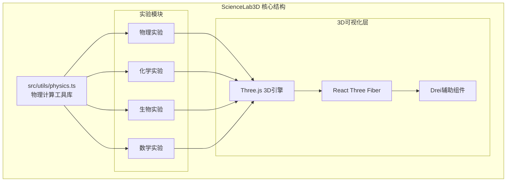
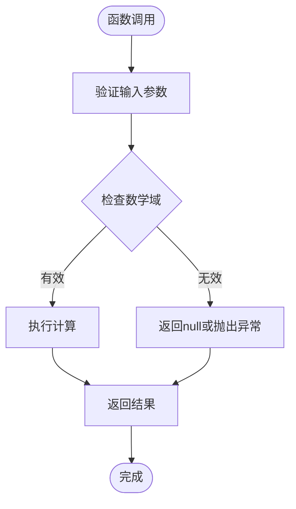
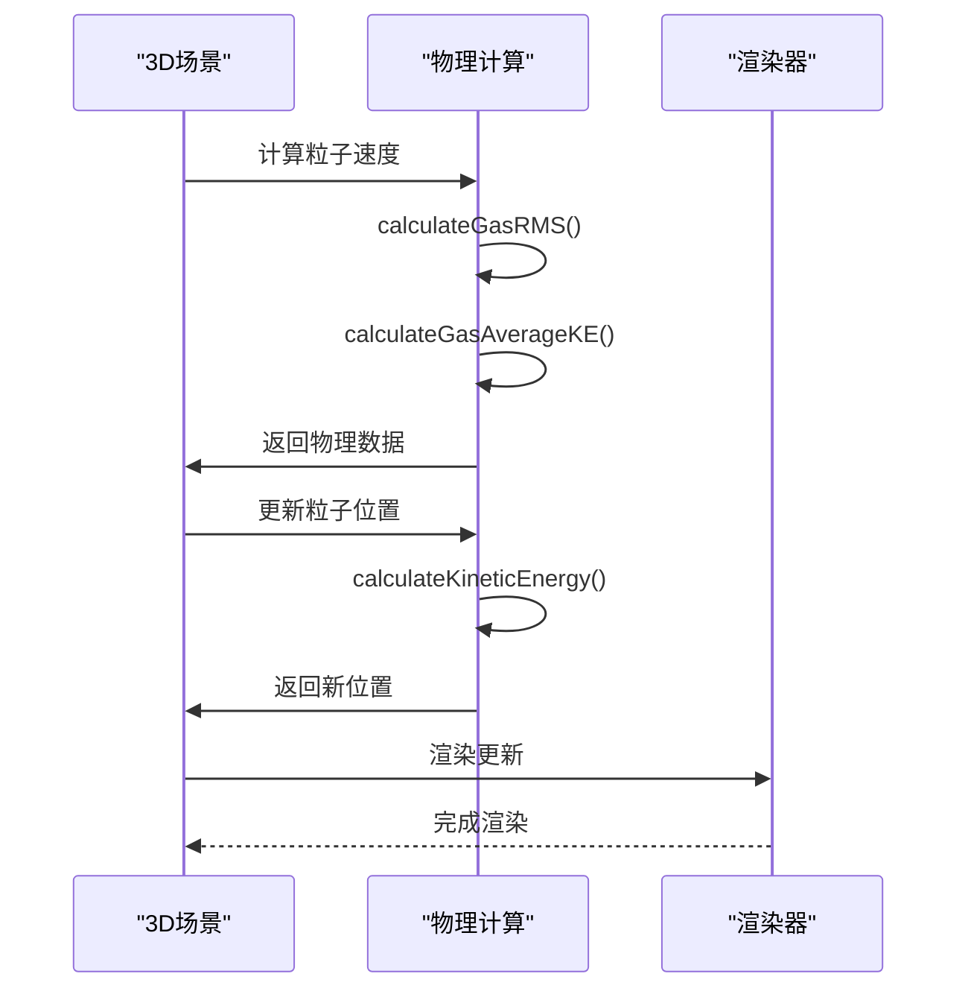

# 工具函数API

<cite>
**本文档引用的文件**
- [physics.ts](file://src/utils/physics.ts)
- [gas-laws-scene.tsx](file://src/experiments/gas-laws-scene.tsx)
- [README.md](file://README.md)
</cite>

## 目录
1. [简介](#简介)
2. [项目结构概览](#项目结构概览)
3. [核心常量](#核心常量)
4. [物理计算函数](#物理计算函数)
5. [数学运算函数](#数学运算函数)
6. [性能特性与优化建议](#性能特性与优化建议)
7. [错误处理与边界条件](#错误处理与边界条件)
8. [使用示例与最佳实践](#使用示例与最佳实践)
9. [故障排除指南](#故障排除指南)
10. [总结](#总结)

## 简介

ScienceLab3D是一个交互式3D科学学习平台，提供了40多个跨学科的实验模拟。本API文档专注于`src/utils/physics.ts`文件中定义的物理计算工具函数，涵盖了从基础物理概念到高级物理现象的完整计算库。

该工具函数库采用TypeScript编写，提供了精确的物理计算、数值转换和数学运算功能，支持所有实验模块的实时物理仿真。所有数值默认使用国际单位制（SI），确保计算的一致性和准确性。

## 项目结构概览



**图表来源**
- [physics.ts:1-687](file://src/utils/physics.ts#L1-L687)
- [README.md:48-105](file://README.md#L48-L105)

**章节来源**
- [physics.ts:1-687](file://src/utils/physics.ts#L1-L687)
- [README.md:26-45](file://README.md#L26-L45)

## 核心常量

`PHYSICS_CONSTANTS`对象定义了科学计算中常用的基本物理常数，所有值均采用国际单位制：

| 常量 | 符号 | 数值 | 单位 | 描述 |
|------|------|------|------|------|
| G | 万有引力常数 | 6.674×10⁻¹¹ | m³/kg·s² | 牛顿万有引力定律的比例常数 |
| g | 标准重力加速度 | 9.81 | m/s² | 地球表面重力加速度 |
| c | 光速 | 299,792,458 | m/s | 真空中的光速 |
| R | 摩尔气体常数 | 8.314 | J/mol·K | 理想气体状态方程常数 |
| k_B | 玻尔兹曼常数 | 1.381×10⁻²³ | J/K | 分子运动论基本常数 |
| h | 普朗克常数 | 6.626×10⁻³⁴ | J·s | 量子力学基本常数 |
| e | 基本电荷 | 1.602×10⁻¹⁹ | C | 电子电荷量 |
| m_e | 电子质量 | 9.109×10⁻³¹ | kg | 电子静止质量 |
| m_p | 质子质量 | 1.673×10⁻²⁷ | kg | 质子静止质量 |
| ε₀ | 真空介电常数 | 8.854×10⁻¹² | F/m | 真空介电常数 |
| μ₀ | 真空磁导率 | 4π×10⁻⁷ | H/m | 真空磁导率 |

**章节来源**
- [physics.ts:10-22](file://src/utils/physics.ts#L10-L22)

## 物理计算函数

### 摆运动学函数

摆运动是经典力学中的重要模型，用于演示简谐振动和周期性运动。

#### 计算单摆周期
```typescript
calculatePendulumPeriod(L: number, g: number = PHYSICS_CONSTANTS.g): number
```

**参数说明：**
- `L`: 摆长（米）
- `g`: 重力加速度（米/秒²，默认使用地球标准重力）

**返回值：** 摆动周期（秒）

**使用场景：** 实验室中测量重力加速度、时间测量、物理教学演示

#### 计算单摆频率
```typescript
calculatePendulumFrequency(L: number, g: number = PHYSICS_CONSTANTS.g): number
```

**参数说明：**
- `L`: 摆长（米）
- `g`: 重力加速度（米/秒²）

**返回值：** 摆动频率（赫兹）

**使用场景：** 分析摆动的快慢、共振现象研究

#### 计算单摆角频率
```typescript
calculatePendulumAngularFrequency(L: number, g: number = PHYSICS_CONSTANTS.g): number
```

**参数说明：**
- `L`: 摆长（米）
- `g`: 重力加速度（米/秒²）

**返回值：** 角频率（弧度/秒）

**使用场景：** 与三角函数结合进行相位分析

#### 计算单摆势能
```typescript
calculatePendulumPE(m: number, g: number, L: number, theta: number): number
```

**参数说明：**
- `m`: 质量（千克）
- `g`: 重力加速度（米/秒²）
- `L`: 摆长（米）
- `theta`: 相对于垂直方向的角度（弧度）

**返回值：** 势能（焦耳）

**使用场景：** 能量守恒演示、机械能分析

#### 计算单摆动能
```typescript
calculatePendulumKE(m: number, L: number, omega: number): number
```

**参数说明：**
- `m`: 质量（千克）
- `L`: 摆长（米）
- `omega`: 角速度（弧度/秒）

**返回值：** 动能（焦耳）

**使用场景：** 能量转换分析、速度计算

**章节来源**
- [physics.ts:28-92](file://src/utils/physics.ts#L28-L92)

### 抛体运动函数

抛体运动是物理学中的经典问题，涉及重力场中的二维运动轨迹。

#### 计算射程
```typescript
calculateRange(v0: number, theta: number, g: number = PHYSICS_CONSTANTS.g): number
```

**参数说明：**
- `v0`: 初始速度（米/秒）
- `theta`: 发射角度（弧度）
- `g`: 重力加速度（米/秒²）

**返回值：** 水平射程（米）

**使用场景：** 炮弹轨迹计算、体育投掷分析、弹道学

#### 计算最大高度
```typescript
calculateMaxHeight(v0: number, theta: number, g: number = PHYSICS_CONSTANTS.g): number
```

**参数说明：**
- `v0`: 初始速度（米/秒）
- `theta`: 发射角度（弧度）
- `g`: 重力加速度（米/秒²）

**返回值：** 最大飞行高度（米）

**使用场景：** 飞行轨迹分析、障碍物跨越计算

#### 计算飞行时间
```typescript
calculateTimeOfFlight(v0: number, theta: number, g: number = PHYSICS_CONSTANTS.g): number
```

**参数说明：**
- `v0`: 初始速度（米/秒）
- `theta`: 发射角度（弧度）
- `g`: 重力加速度（米/秒²）

**返回值：** 总飞行时间（秒）

**使用场景：** 时间控制、拦截计算

#### 计算抛体位置
```typescript
calculateProjectilePosition(v0: number, theta: number, t: number, g: number = PHYSICS_CONSTANTS.g): { x: number; y: number }
```

**参数说明：**
- `v0`: 初始速度（米/秒）
- `theta`: 发射角度（弧度）
- `t`: 时间（秒）
- `g`: 重力加速度（米/秒²）

**返回值：** 位置坐标 `{x, y}`（米）

**使用场景：** 实时轨迹绘制、碰撞检测

#### 计算带空气阻力的抛体速度
```typescript
calculateProjectileVelocityWithDrag(v0: number, theta: number, t: number, dragCoeff: number, g: number = PHYSICS_CONSTANTS.g): { vx: number; vy: number }
```

**参数说明：**
- `v0`: 初始速度（米/秒）
- `theta`: 发射角度（弧度）
- `t`: 时间（秒）
- `dragCoeff`: 空气阻力系数
- `g`: 重力加速度（米/秒²）

**返回值：** 速度分量 `{vx, vy}`（米/秒）

**使用场景：** 真实环境模拟、弹道修正

**章节来源**
- [physics.ts:98-188](file://src/utils/physics.ts#L98-L188)

### 弹簧-质量系统函数

弹簧-质量系统的简谐振动是量子力学和经典力学的重要基础。

#### 计算弹簧振子周期
```typescript
calculateSpringPeriod(m: number, k: number): number
```

**参数说明：**
- `m`: 质量（千克）
- `k`: 弹簧常数（牛顿/米）

**返回值：** 振动周期（秒）

**使用场景：** 弹簧秤设计、减震器分析

#### 计算弹簧振子角频率
```typescript
calculateSpringAngularFrequency(m: number, k: number): number
```

**参数说明：**
- `m`: 质量（千克）
- `k`: 弹簧常数（牛顿/米）

**返回值：** 角频率（弧度/秒）

**使用场景：** 振动分析、共振频率计算

#### 计算弹簧势能
```typescript
calculateSpringPE(k: number, x: number): number
```

**参数说明：**
- `k`: 弹簧常数（牛顿/米）
- `x`: 位移（米）

**返回值：** 弹性势能（焦耳）

**使用场景：** 能量守恒演示、机械能分析

#### 计算动能
```typescript
calculateKineticEnergy(m: number, v: number): number
```

**参数说明：**
- `m`: 质量（千克）
- `v`: 速度（米/秒）

**返回值：** 动能（焦耳）

**使用场景：** 运动分析、能量转换

**章节来源**
- [physics.ts:194-236](file://src/utils/physics.ts#L194-L236)

### 理想气体定律函数

理想气体定律是热力学的基础，描述了气体的压力、体积、温度关系。

#### 计算气体压力
```typescript
calculateGasPressure(n: number, R: number = PHYSICS_CONSTANTS.R, T: number, V: number): number
```

**参数说明：**
- `n`: 气体摩尔数
- `R`: 气体常数（焦耳/摩尔·开尔文，默认使用PHYSICS_CONSTANTS.R）
- `T`: 温度（开尔文）
- `V`: 体积（立方米）

**返回值：** 压力（帕斯卡）

**使用场景：** 气体容器设计、压力传感器校准

#### 计算气体温度
```typescript
calculateGasTemperature(P: number, V: number, n: number, R: number = PHYSICS_CONSTANTS.R): number
```

**参数说明：**
- `P`: 压力（帕斯卡）
- `V`: 体积（立方米）
- `n`: 气体摩尔数
- `R`: 气体常数（焦耳/摩尔·开尔文）

**返回值：** 温度（开尔文）

**使用场景：** 温度测量、热力学循环分析

#### 计算气体平均动能
```typescript
calculateGasAverageKE(T: number, k_B: number = PHYSICS_CONSTANTS.k_B): number
```

**参数说明：**
- `T`: 温度（开尔文）
- `k_B`: 玻尔兹曼常数（焦耳/开尔文）

**返回值：** 平均分子动能（焦耳）

**使用场景：** 分子运动论、温度微观解释

#### 计算气体分子方均根速度
```typescript
calculateGasRMS(T: number, molarMass: number, R: number = PHYSICS_CONSTANTS.R): number
```

**参数说明：**
- `T`: 温度（开尔文）
- `molarMass`: 摩尔质量（千克/摩尔）
- `R`: 气体常数（焦耳/摩尔·开尔文）

**返回值：** 方均根速度（米/秒）

**使用场景：** 分子速度分布、扩散速率计算

**章节来源**
- [physics.ts:242-303](file://src/utils/physics.ts#L242-L303)

### 波动光学函数

波动光学涵盖了波的传播、干涉、衍射等现象。

#### 计算波速
```typescript
calculateWaveSpeed(frequency: number, wavelength: number): number
```

**参数说明：**
- `frequency`: 频率（赫兹）
- `wavelength`: 波长（米）

**返回值：** 波速（米/秒）

**使用场景：** 声波传播、电磁波分析

#### 计算波长
```typescript
calculateWavelength(waveSpeed: number, frequency: number): number
```

**参数说明：**
- `waveSpeed`: 波速（米/秒）
- `frequency`: 频率（赫兹）

**返回值：** 波长（米）

**使用场景：** 光谱分析、波长测量

#### 计算多普勒频移
```typescript
calculateDopplerFrequency(f: number, v: number, vs: number): number
```

**参数说明：**
- `f`: 原始频率（赫兹）
- `v`: 波速（米/秒）
- `vs`: 源速度（米/秒，正表示远离，负表示接近）

**返回值：** 观测频率（赫兹）

**使用场景：** 多普勒雷达、天体物理观测

#### 计算波数
```typescript
calculateWaveNumber(wavelength: number): number
```

**参数说明：**
- `wavelength`: 波长（米）

**返回值：** 波数（弧度/米）

**使用场景：** 光学分析、波动方程

#### 计算角频率
```typescript
calculateAngularFrequency(frequency: number): number
```

**参数说明：**
- `frequency`: 频率（赫兹）

**返回值：** 角频率（弧度/秒）

**使用场景：** 交流电分析、振动系统

**章节来源**
- [physics.ts:309-361](file://src/utils/physics.ts#L309-L361)

### 几何光学函数

几何光学处理光线在介质间的传播和反射折射。

#### 计算折射角（Snell定律）
```typescript
calculateRefractionAngle(n1: number, theta1: number, n2: number): number | null
```

**参数说明：**
- `n1`: 第一种介质折射率
- `theta1`: 入射角（弧度）
- `n2`: 第二种介质折射率

**返回值：** 折射角（弧度）或null（全内反射时）

**使用场景：** 光学透镜设计、光纤通信

#### 计算临界角
```typescript
calculateCriticalAngle(n1: number, n2: number): number | null
```

**参数说明：**
- `n1`: 密介质折射率
- `n2`: 稀介质折射率

**返回值：** 临界角（弧度）或null（无全内反射可能）

**使用场景：** 光纤原理、全息技术

#### 计算反射率
```typescript
calculateReflectance(n1: number, n2: number, theta1: number): number
```

**参数说明：**
- `n1`: 第一种介质折射率
- `n2`: 第二种介质折射率
- `theta1`: 入射角（弧度）

**返回值：** 反射率（0-1）

**使用场景：** 表面处理、光学涂层设计

#### 计算透射率
```typescript
calculateTransmittance(n1: number, n2: number, theta1: number): number
```

**参数说明：**
- `n1`: 第一种介质折射率
- `n2`: 第二种介质折射率
- `theta1`: 入射角（弧度）

**返回值：** 透射率（0-1）

**使用场景：** 透明材料分析、光学器件设计

#### 计算Snell定律（别名）
```typescript
calculateSnellsLaw(theta1: number, n1: number, n2: number): number | null
```

**参数说明：**
- `theta1`: 入射角（弧度）
- `n1`: 第一种介质折射率
- `n2`: 第二种介质折射率

**返回值：** 折射角（弧度）或null

**使用场景：** 光学系统设计

**章节来源**
- [physics.ts:367-450](file://src/utils/physics.ts#L367-L450)

### 万有引力轨道函数

天体力学中的轨道计算，基于牛顿万有引力定律。

#### 计算万有引力
```typescript
calculateGravitationalForce(m1: number, m2: number, r: number, G: number = PHYSICS_CONSTANTS.G): number
```

**参数说明：**
- `m1`: 质量1（千克）
- `m2`: 质量2（千克）
- `r`: 距离（米）
- `G`: 万有引力常数（米³/千克·秒²）

**返回值：** 引力大小（牛顿）

**使用场景：** 天体运动模拟、卫星轨道设计

#### 计算逃逸速度
```typescript
calculateEscapeVelocity(M: number, r: number, G: number = PHYSICS_CONSTANTS.G): number
```

**参数说明：**
- `M`: 中心天体质量（千克）
- `r`: 距离中心距离（米）
- `G`: 万有引力常数（米³/千克·秒²）

**返回值：** 逃逸速度（米/秒）

**使用场景：** 火箭发射计算、太空探索

#### 计算轨道速度
```typescript
calculateOrbitalVelocity(M: number, r: number, G: number = PHYSICS_CONSTANTS.G): number
```

**参数说明：**
- `M`: 中心天体质量（千克）
- `r`: 轨道半径（米）
- `G`: 万有引力常数（米³/千克·秒²）

**返回值：** 轨道速度（米/秒）

**使用场景：** 卫星轨道设计、行星运动

#### 计算轨道周期
```typescript
calculateOrbitalPeriod(r: number, M: number, G: number = PHYSICS_CONSTANTS.G): number
```

**参数说明：**
- `r`: 轨道半径（米）
- `M`: 中心天体质量（千克）
- `G`: 万有引力常数（米³/千克·秒²）

**返回值：** 轨道周期（秒）

**使用场景：** 天体运行周期预测

#### 计算轨道能量
```typescript
calculateOrbitalEnergy(v: number, r: number, M: number, G: number = PHYSICS_CONSTANTS.G): number
```

**参数说明：**
- `v`: 速度（米/秒）
- `r`: 距离中心距离（米）
- `M`: 中心天体质量（千克）
- `G`: 万有引力常数（米³/千克·秒²）

**返回值：** 特定轨道能量（焦耳/千克）

**使用场景：** 轨道力学分析、能量预算

#### 计算半长轴
```typescript
calculateSemiMajorAxis(energy: number, M: number, G: number = PHYSICS_CONSTANTS.G): number
```

**参数说明：**
- `energy`: 特定轨道能量（焦耳/千克）
- `M`: 中心天体质量（千克）
- `G`: 万有引力常数（米³/千克·秒²）

**返回值：** 半长轴（米）

**使用场景：** 开普勒第三定律应用

#### 计算轨道偏心率
```typescript
calculateEccentricity(energy: number, angularMomentum: number, M: number, G: number = PHYSICS_CONSTANTS.G): number
```

**参数说明：**
- `energy`: 特定轨道能量（焦耳/千克）
- `angularMomentum`: 特定角动量（平方米/秒）
- `M`: 中心天体质量（千克）
- `G`: 万有引力常数（米³/千克·秒²）

**返回值：** 偏心率（无量纲）

**使用场景：** 轨道形状分析、天体分类

#### 计算角动量
```typescript
calculateAngularMomentum(r: { x: number; y: number; z: number }, v: { x: number; y: number; z: number }): number
```

**参数说明：**
- `r`: 位置向量 `{x, y, z}`
- `v`: 速度向量 `{vx, vy, vz}`

**返回值：** 角动量大小（平方米/秒）

**使用场景：** 角动量守恒分析、旋转动力学

**章节来源**
- [physics.ts:456-587](file://src/utils/physics.ts#L456-L587)

### 双缝干涉函数

量子力学和波动光学的重要实验现象。

#### 计算双缝条纹间距
```typescript
calculateFringeSpacing(wavelength: number, L: number, d: number): number
```

**参数说明：**
- `wavelength`: 波长（米）
- `L`: 屏幕距离（米）
- `d`: 缝间距（米）

**返回值：** 条纹间距（米）

**使用场景：** 波动性质验证、波长测量

#### 计算双缝强度分布
```typescript
calculateDoubleSlitIntensity(y: number, L: number, d: number, a: number, wavelength: number, I0: number = 1): number
```

**参数说明：**
- `y`: 屏幕上的位置（米）
- `L`: 屏幕距离（米）
- `d`: 缝间距（米）
- `a`: 缝宽（米）
- `wavelength`: 波长（米）
- `I0`: 最大强度

**返回值：** 该位置的光强

**使用场景：** 干涉图样分析、光强分布计算

**章节来源**
- [physics.ts:593-641](file://src/utils/physics.ts#L593-L641)

## 数学运算函数

### 角度转换函数

#### 度转弧度
```typescript
degToRad(degrees: number): number
```

**参数说明：**
- `degrees`: 角度值（度）

**返回值：** 弧度值

**使用场景：** 三角函数计算、图形变换

#### 弧度转度
```typescript
radToDeg(radians: number): number
```

**参数说明：**
- `radians`: 弧度值

**返回值：** 角度值（度）

**使用场景：** 用户界面显示、结果展示

### 数值处理函数

#### 数值限制
```typescript
clamp(value: number, min: number, max: number): number
```

**参数说明：**
- `value`: 输入值
- `min`: 最小值
- `max`: 最大值

**返回值：** 限制后的值

**使用场景：** 参数范围控制、UI数值限制

#### 线性插值
```typescript
lerp(a: number, b: number, t: number): number
```

**参数说明：**
- `a`: 起始值
- `b`: 结束值
- `t`: 插值因子（0-1）

**返回值：** 插值结果

**使用场景：** 动画过渡、渐变效果

#### 范围映射
```typescript
mapRange(value: number, inMin: number, inMax: number, outMin: number, outMax: number): number
```

**参数说明：**
- `value`: 输入值
- `inMin`: 输入最小值
- `inMax`: 输入最大值
- `outMin`: 输出最小值
- `outMax`: 输出最大值

**返回值：** 映射后的值

**使用场景：** 数据归一化、参数转换

**章节来源**
- [physics.ts:647-686](file://src/utils/physics.ts#L647-L686)

## 性能特性与优化建议

### 计算复杂度分析

所有物理计算函数都具有以下特点：
- **时间复杂度：** O(1) - 所有函数都是常数时间复杂度
- **空间复杂度：** O(1) - 不创建额外的数据结构
- **内存使用：** 极低，适合频繁调用

### 性能优化策略

1. **批量计算：** 在动画循环中批量调用相关函数，减少函数调用开销
2. **缓存机制：** 对于重复计算的结果，考虑实现简单的缓存
3. **数值稳定性：** 使用`Math.fround()`进行单精度计算以提高性能
4. **避免不必要的重计算：** 在React组件中使用`useMemo`和`useCallback`优化

### 内存管理

- 所有函数都是纯函数，不持有外部状态
- 返回的对象都是临时创建，由垃圾回收器自动管理
- 建议避免在高频调用中创建大量临时对象

## 错误处理与边界条件

### 数学域检查

某些函数需要特定的输入域才能保证数学意义：



**图表来源**
- [physics.ts:379-385](file://src/utils/physics.ts#L379-L385)
- [physics.ts:394-397](file://src/utils/physics.ts#L394-L397)

### 主要边界条件

1. **折射角计算：**
   - 当`|sin(θ₂)| > 1`时，发生全内反射，返回`null`

2. **临界角计算：**
   - 当`n₁ < n₂`时，不可能发生全内反射，返回`null`

3. **角度转换：**
   - 输入范围无限制，但建议在实际应用中进行合理限制

4. **数值处理：**
   - `clamp()`确保输出在指定范围内
   - `mapRange()`保持线性比例关系

### 错误预防措施

1. **参数验证：** 在调用前验证输入参数的有效性
2. **类型检查：** 使用TypeScript确保参数类型正确
3. **边界测试：** 对边界情况进行单元测试
4. **日志记录：** 在开发环境中记录异常情况

**章节来源**
- [physics.ts:379-397](file://src/utils/physics.ts#L379-L397)

## 使用示例与最佳实践

### 实际应用场景

#### 气体定律实验示例
在`gas-laws-scene.tsx`中，物理常量被直接导入和使用：

```typescript
import { calculateGasPressure, calculateGasAverageKE, calculateGasRMS } from "@/utils/physics";
```

**章节来源**
- [gas-laws-scene.tsx](file://src/experiments/gas-laws-scene.tsx#L7)

### 组合使用模式

#### 物理仿真中的典型组合



**图表来源**
- [gas-laws-scene.tsx:158-167](file://src/experiments/gas-laws-scene.tsx#L158-L167)

### 最佳实践指南

1. **参数命名：** 始终使用有意义的参数名称，遵循函数文档中的约定
2. **单位一致性：** 确保所有输入参数使用相同的单位系统
3. **默认参数：** 充分利用默认参数，简化函数调用
4. **错误处理：** 对可能返回null的函数进行适当的错误处理
5. **性能考虑：** 在高频调用中考虑使用缓存和批处理

### 代码组织建议

1. **模块化设计：** 将相关的物理函数组织在逻辑分组中
2. **类型安全：** 使用TypeScript接口定义复杂参数结构
3. **文档完善：** 为每个函数提供详细的JSDoc注释
4. **测试覆盖：** 为关键函数编写单元测试
5. **版本兼容：** 保持API的向后兼容性

## 故障排除指南

### 常见问题诊断

#### 计算结果异常

**症状：** 物理计算结果明显不合理
**可能原因：**
1. 单位不一致（米 vs 厘米）
2. 角度单位错误（度 vs 弧度）
3. 参数超出物理意义范围

**解决方案：**
1. 检查所有输入参数的单位
2. 确认角度使用正确的单位
3. 验证参数是否在合理范围内

#### 性能问题

**症状：** 动画卡顿或响应缓慢
**可能原因：**
1. 函数调用过于频繁
2. 创建了过多的临时对象
3. 缺少必要的缓存机制

**解决方案：**
1. 使用`requestAnimationFrame`优化调用时机
2. 实现简单的结果缓存
3. 合并多次计算为批量操作

#### 数学错误

**症状：** 函数返回`NaN`或`Infinity`
**可能原因：**
1. 除零错误
2. 负数开平方根
3. 对数的非正值

**解决方案：**
1. 添加适当的输入验证
2. 使用`isNaN()`和`isFinite()`检查结果
3. 实现合理的错误处理机制

### 调试技巧

1. **日志记录：** 在关键步骤添加调试输出
2. **断点调试：** 使用浏览器开发者工具设置断点
3. **单元测试：** 编写针对边界条件的测试用例
4. **性能分析：** 使用性能分析工具识别瓶颈

## 总结

ScienceLab3D的物理工具函数库提供了完整的科学计算能力，涵盖了从基础物理学到高级物理现象的广泛领域。该库的设计特点包括：

### 核心优势

1. **完整性：** 涵盖了40+个实验所需的全部物理计算需求
2. **准确性：** 基于标准物理公式，使用精确的常数值
3. **易用性：** 清晰的函数命名和参数说明
4. **性能：** 常数时间复杂度，适合实时应用
5. **类型安全：** 完整的TypeScript类型定义

### 应用价值

- **教育价值：** 为学生提供直观的物理概念理解
- **研究价值：** 支持物理现象的深入分析和探索
- **开发价值：** 提供可复用的计算模块，降低开发成本

### 未来发展

随着ScienceLab3D项目的持续发展，该工具函数库将继续扩展和完善，为更多复杂的物理实验提供精确的计算支持。建议开发者在使用过程中：

1. 仔细阅读每个函数的文档和参数说明
2. 注意单位转换和数值范围
3. 结合实际应用场景选择合适的函数组合
4. 参考现有实验的实现模式进行集成

通过合理使用这些工具函数，可以构建更加准确、生动和教育意义丰富的科学实验模拟，为学习者提供优质的3D科学学习体验。