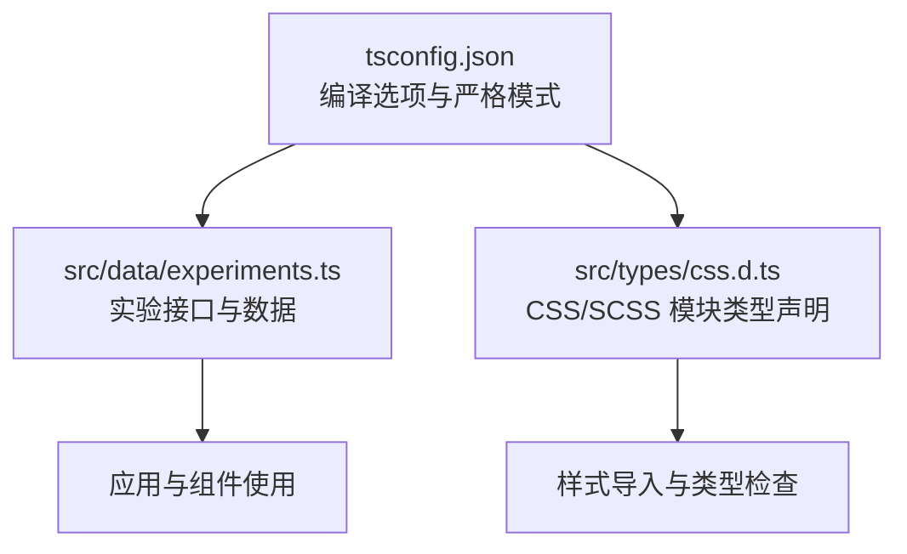
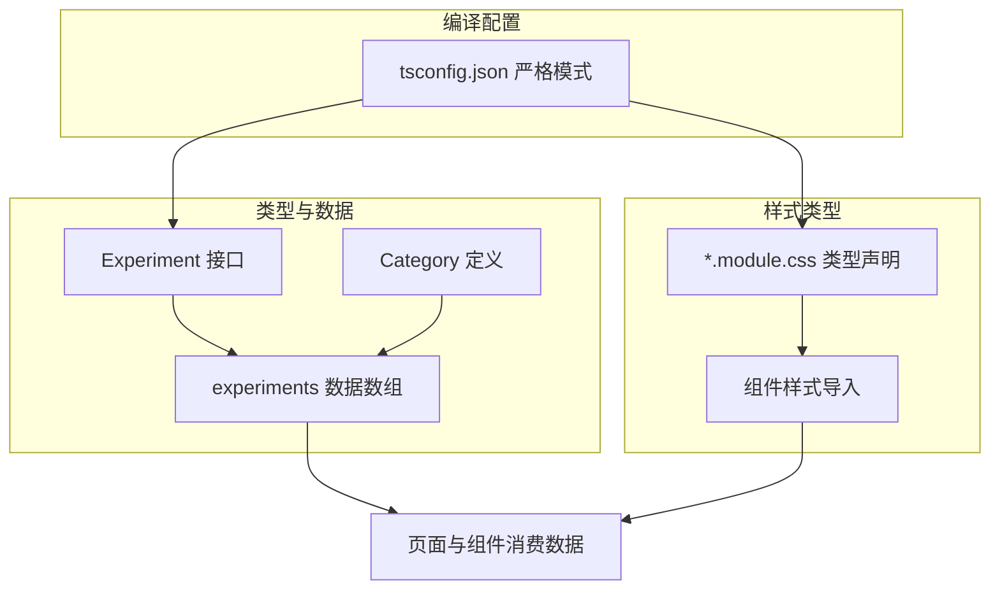
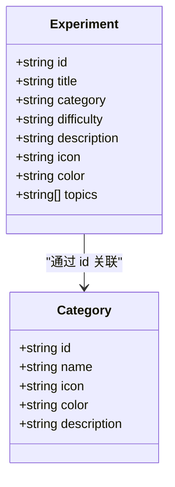
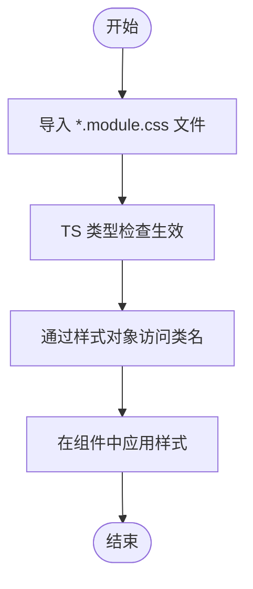
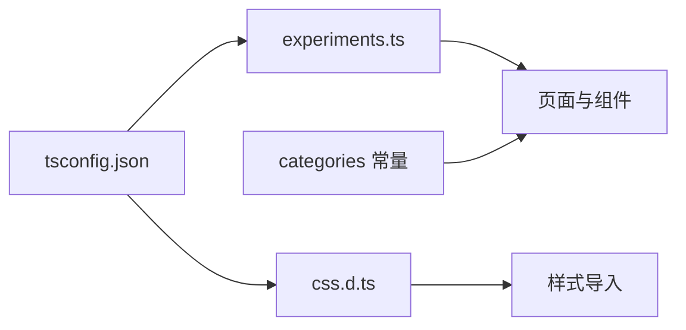

# 类型定义

<cite>
**本文引用的文件**
- [experiments.ts](file://src/data/experiments.ts)
- [css.d.ts](file://src/types/css.d.ts)
- [tsconfig.json](file://tsconfig.json)
</cite>

## 目录
1. [引言](#引言)
2. [项目结构](#项目结构)
3. [核心组件](#核心组件)
4. [架构总览](#架构总览)
5. [详细组件分析](#详细组件分析)
6. [依赖分析](#依赖分析)
7. [性能考虑](#性能考虑)
8. [故障排除指南](#故障排除指南)
9. [结论](#结论)
10. [附录](#附录)

## 引言
本文件系统性梳理 ScienceLab3D 项目中的 TypeScript 类型定义与使用方式，重点覆盖以下方面：
- 实验配置接口与实验数据结构（来自 experiments.ts）
- 场景状态与控制参数的类型化思路
- CSS 模块类型声明与样式类接口
- 类型使用示例与泛型接口说明
- 类型兼容性与版本变更注意事项
- 如何扩展与自定义类型定义以适配新实验或功能

本指南旨在帮助开发者在不深入源码细节的前提下，快速理解并正确使用项目中的类型体系。

## 项目结构
本项目的类型定义主要分布在三处：
- 数据层：实验配置与分类常量（src/data/experiments.ts）
- 样式层：CSS/SCSS 模块类型声明（src/types/css.d.ts）
- 编译器配置：tsconfig.json 中的严格模式与路径别名等设置

图示来源
- [experiments.ts:1-492](file://src/data/experiments.ts#L1-L492)
- [css.d.ts:1-30](file://src/types/css.d.ts#L1-L30)
- [tsconfig.json:1-22](file://tsconfig.json#L1-L22)

章节来源
- [experiments.ts:1-492](file://src/data/experiments.ts#L1-L492)
- [css.d.ts:1-30](file://src/types/css.d.ts#L1-L30)
- [tsconfig.json:1-22](file://tsconfig.json#L1-L22)

## 核心组件
本节聚焦于实验配置接口与实验数据结构，这些是项目类型系统的基础。

- 实验接口 Experiment
  - 字段说明
    - id: string（唯一标识符）
    - title: string（实验标题）
    - category: "physics" | "chemistry" | "biology" | "math"（学科分类）
    - difficulty: "Beginner" | "Intermediate" | "Advanced"（难度等级）
    - description: string（实验描述）
    - icon: string（图标符号）
    - color: string（主题色）
    - topics: string[]（关键词列表）
  - 使用场景
    - 列表页展示、详情页渲染、筛选与排序、路由参数匹配等
  - 复杂度与性能
    - 数组遍历与过滤的时间复杂度为 O(n)，其中 n 为实验总数
    - 建议对高频查询建立索引（如按分类/难度/主题）以提升性能

- 分类常量 categories
  - 结构：包含 id（字面量类型）、name、icon、color、description
  - 用途：用于侧边栏/分类导航、统计与筛选

- 实验数据数组 experiments
  - 类型：Experiment[]
  - 内容：按物理、化学、生物、数学四大类组织，每类约 10 个实验
  - 扩展建议：新增实验时遵循统一字段与主题标签规范

章节来源
- [experiments.ts:1-10](file://src/data/experiments.ts#L1-L10)
- [experiments.ts:12-460](file://src/data/experiments.ts#L12-L460)
- [experiments.ts:462-491](file://src/data/experiments.ts#L462-L491)

## 架构总览
下图展示了类型定义在项目中的角色与交互关系：

图示来源
- [experiments.ts:1-492](file://src/data/experiments.ts#L1-L492)
- [css.d.ts:1-30](file://src/types/css.d.ts#L1-L30)
- [tsconfig.json:1-22](file://tsconfig.json#L1-L22)

## 详细组件分析

### 实验接口与数据结构
- 设计要点
  - 使用字面量联合类型限定 category 与 difficulty，确保值域安全
  - topics 采用字符串数组，便于多维筛选与标签化
  - icon 与 color 提供 UI 层的语义化与一致性
- 典型使用流程
  - 列表渲染：从 experiments 中读取 Experiment[]，按分类分组显示
  - 详情加载：根据路由参数 id 匹配 experiments，渲染对应 Experiment
  - 筛选逻辑：基于 category/difficulty/topics 过滤数组
- 性能与可维护性
  - 对高频操作（如按主题聚合）建议缓存中间结果
  - 新增实验时保持字段完整性，避免运行期类型错误

图示来源
- [experiments.ts:1-10](file://src/data/experiments.ts#L1-L10)
- [experiments.ts:462-491](file://src/data/experiments.ts#L462-L491)

章节来源
- [experiments.ts:1-492](file://src/data/experiments.ts#L1-L492)

### CSS 模块类型声明与样式类接口
- *.module.css 类型声明
  - 导出类型：{ [key: string]: string }
  - 作用：确保在 TypeScript 中以键访问类名时具备类型提示与校验
- *.module.scss/sass 同理
  - 支持 SCSS/SASS 的模块化样式导入与类型推断
- 使用建议
  - 在组件中通过默认导出引入样式对象，使用方括号语法访问类名
  - 避免硬编码字符串类名，优先使用样式对象键值

图示来源
- [css.d.ts:1-30](file://src/types/css.d.ts#L1-L30)

章节来源
- [css.d.ts:1-30](file://src/types/css.d.ts#L1-L30)

### 类型使用示例与泛型接口说明
- 示例一：按分类筛选实验
  - 步骤
    - 从 experiments 中过滤 category === "physics"
    - 将结果映射为 { id, title, icon } 形式的轻量对象
  - 复杂度：O(n)
- 示例二：按难度聚合统计
  - 步骤
    - 对 experiments 按 difficulty 分组
    - 统计各难度下的实验数量
  - 复杂度：O(n)
- 泛型接口建议
  - 若需支持动态字段或可扩展元数据，可定义通用的键值对接口
  - 例如：Record<string, unknown> 或带约束的泛型类型，以满足不同场景的数据承载需求

章节来源
- [experiments.ts:12-460](file://src/data/experiments.ts#L12-L460)

### 场景状态类型与控制参数类型（设计建议）
- 场景状态类型
  - 建议抽象为枚举或联合类型，如：
    - SimulationStatus: "idle" | "running" | "paused" | "resetting"
    - ViewMode: "perspective" | "orthographic"
  - 控制参数类型
    - 可封装为 Record<string, number | string | boolean>
    - 或针对具体实验定义专用接口（如 PendulumParams、TitrationParams）
- 优势
  - 明确边界，减少运行时错误
  - 便于序列化/持久化与调试

[本小节为概念性设计说明，不直接分析具体文件，故无章节来源]

## 依赖分析
- 实验数据依赖
  - experiments.ts 作为单一事实来源，被页面与组件广泛依赖
  - categories 与 experiments 通过 id 关联，形成稳定的领域模型
- 样式依赖
  - css.d.ts 为所有 CSS/SCSS 模块提供类型支持，保障导入安全性
- 编译配置依赖
  - tsconfig.json 的 strict 选项开启严格类型检查，确保类型安全
  - paths 配置简化模块解析，提升开发体验

图示来源
- [experiments.ts:1-492](file://src/data/experiments.ts#L1-L492)
- [css.d.ts:1-30](file://src/types/css.d.ts#L1-L30)
- [tsconfig.json:1-22](file://tsconfig.json#L1-L22)

章节来源
- [experiments.ts:1-492](file://src/data/experiments.ts#L1-L492)
- [css.d.ts:1-30](file://src/types/css.d.ts#L1-L30)
- [tsconfig.json:1-22](file://tsconfig.json#L1-L22)

## 性能考虑
- 数据访问
  - experiments 为静态数组，读取为 O(1)，但过滤与聚合为 O(n)
  - 建议对高频查询进行缓存或预处理
- 样式导入
  - CSS 模块类型声明仅影响编译期类型检查，不影响运行时性能
- 编译性能
  - isolatedModules 与 bundler 解析有助于增量编译与热更新

[本节提供一般性指导，不直接分析具体文件，故无章节来源]

## 故障排除指南
- 类型错误：当修改 experiments.ts 中的字段后出现类型报错
  - 检查是否同步更新了消费该数据的组件或工具函数
  - 确认 tsconfig.json 的 strict 选项未导致过度严格
- 样式类名无效
  - 确保使用样式对象的键访问类名，而非硬编码字符串
  - 检查 CSS/SCSS 文件是否正确导出模块类名
- 编译失败
  - 检查 tsconfig.json 的 moduleResolution 与 bundler 设置
  - 确认路径别名 @/* 配置正确

章节来源
- [tsconfig.json:1-22](file://tsconfig.json#L1-L22)
- [css.d.ts:1-30](file://src/types/css.d.ts#L1-L30)

## 结论
本项目通过明确的接口定义与严格的编译配置，构建了清晰、可扩展的类型体系。实验数据结构简洁而完整，样式类型声明保证了导入的安全性。建议在后续扩展中：
- 保持字段一致性与主题标签规范
- 对高频查询建立缓存与索引
- 为特定实验定义专用控制参数接口
- 持续完善类型注释与文档，提升团队协作效率

[本节为总结性内容，不直接分析具体文件，故无章节来源]

## 附录

### 类型兼容性与版本变更
- 字面量联合类型
  - category 与 difficulty 使用字面量联合类型，新增值需要同时更新类型与数据
- 版本升级建议
  - 升级 TS 版本时，检查 strict 选项与模块解析策略
  - 引入新的样式格式（如 CSS-in-JS）时，补充对应的类型声明文件

章节来源
- [experiments.ts:1-10](file://src/data/experiments.ts#L1-L10)
- [tsconfig.json:1-22](file://tsconfig.json#L1-L22)

### 扩展与自定义类型定义
- 新增实验
  - 在 experiments.ts 中添加新的 Experiment 对象
  - 更新分类与难度的字面量联合类型（如有新增值）
- 自定义控制参数
  - 为特定实验定义专用接口，并在组件中使用
- 样式扩展
  - 在 css.d.ts 中补充新的样式模块类型声明
  - 在组件中通过默认导出使用样式对象

章节来源
- [experiments.ts:1-492](file://src/data/experiments.ts#L1-L492)
- [css.d.ts:1-30](file://src/types/css.d.ts#L1-L30)