# 组件API

<cite>
**本文档引用的文件**
- [ExperimentContainer.tsx](file://src/components/experiment-ui/ExperimentContainer.tsx)
- [ControlPanel.tsx](file://src/components/experiment-ui/ControlPanel.tsx)
- [DataPanel.tsx](file://src/components/experiment-ui/DataPanel.tsx)
- [SimulationController.tsx](file://src/components/experiment-ui/SimulationController.tsx)
- [FloatingControlPanel.tsx](file://src/components/experiment-ui/FloatingControlPanel.tsx)
- [ExperimentControls.tsx](file://src/components/experiment-ui/ExperimentControls.tsx)
- [index.ts](file://src/components/experiment-ui/index.ts)
- [acid-base-reactions-page.tsx](file://src/experiments/acid-base-reactions-page.tsx)
</cite>

## 目录
1. [简介](#简介)
2. [项目结构](#项目结构)
3. [核心组件](#核心组件)
4. [架构概览](#架构概览)
5. [详细组件分析](#详细组件分析)
6. [依赖关系分析](#依赖关系分析)
7. [性能考虑](#性能考虑)
8. [故障排除指南](#故障排除指南)
9. [结论](#结论)
10. [附录](#附录)

## 简介

ScienceLab3D是一个基于Web的3D科学学习平台，提供了40多个跨学科的交互式实验。本项目专注于实验UI组件的设计与实现，为用户提供沉浸式的3D科学实验体验。

该项目采用现代前端技术栈：
- Next.js 15 + React 19
- Three.js + React Three Fiber
- TypeScript
- Tailwind CSS
- Lucide React 图标库

## 项目结构

实验UI组件位于`src/components/experiment-ui/`目录下，采用模块化设计，每个组件都有明确的职责分工：

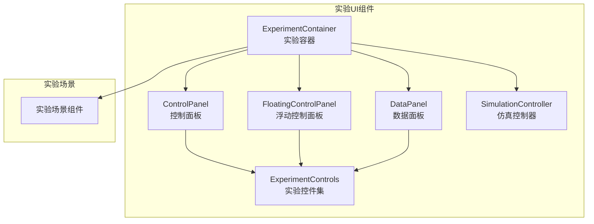

**图表来源**
- [ExperimentContainer.tsx:1-374](file://src/components/experiment-ui/ExperimentContainer.tsx#L1-L374)
- [ControlPanel.tsx:1-300](file://src/components/experiment-ui/ControlPanel.tsx#L1-L300)
- [FloatingControlPanel.tsx:1-195](file://src/components/experiment-ui/FloatingControlPanel.tsx#L1-L195)
- [DataPanel.tsx:1-219](file://src/components/experiment-ui/DataPanel.tsx#L1-L219)
- [SimulationController.tsx:1-228](file://src/components/experiment-ui/SimulationController.tsx#L1-L228)
- [ExperimentControls.tsx:1-498](file://src/components/experiment-ui/ExperimentControls.tsx#L1-L498)

**章节来源**
- [index.ts:1-43](file://src/components/experiment-ui/index.ts#L1-L43)

## 核心组件

### 实验容器 ExperimentContainer

ExperimentContainer是所有实验的核心容器组件，负责管理3D场景渲染、相机控制、光照系统以及UI布局。

**主要功能特性：**
- Three.js 3D场景渲染
- OrbitControls 相机控制
- 动态环境光照
- 响应式布局适配
- 浮动控制面板集成
- 数据面板管理
- 仿真控制条

**关键接口定义：**

```typescript
interface ExperimentContainerProps {
  children: ReactNode;
  title: string;
  description?: string;
  controls?: ReactNode;
  dataPanel?: ReactNode;
  details?: ReactNode;
  cameraPosition?: [number, number, number];
  enableFog?: boolean;
  backgroundColor?: string;
  simulationBar?: SimulationBarProps;
}

interface SimulationBarProps {
  isPlaying: boolean;
  onPlayPause: () => void;
  onReset: () => void;
  speed: number;
  onSpeedChange: (speed: number) => void;
}
```

**默认配置：**
- cameraPosition: [10, 7, 10]
- enableFog: true
- backgroundColor: "#0a0a1e"
- 设备检测自动调整渲染参数

### 控制面板 ControlPanel

ControlPanel是一个可拖拽的浮动控制面板，提供实验参数调节功能。

**核心特性：**
- 桌面端鼠标拖拽支持
- 移动端触摸拖拽支持
- 自动折叠功能（移动端）
- 响应式位置管理
- 性能优化的拖拽处理

**接口定义：**

```typescript
interface ControlPanelProps {
  children?: ReactNode;
  onPlayPause?: (isPlaying: boolean) => void;
  onReset?: () => void;
  onSpeedChange?: (speed: number) => void;
  defaultSpeed?: number;
  defaultPlaying?: boolean;
  showPlayPause?: boolean;
  showReset?: boolean;
  showSpeed?: boolean;
  title?: string;
  initialPosition?: { x: number; y: number };
}
```

**默认行为：**
- defaultSpeed: 1
- defaultPlaying: true
- 显示所有控制按钮
- 移动端初始位置: {x: 10, y: 70}

### 数据面板 DataPanel

DataPanel专门用于显示实时数据信息，支持隐藏模式和拖拽移动。

**设计特点：**
- 小型切换按钮（隐藏时）
- 完整内容面板（显示时）
- 可折叠内容区域
- 触摸友好的交互设计
- 视口边界约束

**接口定义：**

```typescript
interface DataPanelProps {
  children: ReactNode;
  isVisible?: boolean;
  onToggle?: () => void;
  initialPosition?: { x: number; y: number };
  defaultCollapsed?: boolean;
}
```

**可见性管理：**
- 支持受控和非受控两种模式
- 隐藏状态下仅显示最小化的切换按钮
- 移动端默认位置优化

### 仿真控制器 SimulationController

SimulationController提供始终可见的仿真控制界面，包含播放/暂停、重置、速度控制和时间显示功能。

**核心功能：**
- 始终可见的紧凑设计
- 时间显示格式化
- 拖拽移动支持
- 视口边界约束
- 性能优化的渲染

**接口定义：**

```typescript
interface SimulationControllerProps {
  isPlaying: boolean;
  onPlayPause: () => void;
  onReset: () => void;
  speed: number;
  onSpeedChange: (speed: number) => void;
  timeElapsed?: number;
  initialPosition?: { x: number; y: number };
}
```

**时间格式化：** MM:SS.MS 格式显示

### 浮动控制面板 FloatingControlPanel

FloatingControlPanel是专门用于参数控制的浮动面板，支持折叠和拖拽。

**设计目标：**
- 参数控制专用界面
- 自动折叠（移动端）
- 拖拽移动支持
- 性能优化
- 视口边界约束

**接口定义：**

```typescript
interface FloatingControlPanelProps {
  children?: ReactNode;
  title?: string;
  initialPosition?: { x: number; y: number };
  defaultCollapsed?: boolean;
}
```

**自动折叠：** 移动端10秒无活动自动折叠

## 架构概览

ScienceLab3D的组件架构采用分层设计，确保高内聚低耦合：

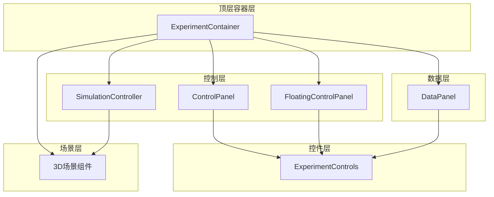

**图表来源**
- [ExperimentContainer.tsx:55-371](file://src/components/experiment-ui/ExperimentContainer.tsx#L55-L371)
- [ControlPanel.tsx:29-297](file://src/components/experiment-ui/ControlPanel.tsx#L29-L297)
- [FloatingControlPanel.tsx:21-191](file://src/components/experiment-ui/FloatingControlPanel.tsx#L21-L191)
- [DataPanel.tsx:23-215](file://src/components/experiment-ui/DataPanel.tsx#L23-L215)
- [SimulationController.tsx:27-224](file://src/components/experiment-ui/SimulationController.tsx#L27-L224)

## 详细组件分析

### ExperimentContainer 组件分析

ExperimentContainer是整个实验系统的中枢，负责协调所有子组件的工作。

#### 类图设计

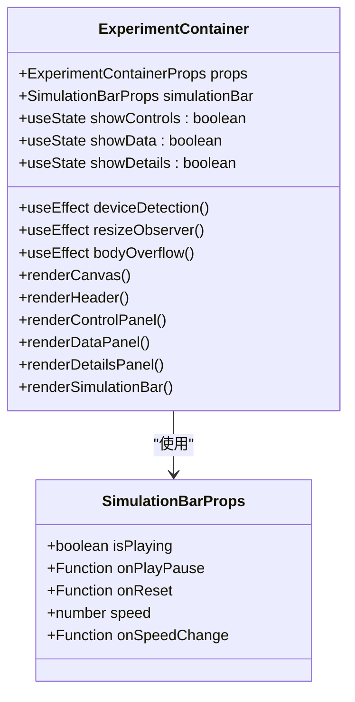

**图表来源**
- [ExperimentContainer.tsx:42-53](file://src/components/experiment-ui/ExperimentContainer.tsx#L42-L53)
- [ExperimentContainer.tsx:34-40](file://src/components/experiment-ui/ExperimentContainer.tsx#L34-L40)

#### 生命周期管理

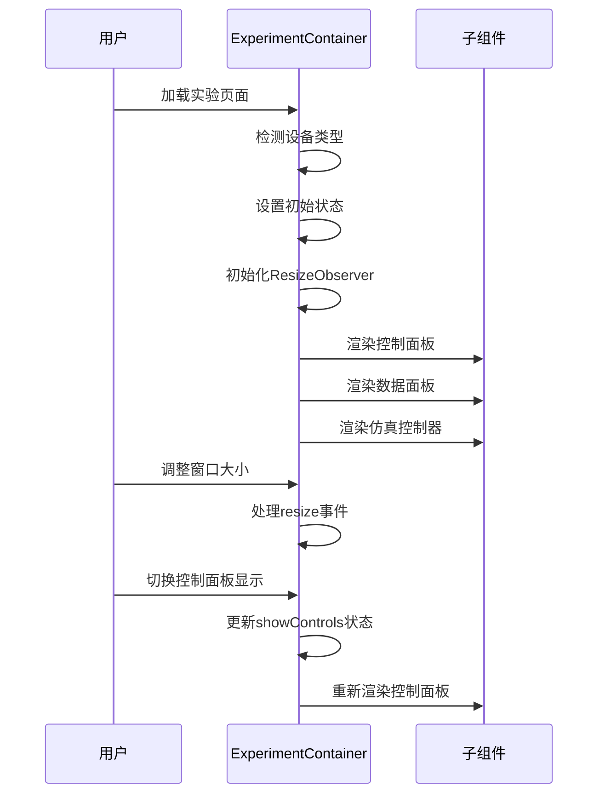

**图表来源**
- [ExperimentContainer.tsx:78-133](file://src/components/experiment-ui/ExperimentContainer.tsx#L78-L133)
- [ExperimentContainer.tsx:268-320](file://src/components/experiment-ui/ExperimentContainer.tsx#L268-L320)

**章节来源**
- [ExperimentContainer.tsx:55-371](file://src/components/experiment-ui/ExperimentContainer.tsx#L55-L371)

### ControlPanel 组件分析

ControlPanel实现了复杂的拖拽和响应式交互逻辑。

#### 拖拽流程图

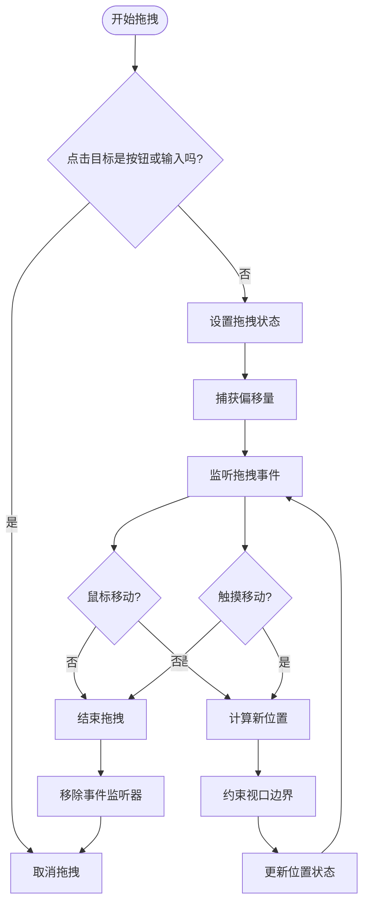

**图表来源**
- [ControlPanel.tsx:113-182](file://src/components/experiment-ui/ControlPanel.tsx#L113-L182)

#### 状态管理模式

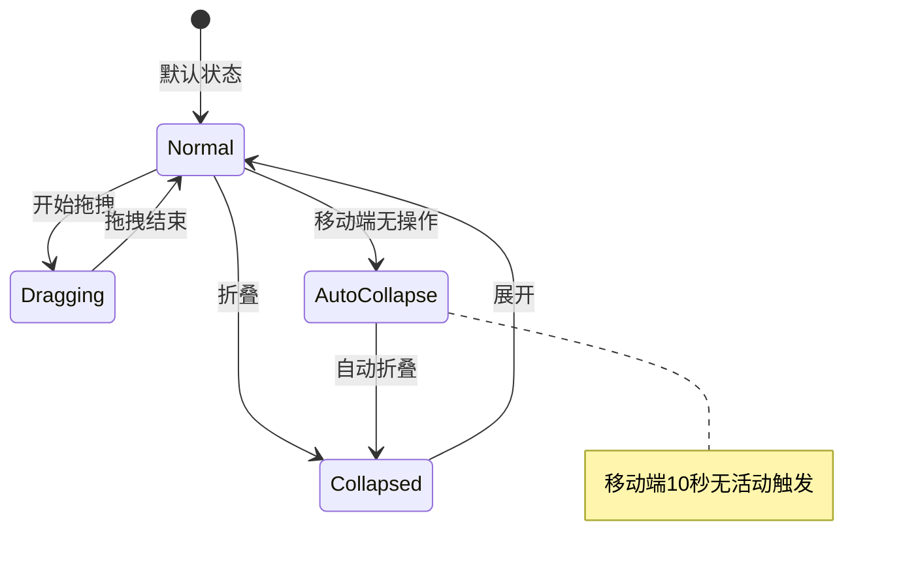

**图表来源**
- [ControlPanel.tsx:44-94](file://src/components/experiment-ui/ControlPanel.tsx#L44-L94)

**章节来源**
- [ControlPanel.tsx:29-297](file://src/components/experiment-ui/ControlPanel.tsx#L29-L297)

### DataPanel 组件分析

DataPanel采用了独特的隐藏-显示模式设计。

#### 隐藏显示流程

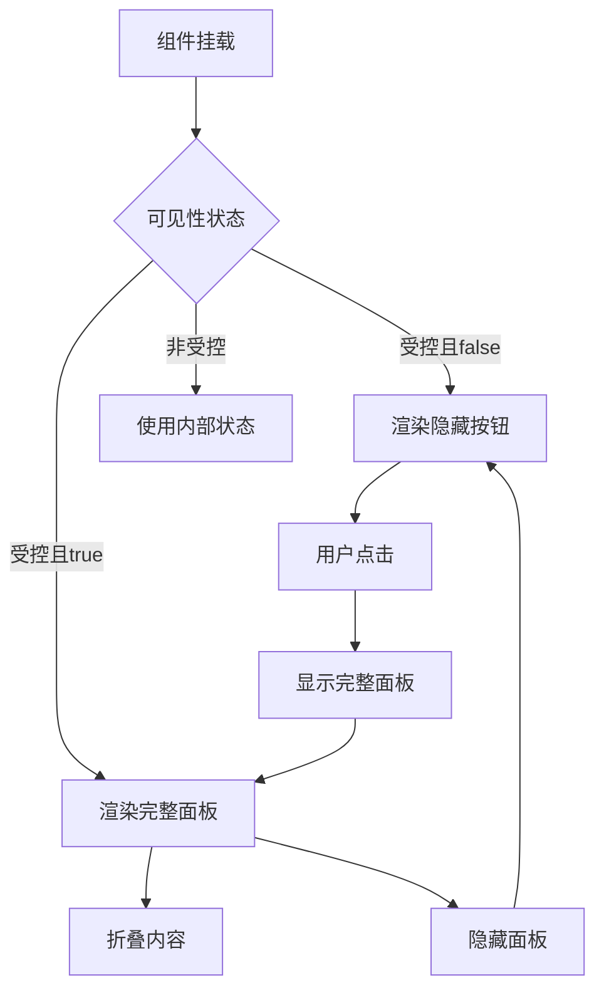

**图表来源**
- [DataPanel.tsx:66-73](file://src/components/experiment-ui/DataPanel.tsx#L66-L73)

**章节来源**
- [DataPanel.tsx:23-215](file://src/components/experiment-ui/DataPanel.tsx#L23-L215)

### SimulationController 组件分析

SimulationController提供了紧凑而完整的仿真控制界面。

#### 时间格式化算法

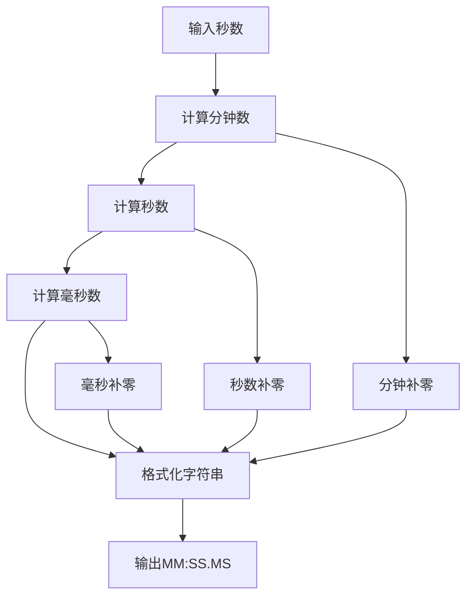

**图表来源**
- [SimulationController.tsx:67-73](file://src/components/experiment-ui/SimulationController.tsx#L67-L73)

**章节来源**
- [SimulationController.tsx:27-224](file://src/components/experiment-ui/SimulationController.tsx#L27-L224)

### FloatingControlPanel 组件分析

FloatingControlPanel专注于参数控制的灵活性。

#### 自动折叠机制

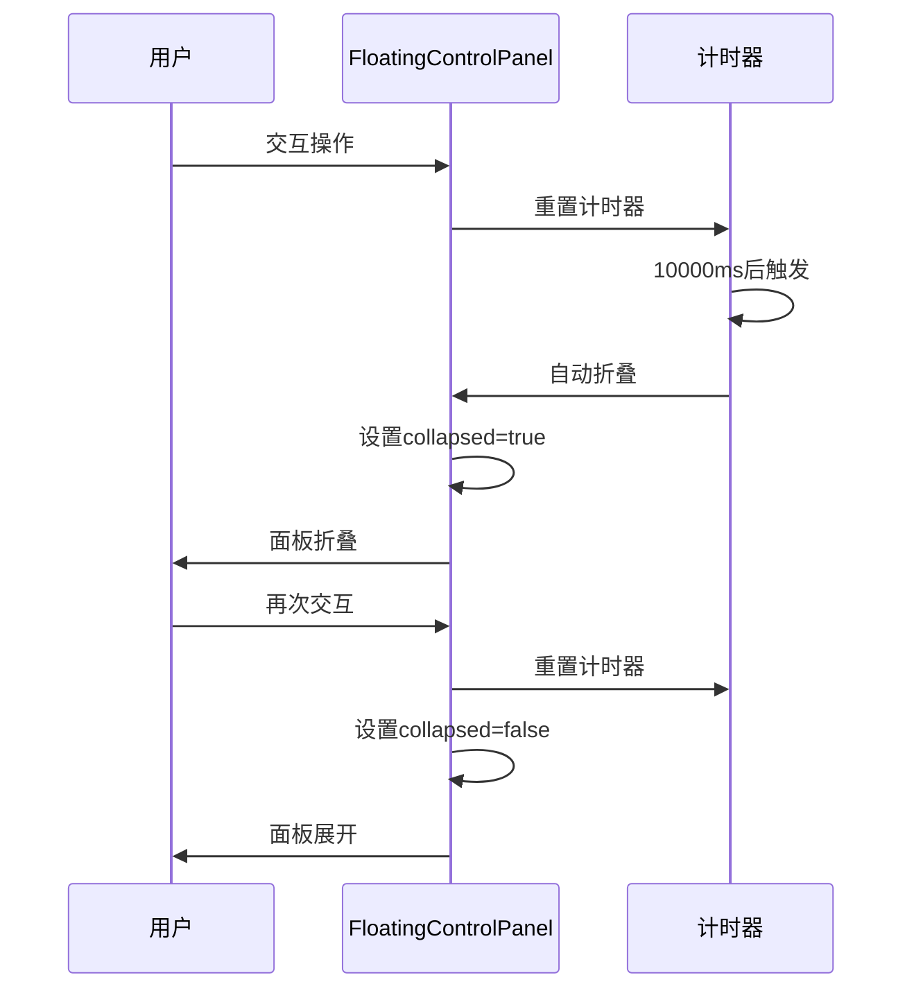

**图表来源**
- [FloatingControlPanel.tsx:59-79](file://src/components/experiment-ui/FloatingControlPanel.tsx#L59-L79)

**章节来源**
- [FloatingControlPanel.tsx:21-191](file://src/components/experiment-ui/FloatingControlPanel.tsx#L21-L191)

### ExperimentControls 组件分析

ExperimentControls提供了丰富的UI控件集合。

#### 控件类型分类

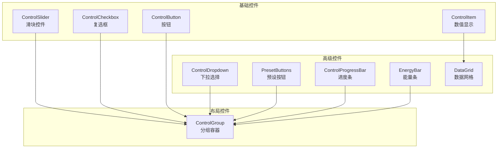

**图表来源**
- [ExperimentControls.tsx:5-498](file://src/components/experiment-ui/ExperimentControls.tsx#L5-L498)

**章节来源**
- [ExperimentControls.tsx:1-498](file://src/components/experiment-ui/ExperimentControls.tsx#L1-L498)

## 依赖关系分析

组件间依赖关系清晰，遵循单一职责原则：

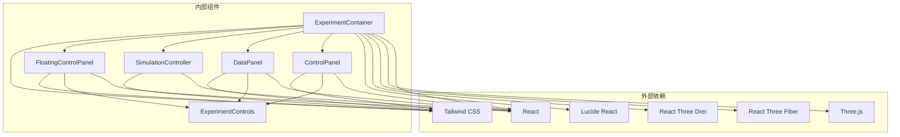

**图表来源**
- [ExperimentContainer.tsx:3-8](file://src/components/experiment-ui/ExperimentContainer.tsx#L3-L8)
- [ControlPanel.tsx:3](file://src/components/experiment-ui/ControlPanel.tsx#L3)
- [DataPanel.tsx:3](file://src/components/experiment-ui/DataPanel.tsx#L3)
- [SimulationController.tsx:3](file://src/components/experiment-ui/SimulationController.tsx#L3)
- [FloatingControlPanel.tsx:3](file://src/components/experiment-ui/FloatingControlPanel.tsx#L3)
- [ExperimentControls.tsx:3](file://src/components/experiment-ui/ExperimentControls.tsx#L3)

**章节来源**
- [index.ts:1-43](file://src/components/experiment-ui/index.ts#L1-L43)

## 性能考虑

### 渲染优化策略

1. **设备检测优化**
   - 移动端降低抗锯齿质量
   - 动态DPR设置
   - 触摸优化的相机控制

2. **内存管理**
   - ResizeObserver自动清理
   - 事件监听器及时移除
   - 拖拽状态的精确控制

3. **渲染性能**
   - 条件渲染减少DOM节点
   - useCallback优化函数引用
   - 状态分离避免不必要的重渲染

### 移动端适配

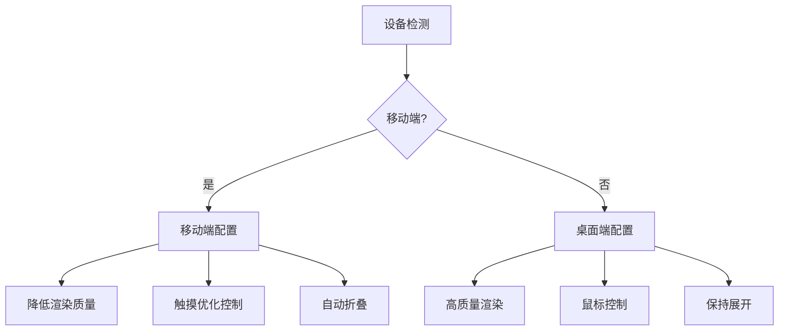

**图表来源**
- [ExperimentContainer.tsx:78-97](file://src/components/experiment-ui/ExperimentContainer.tsx#L78-L97)
- [ControlPanel.tsx:60-72](file://src/components/experiment-ui/ControlPanel.tsx#L60-L72)

## 故障排除指南

### 常见问题及解决方案

1. **3D场景不显示**
   - 检查浏览器兼容性和WebGL支持
   - 确认Three.js和React Three Fiber版本匹配
   - 验证CanvasResizeHandler正确初始化

2. **拖拽功能异常**
   - 确保事件监听器正确绑定和移除
   - 检查z-index层级冲突
   - 验证视口边界计算逻辑

3. **移动端触摸问题**
   - 确认passive事件选项正确配置
   - 检查触摸事件和鼠标事件的优先级
   - 验证自动折叠定时器的清理

4. **状态同步问题**
   - 使用useCallback优化回调函数
   - 确保受控组件的props正确传递
   - 检查状态更新的时机和顺序

**章节来源**
- [ExperimentContainer.tsx:100-115](file://src/components/experiment-ui/ExperimentContainer.tsx#L100-L115)
- [ControlPanel.tsx:135-182](file://src/components/experiment-ui/ControlPanel.tsx#L135-L182)
- [DataPanel.tsx:97-144](file://src/components/experiment-ui/DataPanel.tsx#L97-L144)

## 结论

ScienceLab3D的实验UI组件系统展现了优秀的前端架构设计：

1. **模块化设计**：每个组件职责明确，便于维护和扩展
2. **响应式支持**：全面覆盖桌面、平板和移动端
3. **性能优化**：采用多种优化策略确保流畅体验
4. **用户体验**：直观的交互设计和良好的可用性

这些组件为构建复杂的3D科学实验应用提供了坚实的基础，开发者可以基于此框架快速开发新的实验内容。

## 附录

### 组件使用示例

以下是一个完整的实验页面使用示例：

```typescript
// 实验页面组件使用
<ExperimentContainer
  title="酸碱中和反应"
  description="观察HCl与NaOH的中和反应过程"
  cameraPosition={[0, 2, 10]}
  backgroundColor="#050510"
>
  <AcidBaseReactionsSceneComponent
    onDataChange={handleDataChange}
    acidConcentration={acidConcentration}
    baseConcentration={baseConcentration}
    acidType={acidType}
    isPlaying={isPlaying}
    stepMode={stepMode}
    currentStep={currentStep}
  />
</ExperimentContainer>

<SimulationController
  isPlaying={isPlaying}
  onPlayPause={handlePlayPause}
  onReset={handleReset}
  speed={simulationSpeed}
  onSpeedChange={handleSpeedChange}
/>

<FloatingControlPanel
  title="反应参数"
  initialPosition={{ x: 20, y: 80 }}
>
  {parameterControls}
</FloatingControlPanel>

<DataPanel
  isVisible={showDataPanel}
  onToggle={() => setShowDataPanel(!showDataPanel)}
>
  {dataPanelContent}
</DataPanel>
```

### 最佳实践建议

1. **组件组合**：合理组合使用各组件，避免过度嵌套
2. **状态管理**：使用受控组件模式，确保状态一致性
3. **性能监控**：定期检查渲染性能，优化大型场景
4. **错误处理**：添加适当的错误边界和降级方案
5. **可访问性**：确保组件对屏幕阅读器友好
6. **国际化**：考虑多语言支持的需求