# 化学类实验

<cite>
**本文档引用的文件**
- [README.md](file://README.md)
- [experiments.ts](file://src/data/experiments.ts)
- [layout.tsx](file://src/app/layout.tsx)
- [page.tsx](file://src/app/page.tsx)
- [acid-base-reactions-page.tsx](file://src/experiments/acid-base-reactions-page.tsx)
- [acid-base-reactions-scene.tsx](file://src/experiments/acid-base-reactions-scene.tsx)
- [chemical-bonding-page.tsx](file://src/experiments/chemical-bonding-page.tsx)
- [chemical-bonding-scene.tsx](file://src/experiments/chemical-bonding-scene.tsx)
- [diffusion-page.tsx](file://src/experiments/diffusion-page.tsx)
- [diffusion-scene.tsx](file://src/experiments/diffusion-scene.tsx)
- [titration-page.tsx](file://src/experiments/titration-page.tsx)
- [titration-scene.tsx](file://src/experiments/titration-scene.tsx)
- [gas-laws-page.tsx](file://src/experiments/gas-laws-page.tsx)
- [gas-laws-scene.tsx](file://src/experiments/gas-laws-scene.tsx)
- [thermochemistry-page.tsx](file://src/experiments/thermochemistry-page.tsx)
- [thermochemistry-scene.tsx](file://src/experiments/thermochemistry-scene.tsx)
</cite>

## 目录
1. [项目简介](#项目简介)
2. [项目结构](#项目结构)
3. [核心组件](#核心组件)
4. [架构概览](#架构概览)
5. [详细组件分析](#详细组件分析)
6. [依赖关系分析](#依赖关系分析)
7. [性能考虑](#性能考虑)
8. [故障排除指南](#故障排除指南)
9. [结论](#结论)
10. [附录](#附录)

## 项目简介

ScienceLab 3D 是一个交互式3D科学学习平台，提供40多个跨学科的虚拟实验，涵盖物理、化学、生物和数学领域。该项目采用现代Web技术栈，使用Next.js 15、React 19、TypeScript、Three.js和React Three Fiber构建，为学生和教育工作者提供沉浸式的科学学习体验。

该项目的核心特色包括：
- **40+ 交互式实验**：涵盖物理、化学、生物和数学四大科学领域
- **实时控制**：可调整变量并即时看到视觉反馈
- **3D可视化**：基于Three.js的强大3D图形渲染
- **响应式设计**：支持桌面、平板和移动设备
- **开源免费**：完全免费且开源的教育资源

## 项目结构

项目采用模块化的文件组织结构，按照功能和领域进行分类：

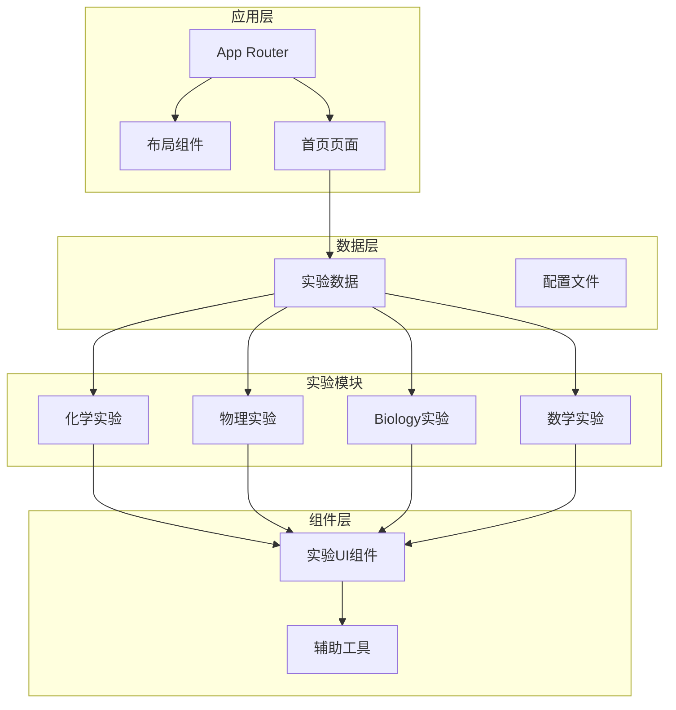

**图表来源**
- [layout.tsx:1-204](file://src/app/layout.tsx#L1-L204)
- [page.tsx:1-676](file://src/app/page.tsx#L1-L676)
- [experiments.ts:1-492](file://src/data/experiments.ts#L1-L492)

**章节来源**
- [README.md:1-227](file://README.md#L1-L227)
- [experiments.ts:1-492](file://src/data/experiments.ts#L1-L492)

## 核心组件

### 实验容器系统

项目实现了统一的实验容器架构，所有实验都遵循相同的设计模式：

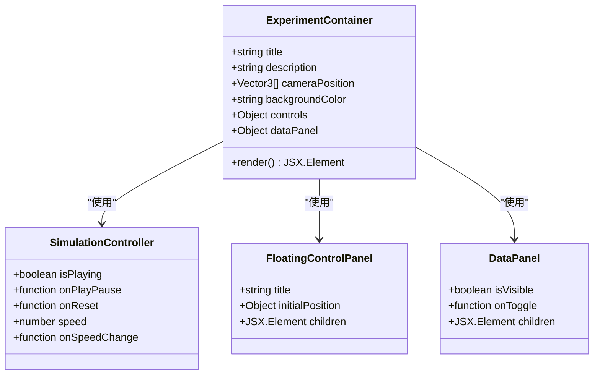

**图表来源**
- [acid-base-reactions-page.tsx:184-226](file://src/experiments/acid-base-reactions-page.tsx#L184-L226)
- [chemical-bonding-page.tsx:235-278](file://src/experiments/chemical-bonding-page.tsx#L235-L278)

### 实验数据管理

每个实验都实现了标准化的数据接口，确保一致的用户体验：

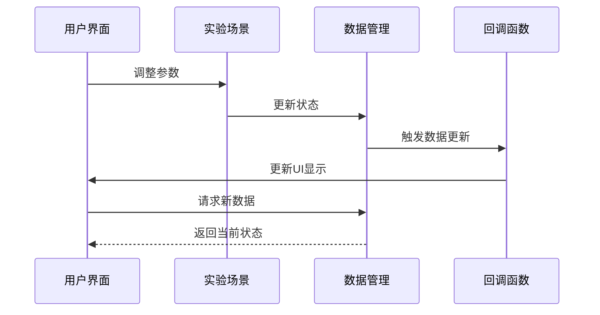

**图表来源**
- [acid-base-reactions-scene.tsx:262-271](file://src/experiments/acid-base-reactions-scene.tsx#L262-L271)
- [diffusion-scene.tsx:241-243](file://src/experiments/diffusion-scene.tsx#L241-L243)

**章节来源**
- [acid-base-reactions-page.tsx:1-229](file://src/experiments/acid-base-reactions-page.tsx#L1-L229)
- [chemical-bonding-page.tsx:1-281](file://src/experiments/chemical-bonding-page.tsx#L1-L281)

## 架构概览

项目采用分层架构设计，确保代码的可维护性和扩展性：

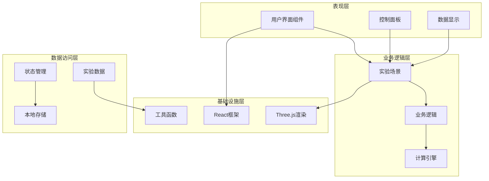

**图表来源**
- [layout.tsx:1-204](file://src/app/layout.tsx#L1-L204)
- [page.tsx:305-375](file://src/app/page.tsx#L305-L375)

## 详细组件分析

### 酸碱中和反应实验

酸碱中和反应实验提供了分子层面的模拟，展示了H⁺和OH⁻离子的结合过程以及pH值变化。

#### 分子模拟架构

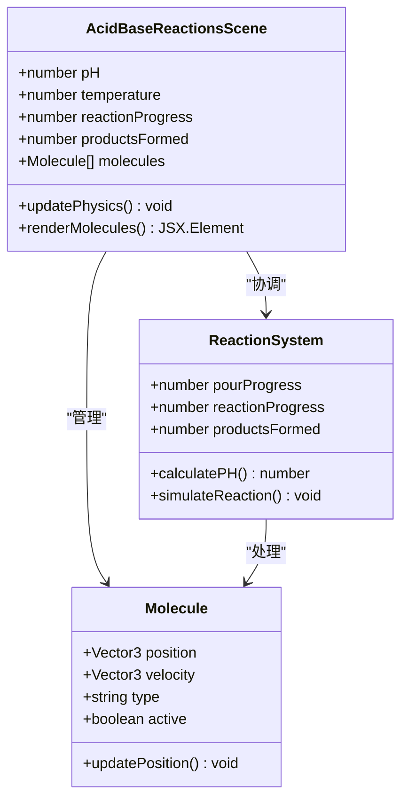

**图表来源**
- [acid-base-reactions-scene.tsx:26-71](file://src/experiments/acid-base-reactions-scene.tsx#L26-L71)
- [acid-base-reactions-scene.tsx:54-63](file://src/experiments/acid-base-reactions-scene.tsx#L54-L63)

#### 反应机制流程

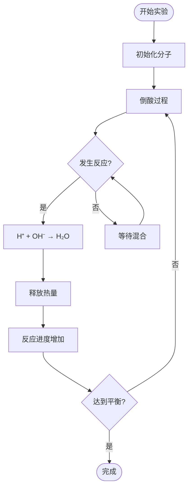

**图表来源**
- [acid-base-reactions-scene.tsx:169-195](file://src/experiments/acid-base-reactions-scene.tsx#L169-L195)
- [acid-base-reactions-scene.tsx:231-251](file://src/experiments/acid-base-reactions-scene.tsx#L231-L251)

**章节来源**
- [acid-base-reactions-page.tsx:1-229](file://src/experiments/acid-base-reactions-page.tsx#L1-L229)
- [acid-base-reactions-scene.tsx:1-513](file://src/experiments/acid-base-reactions-scene.tsx#L1-L513)

### 化学键形成实验

化学键形成实验通过原子模型和电子云分布展示化学键的形成过程。

#### 原子模型架构

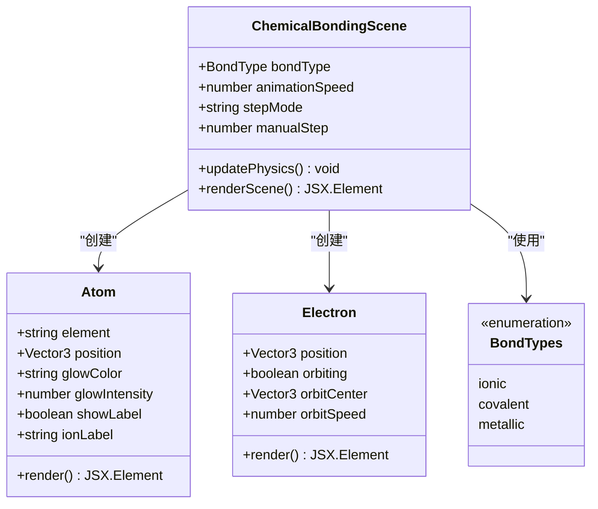

**图表来源**
- [chemical-bonding-scene.tsx:142-198](file://src/experiments/chemical-bonding-scene.tsx#L142-L198)
- [chemical-bonding-scene.tsx:204-233](file://src/experiments/chemical-bonding-scene.tsx#L204-L233)

#### 键类型对比

| 键类型 | 电子行为 | 物理性质 | 典型例子 |
|--------|----------|----------|----------|
| 离子键 | 电子完全转移 | 高熔点、导电 | NaCl |
| 共价键 | 电子共享 | 低熔点、不导电 | H₂O |
| 金属键 | 电子海模型 | 导电、延展性 | Fe |

**章节来源**
- [chemical-bonding-page.tsx:1-281](file://src/experiments/chemical-bonding-page.tsx#L1-L281)
- [chemical-bonding-scene.tsx:1-800](file://src/experiments/chemical-bonding-scene.tsx#L1-L800)

### 扩散现象实验

扩散实验模拟分子运动和浓度梯度分析，展示分子从高浓度向低浓度的自然扩散过程。

#### 扩散动力学模型

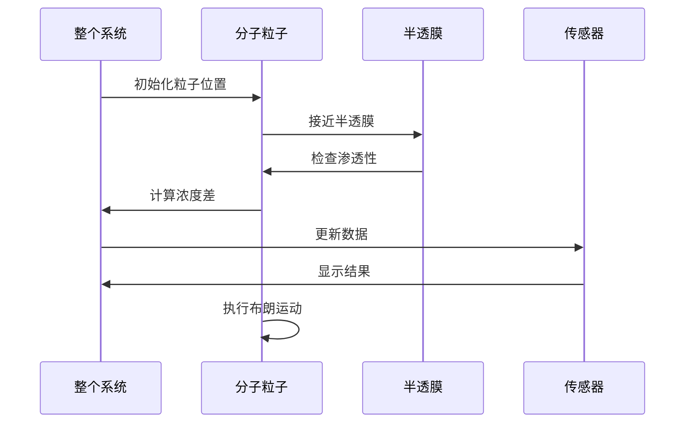

**图表来源**
- [diffusion-scene.tsx:150-244](file://src/experiments/diffusion-scene.tsx#L150-L244)

#### 浓度梯度分析

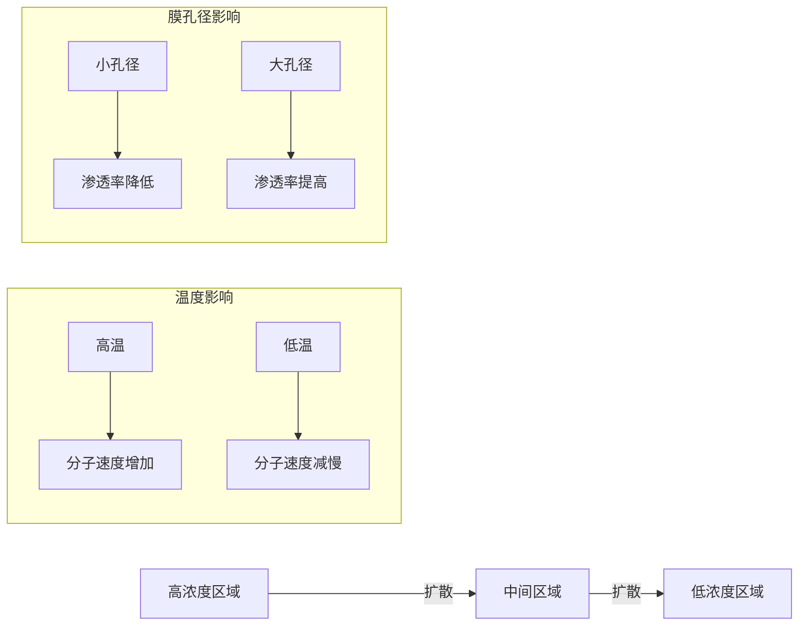

**图表来源**
- [diffusion-scene.tsx:155-196](file://src/experiments/diffusion-scene.tsx#L155-L196)

**章节来源**
- [diffusion-page.tsx:1-175](file://src/experiments/diffusion-page.tsx#L1-L175)
- [diffusion-scene.tsx:1-509](file://src/experiments/diffusion-scene.tsx#L1-L509)

### 滴定分析实验

滴定实验模拟酸碱滴定过程，展示终点判断和指示剂颜色变化。

#### 滴定曲线分析

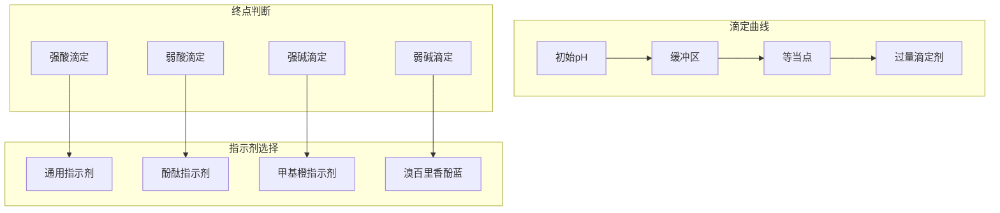

**图表来源**
- [titration-scene.tsx:108-123](file://src/experiments/titration-scene.tsx#L108-L123)
- [titration-scene.tsx:140-162](file://src/experiments/titration-scene.tsx#L140-L162)

#### 滴定过程控制

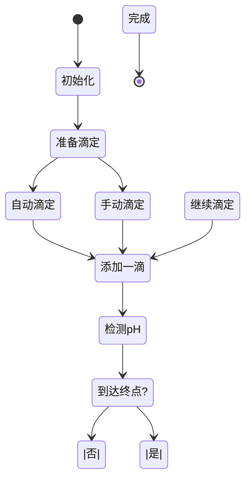

**图表来源**
- [titration-page.tsx:35-42](file://src/experiments/titration-page.tsx#L35-L42)

**章节来源**
- [titration-page.tsx:1-374](file://src/experiments/titration-page.tsx#L1-L374)
- [titration-scene.tsx:1-703](file://src/experiments/titration-scene.tsx#L1-L703)

### 理想气体定律实验

理想气体定律实验通过粒子模拟展示PV=nRT的关系。

#### 气体粒子模拟

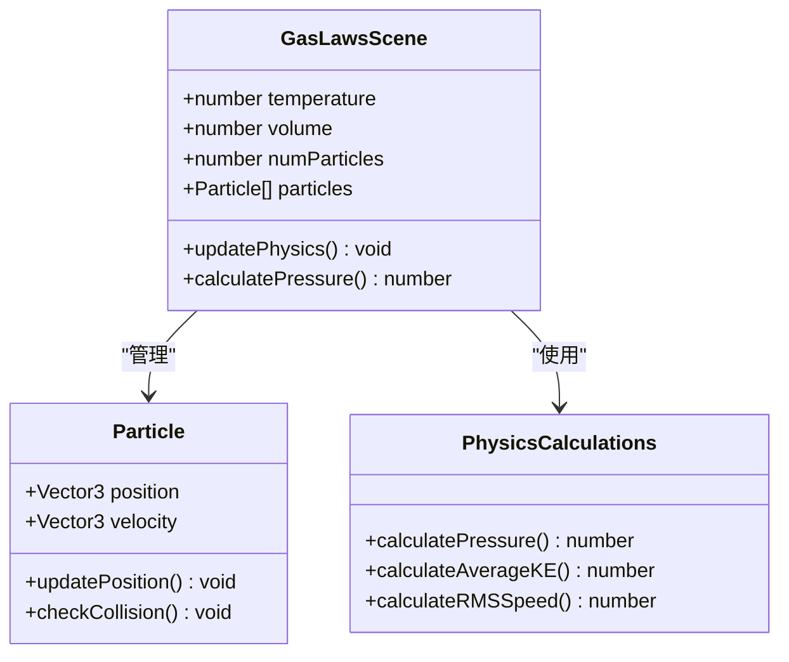

**图表来源**
- [gas-laws-scene.tsx:25-48](file://src/experiments/gas-laws-scene.tsx#L25-L48)
- [gas-laws-scene.tsx:93-183](file://src/experiments/gas-laws-scene.tsx#L93-L183)

#### 状态方程演示

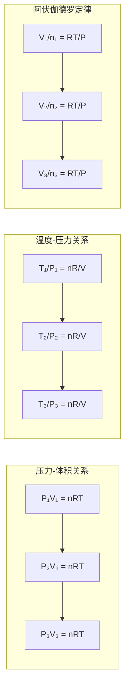

**图表来源**
- [gas-laws-scene.tsx:186-203](file://src/experiments/gas-laws-scene.tsx#L186-L203)

**章节来源**
- [gas-laws-page.tsx:1-156](file://src/experiments/gas-laws-page.tsx#L1-L156)
- [gas-laws-scene.tsx:1-395](file://src/experiments/gas-laws-scene.tsx#L1-L395)

### 热化学反应实验

热化学反应实验比较放热反应和吸热反应的能量变化。

#### 能量变化可视化

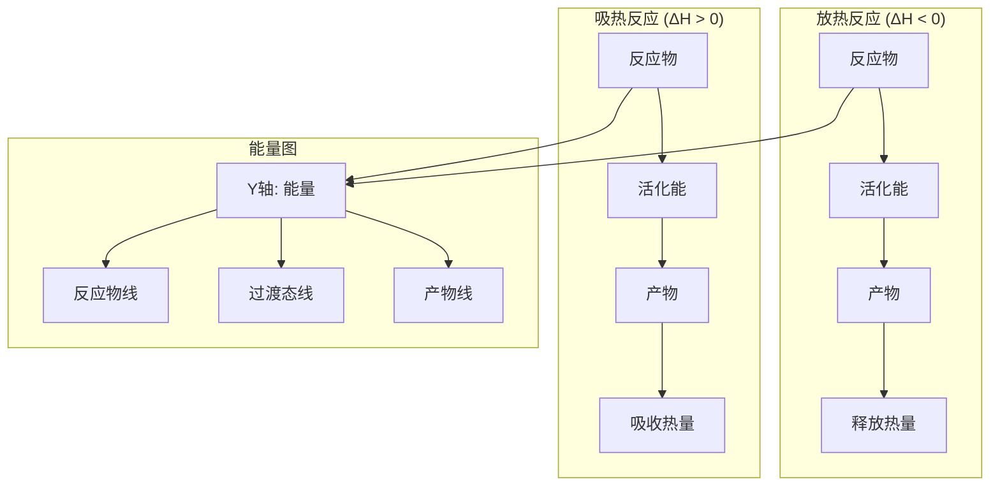

**图表来源**
- [thermochemistry-scene.tsx:104-134](file://src/experiments/thermochemistry-scene.tsx#L104-L134)

#### 温度与反应速率关系

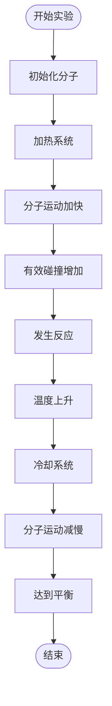

**图表来源**
- [thermochemistry-scene.tsx:136-245](file://src/experiments/thermochemistry-scene.tsx#L136-L245)

**章节来源**
- [thermochemistry-page.tsx:1-244](file://src/experiments/thermochemistry-page.tsx#L1-L244)
- [thermochemistry-scene.tsx:1-586](file://src/experiments/thermochemistry-scene.tsx#L1-L586)

## 依赖关系分析

项目采用模块化设计，各组件之间有清晰的依赖关系：

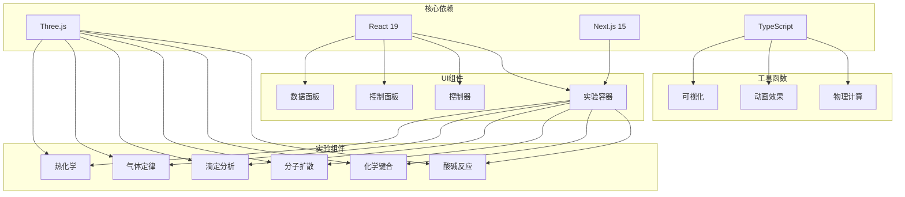

**图表来源**
- [layout.tsx:138-150](file://src/app/layout.tsx#L138-L150)
- [acid-base-reactions-scene.tsx:1-10](file://src/experiments/acid-base-reactions-scene.tsx#L1-L10)

**章节来源**
- [README.md:138-150](file://README.md#L138-L150)

## 性能考虑

### 渲染优化策略

项目采用了多种性能优化技术来确保流畅的3D渲染体验：

1. **实例化网格 (InstancedMesh)**：大量相似对象使用单一几何体实例化，减少内存占用
2. **帧率控制**：限制每帧更新频率，避免过度计算
3. **条件渲染**：仅在需要时更新复杂的3D对象
4. **颜色属性缓存**：避免重复的颜色计算和属性设置

### 内存管理

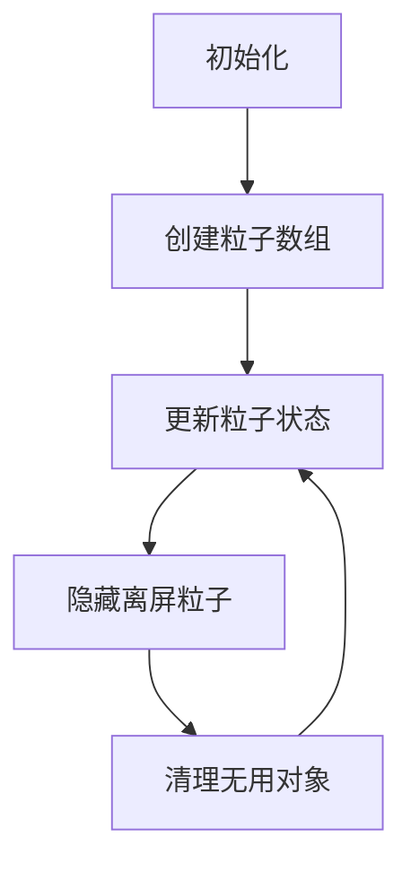

**图表来源**
- [gas-laws-scene.tsx:135-141](file://src/experiments/gas-laws-scene.tsx#L135-L141)

## 故障排除指南

### 常见问题及解决方案

#### 实验无法启动
1. **检查浏览器兼容性**：确保使用支持WebGL的现代浏览器
2. **验证JavaScript启用**：确认浏览器已启用JavaScript
3. **网络连接**：确保稳定的互联网连接以加载3D资源

#### 性能问题
1. **降低图形质量**：在实验设置中调整渲染质量
2. **关闭其他标签页**：释放系统资源
3. **重启浏览器**：清除缓存和临时文件

#### 数据显示异常
1. **刷新页面**：重新加载实验场景
2. **检查控制台**：查看是否有JavaScript错误
3. **重置实验**：使用重置按钮恢复默认状态

**章节来源**
- [page.tsx:312-321](file://src/app/page.tsx#L312-L321)

## 结论

ScienceLab 3D项目成功地将复杂的科学概念通过交互式3D可视化呈现给学习者。通过精心设计的实验架构和丰富的教学内容，该项目为化学教育提供了创新的解决方案。

### 主要成就

1. **教育价值**：40个精心设计的实验覆盖了主要的科学领域
2. **技术创新**：采用最新的Web技术栈实现高质量的3D可视化
3. **用户体验**：直观的界面设计和实时反馈机制
4. **开放性**：完全开源免费，促进教育资源的共享

### 未来发展方向

1. **扩展实验库**：持续添加新的实验内容
2. **增强交互性**：开发更丰富的用户交互功能
3. **多语言支持**：扩大国际化覆盖范围
4. **移动端优化**：提升移动设备上的使用体验

该项目为现代科学教育提供了一个优秀的范例，展示了如何利用技术手段提升教学质量和学习体验。

## 附录

### 实验分类概览

项目包含以下化学实验类别：

| 实验类别 | 数量 | 难度等级 | 主要概念 |
|----------|------|----------|----------|
| 原子结构 | 1 | 初级 | 原子组成、电子壳层 |
| 化学键合 | 1 | 中级 | 离子键、共价键、金属键 |
| 电解质 | 1 | 中级 | 导电性、离子迁移 |
| 酸碱滴定 | 1 | 中级 | 滴定分析、终点判断 |
| 气体定律 | 1 | 初级 | PV=nRT、理想气体 |
| 酸碱反应 | 1 | 初级 | 中和反应、pH变化 |
| 晶体结构 | 1 | 中级 | 晶格结构、配位数 |
| 分子扩散 | 1 | 初级 | 扩散机制、浓度梯度 |
| 热化学 | 1 | 中级 | 焓变、能量变化 |
| 周期表趋势 | 1 | 初级 | 原子半径、电负性 |

### 技术特性

- **实时渲染**：基于Three.js的高性能3D渲染
- **物理模拟**：精确的物理定律实现
- **交互设计**：直观的用户界面和控制面板
- **响应式布局**：适配各种设备尺寸
- **性能优化**：针对Web环境的优化策略

**章节来源**
- [experiments.ts:125-236](file://src/data/experiments.ts#L125-L236)