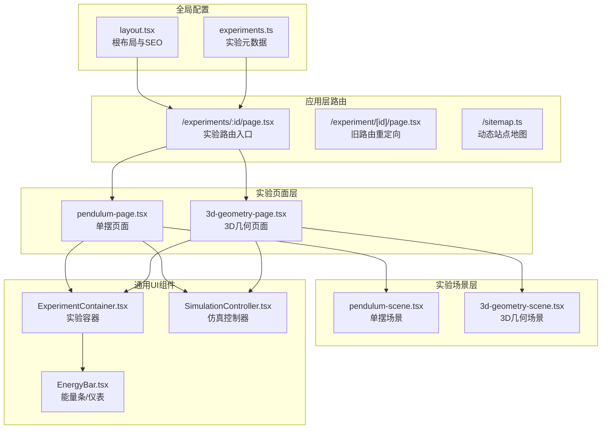
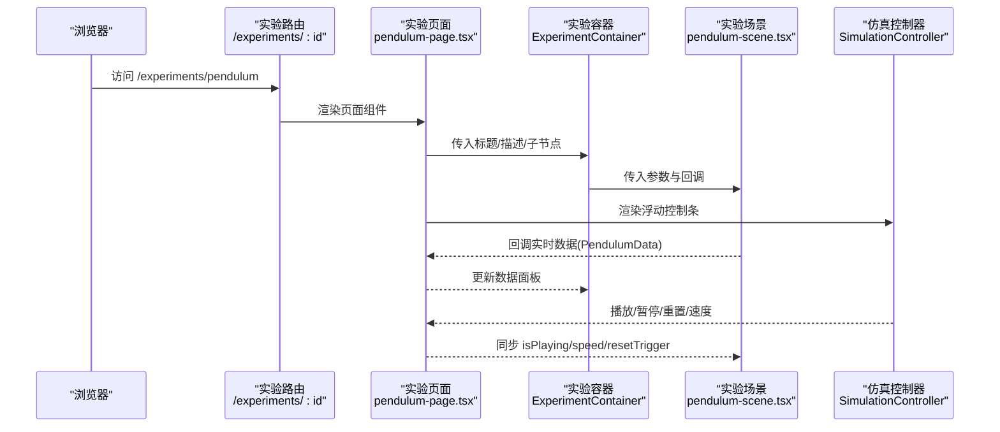
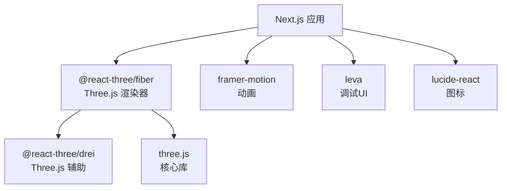

# 实验开发指南

<cite>
**本文档引用的文件**
- [src/data/experiments.ts](file://src/data/experiments.ts)
- [src/app/layout.tsx](file://src/app/layout.tsx)
- [src/components/experiment-ui/index.ts](file://src/components/experiment-ui/index.ts)
- [src/components/experiment-ui/ExperimentContainer.tsx](file://src/components/experiment-ui/ExperimentContainer.tsx)
- [src/components/experiment-ui/SimulationController.tsx](file://src/components/experiment-ui/SimulationController.tsx)
- [src/components/experiment-helpers/EnergyBar.tsx](file://src/components/experiment-helpers/EnergyBar.tsx)
- [src/components/experiment-helpers/index.ts](file://src/components/experiment-helpers/index.ts)
- [src/experiments/pendulum-page.tsx](file://src/experiments/pendulum-page.tsx)
- [src/experiments/pendulum-scene.tsx](file://src/experiments/pendulum-scene.tsx)
- [src/experiments/3d-geometry-page.tsx](file://src/experiments/3d-geometry-page.tsx)
- [src/experiments/3d-geometry-scene.tsx](file://src/experiments/3d-geometry-scene.tsx)
- [src/app/experiments/3d-geometry/page.tsx](file://src/app/experiments/3d-geometry/page.tsx)
- [src/app/experiment/[id]/page.tsx](file://src/app/experiment/[id]/page.tsx)
- [src/app/sitemap.ts](file://src/app/sitemap.ts)
- [package.json](file://package.json)
</cite>

## 目录
1. [简介](#简介)
2. [项目结构](#项目结构)
3. [核心组件](#核心组件)
4. [架构总览](#架构总览)
5. [详细组件分析](#详细组件分析)
6. [依赖关系分析](#依赖关系分析)
7. [性能考虑](#性能考虑)
8. [故障排查指南](#故障排查指南)
9. [结论](#结论)
10. [附录](#附录)

## 简介
本指南面向新加入的开发者，提供在 ScienceLab 3D 平台上新增实验的完整开发流程与最佳实践。内容涵盖实验配置文件的数据结构、页面与场景组件的职责划分、状态管理与数据流设计、测试与调试策略、性能优化与内存管理建议，以及发布与维护流程规范。通过参考现有实验（如单摆与3D几何）的实现，帮助你快速上手并保持一致的开发体验。

## 项目结构
项目采用 Next.js App Router 的目录组织方式，实验页面与场景分别位于应用层路由与实验源码层，UI 组件集中在实验 UI 与实验辅助组件中，全局布局与元数据在根布局中统一配置。

**图表来源**
- [src/app/experiments/3d-geometry/page.tsx:1-9](file://src/app/experiments/3d-geometry/page.tsx#L1-L9)
- [src/experiments/pendulum-page.tsx:1-214](file://src/experiments/pendulum-page.tsx#L1-L214)
- [src/experiments/3d-geometry-page.tsx:1-190](file://src/experiments/3d-geometry-page.tsx#L1-L190)
- [src/components/experiment-ui/ExperimentContainer.tsx:1-374](file://src/components/experiment-ui/ExperimentContainer.tsx#L1-L374)
- [src/components/experiment-ui/SimulationController.tsx:1-228](file://src/components/experiment-ui/SimulationController.tsx#L1-L228)
- [src/components/experiment-helpers/EnergyBar.tsx:1-142](file://src/components/experiment-helpers/EnergyBar.tsx#L1-L142)
- [src/app/layout.tsx:1-204](file://src/app/layout.tsx#L1-L204)
- [src/data/experiments.ts:1-492](file://src/data/experiments.ts#L1-L492)

**章节来源**
- [src/app/experiments/3d-geometry/page.tsx:1-9](file://src/app/experiments/3d-geometry/page.tsx#L1-L9)
- [src/app/experiment/[id]/page.tsx](file://src/app/experiment/[id]/page.tsx#L1-L28)
- [src/app/sitemap.ts:1-36](file://src/app/sitemap.ts#L1-L36)
- [src/app/layout.tsx:1-204](file://src/app/layout.tsx#L1-L204)

## 核心组件
- 实验容器 ExperimentContainer：封装 Three.js 画布、相机、光照、轨道控制器、悬浮控制面板与数据面板，提供统一的实验界面骨架。
- 仿真控制器 SimulationController：始终可见的浮动控制条，支持拖拽、播放/暂停、重置、速度调节与时间显示。
- 能量可视化 EnergyBar：以条形图或圆环仪表展示动能、势能与总能量，支持标签与精度控制。
- 实验页面层：负责参数控制、数据面板、仿真控制与回调传递给场景组件。
- 实验场景层：使用 @react-three/fiber 进行帧循环与物理计算，输出实时数据供页面层渲染。

**章节来源**
- [src/components/experiment-ui/ExperimentContainer.tsx:42-53](file://src/components/experiment-ui/ExperimentContainer.tsx#L42-L53)
- [src/components/experiment-ui/SimulationController.tsx:5-13](file://src/components/experiment-ui/SimulationController.tsx#L5-L13)
- [src/components/experiment-helpers/EnergyBar.tsx:6-12](file://src/components/experiment-helpers/EnergyBar.tsx#L6-L12)
- [src/components/experiment-ui/index.ts:1-43](file://src/components/experiment-ui/index.ts#L1-L43)
- [src/components/experiment-helpers/index.ts:1-8](file://src/components/experiment-helpers/index.ts#L1-L8)

## 架构总览
下图展示了从路由到页面再到场景的调用链路，以及数据流向：

**图表来源**
- [src/app/experiments/3d-geometry/page.tsx:1-9](file://src/app/experiments/3d-geometry/page.tsx#L1-L9)
- [src/experiments/pendulum-page.tsx:159-184](file://src/experiments/pendulum-page.tsx#L159-L184)
- [src/experiments/pendulum-scene.tsx:223-237](file://src/experiments/pendulum-scene.tsx#L223-L237)
- [src/components/experiment-ui/ExperimentContainer.tsx:137-208](file://src/components/experiment-ui/ExperimentContainer.tsx#L137-L208)
- [src/components/experiment-ui/SimulationController.tsx:27-35](file://src/components/experiment-ui/SimulationController.tsx#L27-L35)

## 详细组件分析

### 实验配置文件数据结构
实验配置集中于数据层，包含实验元数据、分类与难度信息，用于首页列表、分类筛选与 SEO 元数据生成。

- 数据接口与字段
  - id: 字符串，唯一标识
  - title: 字符串，实验标题
  - category: "physics"|"chemistry"|"biology"|"math"
  - difficulty: "Beginner"|"Intermediate"|"Advanced"
  - description: 字符串，实验描述
  - icon: 字符串，表情图标
  - color: 字符串，主题色
  - topics: 字符串数组，关键词主题

- 分类定义
  - id: "physics"|"chemistry"|"biology"|"math"
  - name: 分类名称
  - icon: 表情图标
  - color: 分类主题色
  - description: 分类描述

- 使用场景
  - 页面路由生成：sitemap 动态生成每个实验与详情页的链接
  - 首页与搜索：作为实验列表与筛选依据
  - SEO：配合根布局 metadata 提升搜索引擎可见性

**章节来源**
- [src/data/experiments.ts:1-10](file://src/data/experiments.ts#L1-L10)
- [src/data/experiments.ts:12-460](file://src/data/experiments.ts#L12-L460)
- [src/data/experiments.ts:462-492](file://src/data/experiments.ts#L462-L492)
- [src/app/sitemap.ts:19-33](file://src/app/sitemap.ts#L19-L33)
- [src/app/layout.tsx:19-118](file://src/app/layout.tsx#L19-L118)

### 页面组件开发模式
页面组件负责：
- 参数控制：滑块、复选框、预设按钮等，通过受控组件更新状态
- 数据面板：使用 DataGrid 展示实时物理量，结合 EnergyBar 呈现能量守恒
- 仿真控制：使用 SimulationController 提供播放/暂停/重置/速度调节
- 场景集成：向 ExperimentContainer 注入场景组件，传递参数与回调

示例参考：
- 单摆页面：参数包括长度、质量、初始角度、阻尼、重力与显示选项；数据面板展示周期、角速度、速度、振荡次数与能量
- 3D几何页面：形状选择、旋转速度、线框与顶点/边显示开关

**章节来源**
- [src/experiments/pendulum-page.tsx:29-128](file://src/experiments/pendulum-page.tsx#L29-L128)
- [src/experiments/pendulum-page.tsx:130-157](file://src/experiments/pendulum-page.tsx#L130-L157)
- [src/experiments/3d-geometry-page.tsx:18-120](file://src/experiments/3d-geometry-page.tsx#L18-L120)
- [src/experiments/3d-geometry-page.tsx:121-143](file://src/experiments/3d-geometry-page.tsx#L121-L143)

### 场景组件开发模式
场景组件负责：
- 物理计算：使用 useFrame 帧循环与数值积分（如 RK4）推进系统状态
- 可视化：Three.js 几何体、材质、光照与阴影；轨迹点云、矢量箭头、角度弧等
- 数据回调：按帧节流（如每8帧一次）向页面层回调物理量，避免频繁渲染
- 交互同步：接收 isPlaying、simulationSpeed、resetTrigger 等外部控制信号

示例参考：
- 单摆场景：轨迹点云、力矢量（重力/张力/合外力）、角度弧、支撑框架与能量柱
- 3D几何场景：根据所选柏拉图立体生成几何体、边线与顶点高亮

**章节来源**
- [src/experiments/pendulum-scene.tsx:223-237](file://src/experiments/pendulum-scene.tsx#L223-L237)
- [src/experiments/pendulum-scene.tsx:314-502](file://src/experiments/pendulum-scene.tsx#L314-L502)
- [src/experiments/3d-geometry-scene.tsx:30-58](file://src/experiments/3d-geometry-scene.tsx#L30-L58)
- [src/experiments/3d-geometry-scene.tsx:131-153](file://src/experiments/3d-geometry-scene.tsx#L131-L153)

### 控制组件开发模式
- ExperimentContainer：提供画布、相机、光照、轨道控制器与悬浮面板（控制面板/数据面板/详情面板），支持响应式布局与设备检测
- SimulationController：始终可见的浮动控制条，支持拖拽、速度调节与时间显示
- EnergyBar：以条形图或圆环仪表展示能量分布，支持标签与精度控制

**章节来源**
- [src/components/experiment-ui/ExperimentContainer.tsx:55-135](file://src/components/experiment-ui/ExperimentContainer.tsx#L55-L135)
- [src/components/experiment-ui/SimulationController.tsx:27-65](file://src/components/experiment-ui/SimulationController.tsx#L27-L65)
- [src/components/experiment-helpers/EnergyBar.tsx:20-96](file://src/components/experiment-helpers/EnergyBar.tsx#L20-L96)

### 实验状态管理与数据流设计最佳实践
- 状态分层
  - 页面层：参数状态、面板可见性、播放控制与时间累计
  - 场景层：物理状态（使用 ref 存储，避免每次渲染触发更新）
  - 回调层：按帧节流向页面层回传数据，减少渲染压力
- 节流策略
  - 使用帧计数器（如每8帧）更新 React 状态与回调，保证流畅度
- 外部控制
  - resetTrigger 作为副作用触发器，确保重置时清理缓冲区与状态
- 性能优化
  - 仅在需要时更新 BufferAttribute 与几何体属性
  - 移动端降低抗锯齿与 dpr，合理使用雾效与阴影

**章节来源**
- [src/experiments/pendulum-page.tsx:34-59](file://src/experiments/pendulum-page.tsx#L34-L59)
- [src/experiments/pendulum-scene.tsx:288-307](file://src/experiments/pendulum-scene.tsx#L288-L307)
- [src/experiments/pendulum-scene.tsx:479-501](file://src/experiments/pendulum-scene.tsx#L479-L501)

### 新实验添加的完整开发流程
- 步骤一：在数据层注册实验
  - 在实验配置数组中新增一条记录，填写 id、title、category、difficulty、description、icon、color、topics
  - 若需要，扩展分类定义
- 步骤二：创建页面路由
  - 在应用层路由目录下创建 /experiments/:id/page.tsx，导出对应页面组件
  - 如需旧路由兼容，保留 /experiment/[id]/page.tsx 并实现重定向
- 步骤三：编写页面组件
  - 定义参数状态与回调，渲染参数控制组、数据面板与 SimulationController
  - 将参数与回调传递给场景组件
- 步骤四：实现场景组件
  - 在场景层创建场景组件，实现物理计算与可视化
  - 定义数据接口并按帧节流回调页面层
- 步骤五：配置路由与元数据
  - 在路由文件中导出页面组件
  - 在页面文件中导出路由级 metadata
  - 确保 sitemap 动态包含新实验与详情页
- 步骤六：测试与调试
  - 在本地运行验证交互、性能与数据准确性
  - 使用浏览器开发者工具检查 Three.js 渲染与帧率
- 步骤七：发布与维护
  - 提交 PR，遵循贡献规范与代码审查流程
  - 发布后持续监控性能与用户反馈，定期优化

**章节来源**
- [src/data/experiments.ts:12-460](file://src/data/experiments.ts#L12-L460)
- [src/app/experiments/3d-geometry/page.tsx:1-9](file://src/app/experiments/3d-geometry/page.tsx#L1-L9)
- [src/app/experiment/[id]/page.tsx](file://src/app/experiment/[id]/page.tsx#L10-L18)
- [src/app/sitemap.ts:19-33](file://src/app/sitemap.ts#L19-L33)

### 测试策略与调试方法
- 单元测试（建议）
  - 对纯函数（如能量计算、角度弧生成）进行单元测试
  - 对参数转换与边界条件进行断言
- 集成测试（建议）
  - 验证页面与场景组件的交互，确保回调数据格式正确
  - 检查重置逻辑是否清空轨迹与状态
- 性能测试（建议）
  - 使用浏览器性能面板观察帧率与内存占用
  - 在移动设备上验证 dpr 与抗锯齿设置
- 调试技巧
  - 使用 console.log 或轻量日志记录关键变量变化
  - 临时禁用复杂几何体或阴影以定位瓶颈
  - 利用 React DevTools 检查组件渲染频率

[本节为通用指导，不直接分析具体文件]

### 性能优化技巧与内存管理建议
- 渲染优化
  - 合理设置 dpr 与抗锯齿：移动端降低 dpr，桌面端适度提升
  - 使用雾效与阴影时注意性能开销，必要时关闭或调整尺寸
  - 仅在需要时启用阴影贴图与环境贴图
- 几何与缓冲
  - 复用几何体与材质，避免重复创建
  - 使用 BufferAttribute 批量更新，减少属性写入次数
  - 及时 dispose 几何体与纹理，防止内存泄漏
- 帧循环与节流
  - 使用帧计数器节流 React 状态更新与回调
  - 在高速仿真时进行子步积分，提高稳定性同时控制计算量
- 移动端适配
  - 检测设备类型，调整相机 FOV、控件灵敏度与渲染参数
  - 限制最大分辨率与阴影质量

**章节来源**
- [src/components/experiment-ui/ExperimentContainer.tsx:137-153](file://src/components/experiment-ui/ExperimentContainer.tsx#L137-L153)
- [src/experiments/pendulum-scene.tsx:314-341](file://src/experiments/pendulum-scene.tsx#L314-L341)
- [src/experiments/3d-geometry-scene.tsx:131-153](file://src/experiments/3d-geometry-scene.tsx#L131-L153)

### 代码示例与模板文件
以下为可直接参考的模板路径（请勿直接复制代码内容）：
- 实验页面模板（单摆）：[src/experiments/pendulum-page.tsx:29-128](file://src/experiments/pendulum-page.tsx#L29-L128)
- 实验场景模板（单摆）：[src/experiments/pendulum-scene.tsx:223-237](file://src/experiments/pendulum-scene.tsx#L223-L237)
- 实验页面模板（3D几何）：[src/experiments/3d-geometry-page.tsx:18-120](file://src/experiments/3d-geometry-page.tsx#L18-L120)
- 实验场景模板（3D几何）：[src/experiments/3d-geometry-scene.tsx:30-58](file://src/experiments/3d-geometry-scene.tsx#L30-L58)
- 实验容器组件：[src/components/experiment-ui/ExperimentContainer.tsx:55-135](file://src/components/experiment-ui/ExperimentContainer.tsx#L55-L135)
- 仿真控制器组件：[src/components/experiment-ui/SimulationController.tsx:27-65](file://src/components/experiment-ui/SimulationController.tsx#L27-L65)
- 能量可视化组件：[src/components/experiment-helpers/EnergyBar.tsx:20-96](file://src/components/experiment-helpers/EnergyBar.tsx#L20-L96)
- 实验配置数据：[src/data/experiments.ts:12-460](file://src/data/experiments.ts#L12-L460)

**章节来源**
- [src/experiments/pendulum-page.tsx:29-128](file://src/experiments/pendulum-page.tsx#L29-L128)
- [src/experiments/pendulum-scene.tsx:223-237](file://src/experiments/pendulum-scene.tsx#L223-L237)
- [src/experiments/3d-geometry-page.tsx:18-120](file://src/experiments/3d-geometry-page.tsx#L18-L120)
- [src/experiments/3d-geometry-scene.tsx:30-58](file://src/experiments/3d-geometry-scene.tsx#L30-L58)
- [src/components/experiment-ui/ExperimentContainer.tsx:55-135](file://src/components/experiment-ui/ExperimentContainer.tsx#L55-L135)
- [src/components/experiment-ui/SimulationController.tsx:27-65](file://src/components/experiment-ui/SimulationController.tsx#L27-L65)
- [src/components/experiment-helpers/EnergyBar.tsx:20-96](file://src/components/experiment-helpers/EnergyBar.tsx#L20-L96)
- [src/data/experiments.ts:12-460](file://src/data/experiments.ts#L12-L460)

### 发布与维护流程规范
- 提交流程
  - fork 主仓库，创建功能分支，提交变更并发起 Pull Request
  - 在 PR 描述中说明新增实验的功能、技术要点与测试情况
- 代码审查
  - 关注性能影响、可读性与一致性
  - 确认实验配置、路由与元数据完整
- 发布
  - CI/CD 自动化构建与部署，确保无重大性能退化
- 维护
  - 监控用户反馈与性能指标，定期优化与修复
  - 更新实验配置与路由元数据，保持站点地图与 SEO 最新

[本节为通用指导，不直接分析具体文件]

## 依赖关系分析
项目依赖以 Next.js 为核心，Three.js 生态与 UI 工具链构成实验渲染与交互基础。

**图表来源**
- [package.json:10-21](file://package.json#L10-L21)

**章节来源**
- [package.json:1-37](file://package.json#L1-L37)

## 性能考虑
- 渲染管线
  - 合理设置相机与投影矩阵，避免过度缩放导致采样损失
  - 控制光源数量与阴影贴图尺寸，平衡视觉效果与性能
- 几何与材质
  - 使用实例化渲染与共享材质，减少绘制批次
  - 对大场景采用分块加载与可视剔除
- 帧循环
  - 严格限制每帧计算量，必要时进行子步积分
  - 使用节流策略减少状态更新频率
- 移动端优化
  - 降低 dpr 与分辨率，关闭不必要的后处理
  - 优化触摸交互与控件布局

[本节为通用指导，不直接分析具体文件]

## 故障排查指南
- 页面无法加载或空白
  - 检查路由文件是否正确导出页面组件
  - 确认实验配置中的 id 与路由一致
- 3D 场景无渲染或黑屏
  - 检查 ExperimentContainer 是否正确挂载 Canvas 与相机
  - 确认场景组件未抛出异常，且几何体与材质已创建
- 性能卡顿或掉帧
  - 检查帧循环中是否存在高频状态更新
  - 适当降低 dpr、阴影质量或移除复杂几何体
- 数据面板不更新
  - 确认场景组件按帧节流回调数据
  - 检查页面层的 setData 与 DataGrid 显示逻辑

**章节来源**
- [src/app/experiments/3d-geometry/page.tsx:1-9](file://src/app/experiments/3d-geometry/page.tsx#L1-L9)
- [src/components/experiment-ui/ExperimentContainer.tsx:137-153](file://src/components/experiment-ui/ExperimentContainer.tsx#L137-L153)
- [src/experiments/pendulum-scene.tsx:479-501](file://src/experiments/pendulum-scene.tsx#L479-L501)

## 结论
通过遵循本指南的开发流程与最佳实践，你可以高效地在 ScienceLab 3D 中新增高质量实验。建议从现有实验入手，逐步掌握页面与场景的职责划分、状态管理与数据流设计，并结合性能优化与测试策略，确保新实验在多平台上的稳定与流畅表现。

## 附录
- 快速检查清单
  - 实验配置已添加至数据层
  - 路由文件已导出页面组件
  - 页面组件包含参数控制、数据面板与仿真控制器
  - 场景组件实现物理计算与按帧节流回调
  - sitemap 包含新实验与详情页
  - 本地测试通过，性能达标
  - 提交 PR 并完成代码审查

[本节为通用指导，不直接分析具体文件]