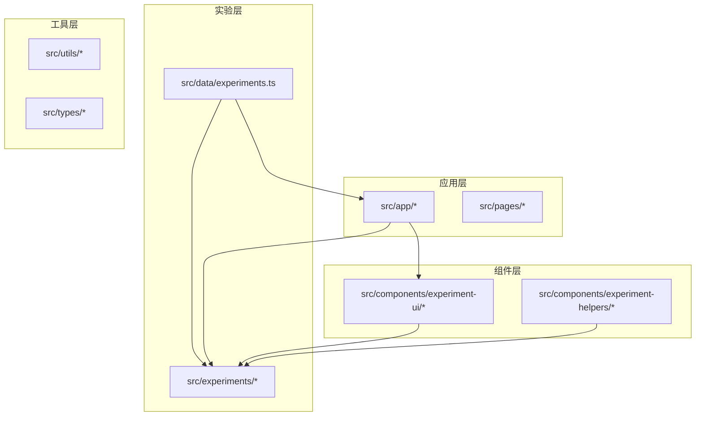
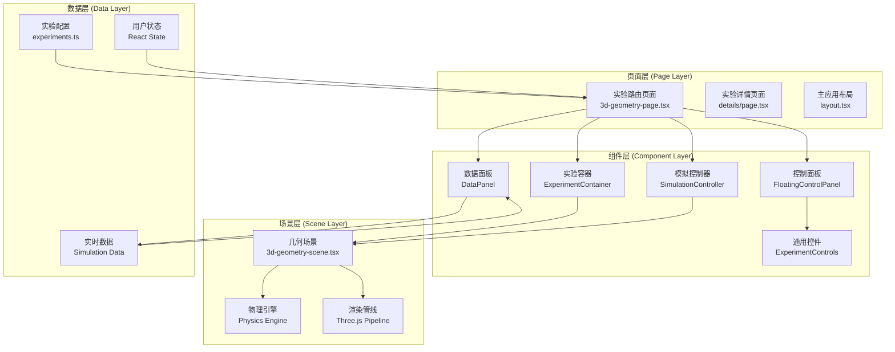
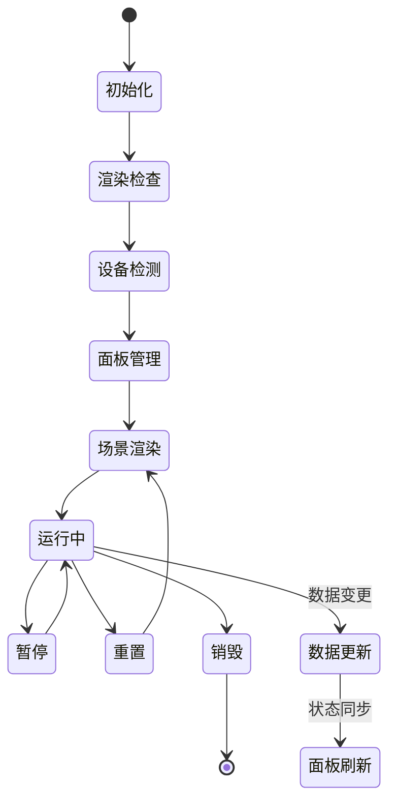
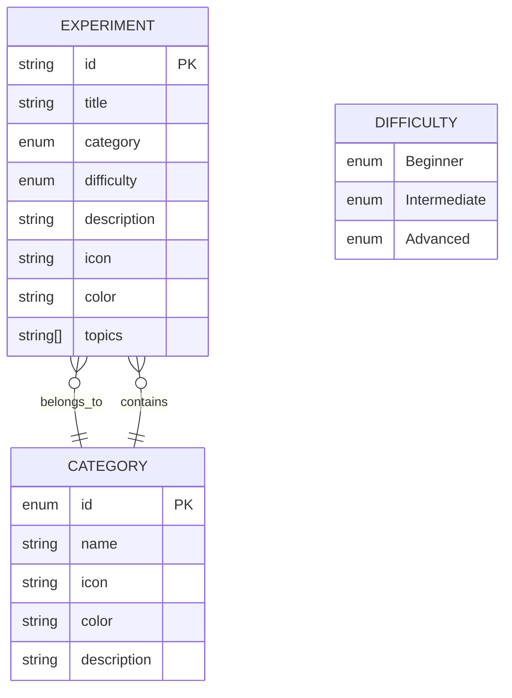
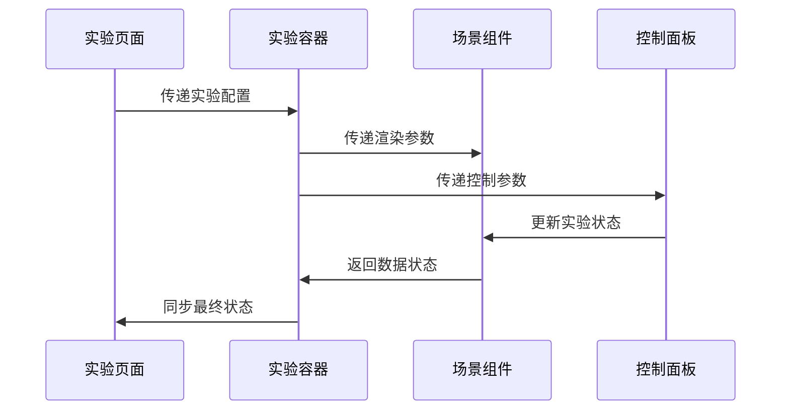
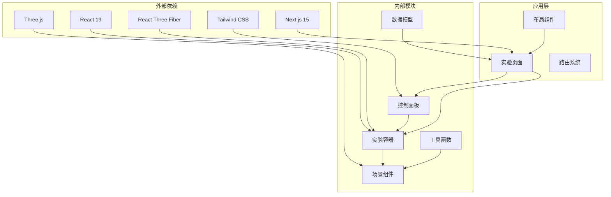

# 实验架构设计

<cite>
**本文档引用的文件**
- [layout.tsx](file://src/app/layout.tsx)
- [ExperimentContainer.tsx](file://src/components/experiment-ui/ExperimentContainer.tsx)
- [ControlPanel.tsx](file://src/components/experiment-ui/ControlPanel.tsx)
- [experiments.ts](file://src/data/experiments.ts)
- [3d-geometry-page.tsx](file://src/experiments/3d-geometry-page.tsx)
- [3d-geometry-scene.tsx](file://src/experiments/3d-geometry-scene.tsx)
- [SimulationController.tsx](file://src/components/experiment-ui/SimulationController.tsx)
- [DataPanel.tsx](file://src/components/experiment-ui/DataPanel.tsx)
- [FloatingControlPanel.tsx](file://src/components/experiment-ui/FloatingControlPanel.tsx)
- [ExperimentControls.tsx](file://src/components/experiment-ui/ExperimentControls.tsx)
- [package.json](file://package.json)
- [README.md](file://README.md)
</cite>

## 目录
1. [引言](#引言)
2. [项目结构](#项目结构)
3. [核心组件](#核心组件)
4. [架构概览](#架构概览)
5. [详细组件分析](#详细组件分析)
6. [依赖关系分析](#依赖关系分析)
7. [性能考虑](#性能考虑)
8. [故障排除指南](#故障排除指南)
9. [结论](#结论)

## 引言

ScienceLab 3D是一个基于React和Three.js构建的交互式3D科学实验平台。该项目采用分层架构设计，通过页面层、组件层和场景层的清晰分离，实现了高度模块化和可扩展的实验系统。系统支持物理、化学、生物和数学四大领域的40多个虚拟实验，为学生和教育工作者提供了沉浸式的科学学习体验。

## 项目结构

项目采用基于功能的模块化组织方式，主要分为以下几个层次：

**图表来源**
- [layout.tsx:1-204](file://src/app/layout.tsx#L1-L204)
- [experiments.ts:1-492](file://src/data/experiments.ts#L1-L492)

**章节来源**
- [layout.tsx:1-204](file://src/app/layout.tsx#L1-L204)
- [package.json:1-37](file://package.json#L1-L37)

## 核心组件

### 实验容器组件（ExperimentContainer）

ExperimentContainer是整个实验系统的核心容器组件，负责协调3D场景渲染、用户界面布局和交互控制。该组件实现了以下关键功能：

- **3D场景管理**：集成React Three Fiber，提供完整的3D渲染环境
- **响应式布局**：自适应桌面、平板和移动设备的界面布局
- **多面板系统**：支持控制面板、数据面板和详情面板的动态显示
- **相机控制系统**：提供轨道控制器和透视相机的完整配置
- **实时数据展示**：集成实时数据可视化和状态反馈

### 控制面板系统

系统提供了多种控制面板组件，每种都有特定的功能定位：

- **浮动控制面板**：用于实验参数设置，支持拖拽和自动折叠
- **模拟控制器**：专门的播放/暂停、重置和速度控制
- **数据面板**：实时数据显示和统计信息展示
- **传统控制面板**：可折叠的侧边栏控制界面

**章节来源**
- [ExperimentContainer.tsx:1-374](file://src/components/experiment-ui/ExperimentContainer.tsx#L1-L374)
- [ControlPanel.tsx:1-300](file://src/components/experiment-ui/ControlPanel.tsx#L1-L300)

## 架构概览

系统采用三层分离的设计模式，确保了良好的关注点分离和可维护性：

**图表来源**
- [3d-geometry-page.tsx:1-190](file://src/experiments/3d-geometry-page.tsx#L1-L190)
- [ExperimentContainer.tsx:1-374](file://src/components/experiment-ui/ExperimentContainer.tsx#L1-L374)
- [experiments.ts:1-492](file://src/data/experiments.ts#L1-L492)

## 详细组件分析

### 实验容器组件深度解析

ExperimentContainer作为实验系统的核心枢纽，实现了复杂的多面板管理和状态同步机制：

#### 核心功能特性

1. **多面板协调系统**
   - 控制面板：实验参数设置和操作控制
   - 数据面板：实时数据展示和统计信息
   - 详情面板：实验说明和帮助信息
   - 模拟控制条：播放/暂停、重置和速度控制

2. **响应式布局管理**
   - 自动检测设备类型（移动端、平板、桌面）
   - 动态调整UI元素位置和大小
   - 响应窗口尺寸变化的自适应布局

3. **3D场景集成**
   - 完整的Three.js渲染环境配置
   - 轨道控制器和透视相机设置
   - 环境光照和阴影效果管理

#### 状态管理模式

**图表来源**
- [ExperimentContainer.tsx:78-133](file://src/components/experiment-ui/ExperimentContainer.tsx#L78-L133)

#### 生命周期控制机制

组件实现了完整的生命周期管理，包括初始化、运行、暂停、重置和销毁阶段：

- **初始化阶段**：设备检测、布局计算、资源加载
- **运行阶段**：场景渲染、用户交互、数据更新
- **暂停阶段**：帧循环停止、状态保持
- **重置阶段**：状态恢复、资源清理
- **销毁阶段**：事件监听器清理、内存释放

**章节来源**
- [ExperimentContainer.tsx:55-374](file://src/components/experiment-ui/ExperimentContainer.tsx#L55-L374)

### 控制面板系统设计原理

系统提供了多层次的控制面板解决方案，每种都有特定的使用场景和交互模式：

#### 浮动控制面板（FloatingControlPanel）

专为实验参数设置设计的浮动面板，具有以下特点：

- **拖拽功能**：支持鼠标和触摸拖拽，自动约束在视口范围内
- **自动折叠**：移动端自动折叠以节省空间
- **响应式设计**：根据屏幕尺寸调整位置和大小
- **性能优化**：使用useCallback优化事件处理器

#### 模拟控制器（SimulationController）

专门的播放控制组件，提供统一的模拟控制接口：

- **紧凑设计**：始终可见，不占用额外空间
- **拖拽定位**：可自由放置在屏幕任意位置
- **时间显示**：可选的时间进度显示功能
- **速度控制**：0.1x到3x的可调节播放速度

#### 数据面板（DataPanel）

实时数据展示组件，支持数据的动态更新和可视化：

- **可折叠设计**：节省屏幕空间，需要时才显示
- **拖拽功能**：支持位置调整和拖拽操作
- **透明设计**：半透明背景不影响3D场景观看
- **内容适配**：根据数据内容自动调整布局

**章节来源**
- [FloatingControlPanel.tsx:1-195](file://src/components/experiment-ui/FloatingControlPanel.tsx#L1-L195)
- [SimulationController.tsx:1-228](file://src/components/experiment-ui/SimulationController.tsx#L1-L228)
- [DataPanel.tsx:1-219](file://src/components/experiment-ui/DataPanel.tsx#L1-L219)

### 实验数据模型结构设计

系统采用了标准化的数据模型设计，确保实验配置的一致性和可扩展性：

#### 实验配置数据模型

**图表来源**
- [experiments.ts:1-492](file://src/data/experiments.ts#L1-L492)

#### 参数定义和状态管理

每个实验都定义了详细的参数配置和状态管理机制：

- **基础参数**：形状类型、旋转速度、显示选项等
- **状态同步**：React状态与3D场景状态的双向同步
- **事件处理**：用户交互事件的统一处理机制
- **数据流管理**：从用户输入到3D渲染的完整数据流

**章节来源**
- [experiments.ts:1-492](file://src/data/experiments.ts#L1-L492)
- [3d-geometry-page.tsx:16-120](file://src/experiments/3d-geometry-page.tsx#L16-L120)

### 实验组件间通信模式

系统实现了多种组件间通信模式，确保各组件能够高效协作：

#### 1. Props传递模式

**图表来源**
- [3d-geometry-page.tsx:147-189](file://src/experiments/3d-geometry-page.tsx#L147-L189)

#### 2. 回调函数模式

组件通过回调函数实现松耦合的通信：

- **onPlayPause**: 播放/暂停状态变更通知
- **onReset**: 实验重置事件处理
- **onSpeedChange**: 播放速度变更回调
- **onDataChange**: 实时数据更新通知

#### 3. 状态提升模式

复杂的状态管理采用状态提升策略：

- **顶层状态管理**：在实验页面集中管理核心状态
- **子组件只读访问**：子组件通过props接收状态
- **回调函数更新**：通过回调函数向父组件传递状态变更

**章节来源**
- [3d-geometry-page.tsx:33-40](file://src/experiments/3d-geometry-page.tsx#L33-L40)
- [3d-geometry-scene.tsx:121-153](file://src/experiments/3d-geometry-scene.tsx#L121-L153)

## 依赖关系分析

系统采用了清晰的依赖层次结构，确保模块间的低耦合高内聚：

**图表来源**
- [package.json:10-21](file://package.json#L10-L21)
- [layout.tsx:1-204](file://src/app/layout.tsx#L1-L204)

### 技术栈选择分析

系统选择了经过验证的技术栈组合，确保了性能、可维护性和社区支持：

- **Next.js 15**: 提供SSR、静态生成和现代开发体验
- **React 19**: 最新的React版本，支持并发特性和新hooks
- **Three.js + React Three Fiber**: 专业的3D图形渲染解决方案
- **Tailwind CSS**: 快速的样式开发和响应式设计
- **TypeScript**: 类型安全和更好的开发体验

**章节来源**
- [package.json:10-37](file://package.json#L10-L37)
- [README.md:138-150](file://README.md#L138-L150)

## 性能考虑

系统在多个层面进行了性能优化，确保在各种设备上都能提供流畅的用户体验：

### 3D渲染性能优化

1. **帧率控制**：使用useFrame钩子精确控制渲染频率
2. **几何优化**：合理使用几何体简化和LOD技术
3. **材质管理**：优化材质属性和纹理使用
4. **阴影优化**：动态调整阴影质量以平衡性能

### 内存管理策略

1. **组件卸载清理**：确保事件监听器和定时器正确清理
2. **状态优化**：使用useMemo和useCallback避免不必要的重渲染
3. **资源复用**：几何体和材质的共享使用
4. **垃圾回收**：及时释放不再使用的对象引用

### 网络和加载优化

1. **按需加载**：实验组件的懒加载实现
2. **缓存策略**：浏览器缓存和CDN加速
3. **压缩优化**：代码分割和资源压缩
4. **预加载机制**：关键资源的预加载策略

## 故障排除指南

### 常见问题诊断

#### 3D渲染问题

**问题症状**：3D场景无法正常显示或渲染异常

**可能原因**：
- WebGL上下文丢失
- 设备兼容性问题
- 内存不足
- 着色器编译错误

**解决步骤**：
1. 检查浏览器控制台错误信息
2. 验证设备的WebGL支持情况
3. 尝试降低图形质量设置
4. 清除浏览器缓存后重试

#### 性能问题

**问题症状**：页面卡顿、帧率下降

**诊断方法**：
1. 使用浏览器性能分析工具
2. 检查内存使用情况
3. 分析组件渲染次数
4. 监控网络请求

**优化建议**：
1. 减少不必要的重渲染
2. 优化大型3D对象的渲染
3. 实施适当的缓存策略
4. 使用虚拟滚动处理大量数据

#### 移动端适配问题

**问题症状**：触摸操作不灵敏或布局错乱

**解决方案**：
1. 确保触摸事件正确处理
2. 检查CSS媒体查询设置
3. 验证视口配置
4. 测试不同设备的兼容性

**章节来源**
- [ExperimentContainer.tsx:78-133](file://src/components/experiment-ui/ExperimentContainer.tsx#L78-L133)
- [FloatingControlPanel.tsx:81-150](file://src/components/experiment-ui/FloatingControlPanel.tsx#L81-L150)

## 结论

ScienceLab 3D项目展现了现代前端架构的最佳实践，通过清晰的分层设计和模块化组件实现了高度的可扩展性和可维护性。系统的核心优势包括：

### 架构优势

1. **清晰的分层设计**：页面层、组件层、场景层的明确分离确保了良好的关注点分离
2. **模块化的组件系统**：可复用的组件设计支持快速开发和维护
3. **强大的3D渲染能力**：基于Three.js的专业3D图形渲染解决方案
4. **优秀的用户体验**：响应式设计和流畅的交互体验

### 扩展性设计

系统具备良好的扩展性，支持：
- 新实验类型的快速添加
- 组件功能的独立扩展
- 多平台部署能力
- 社区贡献的开放生态

### 技术创新

- **混合渲染模式**：结合2D UI和3D场景的创新设计
- **实时数据可视化**：动态数据驱动的交互体验
- **跨平台兼容**：统一的代码库支持多设备部署
- **性能优化策略**：多层次的性能优化确保流畅体验

该项目为教育技术领域提供了一个优秀的开源解决方案，不仅展示了先进的技术实现，更为未来的教育科技发展奠定了坚实的基础。