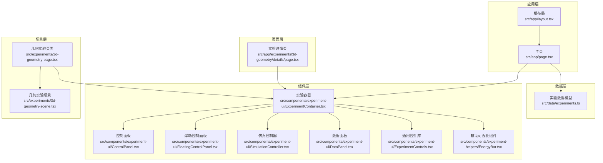
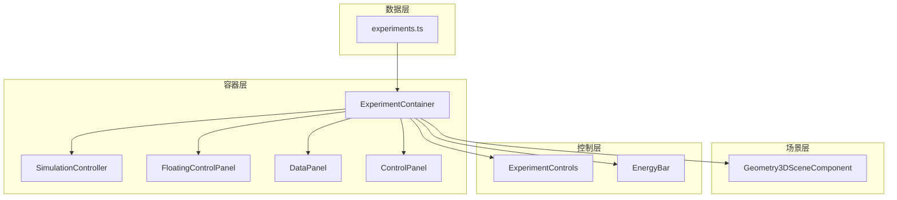
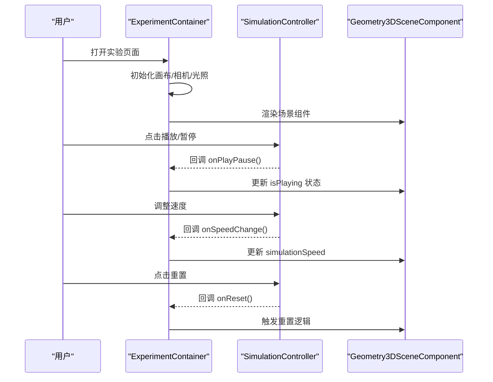
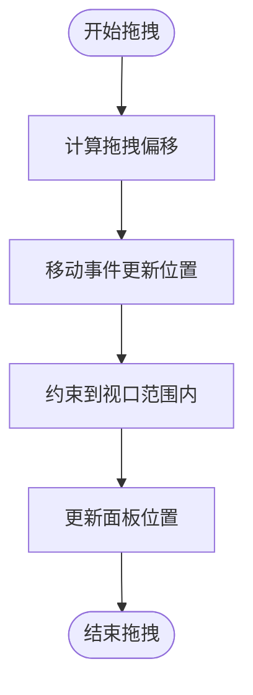
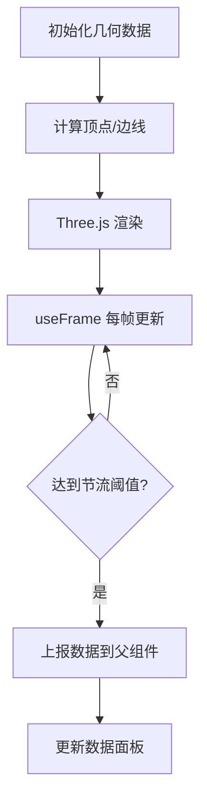
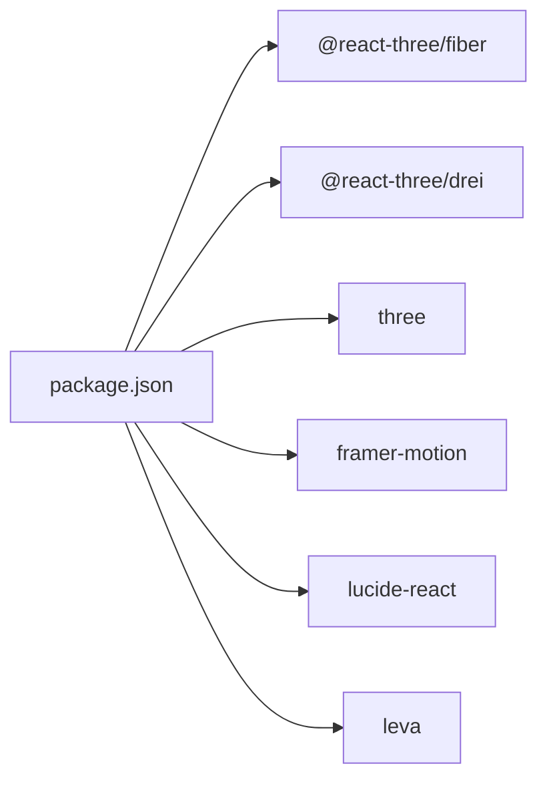

# 实验系统

<cite>
**本文档引用的文件**
- [src/app/layout.tsx](file://src/app/layout.tsx)
- [src/app/page.tsx](file://src/app/page.tsx)
- [src/data/experiments.ts](file://src/data/experiments.ts)
- [src/components/experiment-ui/index.ts](file://src/components/experiment-ui/index.ts)
- [src/components/experiment-ui/ExperimentContainer.tsx](file://src/components/experiment-ui/ExperimentContainer.tsx)
- [src/components/experiment-ui/ControlPanel.tsx](file://src/components/experiment-ui/ControlPanel.tsx)
- [src/components/experiment-ui/FloatingControlPanel.tsx](file://src/components/experiment-ui/FloatingControlPanel.tsx)
- [src/components/experiment-ui/SimulationController.tsx](file://src/components/experiment-ui/SimulationController.tsx)
- [src/components/experiment-ui/DataPanel.tsx](file://src/components/experiment-ui/DataPanel.tsx)
- [src/components/experiment-ui/ExperimentControls.tsx](file://src/components/experiment-ui/ExperimentControls.tsx)
- [src/components/experiment-helpers/EnergyBar.tsx](file://src/components/experiment-helpers/EnergyBar.tsx)
- [src/experiments/3d-geometry-page.tsx](file://src/experiments/3d-geometry-page.tsx)
- [src/experiments/3d-geometry-scene.tsx](file://src/experiments/3d-geometry-scene.tsx)
- [src/app/experiments/3d-geometry/details/page.tsx](file://src/app/experiments/3d-geometry/details/page.tsx)
- [package.json](file://package.json)
</cite>

## 目录
1. [引言](#引言)
2. [项目结构](#项目结构)
3. [核心组件](#核心组件)
4. [架构总览](#架构总览)
5. [详细组件分析](#详细组件分析)
6. [依赖关系分析](#依赖关系分析)
7. [性能考量](#性能考量)
8. [故障排查指南](#故障排查指南)
9. [结论](#结论)
10. [附录](#附录)

## 引言
本文件为 ScienceLab3D 实验系统的综合技术文档，面向开发者与实验内容创作者，系统阐述实验系统的整体架构、页面结构、场景组件设计、控制面板体系、数据模型与状态管理、实验容器的独立性与可复用性、通用组件共享机制与扩展点，并提供最佳实践与性能优化建议。

## 项目结构
系统采用 Next.js 应用结构，核心由以下层次组成：
- 应用层：根布局与主页负责全局元数据、主题切换、实验列表筛选与导航。
- 数据层：集中定义实验元数据与分类信息，统一管理实验配置与主题色。
- 组件层：实验 UI 组件（容器、控制面板、数据面板、仿真控制器等）与通用控件库。
- 场景层：各实验的具体 Three.js 场景组件，封装物理状态、渲染与数据上报。
- 页面层：每个实验的页面入口，组合容器、场景与控制面板，实现独立实验体验。

**图表来源**
- [src/app/layout.tsx:1-204](file://src/app/layout.tsx#L1-L204)
- [src/app/page.tsx:1-676](file://src/app/page.tsx#L1-L676)
- [src/data/experiments.ts:1-492](file://src/data/experiments.ts#L1-L492)
- [src/components/experiment-ui/ExperimentContainer.tsx:1-374](file://src/components/experiment-ui/ExperimentContainer.tsx#L1-L374)
- [src/components/experiment-ui/ControlPanel.tsx:1-300](file://src/components/experiment-ui/ControlPanel.tsx#L1-L300)
- [src/components/experiment-ui/FloatingControlPanel.tsx:1-195](file://src/components/experiment-ui/FloatingControlPanel.tsx#L1-L195)
- [src/components/experiment-ui/SimulationController.tsx:1-228](file://src/components/experiment-ui/SimulationController.tsx#L1-L228)
- [src/components/experiment-ui/DataPanel.tsx:1-219](file://src/components/experiment-ui/DataPanel.tsx#L1-L219)
- [src/components/experiment-ui/ExperimentControls.tsx:1-498](file://src/components/experiment-ui/ExperimentControls.tsx#L1-L498)
- [src/components/experiment-helpers/EnergyBar.tsx:1-142](file://src/components/experiment-helpers/EnergyBar.tsx#L1-L142)
- [src/experiments/3d-geometry-page.tsx:1-190](file://src/experiments/3d-geometry-page.tsx#L1-L190)
- [src/experiments/3d-geometry-scene.tsx:1-243](file://src/experiments/3d-geometry-scene.tsx#L1-L243)
- [src/app/experiments/3d-geometry/details/page.tsx:1-84](file://src/app/experiments/3d-geometry/details/page.tsx#L1-L84)

**章节来源**
- [src/app/layout.tsx:1-204](file://src/app/layout.tsx#L1-L204)
- [src/app/page.tsx:1-676](file://src/app/page.tsx#L1-L676)
- [src/data/experiments.ts:1-492](file://src/data/experiments.ts#L1-L492)

## 核心组件
本节聚焦实验系统的关键组件及其职责与交互方式。

- 实验容器 ExperimentContainer
  - 负责 3D 画布初始化、相机与光照设置、环境与雾化效果、全屏布局与响应式尺寸适配。
  - 提供标题栏、控制面板开关、数据面板开关、详情面板、浮动仿真条等 UI 容器。
  - 支持移动端/平板设备检测与性能优化（如抗锯齿、像素比、DPR）。
  - 通过 children 注入场景组件，实现“容器即框架”的独立性与可复用性。

- 控制面板 ControlPanel
  - 可拖拽、可折叠的桌面端控制面板，支持播放/暂停、重置、速度调节等。
  - 移动端自动折叠与触控拖拽，提升可用性。
  - 作为通用控制中枢，可被实验页面直接使用或嵌套在容器中。

- 浮动控制面板 FloatingControlPanel
  - 面向参数类控制的浮动面板，支持拖拽、折叠、自动折叠（移动端）。
  - 适合放置形状选择、显示选项、滑杆等参数控件。

- 仿真控制器 SimulationController
  - 始终可见的浮动控制器，提供播放/暂停、重置、速度与时间显示。
  - 位置与尺寸自适应，移动端紧凑设计。

- 数据面板 DataPanel
  - 实时数据展示面板，支持拖拽、折叠、显隐切换。
  - 适合展示物理量、统计值、公式结果等。

- 通用控件库 ExperimentControls
  - 包含分组、单项显示、滑杆、下拉、按钮、复选框、预设按钮、进度条、能量条等。
  - 统一风格与交互，降低实验间重复开发成本。

- 辅助可视化组件 EnergyBar
  - 在 3D 空间中以 Html 层叠加能量可视化，支持标签与圆形仪表两种形态。

**章节来源**
- [src/components/experiment-ui/ExperimentContainer.tsx:1-374](file://src/components/experiment-ui/ExperimentContainer.tsx#L1-L374)
- [src/components/experiment-ui/ControlPanel.tsx:1-300](file://src/components/experiment-ui/ControlPanel.tsx#L1-L300)
- [src/components/experiment-ui/FloatingControlPanel.tsx:1-195](file://src/components/experiment-ui/FloatingControlPanel.tsx#L1-L195)
- [src/components/experiment-ui/SimulationController.tsx:1-228](file://src/components/experiment-ui/SimulationController.tsx#L1-L228)
- [src/components/experiment-ui/DataPanel.tsx:1-219](file://src/components/experiment-ui/DataPanel.tsx#L1-L219)
- [src/components/experiment-ui/ExperimentControls.tsx:1-498](file://src/components/experiment-ui/ExperimentControls.tsx#L1-L498)
- [src/components/experiment-helpers/EnergyBar.tsx:1-142](file://src/components/experiment-helpers/EnergyBar.tsx#L1-L142)

## 架构总览
系统采用“容器 + 场景 + 控制面板”的分层架构：
- 容器层：统一 3D 渲染环境、UI 框架与交互入口。
- 场景层：实验具体逻辑与 Three.js 渲染，负责物理状态与数据上报。
- 控制层：提供播放/暂停、重置、速度、参数调节、实时数据展示等能力。
- 数据层：集中管理实验元数据与分类信息，驱动主页筛选与导航。

**图表来源**
- [src/components/experiment-ui/ExperimentContainer.tsx:1-374](file://src/components/experiment-ui/ExperimentContainer.tsx#L1-L374)
- [src/components/experiment-ui/SimulationController.tsx:1-228](file://src/components/experiment-ui/SimulationController.tsx#L1-L228)
- [src/components/experiment-ui/FloatingControlPanel.tsx:1-195](file://src/components/experiment-ui/FloatingControlPanel.tsx#L1-L195)
- [src/components/experiment-ui/DataPanel.tsx:1-219](file://src/components/experiment-ui/DataPanel.tsx#L1-L219)
- [src/components/experiment-ui/ControlPanel.tsx:1-300](file://src/components/experiment-ui/ControlPanel.tsx#L1-L300)
- [src/components/experiment-ui/ExperimentControls.tsx:1-498](file://src/components/experiment-ui/ExperimentControls.tsx#L1-L498)
- [src/components/experiment-helpers/EnergyBar.tsx:1-142](file://src/components/experiment-helpers/EnergyBar.tsx#L1-L142)
- [src/data/experiments.ts:1-492](file://src/data/experiments.ts#L1-L492)

## 详细组件分析

### 实验容器 ExperimentContainer 分析
- 设计要点
  - 使用 @react-three/fiber 与 @react-three/drei 构建 3D 画布，内置相机、轨道控制器、环境光、方向光、半球光与点光源。
  - 响应式尺寸处理：监听窗口变化与 ResizeObserver，动态调整画布大小与投影矩阵。
  - 性能优化：根据设备类型调整抗锯齿、DPR、着色器参数；启用雾化增强空间感。
  - UI 容器：标题栏、控制面板、数据面板、详情面板、浮动仿真条，支持多面板开关与遮罩层。
- 关键流程
  - 初始化画布与光照 → 注入子组件（场景）→ 响应窗口变化 → 用户交互（播放/暂停/重置/速度）→ 数据面板更新。

**图表来源**
- [src/components/experiment-ui/ExperimentContainer.tsx:1-374](file://src/components/experiment-ui/ExperimentContainer.tsx#L1-L374)
- [src/components/experiment-ui/SimulationController.tsx:1-228](file://src/components/experiment-ui/SimulationController.tsx#L1-L228)
- [src/experiments/3d-geometry-scene.tsx:1-243](file://src/experiments/3d-geometry-scene.tsx#L1-L243)

**章节来源**
- [src/components/experiment-ui/ExperimentContainer.tsx:1-374](file://src/components/experiment-ui/ExperimentContainer.tsx#L1-L374)

### 控制面板 ControlPanel 分析
- 设计要点
  - 支持桌面端鼠标拖拽与移动端触控拖拽，自动约束在视口内。
  - 自动折叠（移动端无操作超时），减少遮挡。
  - 内置播放/暂停、重置、速度滑杆等常用功能。
- 交互流程
  - 拖拽开始 → 计算偏移 → 移动事件更新位置 → 抵消滚动穿透 → 抬起结束拖拽。

**图表来源**
- [src/components/experiment-ui/ControlPanel.tsx:1-300](file://src/components/experiment-ui/ControlPanel.tsx#L1-L300)

**章节来源**
- [src/components/experiment-ui/ControlPanel.tsx:1-300](file://src/components/experiment-ui/ControlPanel.tsx#L1-L300)

### 通用控件库 ExperimentControls 分析
- 设计要点
  - 提供 ControlGroup、ControlItem、ControlSlider、DataGrid、EnergyBar、ControlDropdown、ControlButton、ControlCheckbox、ControlPresetButtons、ControlProgressBar 等。
  - 统一样式与颜色策略，便于跨实验一致化。
- 复杂度与性能
  - 控件均为纯展示与回调触发，复杂度低，渲染开销小。
  - 下拉与预设按钮通过受控状态管理，避免不必要的重渲染。

**章节来源**
- [src/components/experiment-ui/ExperimentControls.tsx:1-498](file://src/components/experiment-ui/ExperimentControls.tsx#L1-L498)

### 场景组件 Geometry3DSceneComponent 分析
- 设计要点
  - 使用 useMemo 缓存几何数据与顶点集合，减少重复计算。
  - useFrame 中按帧更新旋转状态，每 N 帧上报一次数据，平衡流畅度与 UI 更新频率。
  - 通过 Line 绘制边线、球体高亮顶点、网格辅助与公式可视化提示。
- 数据流
  - 几何数据 → 顶点/边线计算 → Three.js 渲染 → 每 N 帧上报到父组件 → 数据面板展示。

**图表来源**
- [src/experiments/3d-geometry-scene.tsx:1-243](file://src/experiments/3d-geometry-scene.tsx#L1-L243)
- [src/experiments/3d-geometry-page.tsx:1-190](file://src/experiments/3d-geometry-page.tsx#L1-L190)

**章节来源**
- [src/experiments/3d-geometry-scene.tsx:1-243](file://src/experiments/3d-geometry-scene.tsx#L1-L243)

### 数据模型与状态管理
- 实验数据模型 Experiment
  - 字段：id、title、category、difficulty、description、icon、color、topics。
  - 作用：驱动主页筛选、分类、难度过滤与卡片展示。
- 分类模型 Category
  - 字段：id、name、icon、color、description。
  - 作用：主页分类标签与视觉主题色。
- 页面级状态
  - 主页：活动分类、搜索词、收藏筛选、主题切换、收藏数量。
  - 实验页：播放状态、速度、重置触发、参数状态（如几何形状、显示选项）、数据面板可见性。
- 状态同步
  - 容器与场景通过 props 同步播放/速度/参数；场景通过回调上报数据至容器或数据面板。

**章节来源**
- [src/data/experiments.ts:1-492](file://src/data/experiments.ts#L1-L492)
- [src/app/page.tsx:1-676](file://src/app/page.tsx#L1-L676)
- [src/experiments/3d-geometry-page.tsx:1-190](file://src/experiments/3d-geometry-page.tsx#L1-L190)

### 实验容器的独立性与可复用性
- 独立性
  - 容器仅负责渲染框架与交互入口，不耦合具体实验逻辑；实验通过 children 注入场景组件。
  - 支持多种面板组合（控制面板、数据面板、详情面板、浮动控制面板、仿真控制器）按需启用。
- 可复用性
  - 通过统一的 props 接口（标题、描述、相机位置、背景色、是否启用雾化）快速适配不同实验。
  - 通用控件库与可视化组件可在多个实验中复用，降低重复开发成本。

**章节来源**
- [src/components/experiment-ui/ExperimentContainer.tsx:1-374](file://src/components/experiment-ui/ExperimentContainer.tsx#L1-L374)
- [src/components/experiment-ui/index.ts:1-43](file://src/components/experiment-ui/index.ts#L1-L43)

### 通用组件共享机制与扩展点
- 共享机制
  - 通过组件导出索引集中导出，形成统一 API，便于实验页面按需引入。
  - 通用控件库提供标准化控件，实验页面无需重复造轮子。
- 扩展点
  - 容器支持注入任意子组件（场景/UI），扩展性强。
  - 控件库支持自定义颜色、尺寸、单位与回调，满足多样化实验需求。
  - 数据面板与仿真控制器可作为实验的标准交互扩展点。

**章节来源**
- [src/components/experiment-ui/index.ts:1-43](file://src/components/experiment-ui/index.ts#L1-L43)
- [src/components/experiment-ui/ExperimentControls.tsx:1-498](file://src/components/experiment-ui/ExperimentControls.tsx#L1-L498)

## 依赖关系分析
- 运行时依赖
  - @react-three/fiber 与 @react-three/drei：3D 渲染与交互。
  - three：底层图形库。
  - framer-motion：动画与过渡。
  - lucide-react：图标。
  - leva：实验参数可视化（当前系统以自研控件替代）。
- 开发依赖
  - tailwindcss、typescript、postcss 等构建工具链。

**图表来源**
- [package.json:1-37](file://package.json#L1-L37)

**章节来源**
- [package.json:1-37](file://package.json#L1-L37)

## 性能考量
- 画布与渲染
  - 根据设备类型调整抗锯齿与 DPR，避免过度渲染导致卡顿。
  - 合理设置阴影贴图尺寸与相机远近裁剪面，减少无效绘制。
- 动画与帧循环
  - 场景组件使用节流策略（每 N 帧上报一次数据），平衡流畅度与 UI 更新频率。
  - 使用 useMemo 缓存几何数据与顶点集合，避免重复计算。
- 交互与布局
  - 控制面板与数据面板支持拖拽与折叠，减少遮挡与重绘区域。
  - 浮动控制器始终可见且紧凑设计，降低移动端交互成本。
- 资源加载
  - 图标与字体通过 CDN 加载，减少首屏阻塞。
  - 通过 ResizeObserver 与窗口事件联动，避免频繁重排。

[本节为通用指导，无需特定文件引用]

## 故障排查指南
- 画布不渲染或黑屏
  - 检查容器是否正确初始化画布与相机；确认 children 是否有效。
  - 查看窗口尺寸是否为 0，容器会在尺寸有效前保持隐藏。
- 控制面板无法拖拽
  - 确认未在按钮或输入元素上触发拖拽；检查事件阻止与捕获逻辑。
  - 移动端注意触摸事件与滚动穿透处理。
- 数据面板不显示
  - 确认父组件已传入数据并触发更新；检查面板可见性与折叠状态。
- 性能问题
  - 检查是否有过多高频回调；适当提高节流间隔或减少渲染对象数量。
  - 关闭不必要的阴影或降低阴影贴图质量。

**章节来源**
- [src/components/experiment-ui/ExperimentContainer.tsx:1-374](file://src/components/experiment-ui/ExperimentContainer.tsx#L1-L374)
- [src/components/experiment-ui/ControlPanel.tsx:1-300](file://src/components/experiment-ui/ControlPanel.tsx#L1-L300)
- [src/components/experiment-ui/DataPanel.tsx:1-219](file://src/components/experiment-ui/DataPanel.tsx#L1-L219)
- [src/experiments/3d-geometry-scene.tsx:1-243](file://src/experiments/3d-geometry-scene.tsx#L1-L243)

## 结论
ScienceLab3D 实验系统通过“容器 + 场景 + 控制面板”的分层架构实现了高度的模块化与可复用性。实验容器承担统一渲染与交互框架，场景组件专注具体实验逻辑，通用控件库与可视化组件降低开发成本。配合完善的实验数据模型与状态管理，系统能够高效支撑多学科、多主题的虚拟实验平台建设。建议在新实验开发中遵循统一接口与控件规范，充分利用容器与面板扩展点，确保一致性与可维护性。

[本节为总结性内容，无需特定文件引用]

## 附录
- 最佳实践
  - 使用 ExperimentContainer 作为实验页面根容器，按需启用面板与控制器。
  - 将实验参数与状态收敛在页面级，通过 props 传递给场景组件，必要时使用回调上报数据。
  - 利用 ExperimentControls 统一控件风格，减少样式分散。
  - 对于复杂场景，优先使用 useMemo 缓存几何与计算结果，合理节流帧循环更新。
  - 移动端优先保证交互简洁与性能稳定，避免过多浮层遮挡。
- 示例参考
  - 3D 几何实验页面与场景组件展示了参数控制、数据面板与仿真控制器的完整组合。

**章节来源**
- [src/experiments/3d-geometry-page.tsx:1-190](file://src/experiments/3d-geometry-page.tsx#L1-L190)
- [src/experiments/3d-geometry-scene.tsx:1-243](file://src/experiments/3d-geometry-scene.tsx#L1-L243)
- [src/app/experiments/3d-geometry/details/page.tsx:1-84](file://src/app/experiments/3d-geometry/details/page.tsx#L1-L84)