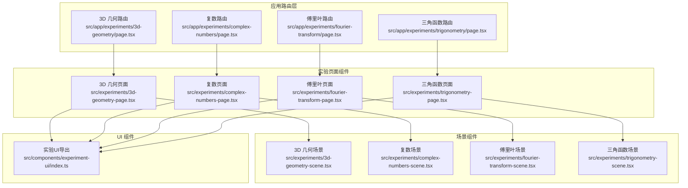
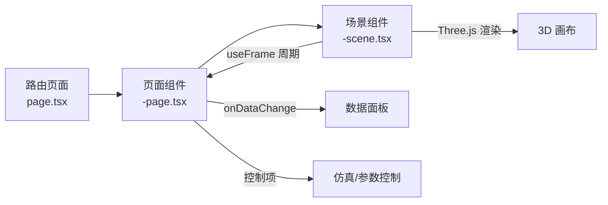
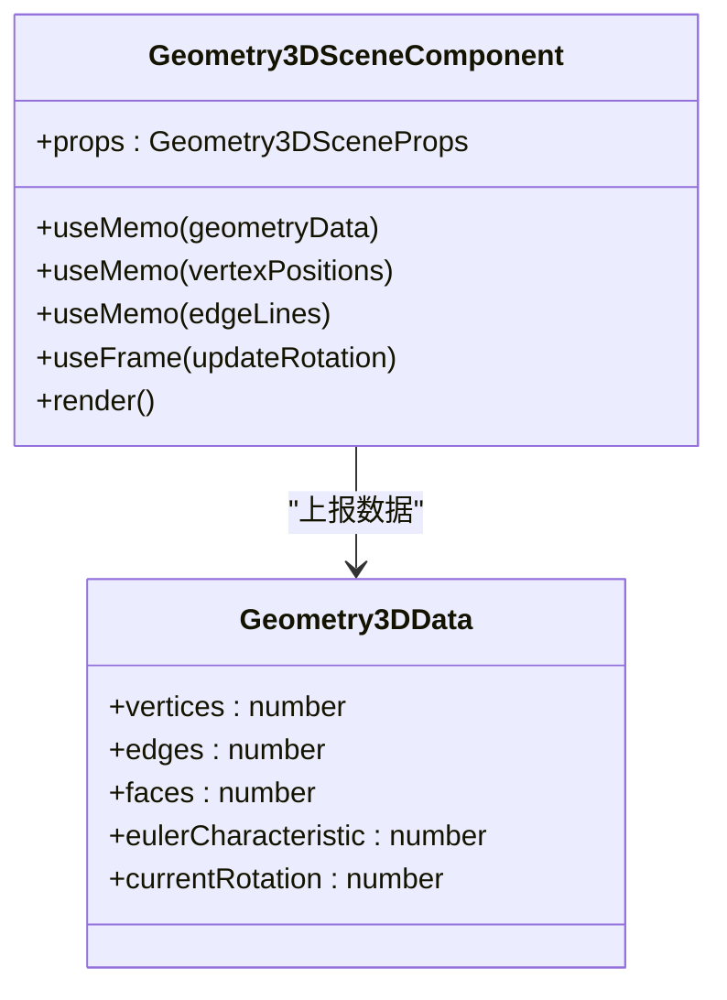
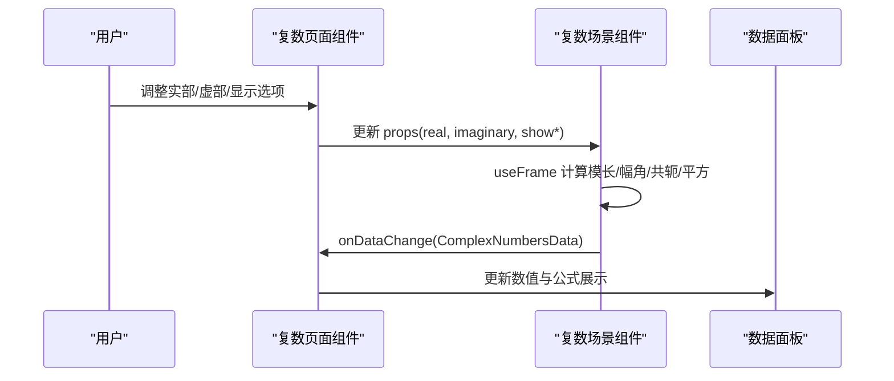
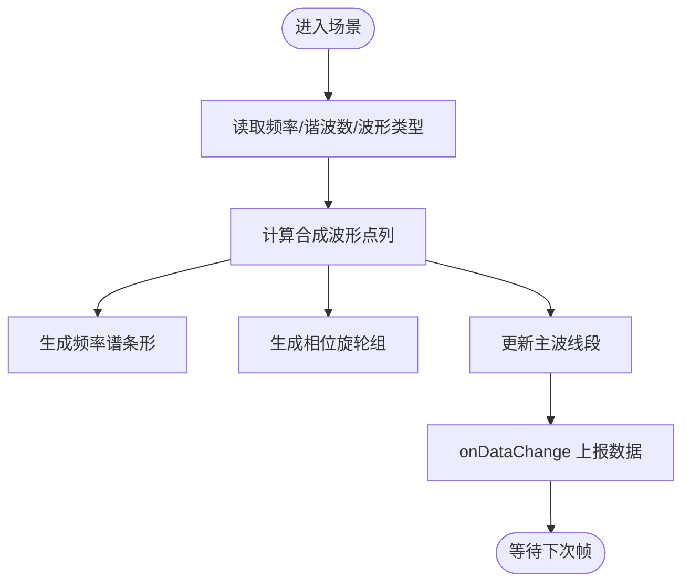
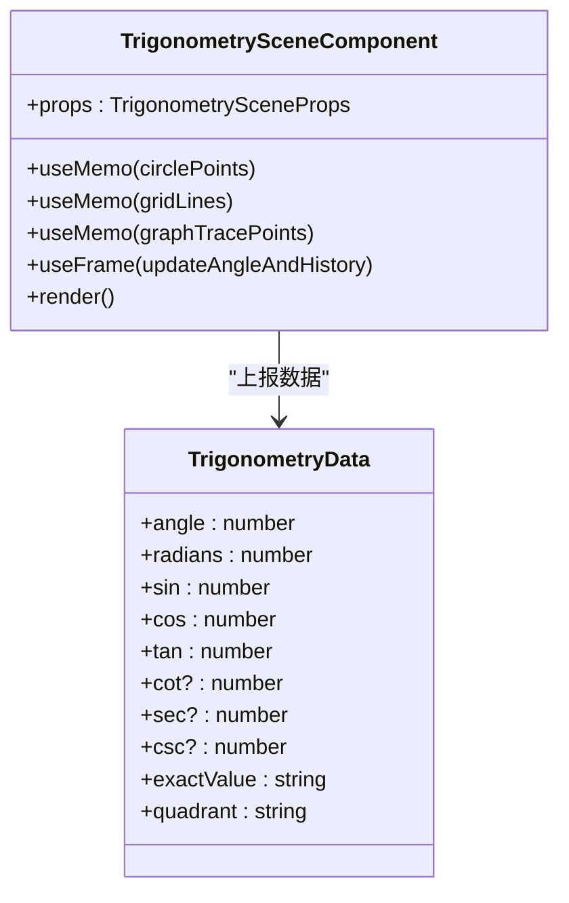
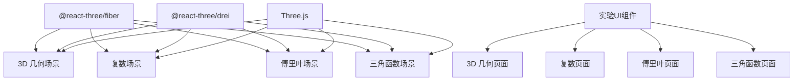

# 数学类实验

<cite>
**本文档引用的文件**
- [src/app/experiments/3d-geometry/page.tsx](file://src/app/experiments/3d-geometry/page.tsx)
- [src/experiments/3d-geometry-page.tsx](file://src/experiments/3d-geometry-page.tsx)
- [src/experiments/3d-geometry-scene.tsx](file://src/experiments/3d-geometry-scene.tsx)
- [src/app/experiments/3d-geometry/details/page.tsx](file://src/app/experiments/3d-geometry/details/page.tsx)
- [src/app/experiments/complex-numbers/page.tsx](file://src/app/experiments/complex-numbers/page.tsx)
- [src/experiments/complex-numbers-page.tsx](file://src/experiments/complex-numbers-page.tsx)
- [src/experiments/complex-numbers-scene.tsx](file://src/experiments/complex-numbers-scene.tsx)
- [src/app/experiments/complex-numbers/details/page.tsx](file://src/app/experiments/complex-numbers/details/page.tsx)
- [src/app/experiments/fourier-transform/page.tsx](file://src/app/experiments/fourier-transform/page.tsx)
- [src/experiments/fourier-transform-page.tsx](file://src/experiments/fourier-transform-page.tsx)
- [src/experiments/fourier-transform-scene.tsx](file://src/experiments/fourier-transform-scene.tsx)
- [src/app/experiments/fourier-transform/details/page.tsx](file://src/app/experiments/fourier-transform/details/page.tsx)
- [src/app/experiments/trigonometry/page.tsx](file://src/app/experiments/trigonometry/page.tsx)
- [src/experiments/trigonometry-page.tsx](file://src/experiments/trigonometry-page.tsx)
- [src/experiments/trigonometry-scene.tsx](file://src/experiments/trigonometry-scene.tsx)
- [src/app/experiments/trigonometry/details/page.tsx](file://src/app/experiments/trigonometry/details/page.tsx)
- [src/components/experiment-ui/index.ts](file://src/components/experiment-ui/index.ts)
- [src/data/experiments.ts](file://src/data/experiments.ts)
</cite>

## 目录
1. [引言](#引言)
2. [项目结构](#项目结构)
3. [核心组件](#核心组件)
4. [架构总览](#架构总览)
5. [详细组件分析](#详细组件分析)
6. [依赖分析](#依赖分析)
7. [性能考虑](#性能考虑)
8. [故障排除指南](#故障排除指南)
9. [结论](#结论)
10. [附录](#附录)

## 引言
本项目是一套基于Web的数学类交互式实验平台，聚焦于三大数学主题的三维可视化：几何体与拓扑（3D几何）、复数与平面（复数运算）、傅里叶变换与信号处理（频域分析），以及三角函数的几何解释与动画展示。通过Three.js与@react-three/fiber构建3D场景，结合React状态管理与自定义UI控件，用户可以直观地探索数学概念与其在空间中的几何对应关系。

## 项目结构
- 应用路由层位于 src/app/experiments 下，每个实验对应一个路由页面，负责元数据与页面入口。
- 实验页面组件位于 src/experiments 下，封装参数控制、数据面板、仿真控制器与3D场景组件。
- 场景组件位于 src/experiments 下，使用 @react-three/fiber 与 Three.js 实现3D渲染与动画。
- UI 控件位于 src/components/experiment-ui，提供统一的控制面板、滑杆、数据网格等组件。
- 全局实验清单与分类信息位于 src/data/experiments.ts。

**图表来源**
- [src/app/experiments/3d-geometry/page.tsx:1-9](file://src/app/experiments/3d-geometry/page.tsx#L1-L9)
- [src/experiments/3d-geometry-page.tsx:1-190](file://src/experiments/3d-geometry-page.tsx#L1-L190)
- [src/experiments/3d-geometry-scene.tsx:1-243](file://src/experiments/3d-geometry-scene.tsx#L1-L243)
- [src/app/experiments/complex-numbers/page.tsx:1-9](file://src/app/experiments/complex-numbers/page.tsx#L1-L9)
- [src/experiments/complex-numbers-page.tsx:1-161](file://src/experiments/complex-numbers-page.tsx#L1-L161)
- [src/experiments/complex-numbers-scene.tsx:1-237](file://src/experiments/complex-numbers-scene.tsx#L1-L237)
- [src/app/experiments/fourier-transform/page.tsx:1-9](file://src/app/experiments/fourier-transform/page.tsx#L1-L9)
- [src/experiments/fourier-transform-page.tsx:1-209](file://src/experiments/fourier-transform-page.tsx#L1-L209)
- [src/experiments/fourier-transform-scene.tsx:1-287](file://src/experiments/fourier-transform-scene.tsx#L1-L287)
- [src/app/experiments/trigonometry/page.tsx:1-9](file://src/app/experiments/trigonometry/page.tsx#L1-L9)
- [src/experiments/trigonometry-page.tsx:1-185](file://src/experiments/trigonometry-page.tsx#L1-L185)
- [src/experiments/trigonometry-scene.tsx:1-632](file://src/experiments/trigonometry-scene.tsx#L1-L632)
- [src/components/experiment-ui/index.ts:1-43](file://src/components/experiment-ui/index.ts#L1-L43)

**章节来源**
- [src/app/experiments/3d-geometry/page.tsx:1-9](file://src/app/experiments/3d-geometry/page.tsx#L1-L9)
- [src/experiments/3d-geometry-page.tsx:1-190](file://src/experiments/3d-geometry-page.tsx#L1-L190)
- [src/experiments/3d-geometry-scene.tsx:1-243](file://src/experiments/3d-geometry-scene.tsx#L1-L243)
- [src/app/experiments/complex-numbers/page.tsx:1-9](file://src/app/experiments/complex-numbers/page.tsx#L1-L9)
- [src/experiments/complex-numbers-page.tsx:1-161](file://src/experiments/complex-numbers-page.tsx#L1-L161)
- [src/experiments/complex-numbers-scene.tsx:1-237](file://src/experiments/complex-numbers-scene.tsx#L1-L237)
- [src/app/experiments/fourier-transform/page.tsx:1-9](file://src/app/experiments/fourier-transform/page.tsx#L1-L9)
- [src/experiments/fourier-transform-page.tsx:1-209](file://src/experiments/fourier-transform-page.tsx#L1-L209)
- [src/experiments/fourier-transform-scene.tsx:1-287](file://src/experiments/fourier-transform-scene.tsx#L1-L287)
- [src/app/experiments/trigonometry/page.tsx:1-9](file://src/app/experiments/trigonometry/page.tsx#L1-L9)
- [src/experiments/trigonometry-page.tsx:1-185](file://src/experiments/trigonometry-page.tsx#L1-L185)
- [src/experiments/trigonometry-scene.tsx:1-632](file://src/experiments/trigonometry-scene.tsx#L1-L632)
- [src/components/experiment-ui/index.ts:1-43](file://src/components/experiment-ui/index.ts#L1-L43)

## 核心组件
- 路由页面：每个实验的 Next.js 路由页面，负责设置动态渲染与页面元数据。
- 页面组件：封装参数控制、数据面板、仿真控制器与3D场景组件，协调状态与事件。
- 场景组件：基于 @react-three/fiber 的3D渲染器，使用 Three.js 几何体与材质实现可视化；通过 useFrame 驱动动画与数据更新。
- UI 控件：统一的控制面板、滑杆、数据网格、仿真控制器等，保证一致的交互体验。

**章节来源**
- [src/experiments/3d-geometry-page.tsx:1-190](file://src/experiments/3d-geometry-page.tsx#L1-L190)
- [src/experiments/3d-geometry-scene.tsx:1-243](file://src/experiments/3d-geometry-scene.tsx#L1-L243)
- [src/experiments/complex-numbers-page.tsx:1-161](file://src/experiments/complex-numbers-page.tsx#L1-L161)
- [src/experiments/complex-numbers-scene.tsx:1-237](file://src/experiments/complex-numbers-scene.tsx#L1-L237)
- [src/experiments/fourier-transform-page.tsx:1-209](file://src/experiments/fourier-transform-page.tsx#L1-L209)
- [src/experiments/fourier-transform-scene.tsx:1-287](file://src/experiments/fourier-transform-scene.tsx#L1-L287)
- [src/experiments/trigonometry-page.tsx:1-185](file://src/experiments/trigonometry-page.tsx#L1-L185)
- [src/experiments/trigonometry-scene.tsx:1-632](file://src/experiments/trigonometry-scene.tsx#L1-L632)
- [src/components/experiment-ui/index.ts:1-43](file://src/components/experiment-ui/index.ts#L1-L43)

## 架构总览
系统采用“路由页面 → 页面组件 → 场景组件”的分层架构。页面组件通过 props 将参数传递给场景组件，场景组件内部维护物理状态与帧循环，周期性计算并上报数据到页面组件，页面组件再驱动数据面板与控制面板更新。

**图表来源**
- [src/experiments/3d-geometry-page.tsx:155-163](file://src/experiments/3d-geometry-page.tsx#L155-L163)
- [src/experiments/3d-geometry-scene.tsx:131-153](file://src/experiments/3d-geometry-scene.tsx#L131-L153)
- [src/experiments/complex-numbers-page.tsx:136-146](file://src/experiments/complex-numbers-page.tsx#L136-L146)
- [src/experiments/complex-numbers-scene.tsx:77-92](file://src/experiments/complex-numbers-scene.tsx#L77-L92)
- [src/experiments/fourier-transform-page.tsx:175-182](file://src/experiments/fourier-transform-page.tsx#L175-L182)
- [src/experiments/fourier-transform-scene.tsx:105-132](file://src/experiments/fourier-transform-scene.tsx#L105-L132)
- [src/experiments/trigonometry-page.tsx:151-164](file://src/experiments/trigonometry-page.tsx#L151-L164)
- [src/experiments/trigonometry-scene.tsx:141-173](file://src/experiments/trigonometry-scene.tsx#L141-L173)

## 详细组件分析

### 3D 几何可视化实验
- 功能概述：展示五种柏拉图立体（四面体、立方体、八面体、十二面体、二十面体）的旋转与线框显示；实时统计顶点数、边数、面数与欧拉示性数；可切换顶点与边的高亮显示。
- 关键实现：
  - 几何体生成：根据形状类型选择 Three.js 对应几何体。
  - 边缘提取：从索引属性中遍历三角面，生成边的线段点集。
  - 顶点去重：对位置向量进行格式化后去重，避免重复绘制。
  - 欧拉公式：在每次帧循环中计算 V - E + F 并上报。
  - 双锥提示：根据当前形状显示其对偶形状以帮助理解对偶关系。
- 交互与控制：旋转速度、线框模式、顶点/边显示开关、播放/暂停与重置。

**图表来源**
- [src/experiments/3d-geometry-scene.tsx:8-24](file://src/experiments/3d-geometry-scene.tsx#L8-L24)
- [src/experiments/3d-geometry-scene.tsx:30-240](file://src/experiments/3d-geometry-scene.tsx#L30-L240)

**章节来源**
- [src/experiments/3d-geometry-page.tsx:1-190](file://src/experiments/3d-geometry-page.tsx#L1-L190)
- [src/experiments/3d-geometry-scene.tsx:1-243](file://src/experiments/3d-geometry-scene.tsx#L1-L243)
- [src/app/experiments/3d-geometry/details/page.tsx:1-84](file://src/app/experiments/3d-geometry/details/page.tsx#L1-L84)

### 复数运算可视化实验
- 功能概述：在阿甘平面（复平面）上可视化复数及其极坐标形式；支持共轭、平方等运算的几何解释；可旋转视角观察复数的模长与幅角。
- 关键实现：
  - 参数化：实部与虚部作为可调参数，实时计算模长与幅角。
  - 运算可视化：共轭在实轴反射；平方通过向量旋转与缩放体现。
  - 动画：整体组按时间累积旋转，提升3D感知。
- 数据流：useFrame 每8帧计算一次并调用 onDataChange 上报。

**图表来源**
- [src/experiments/complex-numbers-page.tsx:16-161](file://src/experiments/complex-numbers-page.tsx#L16-L161)
- [src/experiments/complex-numbers-scene.tsx:33-92](file://src/experiments/complex-numbers-scene.tsx#L33-L92)

**章节来源**
- [src/experiments/complex-numbers-page.tsx:1-161](file://src/experiments/complex-numbers-page.tsx#L1-L161)
- [src/experiments/complex-numbers-scene.tsx:1-237](file://src/experiments/complex-numbers-scene.tsx#L1-L237)
- [src/app/experiments/complex-numbers/details/page.tsx:1-93](file://src/app/experiments/complex-numbers/details/page.tsx#L1-L93)

### 傅里叶变换动态演示
- 功能概述：通过叠加正弦谐波合成任意波形；实时显示频率谱与相位旋轮图；支持多种波形类型与谐波数量调节。
- 关键实现：
  - 波形合成：根据波形类型（方波、三角波、锯齿波、自定义）累加谐波，使用回调缓存减少重复计算。
  - 频率谱：按谐波序号绘制条形高度，颜色随序号变化形成渐变。
  - 相位旋轮：多个同心圆与旋轮箭头展示各次谐波的相位演化。
- 数据流：useFrame 更新时间与点列，每8帧上报当前幅度与谐波数。

**图表来源**
- [src/experiments/fourier-transform-scene.tsx:53-91](file://src/experiments/fourier-transform-scene.tsx#L53-L91)
- [src/experiments/fourier-transform-scene.tsx:134-172](file://src/experiments/fourier-transform-scene.tsx#L134-L172)
- [src/experiments/fourier-transform-scene.tsx:105-132](file://src/experiments/fourier-transform-scene.tsx#L105-L132)

**章节来源**
- [src/experiments/fourier-transform-page.tsx:1-209](file://src/experiments/fourier-transform-page.tsx#L1-L209)
- [src/experiments/fourier-transform-scene.tsx:1-287](file://src/experiments/fourier-transform-scene.tsx#L1-L287)
- [src/app/experiments/fourier-transform/details/page.tsx:1-162](file://src/app/experiments/fourier-transform/details/page.tsx#L1-L162)

### 三角函数的几何解释与动画
- 功能概述：单位圆上的角度动画，实时展示正弦、余弦、正切等函数值；可选显示余割、正割、余切；同步绘制波形轨迹。
- 关键实现：
  - 单位圆与网格：高分辨率点列构成圆周与背景网格。
  - 函数线段：余弦沿x轴投影，正弦沿y轴投影；正切与余切分别从x=1与y=1处引出。
  - 特殊角参考：内置特殊角度表，自动匹配并高亮显示。
  - 波形追踪：记录历史角度与函数值，绘制sin/cos轨迹。
- 数据流：useFrame 自动推进角度，8帧一次更新数据与界面。

**图表来源**
- [src/experiments/trigonometry-scene.tsx:8-37](file://src/experiments/trigonometry-scene.tsx#L8-L37)
- [src/experiments/trigonometry-scene.tsx:60-632](file://src/experiments/trigonometry-scene.tsx#L60-L632)

**章节来源**
- [src/experiments/trigonometry-page.tsx:1-185](file://src/experiments/trigonometry-page.tsx#L1-L185)
- [src/experiments/trigonometry-scene.tsx:1-632](file://src/experiments/trigonometry-scene.tsx#L1-L632)
- [src/app/experiments/trigonometry/details/page.tsx:1-89](file://src/app/experiments/trigonometry/details/page.tsx#L1-L89)

### 数学概念与3D可视化的对应关系
- 坐标系统：所有场景均使用右手笛卡尔坐标系，单位圆与复平面采用x轴为实部/余弦、y轴为虚部/正弦的约定。
- 变换矩阵：页面组件通过 Three.js 的 mesh.rotation 与 group.rotation 实现旋转；场景组件内部使用旋转角度累计而非直接传入矩阵。
- 数学公式实现：
  - 3D几何：欧拉示性数 χ = V - E + F；双锥提示体现对偶关系。
  - 复数：模长 |z| = √(a² + b²)，幅角 arg(z) = arctan(b/a)；共轭与平方的几何意义。
  - 傅里叶：合成波形 f(x) = Σ aₙ·sin(n·ω·x)；频率谱与相位旋轮。
  - 三角函数：sin²θ + cos²θ = 1；正切、余切、正割、余割的几何构造。

**章节来源**
- [src/experiments/3d-geometry-scene.tsx:122-129](file://src/experiments/3d-geometry-scene.tsx#L122-L129)
- [src/experiments/complex-numbers-scene.tsx:52-63](file://src/experiments/complex-numbers-scene.tsx#L52-L63)
- [src/experiments/fourier-transform-scene.tsx:58-91](file://src/experiments/fourier-transform-scene.tsx#L58-L91)
- [src/experiments/trigonometry-scene.tsx:195-231](file://src/experiments/trigonometry-scene.tsx#L195-L231)

## 依赖分析
- 外部库：@react-three/fiber 提供 React 与 Three.js 的桥接；@react-three/drei 提供 Line、Html、Text 等增强组件；Three.js 提供几何体、材质与渲染管线。
- 内部依赖：页面组件依赖 UI 控件集合；场景组件依赖 Three.js 几何与材质；数据面板依赖页面组件提供的数据对象。

**图表来源**
- [src/experiments/3d-geometry-scene.tsx:1-7](file://src/experiments/3d-geometry-scene.tsx#L1-L7)
- [src/experiments/complex-numbers-scene.tsx:1-7](file://src/experiments/complex-numbers-scene.tsx#L1-L7)
- [src/experiments/fourier-transform-scene.tsx:1-7](file://src/experiments/fourier-transform-scene.tsx#L1-L7)
- [src/experiments/trigonometry-scene.tsx:1-7](file://src/experiments/trigonometry-scene.tsx#L1-L7)
- [src/components/experiment-ui/index.ts:1-43](file://src/components/experiment-ui/index.ts#L1-L43)

**章节来源**
- [src/experiments/3d-geometry-scene.tsx:1-7](file://src/experiments/3d-geometry-scene.tsx#L1-L7)
- [src/experiments/complex-numbers-scene.tsx:1-7](file://src/experiments/complex-numbers-scene.tsx#L1-L7)
- [src/experiments/fourier-transform-scene.tsx:1-7](file://src/experiments/fourier-transform-scene.tsx#L1-L7)
- [src/experiments/trigonometry-scene.tsx:1-7](file://src/experiments/trigonometry-scene.tsx#L1-L7)
- [src/components/experiment-ui/index.ts:1-43](file://src/components/experiment-ui/index.ts#L1-L43)

## 性能考虑
- 帧循环节流：场景组件普遍采用每8帧更新一次 React 状态与上报数据，降低渲染压力。
- 几何计算缓存：Fourier 场景使用回调缓存与 useMemo 优化谐波点列与频谱条形生成。
- 线段与点列：单位圆与波形轨迹使用高分辨率点列，注意在大数据量时的内存与GPU带宽消耗。
- 材质透明度：线框与半透明材质会增加混合开销，建议在低端设备上适度关闭透明或线框模式。

[本节为通用指导，无需具体文件引用]

## 故障排除指南
- 场景不显示或黑屏：检查 Three.js 几何体是否正确创建，光源与相机位置是否合理。
- 数据面板无更新：确认场景组件已调用 onDataChange，且页面组件正确接收并传递给 DataPanel。
- 旋转异常：检查 useFrame 中的时间增量与旋转速度参数，确保未被外部状态覆盖。
- 性能抖动：减少同时启用的可视化元素（如过多谐波、高分辨率圆周点列），或提高帧节流间隔。

**章节来源**
- [src/experiments/3d-geometry-scene.tsx:131-153](file://src/experiments/3d-geometry-scene.tsx#L131-L153)
- [src/experiments/complex-numbers-scene.tsx:77-92](file://src/experiments/complex-numbers-scene.tsx#L77-L92)
- [src/experiments/fourier-transform-scene.tsx:105-132](file://src/experiments/fourier-transform-scene.tsx#L105-L132)
- [src/experiments/trigonometry-scene.tsx:141-173](file://src/experiments/trigonometry-scene.tsx#L141-L173)

## 结论
该数学类实验平台通过统一的页面与场景架构，将抽象的数学概念映射到直观的3D可视化中。3D几何实验展示了拓扑与欧拉公式；复数实验将代数运算转化为几何变换；傅里叶实验揭示了时域与频域的关系；三角函数实验则建立了角度、比值与周期波之间的联系。配合教学设计与学习路径，可有效提升学生对高等数学的空间理解与直觉认知。

[本节为总结性内容，无需具体文件引用]

## 附录

### 教学设计与学习路径建议
- 初学者路径（3D几何 → 三角函数 → 复数）
  - 3D几何：认识柏拉图立体与欧拉公式，建立空间想象力。
  - 三角函数：在单位圆上理解基本函数与恒等式，衔接后续复数。
  - 复数：在阿甘平面上理解模长与幅角，为傅里叶打基础。
- 进阶路径（傅里叶 → 复数 → 三角函数）
  - 傅里叶：从合成波形入手，理解频率与谐波。
  - 复数：深入极坐标与旋转，理解复指数与相位。
  - 三角函数：回到单位圆，深化恒等式与特殊角。
- 专题强化（任选一主题深入）
  - 3D几何：对偶多面体、截面与投影。
  - 复数：复平面运算、留数与复变函数。
  - 傅里叶：离散变换、滤波与压缩。
  - 三角函数：解析几何中的三角恒等式、球面三角。

[本节为教学建议，无需具体文件引用]