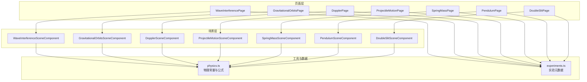
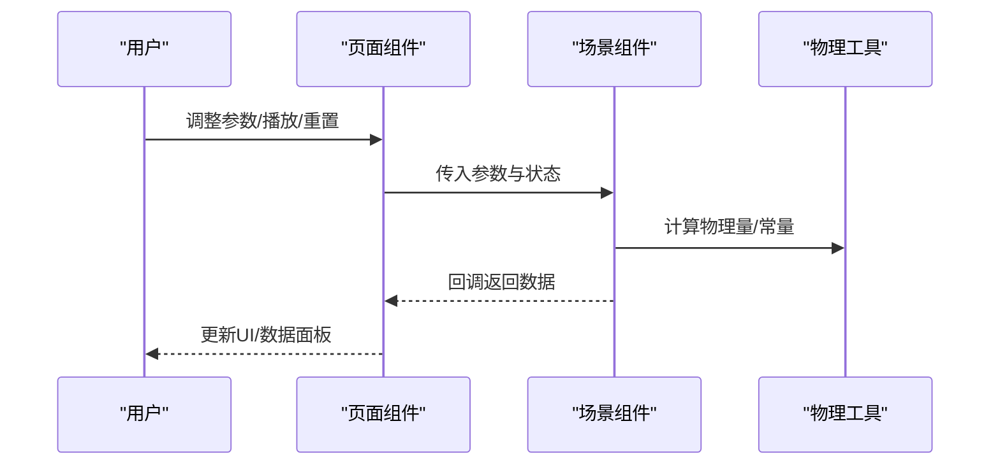
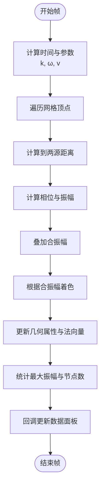
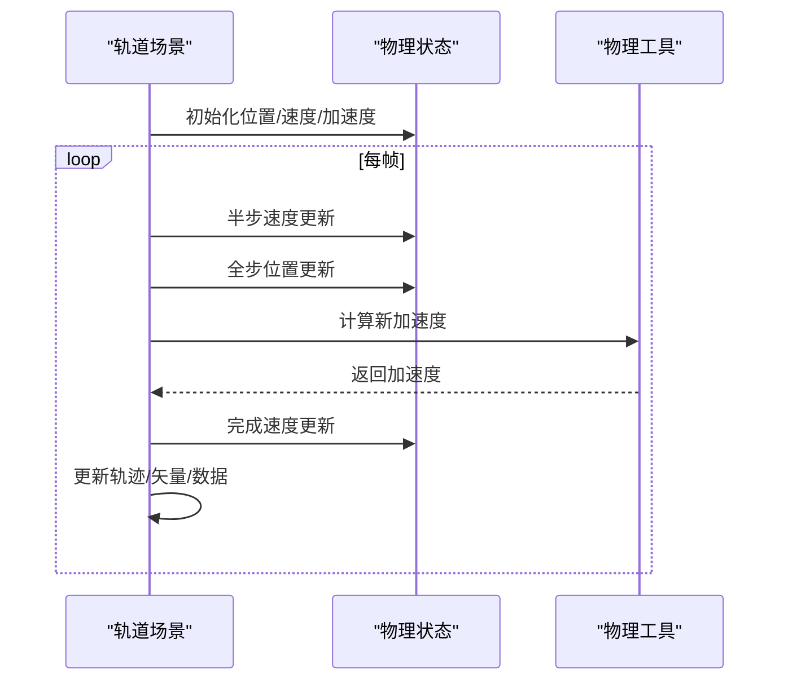
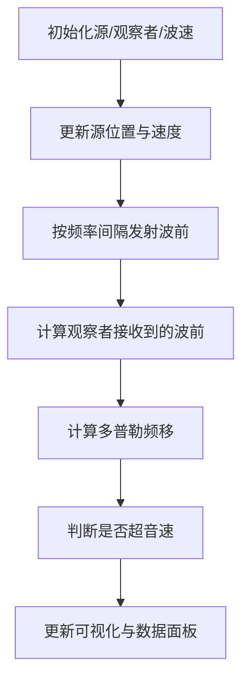
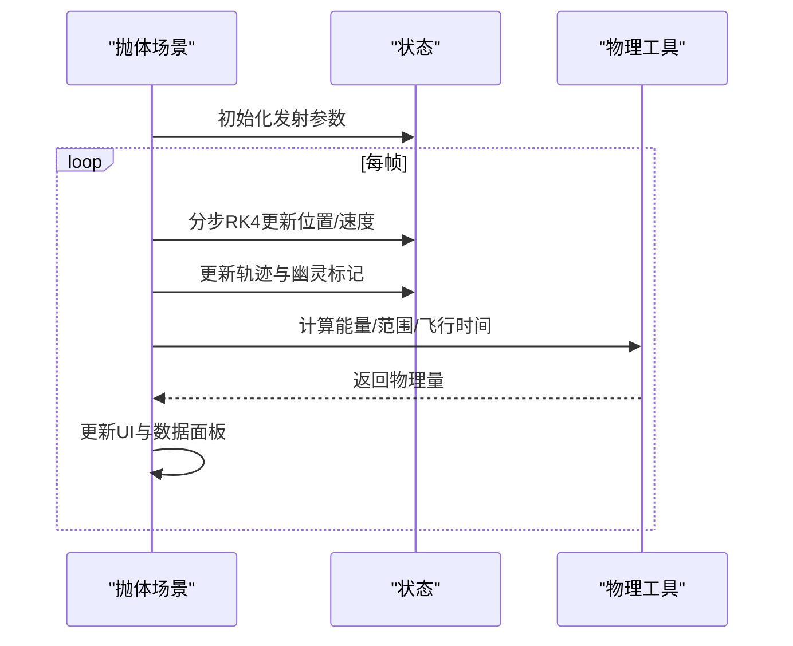
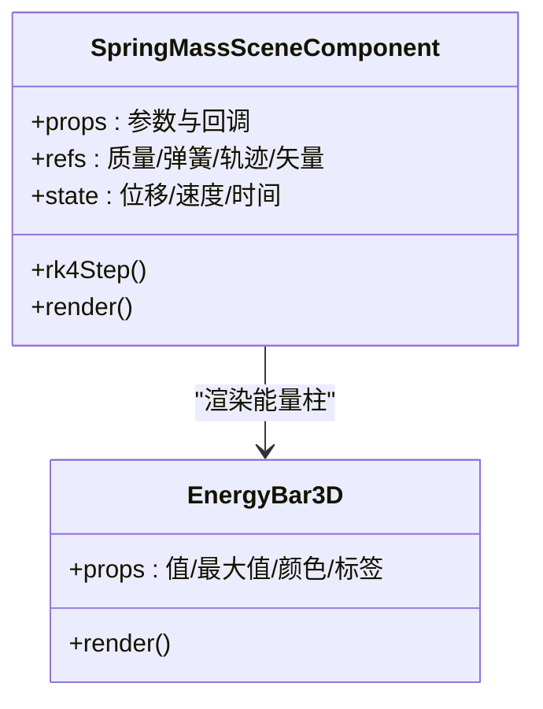
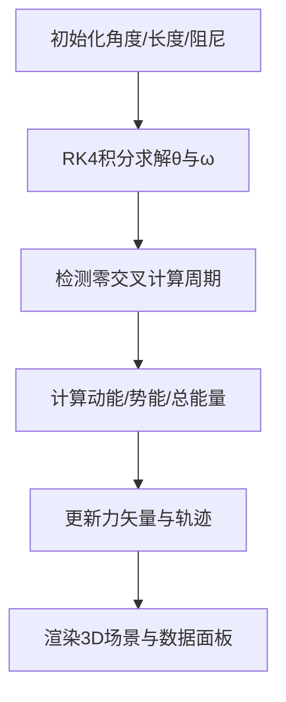
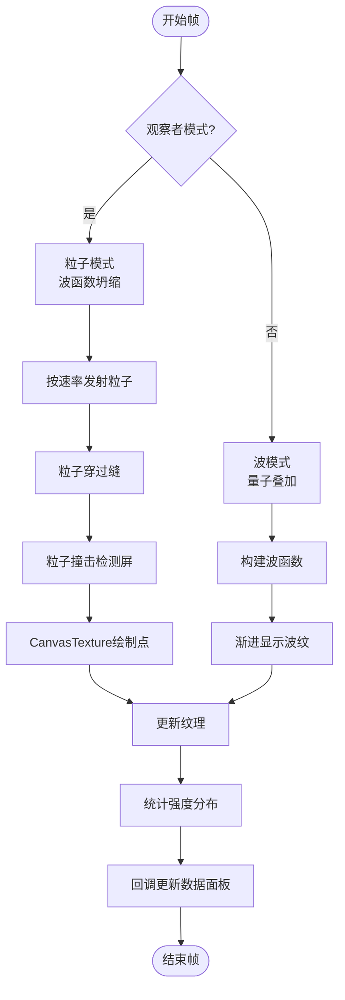
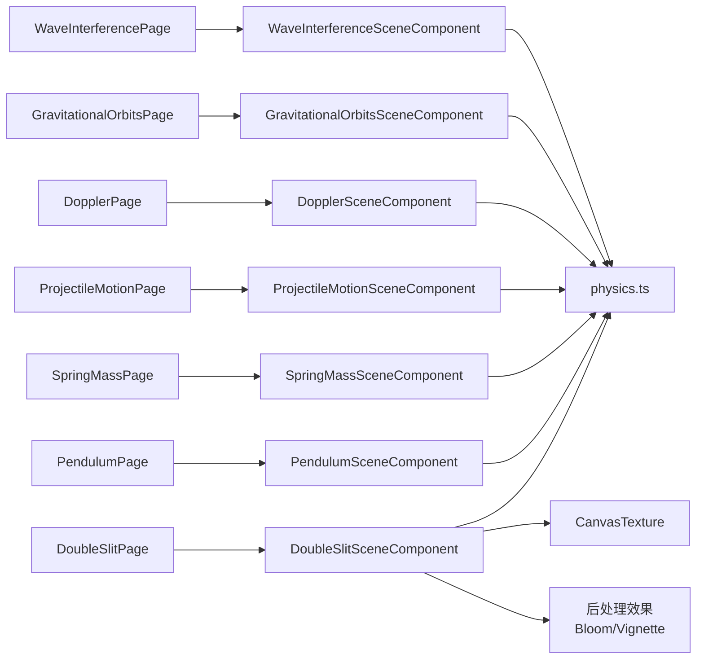

# 物理类实验

<cite>
**本文档引用的文件**
- [wave-interference-page.tsx](file://src/experiments/wave-interference-page.tsx)
- [wave-interference-scene.tsx](file://src/experiments/wave-interference-scene.tsx)
- [gravitational-orbits-page.tsx](file://src/experiments/gravitational-orbits-page.tsx)
- [gravitational-orbits-scene.tsx](file://src/experiments/gravitational-orbits-scene.tsx)
- [doppler-page.tsx](file://src/experiments/doppler-page.tsx)
- [doppler-scene.tsx](file://src/experiments/doppler-scene.tsx)
- [projectile-motion-page.tsx](file://src/experiments/projectile-motion-page.tsx)
- [projectile-motion-scene.tsx](file://src/experiments/projectile-motion-scene.tsx)
- [spring-mass-page.tsx](file://src/experiments/spring-mass-page.tsx)
- [spring-mass-scene.tsx](file://src/experiments/spring-mass-scene.tsx)
- [pendulum-page.tsx](file://src/experiments/pendulum-page.tsx)
- [pendulum-scene.tsx](file://src/experiments/pendulum-scene.tsx)
- [double-slit-page.tsx](file://src/experiments/double-slit-page.tsx)
- [double-slit-scene.tsx](file://src/experiments/double-slit-scene.tsx)
- [physics.ts](file://src/utils/physics.ts)
- [experiments.ts](file://src/data/experiments.ts)
</cite>

## 更新摘要
**所做更改**
- 新增双缝实验章节，详细介绍量子力学中的波粒二象性演示
- 更新核心组件部分，增加双缝实验相关内容
- 新增双缝实验的详细组件分析
- 更新架构总览，包含新的双缝实验场景
- 新增双缝实验的依赖关系分析
- 更新性能考虑，包含CanvasTexture和后处理效果
- 新增双缝实验的故障排除指南

## 目录
1. [引言](#引言)
2. [项目结构](#项目结构)
3. [核心组件](#核心组件)
4. [架构总览](#架构总览)
5. [详细组件分析](#详细组件分析)
6. [依赖关系分析](#依赖关系分析)
7. [性能考虑](#性能考虑)
8. [故障排除指南](#故障排除指南)
9. [结论](#结论)
10. [附录](#附录)

## 引言
本项目为一个基于Web的物理类实验平台，通过Three.js与React Three Fiber构建交互式3D可视化实验，涵盖波动干涉、引力轨道、多普勒效应、抛体运动、简谐振动（弹簧振子与单摆）、**双缝实验**等经典物理现象。每个实验均提供参数化控制面板、实时数据面板与教学细节页面，帮助学习者从数学模型到3D可视化进行深度理解。

**更新** 新增了双缝实验，专门演示量子力学中的波粒二象性，通过观察者效应展示波函数坍缩现象。

## 项目结构
- 实验页面层：每个实验对应一个页面组件，负责参数控制、仿真控制器与数据面板的布局与状态管理。
- 实验场景层：每个实验对应一个3D场景组件，使用useFrame进行每帧更新，维护物理状态与渲染逻辑。
- 工具与数据层：共享物理常量与公式工具函数，以及实验元数据配置。
- UI组件层：统一的实验容器、控制面板、数据网格、仿真控制器等可复用UI组件。

**图表来源**
- [wave-interference-page.tsx:20-185](file://src/experiments/wave-interference-page.tsx#L20-L185)
- [gravitational-orbits-page.tsx:27-383](file://src/experiments/gravitational-orbits-page.tsx#L27-L383)
- [doppler-page.tsx:19-277](file://src/experiments/doppler-page.tsx#L19-L277)
- [projectile-motion-page.tsx:32-288](file://src/experiments/projectile-motion-page.tsx#L32-L288)
- [spring-mass-page.tsx:19-206](file://src/experiments/spring-mass-page.tsx#L19-L206)
- [pendulum-page.tsx:29-213](file://src/experiments/pendulum-page.tsx#L29-L213)
- [double-slit-page.tsx:19-216](file://src/experiments/double-slit-page.tsx#L19-L216)
- [physics.ts:10-22](file://src/utils/physics.ts#L10-L22)
- [experiments.ts:12-123](file://src/data/experiments.ts#L12-L123)

**章节来源**
- [wave-interference-page.tsx:1-186](file://src/experiments/wave-interference-page.tsx#L1-L186)
- [gravitational-orbits-page.tsx:1-384](file://src/experiments/gravitational-orbits-page.tsx#L1-L384)
- [doppler-page.tsx:1-278](file://src/experiments/doppler-page.tsx#L1-L278)
- [projectile-motion-page.tsx:1-289](file://src/experiments/projectile-motion-page.tsx#L1-L289)
- [spring-mass-page.tsx:1-207](file://src/experiments/spring-mass-page.tsx#L1-L207)
- [pendulum-page.tsx:1-214](file://src/experiments/pendulum-page.tsx#L1-L214)
- [double-slit-page.tsx:1-216](file://src/experiments/double-slit-page.tsx#L1-L216)
- [physics.ts:1-687](file://src/utils/physics.ts#L1-L687)
- [experiments.ts:1-492](file://src/data/experiments.ts#L1-L492)

## 核心组件
- 波动干涉实验：双点源波面叠加，实时计算干涉节点，可视化红/蓝色相位与亮/暗条纹。
- 引力轨道实验：二体/多体轨道数值积分（速度Verlet），计算轨道类型、能量与角动量。
- 多普勒效应实验：移动声源发射波前，实时计算观察者接收频率与马赫锥。
- 抛体运动实验：解析与RK4数值解对比，支持空气阻力，提供轨迹、能量与命中目标。
- 简谐振动实验：弹簧振子（单/多质量串联系统）与单摆，RK4求解微分方程，能量守恒可视化。
- **双缝实验：量子力学演示，展示波粒二象性与观察者效应，使用CanvasTexture和后处理效果。**
- 物理公式工具：统一的常量与公式封装，便于跨实验复用。

**更新** 新增双缝实验，专门演示量子力学中的波粒二象性现象。

**章节来源**
- [wave-interference-scene.tsx:46-462](file://src/experiments/wave-interference-scene.tsx#L46-L462)
- [gravitational-orbits-scene.tsx:42-465](file://src/experiments/gravitational-orbits-scene.tsx#L42-L465)
- [doppler-scene.tsx:29-338](file://src/experiments/doppler-scene.tsx#L29-L338)
- [projectile-motion-scene.tsx:105-592](file://src/experiments/projectile-motion-scene.tsx#L105-L592)
- [spring-mass-scene.tsx:185-716](file://src/experiments/spring-mass-scene.tsx#L185-L716)
- [pendulum-scene.tsx:223-800](file://src/experiments/pendulum-scene.tsx#L223-L800)
- [double-slit-scene.tsx:1-478](file://src/experiments/double-slit-scene.tsx#L1-L478)
- [physics.ts:10-687](file://src/utils/physics.ts#L10-L687)

## 架构总览
各实验采用"页面组件 + 场景组件"的分层设计：
- 页面组件负责参数控制、仿真控制器、数据面板与路由跳转。
- 场景组件使用useFrame驱动物理状态更新，通过回调向页面组件传递数据。
- 共享工具模块提供物理常量与公式，确保跨实验一致性。

**图表来源**
- [wave-interference-page.tsx:20-185](file://src/experiments/wave-interference-page.tsx#L20-L185)
- [wave-interference-scene.tsx:46-240](file://src/experiments/wave-interference-scene.tsx#L46-L240)
- [double-slit-page.tsx:19-216](file://src/experiments/double-slit-page.tsx#L19-L216)
- [double-slit-scene.tsx:49-53](file://src/experiments/double-slit-scene.tsx#L49-L53)
- [physics.ts:10-22](file://src/utils/physics.ts#L10-L22)

**章节来源**
- [wave-interference-page.tsx:20-185](file://src/experiments/wave-interference-page.tsx#L20-L185)
- [wave-interference-scene.tsx:46-240](file://src/experiments/wave-interference-scene.tsx#L46-L240)
- [double-slit-page.tsx:19-216](file://src/experiments/double-slit-page.tsx#L19-L216)
- [double-slit-scene.tsx:49-53](file://src/experiments/double-slit-scene.tsx#L49-L53)
- [physics.ts:10-22](file://src/utils/physics.ts#L10-L22)

## 详细组件分析

### 波动干涉实验
- 数学模型：两列相干波的叠加，波数k=2π/λ，角频率ω=2πf，波速v=fλ；合振动振幅由路径差决定，形成明/暗条纹。
- 数值实现：在平面上以高分辨率网格遍历每个顶点，分别计算来自两个点源的距离与相位，叠加得到合振幅；加入距离衰减与顶点着色；周期性计算最大振幅与节点数量。
- 3D可视化：红色代表波峰（正相位），蓝色代表波谷（负相位），节点处添加明亮/暗淡标记；光源增强视觉效果。
- 教学要点：强调波的叠加原理、相长/相消干涉条件、波前与波线的关系。

**图表来源**
- [wave-interference-scene.tsx:131-240](file://src/experiments/wave-interference-scene.tsx#L131-L240)

**章节来源**
- [wave-interference-page.tsx:20-185](file://src/experiments/wave-interference-page.tsx#L20-L185)
- [wave-interference-scene.tsx:46-240](file://src/experiments/wave-interference-scene.tsx#L46-L240)

### 引力轨道系统
- 数学模型：牛顿万有引力F=GMm/r²，轨道能量E=v²/2−GM/r，半长轴a=−GM/(2E)，离心率e=√(1+2Eh²/(GM)²)。
- 数值实现：速度Verlet积分，半步速度更新+全步位置更新+重新计算加速度，保证长期稳定性；计算轨道周期、逃逸速度、角动量与能量。
- 3D可视化：中央恒星发光，行星沿轨道运行，可选显示轨迹与矢量（速度/引力）；支持第二行星与多体模拟。
- 教学要点：开普勒三定律、轨道类型判别、能量与角动量守恒。

**图表来源**
- [gravitational-orbits-scene.tsx:132-286](file://src/experiments/gravitational-orbits-scene.tsx#L132-L286)
- [physics.ts:456-587](file://src/utils/physics.ts#L456-L587)

**章节来源**
- [gravitational-orbits-page.tsx:27-383](file://src/experiments/gravitational-orbits-page.tsx#L27-L383)
- [gravitational-orbits-scene.tsx:42-286](file://src/experiments/gravitational-orbits-scene.tsx#L42-L286)
- [physics.ts:456-587](file://src/utils/physics.ts#L456-L587)

### 多普勒效应演示
- 数学模型：f' = f·v/(v∓vs)，其中vs为源速（远离取+，接近取−）；超音速时出现马赫锥。
- 数值实现：源按简谐或手动轨迹运动，按固定间隔发射波前；观察者位置固定，计算接收频率与频移比，标注蓝移/红移/无位移。
- 3D可视化：波前以环形扩散，压缩区蓝色、膨胀区红色；源方向指示器；马赫锥透明锥体。
- 教学要点：相对运动导致频率变化、波前压缩/膨胀直观理解。

**图表来源**
- [doppler-scene.tsx:78-158](file://src/experiments/doppler-scene.tsx#L78-L158)

**章节来源**
- [doppler-page.tsx:19-277](file://src/experiments/doppler-page.tsx#L19-L277)
- [doppler-scene.tsx:29-158](file://src/experiments/doppler-scene.tsx#L29-L158)
- [physics.ts:332-341](file://src/utils/physics.ts#L332-L341)

### 抛体运动分析
- 数学模型：无阻尼：x=v₀cosθ·t，y=v₀sinθ·t−½gt²；有阻尼：采用RK4积分，考虑v²阻力项。
- 数值实现：RK4步进积分，分步稳定；轨迹点缓存与幽灵标记（0.5秒间隔）；目标命中检测与落地判定。
- 3D可视化：发射台、炮弹、轨迹线、速度矢量、距离/高度标记、目标靶；支持预测轨迹（无阻尼）对比。
- 教学要点：轨迹形状、射程与最大高度、能量转化、空气阻力影响。

**图表来源**
- [projectile-motion-scene.tsx:226-375](file://src/experiments/projectile-motion-scene.tsx#L226-L375)
- [physics.ts:98-188](file://src/utils/physics.ts#L98-L188)

**章节来源**
- [projectile-motion-page.tsx:32-288](file://src/experiments/projectile-motion-page.tsx#L32-L288)
- [projectile-motion-scene.tsx:105-375](file://src/experiments/projectile-motion-scene.tsx#L105-L375)
- [physics.ts:98-188](file://src/utils/physics.ts#L98-L188)

### 简谐振动系统（弹簧振子）
- 数学模型：m·d²x/dt² + b·dx/dt + k·x = 0；自然角频率ω=√(k/m)，周期T=2π/ω；能量：KE+PEspring+PEgrav。
- 数值实现：RK4积分，支持单质量与串联多质量系统；弹簧线圈采用折线生成；轨迹点与矢量（速度/合力）可视化。
- 3D可视化：支撑横梁、弹簧线圈、质量块、轨迹点、能量柱状图（KE/PEspring/PEgrav/Total）。
- 教学要点：简谐运动特征、阻尼对振幅的影响、能量守恒。

**图表来源**
- [spring-mass-scene.tsx:185-716](file://src/experiments/spring-mass-scene.tsx#L185-L716)

**章节来源**
- [spring-mass-page.tsx:19-206](file://src/experiments/spring-mass-page.tsx#L19-L206)
- [spring-mass-scene.tsx:185-716](file://src/experiments/spring-mass-scene.tsx#L185-L716)
- [physics.ts:194-236](file://src/utils/physics.ts#L194-L236)

### 简谐振动系统（单摆）
- 数学模型：大角度修正周期T=T₀(1+θ₀²/16+11θ₀⁴/3072)，能量PE=mgl(1−cosθ)，KE=½ml²(dθ/dt)²。
- 数值实现：RK4求解θ''=−(g/l)sinθ−b·dθ/dt；零交叉计数周期；轨迹年龄渐隐；力矢量（重力/张力/合外力）可视化。
- 3D可视化：真实绳索材质、摆球细节、角度弧、能量柱状图、地面网格与标尺。
- 教学要点：小角度近似与大角度修正、能量守恒、张力与向心力。

**图表来源**
- [pendulum-scene.tsx:314-502](file://src/experiments/pendulum-scene.tsx#L314-L502)

**章节来源**
- [pendulum-page.tsx:29-213](file://src/experiments/pendulum-page.tsx#L29-L213)
- [pendulum-scene.tsx:223-502](file://src/experiments/pendulum-scene.tsx#L223-L502)
- [physics.ts:28-92](file://src/utils/physics.ts#L28-L92)

### 双缝实验（新增）
- 数学模型：双缝干涉强度分布I(y)=I₀cos²(πdy/λL)·sinc²(πay/λL)，其中d为缝间距，a为缝宽，L为缝到屏的距离。
- 数值实现：粒子发射器产生光子，支持两种模式：观察者模式（波函数坍缩，粒子行为）和波模式（量子叠加，波行为）。使用CanvasTexture渲染干涉条纹，结合后处理效果增强视觉效果。
- 3D可视化：发射源、双缝屏障、观察者相机（记录LED指示观察状态）、检测屏（Canvas纹理显示干涉图案）。粒子轨迹可视化，理论曲线叠加显示。
- 教学要点：波粒二象性、观察者效应、量子叠加态、波函数坍缩。

**图表来源**
- [double-slit-scene.tsx:192-296](file://src/experiments/double-slit-scene.tsx#L192-L296)

**章节来源**
- [double-slit-page.tsx:19-216](file://src/experiments/double-slit-page.tsx#L19-L216)
- [double-slit-scene.tsx:1-478](file://src/experiments/double-slit-scene.tsx#L1-L478)
- [physics.ts:616-641](file://src/utils/physics.ts#L616-L641)

## 依赖关系分析
- 页面组件依赖场景组件与UI组件，场景组件依赖物理工具模块。
- 场景组件内部广泛使用refs存储物理状态，避免频繁React重渲染。
- 数据面板与参数面板通过回调与状态切换实现松耦合。
- **双缝实验新增CanvasTexture和后处理效果依赖。**

**更新** 新增双缝实验的依赖关系，包含CanvasTexture和后处理效果的依赖。

**图表来源**
- [wave-interference-page.tsx:20-185](file://src/experiments/wave-interference-page.tsx#L20-L185)
- [gravitational-orbits-page.tsx:27-383](file://src/experiments/gravitational-orbits-page.tsx#L27-L383)
- [doppler-page.tsx:19-277](file://src/experiments/doppler-page.tsx#L19-L277)
- [projectile-motion-page.tsx:32-288](file://src/experiments/projectile-motion-page.tsx#L32-L288)
- [spring-mass-page.tsx:19-206](file://src/experiments/spring-mass-page.tsx#L19-L206)
- [pendulum-page.tsx:29-213](file://src/experiments/pendulum-page.tsx#L29-L213)
- [double-slit-page.tsx:19-216](file://src/experiments/double-slit-page.tsx#L19-L216)
- [double-slit-scene.tsx:6-8](file://src/experiments/double-slit-scene.tsx#L6-L8)
- [physics.ts:10-22](file://src/utils/physics.ts#L10-L22)

**章节来源**
- [wave-interference-page.tsx:20-185](file://src/experiments/wave-interference-page.tsx#L20-L185)
- [gravitational-orbits-page.tsx:27-383](file://src/experiments/gravitational-orbits-page.tsx#L27-L383)
- [doppler-page.tsx:19-277](file://src/experiments/doppler-page.tsx#L19-L277)
- [projectile-motion-page.tsx:32-288](file://src/experiments/projectile-motion-page.tsx#L32-L288)
- [spring-mass-page.tsx:19-206](file://src/experiments/spring-mass-page.tsx#L19-L206)
- [pendulum-page.tsx:29-213](file://src/experiments/pendulum-page.tsx#L29-L213)
- [double-slit-page.tsx:19-216](file://src/experiments/double-slit-page.tsx#L19-L216)
- [double-slit-scene.tsx:6-8](file://src/experiments/double-slit-scene.tsx#L6-L8)
- [physics.ts:10-22](file://src/utils/physics.ts#L10-L22)

## 性能考虑
- 使用refs存储物理状态，useFrame中仅在必要时更新React状态，降低重渲染成本。
- 对网格/轨迹/矢量等几何属性采用BufferAttribute批量更新，减少对象创建。
- 采用帧节流（如每N帧更新一次数据）与子步积分（dt分片）提升稳定性与性能。
- 高分辨率网格与大量粒子渲染时，合理设置最大点数与透明混合模式，避免过度GPU负载。
- **双缝实验使用CanvasTexture进行像素级渲染，优化纹理更新频率，结合后处理效果提升视觉质量。**

**更新** 新增双缝实验的性能考虑，包含CanvasTexture和后处理效果的性能优化策略。

## 故障排除指南
- 场景未响应：检查resetTrigger是否正确触发，确认物理状态重置逻辑。
- 数据不更新：确认useFrame中的帧计数与回调节流条件，确保onDataChange被调用。
- 性能抖动：减少每帧更新频率、降低网格细分度、关闭不必要的可视化元素（如轨迹/矢量）。
- 参数无效：核对页面组件传参与场景组件默认值，确保单位与范围一致。
- **双缝实验纹理不更新：检查CanvasTexture的needsUpdate标志，确保在绘制后正确设置。**
- **双缝实验后处理效果异常：验证EffectComposer配置，检查Bloom和Vignette参数设置。**

**更新** 新增双缝实验的故障排除指南，包含CanvasTexture和后处理效果相关的问题。

**章节来源**
- [wave-interference-scene.tsx:119-129](file://src/experiments/wave-interference-scene.tsx#L119-L129)
- [gravitational-orbits-scene.tsx:115-130](file://src/experiments/gravitational-orbits-scene.tsx#L115-L130)
- [doppler-scene.tsx:67-76](file://src/experiments/doppler-scene.tsx#L67-L76)
- [projectile-motion-scene.tsx:190-224](file://src/experiments/projectile-motion-scene.tsx#L190-L224)
- [spring-mass-scene.tsx:254-269](file://src/experiments/spring-mass-scene.tsx#L254-L269)
- [pendulum-scene.tsx:288-307](file://src/experiments/pendulum-scene.tsx#L288-L307)
- [double-slit-scene.tsx:132-142](file://src/experiments/double-slit-scene.tsx#L132-L142)

## 结论
本项目通过严谨的物理建模与高效的3D渲染，将波动、轨道、声学、振动与**量子力学**等抽象概念转化为直观可操作的交互体验。配合参数化控制与数据面板，既满足教学演示需求，又利于培养科学思维与问题解决能力。

**更新** 新增双缝实验进一步丰富了量子力学教学内容，通过观察者效应深入演示波粒二象性这一量子力学核心概念。

## 附录
- 实验元数据：包含实验主题、难度、图标与颜色，便于导航与分类展示。
- 物理常量：统一的SI单位常量表，确保跨实验一致性与可读性。

**章节来源**
- [experiments.ts:12-123](file://src/data/experiments.ts#L12-L123)
- [physics.ts:10-22](file://src/utils/physics.ts#L10-L22)