# 伯努利原理（文丘里管）实验

<cite>
**本文档引用的文件**
- [bernoulli-venturi-page.tsx](file://src/experiments/bernoulli-venturi-page.tsx)
- [bernoulli-venturi-scene.tsx](file://src/experiments/bernoulli-venturi-scene.tsx)
- [page.tsx](file://src/app/experiments/bernoulli-venturi/page.tsx)
- [details/page.tsx](file://src/app/experiments/bernoulli-venturi/details/page.tsx)
- [experiments.ts](file://src/data/experiments.ts)
- [physics.ts](file://src/utils/physics.ts)
- [index.ts](file://src/components/experiment-ui/index.ts)
- [package.json](file://package.json)
</cite>

## 目录
1. [简介](#简介)
2. [项目结构](#项目结构)
3. [核心组件](#核心组件)
4. [架构概览](#架构概览)
5. [详细组件分析](#详细组件分析)
6. [物理原理实现](#物理原理实现)
7. [用户界面设计](#用户界面设计)
8. [性能优化](#性能优化)
9. [故障排除指南](#故障排除指南)
10. [结论](#结论)

## 简介

伯努利原理（文丘里管）实验是ScienceLab 3D项目中的一个重要物理实验模块，旨在通过3D可视化的方式帮助学生理解和掌握流体力学的基本原理。该实验基于著名的伯努利定理，展示了流体在管道中流动时速度与压力之间的反比关系。

文丘里管作为一种经典的流体测量装置，通过测量管道不同截面的压力差来确定流体的流速和流量。本实验不仅提供了理论知识的学习，更重要的是通过交互式的3D模拟，让学生能够直观地观察到流体动力学现象。

## 项目结构

ScienceLab 3D是一个基于Next.js 15和React 19构建的全栈3D科学学习平台，支持Physics、Chemistry、Biology和Mathematics四个学科领域的40多个交互式实验。

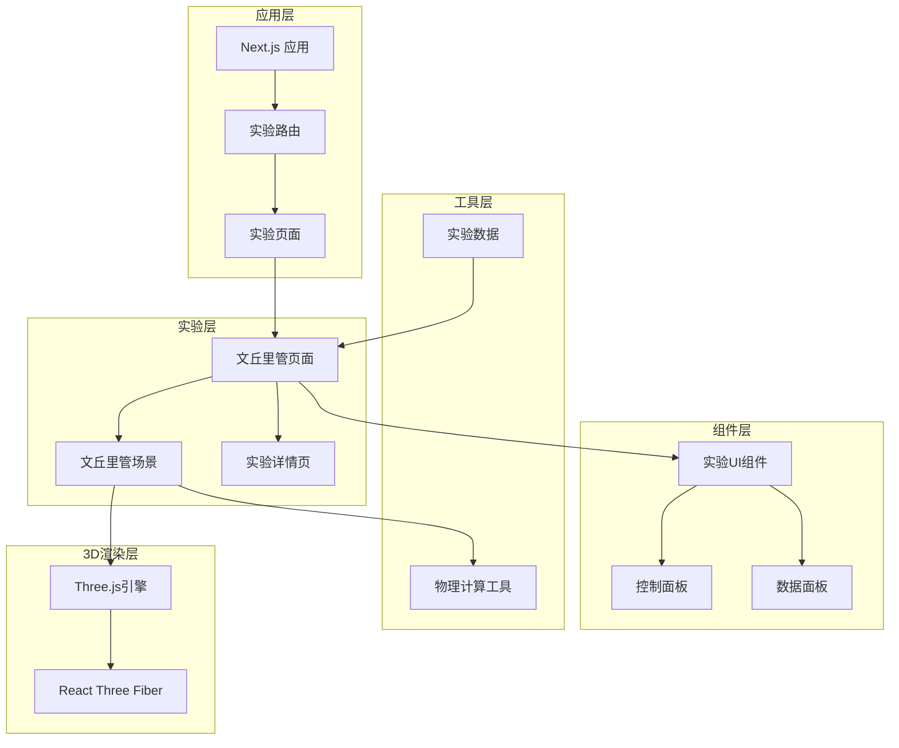

**图表来源**
- [package.json:10-22](file://package.json#L10-L22)
- [experiments.ts:125-134](file://src/data/experiments.ts#L125-L134)

**章节来源**
- [package.json:1-38](file://package.json#L1-L38)
- [experiments.ts:125-134](file://src/data/experiments.ts#L125-L134)

## 核心组件

### 实验页面组件

文丘里管实验的核心页面组件负责管理实验状态、处理用户交互，并协调各个子组件的工作。

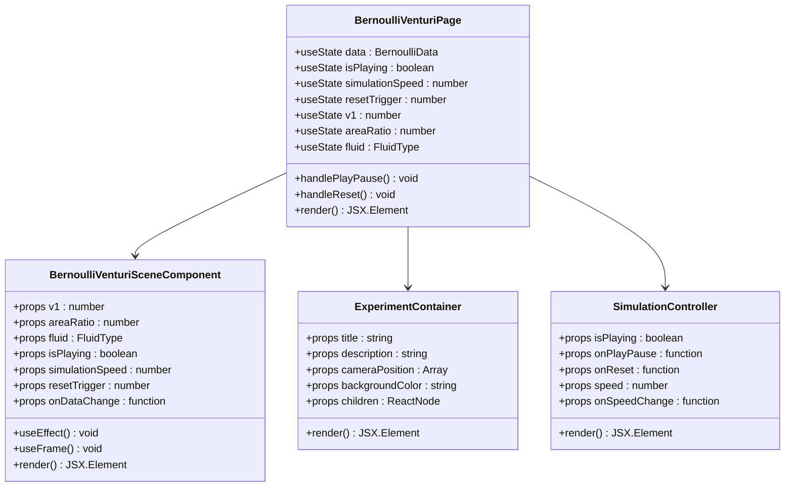

**图表来源**
- [bernoulli-venturi-page.tsx:22-194](file://src/experiments/bernoulli-venturi-page.tsx#L22-L194)
- [bernoulli-venturi-scene.tsx:132-447](file://src/experiments/bernoulli-venturi-scene.tsx#L132-L447)

### 数据结构定义

实验使用了专门的数据结构来表示流体力学计算结果：

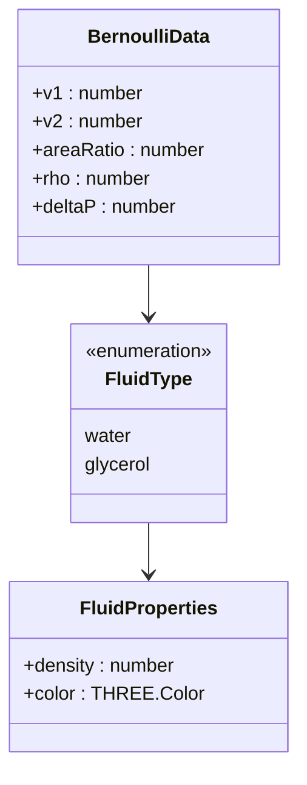

**图表来源**
- [bernoulli-venturi-scene.tsx:10-16](file://src/experiments/bernoulli-venturi-scene.tsx#L10-L16)
- [bernoulli-venturi-scene.tsx:28-36](file://src/experiments/bernoulli-venturi-scene.tsx#L28-L36)

**章节来源**
- [bernoulli-venturi-page.tsx:22-194](file://src/experiments/bernoulli-venturi-page.tsx#L22-L194)
- [bernoulli-venturi-scene.tsx:10-447](file://src/experiments/bernoulli-venturi-scene.tsx#L10-L447)

## 架构概览

### 技术栈架构

ScienceLab 3D采用了现代化的技术栈来构建高性能的3D科学教育平台：

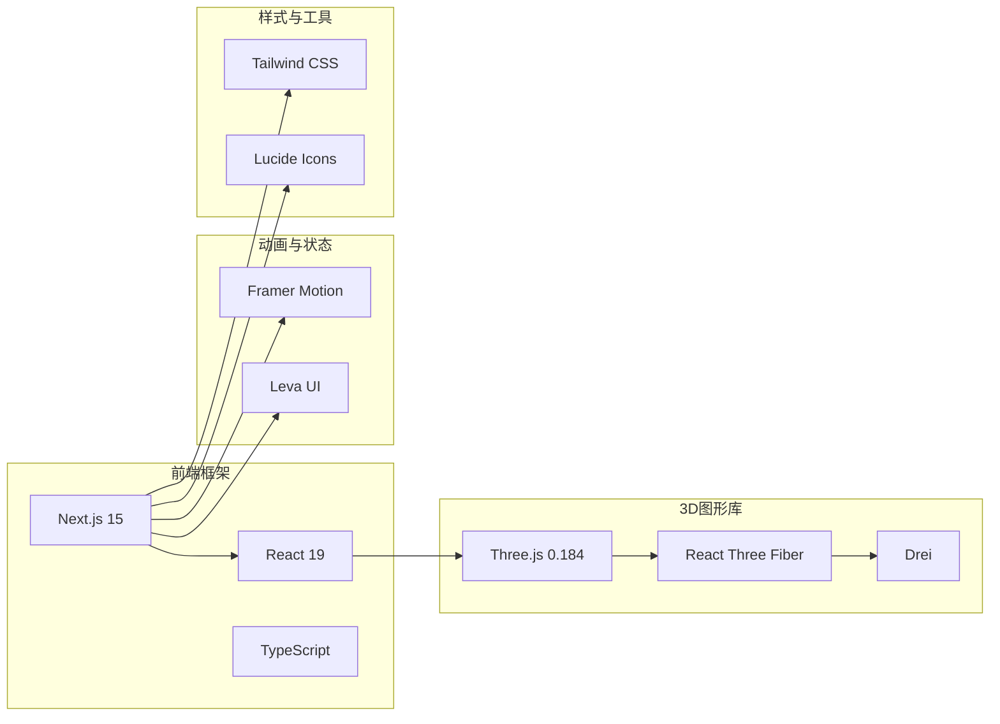

**图表来源**
- [package.json:10-22](file://package.json#L10-L22)

### 实验流程架构

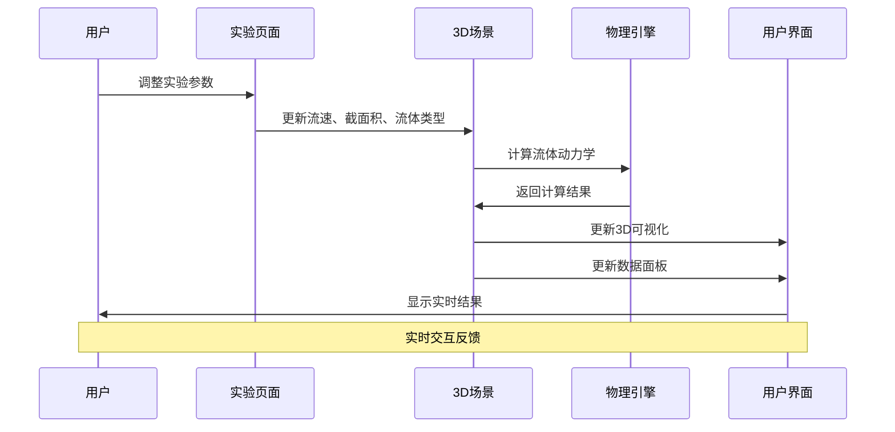

**图表来源**
- [bernoulli-venturi-page.tsx:162-170](file://src/experiments/bernoulli-venturi-page.tsx#L162-L170)
- [bernoulli-venturi-scene.tsx:244-342](file://src/experiments/bernoulli-venturi-scene.tsx#L244-L342)

**章节来源**
- [package.json:10-22](file://package.json#L10-L22)

## 详细组件分析

### 3D场景组件

文丘里管3D场景组件是整个实验的核心，负责创建和渲染所有3D元素。

#### 管道几何建模

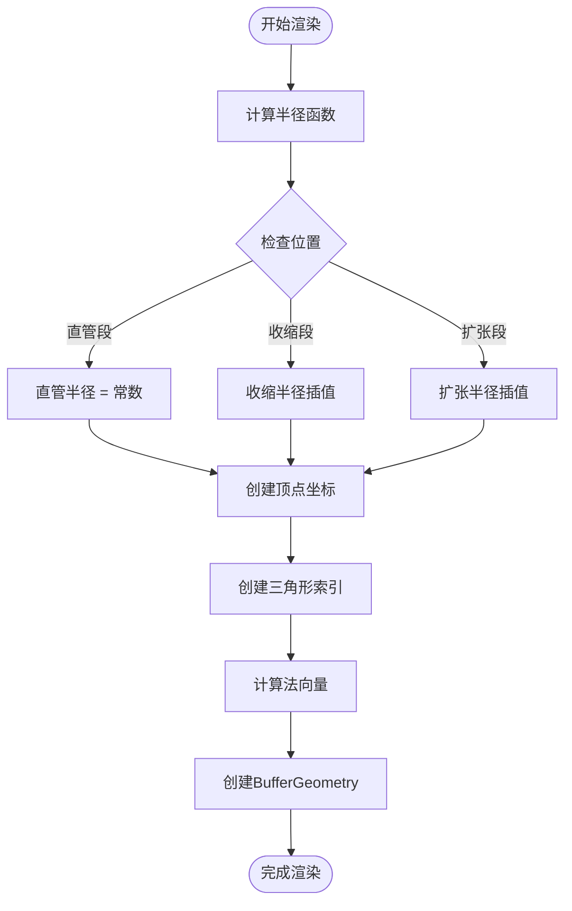

**图表来源**
- [bernoulli-venturi-scene.tsx:45-93](file://src/experiments/bernoulli-venturi-scene.tsx#L45-L93)

#### 流体粒子系统

实验使用了InstancedMesh技术来高效渲染大量流体粒子：

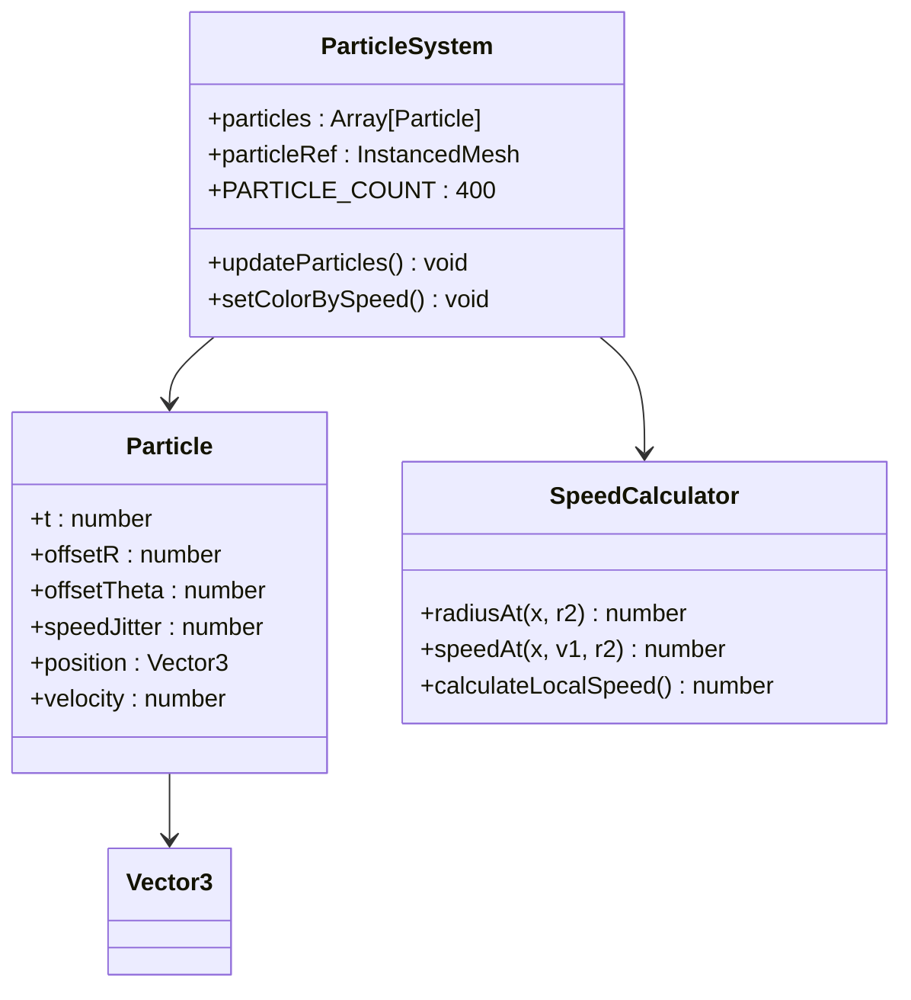

**图表来源**
- [bernoulli-venturi-scene.tsx:206-215](file://src/experiments/bernoulli-venturi-scene.tsx#L206-L215)
- [bernoulli-venturi-scene.tsx:306-341](file://src/experiments/bernoulli-venturi-scene.tsx#L306-L341)

**章节来源**
- [bernoulli-venturi-scene.tsx:45-447](file://src/experiments/bernoulli-venturi-scene.tsx#L45-L447)

### 用户界面组件

#### 控制面板设计

实验提供了完整的交互式控制面板，包含以下功能组件：

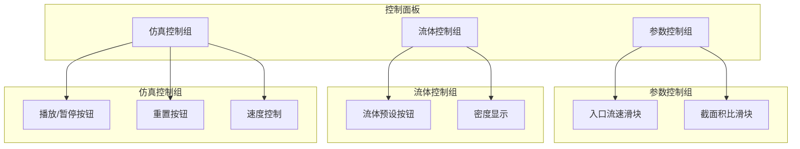

**图表来源**
- [bernoulli-venturi-page.tsx:55-105](file://src/experiments/bernoulli-venturi-page.tsx#L55-L105)

#### 数据面板设计

数据面板实时显示实验计算结果和物理公式：

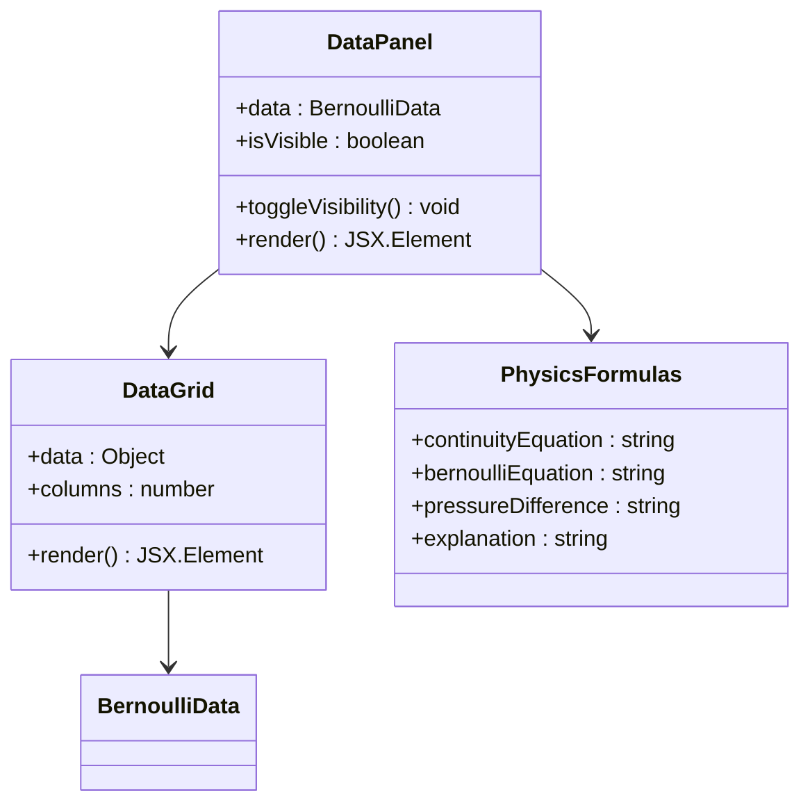

**图表来源**
- [bernoulli-venturi-page.tsx:107-150](file://src/experiments/bernoulli-venturi-page.tsx#L107-L150)

**章节来源**
- [bernoulli-venturi-page.tsx:55-194](file://src/experiments/bernoulli-venturi-page.tsx#L55-L194)

## 物理原理实现

### 伯努利定理计算

文丘里管实验精确实现了流体力学的基本定律：

#### 连续性方程

连续性方程描述了不可压缩流体的质量守恒：
```
A₁v₁ = A₂v₂
```

其中：
- A₁, A₂：管道不同截面的面积
- v₁, v₂：对应截面处的流速

#### 伯努利方程

在水平放置的管道中，伯努利方程简化为：
```
P₁ + ½ρv₁² = P₂ + ½ρv₂²
```

由此可得压强差公式：
```
ΔP = P₁ - P₂ = ½ρ(v₂² - v₁²)
```

#### 流体密度设置

实验支持两种常见流体的密度设置：

| 流体类型 | 密度 (kg/m³) | 颜色 |
|---------|-------------|------|
| 水 | 1000 | 蓝色透明 |
| 甘油 | 1260 | 黄色半透明 |

**章节来源**
- [bernoulli-venturi-scene.tsx:141-146](file://src/experiments/bernoulli-venturi-scene.tsx#L141-L146)
- [bernoulli-venturi-scene.tsx:28-36](file://src/experiments/bernoulli-venturi-scene.tsx#L28-L36)

### 3D可视化实现

#### 压力测管系统

实验通过两个垂直的压力测管直观展示压强差：

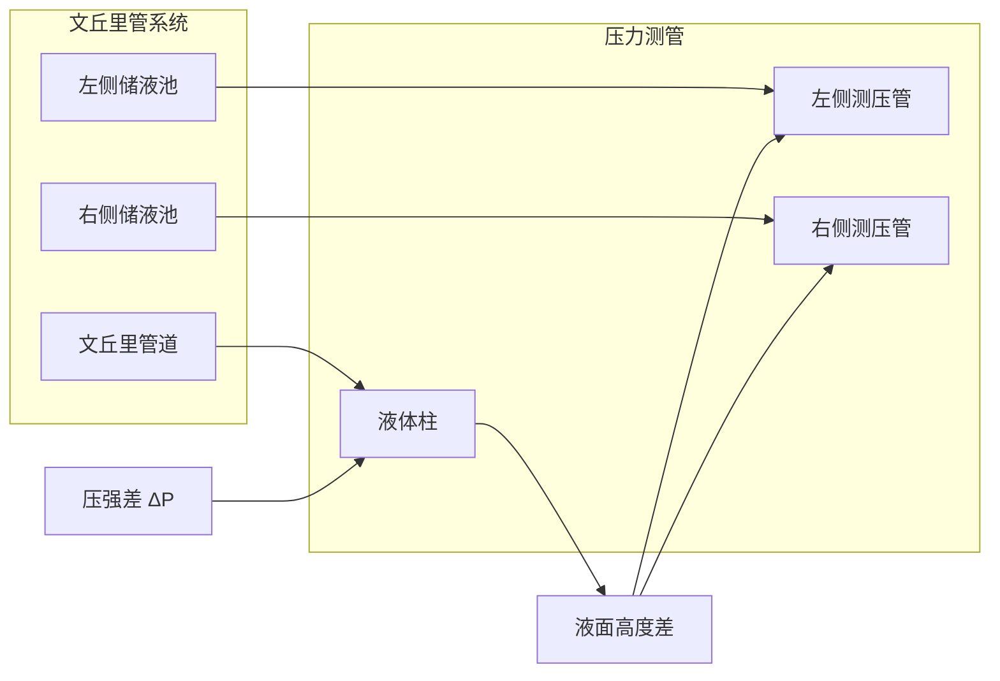

**图表来源**
- [bernoulli-venturi-scene.tsx:217-231](file://src/experiments/bernoulli-venturi-scene.tsx#L217-L231)

#### 动画效果实现

实验使用了多种动画技术来增强视觉效果：

1. **流体粒子动画**：使用InstancedMesh渲染400个独立粒子
2. **液面波动**：通过插值算法实现液面的平滑移动
3. **颜色渐变**：根据流速动态调整流体颜色深浅
4. **材质透明度**：模拟真实流体的透明效果

**章节来源**
- [bernoulli-venturi-scene.tsx:244-342](file://src/experiments/bernoulli-venturi-scene.tsx#L244-L342)

## 用户界面设计

### 响应式布局

实验界面采用响应式设计，确保在各种设备上都有良好的用户体验：

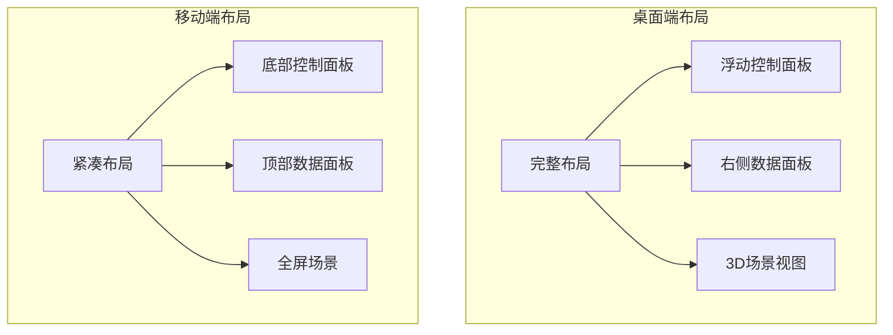

### 交互设计原则

1. **直观性**：所有控制都配有清晰的标签和图标
2. **即时反馈**：参数调整后立即看到3D效果变化
3. **可探索性**：允许用户自由尝试不同的参数组合
4. **教育性**：提供详细的实验说明和物理原理解释

**章节来源**
- [bernoulli-venturi-page.tsx:181-191](file://src/experiments/bernoulli-venturi-page.tsx#L181-L191)

## 性能优化

### 渲染性能优化

为了确保流畅的3D体验，实验采用了多项性能优化策略：

#### InstancedMesh优化

使用InstancedMesh技术一次性渲染大量相似对象，显著减少渲染调用次数：

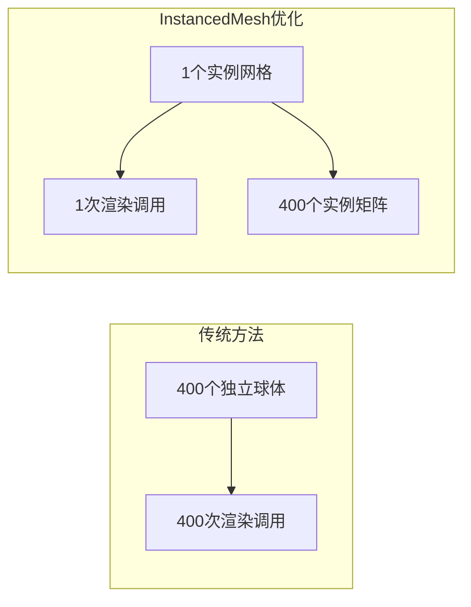

#### 材质共享

所有相似的3D对象共享相同的材质资源，减少内存占用和纹理切换开销。

#### 几何体缓存

复杂的几何体（如管道表面）使用useMemo进行缓存，避免重复计算。

### 物理计算优化

#### 数值稳定性

- 使用clamp函数防止数值溢出
- 采用线性插值（lerp）确保动画平滑
- 对速度和压力计算进行范围限制

#### 实时性能监控

实验内置了性能监控机制，可以实时显示帧率和内存使用情况。

**章节来源**
- [physics.ts:664-686](file://src/utils/physics.ts#L664-L686)
- [bernoulli-venturi-scene.tsx:244-256](file://src/experiments/bernoulli-venturi-scene.tsx#L244-L256)

## 故障排除指南

### 常见问题及解决方案

#### 3D场景不显示

**症状**：页面加载后只显示空白或错误信息

**可能原因**：
1. Three.js依赖未正确安装
2. WebGL不支持或被禁用
3. 浏览器兼容性问题

**解决步骤**：
1. 检查浏览器控制台是否有错误信息
2. 确认WebGL功能正常
3. 尝试更新显卡驱动程序
4. 在其他浏览器中测试

#### 参数调整无效

**症状**：修改流速、截面积或流体类型后没有变化

**可能原因**：
1. React状态更新问题
2. 组件重新渲染异常
3. 事件处理器绑定错误

**解决步骤**：
1. 检查控制面板的onChange回调函数
2. 确认useState钩子正确初始化
3. 验证组件的props传递

#### 性能问题

**症状**：3D动画卡顿或帧率过低

**可能原因**：
1. 太多的3D对象同时渲染
2. 复杂的着色器计算
3. 内存泄漏

**优化建议**：
1. 减少粒子数量
2. 简化材质复杂度
3. 合理使用LOD（细节层次）
4. 定期清理未使用的资源

### 开发调试技巧

#### 浏览器开发者工具

1. **性能面板**：监控JavaScript执行时间和渲染性能
2. **网络面板**：检查资源加载状态
3. **3D视图**：使用Chrome DevTools的3D渲染检查器

#### 日志调试

在关键的计算节点添加console.log输出，跟踪数据流和状态变化。

#### 单元测试

为重要的物理计算函数编写单元测试，确保数学公式的正确性。

**章节来源**
- [bernoulli-venturi-scene.tsx:220-242](file://src/experiments/bernoulli-venturi-scene.tsx#L220-L242)

## 结论

伯努利原理（文丘里管）实验是ScienceLab 3D项目中的一个优秀示例，展示了如何将复杂的物理概念通过现代Web技术转化为直观、交互式的学习体验。该实验成功地结合了：

### 技术成就

1. **精确的物理建模**：准确实现了伯努利定理和连续性方程
2. **高性能3D渲染**：使用先进的WebGL技术和优化策略
3. **用户友好的界面**：提供直观的交互控制和实时反馈
4. **教育价值最大化**：将抽象的物理概念具象化

### 学习效果

通过这个实验，学生可以：
- 直观理解流体动力学的基本原理
- 观察流速与压力的反比关系
- 探索不同流体介质对实验结果的影响
- 培养科学思维和实验技能

### 扩展可能性

该项目为未来的扩展提供了良好的基础：
- 可以添加更多流体类型和物理参数
- 可以集成更多的流体力学实验
- 可以开发移动端适配版本
- 可以增加虚拟现实支持

ScienceLab 3D项目证明了现代Web技术在科学教育领域的巨大潜力，为全球的学习者提供了一个免费、高质量的3D科学学习平台。