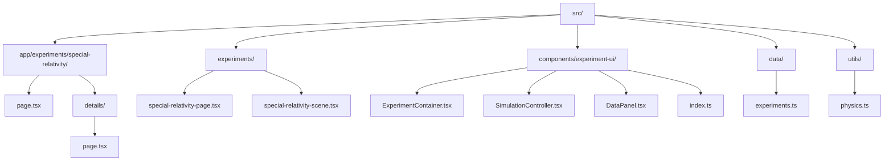
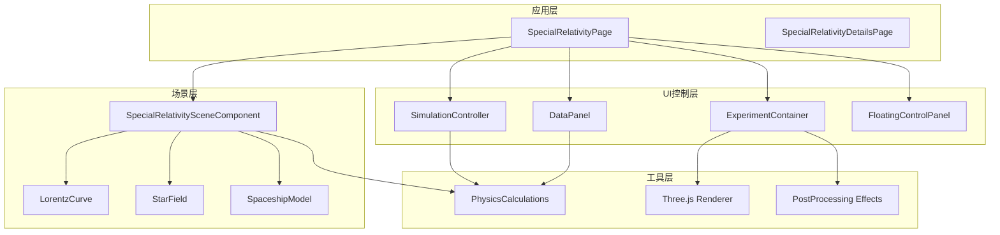
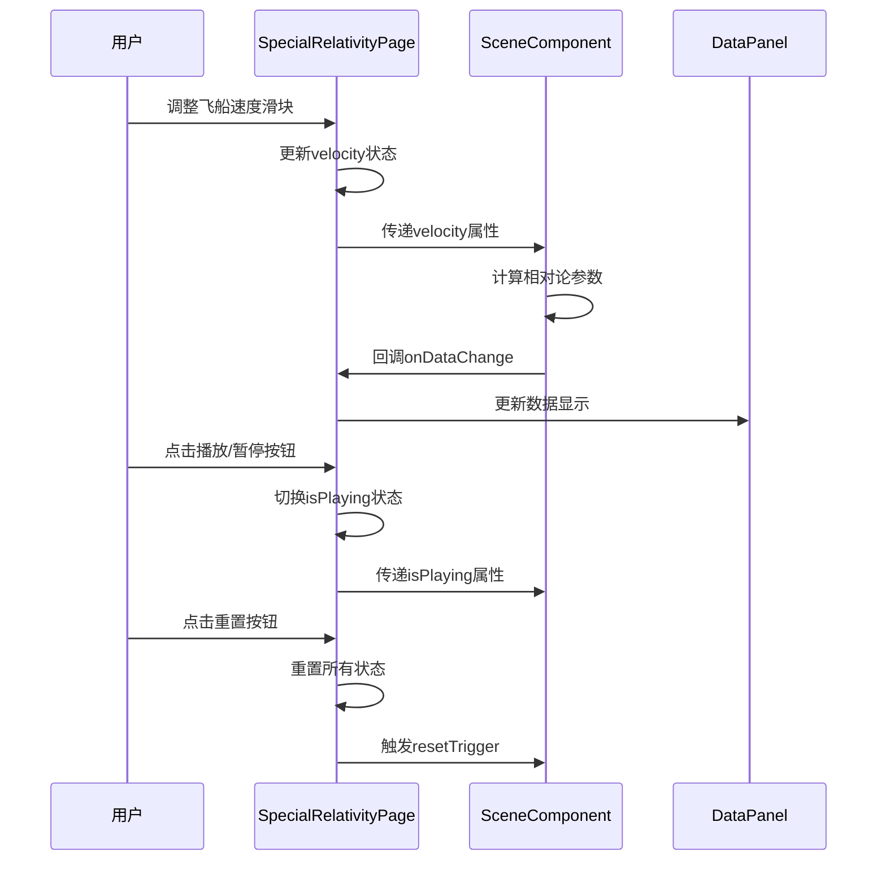
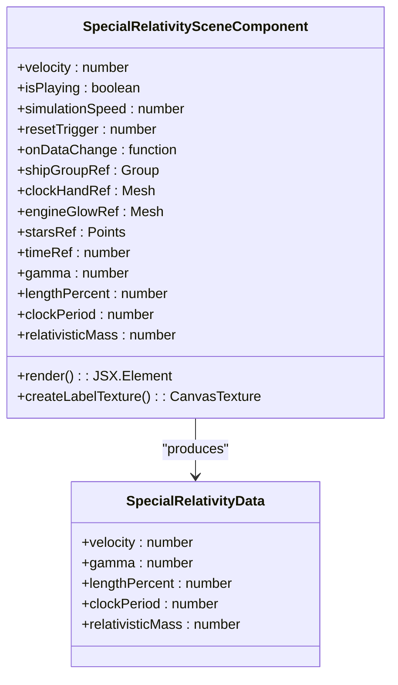
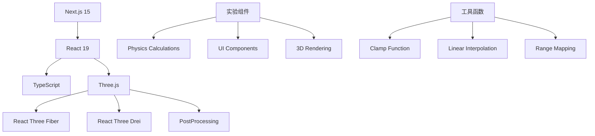
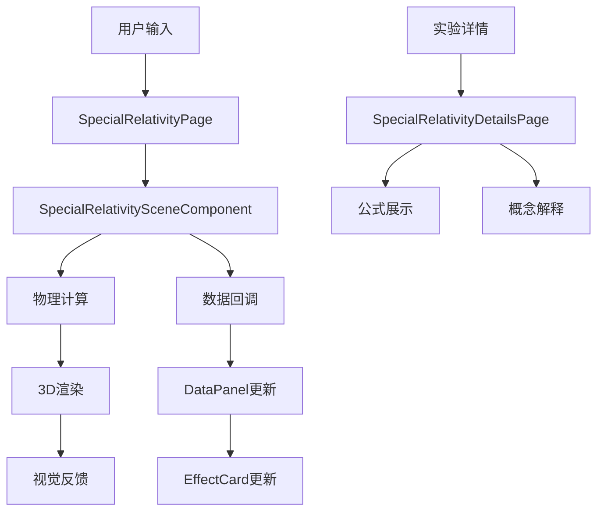

# 特殊相对论实验

<cite>
**本文档引用的文件**
- [special-relativity-page.tsx](file://src/experiments/special-relativity-page.tsx)
- [special-relativity-scene.tsx](file://src/experiments/special-relativity-scene.tsx)
- [page.tsx](file://src/app/experiments/special-relativity/page.tsx)
- [details/page.tsx](file://src/app/experiments/special-relativity/details/page.tsx)
- [experiments.ts](file://src/data/experiments.ts)
- [ExperimentContainer.tsx](file://src/components/experiment-ui/ExperimentContainer.tsx)
- [SimulationController.tsx](file://src/components/experiment-ui/SimulationController.tsx)
- [DataPanel.tsx](file://src/components/experiment-ui/DataPanel.tsx)
- [physics.ts](file://src/utils/physics.ts)
- [package.json](file://package.json)
</cite>

## 目录
1. [简介](#简介)
2. [项目结构](#项目结构)
3. [核心组件](#核心组件)
4. [架构概览](#架构概览)
5. [详细组件分析](#详细组件分析)
6. [依赖关系分析](#依赖关系分析)
7. [性能考虑](#性能考虑)
8. [故障排除指南](#故障排除指南)
9. [结论](#结论)

## 简介

特殊相对论实验是ScienceLab 3D项目中的一个重要组成部分，它提供了一个交互式的3D环境来演示爱因斯坦狭义相对论的核心概念。该实验通过可视化的方式展示了长度收缩、时间膨胀和相对论质量等经典效应，帮助用户理解高速运动下的物理现象。

该项目基于现代Web技术栈构建，使用Next.js 15作为前端框架，React 19进行组件开发，Three.js进行3D图形渲染，并结合React Three Fiber和Drei库来简化3D场景的创建和管理。

## 项目结构

项目采用模块化的组织方式，特殊相对论实验的相关文件主要分布在以下目录结构中：

**图表来源**
- [special-relativity-page.tsx:1-211](file://src/experiments/special-relativity-page.tsx#L1-L211)
- [special-relativity-scene.tsx:1-393](file://src/experiments/special-relativity-scene.tsx#L1-L393)
- [page.tsx:1-13](file://src/app/experiments/special-relativity/page.tsx#L1-L13)

**章节来源**
- [special-relativity-page.tsx:1-211](file://src/experiments/special-relativity-page.tsx#L1-L211)
- [special-relativity-scene.tsx:1-393](file://src/experiments/special-relativity-scene.tsx#L1-L393)
- [page.tsx:1-13](file://src/app/experiments/special-relativity/page.tsx#L1-L13)

## 核心组件

特殊相对论实验由多个精心设计的组件构成，每个组件都有特定的功能和职责：

### 实验页面组件
- **SpecialRelativityPage**: 主要的实验界面，负责协调所有子组件并处理用户交互
- **EffectCard**: 用于展示具体相对论效应的卡片组件

### 3D场景组件
- **SpecialRelativitySceneComponent**: 核心3D场景渲染器，包含飞船、星场、参考坐标系等元素
- **Lorentz Curve**: 实时显示洛伦兹因子与速度关系的数学曲线

### UI控制组件
- **ExperimentContainer**: 提供统一的实验容器，包含相机控制、光照系统等
- **SimulationController**: 浮动的仿真控制器，支持播放/暂停、重置和速度调节
- **DataPanel**: 实时数据显示面板，展示物理量计算结果

**章节来源**
- [special-relativity-page.tsx:19-170](file://src/experiments/special-relativity-page.tsx#L19-L170)
- [special-relativity-scene.tsx:60-393](file://src/experiments/special-relativity-scene.tsx#L60-L393)
- [ExperimentContainer.tsx:55-373](file://src/components/experiment-ui/ExperimentContainer.tsx#L55-L373)
- [SimulationController.tsx:27-228](file://src/components/experiment-ui/SimulationController.tsx#L27-L228)
- [DataPanel.tsx:23-219](file://src/components/experiment-ui/DataPanel.tsx#L23-L219)

## 架构概览

特殊相对论实验采用了分层架构设计，确保了良好的可维护性和扩展性：

**图表来源**
- [special-relativity-page.tsx:134-169](file://src/experiments/special-relativity-page.tsx#L134-L169)
- [special-relativity-scene.tsx:197-390](file://src/experiments/special-relativity-scene.tsx#L197-L390)
- [ExperimentContainer.tsx:137-207](file://src/components/experiment-ui/ExperimentContainer.tsx#L137-L207)

该架构实现了清晰的关注点分离：
- **表现层**: 负责用户界面和交互
- **业务逻辑层**: 处理物理计算和数据管理
- **渲染层**: 管理3D场景和视觉效果
- **基础设施层**: 提供通用工具和配置

## 详细组件分析

### SpecialRelativityPage 组件

这是实验的主要入口点，负责协调所有子组件并处理用户交互：

**图表来源**
- [special-relativity-page.tsx:24-36](file://src/experiments/special-relativity-page.tsx#L24-L36)
- [special-relativity-page.tsx:144-150](file://src/experiments/special-relativity-page.tsx#L144-L150)

该组件的关键特性包括：
- **状态管理**: 使用React hooks管理实验状态
- **实时更新**: 通过回调机制实现实时数据同步
- **用户友好**: 提供直观的控制界面和视觉反馈

**章节来源**
- [special-relativity-page.tsx:19-170](file://src/experiments/special-relativity-page.tsx#L19-L170)

### SpecialRelativitySceneComponent 组件

这是实验的核心3D渲染组件，负责创建和管理整个3D场景：

**图表来源**
- [special-relativity-scene.tsx:11-25](file://src/experiments/special-relativity-scene.tsx#L11-L25)
- [special-relativity-scene.tsx:60-66](file://src/experiments/special-relativity-scene.tsx#L60-L66)

该组件实现了以下关键功能：
- **相对论计算**: 实时计算洛伦兹因子、长度收缩等物理量
- **3D建模**: 创建飞船、星场、参考坐标系等场景元素
- **动画系统**: 实现时间膨胀、长度收缩等动态效果
- **后处理效果**: 应用Bloom和Vignette等视觉增强效果

**章节来源**
- [special-relativity-scene.tsx:60-393](file://src/experiments/special-relativity-scene.tsx#L60-L393)

### 相对论效应可视化

实验通过多种方式可视化相对论效应：

#### 时间膨胀效果
- **时钟动画**: 飞船上的时钟以γ倍数的速度运行
- **视觉反馈**: 时钟指针的旋转速度直观显示时间膨胀

#### 长度收缩效果  
- **飞船缩放**: 飞船在运动方向上的长度按1/γ比例收缩
- **物理约束**: 使用clamp函数确保最小缩放比例

#### 相对论质量效应
- **质量计算**: 质量随速度增加而增大（等于γ值）
- **视觉暗示**: 引擎光芒的强度变化反映质量增加

**章节来源**
- [special-relativity-scene.tsx:149-190](file://src/experiments/special-relativity-scene.tsx#L149-L190)

### UI控制组件

#### ExperimentContainer
提供统一的实验容器环境，包含：
- **相机系统**: OrbitControls提供自由视角浏览
- **光照系统**: 多光源组合创造逼真的3D效果
- **响应式设计**: 适配不同设备和屏幕尺寸

#### SimulationController
浮动的仿真控制器，支持：
- **播放/暂停**: 控制实验的运行状态
- **重置功能**: 将实验恢复到初始状态
- **速度调节**: 0.1x到3x的可调节仿真速度
- **拖拽操作**: 支持触摸和鼠标拖拽

#### DataPanel
实时数据面板，显示：
- **物理量计算**: 速度、洛伦兹因子、长度收缩率等
- **效应卡片**: 时间膨胀、长度收缩、相对论质量的详细说明
- **公式展示**: 相关物理公式的数学表达

**章节来源**
- [ExperimentContainer.tsx:55-373](file://src/components/experiment-ui/ExperimentContainer.tsx#L55-L373)
- [SimulationController.tsx:27-228](file://src/components/experiment-ui/SimulationController.tsx#L27-L228)
- [DataPanel.tsx:23-219](file://src/components/experiment-ui/DataPanel.tsx#L23-L219)

## 依赖关系分析

项目的技术栈和依赖关系如下：

**图表来源**
- [package.json:10-22](file://package.json#L10-L22)
- [physics.ts:664-686](file://src/utils/physics.ts#L664-L686)

### 核心依赖库

| 依赖库 | 版本 | 用途 |
|--------|------|------|
| @react-three/fiber | ^9.1.0 | React渲染器，简化Three.js使用 |
| @react-three/drei | ^10.0.0 | Three.js实用工具集合 |
| @react-three/postprocessing | ^3.0.0 | 3D后处理效果 |
| three | ^0.184.0 | 3D图形引擎 |
| framer-motion | ^12.40.0 | 动画和过渡效果 |
| lucide-react | ^1.18.0 | 图标库 |

### 数据流分析

**图表来源**
- [special-relativity-page.tsx:78-87](file://src/experiments/special-relativity-page.tsx#L78-L87)
- [special-relativity-scene.tsx:149-190](file://src/experiments/special-relativity-scene.tsx#L149-L190)

**章节来源**
- [package.json:10-37](file://package.json#L10-L37)
- [physics.ts:645-687](file://src/utils/physics.ts#L645-L687)

## 性能考虑

为了确保特殊相对论实验在各种设备上都能流畅运行，项目采用了多项性能优化策略：

### 渲染优化
- **视锥剔除**: 仅渲染可见的3D对象
- **LOD系统**: 根据距离调整模型细节级别
- **批处理渲染**: 合并相似材质的对象进行批量绘制
- **纹理压缩**: 使用压缩格式减少内存占用

### 内存管理
- **几何体复用**: 复用顶点数据和索引缓冲区
- **材质共享**: 在多个对象间共享材质资源
- **垃圾回收**: 及时释放不再使用的资源

### 计算优化
- **缓存机制**: 使用useMemo缓存昂贵的计算结果
- **帧率限制**: 限制最大帧时间避免卡顿
- **增量更新**: 仅更新发生变化的属性

### 移动端优化
- **分辨率自适应**: 根据设备像素比调整渲染质量
- **触摸优化**: 优化触摸交互响应
- **电池保护**: 减少后台计算以延长电池寿命

## 故障排除指南

### 常见问题及解决方案

#### 3D场景不显示
**症状**: 页面空白或只有背景色
**可能原因**:
- WebGL不支持或被禁用
- 浏览器兼容性问题
- 设备性能不足

**解决方法**:
1. 检查浏览器控制台是否有错误信息
2. 确认设备支持WebGL 2.0
3. 尝试在其他浏览器中打开
4. 关闭其他占用GPU的应用程序

#### 性能问题
**症状**: 场景运行缓慢或卡顿
**可能原因**:
- 对象数量过多
- 材质过于复杂
- 后处理效果过强

**解决方法**:
1. 减少场景中的对象数量
2. 简化材质和纹理
3. 降低后处理效果强度
4. 调整渲染质量设置

#### 交互无响应
**症状**: 控件无法点击或拖拽
**可能原因**:
- 事件监听器冲突
- CSS样式覆盖
- 触摸事件处理问题

**解决方法**:
1. 检查控制台是否有JavaScript错误
2. 确认CSS没有阻止事件传播
3. 测试不同设备的触摸功能
4. 刷新页面重新初始化

### 调试技巧

#### 开发者工具使用
- **性能面板**: 监控帧率和内存使用
- **网络面板**: 检查资源加载状态
- **控制台**: 查看错误和警告信息
- **Elements面板**: 检查DOM结构和样式

#### 日志记录
在关键位置添加日志输出：
- 状态变化时记录新的值
- 错误发生时记录详细信息
- 性能瓶颈时记录执行时间

**章节来源**
- [ExperimentContainer.tsx:117-133](file://src/components/experiment-ui/ExperimentContainer.tsx#L117-L133)
- [special-relativity-scene.tsx:149-190](file://src/experiments/special-relativity-scene.tsx#L149-L190)

## 结论

特殊相对论实验是ScienceLab 3D项目中的一个杰出示例，它成功地将复杂的物理概念转化为直观、可交互的3D体验。通过精心设计的架构和丰富的视觉效果，该实验不仅教育性强，而且具有很高的用户体验价值。

### 主要成就

1. **教育价值**: 有效传达了狭义相对论的核心概念
2. **技术先进**: 采用最新的Web技术栈实现高质量3D渲染
3. **用户体验**: 提供直观的交互界面和流畅的操作体验
4. **可扩展性**: 模块化的架构便于添加新的实验内容

### 技术亮点

- **实时物理计算**: 动态计算相对论效应并即时反映在3D场景中
- **沉浸式体验**: 通过3D环境和视觉效果增强学习体验
- **响应式设计**: 适配从桌面到移动设备的各种平台
- **性能优化**: 采用多种技术确保在低端设备上也能流畅运行

### 未来发展方向

1. **更多实验**: 扩展到广义相对论和其他物理理论
2. **社交功能**: 添加协作学习和分享功能
3. **个性化**: 允许用户定制学习路径和进度跟踪
4. **多语言支持**: 扩展到更多语言版本

特殊相对论实验代表了现代Web技术在教育领域的成功应用，为未来的在线科学教育提供了宝贵的参考和启示。