# 生物类实验

<cite>
**本文档引用的文件**
- [dna-replication-page.tsx](file://src/experiments/dna-replication-page.tsx)
- [dna-replication-scene.tsx](file://src/experiments/dna-replication-scene.tsx)
- [cell-structure-page.tsx](file://src/experiments/cell-structure-page.tsx)
- [cell-structure-scene.tsx](file://src/experiments/cell-structure-scene.tsx)
- [immune-response-page.tsx](file://src/experiments/immune-response-page.tsx)
- [immune-response-scene.tsx](file://src/experiments/immune-response-scene.tsx)
- [photosynthesis-page.tsx](file://src/experiments/photosynthesis-page.tsx)
- [photosynthesis-scene.tsx](file://src/experiments/photosynthesis-scene.tsx)
- [protein-synthesis-page.tsx](file://src/experiments/protein-synthesis-page.tsx)
- [protein-synthesis-scene.tsx](file://src/experiments/protein-synthesis-scene.tsx)
- [mitosis-meiosis-page.tsx](file://src/experiments/mitosis-meiosis-page.tsx)
- [mitosis-meiosis-scene.tsx](file://src/experiments/mitosis-meiosis-scene.tsx)
- [ecosystem-page.tsx](file://src/experiments/ecosystem-page.tsx)
- [ecosystem-scene.tsx](file://src/experiments/ecosystem-scene.tsx)
- [cellular-respiration-page.tsx](file://src/experiments/cellular-respiration-page.tsx)
- [cellular-respiration-scene.tsx](file://src/experiments/cellular-respiration-scene.tsx)
- [nervous-system-page.tsx](file://src/experiments/nervous-system-page.tsx)
- [nervous-system-scene.tsx](file://src/experiments/nervous-system-scene.tsx)
</cite>

## 目录
1. [简介](#简介)
2. [项目结构](#项目结构)
3. [核心组件](#核心组件)
4. [架构总览](#架构总览)
5. [详细组件分析](#详细组件分析)
6. [依赖关系分析](#依赖关系分析)
7. [性能考虑](#性能考虑)
8. [故障排除指南](#故障排除指南)
9. [结论](#结论)

## 简介
本项目是一个基于Web的3D生物实验教学平台，通过React Three Fiber与Drei构建沉浸式3D可视化体验，涵盖从分子到生态系统的多层次生物学内容。用户可以通过交互式控制面板调节仿真速度、切换步骤模式、查看实时数据统计，深入理解生命科学的核心机制。

## 项目结构
项目采用模块化设计，每个实验由页面组件（page）和场景组件（scene）组成，配合统一的UI框架实现一致的用户体验。

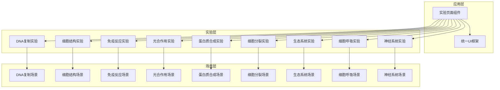

**图表来源**
- [dna-replication-page.tsx:14-226](file://src/experiments/dna-replication-page.tsx#L14-L226)
- [cell-structure-page.tsx:14-212](file://src/experiments/cell-structure-page.tsx#L14-L212)
- [immune-response-page.tsx:14-163](file://src/experiments/immune-response-page.tsx#L14-L163)

**章节来源**
- [dna-replication-page.tsx:1-226](file://src/experiments/dna-replication-page.tsx#L1-L226)
- [cell-structure-page.tsx:1-212](file://src/experiments/cell-structure-page.tsx#L1-L212)
- [immune-response-page.tsx:1-163](file://src/experiments/immune-response-page.tsx#L1-L163)

## 核心组件
系统采用统一的实验框架，所有实验共享以下核心组件：

### 实验容器组件
- **ExperimentContainer**: 提供实验标题、描述、相机控制和背景设置
- **SimulationController**: 控制播放/暂停、重置、速度调节
- **FloatingControlPanel**: 可拖拽的参数控制面板
- **DataPanel**: 实时数据显示面板

### 数据模型接口
每个实验都定义了对应的数据接口用于状态传递：
- DNAReplicationData: DNA复制过程数据
- CellStructureData: 细胞结构数据  
- ImmuneResponseData: 免疫反应数据
- PhotosynthesisData: 光合作用数据
- ProteinSynthesisData: 蛋白质合成数据
- MitosisMeiosisData: 细胞分裂数据
- EcosystemData: 生态系统数据
- CellularRespirationData: 细胞呼吸数据
- NervousSystemData: 神经系统数据

**章节来源**
- [dna-replication-page.tsx:28-35](file://src/experiments/dna-replication-page.tsx#L28-L35)
- [cell-structure-page.tsx:8-11](file://src/experiments/cell-structure-page.tsx#L8-L11)
- [immune-response-page.tsx:8-12](file://src/experiments/immune-response-page.tsx#L8-L12)

## 架构总览
系统采用分层架构设计，确保代码的可维护性和扩展性。

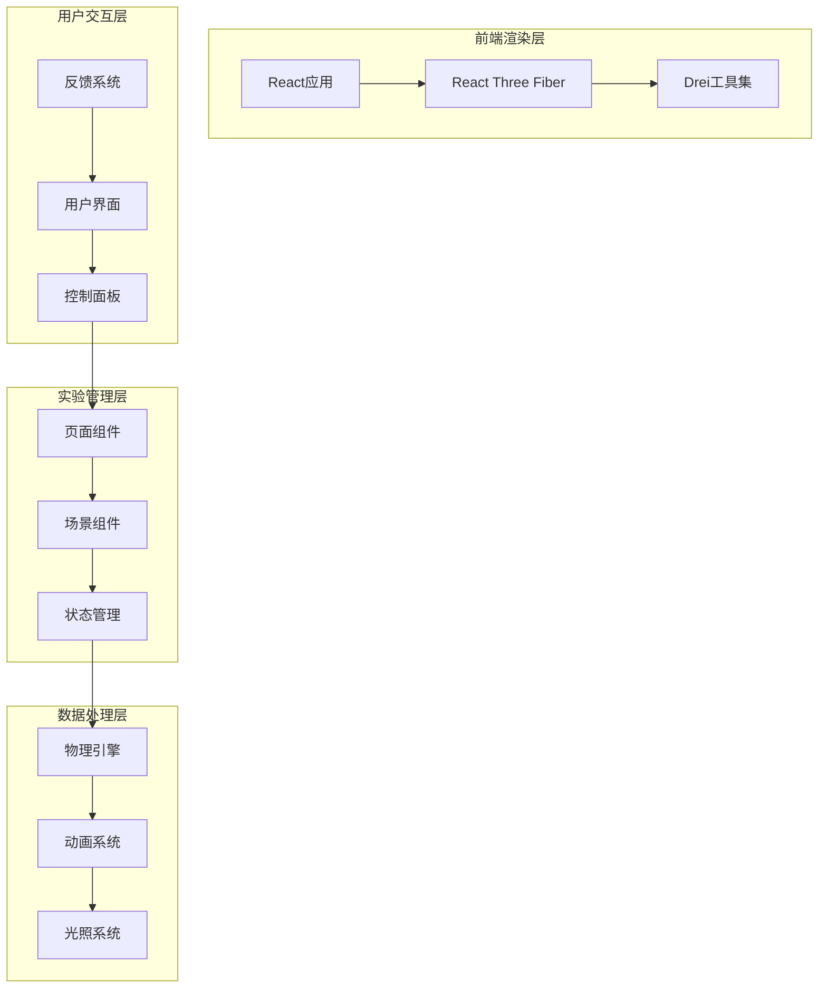

**图表来源**
- [dna-replication-scene.tsx:1-551](file://src/experiments/dna-replication-scene.tsx#L1-L551)
- [cell-structure-scene.tsx:1-387](file://src/experiments/cell-structure-scene.tsx#L1-L387)

## 详细组件分析

### DNA复制实验
DNA复制是分子生物学的核心过程，系统通过精确的3D建模展示了这一复杂机制。

#### 分子机制模拟
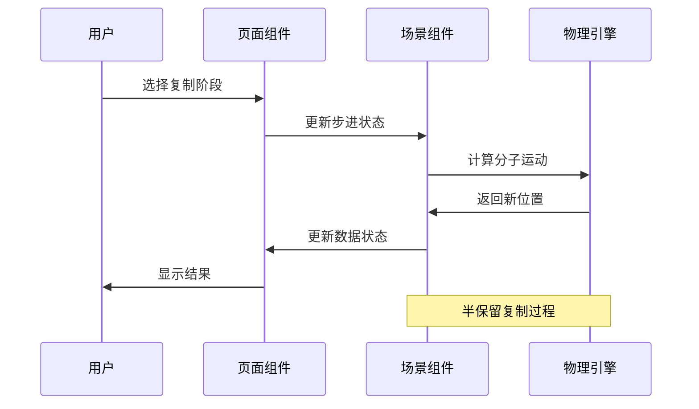

**图表来源**
- [dna-replication-scene.tsx:179-236](file://src/experiments/dna-replication-scene.tsx#L179-L236)

#### 关键实现特性
- **双螺旋解旋**: 使用helix几何体模拟DNA双链分离
- **引物合成**: RNA聚合酶引导RNA引物合成
- **链延伸**: DNA聚合酶催化新链合成
- **半保留复制**: 新DNA分子包含一条旧链和一条新链

**章节来源**
- [dna-replication-page.tsx:48-75](file://src/experiments/dna-replication-page.tsx#L48-L75)
- [dna-replication-scene.tsx:48-75](file://src/experiments/dna-replication-scene.tsx#L48-L75)

### 细胞结构实验
系统提供了完整的动物细胞3D模型，展示细胞膜、细胞核和各种细胞器的形态特征。

#### 三维结构可视化
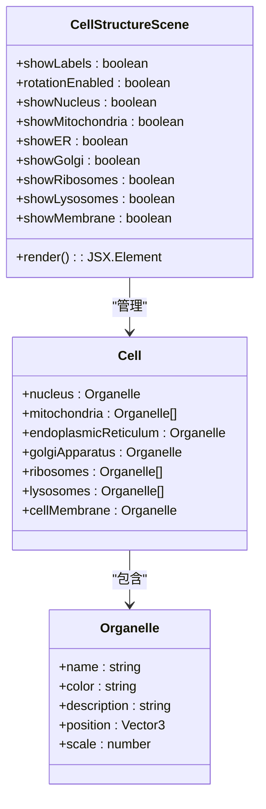

**图表来源**
- [cell-structure-scene.tsx:61-98](file://src/experiments/cell-structure-scene.tsx#L61-L98)

#### 细胞器功能展示
- **细胞核**: DNA存储和基因调控中心
- **线粒体**: 细胞呼吸和ATP生产
- **内质网**: 蛋白质和脂质合成
- **高尔基体**: 蛋白质修饰和包装
- **核糖体**: 蛋白质合成工厂
- **溶酶体**: 细胞消化和废物处理
- **细胞膜**: 选择性通透屏障

**章节来源**
- [cell-structure-page.tsx:29-58](file://src/experiments/cell-structure-page.tsx#L29-L58)
- [cell-structure-scene.tsx:30-59](file://src/experiments/cell-structure-scene.tsx#L30-L59)

### 免疫反应实验
系统模拟了宿主对病毒感染的免疫应答过程，包括抗原识别、抗体产生和免疫记忆形成。

#### 动态免疫过程
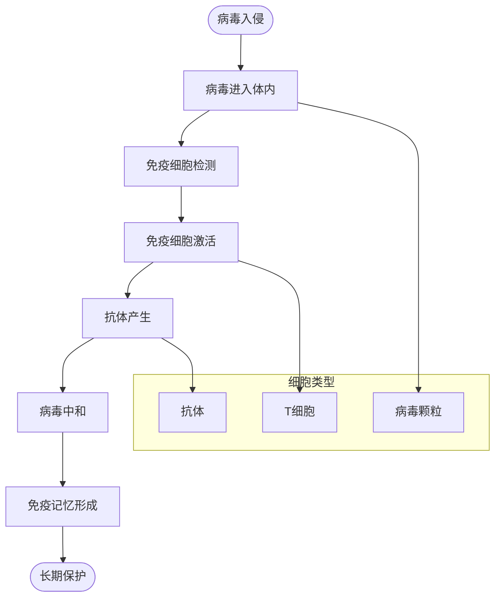

**图表来源**
- [immune-response-scene.tsx:156-295](file://src/experiments/immune-response-scene.tsx#L156-L295)

#### 免疫机制实现
- **病毒动力学**: 随机运动和边界碰撞
- **抗体中和**: 抗体追踪并结合病毒
- **T细胞反应**: 细胞毒性T细胞攻击被感染细胞
- **免疫记忆**: 记忆B细胞和T细胞的形成

**章节来源**
- [immune-response-page.tsx:26-30](file://src/experiments/immune-response-page.tsx#L26-L30)
- [immune-response-scene.tsx:24-44](file://src/experiments/immune-response-scene.tsx#L24-L44)

### 光合作用实验
系统完整展示了植物光合作用的生化反应和能量转换过程。

#### 光合作用流程
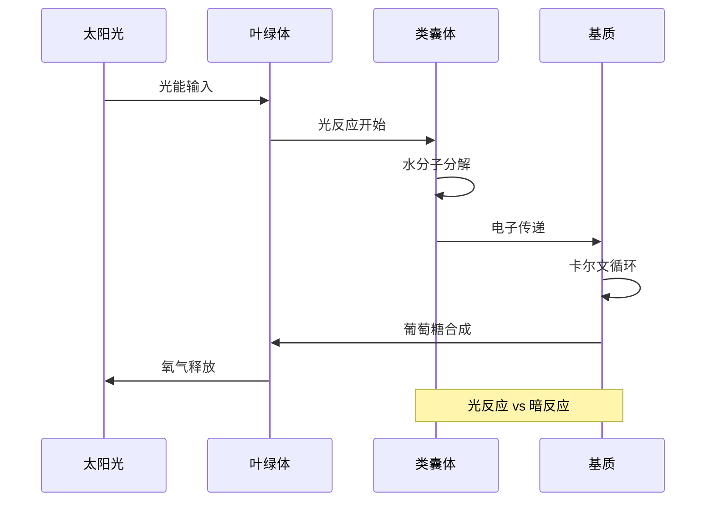

**图表来源**
- [photosynthesis-scene.tsx:365-481](file://src/experiments/photosynthesis-scene.tsx#L365-L481)

#### 生化过程模拟
- **光反应**: 类囊体内水分子分解，产生氧气、ATP和NADPH
- **卡尔文循环**: 基质中CO₂固定和葡萄糖合成
- **能量转换**: 光能→化学能的高效转换

**章节来源**
- [photosynthesis-page.tsx:32-43](file://src/experiments/photosynthesis-page.tsx#L32-L43)
- [photosynthesis-scene.tsx:33-45](file://src/experiments/photosynthesis-scene.tsx#L33-L45)

### 蛋白质合成实验
系统详细展示了转录和翻译的分子机制，体现分子生物学中心法则。

#### 中心法则流程
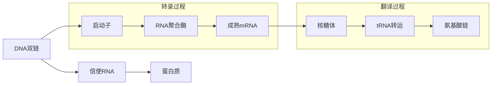

**图表来源**
- [protein-synthesis-scene.tsx:171-225](file://src/experiments/protein-synthesis-scene.tsx#L171-L225)

#### 分子机制实现
- **转录**: DNA→mRNA，发生在细胞核
- **mRNA加工**: 剪接、加帽、加尾
- **翻译**: mRNA→蛋白质，发生在核糖体
- **密码子识别**: tRNA反密码子配对

**章节来源**
- [protein-synthesis-page.tsx:28-36](file://src/experiments/protein-synthesis-page.tsx#L28-L36)
- [protein-synthesis-scene.tsx:94-125](file://src/experiments/protein-synthesis-scene.tsx#L94-L125)

### 细胞分裂实验
系统对比展示了有丝分裂和减数分裂的详细过程。

#### 分裂方式对比
```mermaid
graph TB
subgraph "有丝分裂"
InterphaseMitosis[间期]
ProphaseMitosis[前期]
MetaphaseMitosis[中期]
AnaphaseMitosis[后期]
TelophaseMitosis[末期]
InterphaseMitosis --> ProphaseMitosis
ProphaseMitosis --> MetaphaseMitosis
MetaphaseMitosis --> AnaphaseMitosis
AnaphaseMitosis --> TelophaseMitosis
end
subgraph "减数分裂"
ProphaseI[减数分裂I]
MetaphaseI[中期I]
AnaphaseI[后期I]
TelophaseI[末期I]
ProphaseII[减数分裂II]
MetaphaseII[中期II]
AnaphaseII[后期II]
TelophaseII[末期II]
ProphaseI --> MetaphaseI
MetaphaseI --> AnaphaseI
AnaphaseI --> TelophaseI
TelophaseI --> ProphaseII
ProphaseII --> MetaphaseII
MetaphaseII --> AnaphaseII
AnaphaseII --> TelophaseII
end
```

**图表来源**
- [mitosis-meiosis-scene.tsx:56-57](file://src/experiments/mitosis-meiosis-scene.tsx#L56-L57)

#### 分裂特点
- **有丝分裂**: 保持染色体数目不变，产生两个相同细胞
- **减数分裂**: 染色体数目减半，产生四个遗传多样化的配子
- **交叉互换**: 减数分裂I同源染色体配对时发生

**章节来源**
- [mitosis-meiosis-page.tsx:24-29](file://src/experiments/mitosis-meiosis-page.tsx#L24-L29)
- [mitosis-meiosis-scene.tsx:56-57](file://src/experiments/mitosis-meiosis-scene.tsx#L56-L57)

### 生态系统实验
系统模拟了生态系统中的食物链和能量流动，展示生物群落的动态平衡。

#### 能量流动模型
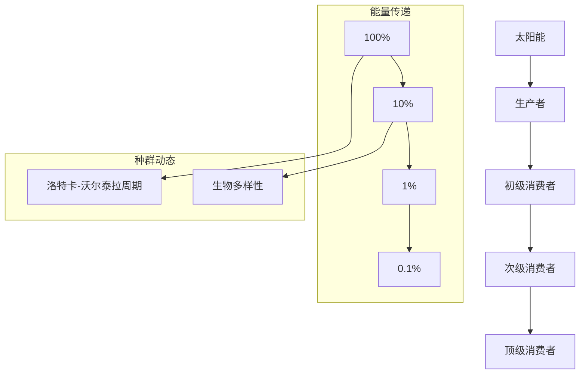

**图表来源**
- [ecosystem-scene.tsx:174-348](file://src/experiments/ecosystem-scene.tsx#L174-L348)

#### 生态机制
- **能量金字塔**: 10%能量传递效率
- **食物网**: 多条食物链相互连接
- **种群波动**: 捕食者-猎物周期性变化
- **生物多样性**: 物种丰富度与稳定性关系

**章节来源**
- [ecosystem-page.tsx:28-36](file://src/experiments/ecosystem-page.tsx#L28-L36)
- [ecosystem-scene.tsx:42-48](file://src/experiments/ecosystem-scene.tsx#L42-L48)

### 细胞呼吸实验
系统完整展示了细胞呼吸的四个阶段和ATP生成过程。

#### 呼吸过程模拟
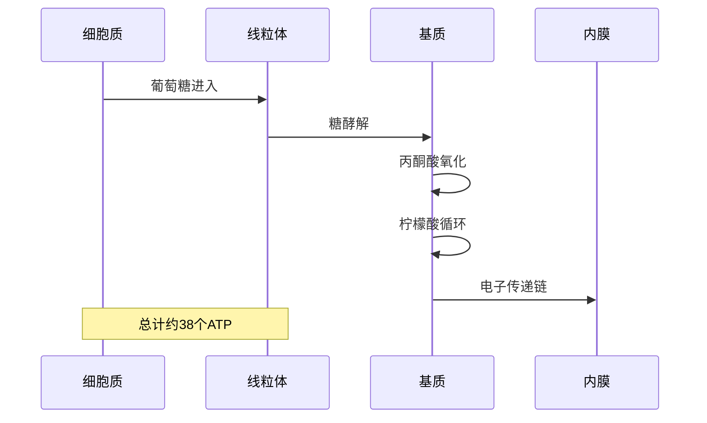

**图表来源**
- [cellular-respiration-scene.tsx:190-487](file://src/experiments/cellular-respiration-scene.tsx#L190-L487)

#### 代谢途径
- **糖酵解**: 细胞质中葡萄糖分解，产生少量ATP
- **丙酮酸氧化**: 线粒体基质中丙酮酸进一步分解
- **柠檬酸循环**: 产生NADH、FADH₂和CO₂
- **电子传递链**: 最终产生大量ATP

**章节来源**
- [cellular-respiration-page.tsx:23-35](file://src/experiments/cellular-respiration-page.tsx#L23-L35)
- [cellular-respiration-scene.tsx:85-92](file://src/experiments/cellular-respiration-scene.tsx#L85-L92)

### 神经系统实验
系统展示了神经元的动作电位传播和突触传递过程。

#### 神经信号传导
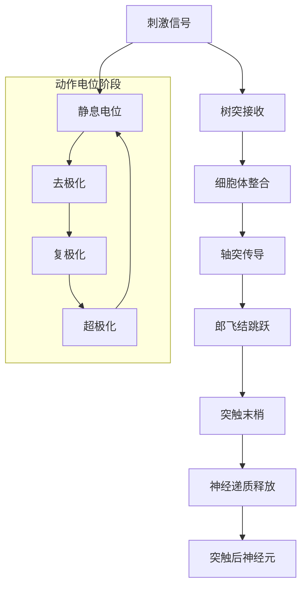

**图表来源**
- [nervous-system-scene.tsx:167-329](file://src/experiments/nervous-system-scene.tsx#L167-L329)

#### 神经机制
- **动作电位**: 神经冲动的快速电信号传播
- **跳跃传导**: 郎飞结间的离子通道开放
- **突触传递**: 化学信号从一个神经元传递到另一个
- **递质释放**: 神经递质在突触间隙扩散

**章节来源**
- [nervous-system-page.tsx:26-33](file://src/experiments/nervous-system-page.tsx#L26-L33)
- [nervous-system-scene.tsx:29-38](file://src/experiments/nervous-system-scene.tsx#L29-L38)

## 依赖关系分析

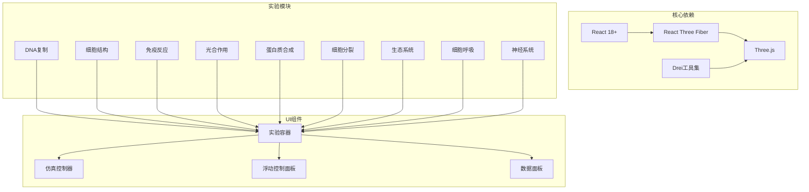

**图表来源**
- [dna-replication-page.tsx:1-12](file://src/experiments/dna-replication-page.tsx#L1-L12)
- [cell-structure-page.tsx:1-12](file://src/experiments/cell-structure-page.tsx#L1-L12)

**章节来源**
- [dna-replication-page.tsx:1-12](file://src/experiments/dna-replication-page.tsx#L1-L12)
- [cell-structure-page.tsx:1-12](file://src/experiments/cell-structure-page.tsx#L1-L12)

## 性能考虑
系统在保证视觉效果的同时，采用了多项性能优化策略：

### 渲染优化
- **帧率控制**: 使用`useFrame`钩子精确控制动画更新频率
- **状态节流**: UI状态每8帧更新一次，减少不必要的重渲染
- **几何体复用**: 复杂形状使用缓存和实例化技术
- **材质优化**: 合理使用透明度和发光材质，避免过度计算

### 内存管理
- **对象池模式**: 离子、病毒等临时对象的创建和销毁管理
- **引用优化**: 大量使用`useRef`存储物理状态，避免状态提升
- **条件渲染**: 根据显示选项动态加载3D对象

### 交互响应
- **事件委托**: 统一的鼠标和触摸事件处理
- **防抖节流**: 参数调整的防抖处理
- **异步加载**: 大型3D模型的延迟加载

## 故障排除指南

### 常见问题及解决方案

#### 3D渲染问题
- **黑屏或渲染异常**: 检查浏览器兼容性和WebGL支持
- **帧率下降**: 关闭不必要的显示选项，降低复杂度
- **模型闪烁**: 调整光源设置和材质属性

#### 交互功能问题
- **控制面板无响应**: 刷新页面，检查JavaScript错误
- **动画卡顿**: 调整仿真速度，关闭自动播放
- **数据不更新**: 检查实验状态同步机制

#### 性能优化建议
- **移动设备适配**: 关闭高精度渲染选项
- **多标签页管理**: 关闭其他占用资源的标签页
- **浏览器缓存**: 清理缓存以获得最佳性能

**章节来源**
- [dna-replication-scene.tsx:101-115](file://src/experiments/dna-replication-scene.tsx#L101-L115)
- [cell-structure-scene.tsx:83-86](file://src/experiments/cell-structure-scene.tsx#L83-L86)

## 结论
本生物类实验平台通过先进的3D可视化技术，为学习者提供了沉浸式的生命科学学习体验。系统涵盖了从分子到生态系统的完整生物学知识体系，每个实验都经过精心设计，既保证了科学准确性，又确保了良好的用户体验。

平台的主要优势包括：
- **直观的3D可视化**: 将抽象的生物学概念具象化
- **交互式学习**: 学习者可以主动探索和验证假设
- **多层次内容**: 从分子机制到生态系统，覆盖广泛领域
- **性能优化**: 在保证质量的前提下优化渲染性能
- **教育价值**: 通过游戏化的方式提高学习兴趣和效果

未来发展方向：
- 扩展更多生物学主题的实验内容
- 增强虚拟现实(VR)支持
- 开发移动端适配版本
- 集成更多教育评估功能