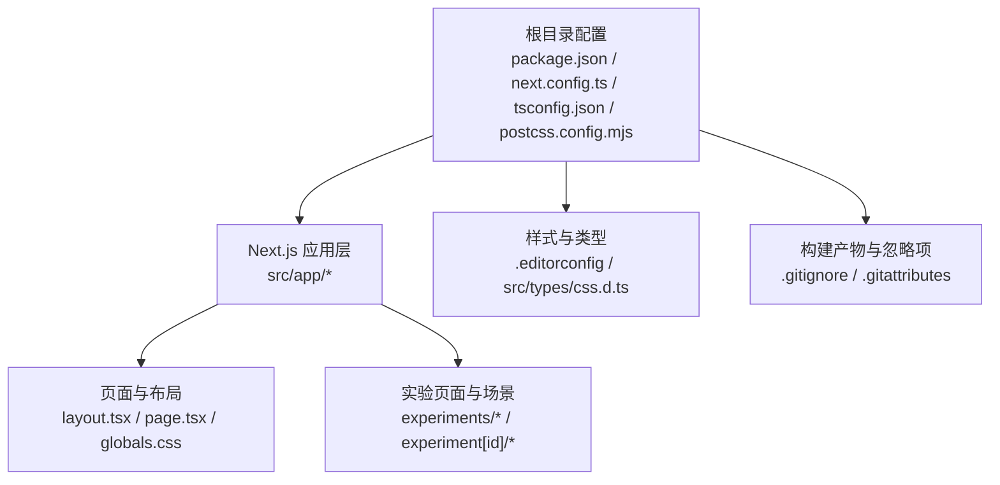
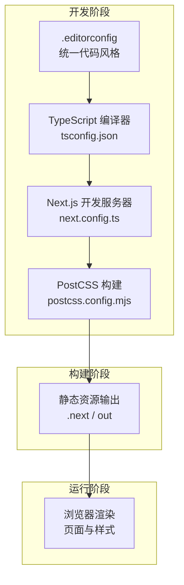
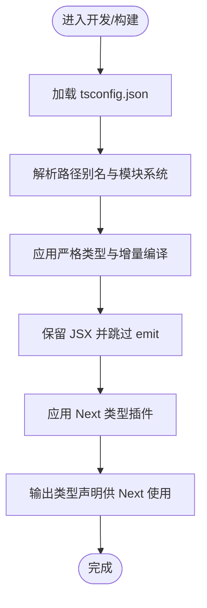
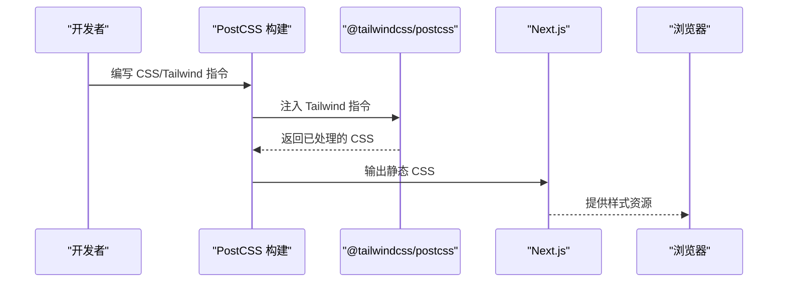
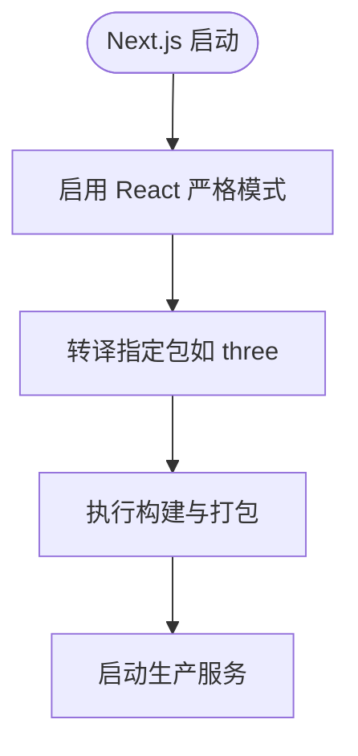
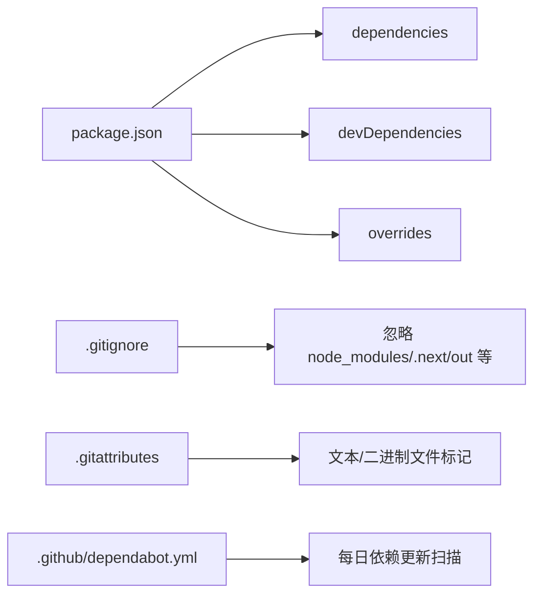
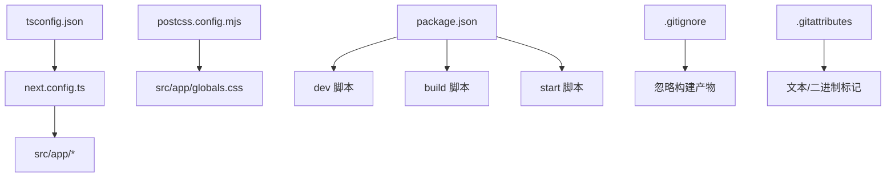

# 开发工具链

<cite>
**本文引用的文件**
- [package.json](file://package.json)
- [next.config.ts](file://next.config.ts)
- [tsconfig.json](file://tsconfig.json)
- [postcss.config.mjs](file://postcss.config.mjs)
- [.editorconfig](file://.editorconfig)
- [.gitignore](file://.gitignore)
- [.gitattributes](file://.gitattributes)
- [.github/dependabot.yml](file://.github/dependabot.yml)
- [next-env.d.ts](file://next-env.d.ts)
- [src/app/layout.tsx](file://src/app/layout.tsx)
- [src/app/globals.css](file://src/app/globals.css)
- [src/types/css.d.ts](file://src/types/css.d.ts)
</cite>

## 目录
1. [简介](#简介)
2. [项目结构](#项目结构)
3. [核心组件](#核心组件)
4. [架构总览](#架构总览)
5. [详细组件分析](#详细组件分析)
6. [依赖关系分析](#依赖关系分析)
7. [性能考量](#性能考量)
8. [故障排除指南](#故障排除指南)
9. [结论](#结论)
10. [附录](#附录)

## 简介
本文件面向ScienceLab3D的开发团队与贡献者，系统性梳理项目开发工具链的配置与使用方法，覆盖以下方面：
- TypeScript 编译配置与类型安全策略
- PostCSS 与 Tailwind CSS 的集成与样式处理流程
- 代码格式化与质量检查工具的配置与落地方式
- Next.js 构建配置、打包优化与运行参数
- 开发环境设置、调试技巧与常见问题排查
- 代码规范与最佳实践建议
- 依赖管理策略与版本控制配置
- 工具使用示例与故障排除方法

## 项目结构
该项目采用 Next.js 应用框架，结合 React 19、Three.js 生态与 Tailwind CSS 进行科学实验可视化开发。核心目录与文件如下：
- 根目录：包管理与工具配置（package.json、next.config.ts、tsconfig.json、postcss.config.mjs、.editorconfig、.gitignore、.gitattributes）
- 源码目录：src/app（页面路由）、src/components（可复用UI）、src/experiments（实验场景与页面）、src/data（数据）、src/utils（工具）、src/types（类型声明）
- 资源目录：public（静态资源）

**章节来源**
- [package.json:1-37](file://package.json#L1-L37)
- [next.config.ts:1-9](file://next.config.ts#L1-L9)
- [tsconfig.json:1-22](file://tsconfig.json#L1-L22)
- [postcss.config.mjs:1-6](file://postcss.config.mjs#L1-L6)
- [.editorconfig:1-25](file://.editorconfig#L1-L25)
- [.gitignore:1-9](file://.gitignore#L1-L9)
- [.gitattributes:1-15](file://.gitattributes#L1-L15)

## 核心组件
本节聚焦四大工具链组件及其在项目中的职责与配置要点。

- TypeScript 编译器配置（tsconfig.json）
  - 目标与模块：目标 ES2017，模块系统为 esnext，解析器为 bundler，保留 JSX 预留以便 Next.js 处理
  - 类型严格性：启用严格模式、跳过库检查、增量编译提升开发体验
  - 路径映射：通过路径别名 @/* 指向 src 目录，统一导入路径
  - 插件：集成 Next.js 内置插件以获得框架级类型支持
  - 包含范围：自动包含 next-env.d.ts，并扫描所有 ts/tsx 文件与 Next 类型生成目录

- Next.js 构建配置（next.config.ts）
  - 严格模式：开启 reactStrictMode 提升 React 组件边界检查
  - 包转译：对 three 进行显式转译以适配 ESM/CJS 差异
  - 其他：未定义额外优化或实验特性开关

- PostCSS 与 Tailwind CSS（postcss.config.mjs）
  - 插件：仅启用 @tailwindcss/postcss，用于在构建时注入 Tailwind 指令
  - 无其他 PostCSS 插件（如 autoprefixer、cssnano）默认启用，需按需添加

- 代码风格与编辑器配置（.editorconfig）
  - 统一编码与换行：UTF-8、LF
  - 缩进：空格缩进，大小为 2
  - 尾随空白：自动清理
  - 特殊文件：Markdown 不清理尾随空白；JSON、CSS/SCSS、YAML 统一缩进 2

**章节来源**
- [tsconfig.json:1-22](file://tsconfig.json#L1-L22)
- [next.config.ts:1-9](file://next.config.ts#L1-L9)
- [postcss.config.mjs:1-6](file://postcss.config.mjs#L1-L6)
- [.editorconfig:1-25](file://.editorconfig#L1-L25)

## 架构总览
下图展示从开发到构建的关键流程：编辑器遵循 .editorconfig 规范编写代码；TypeScript 在开发服务器中进行类型检查与增量编译；Next.js 使用 tsconfig.json 的编译选项与路径别名；PostCSS 通过 postcss.config.mjs 注入 Tailwind 指令，最终输出静态资源供浏览器加载。

**图表来源**
- [tsconfig.json:1-22](file://tsconfig.json#L1-L22)
- [next.config.ts:1-9](file://next.config.ts#L1-L9)
- [postcss.config.mjs:1-6](file://postcss.config.mjs#L1-L6)

## 详细组件分析

### TypeScript 配置与编译设置
- 编译目标与模块系统
  - 目标：ES2017，满足现代浏览器与 Node.js 运行时的语法支持
  - 模块：esnext，配合 bundler 解析器，利于 Tree-shaking 与按需加载
- 类型安全与检查
  - 严格模式：提升类型推断准确性与边界检查
  - 跳过库检查：加速编译，避免第三方声明文件的额外开销
  - 增量编译：提升开发服务器热更新速度
- JSX 与输出
  - JSX 保留：交由 Next.js 在构建期转换，确保与框架生态一致
  - 不发出 JS：开发阶段不生成 JS 文件，由 Next.js 管理
- 路径别名与类型插件
  - 路径别名 @/* 映射至 src，简化导入路径
  - 集成 Next 内置插件，增强框架感知与类型提示
- 包含范围与排除
  - 自动包含 next-env.d.ts，扫描 ts/tsx 与 Next 类型生成目录
  - 排除 node_modules，避免不必要的类型扫描

**图表来源**
- [tsconfig.json:1-22](file://tsconfig.json#L1-L22)
- [next-env.d.ts](file://next-env.d.ts)

**章节来源**
- [tsconfig.json:1-22](file://tsconfig.json#L1-L22)
- [next-env.d.ts](file://next-env.d.ts)

### PostCSS 与 CSS 处理流程
- 插件配置
  - 仅启用 @tailwindcss/postcss，用于在构建时注入 Tailwind 指令
  - 未启用 autoprefixer、cssnano 等插件，默认不进行厂商前缀与压缩
- 样式入口与全局样式
  - 全局样式位于 src/app/globals.css，作为 Tailwind 指令生效的载体
  - 页面布局通过 src/app/layout.tsx 引入全局样式
- 类型声明
  - src/types/css.d.ts 提供 CSS 模块类型声明，便于在 TS 中使用 CSS 模块

**图表来源**
- [postcss.config.mjs:1-6](file://postcss.config.mjs#L1-L6)
- [src/app/globals.css](file://src/app/globals.css)
- [src/app/layout.tsx](file://src/app/layout.tsx)
- [src/types/css.d.ts](file://src/types/css.d.ts)

**章节来源**
- [postcss.config.mjs:1-6](file://postcss.config.mjs#L1-L6)
- [src/app/globals.css](file://src/app/globals.css)
- [src/app/layout.tsx](file://src/app/layout.tsx)
- [src/types/css.d.ts](file://src/types/css.d.ts)

### 代码格式化与质量检查工具配置
- 编辑器风格统一
  - .editorconfig 提供跨编辑器的一致性：UTF-8、LF、空格缩进 2、自动清理尾随空白等
  - 对 Markdown、JSON、CSS/SCSS、YAML/YML 设置了特定缩进策略
- 质量检查与格式化
  - 当前仓库未包含 ESLint、Prettier 或类似工具的配置文件
  - 建议在团队内约定并引入 ESLint/Prettier，结合编辑器钩子执行格式化与检查
  - 可在 CI 中增加质量门禁，确保提交代码符合规范

**章节来源**
- [.editorconfig:1-25](file://.editorconfig#L1-L25)

### Next.js 构建配置与优化选项
- 严格模式
  - 启用 reactStrictMode，有助于提前发现副作用与异常状态
- 包转译
  - 对 three 进行显式转译，解决 ESM/CJS 差异导致的兼容性问题
- 其他
  - 未启用实验性功能或自定义 Webpack 配置，保持默认 Next.js 行为

**图表来源**
- [next.config.ts:1-9](file://next.config.ts#L1-L9)

**章节来源**
- [next.config.ts:1-9](file://next.config.ts#L1-L9)

### 依赖管理策略与版本控制配置
- 包管理与脚本
  - scripts 定义 dev/build/start，开发时通过 cross-env 关闭 Next 遥测
- 依赖分层
  - dependencies：React 19、Next.js、Three.js 生态与动画/UI 库
  - devDependencies：TypeScript、Tailwind CSS v4、PostCSS、相关类型声明与 cross-env
  - overrides：锁定 postcss 至 ^8.5.15，避免版本冲突
- 版本控制
  - .gitignore 忽略 node_modules/.next/out、构建产物与 IDE 相关文件
  - .gitattributes 统一文本文件换行与二进制资源标记
  - .github/dependabot.yml：每日扫描 pip/npm/github-actions 依赖更新

**图表来源**
- [package.json:1-37](file://package.json#L1-L37)
- [.gitignore:1-9](file://.gitignore#L1-L9)
- [.gitattributes:1-15](file://.gitattributes#L1-L15)
- [.github/dependabot.yml:1-15](file://.github/dependabot.yml#L1-L15)

**章节来源**
- [package.json:1-37](file://package.json#L1-L37)
- [.gitignore:1-9](file://.gitignore#L1-L9)
- [.gitattributes:1-15](file://.gitattributes#L1-L15)
- [.github/dependabot.yml:1-15](file://.github/dependabot.yml#L1-L15)

## 依赖关系分析
- TypeScript 与 Next.js
  - tsconfig.json 的编译选项与路径别名由 Next.js 在开发/构建期间读取与应用
  - Next 内置插件增强 TS 类型体验
- PostCSS 与 Tailwind
  - postcss.config.mjs 仅启用 @tailwindcss/postcss，确保 Tailwind 指令在构建期注入
- 依赖与构建产物
  - package.json 中的 scripts 控制开发/构建/启动流程
  - .gitignore 与 .gitattributes 影响版本控制与构建产物的提交行为

**图表来源**
- [tsconfig.json:1-22](file://tsconfig.json#L1-L22)
- [next.config.ts:1-9](file://next.config.ts#L1-L9)
- [postcss.config.mjs:1-6](file://postcss.config.mjs#L1-L6)
- [package.json:1-37](file://package.json#L1-L37)
- [.gitignore:1-9](file://.gitignore#L1-L9)
- [.gitattributes:1-15](file://.gitattributes#L1-L15)

**章节来源**
- [tsconfig.json:1-22](file://tsconfig.json#L1-L22)
- [next.config.ts:1-9](file://next.config.ts#L1-L9)
- [postcss.config.mjs:1-6](file://postcss.config.mjs#L1-L6)
- [package.json:1-37](file://package.json#L1-L37)
- [.gitignore:1-9](file://.gitignore#L1-L9)
- [.gitattributes:1-15](file://.gitattributes#L1-L15)

## 性能考量
- 开发体验
  - 启用增量编译与严格模式，缩短热更新时间并提升类型反馈速度
  - 路径别名减少深层相对路径，改善导入性能与可维护性
- 构建与运行
  - 默认 Next.js 行为已针对现代浏览器优化；如需进一步优化，可在后续引入自定义 Webpack 配置或实验性功能开关
  - PostCSS 仅启用 Tailwind 插件，避免额外处理开销
- 依赖与兼容性
  - 对 three 进行转译以保证 ESM/CJS 兼容，减少运行时错误与重复打包

[本节为通用指导，无需列出章节来源]

## 故障排除指南
- TypeScript 报错或类型缺失
  - 确认 tsconfig.json 的 include/exclude 与路径别名配置正确
  - 检查 next-env.d.ts 是否存在且被包含
  - 若使用 CSS 模块，请确认 src/types/css.d.ts 类型声明完整
- Next.js 构建失败或运行时错误
  - 检查 next.config.ts 中是否正确转译 third-party 包（如 three）
  - 清理 .next 与缓存后重试
- 样式未生效或 Tailwind 指令无效
  - 确认 postcss.config.mjs 中 @tailwindcss/postcss 已启用
  - 检查 src/app/globals.css 是否存在并被 layout.tsx 引入
- 依赖安装或版本冲突
  - 使用 overrides 锁定关键依赖版本（如 postcss）
  - 通过 .github/dependabot.yml 定期同步依赖更新，避免长期偏离

**章节来源**
- [tsconfig.json:1-22](file://tsconfig.json#L1-L22)
- [next.config.ts:1-9](file://next.config.ts#L1-L9)
- [postcss.config.mjs:1-6](file://postcss.config.mjs#L1-L6)
- [package.json:1-37](file://package.json#L1-L37)
- [.github/dependabot.yml:1-15](file://.github/dependabot.yml#L1-L15)

## 结论
本项目采用简洁而高效的工具链：TypeScript 提供强类型保障，Next.js 与路径别名提升开发效率，PostCSS 与 Tailwind 实现现代化样式管线。建议在现有基础上补充 ESLint/Prettier 与 CI 质量门禁，完善代码规范与自动化检查；同时持续关注依赖更新与版本锁定策略，确保项目长期可维护性与稳定性。

[本节为总结性内容，无需列出章节来源]

## 附录

### 开发环境设置与调试技巧
- 初始化与启动
  - 安装依赖后，使用开发脚本启动 Next.js 开发服务器
  - 如需关闭遥测，可通过环境变量控制
- 调试建议
  - 利用 Next.js 的严格模式定位潜在问题
  - 对于 Three.js 场景，优先检查转译与模块解析问题
  - 使用浏览器开发者工具观察样式与资源加载情况

**章节来源**
- [package.json:5-8](file://package.json#L5-L8)
- [next.config.ts:4-5](file://next.config.ts#L4-L5)

### 代码规范与最佳实践
- 编码与换行：统一 UTF-8 与 LF
- 缩进与空白：空格缩进 2，自动清理尾随空白
- 特殊文件：Markdown 不清理尾随空白；JSON、CSS/SCSS、YAML/YML 统一缩进 2
- 建议扩展：引入 ESLint/Prettier 并在编辑器中启用保存时格式化

**章节来源**
- [.editorconfig:1-25](file://.editorconfig#L1-L25)