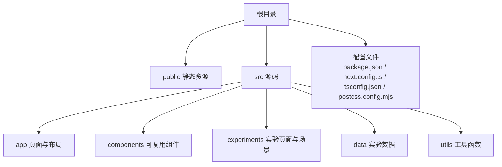
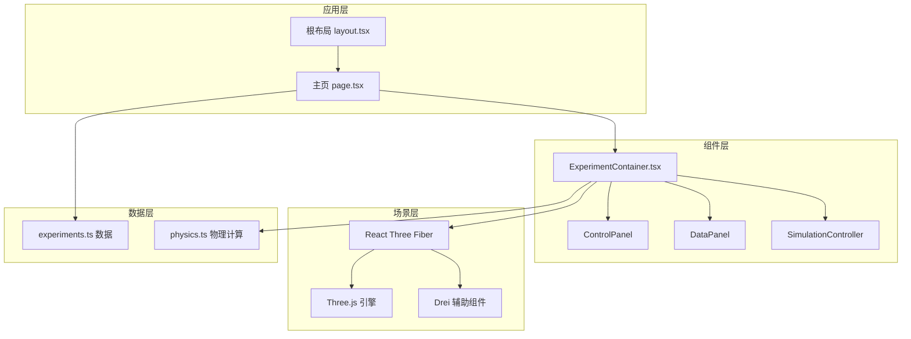
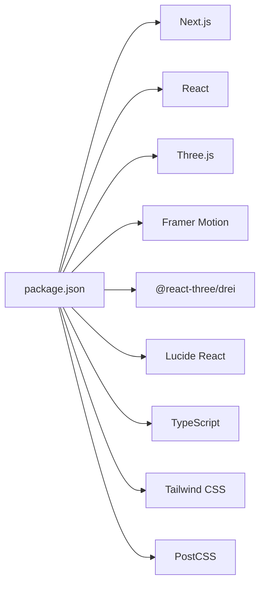

# 快速开始

<cite>
**本文引用的文件**
- [package.json](file://package.json)
- [README.md](file://README.md)
- [next.config.ts](file://next.config.ts)
- [tsconfig.json](file://tsconfig.json)
- [postcss.config.mjs](file://postcss.config.mjs)
- [src/app/layout.tsx](file://src/app/layout.tsx)
- [src/app/page.tsx](file://src/app/page.tsx)
- [src/data/experiments.ts](file://src/data/experiments.ts)
- [src/experiments/3d-geometry-page.tsx](file://src/experiments/3d-geometry-page.tsx)
- [src/components/experiment-ui/ExperimentContainer.tsx](file://src/components/experiment-ui/ExperimentContainer.tsx)
- [src/utils/physics.ts](file://src/utils/physics.ts)
- [public/manifest.json](file://public/manifest.json)
- [public/robots.txt](file://public/robots.txt)
</cite>

## 目录
1. [简介](#简介)
2. [项目结构](#项目结构)
3. [核心组件](#核心组件)
4. [架构总览](#架构总览)
5. [详细组件分析](#详细组件分析)
6. [依赖关系分析](#依赖关系分析)
7. [性能考虑](#性能考虑)
8. [故障排除指南](#故障排除指南)
9. [结论](#结论)
10. [附录](#附录)

## 简介
ScienceLab 3D 是一个基于浏览器的交互式 3D 科学学习平台，覆盖物理、化学、生物与数学四大领域，提供 40+ 个可实时控制的虚拟实验。项目采用 Next.js 15 + React 19 + TypeScript 构建，使用 Three.js、React Three Fiber 进行 3D 渲染，配合 Framer Motion 实现流畅动画，Tailwind CSS 提供样式基础，Lucide React 提供图标库。

本快速开始指南将帮助你在最短时间内完成环境准备、安装依赖、启动开发服务器，并了解如何构建与部署到生产环境。同时提供常见问题排查建议，确保你能顺利运行并开始使用。

## 项目结构
该项目遵循 Next.js App Router 的约定式路由组织方式，核心目录如下：
- public：静态资源（图标、清单、robots.txt）
- src/app：页面与布局（App Router 路由）
- src/components：可复用 UI 组件（实验控制面板、数据面板等）
- src/experiments：各实验页面与场景组件
- src/data：实验元数据与分类
- src/utils：通用工具函数（如物理公式计算）

图表来源
- [package.json:1-37](file://package.json#L1-L37)
- [next.config.ts:1-9](file://next.config.ts#L1-L9)
- [tsconfig.json:1-22](file://tsconfig.json#L1-L22)
- [postcss.config.mjs:1-6](file://postcss.config.mjs#L1-L6)

章节来源
- [package.json:1-37](file://package.json#L1-L37)
- [README.md:108-135](file://README.md#L108-L135)

## 核心组件
- 应用布局与元数据：在根布局中统一设置站点元信息、主题色、PWA 清单与 SEO 结构化数据。
- 主页：展示实验列表、搜索、分类筛选、难度过滤与收藏功能。
- 实验容器：封装 3D 场景画布、相机、光照、轨道控制器、控制面板、数据面板与模拟控制条。
- 物理工具：集中管理各类科学实验所需的物理常量与计算方法。

章节来源
- [src/app/layout.tsx:1-204](file://src/app/layout.tsx#L1-L204)
- [src/app/page.tsx:1-676](file://src/app/page.tsx#L1-L676)
- [src/components/experiment-ui/ExperimentContainer.tsx:1-374](file://src/components/experiment-ui/ExperimentContainer.tsx#L1-L374)
- [src/utils/physics.ts:1-687](file://src/utils/physics.ts#L1-L687)

## 架构总览
系统采用前后端一体化的前端渲染架构，通过 Next.js App Router 管理页面路由与数据流；3D 场景由 React Three Fiber 在 Canvas 中渲染，结合 Drei 提供的辅助组件简化光照与交互；UI 动画由 Framer Motion 提供；样式通过 Tailwind CSS 与 PostCSS 配置生成。

图表来源
- [src/app/layout.tsx:1-204](file://src/app/layout.tsx#L1-L204)
- [src/app/page.tsx:1-676](file://src/app/page.tsx#L1-L676)
- [src/components/experiment-ui/ExperimentContainer.tsx:1-374](file://src/components/experiment-ui/ExperimentContainer.tsx#L1-L374)
- [src/data/experiments.ts:1-492](file://src/data/experiments.ts#L1-L492)
- [src/utils/physics.ts:1-687](file://src/utils/physics.ts#L1-L687)

## 详细组件分析

### 安装与运行
- 环境要求
  - Node.js 18+ 与 npm
- 克隆仓库
  - git clone https://github.com/rudra496/sciencelab3d.git
  - cd sciencelab3d
- 安装依赖
  - npm install
- 启动开发服务器
  - npm run dev
  - 打开 http://localhost:3000 查看效果

预期输出（浏览器打开后）：
- 加载主页，显示“探索实验”网格与导航栏
- 支持搜索、分类筛选、难度过滤与收藏切换
- 点击任一实验卡片进入对应实验页面

章节来源
- [README.md:110-127](file://README.md#L110-L127)

### 生产构建与部署
- 构建
  - npm run build
- 启动生产服务
  - npm run start
- 部署建议
  - 本项目为纯前端应用，可部署至 Vercel、Netlify、GitHub Pages 或任意静态托管服务
  - 若使用 Vercel，直接连接 GitHub 仓库即可自动构建与部署
  - 若自建服务器，请将构建产物（.next）或 dist 输出目录作为静态站点根目录

章节来源
- [README.md:129-135](file://README.md#L129-L135)

### 关键配置文件说明
- package.json
  - 定义脚本：dev、build、start
  - 依赖：Next.js、React、Three.js、React Three Fiber、Framer Motion、Tailwind CSS、Lucide React 等
- next.config.ts
  - 开启严格模式与对 three 包的转译支持
- tsconfig.json
  - TypeScript 编译选项：严格模式、模块解析策略、路径映射等
- postcss.config.mjs
  - 使用 Tailwind PostCSS 插件

章节来源
- [package.json:1-37](file://package.json#L1-L37)
- [next.config.ts:1-9](file://next.config.ts#L1-L9)
- [tsconfig.json:1-22](file://tsconfig.json#L1-L22)
- [postcss.config.mjs:1-6](file://postcss.config.mjs#L1-L6)

### 布局与元数据
- 根布局负责：
  - 设置 viewport、主题色、图标、PWA 清单链接
  - 注入 Open Graph、Twitter Card、Schema 结构化数据
  - 引入字体与全局样式
- 元信息包括标题、描述、关键词、作者、publisher、robots 等

章节来源
- [src/app/layout.tsx:1-204](file://src/app/layout.tsx#L1-L204)
- [public/manifest.json:1-22](file://public/manifest.json#L1-L22)
- [public/robots.txt:1-9](file://public/robots.txt#L1-L9)

### 主页与实验列表
- 主页功能：
  - 导航栏：返回首页、分类标签、主题切换
  - 英雄区：动态背景、统计信息与滚动指示
  - 实验网格：按类别、难度、关键词过滤，支持收藏
  - 关于区域：工作流程说明
  - CTA 与页脚：快速链接与社交信息
- 本地存储：
  - 收藏实验与主题偏好保存在 localStorage

章节来源
- [src/app/page.tsx:1-676](file://src/app/page.tsx#L1-L676)
- [src/data/experiments.ts:1-492](file://src/data/experiments.ts#L1-L492)

### 实验容器与 3D 场景
- ExperimentContainer 封装：
  - Canvas 画布、透视相机、轨道控制器、光照、环境贴图、雾效
  - 控制面板、数据面板、模拟控制条、详情面板
  - 响应式适配（桌面/平板/移动端）
- 3D 场景组件：
  - 通过参数控制（旋转速度、线框、顶点/边显示等）
  - 实时数据显示（如欧拉示性数等）

章节来源
- [src/components/experiment-ui/ExperimentContainer.tsx:1-374](file://src/components/experiment-ui/ExperimentContainer.tsx#L1-L374)
- [src/experiments/3d-geometry-page.tsx:1-190](file://src/experiments/3d-geometry-page.tsx#L1-L190)

### 物理工具与公式
- 提供大量物理常量与公式计算：
  - 单摆周期、频率、角频率、势能、动能
  - 抛体运动范围、最大高度、飞行时间、位置与速度
  - 弹簧振子周期、角频率、弹性势能、动能
  - 理想气体压强、温度、平均动能、方均根速率
  - 波速、波长、多普勒频移、波数、角频率
  - 折射定律、全反射临界角、反射率、透射率
  - 万有引力、逃逸速度、圆轨道速度、周期、轨道能量、半长轴、偏心率、角动量
  - 双缝干涉条纹间距、强度分布
  - 角度换算、数值夹取、线性插值、区间映射

章节来源
- [src/utils/physics.ts:1-687](file://src/utils/physics.ts#L1-L687)

## 依赖关系分析
- 运行时依赖
  - Next.js：App Router、SSR/SSG、静态资源处理
  - React 与 React DOM：UI 渲染
  - Three.js 与 React Three Fiber：3D 渲染管线
  - @react-three/drei：常用 3D 辅助组件（相机、光照、阴影等）
  - @react-three/postprocessing：后期处理（可选）
  - Framer Motion：动画与过渡
  - Lucide React：图标库
- 开发依赖
  - TypeScript、Tailwind CSS、PostCSS、cross-env 等

图表来源
- [package.json:10-32](file://package.json#L10-L32)

章节来源
- [package.json:1-37](file://package.json#L1-L37)

## 性能考虑
- 3D 性能优化
  - Canvas dpr 与抗锯齿策略：移动端降低抗锯齿以提升帧率
  - 限制阴影贴图尺寸与相机远近裁剪面，减少深度缓冲压力
  - 合理使用雾效与环境光，避免过度光照计算
- 前端性能优化
  - App Router 路由懒加载与并行数据获取
  - 组件级动画与可见性控制，减少不必要的重绘
  - Tailwind CSS 按需生成样式，避免无用类
- 构建优化
  - 使用 Next.js 内置的代码分割与 Tree Shaking
  - 对大型依赖（如 three）启用转译与打包优化

## 故障排除指南
- Node.js 版本过低
  - 症状：安装失败或运行时报错
  - 处理：升级到 Node.js 18+ 并重新安装依赖
- 安装依赖失败（网络/权限）
  - 症状：npm install 报错
  - 处理：更换镜像源、检查代理、使用管理员权限或降级 npm 版本
- 开发服务器无法启动（端口占用）
  - 症状：端口 3000 被占用
  - 处理：关闭占用进程或修改 Next.js 端口配置
- 3D 场景渲染异常（黑屏/白屏）
  - 症状：Canvas 无内容或闪烁
  - 处理：检查浏览器 WebGL 支持、禁用硬件加速、更新显卡驱动
- 移动端交互不灵敏
  - 症状：拖拽旋转/缩放不顺畅
  - 处理：确认触摸事件未被拦截、调整 OrbitControls 参数（旋转/缩放速度）
- 收藏与主题设置无效
  - 症状：刷新后丢失
  - 处理：检查浏览器隐私模式是否阻止 localStorage、确认同源策略

章节来源
- [README.md:110-127](file://README.md#L110-L127)

## 结论
通过本指南，你已掌握 ScienceLab 3D 的环境准备、安装、运行、构建与部署全流程。项目采用现代化前端技术栈，具备良好的扩展性与跨平台能力。建议在本地验证后，结合实际需求进行定制化开发与部署。

## 附录
- 常用命令
  - 开发：npm run dev
  - 构建：npm run build
  - 启动：npm run start
- 浏览器兼容性
  - 推荐 Chrome/Edge 最新版本；Safari 15+；Firefox 120+
- PWA 与 SEO
  - 已内置 manifest.json 与 robots.txt，可直接用于 PWA 与搜索引擎索引