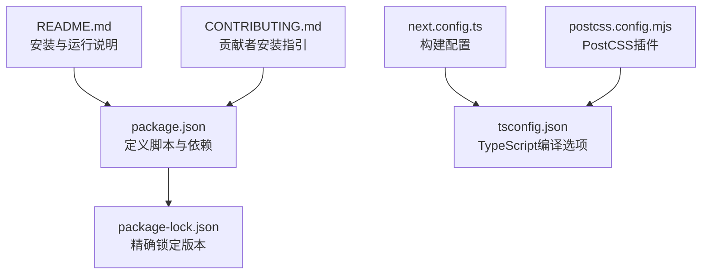
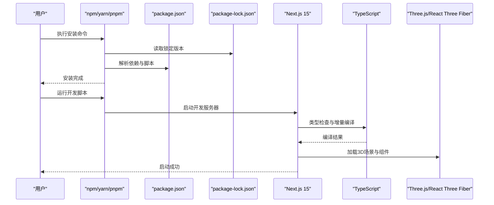
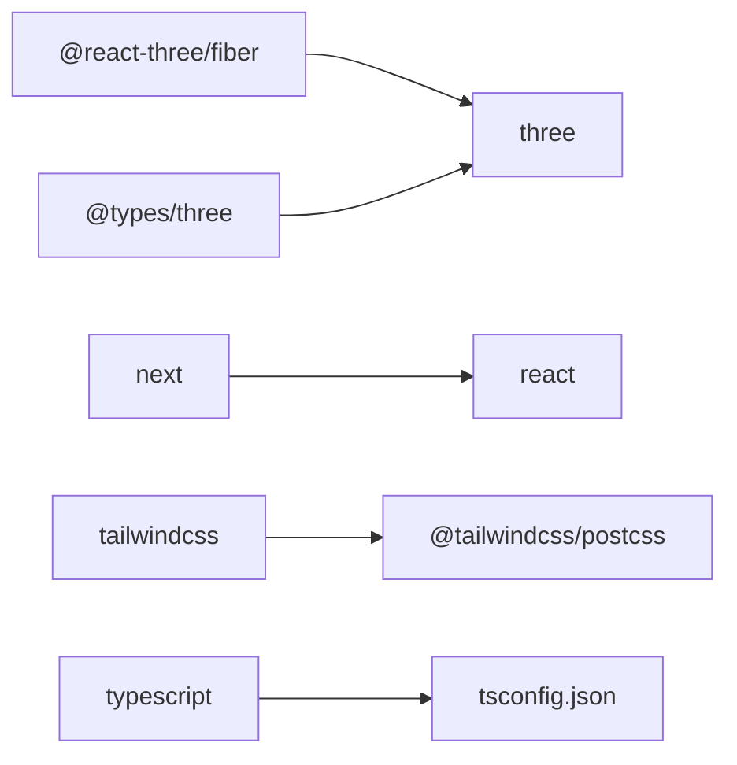

# 安装问题

<cite>
**本文引用的文件**
- [package.json](file://package.json)
- [package-lock.json](file://package-lock.json)
- [README.md](file://README.md)
- [next.config.ts](file://next.config.ts)
- [tsconfig.json](file://tsconfig.json)
- [postcss.config.mjs](file://postcss.config.mjs)
- [CONTRIBUTING.md](file://CONTRIBUTING.md)
</cite>

## 目录
1. [简介](#简介)
2. [项目结构](#项目结构)
3. [核心组件](#核心组件)
4. [架构总览](#架构总览)
5. [详细组件分析](#详细组件分析)
6. [依赖关系分析](#依赖关系分析)
7. [性能考虑](#性能考虑)
8. [故障排除指南](#故障排除指南)
9. [结论](#结论)
10. [附录](#附录)

## 简介
本指南聚焦于ScienceLab3D在安装与开发环境搭建过程中可能遇到的问题，特别是Node.js版本兼容性、npm依赖安装失败、TypeScript编译错误等常见问题，并提供跨平台（Windows、macOS、Linux）的针对性解决方案。同时覆盖依赖冲突诊断与修复、缓存清理与重新安装流程、package-lock.json问题与版本锁定策略、网络代理与镜像源配置建议。

## 项目结构
该项目为基于Next.js 15与React 19的前端应用，使用TypeScript进行类型检查，采用Tailwind CSS进行样式处理，并通过Three.js与React Three Fiber实现3D可视化。关键配置文件包括：
- 包管理与依赖：package.json、package-lock.json
- 构建与运行：next.config.ts、postcss.config.mjs
- 类型系统：tsconfig.json
- 使用说明与前置条件：README.md、CONTRIBUTING.md

图表来源
- [package.json:1-37](file://package.json#L1-L37)
- [package-lock.json:1-3271](file://package-lock.json#L1-L3271)
- [next.config.ts:1-9](file://next.config.ts#L1-L9)
- [tsconfig.json:1-22](file://tsconfig.json#L1-L22)
- [postcss.config.mjs:1-6](file://postcss.config.mjs#L1-L6)
- [README.md:108-135](file://README.md#L108-L135)
- [CONTRIBUTING.md:16-23](file://CONTRIBUTING.md#L16-L23)

章节来源
- [package.json:1-37](file://package.json#L1-L37)
- [README.md:108-135](file://README.md#L108-L135)
- [CONTRIBUTING.md:16-23](file://CONTRIBUTING.md#L16-L23)

## 核心组件
- Node.js与包管理器
  - 前置要求：Node.js 18+，推荐使用稳定版LTS。
  - 包管理器：npm（默认），亦可使用yarn或pnpm（需自行调整命令）。
- Next.js 15
  - 提供App Router、服务端渲染与静态生成能力；已启用严格模式与特定包转译。
- React 19 与 TypeScript
  - 强类型检查、增量编译与模块解析策略确保开发体验。
- Three.js与React Three Fiber
  - 3D场景渲染与交互控制的核心库。
- Tailwind CSS与PostCSS
  - 工具化CSS与构建链集成。

章节来源
- [README.md:110-111](file://README.md#L110-L111)
- [CONTRIBUTING.md:11-13](file://CONTRIBUTING.md#L11-L13)
- [next.config.ts:3-6](file://next.config.ts#L3-L6)
- [tsconfig.json:2-18](file://tsconfig.json#L2-L18)
- [package.json:10-31](file://package.json#L10-L31)

## 架构总览
下图展示从安装到启动的关键流程与依赖关系：

图表来源
- [package.json:5-8](file://package.json#L5-L8)
- [package-lock.json:1-33](file://package-lock.json#L1-L33)
- [next.config.ts:3-6](file://next.config.ts#L3-L6)
- [tsconfig.json:2-18](file://tsconfig.json#L2-L18)
- [package.json:10-21](file://package.json#L10-L21)

## 详细组件分析

### Node.js与包管理器
- 版本要求
  - 项目文档明确要求Node.js 18+，建议优先使用LTS版本以获得更稳定的依赖编译与安装体验。
- 包管理器选择
  - 默认使用npm；如需切换至yarn或pnpm，请确保工具版本满足项目依赖范围。
- 脚本入口
  - 开发：next dev（带遥测禁用）
  - 构建：next build
  - 启动：next start

章节来源
- [README.md:110-111](file://README.md#L110-L111)
- [package.json:5-8](file://package.json#L5-L8)

### Next.js 15与构建配置
- 严格模式
  - 启用reactStrictMode以提升开发期行为一致性。
- 包转译
  - 对three进行显式转译，避免打包阶段的兼容性问题。
- SWC二进制
  - 锁定各平台的SWC二进制，确保跨平台一致的编译行为。

章节来源
- [next.config.ts:3-6](file://next.config.ts#L3-L6)
- [package-lock.json:650-783](file://package-lock.json#L650-L783)

### TypeScript编译配置
- 目标与模块
  - 目标：ES2017；模块：esnext；模块解析：bundler，适配现代打包器。
- 严格性与增量
  - 严格模式、跳过库检查、增量编译，兼顾准确性与性能。
- JSX与路径映射
  - JSX保留策略、路径别名@/*映射至src目录，便于导入组织。

章节来源
- [tsconfig.json:2-18](file://tsconfig.json#L2-L18)

### Tailwind CSS与PostCSS
- PostCSS插件
  - 集成Tailwind CSS相关插件，确保样式构建链完整。
- 与Next.js集成
  - 通过next.config.ts中的transpilePackages保证three等包的兼容性。

章节来源
- [postcss.config.mjs:1-6](file://postcss.config.mjs#L1-L6)
- [next.config.ts:3-6](file://next.config.ts#L3-L6)

## 依赖关系分析
- 直接依赖
  - Next.js、React、TypeScript、Three.js、React Three Fiber、Framer Motion、Tailwind CSS等。
- 开发依赖
  - TypeScript类型声明、Tailwind CSS相关工具、PostCSS、cross-env等。
- 版本锁定
  - package-lock.json精确记录依赖树，避免因版本漂移导致的安装差异。

图表来源
- [package.json:10-31](file://package.json#L10-L31)
- [package-lock.json:1-33](file://package-lock.json#L1-33)

章节来源
- [package.json:10-31](file://package.json#L10-L31)
- [package-lock.json:1-33](file://package-lock.json#L1-L33)

## 性能考虑
- 使用package-lock.json确保依赖版本一致，减少重复下载与冲突。
- 启用TypeScript增量编译与严格模式，平衡构建速度与质量。
- 利用Next.js的SWC与预构建优化，缩短启动时间。
- 在大型依赖（如three）上启用转译与按需加载策略，降低首屏负担。

## 故障排除指南

### 一、Node.js版本兼容性问题
- 症状
  - 安装时提示“不支持的引擎”或运行时报错。
- 排查要点
  - 检查当前Node.js版本是否满足“18+”要求。
  - 确认使用的包管理器与Node版本匹配（npm/yarn/pnpm均需对应版本）。
- 解决方案
  - 升级至Node.js LTS（推荐版本见各发行渠道）。
  - 清理缓存后重试安装（见“缓存清理与重新安装”）。
- 平台差异
  - Windows/macOS/Linux均应遵循同一版本要求；若使用nvm/n（Node版本管理器），请确保切换到正确版本后再执行安装。

章节来源
- [README.md:110-111](file://README.md#L110-L111)
- [CONTRIBUTING.md:11-13](file://CONTRIBUTING.md#L11-L13)

### 二、npm依赖安装失败
- 常见原因
  - 网络超时、权限不足、缓存损坏、代理或镜像源配置不当。
- 快速定位
  - 查看完整错误日志，确认是网络问题还是权限问题。
  - 检查package-lock.json是否存在异常或版本冲突迹象。
- 解决步骤
  1) 清理缓存与重装
     - 删除node_modules与package-lock.json，清空npm缓存，重新安装。
  2) 网络与代理
     - 若处于内网或受限网络，配置npm代理或使用国内镜像源。
  3) 权限问题
     - 在类Unix系统中避免使用sudo；必要时修正全局目录权限。
  4) 版本锁定
     - 如存在版本漂移，确保使用package-lock.json进行精确安装。
- 平台差异
  - Windows：注意PowerShell执行策略与管理员权限；建议使用Git Bash或WSL。
  - macOS：Homebrew安装的Node.js与系统自带可能冲突，建议统一使用n（Node版本管理器）。
  - Linux：root权限安装可能导致权限问题，建议使用非root用户或nvm。

章节来源
- [package.json:5-8](file://package.json#L5-L8)
- [package-lock.json:1-33](file://package-lock.json#L1-33)

### 三、TypeScript编译错误
- 症状
  - 构建阶段出现类型错误、模块解析失败或增量编译异常。
- 排查要点
  - 检查tsconfig.json的模块解析策略与目标版本是否与依赖兼容。
  - 确认路径别名@/*是否正确映射至src目录。
- 解决方案
  1) 保持TypeScript版本与项目依赖范围一致。
  2) 确保所有新增文件符合严格模式与增量编译要求。
  3) 如涉及第三方包，补充必要的类型声明或使用@types/*。
- 平台差异
  - 不同平台对大小写敏感性与路径分隔符的差异可能导致模块解析失败，建议统一使用小写与正斜杠。

章节来源
- [tsconfig.json:2-18](file://tsconfig.json#L2-L18)
- [package.json:22-31](file://package.json#L22-L31)

### 四、依赖冲突与版本锁定
- 症状
  - 多个包对同一依赖的不同版本产生冲突，导致运行时异常或构建失败。
- 诊断方法
  - 使用npm ls查看依赖树，定位冲突版本。
  - 对照package-lock.json，确认是否存在重复或不一致的版本条目。
- 修复策略
  1) 使用package-lock.json进行精确安装，避免版本漂移。
  2) 如确需升级某依赖，先在隔离环境中测试，再提交更新。
  3) 对于可选依赖（如sharp系列），确认其平台与Node版本要求。
- 相关条目参考
  - sharp系列包对Node版本有明确要求（例如^18.17.0、^20.3.0、>=21.0.0），若当前Node版本不在范围内，需调整Node版本或降级依赖。

章节来源
- [package-lock.json:126-169](file://package-lock.json#L126-L169)
- [package-lock.json:330-373](file://package-lock.json#L330-L373)
- [package-lock.json:440-461](file://package-lock.json#L440-L461)
- [package-lock.json:484-505](file://package-lock.json#L484-L505)
- [package-lock.json:506-524](file://package-lock.json#L506-L524)
- [package-lock.json:525-581](file://package-lock.json#L525-L581)

### 五、缓存清理与重新安装
- 步骤
  1) 删除node_modules与package-lock.json。
  2) 清空npm缓存（或对应包管理器的缓存）。
  3) 重新执行安装命令。
  4) 再次运行开发脚本验证。
- 注意事项
  - 在Windows上删除node_modules时，若遇到权限问题，尝试以管理员身份运行或关闭占用进程。
  - 在类Unix系统中，确保当前用户对项目目录具有读写权限。

章节来源
- [README.md:113-125](file://README.md#L113-L125)
- [CONTRIBUTING.md:16-23](file://CONTRIBUTING.md#L16-L23)

### 六、网络代理与镜像源配置
- npm代理
  - 若公司网络需要代理，可通过npm config set http(s)-proxy设置代理地址与端口。
- 镜像源
  - 可临时切换至国内镜像源（如淘宝镜像）以提高下载速度，完成后可恢复默认源。
- 适用场景
  - 在受限网络环境下首次安装或升级依赖时尤为有效。
- 平台差异
  - Windows/macOS/Linux均可通过命令行或图形界面配置代理；建议在CI/CD环境中统一配置。

章节来源
- [README.md:113-125](file://README.md#L113-L125)
- [CONTRIBUTING.md:16-23](file://CONTRIBUTING.md#L16-L23)

### 七、跨平台安装要点
- Windows
  - 使用Git Bash或WSL以获得更好的类Unix体验。
  - 确保Node.js安装路径不含空格，避免命令行参数解析问题。
- macOS
  - 使用n（Node版本管理器）统一管理多版本Node.js，避免系统自带与外部安装冲突。
- Linux
  - 使用nvm安装与切换Node.js版本；确保系统已安装构建工具链（如gcc、make）以编译原生模块。

章节来源
- [README.md:110-111](file://README.md#L110-L111)
- [CONTRIBUTING.md:11-13](file://CONTRIBUTING.md#L11-L13)

## 结论
安装问题通常源于Node.js版本不匹配、网络与缓存问题、TypeScript配置不当或依赖版本冲突。通过遵循本文提供的诊断与修复步骤，结合平台特性与镜像源配置，可高效解决大多数安装与开发环境问题。建议在团队协作中统一Node.js版本与包管理器，以减少环境差异带来的摩擦。

## 附录

### A. 常见命令速查
- 安装依赖：npm install
- 启动开发：npm run dev
- 生产构建：npm run build && npm run start

章节来源
- [README.md:113-134](file://README.md#L113-L134)
- [CONTRIBUTING.md:16-23](file://CONTRIBUTING.md#L16-L23)