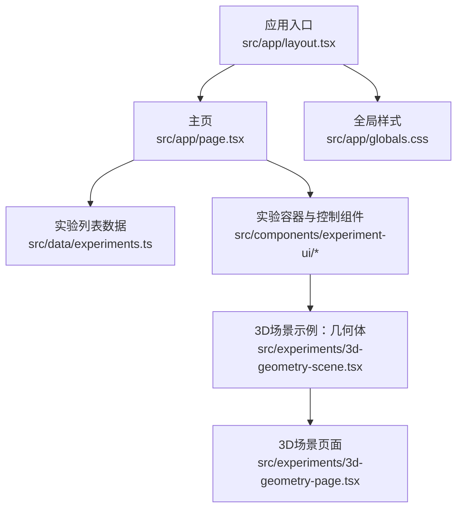
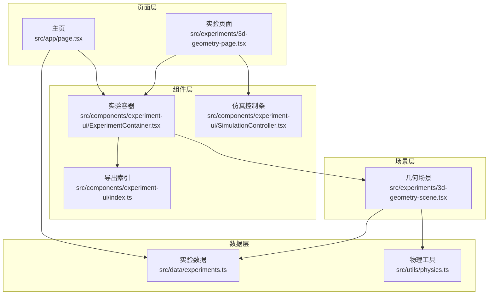
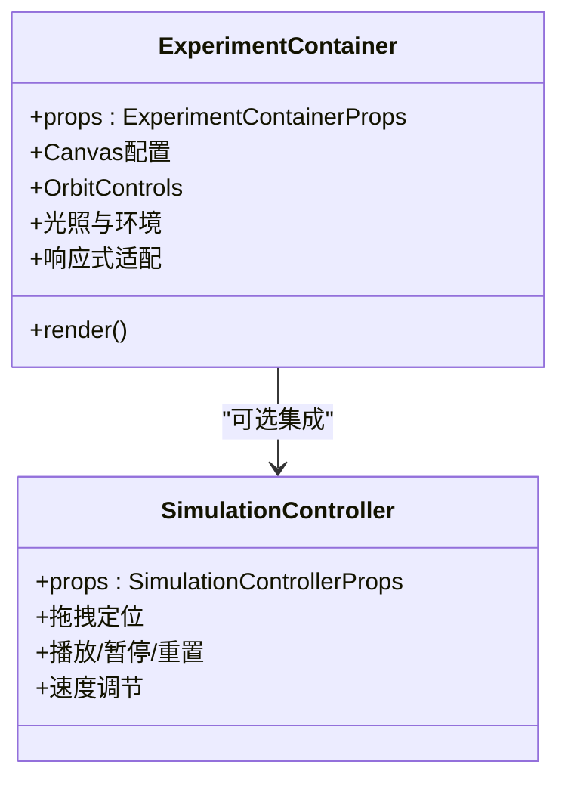
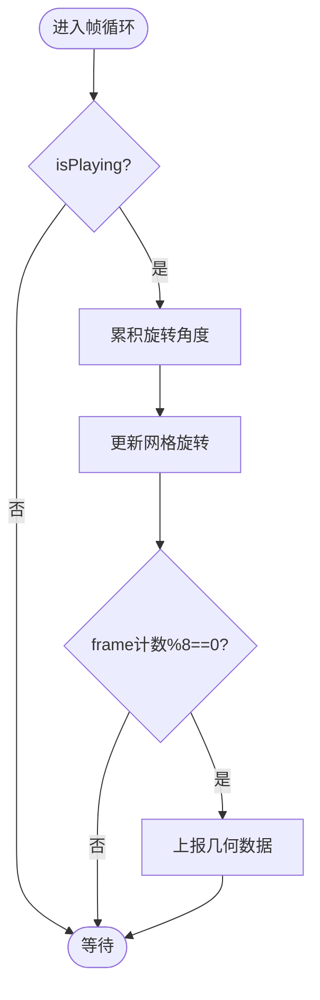
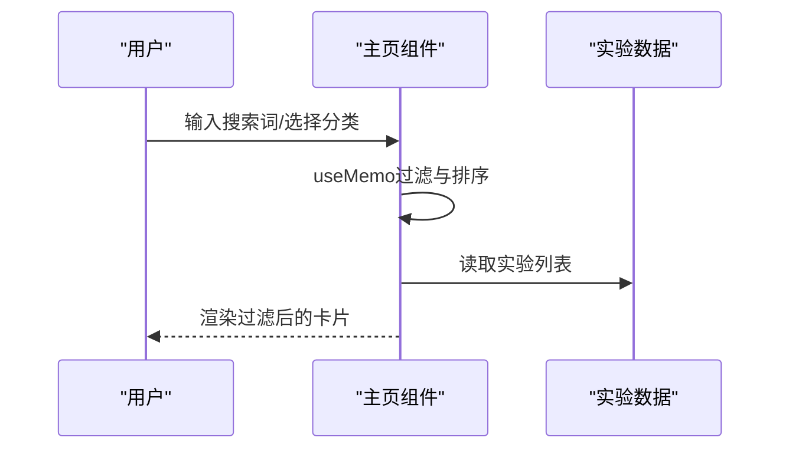
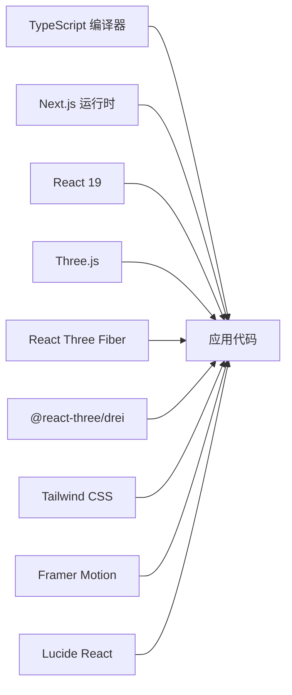

# 开发调试

<cite>
**本文引用的文件**
- [package.json](file://package.json)
- [tsconfig.json](file://tsconfig.json)
- [next.config.ts](file://next.config.ts)
- [README.md](file://README.md)
- [.editorconfig](file://.editorconfig)
- [src/app/layout.tsx](file://src/app/layout.tsx)
- [src/app/page.tsx](file://src/app/page.tsx)
- [src/components/experiment-ui/index.ts](file://src/components/experiment-ui/index.ts)
- [src/data/experiments.ts](file://src/data/experiments.ts)
- [src/utils/physics.ts](file://src/utils/physics.ts)
- [src/experiments/3d-geometry-page.tsx](file://src/experiments/3d-geometry-page.tsx)
- [src/experiments/3d-geometry-scene.tsx](file://src/experiments/3d-geometry-scene.tsx)
- [src/components/experiment-ui/ExperimentContainer.tsx](file://src/components/experiment-ui/ExperimentContainer.tsx)
- [src/components/experiment-ui/SimulationController.tsx](file://src/components/experiment-ui/SimulationController.tsx)
</cite>

## 目录
1. [简介](#简介)
2. [项目结构](#项目结构)
3. [核心组件](#核心组件)
4. [架构总览](#架构总览)
5. [详细组件分析](#详细组件分析)
6. [依赖关系分析](#依赖关系分析)
7. [性能考量](#性能考量)
8. [故障排查指南](#故障排查指南)
9. [结论](#结论)
10. [附录](#附录)

## 简介
本指南面向ScienceLab3D的开发者与贡献者，聚焦于本地开发调试实践，覆盖以下主题：
- TypeScript编译错误的诊断与修复
- React开发工具（React DevTools、Redux DevTools）在本项目中的使用要点
- 实验场景与3D对象的调试方法
- 单元测试与集成测试的调试技巧
- Git冲突解决与分支合并策略
- 代码格式化与linting规则配置与修复
- 本地开发服务器常见问题排查

本指南以仓库现有代码为依据，结合实际文件路径与功能模块，提供可操作的调试流程与最佳实践。

## 项目结构
项目采用Next.js App Router组织方式，前端以React 19 + TypeScript构建，3D渲染基于Three.js与React Three Fiber，UI使用Tailwind CSS与Framer Motion，实验数据与控制组件集中在src目录下。

图表来源
- [src/app/layout.tsx](file://src/app/layout.tsx)
- [src/app/page.tsx](file://src/app/page.tsx)
- [src/data/experiments.ts](file://src/data/experiments.ts)
- [src/components/experiment-ui/index.ts](file://src/components/experiment-ui/index.ts)
- [src/experiments/3d-geometry-scene.tsx](file://src/experiments/3d-geometry-scene.tsx)
- [src/experiments/3d-geometry-page.tsx](file://src/experiments/3d-geometry-page.tsx)

章节来源
- [README.md](file://README.md)
- [src/app/layout.tsx](file://src/app/layout.tsx)
- [src/app/page.tsx](file://src/app/page.tsx)
- [src/data/experiments.ts](file://src/data/experiments.ts)
- [src/components/experiment-ui/index.ts](file://src/components/experiment-ui/index.ts)
- [src/experiments/3d-geometry-scene.tsx](file://src/experiments/3d-geometry-scene.tsx)
- [src/experiments/3d-geometry-page.tsx](file://src/experiments/3d-geometry-page.tsx)

## 核心组件
- 应用布局与元数据：负责站点标题、描述、Open Graph、Twitter Card等SEO与社交分享信息，以及根HTML标签与全局样式注入。
- 主页与导航：提供实验分类筛选、搜索、收藏管理、主题切换与动画效果。
- 实验容器与控制面板：封装Canvas、相机、光照、轨道控制器、悬浮控制面板、数据面板与仿真控制条。
- 物理计算工具：集中定义常量与公式，供各实验复用。
- 3D几何实验：演示平台体（Platonic Solid）可视化、顶点/边/面统计、欧拉示性数验证与实时旋转。

章节来源
- [src/app/layout.tsx](file://src/app/layout.tsx)
- [src/app/page.tsx](file://src/app/page.tsx)
- [src/components/experiment-ui/ExperimentContainer.tsx](file://src/components/experiment-ui/ExperimentContainer.tsx)
- [src/components/experiment-ui/SimulationController.tsx](file://src/components/experiment-ui/SimulationController.tsx)
- [src/utils/physics.ts](file://src/utils/physics.ts)
- [src/experiments/3d-geometry-scene.tsx](file://src/experiments/3d-geometry-scene.tsx)
- [src/experiments/3d-geometry-page.tsx](file://src/experiments/3d-geometry-page.tsx)

## 架构总览
系统采用“页面层（App Router）—组件层（实验UI）—场景层（3D场景）—数据层（实验数据/物理工具）”的分层设计。页面负责交互与状态，组件层负责3D画布与控制面板，场景层负责具体实验的几何与动画，数据层提供实验元数据与物理公式。

图表来源
- [src/app/page.tsx](file://src/app/page.tsx)
- [src/experiments/3d-geometry-page.tsx](file://src/experiments/3d-geometry-page.tsx)
- [src/components/experiment-ui/ExperimentContainer.tsx](file://src/components/experiment-ui/ExperimentContainer.tsx)
- [src/components/experiment-ui/SimulationController.tsx](file://src/components/experiment-ui/SimulationController.tsx)
- [src/components/experiment-ui/index.ts](file://src/components/experiment-ui/index.ts)
- [src/experiments/3d-geometry-scene.tsx](file://src/experiments/3d-geometry-scene.tsx)
- [src/data/experiments.ts](file://src/data/experiments.ts)
- [src/utils/physics.ts](file://src/utils/physics.ts)

## 详细组件分析

### 组件A：实验容器（ExperimentContainer）
职责与特性
- 封装React Three Fiber画布、相机、光照与阴影设置
- 提供轨道控制器、环境贴图与雾化效果
- 支持全屏控制面板与数据面板的显示/隐藏
- 响应式适配桌面/平板/移动端，动态调整FOV与dpr
- 内置Canvas尺寸监听与事件派发，确保渲染一致性

调试要点
- 若出现渲染异常或黑屏，优先检查相机位置、远近裁剪与阴影参数
- 移动端性能问题可通过降低dpr与关闭抗锯齿缓解
- 控制面板遮挡或点击穿透，检查z-index与pointer-events

图表来源
- [src/components/experiment-ui/ExperimentContainer.tsx](file://src/components/experiment-ui/ExperimentContainer.tsx)
- [src/components/experiment-ui/SimulationController.tsx](file://src/components/experiment-ui/SimulationController.tsx)

章节来源
- [src/components/experiment-ui/ExperimentContainer.tsx](file://src/components/experiment-ui/ExperimentContainer.tsx)
- [src/components/experiment-ui/SimulationController.tsx](file://src/components/experiment-ui/SimulationController.tsx)

### 组件B：3D几何场景（Geometry3DSceneComponent）
职责与特性
- 根据形状类型生成不同平台体几何体
- 计算顶点集合、边线集合，支持线框/实心模式
- 使用useFrame进行每帧旋转更新，并节流上报数据
- 向父级传递几何统计（顶点/边/面/欧拉示性数/当前旋转角）

调试要点
- 若边线不显示，检查几何是否包含索引属性与索引数量
- 线框模式下材质透明度与颜色需匹配
- 数据上报节流（每8帧一次）避免高频重渲染

图表来源
- [src/experiments/3d-geometry-scene.tsx](file://src/experiments/3d-geometry-scene.tsx)

章节来源
- [src/experiments/3d-geometry-scene.tsx](file://src/experiments/3d-geometry-scene.tsx)

### 组件C：主页与实验列表（Home + experiments.ts）
职责与特性
- 提供实验分类、难度筛选、搜索过滤与收藏管理
- 使用useMemo进行过滤结果缓存，减少重渲染
- 支持主题切换与本地存储持久化

调试要点
- 过滤逻辑复杂时，建议拆分函数并添加日志观察中间结果
- 搜索关键词大小写与多主题匹配需统一处理
- 收藏状态变更后需同步更新UI与本地存储

图表来源
- [src/app/page.tsx](file://src/app/page.tsx)
- [src/data/experiments.ts](file://src/data/experiments.ts)

章节来源
- [src/app/page.tsx](file://src/app/page.tsx)
- [src/data/experiments.ts](file://src/data/experiments.ts)

### 组件D：仿真控制条（SimulationController）
职责与特性
- 可拖拽悬浮控件，包含播放/暂停、重置、时间显示与速度调节
- 移动端自适应宽度与位置，约束在视口内
- 防止拖拽误触按钮，对子元素进行命中检测

调试要点
- 拖拽边界异常时，检查panel尺寸与window尺寸获取时机
- 移动端触摸事件与鼠标事件需分别处理，避免重复绑定

章节来源
- [src/components/experiment-ui/SimulationController.tsx](file://src/components/experiment-ui/SimulationController.tsx)

## 依赖关系分析
- 构建与运行时
  - Next.js 15、React 19、TypeScript 5
  - Three.js、React Three Fiber、Drei、PostProcessing
  - Tailwind CSS、Framer Motion、Lucide React
- 关键配置
  - tsconfig启用严格模式、增量编译、插件支持
  - next.config启用reactStrictMode与three转译
  - package.json脚本用于开发、构建与启动

图表来源
- [package.json](file://package.json)
- [tsconfig.json](file://tsconfig.json)
- [next.config.ts](file://next.config.ts)

章节来源
- [package.json](file://package.json)
- [tsconfig.json](file://tsconfig.json)
- [next.config.ts](file://next.config.ts)

## 性能考量
- 3D渲染优化
  - 移动端降低dpr与关闭抗锯齿；必要时禁用阴影或降低分辨率
  - 合理使用useMemo与useCallback，避免不必要的重渲染
  - 场景中几何体与材质尽量复用，减少对象创建
- 页面与组件
  - 主页过滤使用useMemo缓存，避免每次渲染都重新计算
  - 控制面板与数据面板按需渲染，减少DOM节点
- 资源加载
  - 图片与字体懒加载，避免阻塞首屏

## 故障排查指南

### TypeScript编译错误诊断与修复
- 常见问题
  - 类型不匹配：检查接口定义与调用处的字段类型与可选性
  - 模块解析失败：确认tsconfig的paths与moduleResolution配置一致
  - 严格模式报错：逐步放宽规则或补充类型注解
- 修复步骤
  - 查看编译输出的具体文件与行列号
  - 对照tsconfig的compilerOptions逐项核对
  - 使用IDE的类型提示定位问题上下文

章节来源
- [tsconfig.json](file://tsconfig.json)

### React开发工具使用
- React DevTools
  - 安装浏览器扩展后，在实验页面打开，查看组件树与状态变化
  - 观察主页过滤逻辑与实验容器的渲染次数，验证useMemo效果
- Redux DevTools
  - 本项目未直接引入Redux，如需状态管理可按需接入并配置
  - 若已存在状态管理，可在DevTools中查看action与state变化

章节来源
- [src/app/page.tsx](file://src/app/page.tsx)
- [src/components/experiment-ui/ExperimentContainer.tsx](file://src/components/experiment-ui/ExperimentContainer.tsx)

### 实验场景与3D对象调试
- 3D几何实验
  - 若模型不显示：检查几何体构造与材质属性
  - 边线缺失：确认几何是否包含索引，且showEdges为true
  - 数据面板无更新：检查节流上报条件与onDataChange回调
- 通用3D调试
  - 使用OrbitControls调整视角，观察光照与阴影
  - 在移动端验证触摸旋转/缩放/平移是否正常

章节来源
- [src/experiments/3d-geometry-scene.tsx](file://src/experiments/3d-geometry-scene.tsx)
- [src/components/experiment-ui/ExperimentContainer.tsx](file://src/components/experiment-ui/ExperimentContainer.tsx)

### 单元测试与集成测试调试
- 单元测试
  - 针对物理工具函数（如calculateSpringPE、calculateWavelength）编写断言
  - 使用最小化Mock模拟外部依赖（如localStorage）
- 集成测试
  - 使用React Testing Library或类似方案，挂载实验容器与场景组件
  - 验证用户交互（播放/暂停、重置、参数滑块）对状态的影响
- 调试技巧
  - 通过console.log或测试框架的调试模式定位异步流程
  - 对useFrame等动画逻辑进行时间推进模拟

[本节为通用指导，无需特定文件引用]

### Git冲突解决与分支合并
- 冲突原因
  - 多人同时修改同一文件的相邻行
  - 分支间差异较大导致自动合并失败
- 解决步骤
  - 使用版本工具查看冲突文件，逐段比对差异
  - 明确保留逻辑，删除冲突标记（<<<<<<<、=======、>>>>>>>）
  - 重新运行构建与测试，确保功能正常
- 预防措施
  - 频繁同步主分支，小步提交
  - 合理拆分功能分支，减少长时分支

[本节为通用指导，无需特定文件引用]

### 代码格式化与linting规则
- EditorConfig
  - 统一换行符、缩进与尾随空白处理
  - 针对JSON/CSS/YAML等文件设置缩进规范
- TypeScript与ESLint
  - 项目使用TypeScript严格模式，建议配合ESLint规则保持一致性
  - 常用规则：no-unused-vars、no-explicit-any、prefer-const等
- 修复方法
  - 使用编辑器的保存时自动格式化
  - 执行格式化命令（如eslint --fix）批量修复

章节来源
- [.editorconfig](file://.editorconfig)

### 本地开发服务器问题排查
- 启动失败
  - 检查Node.js版本与依赖安装（package.json）
  - 清理缓存后重装依赖
- 热更新异常
  - 关闭其他占用端口的进程，确保3000端口可用
  - 检查next.config与第三方包的兼容性
- 浏览器渲染问题
  - 清除浏览器缓存或使用隐身模式
  - 检查实验容器的Canvas尺寸监听与事件派发

章节来源
- [package.json](file://package.json)
- [next.config.ts](file://next.config.ts)
- [src/components/experiment-ui/ExperimentContainer.tsx](file://src/components/experiment-ui/ExperimentContainer.tsx)

## 结论
本指南从项目结构、核心组件、架构与调试实践出发，提供了针对TypeScript、React/Redux DevTools、3D实验调试、测试、Git与代码规范、开发服务器问题的系统化解决方案。建议在日常开发中：
- 严格遵循tsconfig与EditorConfig约定
- 利用React DevTools与组件层级分析定位状态与渲染问题
- 在3D场景中重视useMemo/useFrame的性能影响
- 通过单元与集成测试保障关键逻辑稳定性
- 采用小步提交与频繁同步降低合并成本

## 附录
- 快速检查清单
  - TypeScript编译：无显式错误，严格模式通过
  - React DevTools：组件树清晰，状态变化可追踪
  - 3D场景：几何体可见、边线完整、数据面板更新
  - 性能：移动端流畅，无过度重渲染
  - 测试：单测与集成测试覆盖关键路径
  - Git：分支清晰，无冲突或冲突已解决