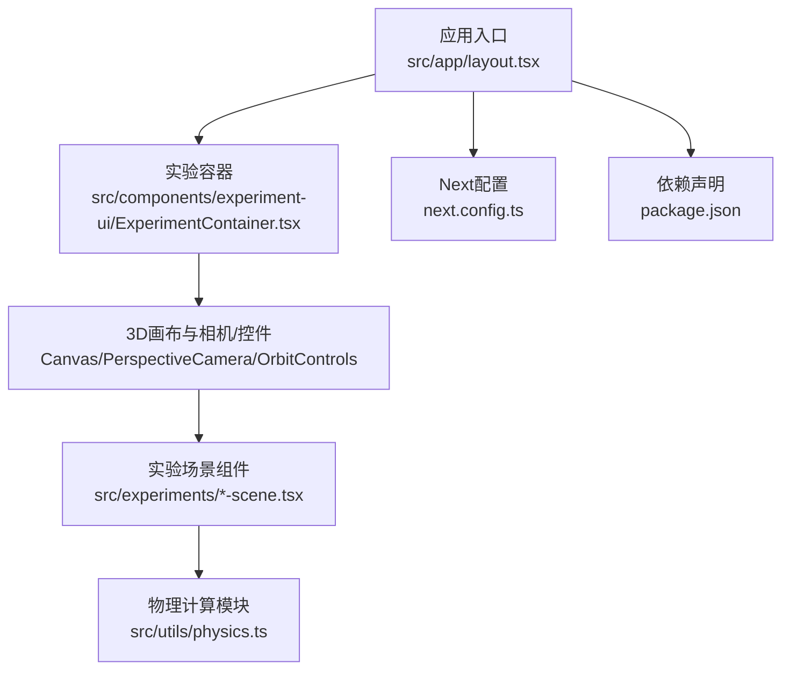
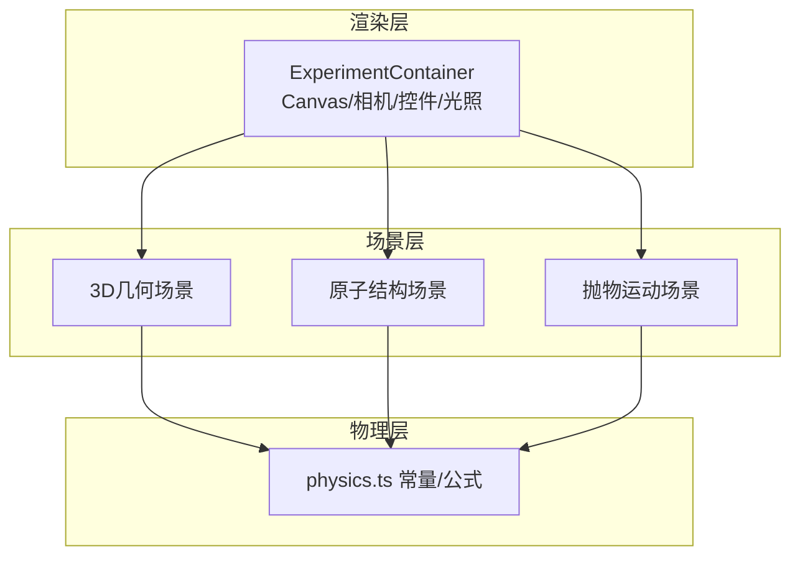
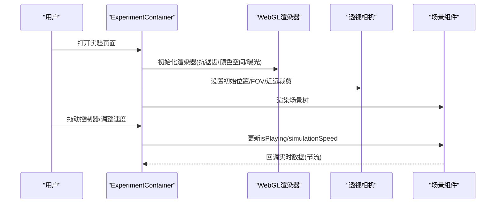
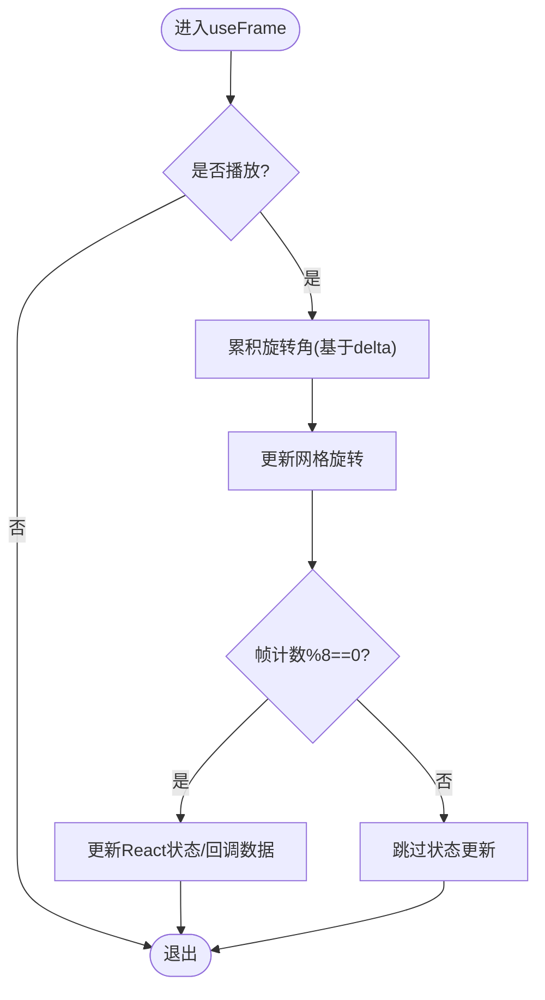
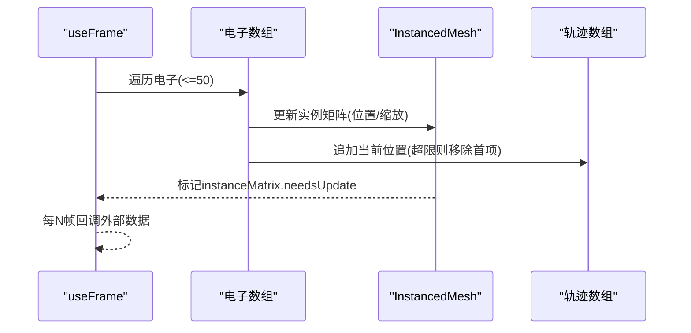
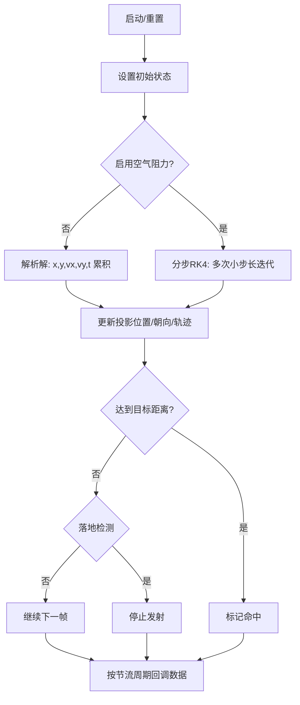
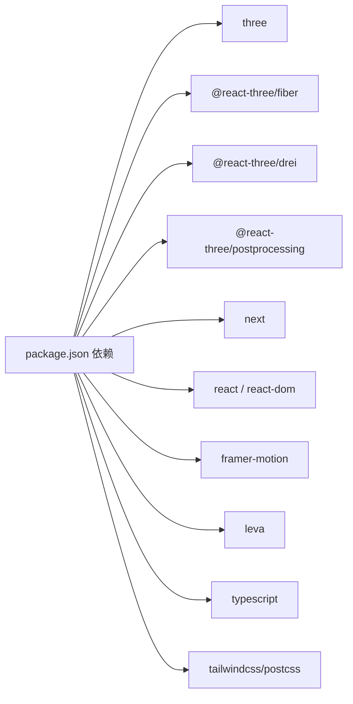

# 性能问题

<cite>
**本文引用的文件**
- [README.md](file://README.md)
- [package.json](file://package.json)
- [next.config.ts](file://next.config.ts)
- [src/utils/physics.ts](file://src/utils/physics.ts)
- [src/app/layout.tsx](file://src/app/layout.tsx)
- [src/experiments/3d-geometry-scene.tsx](file://src/experiments/3d-geometry-scene.tsx)
- [src/experiments/atomic-structure-scene.tsx](file://src/experiments/atomic-structure-scene.tsx)
- [src/experiments/projectile-motion-scene.tsx](file://src/experiments/projectile-motion-scene.tsx)
- [src/components/experiment-ui/ExperimentContainer.tsx](file://src/components/experiment-ui/ExperimentContainer.tsx)
- [src/components/experiment-ui/SimulationController.tsx](file://src/components/experiment-ui/SimulationController.tsx)
</cite>

## 目录
1. [简介](#简介)
2. [项目结构](#项目结构)
3. [核心组件](#核心组件)
4. [架构总览](#架构总览)
5. [详细组件分析](#详细组件分析)
6. [依赖关系分析](#依赖关系分析)
7. [性能考量](#性能考量)
8. [故障排除指南](#故障排除指南)
9. [结论](#结论)
10. [附录](#附录)

## 简介
本指南聚焦ScienceLab3D在3D渲染、物理计算与内存使用方面的性能问题排查与优化。结合项目中Three.js、React Three Fiber与React的使用模式，系统梳理渲染管线、物理仿真、UI交互与资源管理的关键路径，并提供针对WebGL上下文丢失、实验复杂度影响、浏览器性能分析工具（如Chrome DevTools）以及移动端优化与构建优化的实操建议。

## 项目结构
项目采用Next.js 15应用路由组织，3D实验按学科分类存放于src/experiments目录，通用UI容器与控制组件位于src/components/experiment-ui，全局布局与元数据配置在src/app下，物理计算逻辑集中于src/utils/physics。

图表来源
- [src/app/layout.tsx:1-204](file://src/app/layout.tsx#L1-L204)
- [src/components/experiment-ui/ExperimentContainer.tsx:139-208](file://src/components/experiment-ui/ExperimentContainer.tsx#L139-L208)
- [src/experiments/3d-geometry-scene.tsx:1-243](file://src/experiments/3d-geometry-scene.tsx#L1-L243)
- [src/utils/physics.ts:1-687](file://src/utils/physics.ts#L1-L687)
- [next.config.ts:1-9](file://next.config.ts#L1-L9)
- [package.json:1-37](file://package.json#L1-L37)

章节来源
- [README.md:108-135](file://README.md#L108-L135)
- [src/app/layout.tsx:1-204](file://src/app/layout.tsx#L1-L204)
- [next.config.ts:1-9](file://next.config.ts#L1-L9)
- [package.json:1-37](file://package.json#L1-L37)

## 核心组件
- 实验容器与画布：负责初始化Three.js渲染器、相机、光照与阴影，统一处理窗口尺寸变化与设备像素比，提供可拖拽的模拟控制器。
- 场景组件：每个实验场景封装自身几何体、材质、光源与动画循环，使用useFrame进行每帧更新，通过refs持有物理状态以降低React重渲染成本。
- 物理工具：集中定义常量与公式，为多个实验提供一致的物理计算基础。

章节来源
- [src/components/experiment-ui/ExperimentContainer.tsx:139-208](file://src/components/experiment-ui/ExperimentContainer.tsx#L139-L208)
- [src/experiments/3d-geometry-scene.tsx:131-153](file://src/experiments/3d-geometry-scene.tsx#L131-L153)
- [src/utils/physics.ts:10-22](file://src/utils/physics.ts#L10-L22)

## 架构总览
整体架构围绕“容器-场景-物理”三层展开：容器负责渲染环境与交互；场景负责可视化与动画；物理负责数值计算。容器内统一设置渲染参数、阴影与抗锯齿策略，场景内通过useFrame与refs实现低开销的每帧更新。

图表来源
- [src/components/experiment-ui/ExperimentContainer.tsx:139-208](file://src/components/experiment-ui/ExperimentContainer.tsx#L139-L208)
- [src/experiments/3d-geometry-scene.tsx:1-243](file://src/experiments/3d-geometry-scene.tsx#L1-L243)
- [src/experiments/atomic-structure-scene.tsx:1-365](file://src/experiments/atomic-structure-scene.tsx#L1-L365)
- [src/experiments/projectile-motion-scene.tsx:1-592](file://src/experiments/projectile-motion-scene.tsx#L1-L592)
- [src/utils/physics.ts:1-687](file://src/utils/physics.ts#L1-L687)

## 详细组件分析

### 容器与画布（ExperimentContainer）
- 渲染器参数：根据设备类型调整抗锯齿、输出色彩空间、色调映射与曝光，移动端适度降低dpr以平衡性能与清晰度。
- 尺寸适配：监听window.resize与容器ResizeObserver，动态设置gl尺寸与相机投影矩阵，避免闪烁与裁切异常。
- 控制器：提供可拖拽的模拟控制器，支持播放/暂停、重置与速度调节，时间显示便于观测性能影响。

图表来源
- [src/components/experiment-ui/ExperimentContainer.tsx:139-208](file://src/components/experiment-ui/ExperimentContainer.tsx#L139-L208)
- [src/components/experiment-ui/SimulationController.tsx:27-225](file://src/components/experiment-ui/SimulationController.tsx#L27-L225)

章节来源
- [src/components/experiment-ui/ExperimentContainer.tsx:139-208](file://src/components/experiment-ui/ExperimentContainer.tsx#L139-L208)
- [src/components/experiment-ui/SimulationController.tsx:27-225](file://src/components/experiment-ui/SimulationController.tsx#L27-L225)

### 3D几何场景（Geometry3DSceneComponent）
- 几何生成：按五类柏拉图立体生成几何体，顶点去重后用于高亮与欧拉示意图。
- 边线绘制：基于索引三角面生成边线集合，按需渲染。
- 动画循环：使用useFrame与delta累计旋转角，每N帧才更新React状态，减少重渲染。
- 材质与光源：标准材质配合多光源与网格辅助，Wireframe模式切换与透明度控制。

图表来源
- [src/experiments/3d-geometry-scene.tsx:131-153](file://src/experiments/3d-geometry-scene.tsx#L131-L153)

章节来源
- [src/experiments/3d-geometry-scene.tsx:1-243](file://src/experiments/3d-geometry-scene.tsx#L1-L243)

### 原子结构场景（AtomicStructureSceneComponent）
- 电子轨道：基于壳层容量规则与简化Bohr模型，使用instancedMesh渲染电子，最大实例数限制为50。
- 轨迹绘制：为每个电子维护轨迹点数组，超过阈值时移除旧点，避免无限增长。
- 核脉冲：核粒子随时间脉冲发光，增强视觉反馈。
- 数据回调：每N帧触发一次数据上报，包含元素信息与壳层分布。

图表来源
- [src/experiments/atomic-structure-scene.tsx:174-260](file://src/experiments/atomic-structure-scene.tsx#L174-L260)

章节来源
- [src/experiments/atomic-structure-scene.tsx:1-365](file://src/experiments/atomic-structure-scene.tsx#L1-L365)

### 抛物运动场景（ProjectileMotionSceneComponent）
- 数值积分：在开启空气阻力时采用RK4步进，分多次小步长累积以提升稳定性；关闭时使用解析解。
- 轨迹与预测：平滑曲线轨迹与无阻尼预测轨迹，距离标记与高度标记辅助理解。
- 幽灵标记：使用instancedMesh按固定时间间隔放置标记球，展示历史时刻位置。
- 数据回调：每约166ms回调一次当前状态，包含位置、速度、能量、落地检测等。

图表来源
- [src/experiments/projectile-motion-scene.tsx:227-375](file://src/experiments/projectile-motion-scene.tsx#L227-L375)

章节来源
- [src/experiments/projectile-motion-scene.tsx:1-592](file://src/experiments/projectile-motion-scene.tsx#L1-L592)

### 物理工具（physics.ts）
- 常量：统一的物理常量与单位约定，确保跨实验一致性。
- 公式：涵盖简谐振动、抛物运动、弹簧振子、理想气体、波动光学、引力轨道、双缝干涉等，作为场景组件的计算依据。

章节来源
- [src/utils/physics.ts:1-687](file://src/utils/physics.ts#L1-L687)

## 依赖关系分析
- 渲染与框架：Three.js、@react-three/fiber、@react-three/drei、@react-three/postprocessing。
- 应用框架：Next.js 15、React 19、TypeScript。
- 工具与动画：framer-motion、leva（调试）。
- 构建与样式：tailwindcss、postcss。

图表来源
- [package.json:10-31](file://package.json#L10-L31)

章节来源
- [package.json:1-37](file://package.json#L1-L37)
- [next.config.ts:1-9](file://next.config.ts#L1-L9)

## 性能考量
- 3D渲染
  - 使用instancedMesh渲染大量相似对象（如电子、幽灵标记），显著降低几何体数量与Draw Call。
  - 通过useFrame仅在refs中更新物理状态，React状态更新按帧节流，避免高频重渲染。
  - 移动端降低dpr与抗锯齿强度，减少像素填充压力。
- 物理计算
  - 空气阻力场景采用分步RK4，步长上限防止单帧过大抖动；无阻力场景使用解析解，计算成本更低。
  - 数据回调按固定周期触发，避免每帧都进行昂贵的数据序列化或UI更新。
- 内存使用
  - 轨迹点数组设定上限并在超出时移除头部，防止内存持续增长。
  - instancedMesh隐藏未使用的实例，避免无效绘制。
- 实验复杂度
  - 不同实验的几何复杂度、光源数量与阴影范围差异较大，应按需启用阴影与高级后处理，移动端优先关闭。
- 浏览器性能分析
  - 使用Chrome DevTools Performance面板记录帧时间线，关注GPU时间、脚本执行时间与布局/绘制开销。
  - 结合Layers/Rendering面板查看合成层、强制重绘区域与阴影性能。
- 构建优化
  - 使用Next.js默认打包与代码分割；对大型场景组件按需加载，减少首屏体积。
  - TypeScript严格模式有助于早期发现潜在性能隐患。

[本节为通用性能指导，不直接分析具体文件，故无章节来源]

## 故障排除指南

### WebGL上下文丢失（Context Lost）
- 症状
  - 3D画布空白、控制台出现WebGL上下文丢失错误、渲染器报错。
- 诊断步骤
  - 在容器中捕获WebGL上下文丢失事件，检查事件详情与触发时机（如切换标签页、系统显卡省电、驱动升级等）。
  - 确认渲染器初始化参数（antialias、powerPreference、toneMapping等）是否过高导致资源紧张。
  - 检查阴影贴图尺寸与相机视锥范围，过大阴影会增加GPU负担。
- 恢复流程
  - 重新初始化渲染器与相机，重建必要的纹理与几何缓存。
  - 降级渲染质量（关闭抗锯齿、降低阴影分辨率、禁用后处理）。
  - 强制触发一次全量重绘，确保状态同步。
- 预防措施
  - 对频繁创建销毁的几何/材质进行缓存复用。
  - 在容器层面统一管理生命周期，避免重复注册事件监听。

[本节为通用故障排除流程，不直接分析具体文件，故无章节来源]

### 3D渲染性能瓶颈定位
- 使用Chrome DevTools
  - Performance面板录制交互过程，观察是否存在长尾帧、主线程阻塞或GPU过载。
  - Network面板确认静态资源是否被缓存，避免重复下载。
  - Memory面板监控堆内存峰值与垃圾回收频率。
- 关键指标
  - FPS稳定度：关注60fps下的平均帧耗时与抖动。
  - GPU时间占比：若GPU时间过高，考虑降低阴影质量或关闭后处理。
  - Draw Calls与三角面数：合并材质、简化几何、使用instancedMesh。
- 优化建议
  - 场景内按需显示/隐藏高成本元素（如轨迹、预测线、幽灵标记）。
  - 将复杂几何烘焙为更简单的版本，或延迟加载。
  - 减少透明度混合层级，避免深度排序开销。

[本节为通用分析方法，不直接分析具体文件，故无章节来源]

### 物理计算开销优化
- 分步积分与步长控制
  - 空气阻力场景采用分步RK4，步长上限避免单帧长时间计算。
- 解析解与数值解选择
  - 无阻力场景使用解析解，减少迭代次数。
- 数据回调节流
  - 统一按固定周期回调，避免每帧触发昂贵操作。

章节来源
- [src/experiments/projectile-motion-scene.tsx:244-257](file://src/experiments/projectile-motion-scene.tsx#L244-L257)
- [src/experiments/projectile-motion-scene.tsx:346-374](file://src/experiments/projectile-motion-scene.tsx#L346-L374)

### 内存使用优化
- 轨迹点数组上限
  - 超限时移除最早点，保持队列长度恒定。
- instancedMesh隐藏未用实例
  - 将多余实例移动到屏幕外并更新矩阵，避免无效绘制。
- 几何与材质缓存
  - 对重复使用的几何与材质进行缓存，避免重复分配。

章节来源
- [src/experiments/atomic-structure-scene.tsx:208-224](file://src/experiments/atomic-structure-scene.tsx#L208-L224)
- [src/experiments/projectile-motion-scene.tsx:280-323](file://src/experiments/projectile-motion-scene.tsx#L280-L323)

### 实验场景复杂度与优化策略
- 3D几何场景
  - 控制显示选项（边线、顶点、线框）以降低绘制负载。
  - 降低旋转速度或帧更新频率。
- 原子结构场景
  - 限制电子数量（instancedMesh上限为50），必要时关闭轨迹。
- 抛物运动场景
  - 关闭预测线、幽灵标记与轨迹，仅保留核心投射体。
  - 降低阴影贴图分辨率或关闭阴影。

章节来源
- [src/experiments/3d-geometry-scene.tsx:92-119](file://src/experiments/3d-geometry-scene.tsx#L92-L119)
- [src/experiments/atomic-structure-scene.tsx:319-342](file://src/experiments/atomic-structure-scene.tsx#L319-L342)
- [src/experiments/projectile-motion-scene.tsx:507-530](file://src/experiments/projectile-motion-scene.tsx#L507-L530)

### 浏览器性能分析工具使用指南（Chrome DevTools）
- Performance
  - 录制交互（如拖动相机、改变参数），查看CPU与GPU时间线，识别热点。
- Layers/Rendering
  - 查看合成层与强制重绘区域，减少不必要的重绘。
  - 检查阴影与抗锯齿对性能的影响。
- Memory
  - 观察堆快照，定位泄漏或异常增长。
- Network
  - 确保静态资源缓存生效，避免重复请求。

[本节为通用工具使用说明，不直接分析具体文件，故无章节来源]

### 移动端性能优化与设备兼容性测试
- 渲染参数
  - 移动端降低dpr与抗锯齿强度，适当关闭阴影与高级后处理。
- 输入与交互
  - 使用OrbitControls的触摸配置，合理设置旋转/缩放/平移速度。
- 尺寸适配
  - 通过ResizeObserver与window.resize联动，确保画布尺寸与投影矩阵正确。
- 兼容性测试
  - 在主流机型上验证帧率稳定性，关注不同GPU厂商驱动表现。
  - 测试标签页切换、后台运行与系统省电模式下的行为。

章节来源
- [src/components/experiment-ui/ExperimentContainer.tsx:139-208](file://src/components/experiment-ui/ExperimentContainer.tsx#L139-L208)
- [src/components/experiment-ui/ExperimentContainer.tsx:78-97](file://src/components/experiment-ui/ExperimentContainer.tsx#L78-L97)

### 构建优化与代码分割最佳实践
- 代码分割
  - 将大型场景组件按需加载，减少首屏体积与初次渲染时间。
- 构建配置
  - 利用Next.js默认打包策略，确保开发与生产环境的一致性。
- 依赖管理
  - 保持依赖版本稳定，避免不必要的热更新与重打包。

章节来源
- [next.config.ts:1-9](file://next.config.ts#L1-L9)
- [package.json:1-37](file://package.json#L1-L37)

## 结论
ScienceLab3D通过容器-场景-物理的分层设计，在保证交互体验的同时兼顾了性能可控性。针对3D渲染、物理计算与内存使用，项目已采用多项优化手段（如instancedMesh、useFrame节流、轨迹上限、分步积分等）。结合浏览器性能分析工具与移动端专项测试，可进一步提升在复杂场景下的稳定性与流畅度。建议在新增实验时延续现有优化模式，并在构建阶段持续关注包体积与加载性能。

[本节为总结性内容，不直接分析具体文件，故无章节来源]

## 附录
- 快速检查清单
  - 是否在容器中正确处理resize与dpr？
  - useFrame中是否仅更新refs，React状态按帧节流？
  - 大量对象是否使用instancedMesh？
  - 轨迹/标记数组是否设置了上限并及时清理？
  - 空气阻力场景是否采用分步积分且步长受控？

[本节为通用建议，不直接分析具体文件，故无章节来源]