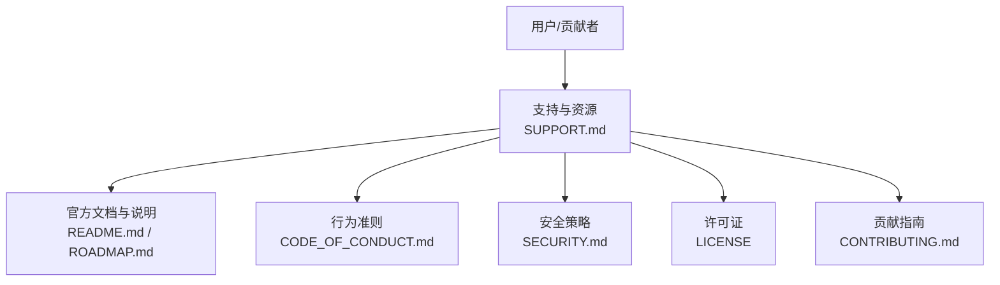
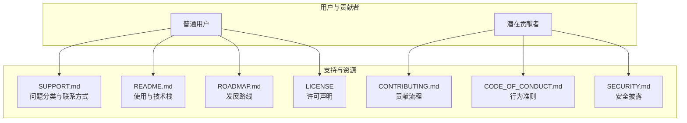
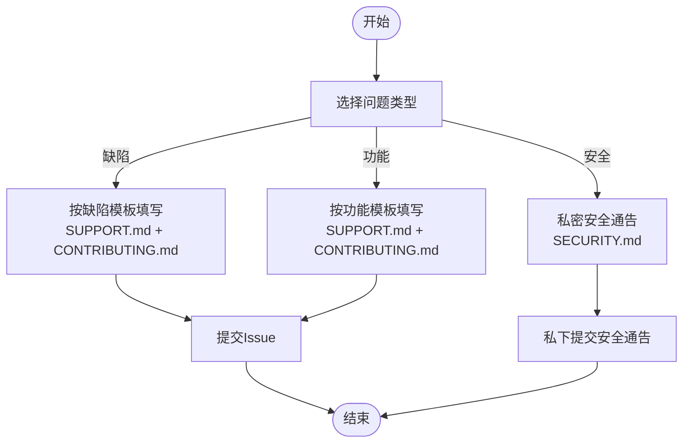
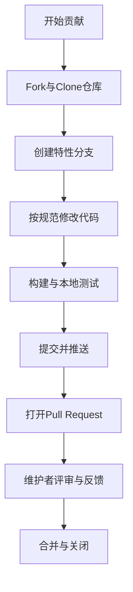
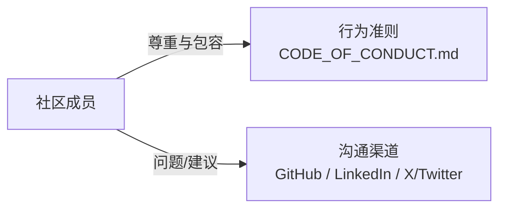
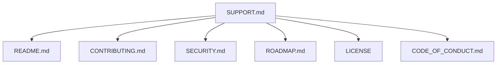

# 支持资源

<cite>
**本文引用的文件**
- [README.md](file://README.md)
- [SUPPORT.md](file://SUPPORT.md)
- [CONTRIBUTING.md](file://CONTRIBUTING.md)
- [CODE_OF_CONDUCT.md](file://CODE_OF_CONDUCT.md)
- [SECURITY.md](file://SECURITY.md)
- [LICENSE](file://LICENSE)
- [ROADMAP.md](file://ROADMAP.md)
</cite>

## 目录
1. [简介](#简介)
2. [项目结构](#项目结构)
3. [核心组件](#核心组件)
4. [架构总览](#架构总览)
5. [详细组件分析](#详细组件分析)
6. [依赖分析](#依赖分析)
7. [性能考虑](#性能考虑)
8. [故障排除指南](#故障排除指南)
9. [结论](#结论)
10. [附录](#附录)

## 简介
本指南面向ScienceLab3D社区用户与贡献者，提供支持与资源获取路径、问题报告与功能请求的标准流程、社区沟通渠道、官方文档与路线图、学习资源与教程推荐、维护者响应预期、沟通方式、许可证与合规咨询途径，以及贡献者行为准则与社区参与指南。目标是帮助您快速定位所需信息、高效提交问题与建议，并在友好、包容的社区氛围中参与项目。

## 项目结构
- 官方文档与支持说明集中在仓库根目录的若干Markdown文件中，包括：README（项目介绍、安装与使用、技术栈）、SUPPORT（支持入口与问题分类）、CONTRIBUTING（贡献流程与规范）、CODE_OF_CONDUCT（行为准则）、SECURITY（安全披露政策）、LICENSE（许可声明）、ROADMAP（路线图）。
- 该组织方式便于用户与贡献者通过单一入口获取从“如何开始”到“如何贡献”的完整信息链。

**图表来源**
- [SUPPORT.md:1-16](file://SUPPORT.md#L1-L16)
- [README.md:1-227](file://README.md#L1-L227)
- [ROADMAP.md:1-23](file://ROADMAP.md#L1-L23)
- [CODE_OF_CONDUCT.md:1-26](file://CODE_OF_CONDUCT.md#L1-L26)
- [SECURITY.md:1-8](file://SECURITY.md#L1-L8)
- [LICENSE:1-22](file://LICENSE#L1-L22)
- [CONTRIBUTING.md:1-141](file://CONTRIBUTING.md#L1-L141)

**章节来源**
- [README.md:1-227](file://README.md#L1-L227)
- [SUPPORT.md:1-16](file://SUPPORT.md#L1-L16)
- [CONTRIBUTING.md:1-141](file://CONTRIBUTING.md#L1-L141)
- [CODE_OF_CONDUCT.md:1-26](file://CODE_OF_CONDUCT.md#L1-L26)
- [SECURITY.md:1-8](file://SECURITY.md#L1-L8)
- [LICENSE:1-22](file://LICENSE#L1-L22)
- [ROADMAP.md:1-23](file://ROADMAP.md#L1-L23)

## 核心组件
- 支持入口与问题分类：通过SUPPORT.md明确区分“缺陷（bug）”与“功能增强（enhancement）”，并提供联系渠道。
- 贡献指南：CONTRIBUTING.md覆盖开发环境、分支策略、提交规范、PR流程、新增实验步骤与代码风格要求。
- 行为准则：CODE_OF_CONDUCT.md定义积极互动标准、适用范围与执行机制。
- 安全策略：SECURITY.md指导漏洞披露流程，强调私下报告与不提前公开。
- 许可证：LICENSE为MIT，明确权利与免责条款。
- 路线图：ROADMAP.md展示当前进展、计划与已完成事项，帮助理解项目发展方向。

**章节来源**
- [SUPPORT.md:8-15](file://SUPPORT.md#L8-L15)
- [CONTRIBUTING.md:27-62](file://CONTRIBUTING.md#L27-L62)
- [CONTRIBUTING.md:65-92](file://CONTRIBUTING.md#L65-L92)
- [CONTRIBUTING.md:95-103](file://CONTRIBUTING.md#L95-L103)
- [CODE_OF_CONDUCT.md:3-21](file://CODE_OF_CONDUCT.md#L3-L21)
- [SECURITY.md:3-7](file://SECURITY.md#L3-L7)
- [LICENSE:1-22](file://LICENSE#L1-L22)
- [ROADMAP.md:3-22](file://ROADMAP.md#L3-L22)

## 架构总览
下图展示了用户/贡献者与项目支持体系之间的交互关系，体现信息流向与决策点。

**图表来源**
- [SUPPORT.md:1-16](file://SUPPORT.md#L1-L16)
- [README.md:1-227](file://README.md#L1-L227)
- [ROADMAP.md:1-23](file://ROADMAP.md#L1-L23)
- [CONTRIBUTING.md:1-141](file://CONTRIBUTING.md#L1-L141)
- [CODE_OF_CONDUCT.md:1-26](file://CODE_OF_CONDUCT.md#L1-L26)
- [SECURITY.md:1-8](file://SECURITY.md#L1-L8)
- [LICENSE:1-22](file://LICENSE#L1-L22)

## 详细组件分析

### 组件A：问题报告与功能请求标准流程
- 缺陷（Bug）报告
  - 使用SUPPORT.md中的“Issues”分类指引，以“bug”标签提交。
  - 参考CONTRIBUTING.md中的“Reporting Bugs”要点：清晰描述、复现步骤、期望与实际行为、浏览器与设备信息。
- 功能请求（Feature）
  - 使用“enhancement”标签提交功能请求。
  - 参考CONTRIBUTING.md中的“Suggesting Features”要点：需求描述、价值说明、实现思路。
- 安全问题
  - 严格遵循SECURITY.md，通过“Security Advisory”私下报告，避免公开披露。

**图表来源**
- [SUPPORT.md:8-11](file://SUPPORT.md#L8-L11)
- [CONTRIBUTING.md:106-113](file://CONTRIBUTING.md#L106-L113)
- [CONTRIBUTING.md:116-122](file://CONTRIBUTING.md#L116-L122)
- [SECURITY.md:3-4](file://SECURITY.md#L3-L4)

**章节来源**
- [SUPPORT.md:8-11](file://SUPPORT.md#L8-L11)
- [CONTRIBUTING.md:106-113](file://CONTRIBUTING.md#L106-L113)
- [CONTRIBUTING.md:116-122](file://CONTRIBUTING.md#L116-L122)
- [SECURITY.md:3-4](file://SECURITY.md#L3-L4)

### 组件B：贡献流程与新增实验标准
- 分支与提交
  - 遵循CONTRIBUTING.md的分支命名与提交信息规范，确保PR可追溯。
- 新增实验步骤
  - 在数据层添加元数据；在页面层创建主仿真与详情页；在组件层编写3D场景与页面包装器；最后进行桌面与移动端测试。
- 代码风格与质量
  - 遵循TS/函数式组件/命名约定/可访问性/移动端适配等规范。

**图表来源**
- [CONTRIBUTING.md:29-62](file://CONTRIBUTING.md#L29-L62)
- [CONTRIBUTING.md:65-92](file://CONTRIBUTING.md#L65-L92)
- [CONTRIBUTING.md:95-103](file://CONTRIBUTING.md#L95-L103)

**章节来源**
- [CONTRIBUTING.md:29-62](file://CONTRIBUTING.md#L29-L62)
- [CONTRIBUTING.md:65-92](file://CONTRIBUTING.md#L65-L92)
- [CONTRIBUTING.md:95-103](file://CONTRIBUTING.md#L95-L103)

### 组件C：社区沟通与联系
- 多渠道联系
  - GitHub、LinkedIn、X/Twitter等社交平台均可用于联系作者或获取动态。
- 行为准则
  - 所有社区空间均适用CODE_OF_CONDUCT，鼓励包容、尊重与建设性的交流。

**图表来源**
- [SUPPORT.md:12-15](file://SUPPORT.md#L12-L15)
- [CODE_OF_CONDUCT.md:3-21](file://CODE_OF_CONDUCT.md#L3-L21)

**章节来源**
- [SUPPORT.md:12-15](file://SUPPORT.md#L12-L15)
- [CODE_OF_CONDUCT.md:3-21](file://CODE_OF_CONDUCT.md#L3-L21)

### 组件D：许可证与合规咨询
- 许可证类型
  - 项目采用MIT许可证，允许自由使用、复制、修改、分发与再许可，需保留版权与许可声明。
- 合规建议
  - 使用前请核对自身场景是否满足MIT条款；如涉及衍生作品，请保留适当版权声明与许可文本。

**章节来源**
- [LICENSE:1-22](file://LICENSE#L1-L22)

### 组件E：学习资源与相关教程
- 官方演示站点与文档
  - README提供了在线演示地址、安装与使用说明、技术栈概览，适合初学者快速上手。
- 路线图参考
  - ROADMAP.md展示未来方向，有助于理解项目演进与学习重点（如VR/AR、AI助手、多语言等）。
- 建议学习路径
  - 结合README的技术栈与ROADMAP的规划，逐步掌握Next.js、React、TypeScript、Three.js等关键技术，并关注无障碍与国际化实践。

**章节来源**
- [README.md:18-150](file://README.md#L18-L150)
- [ROADMAP.md:3-22](file://ROADMAP.md#L3-L22)

## 依赖分析
- 信息耦合关系
  - SUPPORT.md作为入口，串联README（使用）、CONTRIBUTING（贡献）、SECURITY（安全）、ROADMAP（方向）、LICENSE（合规）与CODE_OF_CONDUCT（治理）。
- 影响与风险
  - 若缺少任一文档，可能导致用户无法准确归类问题、贡献者不熟悉流程、安全问题被不当公开或社区氛围受影响。
- 优化建议
  - 在README中增加指向SUPPORT.md的导航；在SUPPORT.md中补充常见FAQ摘要；在CONTRIBUTING.md中加入PR模板链接；在SECURITY.md中提供模板化披露表单。

**图表来源**
- [SUPPORT.md:1-16](file://SUPPORT.md#L1-L16)
- [README.md:1-227](file://README.md#L1-L227)
- [CONTRIBUTING.md:1-141](file://CONTRIBUTING.md#L1-L141)
- [SECURITY.md:1-8](file://SECURITY.md#L1-L8)
- [ROADMAP.md:1-23](file://ROADMAP.md#L1-L23)
- [LICENSE:1-22](file://LICENSE#L1-L22)
- [CODE_OF_CONDUCT.md:1-26](file://CODE_OF_CONDUCT.md#L1-L26)

**章节来源**
- [SUPPORT.md:1-16](file://SUPPORT.md#L1-L16)
- [README.md:1-227](file://README.md#L1-L227)
- [CONTRIBUTING.md:1-141](file://CONTRIBUTING.md#L1-L141)
- [SECURITY.md:1-8](file://SECURITY.md#L1-L8)
- [ROADMAP.md:1-23](file://ROADMAP.md#L1-L23)
- [LICENSE:1-22](file://LICENSE#L1-L22)
- [CODE_OF_CONDUCT.md:1-26](file://CODE_OF_CONDUCT.md#L1-L26)

## 性能考虑
- 本节为通用建议，不直接分析具体文件。
- 对于用户侧：优先使用现代浏览器，确保网络稳定；移动端建议使用最新系统版本以获得最佳Three.js渲染体验。
- 对于贡献者侧：在本地开发时启用生产构建预览，结合移动端真机调试，减少跨端兼容性问题带来的返工。

## 故障排除指南
- 无法复现的问题
  - 请在Issue中补充浏览器版本、操作系统、设备型号与网络环境；必要时附带截图或录屏。
- 安全相关
  - 切勿在公共Issue中披露漏洞细节；请走“Security Advisory”私下通道。
- 行为准则相关
  - 如遇到骚扰或不当言论，请依据CODE_OF_CONDUCT进行举报，维护者将进行调查与处理。

**章节来源**
- [CONTRIBUTING.md:106-113](file://CONTRIBUTING.md#L106-L113)
- [SECURITY.md:3-7](file://SECURITY.md#L3-L7)
- [CODE_OF_CONDUCT.md:19-21](file://CODE_OF_CONDUCT.md#L19-L21)

## 结论
通过SUPPORT.md、CONTRIBUTING.md、SECURITY.md、CODE_OF_CONDUCT.md、LICENSE与ROADMAP.md构成的文档体系，ScienceLab3D为用户与贡献者提供了清晰的支持与参与路径。建议在提交问题与功能请求时严格遵循对应模板与流程，遵守行为准则与安全策略，共同维护开放、包容、高效的社区生态。

## 附录
- 快速链接
  - 在线演示：[https://sciencelab-two.vercel.app](https://sciencelab-two.vercel.app)
  - 作者主页与社交：参见README中的“👤 Author”与“Connect”部分
- 常用模板与入口
  - 问题分类与联系方式：SUPPORT.md
  - 贡献流程与新增实验：CONTRIBUTING.md
  - 安全披露：SECURITY.md
  - 行为准则：CODE_OF_CONDUCT.md
  - 许可证：LICENSE
  - 发展路线：ROADMAP.md