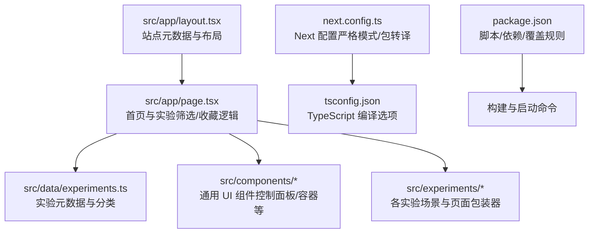
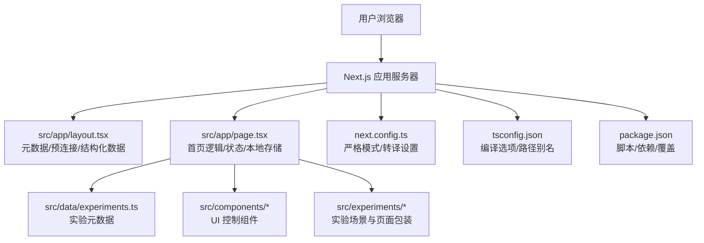
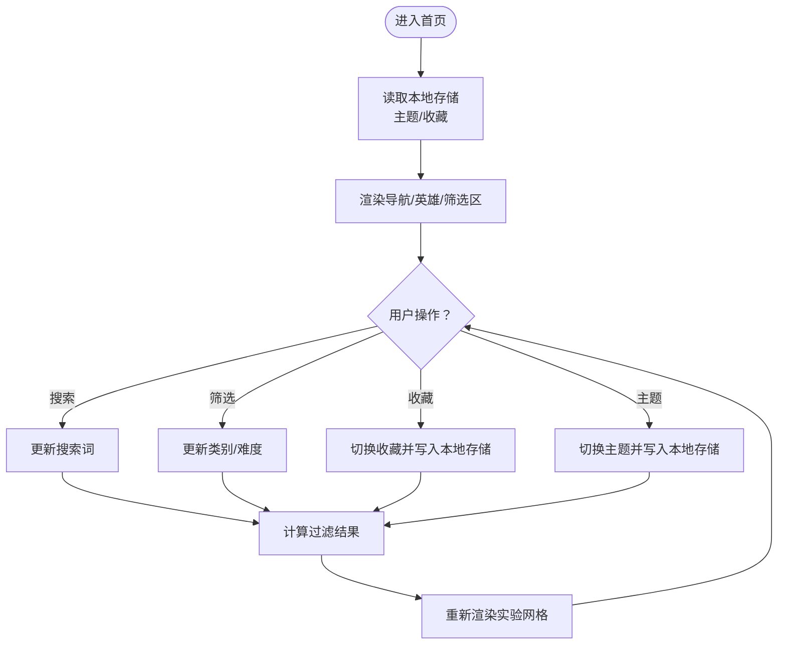
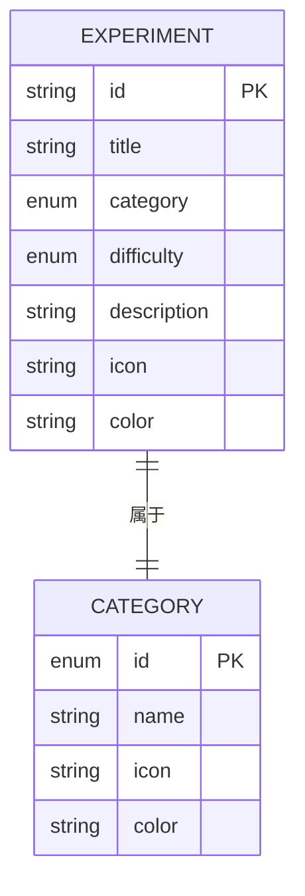
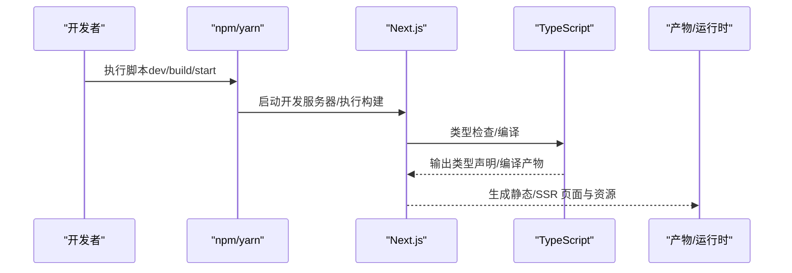
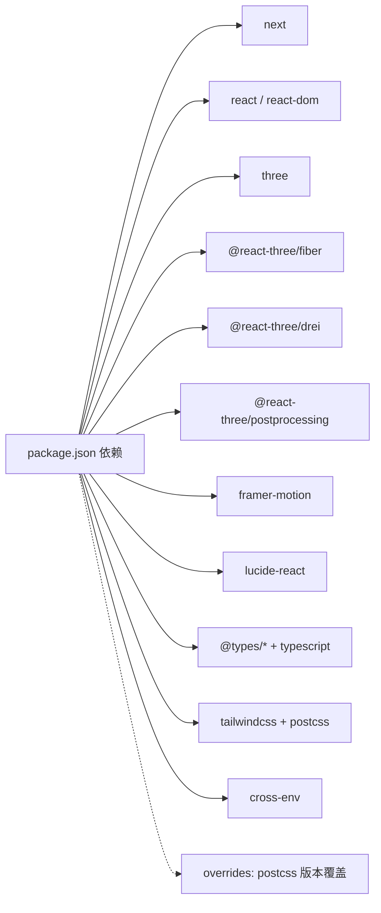

# 故障排除

<cite>
**本文引用的文件**
- [README.md](file://README.md)
- [package.json](file://package.json)
- [next.config.ts](file://next.config.ts)
- [tsconfig.json](file://tsconfig.json)
- [SUPPORT.md](file://SUPPORT.md)
- [SECURITY.md](file://SECURITY.md)
- [CONTRIBUTING.md](file://CONTRIBUTING.md)
- [src/app/layout.tsx](file://src/app/layout.tsx)
- [src/app/page.tsx](file://src/app/page.tsx)
- [src/data/experiments.ts](file://src/data/experiments.ts)
</cite>

## 目录
1. [简介](#简介)
2. [项目结构](#项目结构)
3. [核心组件](#核心组件)
4. [架构总览](#架构总览)
5. [详细组件分析](#详细组件分析)
6. [依赖关系分析](#依赖关系分析)
7. [性能考虑](#性能考虑)
8. [故障排除指南](#故障排除指南)
9. [结论](#结论)
10. [附录](#附录)

## 简介
本指南面向使用与维护 ScienceLab 3D 的用户与开发者，聚焦于安装问题、运行错误、性能问题与生产部署常见挑战，提供系统化的诊断方法、调试技巧、优化建议与问题反馈流程。内容基于仓库现有配置与源码进行归纳总结，帮助快速定位与解决问题。

## 项目结构
ScienceLab 3D 是一个基于 Next.js 15 与 React 19 的前端应用，采用 App Router 组织页面与实验模块，使用 Three.js 及 React Three Fiber 进行 3D 渲染，配合 Framer Motion 实现动画，Tailwind CSS 提供样式基础。核心入口为首页与各实验页面，数据通过集中式元数据文件管理。

图表来源
- [src/app/layout.tsx:1-204](file://src/app/layout.tsx#L1-L204)
- [src/app/page.tsx:1-676](file://src/app/page.tsx#L1-L676)
- [src/data/experiments.ts:1-492](file://src/data/experiments.ts#L1-L492)
- [next.config.ts:1-9](file://next.config.ts#L1-L9)
- [tsconfig.json:1-22](file://tsconfig.json#L1-L22)
- [package.json:1-37](file://package.json#L1-L37)

章节来源
- [README.md:108-135](file://README.md#L108-L135)
- [package.json:1-37](file://package.json#L1-L37)
- [next.config.ts:1-9](file://next.config.ts#L1-L9)
- [tsconfig.json:1-22](file://tsconfig.json#L1-L22)

## 核心组件
- 元数据与布局：站点标题、关键词、Open Graph、Twitter 卡片、Manifest、Schema 结构化数据等在根布局中统一配置，有助于 SEO 与分享体验。
- 首页与交互：首页负责实验筛选、搜索、难度过滤、收藏管理与主题切换；使用本地存储持久化用户偏好。
- 实验数据：集中定义 40+ 实验的元数据（类别、难度、主题、颜色等），作为页面路由与渲染的基础。
- 构建与类型：Next 配置启用严格模式与对特定包的转译；TypeScript 使用现代编译目标与路径别名，提升开发体验与兼容性。

章节来源
- [src/app/layout.tsx:19-118](file://src/app/layout.tsx#L19-L118)
- [src/app/page.tsx:305-361](file://src/app/page.tsx#L305-L361)
- [src/data/experiments.ts:12-460](file://src/data/experiments.ts#L12-L460)
- [next.config.ts:3-6](file://next.config.ts#L3-L6)
- [tsconfig.json:2-17](file://tsconfig.json#L2-L17)

## 架构总览
下图展示从浏览器到页面与实验资源的关键交互路径，以及关键配置对运行时行为的影响。

图表来源
- [src/app/layout.tsx:1-204](file://src/app/layout.tsx#L1-L204)
- [src/app/page.tsx:1-676](file://src/app/page.tsx#L1-L676)
- [src/data/experiments.ts:1-492](file://src/data/experiments.ts#L1-L492)
- [next.config.ts:1-9](file://next.config.ts#L1-L9)
- [tsconfig.json:1-22](file://tsconfig.json#L1-L22)
- [package.json:1-37](file://package.json#L1-L37)

## 详细组件分析

### 首页与交互组件（收藏、搜索、主题）
- 收藏功能：通过本地存储读写实现，避免服务端依赖；若出现收藏异常，优先检查浏览器本地存储可用性与跨域限制。
- 搜索与筛选：基于实验标题、描述与主题词进行匹配；难度过滤可直接拼接关键词。
- 主题切换：通过本地存储与根元素类名切换实现深浅主题；若切换无效，检查类名同步逻辑与样式加载顺序。
- 动画与滚动：使用 Framer Motion 与滚动事件监听，注意内存泄漏需在组件卸载时清理监听器。

图表来源
- [src/app/page.tsx:305-361](file://src/app/page.tsx#L305-L361)
- [src/app/page.tsx:330-350](file://src/app/page.tsx#L330-L350)
- [src/app/page.tsx:352-361](file://src/app/page.tsx#L352-L361)

章节来源
- [src/app/page.tsx:11-361](file://src/app/page.tsx#L11-L361)

### 实验数据模型与路由
- 数据模型：统一的实验接口与分类数组，保证页面渲染一致性。
- 路由约定：实验详情页遵循 App Router 命名规范；页面与场景组件分离，便于扩展与维护。

图表来源
- [src/data/experiments.ts:1-10](file://src/data/experiments.ts#L1-L10)
- [src/data/experiments.ts:462-491](file://src/data/experiments.ts#L462-L491)

章节来源
- [src/data/experiments.ts:12-460](file://src/data/experiments.ts#L12-L460)

### 构建与运行配置
- Next 配置：启用严格模式与对特定包的转译，有助于减少运行时错误与兼容性问题。
- TypeScript：现代编译目标与路径别名，提升类型安全与导入便捷性。
- 依赖与脚本：统一的开发/构建/启动脚本，版本覆盖策略用于稳定关键依赖。

图表来源
- [package.json:5-8](file://package.json#L5-L8)
- [next.config.ts:3-6](file://next.config.ts#L3-L6)
- [tsconfig.json:2-17](file://tsconfig.json#L2-L17)

章节来源
- [package.json:1-37](file://package.json#L1-L37)
- [next.config.ts:1-9](file://next.config.ts#L1-L9)
- [tsconfig.json:1-22](file://tsconfig.json#L1-L22)

## 依赖关系分析
- 运行时依赖：Next.js、React、Three.js 生态（React Three Fiber、Drei、Postprocessing）、动画与图标库等。
- 开发依赖：TypeScript、Tailwind CSS、PostCSS、交叉环境变量工具等。
- 版本覆盖：对关键包进行版本覆盖以规避已知问题或保持稳定性。

图表来源
- [package.json:10-35](file://package.json#L10-L35)

章节来源
- [package.json:1-37](file://package.json#L1-L37)

## 性能考虑
- 3D 场景性能：合理设置帧率、剔除不必要对象、合并几何体、降低材质复杂度与贴图分辨率。
- 资源加载：利用 Next.js 的自动代码分割与懒加载；对大型场景按需加载；预连接关键字体与图标资源。
- 渲染优化：避免频繁重排与重绘；使用 React.memo 与 useMemo 缓存计算结果；控制动画数量与复杂度。
- 构建优化：启用严格模式与必要的转译；保持依赖版本稳定；定期清理未使用的依赖。
- 移动端适配：关注触摸交互与手势处理；减少高负载操作在低端设备上的执行频率。

## 故障排除指南

### 安装与环境问题
- Node.js 版本不匹配
  - 现象：安装失败、构建报错或运行时报类型/语法错误。
  - 排查：确认 Node.js 版本满足要求；清理缓存后重试安装。
  - 参考
    - [README.md:110-111](file://README.md#L110-L111)
    - [CONTRIBUTING.md:11-14](file://CONTRIBUTING.md#L11-L14)
- 依赖安装异常
  - 现象：npm/yarn 报错、部分包无法解析。
  - 排查：删除 lock 文件与 node_modules 后重装；检查网络代理与 registry；查看覆盖规则是否影响关键包。
  - 参考
    - [package.json:33-35](file://package.json#L33-L35)
- 浏览器兼容性
  - 现象：某些特性在旧版浏览器不可用。
  - 排查：确认目标浏览器支持 ES 新特性与 WebGL；必要时引入 polyfill 或降级方案。

章节来源
- [README.md:110-111](file://README.md#L110-L111)
- [CONTRIBUTING.md:11-14](file://CONTRIBUTING.md#L11-L14)
- [package.json:33-35](file://package.json#L33-L35)

### 运行时错误与页面问题
- 页面空白或白屏
  - 现象：页面无法渲染或仅显示骨架。
  - 排查：检查控制台错误；确认根布局与页面组件无未捕获异常；验证本地存储访问权限。
  - 参考
    - [src/app/layout.tsx:180-203](file://src/app/layout.tsx#L180-L203)
    - [src/app/page.tsx:305-361](file://src/app/page.tsx#L305-L361)
- 实验无法加载或 404
  - 现象：点击实验跳转失败或页面不存在。
  - 排查：确认实验 ID 与路由一致；检查实验数据是否存在；验证页面与场景组件存在且命名正确。
  - 参考
    - [src/data/experiments.ts:12-460](file://src/data/experiments.ts#L12-L460)
- 收藏/主题切换失效
  - 现象：收藏星标不变、主题切换不生效。
  - 排查：检查本地存储可用性；确认类名切换逻辑；验证事件绑定与卸载。
  - 参考
    - [src/app/page.tsx:11-361](file://src/app/page.tsx#L11-L361)
- 搜索/筛选无结果
  - 现象：输入关键词后无变化。
  - 排查：确认关键词大小写与匹配逻辑；检查空值与数组遍历边界。
  - 参考
    - [src/app/page.tsx:330-350](file://src/app/page.tsx#L330-L350)

章节来源
- [src/app/layout.tsx:180-203](file://src/app/layout.tsx#L180-L203)
- [src/app/page.tsx:11-361](file://src/app/page.tsx#L11-L361)
- [src/data/experiments.ts:12-460](file://src/data/experiments.ts#L12-L460)

### 性能问题
- 页面卡顿或掉帧
  - 现象：滚动、动画、缩放时卡顿。
  - 排查：减少每帧对象数量与复杂度；关闭不必要的实时更新；使用节流/防抖；检查动画库使用方式。
- 加载缓慢
  - 现象：首屏时间长、资源下载慢。
  - 排查：启用图片与字体预连接；拆分大组件；延迟加载非关键资源；检查 CDN 与缓存策略。
- 内存占用过高
  - 现象：长时间使用后内存飙升。
  - 排查：释放未使用的 Three.js 对象与纹理；清理事件监听；避免闭包持有大量 DOM 引用。

章节来源
- [src/app/page.tsx:305-361](file://src/app/page.tsx#L305-L361)

### 开发环境常见问题
- 类型错误与编译失败
  - 现象：编辑器提示类型错误或构建中断。
  - 排查：检查 tsconfig 设置；确保路径别名与插件配置正确；升级/锁定 TypeScript 版本。
  - 参考
    - [tsconfig.json:2-17](file://tsconfig.json#L2-L17)
- Next 配置导致的运行时问题
  - 现象：热更新异常或打包错误。
  - 排查：确认严格模式与转译设置；避免与第三方包冲突；必要时临时禁用相关配置验证。
  - 参考
    - [next.config.ts:3-6](file://next.config.ts#L3-L6)
- 依赖冲突与版本漂移
  - 现象：不同环境表现不一致。
  - 排查：固定关键依赖版本；使用覆盖规则；避免混用多个包管理器。

章节来源
- [tsconfig.json:2-17](file://tsconfig.json#L2-L17)
- [next.config.ts:3-6](file://next.config.ts#L3-L6)
- [package.json:33-35](file://package.json#L33-L35)

### 生产部署问题
- 构建失败或启动异常
  - 现象：CI/CD 构建失败或生产服务器启动报错。
  - 排查：核对生产环境 Node 版本；清理缓存并重新安装；检查环境变量与构建脚本。
  - 参考
    - [README.md:129-134](file://README.md#L129-L134)
    - [package.json:5-8](file://package.json#L5-L8)
- 资源路径与静态资源缺失
  - 现象：图标、字体或图片 404。
  - 排查：确认静态资源放置位置与引用路径；检查 Manifest 与预连接标签。
  - 参考
    - [src/app/layout.tsx:94-100](file://src/app/layout.tsx#L94-L100)
- SEO 与分享卡片异常
  - 现象：社交平台分享无预览或标题不正确。
  - 排查：检查 Open Graph 与 Twitter 卡片字段；确认站点 URL 与图像路径。
  - 参考
    - [src/app/layout.tsx:67-93](file://src/app/layout.tsx#L67-L93)

章节来源
- [README.md:129-134](file://README.md#L129-L134)
- [package.json:5-8](file://package.json#L5-L8)
- [src/app/layout.tsx:67-100](file://src/app/layout.tsx#L67-L100)

### 社区支持与问题反馈
- 获取帮助
  - 参考文档与贡献指南；按类别提交问题。
  - 参考
    - [SUPPORT.md:3-6](file://SUPPORT.md#L3-L6)
    - [CONTRIBUTING.md:106-113](file://CONTRIBUTING.md#L106-L113)
- 安全问题
  - 通过私密安全通告渠道上报，避免公开披露。
  - 参考
    - [SECURITY.md:3-7](file://SECURITY.md#L3-L7)
- 联系方式
  - GitHub、LinkedIn、X/Twitter 等渠道可用于沟通与反馈。
  - 参考
    - [SUPPORT.md:12-15](file://SUPPORT.md#L12-L15)

章节来源
- [SUPPORT.md:3-15](file://SUPPORT.md#L3-L15)
- [SECURITY.md:3-7](file://SECURITY.md#L3-L7)
- [CONTRIBUTING.md:106-113](file://CONTRIBUTING.md#L106-L113)

### 问题报告标准模板与信息收集指南
- 必填信息
  - 环境信息：操作系统、浏览器名称与版本、Node.js 版本、Next.js 版本。
  - 复现步骤：清晰的操作步骤与预期/实际结果。
  - 截图或录屏：问题现象的可视化证据。
  - 日志：浏览器控制台错误日志与网络请求异常。
- 可选信息
  - 设备信息（移动端/平板）与屏幕尺寸。
  - 已尝试过的修复措施与效果。
- 提交渠道
  - 使用对应标签（bug/enhancement）在问题跟踪系统中提交。
  - 参考
    - [CONTRIBUTING.md:106-113](file://CONTRIBUTING.md#L106-L113)
    - [SUPPORT.md:8-11](file://SUPPORT.md#L8-L11)

章节来源
- [CONTRIBUTING.md:106-113](file://CONTRIBUTING.md#L106-L113)
- [SUPPORT.md:8-11](file://SUPPORT.md#L8-L11)

## 结论
通过结合仓库中的配置与源码，本指南提供了从安装、运行到性能优化与问题反馈的完整排查路径。建议在日常维护中持续关注依赖版本、构建配置与 3D 场景性能，并建立标准化的问题报告流程，以便快速定位与解决各类技术问题。

## 附录
- 快速检查清单
  - Node.js 版本满足要求
  - 依赖安装成功且无冲突
  - 本地存储可用
  - Next 配置与 TypeScript 设置正确
  - 关键资源（字体、图标、图像）可访问
  - 控制台无未捕获异常
  - 性能监控指标正常