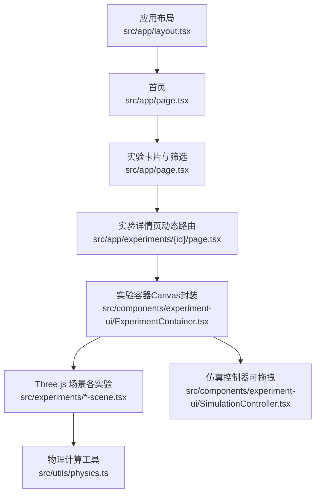
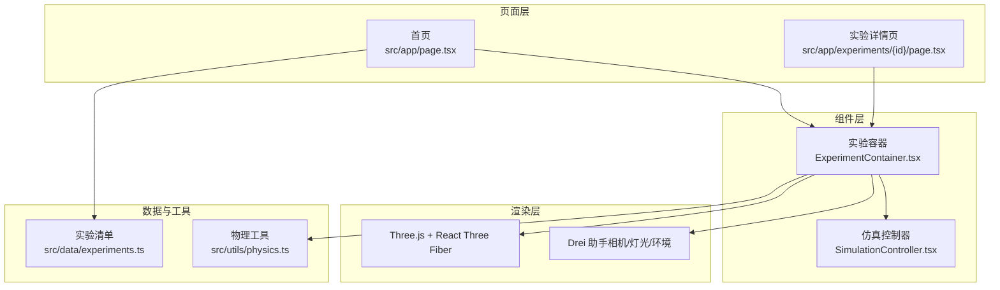
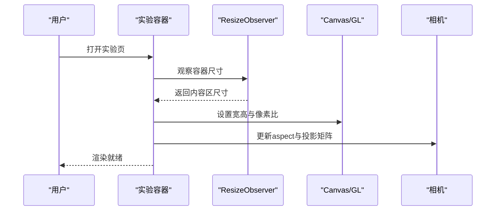
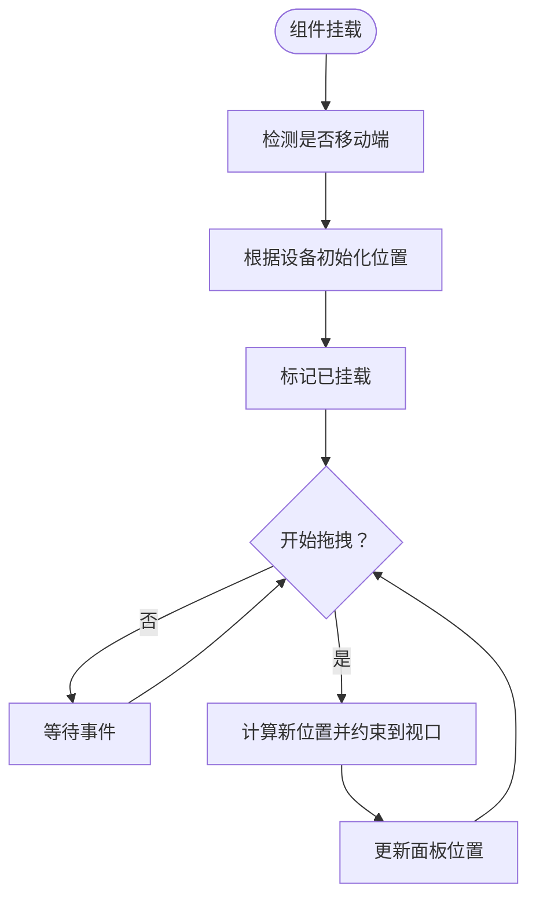
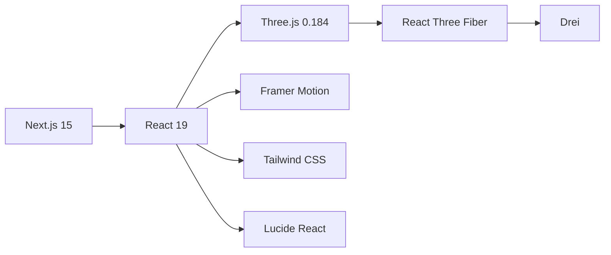

# 运行时错误

<cite>
**本文引用的文件**
- [README.md](file://README.md)
- [package.json](file://package.json)
- [next.config.ts](file://next.config.ts)
- [src/app/layout.tsx](file://src/app/layout.tsx)
- [src/app/page.tsx](file://src/app/page.tsx)
- [src/data/experiments.ts](file://src/data/experiments.ts)
- [src/components/experiment-ui/ExperimentContainer.tsx](file://src/components/experiment-ui/ExperimentContainer.tsx)
- [src/components/experiment-ui/SimulationController.tsx](file://src/components/experiment-ui/SimulationController.tsx)
- [src/utils/physics.ts](file://src/utils/physics.ts)
</cite>

## 目录
1. [简介](#简介)
2. [项目结构](#项目结构)
3. [核心组件](#核心组件)
4. [架构总览](#架构总览)
5. [详细组件分析](#详细组件分析)
6. [依赖关系分析](#依赖关系分析)
7. [性能考虑](#性能考虑)
8. [故障排除指南](#故障排除指南)
9. [结论](#结论)
10. [附录](#附录)

## 简介
本指南聚焦ScienceLab3D在运行时可能出现的各类错误与异常，覆盖浏览器兼容性问题、Three.js渲染错误、React组件挂起、Next.js路由与SSR相关问题、内存泄漏与性能监控、实验场景加载失败原因及解决方案，并提供浏览器开发者工具调试技巧与日志分析方法。目标是帮助维护者与贡献者快速定位并修复问题，确保平台在多设备与多浏览器环境下稳定运行。

## 项目结构
该项目采用Next.js App Router架构，前端以React 19与TypeScript构建，Three.js配合React Three Fiber进行3D渲染，辅以Framer Motion动画与Tailwind CSS样式。实验页面通过动态路由加载对应场景组件，UI层提供统一的实验容器与控制面板。

图表来源
- [src/app/layout.tsx](file://src/app/layout.tsx)
- [src/app/page.tsx](file://src/app/page.tsx)
- [src/components/experiment-ui/ExperimentContainer.tsx](file://src/components/experiment-ui/ExperimentContainer.tsx)
- [src/components/experiment-ui/SimulationController.tsx](file://src/components/experiment-ui/SimulationController.tsx)
- [src/utils/physics.ts](file://src/utils/physics.ts)

章节来源
- [README.md](file://README.md)
- [package.json](file://package.json)
- [next.config.ts](file://next.config.ts)

## 核心组件
- 应用根布局：负责站点元数据、预连接字体、结构化数据输出与基础样式注入。
- 首页：实验列表展示、分类筛选、搜索、收藏管理与主题切换。
- 实验容器：封装Three.js画布、相机、光照、环境与交互控件，处理窗口尺寸变化与设备适配。
- 仿真控制器：悬浮播放/暂停、重置、速度调节与时间显示，支持拖拽与视口约束。
- 物理工具：集中提供各实验通用的物理常量与公式，便于数据面板与场景逻辑复用。

章节来源
- [src/app/layout.tsx](file://src/app/layout.tsx)
- [src/app/page.tsx](file://src/app/page.tsx)
- [src/components/experiment-ui/ExperimentContainer.tsx](file://src/components/experiment-ui/ExperimentContainer.tsx)
- [src/components/experiment-ui/SimulationController.tsx](file://src/components/experiment-ui/SimulationController.tsx)
- [src/utils/physics.ts](file://src/utils/physics.ts)

## 架构总览
系统采用“页面路由 + 组件容器 + 场景模块”的分层设计。页面负责数据与UI状态；容器负责渲染上下文与交互；场景负责具体实验的几何与动画；工具模块提供跨场景的物理计算。

图表来源
- [src/app/page.tsx](file://src/app/page.tsx)
- [src/components/experiment-ui/ExperimentContainer.tsx](file://src/components/experiment-ui/ExperimentContainer.tsx)
- [src/components/experiment-ui/SimulationController.tsx](file://src/components/experiment-ui/SimulationController.tsx)
- [src/data/experiments.ts](file://src/data/experiments.ts)
- [src/utils/physics.ts](file://src/utils/physics.ts)

## 详细组件分析

### 实验容器（ExperimentContainer）
职责与关键点
- 封装Canvas、相机、光照、环境与阴影，统一渲染配置。
- 处理窗口尺寸变化与设备类型（移动端/平板），调整抗锯齿、dpr与FOV。
- 提供控制面板、数据面板与详情面板的开关与遮罩层。
- 通过ResizeObserver监听容器尺寸变化，驱动Canvas尺寸同步更新。
- 在进入全屏模式时锁定文档滚动，离开时恢复。

潜在运行时问题
- 尺寸监听未正确清理：可能导致重复事件绑定或内存泄漏。
- 设备类型判断与dpr设置不一致：可能造成模糊或过度渲染。
- ResizeObserver回调中直接操作DOM导致回流抖动。
- 悬浮控制条与面板遮挡交互：需注意z-index与触摸事件穿透。

图表来源
- [src/components/experiment-ui/ExperimentContainer.tsx](file://src/components/experiment-ui/ExperimentContainer.tsx)

章节来源
- [src/components/experiment-ui/ExperimentContainer.tsx](file://src/components/experiment-ui/ExperimentContainer.tsx)

### 仿真控制器（SimulationController）
职责与关键点
- 可拖拽悬浮面板，内置播放/暂停、重置、速度调节与时间显示。
- 支持鼠标与触摸事件，拖拽时限制在视口范围内。
- 移动端自适应宽度与初始位置，避免水合不一致。

潜在运行时问题
- 拖拽事件未在释放时移除：可能残留全局监听。
- 初始位置计算与mounted状态不同步：可能导致水合差异。
- 视口边界计算依赖offsetWidth/offsetHeight：若元素尚未渲染会返回0。

图表来源
- [src/components/experiment-ui/SimulationController.tsx](file://src/components/experiment-ui/SimulationController.tsx)

章节来源
- [src/components/experiment-ui/SimulationController.tsx](file://src/components/experiment-ui/SimulationController.tsx)

### 首页与路由（App Router）
职责与关键点
- 首页负责实验列表、筛选、搜索与收藏管理，使用useMemo优化过滤。
- 使用Next.js App Router动态路由加载实验详情页。
- 布局提供站点元信息、Schema结构化数据与图标清单。

潜在运行时问题
- 浏览器缓存与SSR/CSR混合：可能导致水合不一致或样式闪烁。
- 路由参数缺失或非法：实验详情页可能无法解析id。
- 本地存储读写异常：收藏列表JSON解析失败或存储不可用。

章节来源
- [src/app/page.tsx](file://src/app/page.tsx)
- [src/app/layout.tsx](file://src/app/layout.tsx)

### 物理工具（physics.ts）
职责与关键点
- 提供统一的物理常量与公式，供各实验的数据面板与场景逻辑复用。
- 包含角度换算、插值与范围映射等通用工具函数。

潜在运行时问题
- 数值溢出或NaN传播：如除零、开方负数、对数非正。
- 单位不一致：SI单位与实验输入单位混用导致结果偏差。
- 性能热点：频繁调用复杂三角函数或幂运算。

章节来源
- [src/utils/physics.ts](file://src/utils/physics.ts)

## 依赖关系分析
技术栈与版本要点
- Next.js 15（App Router）、React 19、TypeScript
- Three.js 0.184、React Three Fiber、Drei
- Tailwind CSS、Framer Motion、Lucide React
- 严格模式与包转译配置

图表来源
- [package.json](file://package.json)
- [next.config.ts](file://next.config.ts)

章节来源
- [package.json](file://package.json)
- [next.config.ts](file://next.config.ts)

## 性能考虑
- 渲染性能
  - 移动端降低抗锯齿与dpr，减少像素填充压力。
  - 合理使用阴影贴图尺寸与光源数量，避免过高的阴影采样。
  - 控制帧率与色调映射参数，平衡视觉质量与性能。
- 内存与GC
  - 及时释放几何体、纹理与材质引用，避免循环引用。
  - 清理事件监听与ResizeObserver，防止泄漏。
- 交互体验
  - 使用useMemo/useCallback缓存昂贵计算与回调。
  - 控制面板与数据面板按需渲染，减少不必要的重绘。

## 故障排除指南

### 浏览器兼容性问题
症状
- 页面空白、白屏或报错
- Three.js渲染异常（黑屏、无几何体）
- 控制面板无法拖拽或点击失效

排查步骤
- 确认浏览器JavaScript与HTML5支持（站点元数据声明）。
- 检查Three.js与React Three Fiber版本兼容性，必要时启用转译。
- 验证Canvas与WebGL支持，检查浏览器安全策略（本地文件访问限制）。
- 对于旧版移动浏览器，确认触摸事件与指针事件支持。

章节来源
- [src/app/layout.tsx](file://src/app/layout.tsx)
- [next.config.ts](file://next.config.ts)

### Three.js渲染错误
症状
- 画布尺寸异常或拉伸
- 光照与阴影不生效
- 移动端画面模糊或卡顿

排查步骤
- 确保ExperimentContainer正确监听窗口resize并同步Canvas尺寸与像素比。
- 检查相机投影矩阵更新与FOV设置，移动端适当提高FOV。
- 校验光照配置与阴影贴图尺寸，避免过大导致GPU压力。
- 移动端启用较低dpr与禁用抗锯齿，提升帧率稳定性。

章节来源
- [src/components/experiment-ui/ExperimentContainer.tsx](file://src/components/experiment-ui/ExperimentContainer.tsx)

### React组件挂起与水合不一致
症状
- 首屏闪烁、样式错位
- 按钮点击无响应或状态不同步
- 拖拽面板初始位置异常

排查步骤
- 确保客户端组件标记为"use client"，避免SSR与CSR差异。
- 检查ResizeObserver与事件监听的注册/清理时机，避免重复绑定。
- 对需要DOM尺寸的组件，延迟到mounted后再计算初始位置。
- 首页筛选与搜索使用useMemo缓存，避免重复渲染。

章节来源
- [src/app/page.tsx](file://src/app/page.tsx)
- [src/components/experiment-ui/SimulationController.tsx](file://src/components/experiment-ui/SimulationController.tsx)

### Next.js路由与SSR问题
症状
- 实验详情页404或空白
- 路由参数解析失败
- SSR与客户端状态不一致

排查步骤
- 确认动态路由文件存在且命名规范（例如实验详情页路径）。
- 检查实验ID是否存在于实验清单，避免无效ID导致渲染失败。
- 在服务端与客户端均进行参数校验，必要时添加兜底页面。
- 使用not-found页面与错误边界捕获异常路由。

章节来源
- [src/data/experiments.ts](file://src/data/experiments.ts)

### 内存泄漏检测与性能监控
建议工具与方法
- 浏览器性能面板：记录长任务、布局抖动与合成开销。
- 内存快照：对比操作前后对象保留情况，定位未释放的监听器与引用。
- FPS与渲染统计：在实验容器中启用渲染统计，观察帧率波动。
- 日志与错误边界：在关键路径增加错误日志，结合Sentry等上报。

最佳实践
- 在组件卸载时清理所有事件监听、定时器与ResizeObserver。
- 对高频回调使用useCallback包裹，避免闭包重建。
- 将昂贵计算放入Web Worker或使用requestIdleCallback调度。

### 实验场景加载失败
常见原因与解决
- 资源路径错误或缺失：检查静态资源与模型文件路径。
- 场景初始化异常：捕获初始化阶段的异常并降级显示。
- 数据面板依赖的物理计算异常：校验输入参数与单位一致性。
- 本地存储损坏：提供重置收藏与偏好设置的功能入口。

章节来源
- [src/utils/physics.ts](file://src/utils/physics.ts)

### 浏览器开发者工具调试技巧与日志分析
- 控制台与网络
  - 查看资源加载失败与跨域错误。
  - 关注脚本与样式阻塞，定位首屏瓶颈。
- 性能与内存
  - 使用性能面板录制交互过程，识别长任务与布局抖动。
  - 使用内存面板对比快照，查找未释放的DOM节点与监听器。
- 断点与条件断点
  - 在事件回调、尺寸变更与渲染入口设置断点，逐步跟踪执行流。
- 错误边界与日志
  - 在容器与控制器中增加try/catch与错误日志，区分用户操作与系统异常。
  - 结合结构化数据（如实验ID、设备类型）便于聚合分析。

## 结论
通过明确的组件职责划分、严格的生命周期管理与完善的错误处理机制，ScienceLab3D能够在多浏览器与多设备环境下保持稳定的3D交互体验。建议在开发与发布流程中持续集成性能与内存监控，并建立标准化的调试与排障流程，以保障平台长期可维护性与用户体验。

## 附录
- 快速检查清单
  - 浏览器支持与安全策略
  - Canvas与WebGL可用性
  - 事件监听与ResizeObserver清理
  - SSR/CSR水合一致性
  - 路由参数有效性
  - 物理计算输入合法性
  - 性能与内存占用趋势