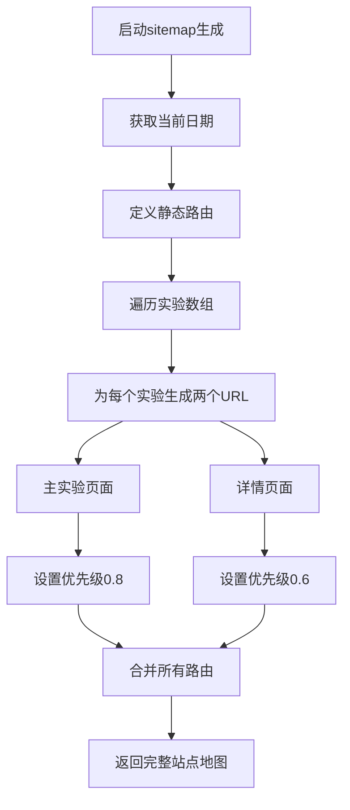
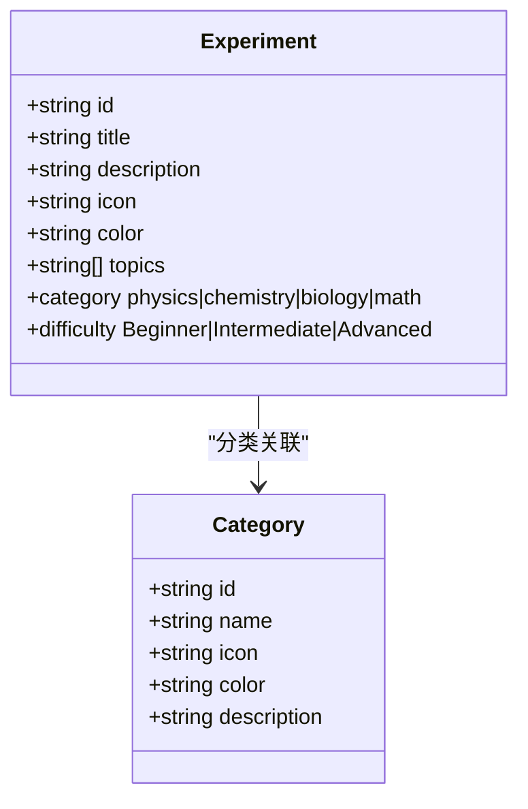
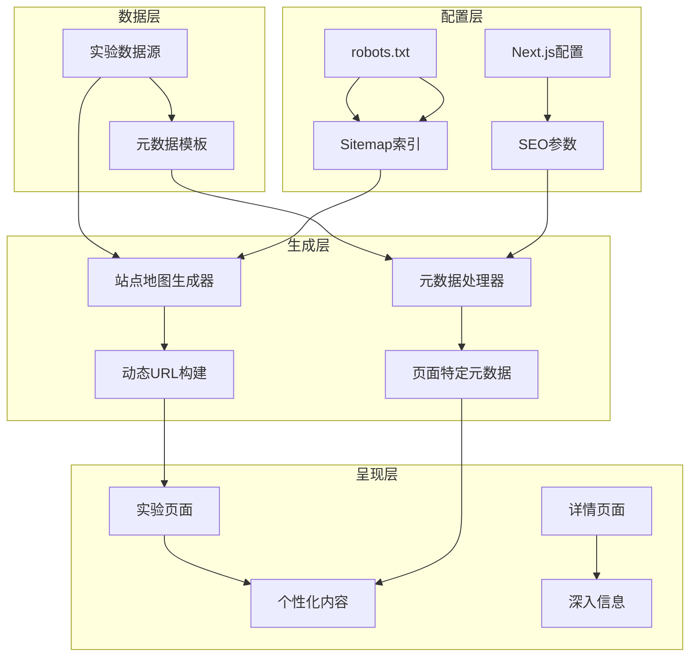
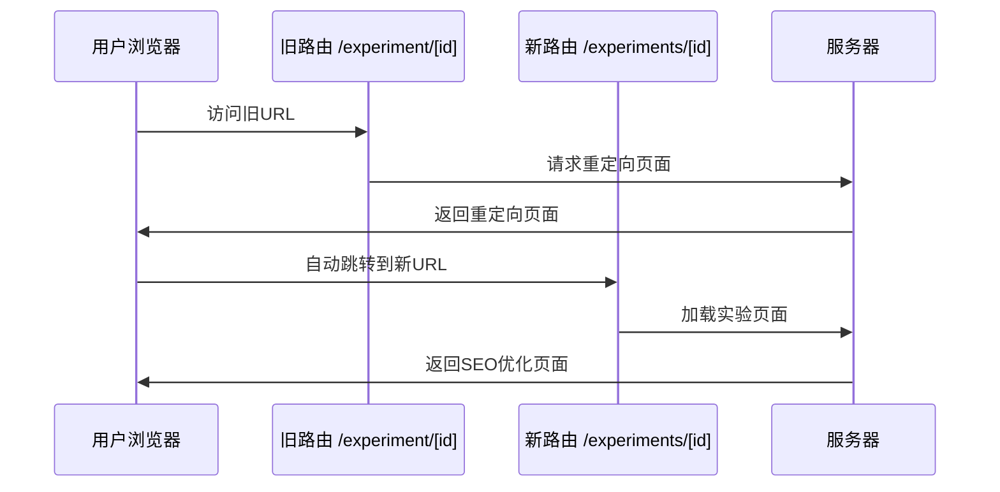
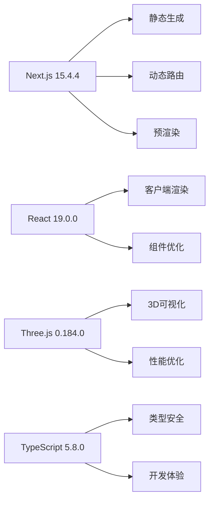
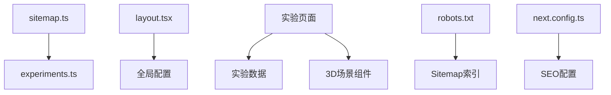

# SEO数据结构

<cite>
**本文档引用的文件**
- [sitemap.ts](file://src/app/sitemap.ts)
- [layout.tsx](file://src/app/layout.tsx)
- [experiments.ts](file://src/data/experiments.ts)
- [robots.txt](file://public/robots.txt)
- [next.config.ts](file://next.config.ts)
- [experiment[id]/page.tsx](file://src/app/experiment\[id\]/page.tsx)
- [experiments/3d-geometry/page.tsx](file://src/app/experiments/3d-geometry/page.tsx)
- [experiments/3d-geometry/details/page.tsx](file://src/app/experiments/3d-geometry/details/page.tsx)
- [experiments/atomic-structure/page.tsx](file://src/app/experiments/atomic-structure/page.tsx)
- [experiments/dna-replication/page.tsx](file://src/app/experiments/dna-replication/page.tsx)
- [package.json](file://package.json)
</cite>

## 目录
1. [简介](#简介)
2. [项目结构](#项目结构)
3. [核心组件](#核心组件)
4. [架构概览](#架构概览)
5. [详细组件分析](#详细组件分析)
6. [依赖关系分析](#依赖关系分析)
7. [性能考虑](#性能考虑)
8. [故障排除指南](#故障排除指南)
9. [结论](#结论)

## 简介

ScienceLab3D是一个基于Next.js的交互式科学教育平台，专注于提供40多个虚拟科学实验的3D可视化体验。本项目在SEO优化方面采用了现代化的策略，通过动态站点地图生成、精心设计的元数据管理和Next.js路由系统的深度集成，为搜索引擎提供了丰富的结构化信息。

该项目的核心优势在于其模块化的实验架构，每个实验都有独特的SEO内容，同时保持了统一的品牌形象和用户体验。通过智能的URL结构设计和元数据管理策略，ScienceLab3D能够有效提升在搜索引擎中的可见性和排名表现。

## 项目结构

ScienceLab3D采用基于功能的组织结构，将SEO相关的组件分布在不同的层次中：

```mermaid
graph TB
subgraph "应用层"
A[src/app] --> B[sitemap.ts - 站点地图]
A --> C[layout.tsx - 全局元数据]
A --> D[experiment[id]/page.tsx - 路由重定向]
A --> E[experiments/* - 实验页面]
end
subgraph "数据层"
F[src/data/experiments.ts - 实验数据]
end
subgraph "配置层"
G[next.config.ts - Next.js配置]
H[public/robots.txt - 搜索引擎配置]
end
subgraph "实验实现"
I[experiments/*-page.tsx - 实验页面]
J[experiments/*-scene.tsx - 3D场景]
end
A --> F
E --> I
I --> J
```

**图表来源**
- [sitemap.ts:1-37](file://src/app/sitemap.ts#L1-L37)
- [layout.tsx:1-204](file://src/app/layout.tsx#L1-L204)
- [experiments.ts:1-492](file://src/data/experiments.ts#L1-L492)

**章节来源**
- [sitemap.ts:1-37](file://src/app/sitemap.ts#L1-L37)
- [layout.tsx:1-204](file://src/app/layout.tsx#L1-L204)
- [experiments.ts:1-492](file://src/data/experiments.ts#L1-L492)

## 核心组件

### 站点地图生成器

站点地图生成器是SEO系统的核心组件，负责动态生成所有实验页面的URL结构：



**图表来源**
- [sitemap.ts:6-36](file://src/app/sitemap.ts#L6-L36)

### 全局元数据管理

全局元数据管理确保了品牌一致性和搜索引擎优化的最佳实践：

| 元数据类型 | 配置值 | 作用 |
|-----------|--------|------|
| 网站标题 | 默认标题 + 模板 | 提供清晰的品牌识别 |
| 描述 | 150字符左右的描述 | 搜索结果摘要 |
| 关键词 | 25个相关关键词 | 主题覆盖和意图匹配 |
| Open Graph | 1200x630像素图像 | 社交媒体分享优化 |
| Twitter Card | 大图卡片格式 | Twitter分享体验 |

**章节来源**
- [layout.tsx:19-118](file://src/app/layout.tsx#L19-L118)

### 实验数据结构

实验数据采用统一的接口定义，支持SEO优化的数据模型：



**图表来源**
- [experiments.ts:1-10](file://src/data/experiments.ts#L1-L10)
- [experiments.ts:462-491](file://src/data/experiments.ts#L462-L491)

**章节来源**
- [experiments.ts:1-492](file://src/data/experiments.ts#L1-L492)

## 架构概览

ScienceLab3D的SEO架构采用分层设计，从底层数据到顶层呈现形成了完整的SEO优化链路：



**图表来源**
- [sitemap.ts:1-37](file://src/app/sitemap.ts#L1-L37)
- [layout.tsx:1-204](file://src/app/layout.tsx#L1-L204)
- [experiments.ts:1-492](file://src/data/experiments.ts#L1-L492)

## 详细组件分析

### 动态路由系统与SEO优化

ScienceLab3D实现了灵活的动态路由系统，支持多种URL结构：

#### 路由重定向机制



**图表来源**
- [experiment[id]/page.tsx](file://src/app/experiment\[id\]/page.tsx#L10-L18)

#### 实验页面路由结构

每个实验都提供两种访问路径：

| 路径类型 | URL结构 | 优先级 | 更新频率 | 用途 |
|---------|---------|--------|----------|------|
| 主页面 | `/experiments/[id]` | 0.8 | monthly | 实验入口和主要内容 |
| 详情页面 | `/experiments/[id]/details` | 0.6 | monthly | 深入信息和技术细节 |

**章节来源**
- [experiment[id]/page.tsx](file://src/app/experiment\[id\]/page.tsx#L1-L29)
- [sitemap.ts:19-33](file://src/app/sitemap.ts#L19-L33)

### 元数据管理策略

#### 页面标题生成规则

页面标题采用模板化策略，确保品牌一致性：

```mermaid
flowchart LR
A[基础标题] --> B[模板: "%s | ScienceLab 3D"]
C[实验特定标题] --> B
B --> D[最终显示标题]
E[全局默认标题] --> B
F[实验页面特定标题] --> B
```

**图表来源**
- [layout.tsx:20-23](file://src/app/layout.tsx#L20-L23)

#### 描述和关键词策略

描述采用150-160字符的标准长度，关键词涵盖25个相关术语，包括：
- 学科领域：物理、化学、生物、数学
- 技术特性：3D、交互式、虚拟实验
- 教育价值：STEM教育、在线学习、免费资源
- 特定实验：具体实验名称和概念

**章节来源**
- [layout.tsx:16-61](file://src/app/layout.tsx#L16-L61)

### 个性化SEO内容生成

#### 实验页面的个性化内容

每个实验页面都有独特的元数据配置：

| 实验类别 | 标题前缀 | 关键词重点 | 描述要点 |
|---------|----------|------------|----------|
| 物理实验 | "物理 - " | 运动、波、能量 | 物理定律验证、现象观察 |
| 化学实验 | "化学 - " | 原子、分子、反应 | 分子结构、化学变化 |
| 生物实验 | "生物 - " | 细胞、基因、生态 | 生命过程、系统功能 |
| 数学实验 | "数学 - " | 几何、函数、变换 | 抽象概念可视化 |

**章节来源**
- [experiments/3d-geometry/page.tsx:5-8](file://src/app/experiments/3d-geometry/page.tsx#L5-L8)
- [experiments/atomic-structure/page.tsx:5-8](file://src/app/experiments/atomic-structure/page.tsx#L5-L8)
- [experiments/dna-replication/page.tsx:9-12](file://src/app/experiments/dna-replication/page.tsx#L9-L12)

### 结构化数据和Schema.org集成

项目集成了完整的Schema.org结构化数据，包括：

```mermaid
graph TD
A[WebApplication] --> B[教育应用标识]
A --> C[操作系统要求]
A --> D[价格信息]
E[WebSite] --> F[搜索功能]
F --> G[SearchAction]
G --> H[target: /?search={search_term_string}]
I[Organization] --> J[创始人信息]
I --> K[联系信息]
A --> E
A --> I
```

**图表来源**
- [layout.tsx:120-178](file://src/app/layout.tsx#L120-L178)

**章节来源**
- [layout.tsx:120-178](file://src/app/layout.tsx#L120-L178)

## 依赖关系分析

### 外部依赖对SEO的影响



**图表来源**
- [package.json:10-21](file://package.json#L10-L21)

### 内部模块依赖



**图表来源**
- [sitemap.ts:1-2](file://src/app/sitemap.ts#L1-L2)
- [layout.tsx:1-2](file://src/app/layout.tsx#L1-L2)
- [experiments.ts:1-10](file://src/data/experiments.ts#L1-L10)

**章节来源**
- [package.json:10-21](file://package.json#L10-L21)
- [next.config.ts:1-9](file://next.config.ts#L1-L9)

## 性能考虑

### SEO性能监控指标

| 指标类型 | 监控方法 | 目标值 |
|---------|----------|--------|
| 页面加载时间 | Lighthouse SEO分数 | >90 |
| 首屏渲染 | First Contentful Paint | <2.5秒 |
| 可达性 | 影响爬虫抓取 | 100% |
| 移动友好性 | Mobile-Friendly Test | 通过 |
| 安全性 | HTTPS检查 | 100% |

### 优化策略

1. **静态生成优先**：使用Next.js的静态生成能力减少服务器负载
2. **图片优化**：使用现代格式如WebP和适当的尺寸
3. **代码分割**：按需加载3D场景组件
4. **缓存策略**：合理设置HTTP缓存头
5. **压缩优化**：启用Gzip或Brotli压缩

## 故障排除指南

### 常见SEO问题及解决方案

#### 站点地图问题
- **症状**：搜索引擎无法发现页面
- **原因**：robots.txt配置错误或Sitemap链接失效
- **解决**：检查robots.txt中的Sitemap链接和sitemap生成逻辑

#### 元数据冲突
- **症状**：页面标题重复或描述不准确
- **原因**：全局元数据与页面特定元数据冲突
- **解决**：确保页面特定元数据正确覆盖全局设置

#### 路由重定向问题
- **症状**：用户被重定向到错误页面
- **原因**：旧URL格式不匹配或重定向逻辑错误
- **解决**：验证实验ID格式和重定向目标URL

**章节来源**
- [robots.txt:4-5](file://public/robots.txt#L4-L5)
- [experiment[id]/page.tsx](file://src/app/experiment\[id\]/page.tsx#L14-L18)

## 结论

ScienceLab3D的SEO数据结构展现了现代Web应用的最佳实践。通过动态站点地图生成、精心设计的元数据管理和灵活的路由系统，该项目为搜索引擎提供了丰富而准确的信息。

关键成功因素包括：
- **数据驱动的SEO**：利用实验数据自动生成个性化内容
- **结构化数据**：完整的Schema.org集成提升搜索结果质量
- **移动优先**：响应式设计和viewport配置
- **性能优化**：静态生成和代码分割策略

这种架构不仅提升了搜索引擎排名，还为用户提供了优质的体验，体现了技术与用户体验的完美结合。对于类似的教育类Web应用，ScienceLab3D的SEO策略提供了可复制的成功模式。