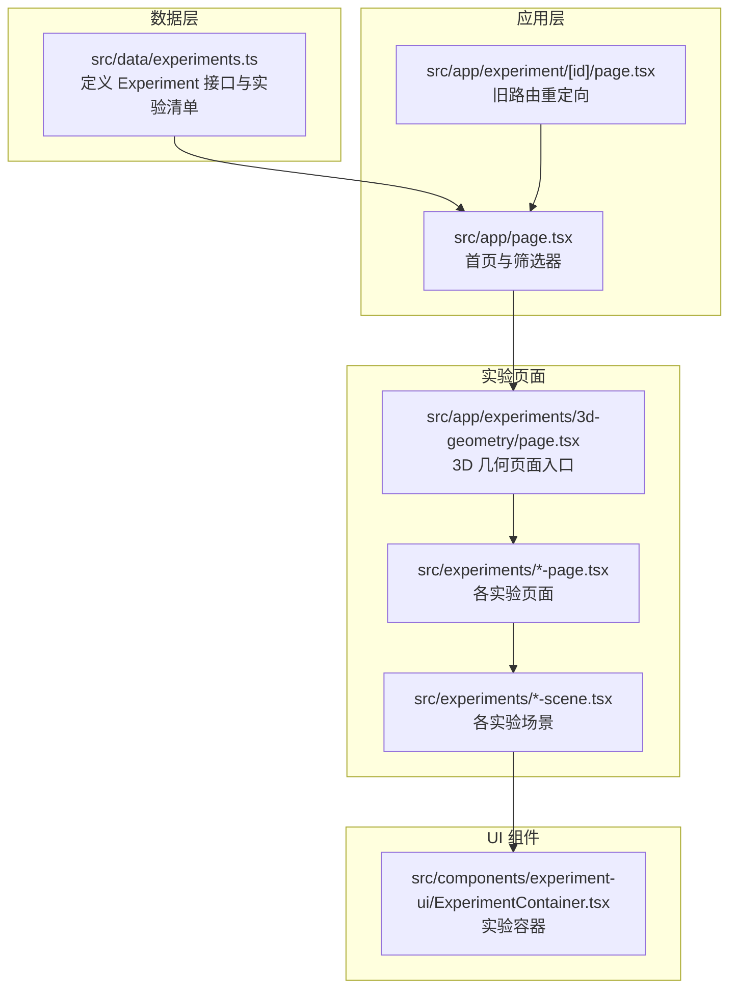
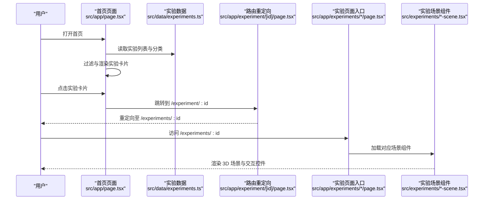
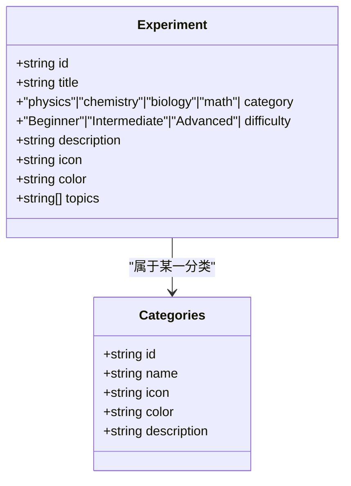
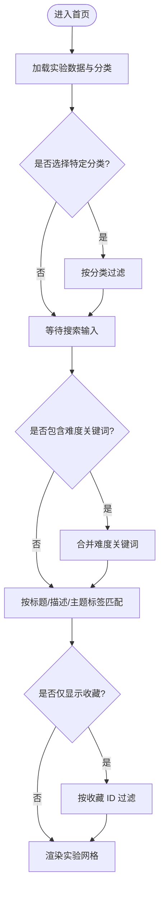
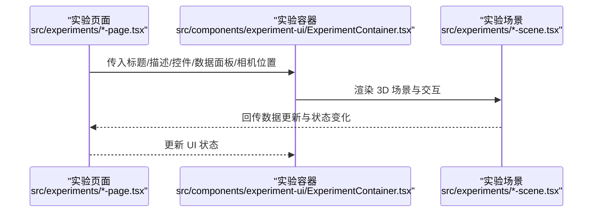
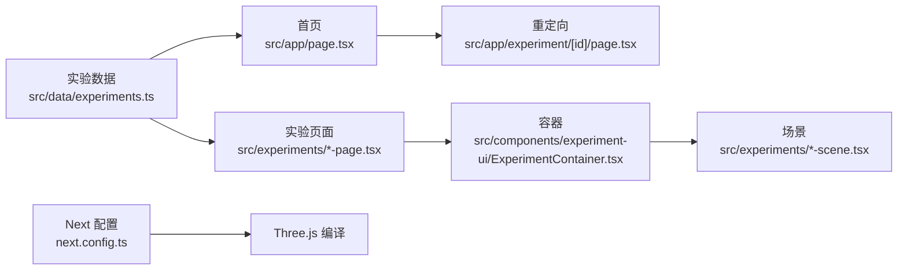

# 实验数据结构

<cite>
**本文引用的文件**
- [src/data/experiments.ts](file://src/data/experiments.ts)
- [src/app/page.tsx](file://src/app/page.tsx)
- [src/components/experiment-ui/ExperimentContainer.tsx](file://src/components/experiment-ui/ExperimentContainer.tsx)
- [src/app/experiments/3d-geometry/page.tsx](file://src/app/experiments/3d-geometry/page.tsx)
- [src/experiments/3d-geometry-page.tsx](file://src/experiments/3d-geometry-page.tsx)
- [src/experiments/3d-geometry-scene.tsx](file://src/experiments/3d-geometry-scene.tsx)
- [src/experiments/dna-replication-scene.tsx](file://src/experiments/dna-replication-scene.tsx)
- [src/experiments/ecosystem-scene.tsx](file://src/experiments/ecosystem-scene.tsx)
- [src/experiments/photosynthesis-page.tsx](file://src/experiments/photosynthesis-page.tsx)
- [src/experiments/cellular-respiration-page.tsx](file://src/experiments/cellular-respiration-page.tsx)
- [src/app/experiment/[id]/page.tsx](file://src/app/experiment/[id]/page.tsx)
- [next.config.ts](file://next.config.ts)
- [src/types/css.d.ts](file://src/types/css.d.ts)
</cite>

## 目录
1. [引言](#引言)
2. [项目结构](#项目结构)
3. [核心组件](#核心组件)
4. [架构总览](#架构总览)
5. [详细组件分析](#详细组件分析)
6. [依赖关系分析](#依赖关系分析)
7. [性能考量](#性能考量)
8. [故障排除指南](#故障排除指南)
9. [结论](#结论)
10. [附录](#附录)

## 引言
本文件系统性梳理 ScienceLab3D 的实验数据结构与设计，围绕 Experiment 接口的字段语义、实验分类体系（物理、化学、生物、数学）、难度等级划分、主题标签系统展开；并提供扩展与自定义实验的完整流程、最佳实践与参考示例路径，帮助开发者在不破坏现有架构的前提下快速集成新实验。

## 项目结构
本项目采用按功能模块组织的前端架构，实验数据集中于数据层，页面路由与交互逻辑位于应用层，具体实验场景由独立的页面与场景组件承载。下图展示与实验数据结构直接相关的文件与模块关系：

图表来源
- [src/data/experiments.ts:1-492](file://src/data/experiments.ts#L1-L492)
- [src/app/page.tsx:286-483](file://src/app/page.tsx#L286-L483)
- [src/app/experiments/3d-geometry/page.tsx:1-20](file://src/app/experiments/3d-geometry/page.tsx#L1-L20)
- [src/experiments/3d-geometry-page.tsx:1-200](file://src/experiments/3d-geometry-page.tsx#L1-L200)
- [src/experiments/3d-geometry-scene.tsx:1-120](file://src/experiments/3d-geometry-scene.tsx#L1-L120)
- [src/components/experiment-ui/ExperimentContainer.tsx:43-90](file://src/components/experiment-ui/ExperimentContainer.tsx#L43-L90)
- [src/app/experiment/[id]/page.tsx:1-28](file://src/app/experiment/[id]/page.tsx#L1-L28)

章节来源
- [src/data/experiments.ts:1-492](file://src/data/experiments.ts#L1-L492)
- [src/app/page.tsx:286-483](file://src/app/page.tsx#L286-L483)
- [src/app/experiments/3d-geometry/page.tsx:1-20](file://src/app/experiments/3d-geometry/page.tsx#L1-L20)
- [src/components/experiment-ui/ExperimentContainer.tsx:43-90](file://src/components/experiment-ui/ExperimentContainer.tsx#L43-L90)
- [src/app/experiment/[id]/page.tsx:1-28](file://src/app/experiment/[id]/page.tsx#L1-L28)

## 核心组件
本节聚焦 Experiment 接口与实验分类、难度、主题标签的设计理念与约束。

- 字段语义与约束
  - id: 唯一标识符，用于路由跳转与本地存储关联。应保持稳定且全局唯一。
  - title: 实验标题，用于卡片展示与搜索匹配。
  - category: 分类枚举，限定为 "physics" | "chemistry" | "biology" | "math"。
  - difficulty: 难度枚举，限定为 "Beginner" | "Intermediate" | "Advanced"。
  - description: 简明描述，支持首页搜索过滤。
  - icon: 字符串图标，用于卡片与分类徽章展示。
  - color: 十六进制颜色值，用于主题色与视觉一致性。
  - topics: 主题标签数组，用于关键词检索与筛选。

- 分类系统
  - 物理：强调力学、光学、电磁学、波动等经典与现代物理现象。
  - 化学：原子结构、键合、电解、滴定、气体定律、扩散、热化学、周期表趋势等。
  - 生物：细胞结构、DNA 复制、蛋白质合成、光合作用、呼吸作用、有丝分裂与减数分裂、自然选择、神经系统、生态系统、免疫反应等。
  - 数学：傅里叶变换、斐波那契与黄金螺旋、3D 几何、微积分可视化、分形、概率分布、线性代数、三角函数、复数、拓扑曲面等。

- 难度等级划分
  - Beginner：入门级，参数直观可控，概念清晰，适合初学者建立基础认知。
  - Intermediate：中级，涉及多步推理或参数耦合，需要一定背景知识。
  - Advanced：高级，涉及前沿或复杂模型，如量子效应、进化模拟、拓扑结构等。

- 主题标签系统
  - 设计思路：以“关键词”形式标注实验的核心知识点，便于全文检索与智能筛选。
  - 应用场景：首页搜索框支持按标题、描述、主题标签模糊匹配；难度过滤按钮可叠加到搜索词中进行复合筛选。

章节来源
- [src/data/experiments.ts:1-10](file://src/data/experiments.ts#L1-L10)
- [src/data/experiments.ts:462-491](file://src/data/experiments.ts#L462-L491)
- [src/app/page.tsx:468-479](file://src/app/page.tsx#L468-L479)
- [src/app/page.tsx:330-350](file://src/app/page.tsx#L330-L350)

## 架构总览
下图展示从首页到具体实验页面的数据流与控制流，体现实验数据如何驱动 UI 渲染与交互：

图表来源
- [src/app/page.tsx:286-483](file://src/app/page.tsx#L286-L483)
- [src/data/experiments.ts:12-460](file://src/data/experiments.ts#L12-L460)
- [src/app/experiment/[id]/page.tsx:1-28](file://src/app/experiment/[id]/page.tsx#L1-L28)
- [src/app/experiments/3d-geometry/page.tsx:1-20](file://src/app/experiments/3d-geometry/page.tsx#L1-L20)
- [src/experiments/3d-geometry-scene.tsx:1-120](file://src/experiments/3d-geometry-scene.tsx#L1-L120)

## 详细组件分析

### 实验数据模型与分类
- 数据模型
  - Experiment 接口定义了实验元数据的强类型结构，确保数据一致性与开发期校验。
  - categories 定义了四大分类的元信息，包括 id、name、icon、color、description，用于首页分类徽章与视觉主题。

- 分类组织方式
  - 按学科划分，每个分类下包含若干代表性实验，覆盖基础到高阶内容。
  - 颜色与图标统一风格，提升界面一致性与可识别性。

图表来源
- [src/data/experiments.ts:1-10](file://src/data/experiments.ts#L1-L10)
- [src/data/experiments.ts:462-491](file://src/data/experiments.ts#L462-L491)

章节来源
- [src/data/experiments.ts:1-10](file://src/data/experiments.ts#L1-L10)
- [src/data/experiments.ts:462-491](file://src/data/experiments.ts#L462-L491)

### 首页筛选与搜索逻辑
- 过滤条件
  - 分类过滤：根据 activeCategory 与 Experiment.category 匹配。
  - 关键词搜索：同时匹配 title、description、topics 中的任意一项。
  - 收藏过滤：可仅显示收藏夹中的实验。
  - 难度过滤：通过点击难度按钮将难度关键字拼接到搜索词中进行复合筛选。

- 视觉反馈
  - 分类徽章高亮当前选中分类，并带缩放与发光效果。
  - 难度按钮悬停变色，点击后将难度关键词加入搜索输入。

图表来源
- [src/app/page.tsx:330-350](file://src/app/page.tsx#L330-L350)
- [src/app/page.tsx:468-479](file://src/app/page.tsx#L468-L479)
- [src/app/page.tsx:164-202](file://src/app/page.tsx#L164-L202)

章节来源
- [src/app/page.tsx:330-350](file://src/app/page.tsx#L330-L350)
- [src/app/page.tsx:468-479](file://src/app/page.tsx#L468-L479)
- [src/app/page.tsx:164-202](file://src/app/page.tsx#L164-L202)

### 实验页面与场景组件
- 页面入口
  - 每个实验在 /experiments/:id 下有对应的页面入口文件，负责导入该实验的页面组件与场景组件。
  - 例如 3D 几何实验的页面入口文件会引入对应的页面与场景组件。

- 场景组件
  - 各实验的场景组件负责构建 3D 场景、绑定交互控件、管理状态与数据面板。
  - 典型流程：页面组件创建 ExperimentContainer，传入标题、描述、相机位置、背景色、控件与数据面板；场景组件在容器内渲染 3D 内容。

图表来源
- [src/app/experiments/3d-geometry/page.tsx:1-20](file://src/app/experiments/3d-geometry/page.tsx#L1-L20)
- [src/experiments/3d-geometry-page.tsx:132-177](file://src/experiments/3d-geometry-page.tsx#L132-L177)
- [src/components/experiment-ui/ExperimentContainer.tsx:55-90](file://src/components/experiment-ui/ExperimentContainer.tsx#L55-L90)
- [src/experiments/3d-geometry-scene.tsx:1-120](file://src/experiments/3d-geometry-scene.tsx#L1-L120)

章节来源
- [src/app/experiments/3d-geometry/page.tsx:1-20](file://src/app/experiments/3d-geometry/page.tsx#L1-L20)
- [src/experiments/3d-geometry-page.tsx:132-177](file://src/experiments/3d-geometry-page.tsx#L132-L177)
- [src/components/experiment-ui/ExperimentContainer.tsx:55-90](file://src/components/experiment-ui/ExperimentContainer.tsx#L55-L90)
- [src/experiments/3d-geometry-scene.tsx:1-120](file://src/experiments/3d-geometry-scene.tsx#L1-L120)

### 典型实验案例解析
- DNA 复制场景
  - 场景组件通过步骤化展示与标签提示，帮助用户理解半保留复制机制。
  - 示例路径：[src/experiments/dna-replication-scene.tsx:531-550](file://src/experiments/dna-replication-scene.tsx#L531-L550)

- 生态系统场景
  - 展示食物链层级与能量传递效率，实时显示代际与总能量统计。
  - 示例路径：[src/experiments/ecosystem-scene.tsx:559-587](file://src/experiments/ecosystem-scene.tsx#L559-L587)

- 光合作用页面
  - 提供步骤模式、标签开关等控制项，并引导查看详情页。
  - 示例路径：[src/experiments/photosynthesis-page.tsx:88-126](file://src/experiments/photosynthesis-page.tsx#L88-L126)

- 细胞呼吸页面
  - 使用 ExperimentContainer 封装场景，提供播放/暂停、速度调节、重置等控制。
  - 示例路径：[src/experiments/cellular-respiration-page.tsx:132-177](file://src/experiments/cellular-respiration-page.tsx#L132-L177)

章节来源
- [src/experiments/dna-replication-scene.tsx:531-550](file://src/experiments/dna-replication-scene.tsx#L531-L550)
- [src/experiments/ecosystem-scene.tsx:559-587](file://src/experiments/ecosystem-scene.tsx#L559-L587)
- [src/experiments/photosynthesis-page.tsx:88-126](file://src/experiments/photosynthesis-page.tsx#L88-L126)
- [src/experiments/cellular-respiration-page.tsx:132-177](file://src/experiments/cellular-respiration-page.tsx#L132-L177)

## 依赖关系分析
- 数据依赖
  - 首页与实验页面均依赖实验数据文件提供的 Experiment 列表与分类元数据。
  - 路由重定向模块依赖实验 id，确保旧链接平滑过渡到新路由。

- 组件依赖
  - 实验页面组件依赖 ExperimentContainer 作为统一的场景容器，保证一致的交互体验与布局。
  - 场景组件依赖 Three.js 生态（通过 next.config.ts 中的 transpilePackages 对 three 进行编译处理）。

图表来源
- [src/data/experiments.ts:12-460](file://src/data/experiments.ts#L12-L460)
- [src/app/page.tsx:286-483](file://src/app/page.tsx#L286-L483)
- [src/app/experiment/[id]/page.tsx:1-28](file://src/app/experiment/[id]/page.tsx#L1-L28)
- [src/components/experiment-ui/ExperimentContainer.tsx:55-90](file://src/components/experiment-ui/ExperimentContainer.tsx#L55-L90)
- [next.config.ts:1-8](file://next.config.ts#L1-L8)

章节来源
- [src/data/experiments.ts:12-460](file://src/data/experiments.ts#L12-L460)
- [src/app/page.tsx:286-483](file://src/app/page.tsx#L286-L483)
- [src/app/experiment/[id]/page.tsx:1-28](file://src/app/experiment/[id]/page.tsx#L1-L28)
- [src/components/experiment-ui/ExperimentContainer.tsx:55-90](file://src/components/experiment-ui/ExperimentContainer.tsx#L55-L90)
- [next.config.ts:1-8](file://next.config.ts#L1-L8)

## 性能考量
- 数据加载
  - 实验数据为静态常量，无需网络请求，首屏渲染性能优异。
- 过滤与搜索
  - 首页使用 useMemo 缓存过滤结果，避免重复计算；建议在大量实验时考虑分页或虚拟滚动。
- 场景渲染
  - 3D 场景组件应避免不必要的重渲染，合理拆分状态与副作用，减少 Three.js 场景重建频率。
- 资源编译
  - 通过 next.config.ts 对 three 进行预编译，降低打包体积与运行时开销。

## 故障排除指南
- 路由跳转异常
  - 若访问旧路径 /experiment/:id，系统会自动重定向到 /experiments/:id；若未生效，请检查重定向页面与浏览器缓存。
  - 参考路径：[src/app/experiment/[id]/page.tsx](file://src/app/experiment/[id]/page.tsx#L1-L28)

- 实验页面空白或报错
  - 确认页面入口文件已正确导入对应页面与场景组件。
  - 参考路径：[src/app/experiments/3d-geometry/page.tsx:1-20](file://src/app/experiments/3d-geometry/page.tsx#L1-L20)

- Three.js 相关错误
  - 检查 next.config.ts 是否正确配置 transpilePackages: ["three"]。
  - 参考路径：[next.config.ts:1-8](file://next.config.ts#L1-L8)

- 样式模块解析问题
  - 若遇到 *.css/*.module.css 类型声明错误，确认类型声明文件存在且路径正确。
  - 参考路径：[src/types/css.d.ts:1-30](file://src/types/css.d.ts#L1-L30)

章节来源
- [src/app/experiment/[id]/page.tsx:1-28](file://src/app/experiment/[id]/page.tsx#L1-L28)
- [src/app/experiments/3d-geometry/page.tsx:1-20](file://src/app/experiments/3d-geometry/page.tsx#L1-L20)
- [next.config.ts:1-8](file://next.config.ts#L1-L8)
- [src/types/css.d.ts:1-30](file://src/types/css.d.ts#L1-L30)

## 结论
ScienceLab3D 的实验数据结构以强类型接口为核心，配合清晰的分类与难度体系、灵活的主题标签系统，实现了良好的可维护性与扩展性。通过统一的页面容器与场景组件，项目在保证教学体验的同时兼顾了性能与开发效率。遵循本文的最佳实践，可在不破坏现有架构的前提下高效扩展新的实验内容。

## 附录

### 扩展与自定义实验的完整流程
- 步骤一：在实验数据文件中新增一条实验记录
  - 参考路径：[src/data/experiments.ts:12-460](file://src/data/experiments.ts#L12-L460)
  - 字段要求：严格遵循 Experiment 接口定义，确保 id 唯一、category 与 difficulty 在枚举范围内、topics 为非空字符串数组。
- 步骤二：创建页面入口与页面组件
  - 在 /src/app/experiments/:id 下创建页面入口文件，导入对应的页面与场景组件。
  - 参考路径：[src/app/experiments/3d-geometry/page.tsx:1-20](file://src/app/experiments/3d-geometry/page.tsx#L1-L20)
- 步骤三：实现页面与场景组件
  - 页面组件负责组织 ExperimentContainer 与控件，场景组件负责渲染 3D 内容与交互。
  - 参考路径：[src/experiments/3d-geometry-page.tsx:132-177](file://src/experiments/3d-geometry-page.tsx#L132-L177)，[src/experiments/3d-geometry-scene.tsx:1-120](file://src/experiments/3d-geometry-scene.tsx#L1-120)
- 步骤四：测试与验证
  - 在首页验证实验是否出现、分类与难度筛选是否生效、收藏功能是否正常。
  - 参考路径：[src/app/page.tsx:286-483](file://src/app/page.tsx#L286-483)

### 最佳实践指南
- 字段规范
  - id：使用短横线连接的小写英文，避免特殊字符。
  - title：简洁明确，避免冗长；与 topics 形成互补。
  - description：突出实验目标与可观察现象，便于搜索。
  - icon：使用单个 emoji 或简单符号，保持风格一致。
  - color：与分类颜色相近，确保在浅色/深色主题下可读性良好。
  - topics：至少 3 个关键词，覆盖核心知识点，避免过于宽泛或重复。
- 分类与难度
  - 分类应与实验内容高度契合；难度应基于学习曲线与实现复杂度综合评估。
- 页面与场景
  - 页面组件尽量薄化逻辑，将复杂状态下沉至场景组件；合理拆分控件与数据面板，提升可维护性。
- 性能优化
  - 控制场景对象数量与几何复杂度；避免在渲染循环中执行昂贵操作；利用 React.memo 与 useMemo 缓存计算结果。

### 完整实验配置示例（参考路径）
- 物理示例：[src/data/experiments.ts:14-24](file://src/data/experiments.ts#L14-L24)
- 化学示例：[src/data/experiments.ts:126-136](file://src/data/experiments.ts#L126-L136)
- 生物示例：[src/data/experiments.ts:238-248](file://src/data/experiments.ts#L238-L248)
- 数学示例：[src/data/experiments.ts:350-360](file://src/data/experiments.ts#L350-L360)