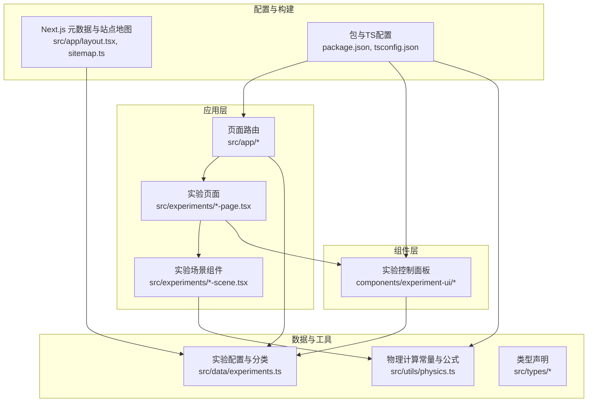
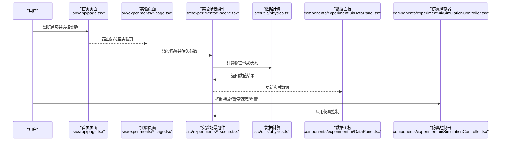
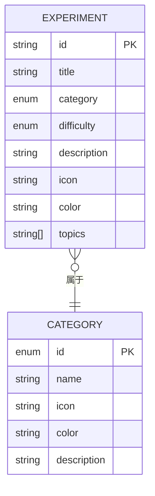
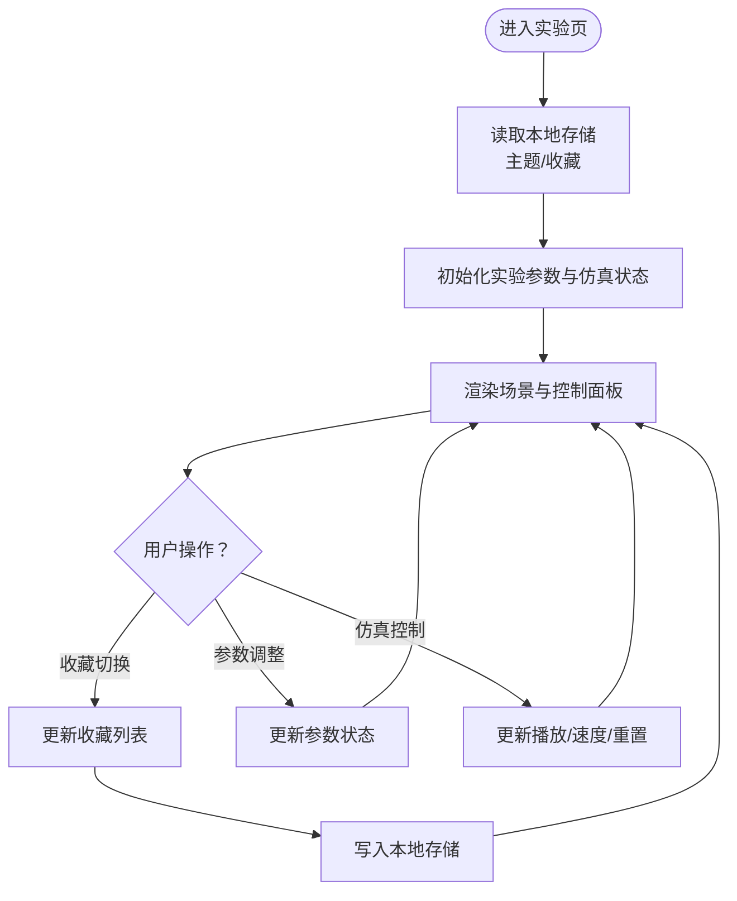
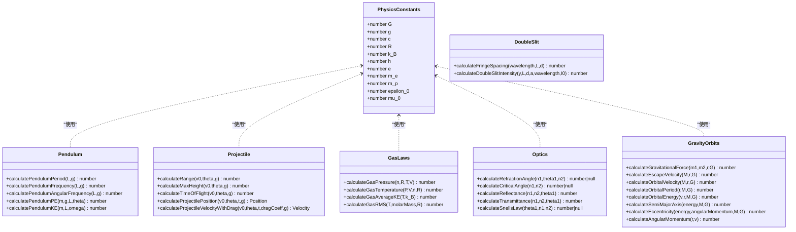
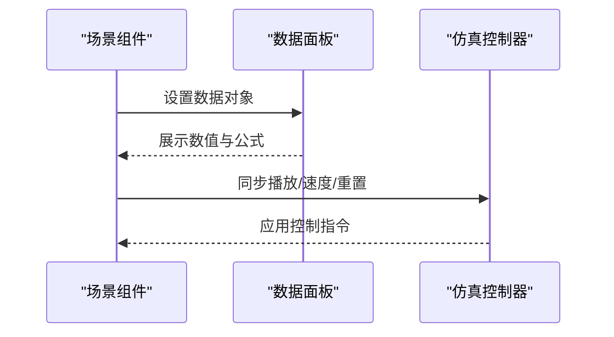
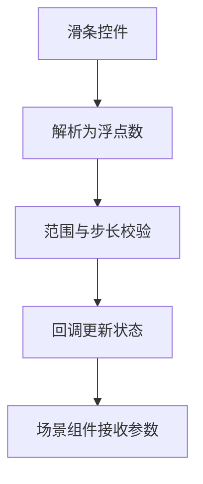
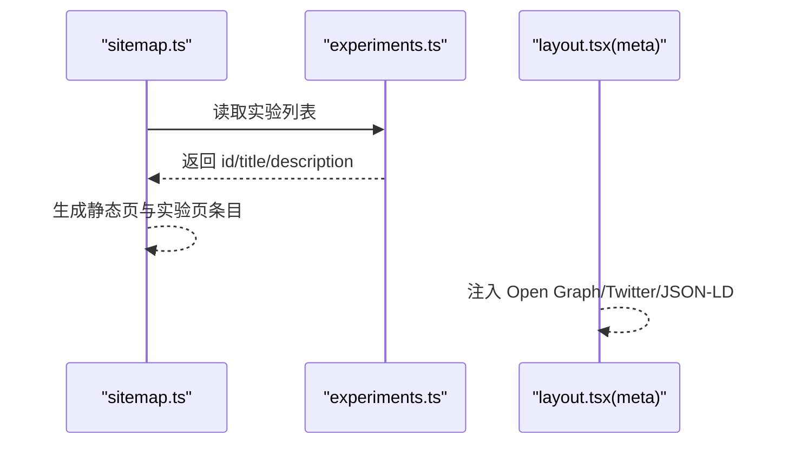
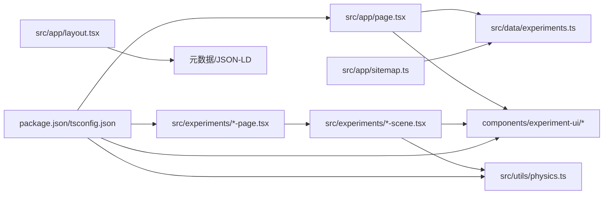

# 数据管理

<cite>
**本文引用的文件**
- [src/data/experiments.ts](file://src/data/experiments.ts)
- [src/app/sitemap.ts](file://src/app/sitemap.ts)
- [src/app/layout.tsx](file://src/app/layout.tsx)
- [src/app/page.tsx](file://src/app/page.tsx)
- [src/types/css.d.ts](file://src/types/css.d.ts)
- [src/utils/physics.ts](file://src/utils/physics.ts)
- [src/components/experiment-ui/DataPanel.tsx](file://src/components/experiment-ui/DataPanel.tsx)
- [src/components/experiment-ui/SimulationController.tsx](file://src/components/experiment-ui/SimulationController.tsx)
- [src/components/experiment-ui/ExperimentControls.tsx](file://src/components/experiment-ui/ExperimentControls.tsx)
- [src/experiments/3d-geometry-page.tsx](file://src/experiments/3d-geometry-page.tsx)
- [src/experiments/probability-distributions-scene.tsx](file://src/experiments/probability-distributions-scene.tsx)
- [src/experiments/titration-page.tsx](file://src/experiments/titration-page.tsx)
- [package.json](file://package.json)
- [tsconfig.json](file://tsconfig.json)
</cite>

## 目录
1. [引言](#引言)
2. [项目结构](#项目结构)
3. [核心组件](#核心组件)
4. [架构总览](#架构总览)
5. [详细组件分析](#详细组件分析)
6. [依赖关系分析](#依赖关系分析)
7. [性能考量](#性能考量)
8. [故障排查指南](#故障排查指南)
9. [结论](#结论)
10. [附录](#附录)

## 引言
本文件系统性梳理 ScienceLab3D 的数据管理方案，聚焦实验数据的结构设计与组织方式，涵盖实验配置、参数定义、状态数据、加载与存储机制（静态配置与动态状态）、类型安全与运行时校验、数据扩展与自定义路径、版本与迁移策略，以及 SEO 相关的数据结构（站点地图与元数据）。文档以渐进方式呈现，既适合技术读者深入理解实现细节，也便于非技术读者把握整体架构。

## 项目结构
项目采用基于功能域的分层组织：页面路由位于 app 目录，实验页面与场景逻辑分别在 experiments 与 app/experiments 下，通用 UI 组件集中在 components/experiment-ui，数据模型与常量在 data 与 utils 中，类型声明在 types 下，构建与工具链配置在根目录。

图表来源
- [src/app/page.tsx:1-676](file://src/app/page.tsx#L1-676)
- [src/experiments/3d-geometry-page.tsx:1-190](file://src/experiments/3d-geometry-page.tsx#L1-190)
- [src/data/experiments.ts:1-492](file://src/data/experiments.ts#L1-492)
- [src/utils/physics.ts:1-687](file://src/utils/physics.ts#L1-687)
- [src/app/layout.tsx:1-204](file://src/app/layout.tsx#L1-204)
- [src/app/sitemap.ts:1-37](file://src/app/sitemap.ts#L1-37)
- [package.json:1-37](file://package.json#L1-37)
- [tsconfig.json:1-22](file://tsconfig.json#L1-22)

章节来源
- [src/app/page.tsx:1-676](file://src/app/page.tsx#L1-L676)
- [src/experiments/3d-geometry-page.tsx:1-190](file://src/experiments/3d-geometry-page.tsx#L1-L190)
- [src/data/experiments.ts:1-492](file://src/data/experiments.ts#L1-L492)
- [src/utils/physics.ts:1-687](file://src/utils/physics.ts#L1-L687)
- [src/app/layout.tsx:1-204](file://src/app/layout.tsx#L1-L204)
- [src/app/sitemap.ts:1-37](file://src/app/sitemap.ts#L1-L37)
- [package.json:1-37](file://package.json#L1-L37)
- [tsconfig.json:1-22](file://tsconfig.json#L1-L22)

## 核心组件
- 实验配置与分类
  - 定义了统一的实验接口与分类集合，用于页面渲染、筛选与导航。
- 物理常量与计算函数
  - 提供统一的物理常量与各类物理公式的计算函数，确保数值一致性与可复用性。
- 动态状态管理
  - 页面通过 React 状态与本地存储实现用户偏好、收藏与实验参数的持久化。
- 数据面板与仿真控制器
  - 提供可拖拽、可折叠的实时数据展示与仿真控制面板，支持参数调节与时间轴显示。
- SEO 元数据与站点地图
  - Next.js 元数据配置与动态站点地图生成，覆盖静态页与实验详情页。

章节来源
- [src/data/experiments.ts:1-492](file://src/data/experiments.ts#L1-L492)
- [src/utils/physics.ts:1-687](file://src/utils/physics.ts#L1-L687)
- [src/app/page.tsx:11-359](file://src/app/page.tsx#L11-L359)
- [src/components/experiment-ui/DataPanel.tsx:1-219](file://src/components/experiment-ui/DataPanel.tsx#L1-L219)
- [src/components/experiment-ui/SimulationController.tsx:1-228](file://src/components/experiment-ui/SimulationController.tsx#L1-L228)
- [src/app/sitemap.ts:1-37](file://src/app/sitemap.ts#L1-L37)
- [src/app/layout.tsx:19-118](file://src/app/layout.tsx#L19-L118)

## 架构总览
下图展示了从页面到实验场景、再到物理计算与数据面板的整体流程，以及静态配置与动态状态的交互。

图表来源
- [src/app/page.tsx:1-676](file://src/app/page.tsx#L1-L676)
- [src/experiments/3d-geometry-page.tsx:1-190](file://src/experiments/3d-geometry-page.tsx#L1-L190)
- [src/utils/physics.ts:1-687](file://src/utils/physics.ts#L1-L687)
- [src/components/experiment-ui/DataPanel.tsx:1-219](file://src/components/experiment-ui/DataPanel.tsx#L1-L219)
- [src/components/experiment-ui/SimulationController.tsx:1-228](file://src/components/experiment-ui/SimulationController.tsx#L1-L228)

## 详细组件分析

### 实验配置与分类数据模型
- 设计要点
  - 使用 TypeScript 接口约束实验字段，限定类别与难度为字面量联合类型，保证枚举值的类型安全。
  - 分类集合提供统一的颜色、图标与描述，便于 UI 呈现与主题一致。
  - 实验数组按学科分段，提升可维护性与扩展性。
- 数据流
  - 首页与路由层读取该配置进行筛选、搜索与导航。
  - SEO 站点地图基于该配置生成实验页与详情页链接。
- 扩展建议
  - 新增实验时遵循现有字段与分段结构；新增分类需同步更新分类集合。
  - 可引入校验器在构建期检查必填字段与格式。

图表来源
- [src/data/experiments.ts:1-492](file://src/data/experiments.ts#L1-L492)

章节来源
- [src/data/experiments.ts:1-492](file://src/data/experiments.ts#L1-L492)
- [src/app/sitemap.ts:20-33](file://src/app/sitemap.ts#L20-L33)

### 动态状态管理与本地存储
- 收藏与主题偏好
  - 首页使用本地存储保存用户收藏与主题设置，并在客户端初始化时恢复。
  - 过滤逻辑结合分类、关键词与难度标签，支持“仅看收藏”模式。
- 实验参数与仿真状态
  - 实验页面通过 React 状态管理参数（如旋转速度、线框显示等）与仿真控制（播放/暂停、速度、重置）。
  - 数据面板与仿真控制器均为可拖拽、可折叠的浮动 UI，增强交互体验。
- 类型安全
  - 参数类型在组件间传递时保持严格约束，避免非法状态进入场景。

图表来源
- [src/app/page.tsx:11-359](file://src/app/page.tsx#L11-L359)
- [src/experiments/3d-geometry-page.tsx:18-40](file://src/experiments/3d-geometry-page.tsx#L18-L40)
- [src/components/experiment-ui/DataPanel.tsx:23-73](file://src/components/experiment-ui/DataPanel.tsx#L23-L73)
- [src/components/experiment-ui/SimulationController.tsx:27-73](file://src/components/experiment-ui/SimulationController.tsx#L27-L73)

章节来源
- [src/app/page.tsx:11-359](file://src/app/page.tsx#L11-L359)
- [src/experiments/3d-geometry-page.tsx:18-40](file://src/experiments/3d-geometry-page.tsx#L18-L40)
- [src/components/experiment-ui/DataPanel.tsx:1-219](file://src/components/experiment-ui/DataPanel.tsx#L1-L219)
- [src/components/experiment-ui/SimulationController.tsx:1-228](file://src/components/experiment-ui/SimulationController.tsx#L1-L228)

### 物理常量与计算函数
- 设计要点
  - 将物理常量集中在一个只读对象中，避免魔法数字，便于全局引用与测试。
  - 按模块划分计算函数（如简谐运动、抛体运动、弹簧振子、气体定律、波动光学、引力轨道、双缝干涉等），职责清晰。
- 数据流
  - 场景组件调用计算函数得到实时物理量，再交给数据面板展示。
- 扩展建议
  - 新增实验时优先复用既有函数，必要时补充新模块与常量。
  - 对输入参数进行边界检查与单位转换，确保数值稳定。

图表来源
- [src/utils/physics.ts:10-22](file://src/utils/physics.ts#L10-L22)
- [src/utils/physics.ts:28-92](file://src/utils/physics.ts#L28-L92)
- [src/utils/physics.ts:98-188](file://src/utils/physics.ts#L98-L188)
- [src/utils/physics.ts:242-303](file://src/utils/physics.ts#L242-L303)
- [src/utils/physics.ts:367-450](file://src/utils/physics.ts#L367-L450)
- [src/utils/physics.ts:456-587](file://src/utils/physics.ts#L456-L587)
- [src/utils/physics.ts:593-641](file://src/utils/physics.ts#L593-L641)

章节来源
- [src/utils/physics.ts:1-687](file://src/utils/physics.ts#L1-L687)

### 数据面板与仿真控制器
- 数据面板
  - 支持可见性切换、拖拽、移动端适配、折叠/展开与内容区域滚动。
  - 作为实时数据容器，接收场景组件传入的结构化数据并以表格形式展示。
- 仿真控制器
  - 提供播放/暂停、重置、速度调节与时间显示，支持拖拽与触摸交互。
  - 与场景组件共享状态，实现参数联动与可视化反馈。

图表来源
- [src/experiments/3d-geometry-page.tsx:122-143](file://src/experiments/3d-geometry-page.tsx#L122-L143)
- [src/components/experiment-ui/DataPanel.tsx:23-144](file://src/components/experiment-ui/DataPanel.tsx#L23-L144)
- [src/components/experiment-ui/SimulationController.tsx:27-144](file://src/components/experiment-ui/SimulationController.tsx#L27-L144)

章节来源
- [src/experiments/3d-geometry-page.tsx:122-143](file://src/experiments/3d-geometry-page.tsx#L122-L143)
- [src/components/experiment-ui/DataPanel.tsx:1-219](file://src/components/experiment-ui/DataPanel.tsx#L1-L219)
- [src/components/experiment-ui/SimulationController.tsx:1-228](file://src/components/experiment-ui/SimulationController.tsx#L1-L228)

### 控制组件与参数校验
- 控制滑条与下拉框
  - 统一的滑条与下拉组件提供标签、单位、最小最大值、步长、颜色与小数位等配置。
  - 输入值在 onChange 中被解析为浮点数，确保类型一致性。
- 数据网格
  - 支持多列布局与进度条样式，用于展示能量、浓度、pH 等指标。

图表来源
- [src/components/experiment-ui/ExperimentControls.tsx:66-88](file://src/components/experiment-ui/ExperimentControls.tsx#L66-L88)

章节来源
- [src/components/experiment-ui/ExperimentControls.tsx:50-211](file://src/components/experiment-ui/ExperimentControls.tsx#L50-L211)

### SEO 数据结构：站点地图与元数据
- 站点地图
  - 基于实验配置动态生成实验页与详情页的 sitemap 条目，包含最后修改时间、变更频率与优先级。
- 元数据
  - Next.js 元数据配置包含标题、描述、关键词、Open Graph、Twitter 卡片、图标与清单等。
  - 结构化数据（Schema.org）以 JSON-LD 形式注入，包含 WebApplication、WebSite 与 Organization 信息。

图表来源
- [src/app/sitemap.ts:6-36](file://src/app/sitemap.ts#L6-L36)
- [src/data/experiments.ts:12-460](file://src/data/experiments.ts#L12-L460)
- [src/app/layout.tsx:19-118](file://src/app/layout.tsx#L19-L118)
- [src/app/layout.tsx:120-178](file://src/app/layout.tsx#L120-L178)

章节来源
- [src/app/sitemap.ts:1-37](file://src/app/sitemap.ts#L1-L37)
- [src/app/layout.tsx:19-118](file://src/app/layout.tsx#L19-L118)
- [src/app/layout.tsx:120-178](file://src/app/layout.tsx#L120-L178)

## 依赖关系分析
- 内部依赖
  - 页面依赖实验配置与分类；实验页面依赖场景组件与 UI 控件；场景组件依赖物理计算模块。
- 外部依赖
  - Next.js 提供路由、元数据与站点地图；React 生态组件（如 Framer Motion）用于动画；Three.js 生态（@react-three/fiber、@react-three/drei、three）用于 3D 渲染。
- 类型与构建
  - TypeScript 严格模式开启，路径别名与插件配置确保类型检查与模块解析正确。

图表来源
- [src/app/page.tsx:1-676](file://src/app/page.tsx#L1-L676)
- [src/experiments/3d-geometry-page.tsx:1-190](file://src/experiments/3d-geometry-page.tsx#L1-L190)
- [src/data/experiments.ts:1-492](file://src/data/experiments.ts#L1-L492)
- [src/utils/physics.ts:1-687](file://src/utils/physics.ts#L1-L687)
- [src/app/layout.tsx:1-204](file://src/app/layout.tsx#L1-L204)
- [src/app/sitemap.ts:1-37](file://src/app/sitemap.ts#L1-L37)
- [package.json:1-37](file://package.json#L1-L37)
- [tsconfig.json:1-22](file://tsconfig.json#L1-L22)

章节来源
- [package.json:1-37](file://package.json#L1-L37)
- [tsconfig.json:1-22](file://tsconfig.json#L1-L22)

## 性能考量
- 渲染优化
  - 首页使用 useMemo 缓存过滤结果，减少不必要的重渲染。
  - 实验卡片使用视口可见性触发入场动画，降低初始渲染压力。
- 交互体验
  - 数据面板与仿真控制器均支持拖拽与触摸事件，且在移动设备上自动适配尺寸与位置。
- 数值稳定性
  - 物理计算函数对输入进行合理约束与边界处理，避免 NaN 或异常值传播。
- 资源与SEO
  - 站点地图按月度频率更新实验页，有助于搜索引擎抓取与索引。

## 故障排查指南
- 收藏与主题未生效
  - 检查浏览器是否禁用本地存储；确认初始化逻辑在客户端执行。
- 实验页空白或报错
  - 确认实验页面路由与组件导出正确；检查场景组件依赖的物理函数是否存在。
- 数据面板不显示
  - 确保场景组件已调用数据回调并传入有效对象；检查 DataPanel 的可见性与折叠状态。
- 站点地图缺失实验页
  - 确认实验配置数组包含目标实验；检查 sitemap.ts 是否正确遍历并生成条目。
- 类型错误或构建失败
  - 检查 tsconfig 的 strict 与 path 配置；确保类型声明文件存在且无冲突。

章节来源
- [src/app/page.tsx:11-359](file://src/app/page.tsx#L11-L359)
- [src/experiments/3d-geometry-page.tsx:155-163](file://src/experiments/3d-geometry-page.tsx#L155-L163)
- [src/app/sitemap.ts:20-33](file://src/app/sitemap.ts#L20-L33)
- [tsconfig.json:7-17](file://tsconfig.json#L7-L17)

## 结论
ScienceLab3D 的数据管理以“静态配置 + 动态状态”的组合为核心：静态配置（实验与分类）提供统一的数据模型与元数据基础，动态状态（收藏、主题、参数、仿真控制）通过本地存储与 React 状态实现持久化与交互反馈。物理计算模块以常量与函数的形式贯穿场景组件，保障数值一致性与可扩展性。SEO 方面通过站点地图与结构化元数据提升可发现性与用户体验。整体架构清晰、职责分离、易于扩展与维护。

## 附录

### 数据结构命名约定
- 文件与模块
  - 实验页面与场景：使用“*-page.tsx”与“*-scene.tsx”，语义明确、便于查找。
  - 工具与常量：使用“physics.ts”等语义化名称，集中管理。
- 类型与接口
  - 使用 PascalCase 命名接口与类型，如 Experiment、PhysicsConstants。
- 常量
  - 使用 UPPER_SNAKE_CASE 命名物理常量，提高可读性与一致性。

章节来源
- [src/data/experiments.ts:1-492](file://src/data/experiments.ts#L1-L492)
- [src/utils/physics.ts:10-22](file://src/utils/physics.ts#L10-L22)

### 数据扩展与自定义方法
- 新增实验
  - 在实验配置数组中添加新的实验项，遵循现有字段与分段结构；在路由层新增对应页面。
- 新增分类
  - 在分类集合中添加新分类，更新 UI 与筛选逻辑。
- 自定义参数
  - 在实验页面的状态中新增参数，并通过控制组件绑定；在场景组件中消费参数并更新渲染。
- 自定义物理计算
  - 在 physics.ts 中新增模块与函数，或复用既有函数组合。

章节来源
- [src/data/experiments.ts:12-460](file://src/data/experiments.ts#L12-L460)
- [src/experiments/3d-geometry-page.tsx:42-120](file://src/experiments/3d-geometry-page.tsx#L42-L120)
- [src/utils/physics.ts:1-687](file://src/utils/physics.ts#L1-L687)

### 数据迁移与版本管理策略
- 版本号与依赖
  - 项目使用 package.json 管理版本与依赖，建议遵循语义化版本控制。
- 构建与类型检查
  - tsconfig.json 开启严格模式与路径别名，确保跨版本兼容与类型安全。
- 迁移建议
  - 字段变更时保留向后兼容（如新增可选字段），并在构建阶段通过类型检查发现问题。
  - 本地存储键名变更时提供迁移脚本或版本化存储结构。

章节来源
- [package.json:1-37](file://package.json#L1-L37)
- [tsconfig.json:7-17](file://tsconfig.json#L7-L17)

### 运行时验证与类型安全
- TypeScript 类型
  - 使用字面量联合类型限制枚举值；接口约束对象结构；泛型与条件类型提升复用性。
- 运行时校验
  - 控件层对输入值进行解析与范围校验；场景组件对外部输入进行边界检查。
- 示例参考
  - 滑条控件解析为浮点数并应用范围约束；概率分布场景根据分布类型计算密度函数；Titration 页面根据当前 pH 动态着色。

章节来源
- [src/components/experiment-ui/ExperimentControls.tsx:66-88](file://src/components/experiment-ui/ExperimentControls.tsx#L66-L88)
- [src/experiments/probability-distributions-scene.tsx:190-222](file://src/experiments/probability-distributions-scene.tsx#L190-L222)
- [src/experiments/titration-page.tsx:214-224](file://src/experiments/titration-page.tsx#L214-L224)