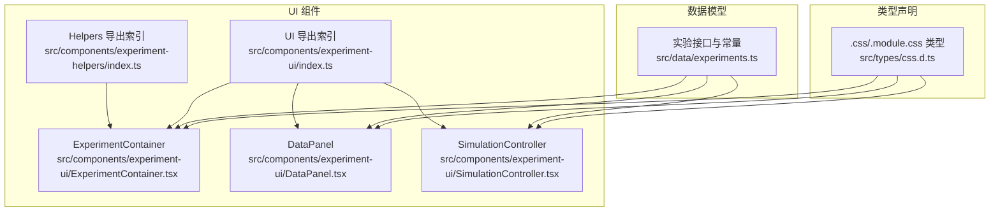
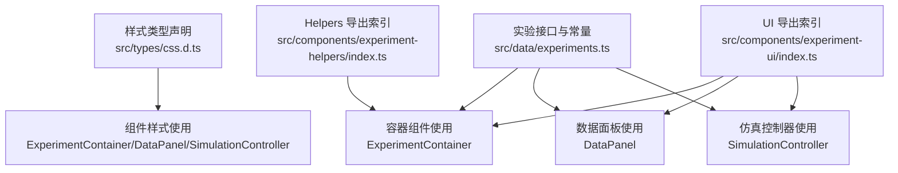
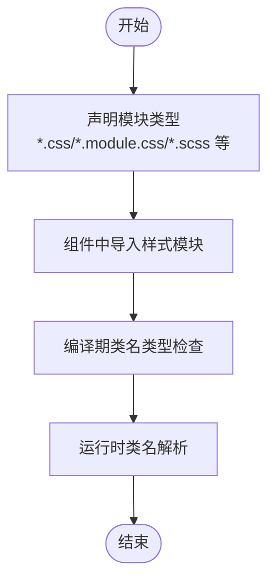
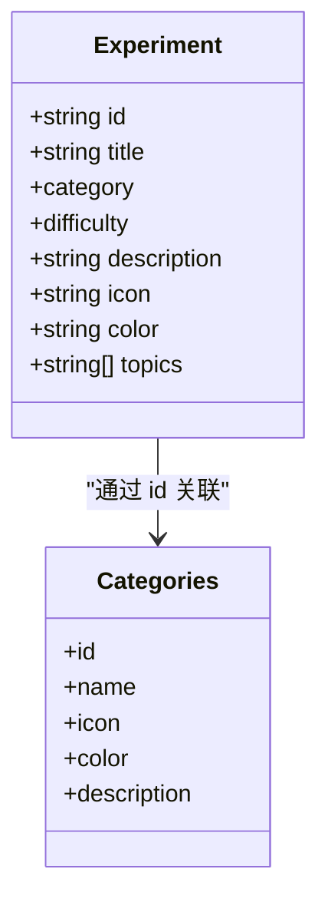
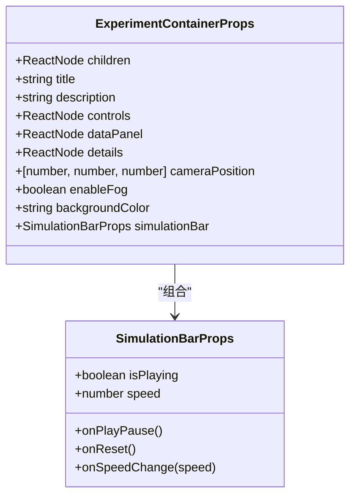
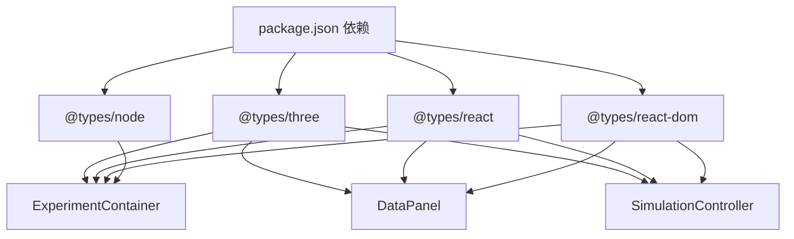

# 类型定义

<cite>
**本文引用的文件**
- [src/types/css.d.ts](file://src/types/css.d.ts)
- [src/data/experiments.ts](file://src/data/experiments.ts)
- [src/components/experiment-ui/ExperimentContainer.tsx](file://src/components/experiment-ui/ExperimentContainer.tsx)
- [src/components/experiment-ui/DataPanel.tsx](file://src/components/experiment-ui/DataPanel.tsx)
- [src/components/experiment-ui/SimulationController.tsx](file://src/components/experiment-ui/SimulationController.tsx)
- [src/components/experiment-ui/index.ts](file://src/components/experiment-ui/index.ts)
- [src/components/experiment-helpers/index.ts](file://src/components/experiment-helpers/index.ts)
- [package.json](file://package.json)
- [CONTRIBUTING.md](file://CONTRIBUTING.md)
</cite>

## 目录
1. [引言](#引言)
2. [项目结构](#项目结构)
3. [核心组件](#核心组件)
4. [架构总览](#架构总览)
5. [详细组件分析](#详细组件分析)
6. [依赖分析](#依赖分析)
7. [性能考虑](#性能考虑)
8. [故障排查指南](#故障排查指南)
9. [结论](#结论)
10. [附录](#附录)

## 引言
本文件系统性梳理 ScienceLab3D 的类型定义体系，覆盖以下方面：
- CSS 模块与样式资源的类型声明
- 实验元数据与分类的接口类型
- 实验页面容器与交互控件的 Props 类型
- 路由参数与页面约定的类型化实践
- 类型安全的重要性与实现方式
- 如何通过类型定义提升代码质量与开发体验
- 类型扩展与自定义方法
- 常见类型错误的排查与解决方案
- 最佳实践与设计模式

## 项目结构
本项目采用“按功能域分层”的组织方式，类型定义主要分布在如下位置：
- 样式类型：src/types/css.d.ts（为 CSS/SCSS 模块提供类型）
- 数据模型：src/data/experiments.ts（实验元数据与分类枚举）
- UI 组件类型：src/components/experiment-ui/*.tsx（容器、数据面板、仿真控制器等）
- 组件导出索引：src/components/experiment-ui/index.ts、src/components/experiment-helpers/index.ts（统一导出类型别名）



图表来源
- [src/types/css.d.ts:1-30](file://src/types/css.d.ts#L1-L30)
- [src/data/experiments.ts:1-492](file://src/data/experiments.ts#L1-L492)
- [src/components/experiment-ui/ExperimentContainer.tsx:42-53](file://src/components/experiment-ui/ExperimentContainer.tsx#L42-L53)
- [src/components/experiment-ui/DataPanel.tsx:5-11](file://src/components/experiment-ui/DataPanel.tsx#L5-L11)
- [src/components/experiment-ui/SimulationController.tsx:5-13](file://src/components/experiment-ui/SimulationController.tsx#L5-L13)
- [src/components/experiment-ui/index.ts:1-42](file://src/components/experiment-ui/index.ts#L1-L42)
- [src/components/experiment-helpers/index.ts:1-7](file://src/components/experiment-helpers/index.ts#L1-L7)

章节来源
- [src/types/css.d.ts:1-30](file://src/types/css.d.ts#L1-L30)
- [src/data/experiments.ts:1-492](file://src/data/experiments.ts#L1-L492)
- [src/components/experiment-ui/ExperimentContainer.tsx:42-53](file://src/components/experiment-ui/ExperimentContainer.tsx#L42-L53)
- [src/components/experiment-ui/DataPanel.tsx:5-11](file://src/components/experiment-ui/DataPanel.tsx#L5-L11)
- [src/components/experiment-ui/SimulationController.tsx:5-13](file://src/components/experiment-ui/SimulationController.tsx#L5-L13)
- [src/components/experiment-ui/index.ts:1-42](file://src/components/experiment-ui/index.ts#L1-L42)
- [src/components/experiment-helpers/index.ts:1-7](file://src/components/experiment-helpers/index.ts#L1-L7)

## 核心组件
本节聚焦于项目中关键的类型定义与使用场景。

- CSS 模块类型声明
  - 作用：为 *.css、*.module.css、*.scss、*.module.scss、*.sass、*.module.sass 提供模块化样式类名的类型推断，避免运行时拼写错误。
  - 影响范围：所有引入样式模块的组件与页面。
  - 使用建议：优先使用模块化样式，配合工具链生成稳定类名；非模块化样式用于全局重置或第三方库样式。

- 实验接口与枚举
  - 接口 Experiment：统一描述实验的标识、标题、类别、难度、描述、图标、颜色与主题标签。
  - 枚举与字面量联合：category 限定为物理/化学/生物/数学；difficulty 限定为入门/中级/高级。
  - 分类数组：categories 提供带 const 断言的枚举项，便于类型守卫与自动补全。
  - 价值：确保实验元数据的一致性与可维护性，减少配置错误。

- 容器与面板 Props 类型
  - ExperimentContainerProps：标题、描述、子节点、控制面板、数据面板、细节面板、相机初始位置、雾效开关、背景色、仿真栏 Props 等。
  - DataPanelProps：可见性控制、拖拽、折叠状态、初始位置等。
  - SimulationControllerProps：播放/暂停、重置、速度、时间显示、初始位置等。
  - 价值：约束组件间的数据契约，保证调用方传入的属性符合预期。

- 统一导出索引
  - UI 组件与 Helpers 的类型别名集中导出，便于上层组件按需导入类型，避免重复声明。

章节来源
- [src/types/css.d.ts:1-30](file://src/types/css.d.ts#L1-L30)
- [src/data/experiments.ts:1-492](file://src/data/experiments.ts#L1-L492)
- [src/components/experiment-ui/ExperimentContainer.tsx:42-53](file://src/components/experiment-ui/ExperimentContainer.tsx#L42-L53)
- [src/components/experiment-ui/DataPanel.tsx:5-11](file://src/components/experiment-ui/DataPanel.tsx#L5-L11)
- [src/components/experiment-ui/SimulationController.tsx:5-13](file://src/components/experiment-ui/SimulationController.tsx#L5-L13)
- [src/components/experiment-ui/index.ts:1-42](file://src/components/experiment-ui/index.ts#L1-L42)
- [src/components/experiment-helpers/index.ts:1-7](file://src/components/experiment-helpers/index.ts#L1-L7)

## 架构总览
下图展示了类型定义在系统中的分布与依赖关系，以及它们如何被组件消费。



图表来源
- [src/types/css.d.ts:1-30](file://src/types/css.d.ts#L1-L30)
- [src/data/experiments.ts:1-492](file://src/data/experiments.ts#L1-L492)
- [src/components/experiment-ui/ExperimentContainer.tsx:42-53](file://src/components/experiment-ui/ExperimentContainer.tsx#L42-L53)
- [src/components/experiment-ui/DataPanel.tsx:5-11](file://src/components/experiment-ui/DataPanel.tsx#L5-L11)
- [src/components/experiment-ui/SimulationController.tsx:5-13](file://src/components/experiment-ui/SimulationController.tsx#L5-L13)
- [src/components/experiment-ui/index.ts:1-42](file://src/components/experiment-ui/index.ts#L1-L42)
- [src/components/experiment-helpers/index.ts:1-7](file://src/components/experiment-helpers/index.ts#L1-L7)

## 详细组件分析

### CSS 模块类型声明
- 设计要点
  - 为不同后缀的样式文件提供统一的模块化类型映射，键名为字符串，值也为字符串，确保类名查找的安全性。
  - 非模块化样式保留默认导出，满足全局样式需求。
- 使用建议
  - 在 Next.js 中推荐使用 *.module.css 等模块化样式，以获得编译期类名校验与热更新稳定性。
  - 对于第三方库样式或全局 reset，使用非模块化样式导入。



图表来源
- [src/types/css.d.ts:1-30](file://src/types/css.d.ts#L1-L30)

章节来源
- [src/types/css.d.ts:1-30](file://src/types/css.d.ts#L1-L30)

### 实验接口与分类类型
- 设计要点
  - Experiment 接口严格约束实验元数据字段，category 与 difficulty 使用字面量联合类型，防止无效值进入数据层。
  - categories 使用 const 断言，使枚举项具备精确类型，利于后续过滤与渲染逻辑的类型安全。
- 使用建议
  - 新增实验时，必须在 experiments.ts 中补充完整字段，借助类型系统尽早发现遗漏。
  - 渲染侧（如列表页、详情页）应基于 Experiment 接口进行解构与校验，避免直接使用 any 或不安全的动态访问。



图表来源
- [src/data/experiments.ts:1-492](file://src/data/experiments.ts#L1-L492)

章节来源
- [src/data/experiments.ts:1-492](file://src/data/experiments.ts#L1-L492)

### 容器组件类型：ExperimentContainer
- 设计要点
  - ExperimentContainerProps 将容器的布局、交互与外观参数显式化，包括标题、描述、子节点、控制面板、数据面板、细节面板、相机位置、雾效、背景色与仿真栏 Props。
  - 仿真栏 Props（SimulationBarProps）独立定义，便于复用与组合。
- 使用建议
  - 上层页面在传递 props 时应遵循接口定义，避免遗漏或多余字段。
  - 通过可选参数与默认值处理设备差异（如移动端相机 FOV、缩放速度等）。



图表来源
- [src/components/experiment-ui/ExperimentContainer.tsx:34-53](file://src/components/experiment-ui/ExperimentContainer.tsx#L34-L53)

章节来源
- [src/components/experiment-ui/ExperimentContainer.tsx:42-53](file://src/components/experiment-ui/ExperimentContainer.tsx#L42-L53)

### 数据面板类型：DataPanel
- 设计要点
  - DataPanelProps 明确了面板的可见性控制、拖拽行为、折叠状态与初始位置等参数，保证组件行为的可预测性。
  - 支持受控与非受控两种可见性模式，增强复用灵活性。
- 使用建议
  - 在需要多面板共存的场景，优先使用受控可见性，避免状态竞争。
  - 注意拖拽边界计算与触摸事件兼容，确保在移动设备上的可用性。

```mermaid
classDiagram
class DataPanelProps {
+ReactNode children
+boolean isVisible
+onToggle()
+{x : number,y : number} initialPosition
+boolean defaultCollapsed
}
```

图表来源
- [src/components/experiment-ui/DataPanel.tsx:5-11](file://src/components/experiment-ui/DataPanel.tsx#L5-L11)

章节来源
- [src/components/experiment-ui/DataPanel.tsx:5-11](file://src/components/experiment-ui/DataPanel.tsx#L5-L11)

### 仿真控制器类型：SimulationController
- 设计要点
  - SimulationControllerProps 将播放/暂停、重置、速度调节、时间显示等能力抽象为清晰的接口，便于在不同实验中复用。
  - 内部实现对拖拽、触摸与视口边界进行了适配，保证跨设备一致性。
- 使用建议
  - 速度范围与步进值应在业务层统一约定，避免出现不可达或不合理的值。
  - 时间格式化函数可抽取为纯函数，便于测试与复用。

```mermaid
classDiagram
class SimulationControllerProps {
+boolean isPlaying
+onPlayPause()
+onReset()
+number speed
+onSpeedChange(speed)
+number timeElapsed
+{x : number,y : number} initialPosition
}
```

图表来源
- [src/components/experiment-ui/SimulationController.tsx:5-13](file://src/components/experiment-ui/SimulationController.tsx#L5-L13)

章节来源
- [src/components/experiment-ui/SimulationController.tsx:5-13](file://src/components/experiment-ui/SimulationController.tsx#L5-L13)

### 路由参数与页面约定
- 页面路径与参数
  - 实验详情页路径约定为 /experiments/[id]/details，其中 [id] 为实验唯一标识符。
  - 该约定与 experiments.ts 中的 Experiment.id 字段保持一致，确保运行时导航与静态路由的类型一致性。
- 类型化建议
  - 在 Next.js App Router 中，可通过类型化的 params 来约束路由参数，例如将 id 限定为 Experiment['id'] 的字面量联合类型，从而在构建期捕获无效 id。
  - 对于动态路由，建议在页面组件中显式声明 params 类型，结合实验数据源进行运行时校验。

章节来源
- [src/data/experiments.ts:1-492](file://src/data/experiments.ts#L1-L492)
- [CONTRIBUTING.md:65-115](file://CONTRIBUTING.md#L65-L115)

## 依赖分析
- 外部类型依赖
  - @types/three：为 Three.js 场景与控件提供类型支持，保障 3D 相关 API 的类型安全。
  - @types/react、@types/react-dom：为 React 组件与 Hooks 提供类型支持。
  - @types/node：为 Node 环境变量与构建脚本提供类型支持。
- 内部类型依赖
  - CSS 模块类型声明被所有组件共享，形成统一的样式类型基础。
  - 实验接口与分类类型被容器与面板组件消费，确保数据层与 UI 层的一致性。



图表来源
- [package.json:10-32](file://package.json#L10-L32)
- [src/components/experiment-ui/ExperimentContainer.tsx:1-10](file://src/components/experiment-ui/ExperimentContainer.tsx#L1-L10)
- [src/components/experiment-ui/DataPanel.tsx:1-5](file://src/components/experiment-ui/DataPanel.tsx#L1-L5)
- [src/components/experiment-ui/SimulationController.tsx:1-5](file://src/components/experiment-ui/SimulationController.tsx#L1-L5)

章节来源
- [package.json:10-32](file://package.json#L10-L32)

## 性能考虑
- 类型检查的收益
  - 编译期错误拦截可显著降低运行时异常率，减少调试成本与回归风险。
  - 精确的 Props 类型有助于 Tree Shaking 与打包优化，避免无用代码进入产物。
- 运行时开销
  - 类型声明本身不引入运行时开销；但在复杂泛型与条件类型较多时，可能影响编译速度。建议在大型项目中启用增量编译与合适的 tsconfig 选项。
- UI 组件性能
  - 使用受控状态与必要的 memo 化策略，避免不必要的重渲染。
  - 在移动端启用更保守的渲染参数（如抗锯齿关闭、DPR 降低），以平衡性能与画质。

## 故障排查指南
- 常见类型错误与解决
  - “无法找到模块”或样式类名未定义
    - 症状：导入样式模块时报错或类名提示缺失。
    - 解决：确认已正确声明 *.module.css 等模块类型；检查文件后缀是否匹配。
    - 参考：[src/types/css.d.ts:1-30](file://src/types/css.d.ts#L1-L30)
  - 实验元数据字段缺失或类型不符
    - 症状：编译报错或运行时访问不到某些字段。
    - 解决：在 experiments.ts 中补齐 Experiment 接口字段；确保 category 与 difficulty 使用允许的字面量。
    - 参考：[src/data/experiments.ts:1-492](file://src/data/experiments.ts#L1-L492)
  - Props 传参不匹配
    - 症状：组件接收不到期望的回调或数值范围不合理。
    - 解决：核对 ExperimentContainerProps、DataPanelProps、SimulationControllerProps 的字段与默认值；必要时添加运行时校验。
    - 参考：[src/components/experiment-ui/ExperimentContainer.tsx:42-53](file://src/components/experiment-ui/ExperimentContainer.tsx#L42-L53), [src/components/experiment-ui/DataPanel.tsx:5-11](file://src/components/experiment-ui/DataPanel.tsx#L5-L11), [src/components/experiment-ui/SimulationController.tsx:5-13](file://src/components/experiment-ui/SimulationController.tsx#L5-L13)
  - 路由参数类型不一致
    - 症状：导航到 /experiments/[id]/details 时类型不匹配或运行时找不到实验。
    - 解决：确保 [id] 与 Experiment.id 的取值集合一致；在页面组件中对 params 进行类型断言与存在性校验。
    - 参考：[src/data/experiments.ts:1-492](file://src/data/experiments.ts#L1-L492), [CONTRIBUTING.md:65-115](file://CONTRIBUTING.md#L65-L115)

## 结论
ScienceLab3D 的类型定义体系以“明确契约、统一入口、最小暴露”为核心原则：
- 通过 CSS 模块类型声明与实验接口，从源头保证样式与数据的类型安全；
- 通过容器与面板的 Props 类型，约束组件间的数据流与行为边界；
- 通过路由参数与页面约定的类型化，降低导航与渲染层面的不确定性。

这些实践显著提升了代码质量与开发体验，建议在新增组件与页面时延续现有模式，逐步完善类型覆盖。

## 附录
- 类型扩展与自定义
  - 新增实验：在 experiments.ts 中追加 Experiment 记录，并同步更新路由与页面。
  - 扩展容器能力：在 ExperimentContainerProps 中增加新字段，并在内部组件中使用。
  - 自定义样式：在 src/types/css.d.ts 中补充新的样式模块类型，确保工具链识别。
- 最佳实践与设计模式
  - 使用字面量联合类型限制枚举值，避免魔法字符串。
  - 将可复用的 Props 抽象为独立接口，便于组合与测试。
  - 利用 const 断言的枚举项，提升类型守卫与自动补全体验。
  - 在页面层对路由参数进行类型断言与运行时校验，兼顾类型安全与容错。