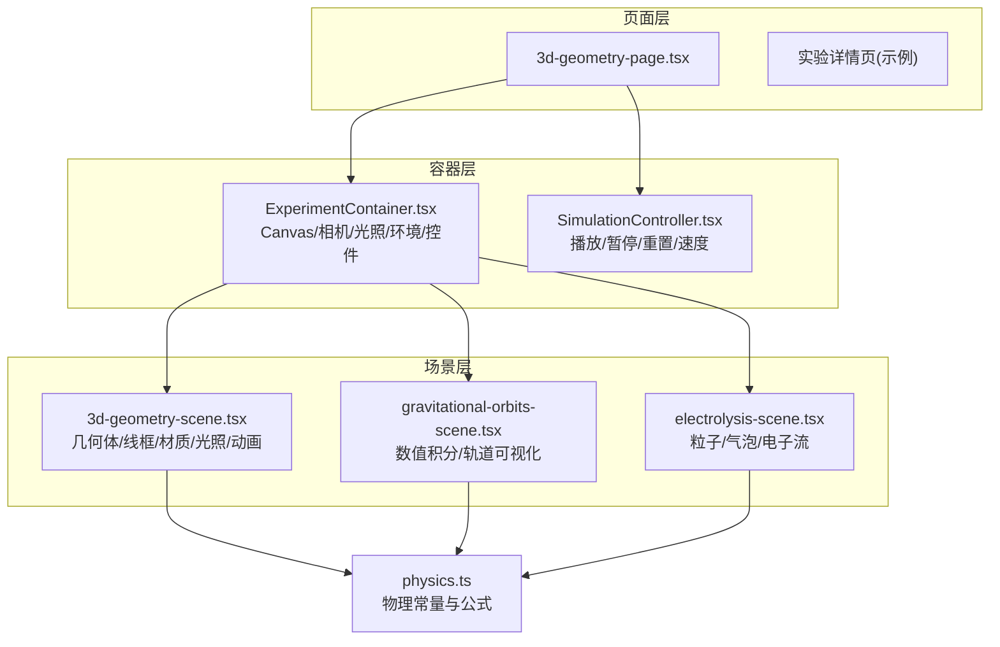
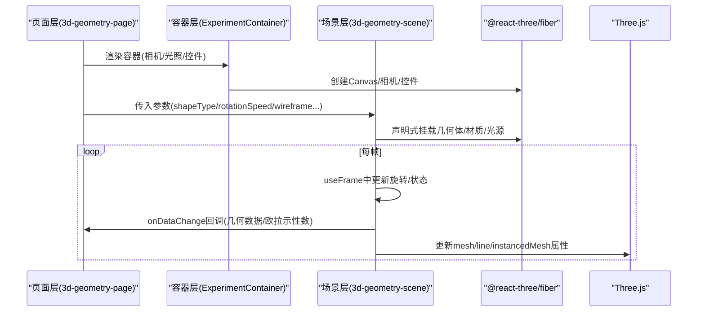
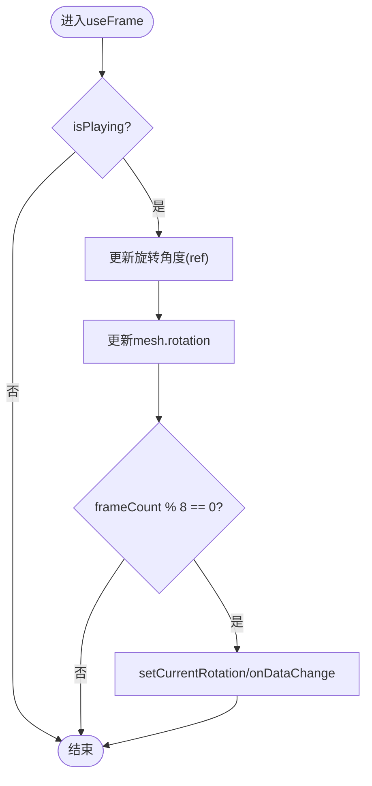
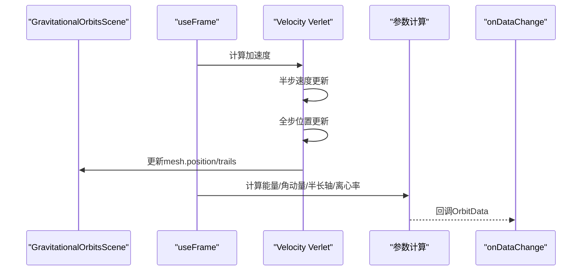
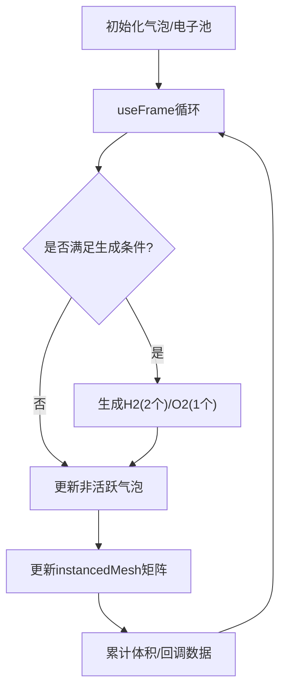
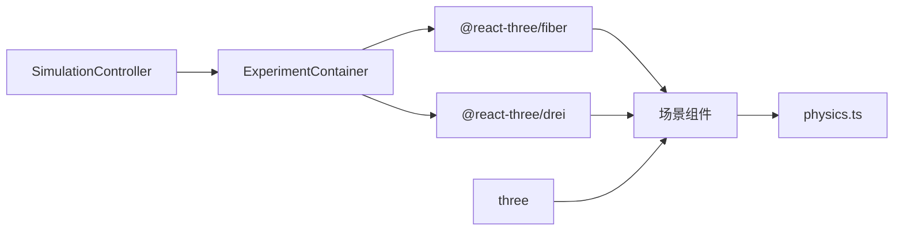

# 实验场景层

<cite>
**本文引用的文件**
- [3d-geometry-scene.tsx](file://src/experiments/3d-geometry-scene.tsx)
- [3d-geometry-page.tsx](file://src/experiments/3d-geometry-page.tsx)
- [gravitational-orbits-scene.tsx](file://src/experiments/gravitational-orbits-scene.tsx)
- [electrolysis-scene.tsx](file://src/experiments/electrolysis-scene.tsx)
- [physics.ts](file://src/utils/physics.ts)
- [ExperimentContainer.tsx](file://src/components/experiment-ui/ExperimentContainer.tsx)
- [SimulationController.tsx](file://src/components/experiment-ui/SimulationController.tsx)
- [experiments.ts](file://src/data/experiments.ts)
- [layout.tsx](file://src/app/layout.tsx)
- [package.json](file://package.json)
</cite>

## 目录
1. [引言](#引言)
2. [项目结构](#项目结构)
3. [核心组件](#核心组件)
4. [架构总览](#架构总览)
5. [详细组件分析](#详细组件分析)
6. [依赖关系分析](#依赖关系分析)
7. [性能考量](#性能考量)
8. [故障排查指南](#故障排查指南)
9. [结论](#结论)
10. [附录](#附录)

## 引言
本文件面向ScienceLab3D的“实验场景层”，系统性梳理3D场景组件的设计架构与实现细节，涵盖Three.js场景管理、相机控制、渲染管线、物理引擎集成（含数值积分与可视化）、3D对象创建与材质、光照配置、动画系统、场景状态管理与对象生命周期、资源优化策略，以及场景层与页面层的数据通信机制。同时提供场景开发的技术要点与最佳实践，帮助开发者高效扩展新的实验场景。

## 项目结构
实验场景层采用“页面-容器-场景组件”的分层设计：
- 页面层：负责参数控制、UI交互与数据面板展示，通过props向场景组件传递参数。
- 容器层：封装Three.js画布、相机、光照、环境与交互控件，统一渲染上下文。
- 场景组件：基于@react-three/fiber与@react-three/drei构建具体实验的几何体、材质、动画与物理模拟。

图表来源
- [3d-geometry-page.tsx:145-189](file://src/experiments/3d-geometry-page.tsx#L145-L189)
- [ExperimentContainer.tsx:137-209](file://src/components/experiment-ui/ExperimentContainer.tsx#L137-L209)
- [3d-geometry-scene.tsx:155-240](file://src/experiments/3d-geometry-scene.tsx#L155-L240)
- [gravitational-orbits-scene.tsx:296-461](file://src/experiments/gravitational-orbits-scene.tsx#L296-L461)
- [electrolysis-scene.tsx:46-200](file://src/experiments/electrolysis-scene.tsx#L46-L200)
- [physics.ts:10-22](file://src/utils/physics.ts#L10-L22)

章节来源
- [3d-geometry-page.tsx:1-190](file://src/experiments/3d-geometry-page.tsx#L1-L190)
- [ExperimentContainer.tsx:1-374](file://src/components/experiment-ui/ExperimentContainer.tsx#L1-L374)
- [3d-geometry-scene.tsx:1-243](file://src/experiments/3d-geometry-scene.tsx#L1-L243)
- [gravitational-orbits-scene.tsx:1-465](file://src/experiments/gravitational-orbits-scene.tsx#L1-L465)
- [electrolysis-scene.tsx:1-566](file://src/experiments/electrolysis-scene.tsx#L1-L566)
- [physics.ts:1-687](file://src/utils/physics.ts#L1-L687)

## 核心组件
- 场景组件（Scene Component）
  - 使用useFrame进行每帧更新，维护物理状态在refs中以避免不必要的重渲染。
  - 通过props接收运行参数（如旋转速度、显示选项等），并通过onDataChange回调向页面层同步数据。
  - 示例：3D几何场景、引力轨道场景、电解场景等。
- 容器组件（ExperimentContainer）
  - 提供Canvas、PerspectiveCamera、OrbitControls、环境光、方向光、半球光、点光源、雾效与环境贴图。
  - 自适应窗口尺寸与设备像素比，处理移动端与桌面端的交互差异。
- 模拟控制器（SimulationController）
  - 可拖拽的浮动控制条，支持播放/暂停、重置、速度调节与时间显示。
- 物理工具库（physics.ts）
  - 提供物理常量与常用公式（如重力、抛物运动、弹簧振子、气体定律、波动、光学、轨道力学等）。

章节来源
- [3d-geometry-scene.tsx:30-153](file://src/experiments/3d-geometry-scene.tsx#L30-L153)
- [ExperimentContainer.tsx:55-209](file://src/components/experiment-ui/ExperimentContainer.tsx#L55-L209)
- [SimulationController.tsx:27-225](file://src/components/experiment-ui/SimulationController.tsx#L27-L225)
- [physics.ts:10-687](file://src/utils/physics.ts#L10-L687)

## 架构总览
实验场景层遵循“声明式渲染 + 命令式更新”的混合模式：
- 声明式：场景组件通过React Three Fiber声明式地挂载几何体、材质与光源。
- 命令式：useFrame中执行物理计算与状态更新，直接修改Three.js对象属性或实例矩阵，减少React重渲染开销。
- 数据流：页面层通过props传参，场景层通过onDataChange回调回传实时数据；容器层统一渲染上下文与交互。

图表来源
- [3d-geometry-page.tsx:145-189](file://src/experiments/3d-geometry-page.tsx#L145-L189)
- [ExperimentContainer.tsx:137-209](file://src/components/experiment-ui/ExperimentContainer.tsx#L137-L209)
- [3d-geometry-scene.tsx:131-153](file://src/experiments/3d-geometry-scene.tsx#L131-L153)

## 详细组件分析

### 3D几何场景（3D Geometry Scene）
- 功能概述
  - 支持五种柏拉图立体（四面体、立方体、八面体、十二面体、二十面体）的可视化。
  - 可切换线框模式、顶点高亮、边线显示；支持旋转与实时数据上报。
- 关键实现
  - 几何体生成：根据shapeType选择对应Three.js几何体构造函数。
  - 边线生成：从索引缓冲区提取三角面的三边，去重后形成线段点集。
  - 顶点高亮：在顶点位置渲染小球与发光效果。
  - 材质与光照：使用标准材质与多光源增强视觉层次。
  - 数据上报：每8帧计算一次当前旋转角与欧拉示性数，通过onDataChange回调。
- 性能优化
  - 使用useMemo缓存几何数据与边线点集，避免重复计算。
  - 将旋转状态保存在ref中，仅在必要时更新React状态。

图表来源
- [3d-geometry-scene.tsx:131-153](file://src/experiments/3d-geometry-scene.tsx#L131-L153)

章节来源
- [3d-geometry-scene.tsx:1-243](file://src/experiments/3d-geometry-scene.tsx#L1-L243)
- [3d-geometry-page.tsx:1-190](file://src/experiments/3d-geometry-page.tsx#L1-L190)

### 引力轨道场景（Gravitational Orbits Scene）
- 功能概述
  - 使用Velocity Verlet数值积分求解两体或多体轨道，可视化轨道轨迹、速度/力矢量、距离标记与参考圆轨道。
  - 计算轨道类型（圆/椭圆/抛物/双曲线）、半长轴、离心率、逃逸速度、能量与角动量等参数。
- 关键实现
  - 状态存储：所有物理状态保存在ref中，避免每次渲染。
  - 数值积分：限制dt上限保证稳定性，半步速度更新与全步位置更新。
  - 轨迹追踪：按固定间隔更新trail点集，限制最大长度防止内存膨胀。
  - 参数计算：基于位置与速度计算能量、角动量、半长轴与离心率，推导轨道类型。
  - 可视化：速度矢量与力矢量使用圆锥与圆柱几何体表示，颜色区分。
- 性能优化
  - 采样节流：轨道数据与轨迹更新按帧间隔进行。
  - 向量计算复用：使用临时向量避免频繁分配。

图表来源
- [gravitational-orbits-scene.tsx:132-286](file://src/experiments/gravitational-orbits-scene.tsx#L132-L286)

章节来源
- [gravitational-orbits-scene.tsx:1-465](file://src/experiments/gravitational-orbits-scene.tsx#L1-L465)
- [physics.ts:456-573](file://src/utils/physics.ts#L456-L573)

### 电解场景（Electrolysis Scene）
- 功能概述
  - 模拟水的电解过程：阴极产生氢气泡、阳极产生氧气泡，比例约为2:1；支持不同电解质（纯水、NaCl、CuSO4）。
  - 可视化电子流动、气泡生成与上升、收集管中的气体体积统计。
- 关键实现
  - 对象池：预先创建气泡与电子实例，通过instancedMesh批量渲染，提高性能。
  - 气泡生命周期：按电压驱动的速率生成，赋予随机初始速度与微扰，超过阈值后回收。
  - 数据统计：累计H2与O2体积，通过onDataChange回调向页面层同步。
- 性能优化
  - instancedMesh减少绘制批次；仅在活跃气泡上更新矩阵。
  - 通过dummy对象复用变换矩阵，降低对象创建成本。

图表来源
- [electrolysis-scene.tsx:109-200](file://src/experiments/electrolysis-scene.tsx#L109-L200)

章节来源
- [electrolysis-scene.tsx:1-566](file://src/experiments/electrolysis-scene.tsx#L1-L566)

### 容器与相机控制（ExperimentContainer）
- 功能概述
  - 统一的Three.js画布、相机与控件：透视相机、轨道控制器、环境光、方向光、半球光、点光源、雾效与环境贴图。
  - 响应式布局：监听窗口变化与ResizeObserver，动态调整画布尺寸与像素比。
  - 移动端适配：触摸手势、阻尼与缩放参数差异化。
- 关键实现
  - CanvasResizeHandler：在窗口大小变化时同步GL尺寸与投影矩阵。
  - OrbitControls：启用阻尼、限制距离与极角，移动端与桌面端参数分离。
  - 灯光体系：环境光、方向光投射阴影、半球光提升底部亮度、点光源营造氛围。
- 性能优化
  - dpr按设备能力动态设置，移动端适度降低以提升帧率。
  - 抗锯齿在移动端关闭，减少GPU压力。

章节来源
- [ExperimentContainer.tsx:1-374](file://src/components/experiment-ui/ExperimentContainer.tsx#L1-L374)

### 模拟控制器（SimulationController）
- 功能概述
  - 可拖拽的浮动控制条，包含播放/暂停、重置、速度调节与可选的时间显示。
  - 移动端友好：触摸拖拽、边界约束、自适应宽度。
- 关键实现
  - 鼠标/触摸事件：按下时记录偏移，移动时更新位置并约束在视口内。
  - 速度范围：0.1x到3x，步进0.1。
  - 时间格式化：分钟:秒.百分秒。
- 性能优化
  - 仅在拖拽时注册全局事件，释放后移除监听，避免内存泄漏。

章节来源
- [SimulationController.tsx:1-228](file://src/components/experiment-ui/SimulationController.tsx#L1-L228)

## 依赖关系分析
- 运行时依赖
  - @react-three/fiber：Three.js的React渲染器，提供useFrame等钩子。
  - @react-three/drei：常用Three.js辅助组件（如Line、Text、OrbitControls、Environment等）。
  - three：核心3D引擎。
  - lucide-react：图标库。
- 开发依赖
  - tailwindcss、typescript等用于样式与类型安全。
- 内部模块
  - physics.ts：跨场景共享的物理常量与公式。
  - ExperimentContainer与SimulationController：通用UI容器与控制器。

图表来源
- [package.json:10-21](file://package.json#L10-L21)
- [3d-geometry-scene.tsx:3-6](file://src/experiments/3d-geometry-scene.tsx#L3-L6)
- [ExperimentContainer.tsx:5-6](file://src/components/experiment-ui/ExperimentContainer.tsx#L5-L6)
- [SimulationController.tsx:3-3](file://src/components/experiment-ui/SimulationController.tsx#L3-L3)

章节来源
- [package.json:1-37](file://package.json#L1-L37)

## 性能考量
- 渲染性能
  - 使用useFrame进行命令式更新，避免在渲染阶段做大量计算。
  - instancedMesh用于大规模粒子/气泡，显著降低绘制调用次数。
  - 采样节流：轨道数据与轨迹更新按固定帧间隔进行。
  - dpr与抗锯齿：移动端适度降低以换取帧率。
- 内存管理
  - 对象池：预分配气泡与电子数组，复用而非频繁创建销毁。
  - 轨迹队列：限制最大长度并使用shift丢弃旧点。
  - 事件监听：拖拽结束后及时移除全局事件监听。
- 交互体验
  - OrbitControls阻尼与移动端参数差异化，确保顺滑操控。
  - ResizeObserver与window.resize联动，避免闪烁与布局抖动。

## 故障排查指南
- 场景不渲染
  - 检查ExperimentContainer是否完成尺寸检测与Canvas初始化。
  - 确认useFrame未被错误地在服务端执行（客户端组件）。
- 性能骤降
  - 检查是否有过多实例或未使用instancedMesh。
  - 确认未在渲染阶段进行昂贵计算，改用useMemo/useRef。
- 交互异常
  - 移动端触摸手势失效：检查OrbitControls的touches配置与设备检测逻辑。
  - 控制条拖拽越界：确认边界约束与panel尺寸计算正确。
- 数据不同步
  - 确认onDataChange回调在正确时机触发（如每8帧）。
  - 检查resetTrigger是否正确重置物理状态与轨迹。

章节来源
- [ExperimentContainer.tsx:78-133](file://src/components/experiment-ui/ExperimentContainer.tsx#L78-L133)
- [SimulationController.tsx:75-144](file://src/components/experiment-ui/SimulationController.tsx#L75-L144)
- [3d-geometry-scene.tsx:121-153](file://src/experiments/3d-geometry-scene.tsx#L121-L153)
- [gravitational-orbits-scene.tsx:115-130](file://src/experiments/gravitational-orbits-scene.tsx#L115-L130)

## 结论
实验场景层通过清晰的分层设计与高效的渲染/物理实现，提供了高质量的3D科学可视化体验。Three.js与React Three Fiber的结合使得声明式与命令式更新互补，既能保持代码可读性，又能获得流畅的性能表现。建议在新场景开发中遵循现有模式：参数由页面层传入，状态在场景组件中用ref管理，数据通过回调回传，复杂物理计算尽量集中在useFrame中并配合节流与对象池优化。

## 附录
- 场景元数据与分类
  - experiments.ts定义了40+实验的元信息，涵盖物理、化学、生物与数学四大类，便于导航与搜索。
- 站点布局与SEO
  - layout.tsx统一了站点元数据、OpenGraph与Twitter卡片配置，提升搜索引擎可见性。

章节来源
- [experiments.ts:1-492](file://src/data/experiments.ts#L1-L492)
- [layout.tsx:1-204](file://src/app/layout.tsx#L1-L204)