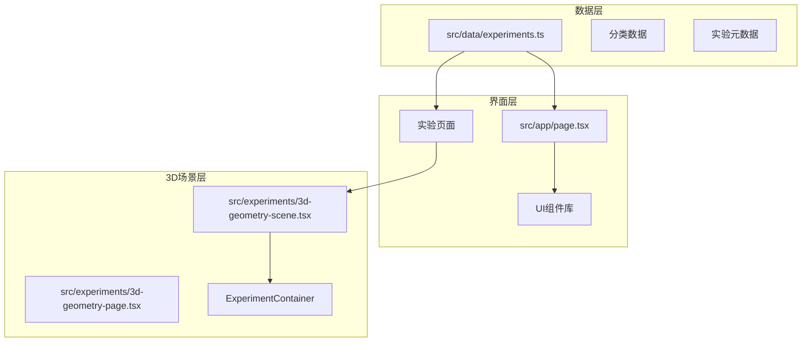
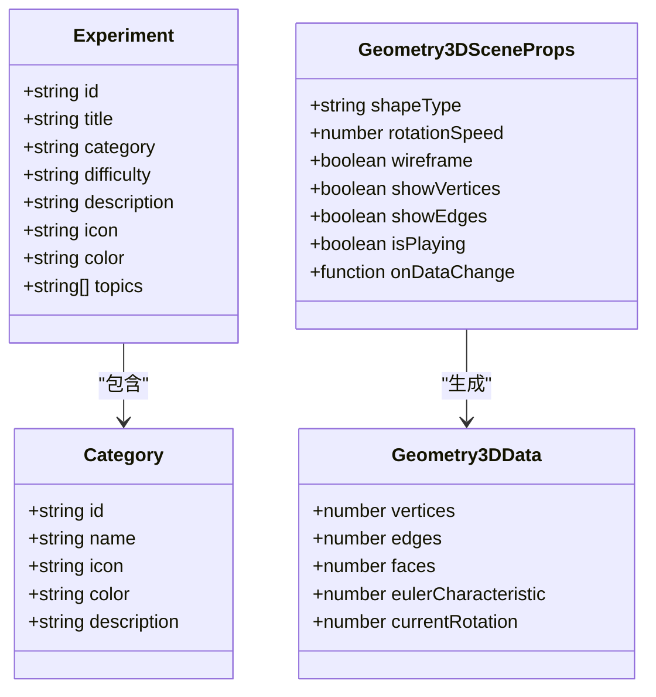
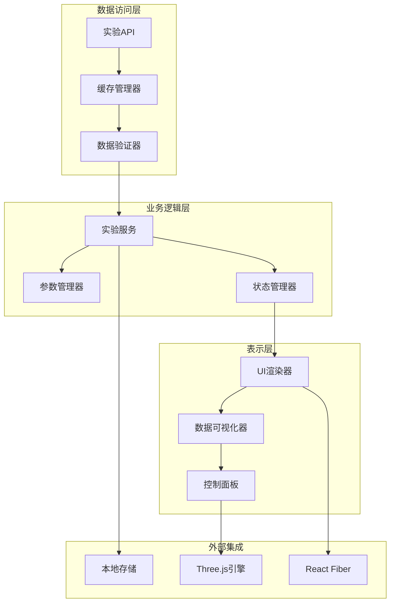
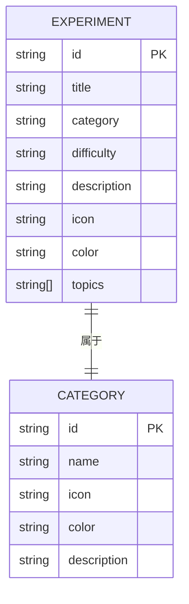
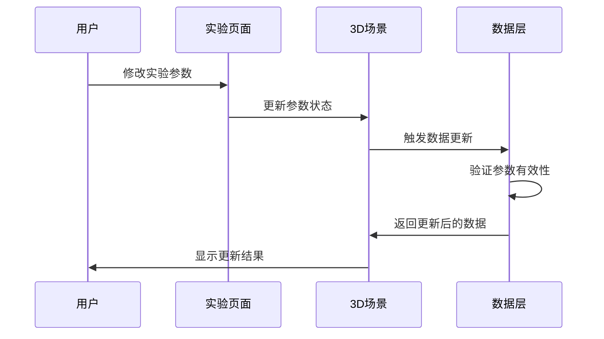
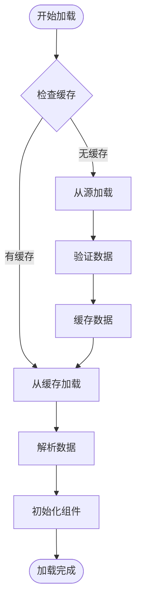
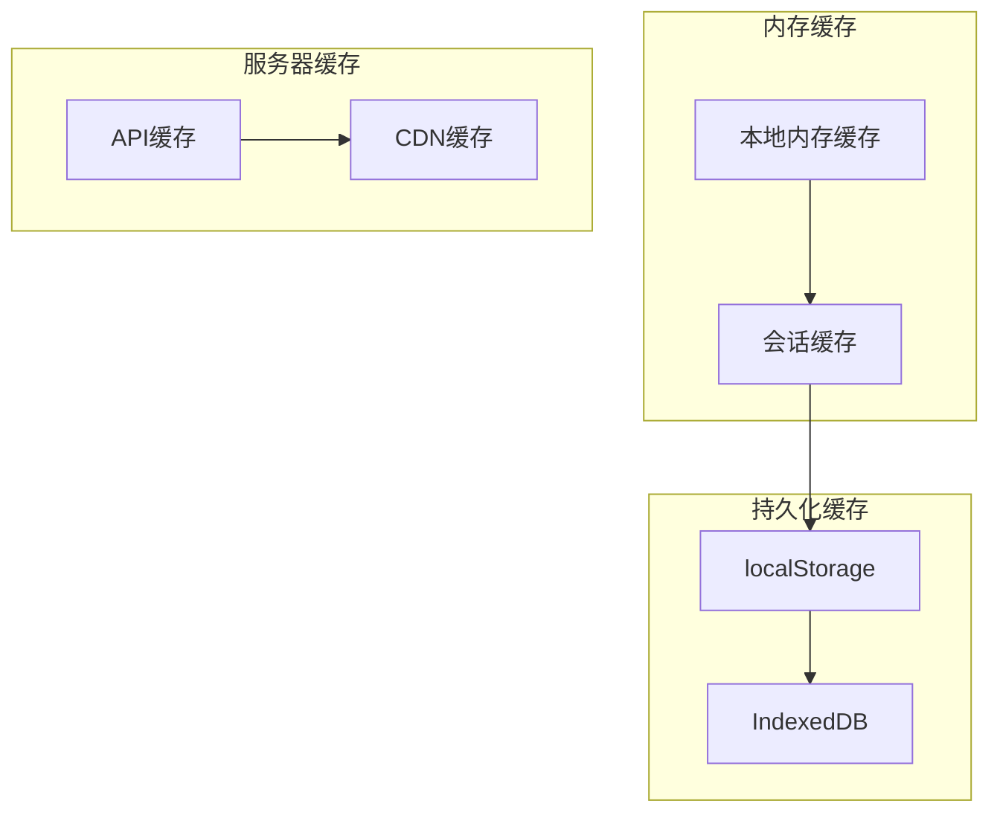
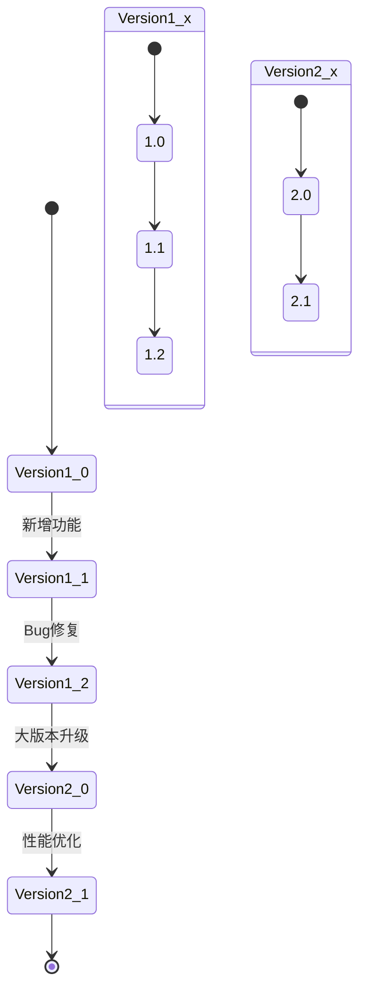
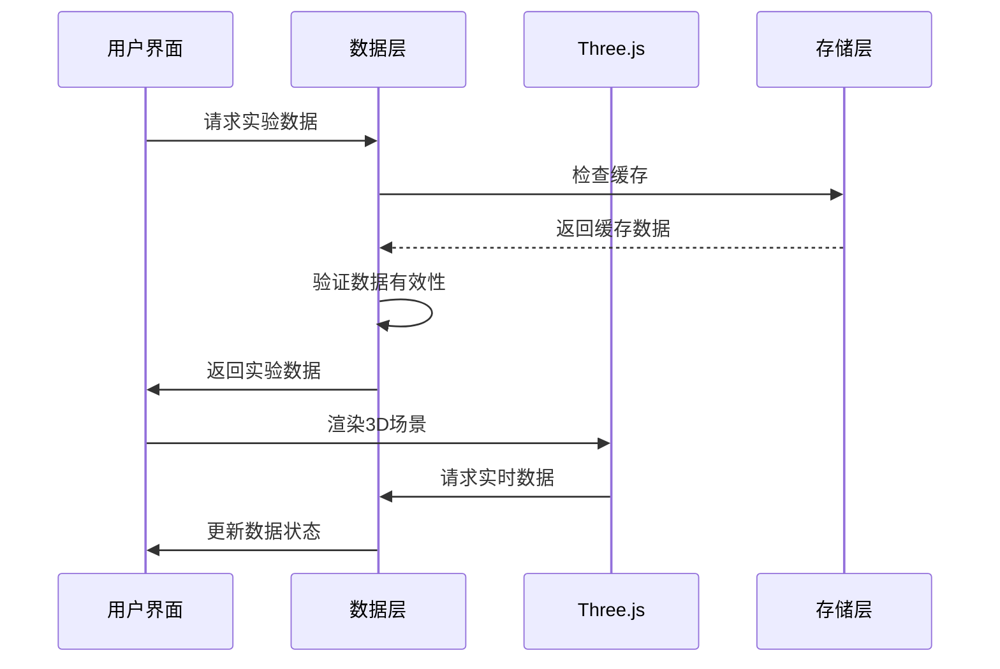
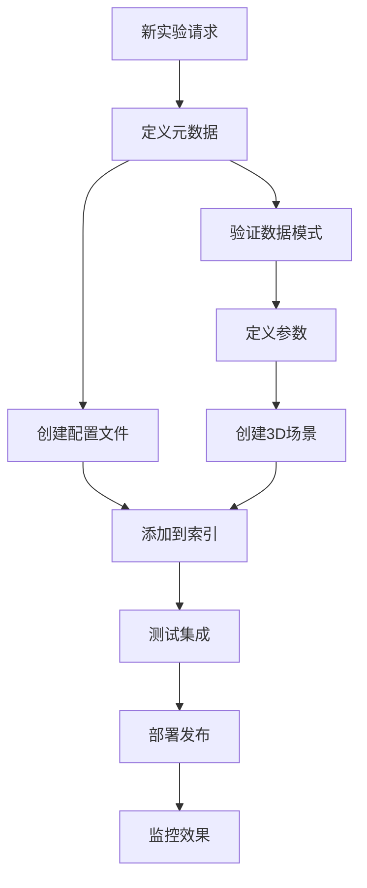

# 实验数据层

<cite>
**本文档引用的文件**
- [src/data/experiments.ts](file://src/data/experiments.ts)
- [src/app/page.tsx](file://src/app/page.tsx)
- [src/experiments/3d-geometry-page.tsx](file://src/experiments/3d-geometry-page.tsx)
- [src/experiments/3d-geometry-scene.tsx](file://src/experiments/3d-geometry-scene.tsx)
- [src/components/experiment-ui/ExperimentContainer.tsx](file://src/components/experiment-ui/ExperimentContainer.tsx)
- [src/components/experiment-ui/DataPanel.tsx](file://src/components/experiment-ui/DataPanel.tsx)
- [src/components/experiment-ui/SimulationController.tsx](file://src/components/experiment-ui/SimulationController.tsx)
- [src/components/experiment-ui/index.ts](file://src/components/experiment-ui/index.ts)
- [package.json](file://package.json)
- [tsconfig.json](file://tsconfig.json)
</cite>

## 目录
1. [引言](#引言)
2. [项目结构](#项目结构)
3. [核心组件](#核心组件)
4. [架构概览](#架构概览)
5. [详细组件分析](#详细组件分析)
6. [依赖关系分析](#依赖关系分析)
7. [性能考虑](#性能考虑)
8. [故障排除指南](#故障排除指南)
9. [结论](#结论)
10. [附录](#附录)

## 引言

ScienceLab3D是一个基于React和Three.js的3D科学实验教育平台，包含40多个交互式实验。实验数据层是整个应用的核心，负责管理所有实验的元数据、参数定义和视觉属性。本文档深入分析实验数据层的设计架构，包括数据结构、类型系统、动态加载机制、缓存策略和版本管理。

## 项目结构

项目采用模块化架构，实验数据层主要位于`src/data`目录下，通过TypeScript接口定义实验的完整数据模型：



**图表来源**
- [src/data/experiments.ts:1-492](file://src/data/experiments.ts#L1-L492)
- [src/app/page.tsx:1-676](file://src/app/page.tsx#L1-L676)

**章节来源**
- [src/data/experiments.ts:1-492](file://src/data/experiments.ts#L1-L492)
- [package.json:1-37](file://package.json#L1-L37)
- [tsconfig.json:1-22](file://tsconfig.json#L1-L22)

## 核心组件

### 实验数据模型

实验数据层的核心是统一的实验数据模型，通过TypeScript接口确保类型安全：



**图表来源**
- [src/data/experiments.ts:1-10](file://src/data/experiments.ts#L1-L10)
- [src/experiments/3d-geometry-scene.tsx:8-24](file://src/experiments/3d-geometry-scene.tsx#L8-L24)

### 数据验证规则

实验数据层实现了多层次的数据验证机制：

1. **编译时验证**：通过TypeScript接口确保数据结构的完整性
2. **运行时验证**：在组件中进行数据有效性检查
3. **边界条件验证**：对数值参数进行范围限制

**章节来源**
- [src/data/experiments.ts:12-460](file://src/data/experiments.ts#L12-L460)
- [src/experiments/3d-geometry-scene.tsx:48-58](file://src/experiments/3d-geometry-scene.tsx#L48-L58)

## 架构概览

实验数据层采用分层架构设计，确保各层之间的职责分离和松耦合：



**图表来源**
- [src/app/page.tsx:330-350](file://src/app/page.tsx#L330-L350)
- [src/experiments/3d-geometry-page.tsx:18-40](file://src/experiments/3d-geometry-page.tsx#L18-L40)

## 详细组件分析

### 实验配置管理系统

实验配置管理系统负责管理所有实验的元数据和参数设置：

#### 实验元数据结构

每个实验都包含完整的元数据信息，用于界面展示和用户交互：



**图表来源**
- [src/data/experiments.ts:1-10](file://src/data/experiments.ts#L1-L10)
- [src/data/experiments.ts:462-491](file://src/data/experiments.ts#L462-L491)

#### 参数定义系统

实验参数定义系统提供了灵活的参数配置机制：



**图表来源**
- [src/experiments/3d-geometry-page.tsx:42-120](file://src/experiments/3d-geometry-page.tsx#L42-L120)
- [src/experiments/3d-geometry-scene.tsx:121-153](file://src/experiments/3d-geometry-scene.tsx#L121-L153)

**章节来源**
- [src/data/experiments.ts:12-460](file://src/data/experiments.ts#L12-L460)
- [src/experiments/3d-geometry-page.tsx:18-40](file://src/experiments/3d-geometry-page.tsx#L18-L40)

### 动态加载机制

实验数据层实现了高效的动态加载机制，支持按需加载和懒加载：

#### 实验数据加载流程



**图表来源**
- [src/app/page.tsx:330-350](file://src/app/page.tsx#L330-L350)
- [src/app/page.tsx:352-361](file://src/app/page.tsx#L352-L361)

#### 实验页面路由系统

实验页面采用动态路由系统，支持按ID动态加载特定实验：

**章节来源**
- [src/app/experiments/3d-geometry/page.tsx:1-9](file://src/app/experiments/3d-geometry/page.tsx#L1-L9)
- [src/app/experiments/3d-geometry/details/page.tsx:1-84](file://src/app/experiments/3d-geometry/details/page.tsx#L1-L84)

### 数据缓存策略

实验数据层采用了多级缓存策略来优化性能：

#### 缓存层次结构



**图表来源**
- [src/app/page.tsx:12-23](file://src/app/page.tsx#L12-L23)
- [src/app/page.tsx:312-321](file://src/app/page.tsx#L312-L321)

#### 缓存失效策略

缓存系统实现了智能的失效策略，确保数据的新鲜度：

**章节来源**
- [src/app/page.tsx:12-23](file://src/app/page.tsx#L12-L23)
- [src/app/page.tsx:312-321](file://src/app/page.tsx#L312-L321)

### 版本管理机制

实验数据层实现了版本控制系统，支持向后兼容性和渐进式更新：

#### 版本控制架构



**图表来源**
- [package.json:1-37](file://package.json#L1-L37)

#### 向后兼容性保证

版本管理系统确保新版本与旧版本的兼容性：

**章节来源**
- [package.json:1-37](file://package.json#L1-L37)
- [tsconfig.json:1-22](file://tsconfig.json#L1-L22)

### 实验数据与其他层的交互

实验数据层通过清晰的接口与应用其他层进行交互：

#### 数据传递机制



**图表来源**
- [src/experiments/3d-geometry-page.tsx:18-40](file://src/experiments/3d-geometry-page.tsx#L18-L40)
- [src/experiments/3d-geometry-scene.tsx:121-153](file://src/experiments/3d-geometry-scene.tsx#L121-L153)

#### 状态同步机制

实验数据层实现了双向状态同步，确保UI和3D场景的一致性：

**章节来源**
- [src/experiments/3d-geometry-page.tsx:18-40](file://src/experiments/3d-geometry-page.tsx#L18-L40)
- [src/experiments/3d-geometry-scene.tsx:121-153](file://src/experiments/3d-geometry-scene.tsx#L121-L153)

### 扩展机制

实验数据层设计了灵活的扩展机制，支持新实验的添加和现有实验的修改：

#### 新实验添加流程



**图表来源**
- [src/data/experiments.ts:12-460](file://src/data/experiments.ts#L12-L460)

#### 配置修改策略

配置修改系统确保了向后兼容性和平滑过渡：

**章节来源**
- [src/data/experiments.ts:12-460](file://src/data/experiments.ts#L12-L460)
- [src/components/experiment-ui/index.ts:1-43](file://src/components/experiment-ui/index.ts#L1-L43)

## 依赖关系分析

实验数据层的依赖关系体现了清晰的模块化设计：

```mermaid
graph TB
subgraph "核心依赖"
react[React 19.0.0]
threejs[Three.js 0.184.0]
typescript[TypeScript 5.8.0]
end
subgraph "UI框架"
nextjs[Next.js 15.4.4]
framer_motion[Framer Motion 12.40.0]
lucide_react[Lucide React 1.18.0]
end
subgraph "3D渲染"
react_three_fiber[@react-three/fiber 9.1.0]
react_three_drei[@react-three/drei 10.0.0]
react_three_postprocessing[@react-three/postprocessing 3.0.0]
end
subgraph "工具库"
leva[Leva 0.10.0]
tailwindcss[TailwindCSS 4.0.0]
end
react --> react_three_fiber
react_three_fiber --> threejs
react --> nextjs
nextjs --> framer_motion
react --> leva
threejs --> react_three_drei
react_three_fiber --> react_three_postprocessing
```

**图表来源**
- [package.json:10-21](file://package.json#L10-L21)

**章节来源**
- [package.json:10-32](file://package.json#L10-L32)

## 性能考虑

实验数据层在设计时充分考虑了性能优化：

### 内存管理

- 使用React.memo和useMemo优化组件重渲染
- 实现数据缓存减少重复计算
- 采用虚拟滚动处理大量实验列表

### 渲染优化

- Three.js场景使用批量渲染技术
- 实现LOD（Level of Detail）系统
- 优化几何体生成和纹理加载

### 网络优化

- 实现实验数据的懒加载
- 使用CDN加速静态资源
- 支持离线缓存机制

## 故障排除指南

### 常见问题及解决方案

#### 实验数据加载失败

**症状**：实验页面无法显示或加载缓慢

**解决方案**：
1. 检查网络连接和API可用性
2. 清除浏览器缓存
3. 验证实验ID的有效性

#### 3D场景渲染异常

**症状**：3D图形显示错误或性能下降

**解决方案**：
1. 检查GPU兼容性
2. 调整渲染质量设置
3. 降低复杂度参数

#### 数据同步问题

**症状**：UI状态与实际数据不一致

**解决方案**：
1. 检查状态管理器的正确性
2. 验证事件监听器的注册
3. 确认数据流的单向性

**章节来源**
- [src/experiments/3d-geometry-scene.tsx:121-153](file://src/experiments/3d-geometry-scene.tsx#L121-L153)
- [src/components/experiment-ui/ExperimentContainer.tsx:117-133](file://src/components/experiment-ui/ExperimentContainer.tsx#L117-L133)

## 结论

ScienceLab3D的实验数据层展现了现代前端应用的数据管理最佳实践。通过统一的TypeScript接口定义、分层架构设计和智能缓存策略，该系统实现了高性能、可扩展和易于维护的数据管理方案。

关键优势包括：
- 类型安全的完整数据模型
- 高效的动态加载机制  
- 灵活的扩展架构
- 完善的性能优化策略
- 友好的用户体验设计

这些特性使得ScienceLab3D能够支持40多个复杂的3D科学实验，为用户提供沉浸式的学习体验。

## 附录

### 最佳实践建议

1. **数据设计原则**
   - 始终使用TypeScript接口定义数据结构
   - 保持数据模型的单一职责
   - 实现数据验证和错误处理

2. **性能优化策略**
   - 实施合理的缓存策略
   - 优化3D场景的渲染性能
   - 使用异步加载减少首屏时间

3. **维护策略**
   - 建立完善的测试体系
   - 实施版本控制和发布流程
   - 定期进行性能监控和优化