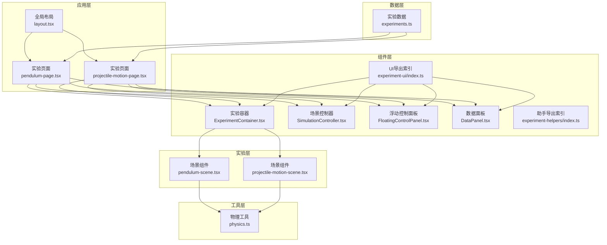
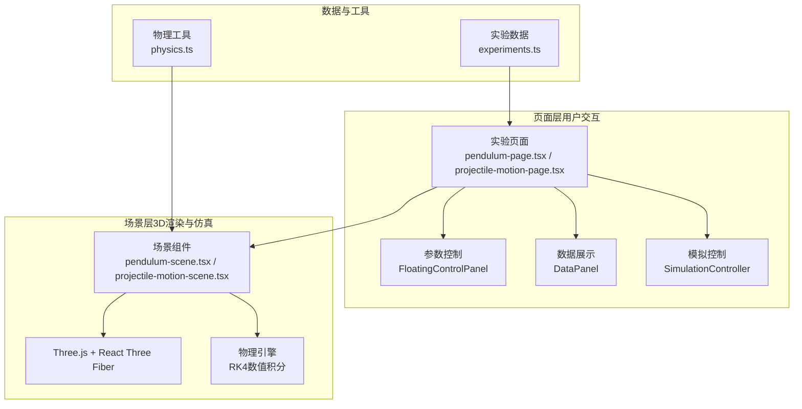
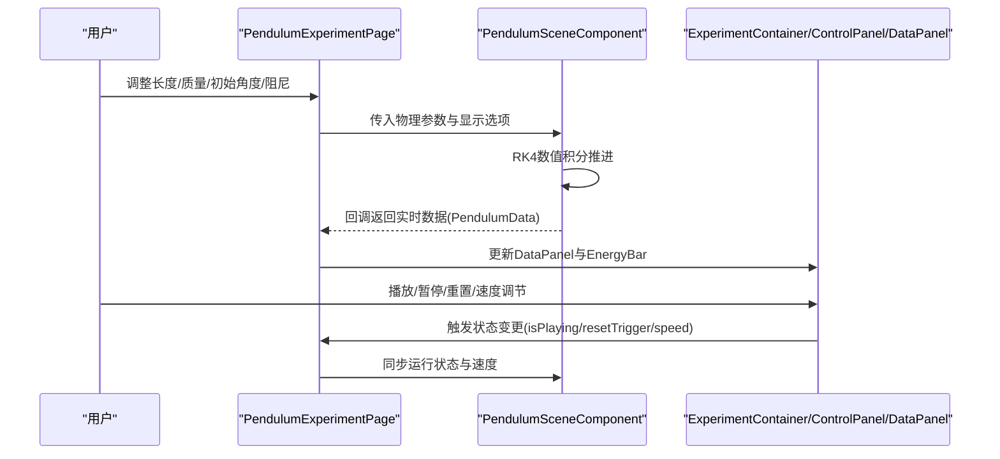
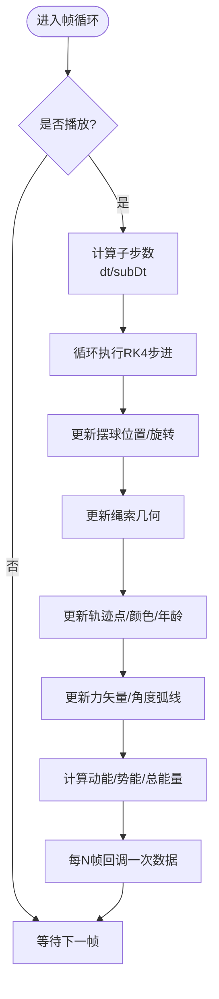
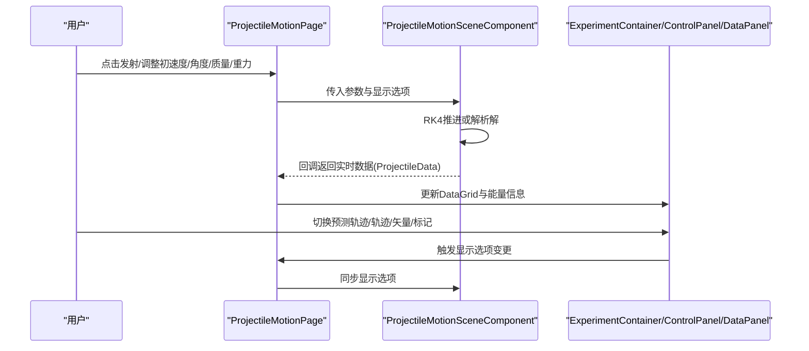
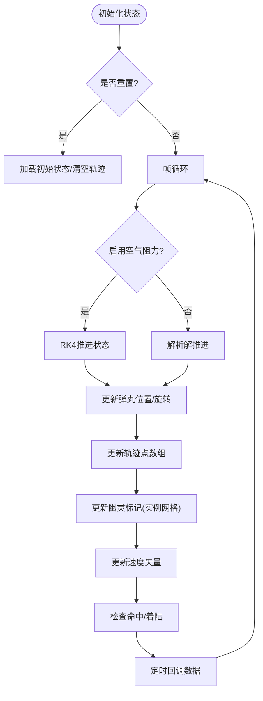
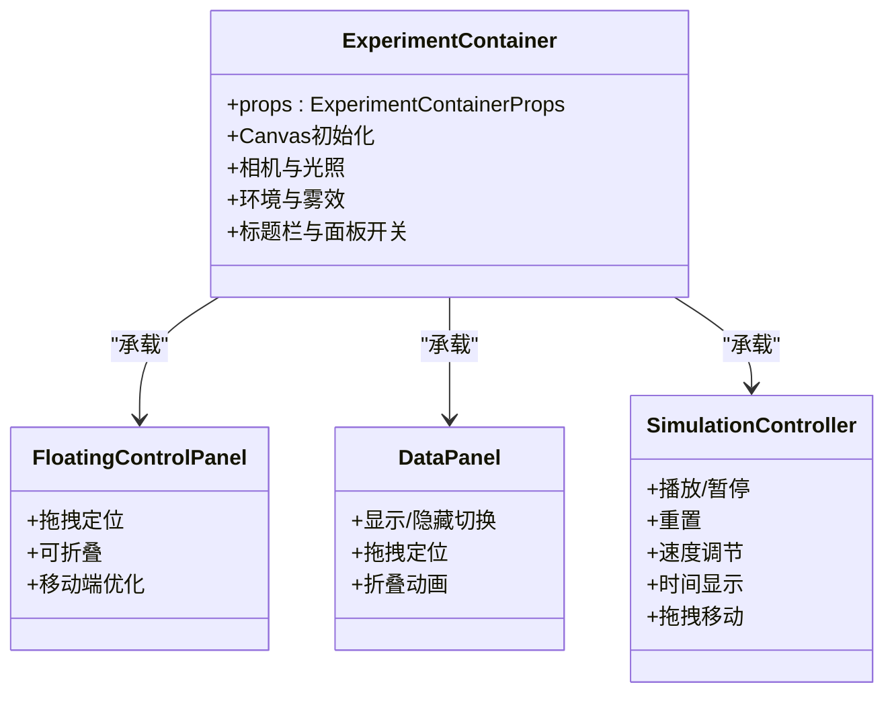
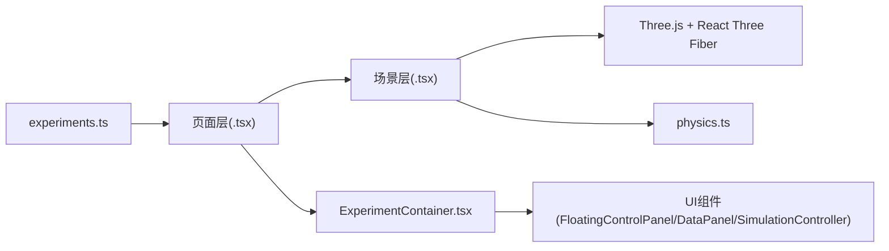

# 实验架构

<cite>
**本文档引用的文件**
- [experiments.ts](file://src/data/experiments.ts)
- [layout.tsx](file://src/app/layout.tsx)
- [index.ts](file://src/components/experiment-ui/index.ts)
- [index.ts](file://src/components/experiment-helpers/index.ts)
- [physics.ts](file://src/utils/physics.ts)
- [pendulum-page.tsx](file://src/experiments/pendulum-page.tsx)
- [pendulum-scene.tsx](file://src/experiments/pendulum-scene.tsx)
- [projectile-motion-page.tsx](file://src/experiments/projectile-motion-page.tsx)
- [projectile-motion-scene.tsx](file://src/experiments/projectile-motion-scene.tsx)
- [ExperimentContainer.tsx](file://src/components/experiment-ui/ExperimentContainer.tsx)
- [SimulationController.tsx](file://src/components/experiment-ui/SimulationController.tsx)
- [FloatingControlPanel.tsx](file://src/components/experiment-ui/FloatingControlPanel.tsx)
- [DataPanel.tsx](file://src/components/experiment-ui/DataPanel.tsx)
</cite>

## 目录
1. [简介](#简介)
2. [项目结构](#项目结构)
3. [核心组件](#核心组件)
4. [架构总览](#架构总览)
5. [详细组件分析](#详细组件分析)
6. [依赖关系分析](#依赖关系分析)
7. [性能考虑](#性能考虑)
8. [故障排除指南](#故障排除指南)
9. [结论](#结论)
10. [附录](#附录)

## 简介
本文件系统性阐述 ScienceLab3D 的实验架构，重点解析其模块化设计与双层结构（页面层与场景层）如何协同工作，实现用户交互、3D 渲染与物理仿真的一体化体验。同时，文档覆盖实验配置的数据驱动设计、生命周期管理、状态同步与资源清理机制，并总结实验间共享机制、通用组件复用与扩展点设计，以及实验开发的标准流程、命名规范与最佳实践。

## 项目结构
项目采用按功能域划分的组织方式：
- 数据层：集中定义所有实验的元数据与分类信息，支持统一管理与动态路由生成。
- 应用层：Next.js App Router 路由，提供页面入口与全局布局。
- 组件层：实验 UI 组件库与辅助组件，提供可复用的交互控件与可视化面板。
- 实验层：每个实验包含“页面层”（用户交互）与“场景层”（3D 渲染与物理仿真），通过 props 传递参数与回调，实现解耦与复用。
- 工具层：共享物理计算工具，确保各实验在物理层面的一致性与准确性。

**图表来源**
- [layout.tsx:1-204](file://src/app/layout.tsx#L1-L204)
- [pendulum-page.tsx:1-214](file://src/experiments/pendulum-page.tsx#L1-L214)
- [projectile-motion-page.tsx:1-289](file://src/experiments/projectile-motion-page.tsx#L1-L289)
- [ExperimentContainer.tsx:1-374](file://src/components/experiment-ui/ExperimentContainer.tsx#L1-L374)
- [SimulationController.tsx:1-228](file://src/components/experiment-ui/SimulationController.tsx#L1-L228)
- [FloatingControlPanel.tsx:1-195](file://src/components/experiment-ui/FloatingControlPanel.tsx#L1-L195)
- [DataPanel.tsx:1-219](file://src/components/experiment-ui/DataPanel.tsx#L1-L219)
- [experiments.ts:1-492](file://src/data/experiments.ts#L1-L492)
- [physics.ts:1-687](file://src/utils/physics.ts#L1-L687)

**章节来源**
- [layout.tsx:1-204](file://src/app/layout.tsx#L1-L204)
- [experiments.ts:1-492](file://src/data/experiments.ts#L1-L492)

## 核心组件
本节聚焦实验架构的核心构件及其职责边界：

- 实验容器（ExperimentContainer）
  - 负责 3D 场景的画布初始化、相机与光照配置、环境设置、响应式尺寸适配与设备检测。
  - 提供标题栏、控制面板开关、数据面板开关与悬浮模拟条等 UI 容器。
  - 作为页面层与场景层之间的粘合层，统一分发相机位置、背景色、雾效等全局参数。

- 悬浮控制面板（FloatingControlPanel）
  - 可拖拽、可折叠的参数控制面板，用于承载实验参数调节控件。
  - 支持移动端自动折叠与交互优化，避免遮挡主视图。

- 数据面板（DataPanel）
  - 实时数据显示面板，支持显示/隐藏切换、拖拽定位与折叠。
  - 与场景层通过回调函数进行数据同步，保证低耦合高内聚。

- 场景控制器（SimulationController）
  - 始终可见的悬浮控制条，提供播放/暂停、重置、速度调节与时间显示。
  - 全局控制实验运行节奏，支持拖拽移动与触摸友好交互。

- 物理工具（physics.ts）
  - 集中定义物理常量与各类物理公式计算函数，如简谐运动、抛物运动、弹簧振子、气体定律、波动光学、引力轨道等。
  - 为各实验场景层提供统一、可复用的物理计算能力，确保跨实验一致性。

- 实验数据（experiments.ts）
  - 定义实验元数据接口与完整实验清单，包含 id、标题、类别、难度、描述、图标、颜色与主题标签等。
  - 为前端路由、导航与搜索提供数据基础，支持动态生成实验列表与详情页。

**章节来源**
- [ExperimentContainer.tsx:1-374](file://src/components/experiment-ui/ExperimentContainer.tsx#L1-L374)
- [FloatingControlPanel.tsx:1-195](file://src/components/experiment-ui/FloatingControlPanel.tsx#L1-L195)
- [DataPanel.tsx:1-219](file://src/components/experiment-ui/DataPanel.tsx#L1-L219)
- [SimulationController.tsx:1-228](file://src/components/experiment-ui/SimulationController.tsx#L1-L228)
- [physics.ts:1-687](file://src/utils/physics.ts#L1-L687)
- [experiments.ts:1-492](file://src/data/experiments.ts#L1-L492)

## 架构总览
ScienceLab3D 的实验架构采用“页面层 + 场景层”的双层设计，配合统一的数据驱动配置与可复用的 UI 组件，形成高内聚、低耦合的模块化体系。

**图表来源**
- [pendulum-page.tsx:1-214](file://src/experiments/pendulum-page.tsx#L1-L214)
- [projectile-motion-page.tsx:1-289](file://src/experiments/projectile-motion-page.tsx#L1-L289)
- [FloatingControlPanel.tsx:1-195](file://src/components/experiment-ui/FloatingControlPanel.tsx#L1-L195)
- [DataPanel.tsx:1-219](file://src/components/experiment-ui/DataPanel.tsx#L1-L219)
- [SimulationController.tsx:1-228](file://src/components/experiment-ui/SimulationController.tsx#L1-L228)
- [pendulum-scene.tsx:1-859](file://src/experiments/pendulum-scene.tsx#L1-L859)
- [projectile-motion-scene.tsx:1-592](file://src/experiments/projectile-motion-scene.tsx#L1-L592)
- [experiments.ts:1-492](file://src/data/experiments.ts#L1-L492)
- [physics.ts:1-687](file://src/utils/physics.ts#L1-L687)

## 详细组件分析

### 页面层：以“单摆”为例
页面层负责用户交互与参数控制，通过 props 将参数传递给场景层，并接收场景层返回的实时数据。

**图表来源**
- [pendulum-page.tsx:1-214](file://src/experiments/pendulum-page.tsx#L1-L214)
- [pendulum-scene.tsx:1-859](file://src/experiments/pendulum-scene.tsx#L1-L859)
- [ExperimentContainer.tsx:1-374](file://src/components/experiment-ui/ExperimentContainer.tsx#L1-L374)
- [DataPanel.tsx:1-219](file://src/components/experiment-ui/DataPanel.tsx#L1-L219)
- [SimulationController.tsx:1-228](file://src/components/experiment-ui/SimulationController.tsx#L1-L228)

**章节来源**
- [pendulum-page.tsx:1-214](file://src/experiments/pendulum-page.tsx#L1-L214)
- [pendulum-scene.tsx:1-859](file://src/experiments/pendulum-scene.tsx#L1-L859)

### 场景层：以“单摆”为例
场景层基于 Three.js 与 React Three Fiber 进行 3D 渲染，使用 RK4 数值积分求解微分方程，实现稳定且精确的物理仿真。

**图表来源**
- [pendulum-scene.tsx:314-502](file://src/experiments/pendulum-scene.tsx#L314-L502)

**章节来源**
- [pendulum-scene.tsx:1-859](file://src/experiments/pendulum-scene.tsx#L1-L859)

### 页面层：以“抛物运动”为例
页面层提供发射控制、环境参数与显示选项，支持空气阻力模型与预测轨迹对比。

**图表来源**
- [projectile-motion-page.tsx:1-289](file://src/experiments/projectile-motion-page.tsx#L1-L289)
- [projectile-motion-scene.tsx:1-592](file://src/experiments/projectile-motion-scene.tsx#L1-L592)

**章节来源**
- [projectile-motion-page.tsx:1-289](file://src/experiments/projectile-motion-page.tsx#L1-L289)
- [projectile-motion-scene.tsx:1-592](file://src/experiments/projectile-motion-scene.tsx#L1-L592)

### 场景层：以“抛物运动”为例
场景层实现发射器、轨迹绘制、预测轨迹、距离标记与目标命中检测，使用实例网格优化性能。

**图表来源**
- [projectile-motion-scene.tsx:226-375](file://src/experiments/projectile-motion-scene.tsx#L226-L375)

**章节来源**
- [projectile-motion-scene.tsx:1-592](file://src/experiments/projectile-motion-scene.tsx#L1-L592)

### 实验容器与通用 UI 组件
实验容器负责画布初始化、光照与环境设置；悬浮控制面板与数据面板提供一致的交互体验；场景控制器提供全局运行控制。

**图表来源**
- [ExperimentContainer.tsx:1-374](file://src/components/experiment-ui/ExperimentContainer.tsx#L1-L374)
- [FloatingControlPanel.tsx:1-195](file://src/components/experiment-ui/FloatingControlPanel.tsx#L1-L195)
- [DataPanel.tsx:1-219](file://src/components/experiment-ui/DataPanel.tsx#L1-L219)
- [SimulationController.tsx:1-228](file://src/components/experiment-ui/SimulationController.tsx#L1-L228)

**章节来源**
- [ExperimentContainer.tsx:1-374](file://src/components/experiment-ui/ExperimentContainer.tsx#L1-L374)
- [FloatingControlPanel.tsx:1-195](file://src/components/experiment-ui/FloatingControlPanel.tsx#L1-L195)
- [DataPanel.tsx:1-219](file://src/components/experiment-ui/DataPanel.tsx#L1-L219)
- [SimulationController.tsx:1-228](file://src/components/experiment-ui/SimulationController.tsx#L1-L228)

## 依赖关系分析
- 页面层依赖场景层提供的场景组件与数据回调接口，通过 props 传递参数，实现参数到状态的单向流动。
- 场景层依赖 Three.js 与 React Three Fiber 进行渲染，依赖物理工具库进行物理计算。
- 实验容器与 UI 组件之间通过组合关系协作，不直接依赖具体实验逻辑，保持高内聚低耦合。
- 实验数据作为外部数据源，被页面层读取以生成路由与导航信息，不直接参与运行时逻辑。

**图表来源**
- [pendulum-page.tsx:1-214](file://src/experiments/pendulum-page.tsx#L1-L214)
- [pendulum-scene.tsx:1-859](file://src/experiments/pendulum-scene.tsx#L1-L859)
- [physics.ts:1-687](file://src/utils/physics.ts#L1-L687)
- [ExperimentContainer.tsx:1-374](file://src/components/experiment-ui/ExperimentContainer.tsx#L1-L374)
- [experiments.ts:1-492](file://src/data/experiments.ts#L1-L492)

**章节来源**
- [pendulum-page.tsx:1-214](file://src/experiments/pendulum-page.tsx#L1-L214)
- [pendulum-scene.tsx:1-859](file://src/experiments/pendulum-scene.tsx#L1-L859)
- [physics.ts:1-687](file://src/utils/physics.ts#L1-L687)
- [ExperimentContainer.tsx:1-374](file://src/components/experiment-ui/ExperimentContainer.tsx#L1-L374)
- [experiments.ts:1-492](file://src/data/experiments.ts#L1-L492)

## 性能考虑
- 帧循环优化
  - 使用子步长 RK4 积分，提高稳定性与精度，避免大步长导致的数值误差。
  - 对能量数据与轨迹点等高频更新进行节流（如每 N 帧回调一次），降低 React 状态抖动与重渲染开销。
- 几何与材质优化
  - 使用 BufferGeometry 与实例网格（如幽灵标记）减少对象数量，提升渲染性能。
  - 合理设置阴影贴图分辨率与相机裁剪面，平衡画质与性能。
- 内存与资源管理
  - 在场景组件卸载时释放几何体与纹理资源，避免内存泄漏。
  - 通过 ResizeObserver 与窗口事件监听，确保画布尺寸与投影矩阵正确更新。
- 移动端适配
  - 降低抗锯齿与 dpr，减少移动端 GPU 压力；优化交互控件尺寸与拖拽范围，提升触控体验。

[本节为通用性能指导，无需特定文件引用]

## 故障排除指南
- 画布无法渲染或尺寸异常
  - 检查 ExperimentContainer 中的画布初始化与 ResizeObserver 设置，确认容器尺寸变化后触发了 resize 事件。
  - 确认设备类型检测逻辑与 dpr 设置，避免移动端渲染模糊或过载。
- 参数调整无效或数据不同步
  - 核对页面层到场景层的 props 传递路径，确保 resetTrigger、isPlaying、simulationSpeed 等关键状态正确下发。
  - 检查场景层中的节流回调频率，确认数据更新未被过度抑制。
- 性能抖动或掉帧
  - 检查帧循环中的子步长与节流策略，适当增大子步数或减少回调频率。
  - 优化几何体与材质数量，减少阴影与复杂光照影响。
- 资源泄漏与内存增长
  - 确保场景组件在卸载时释放 BufferGeometry 与纹理资源，避免长时间使用导致内存占用持续上升。

**章节来源**
- [ExperimentContainer.tsx:1-374](file://src/components/experiment-ui/ExperimentContainer.tsx#L1-L374)
- [pendulum-scene.tsx:309-312](file://src/experiments/pendulum-scene.tsx#L309-L312)
- [projectile-motion-scene.tsx:226-375](file://src/experiments/projectile-motion-scene.tsx#L226-L375)

## 结论
ScienceLab3D 的实验架构通过“页面层 + 场景层”的双层设计与数据驱动的实验配置，实现了用户交互、3D 渲染与物理仿真的高效协同。统一的 UI 组件库与物理工具库提升了代码复用率与一致性，而严格的生命周期管理与资源清理机制保障了运行时的稳定性与性能。该架构为新增实验提供了清晰的扩展路径与最佳实践参考。

[本节为总结性内容，无需特定文件引用]

## 附录

### 实验开发标准流程
- 新增实验步骤
  - 在数据层添加实验元数据（id、标题、类别、难度、描述、图标、颜色、主题标签）。
  - 创建页面层文件，定义参数状态、控制面板与数据面板内容，绑定场景组件。
  - 创建场景层文件，实现 3D 渲染、物理仿真与数据回调。
  - 在 UI 导出索引中注册新组件，确保可复用性。
  - 编写测试与文档，验证交互与性能表现。
- 命名规范
  - 页面层：实验名-page.tsx
  - 场景层：实验名-scene.tsx
  - UI 组件：ExperimentContainer.tsx、FloatingControlPanel.tsx、DataPanel.tsx、SimulationController.tsx
  - 数据文件：experiments.ts
  - 物理工具：physics.ts
- 最佳实践
  - 使用 RK4 数值积分保证物理稳定性。
  - 对高频更新进行节流，降低 React 重渲染压力。
  - 合理使用实例网格与 BufferGeometry，优化渲染性能。
  - 明确页面层与场景层的职责边界，保持低耦合高内聚。
  - 在卸载时清理资源，避免内存泄漏。

**章节来源**
- [experiments.ts:1-492](file://src/data/experiments.ts#L1-L492)
- [index.ts:1-43](file://src/components/experiment-ui/index.ts#L1-L43)
- [index.ts:1-8](file://src/components/experiment-helpers/index.ts#L1-L8)
- [physics.ts:1-687](file://src/utils/physics.ts#L1-L687)