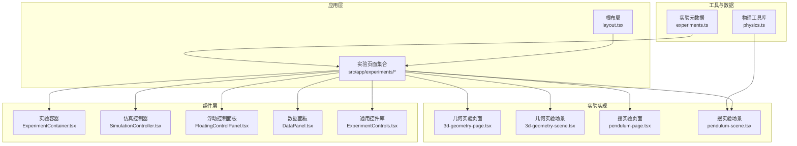
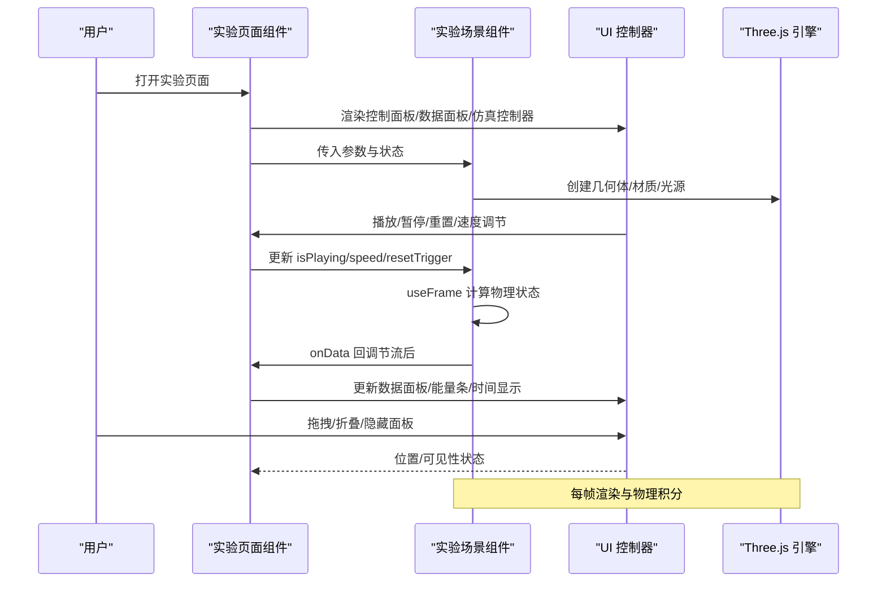
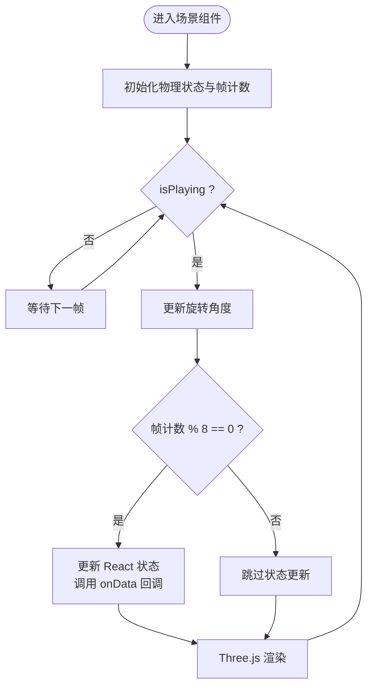
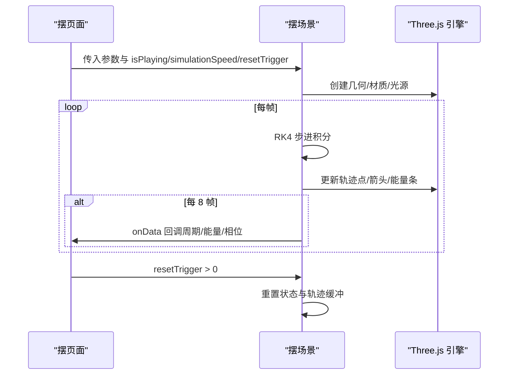
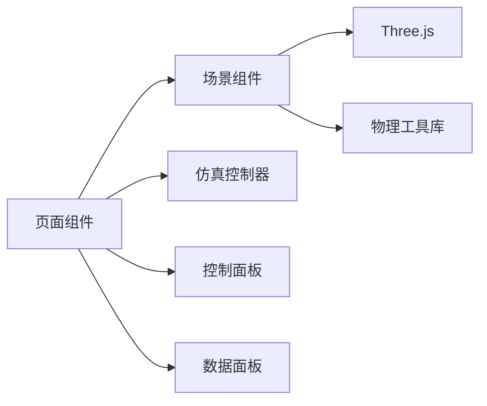

# 实验生命周期

<cite>
**本文档引用的文件**
- [layout.tsx](file://src/app/layout.tsx)
- [ExperimentContainer.tsx](file://src/components/experiment-ui/ExperimentContainer.tsx)
- [SimulationController.tsx](file://src/components/experiment-ui/SimulationController.tsx)
- [FloatingControlPanel.tsx](file://src/components/experiment-ui/FloatingControlPanel.tsx)
- [DataPanel.tsx](file://src/components/experiment-ui/DataPanel.tsx)
- [experiments.ts](file://src/data/experiments.ts)
- [3d-geometry-page.tsx](file://src/experiments/3d-geometry-page.tsx)
- [3d-geometry-scene.tsx](file://src/experiments/3d-geometry-scene.tsx)
- [pendulum-page.tsx](file://src/experiments/pendulum-page.tsx)
- [pendulum-scene.tsx](file://src/experiments/pendulum-scene.tsx)
- [physics.ts](file://src/utils/physics.ts)
- [package.json](file://package.json)
- [next.config.ts](file://next.config.ts)
</cite>

## 目录
1. [简介](#简介)
2. [项目结构](#项目结构)
3. [核心组件](#核心组件)
4. [架构总览](#架构总览)
5. [详细组件分析](#详细组件分析)
6. [依赖关系分析](#依赖关系分析)
7. [性能考虑](#性能考虑)
8. [故障排除指南](#故障排除指南)
9. [结论](#结论)
10. [附录](#附录)

## 简介
本文件系统性阐述 ScienceLab3D 的实验生命周期管理，覆盖从初始化到销毁的完整流程：组件挂载、渲染准备、运行时管理与资源清理；实验状态管理（初始化、更新与持久化）；启动序列（依赖加载、场景初始化、UI 准备）；暂停/恢复/重置机制（状态保存、进度保持、资源回收）；实验间切换（状态隔离、资源释放、上下文切换）；以及最佳实践（错误处理、性能监控、用户体验优化）。目标是帮助开发者与维护者准确把握实验系统的运行机理与扩展点。

## 项目结构
ScienceLab3D 采用 Next.js 应用结构，实验以“页面路由 + 场景组件”的模式组织。页面负责参数与 UI 控制，场景组件负责 Three.js 渲染与物理计算。通用 UI 组件（实验容器、控制面板、数据面板、仿真控制器）在 components/experiment-ui 中复用。

图表来源
- [layout.tsx:1-204](file://src/app/layout.tsx#L1-L204)
- [ExperimentContainer.tsx:1-374](file://src/components/experiment-ui/ExperimentContainer.tsx#L1-L374)
- [SimulationController.tsx:1-228](file://src/components/experiment-ui/SimulationController.tsx#L1-L228)
- [FloatingControlPanel.tsx:1-195](file://src/components/experiment-ui/FloatingControlPanel.tsx#L1-L195)
- [DataPanel.tsx:1-219](file://src/components/experiment-ui/DataPanel.tsx#L1-L219)
- [3d-geometry-page.tsx:1-190](file://src/experiments/3d-geometry-page.tsx#L1-L190)
- [3d-geometry-scene.tsx:1-243](file://src/experiments/3d-geometry-scene.tsx#L1-L243)
- [pendulum-page.tsx:1-214](file://src/experiments/pendulum-page.tsx#L1-L214)
- [pendulum-scene.tsx:1-859](file://src/experiments/pendulum-scene.tsx#L1-L859)
- [experiments.ts:1-492](file://src/data/experiments.ts#L1-L492)
- [physics.ts:1-687](file://src/utils/physics.ts#L1-L687)

章节来源
- [layout.tsx:1-204](file://src/app/layout.tsx#L1-L204)
- [package.json:1-37](file://package.json#L1-L37)
- [next.config.ts:1-9](file://next.config.ts#L1-L9)

## 核心组件
- 实验容器（ExperimentContainer）
  - 负责 Three.js Canvas 初始化、相机与控制器设置、光照与环境配置、响应式尺寸调整、全屏遮罩与 UI 框架（标题栏、控制面板、数据面板、仿真控制器）的挂载与交互。
  - 关键职责：渲染根节点、设备检测、画布尺寸同步、全局样式与溢出控制、可选雾效与环境贴图。
- 仿真控制器（SimulationController）
  - 始终可见的浮动控制条，提供播放/暂停、重置、速度调节、时间显示等能力；支持拖拽移动与视口约束。
- 浮动控制面板（FloatingControlPanel）
  - 参数控制面板，支持拖拽、折叠、自动折叠（移动端）、内容滚动。
- 数据面板（DataPanel）
  - 实时数据展示面板，支持拖拽、折叠、隐藏/显示、内容区域自适应。
- 页面与场景组件
  - 页面组件（如 3d-geometry-page、pendulum-page）：集中管理实验参数状态、播放控制、UI 开关、数据回调；通过 props 将状态传递给场景组件。
  - 场景组件（如 3d-geometry-scene、pendulum-scene）：使用 useFrame 进行每帧更新，结合 refs 存储物理状态，通过 throttle 降低 React 状态更新频率，仅在必要时调用 setState/onDataCallback。

章节来源
- [ExperimentContainer.tsx:1-374](file://src/components/experiment-ui/ExperimentContainer.tsx#L1-L374)
- [SimulationController.tsx:1-228](file://src/components/experiment-ui/SimulationController.tsx#L1-L228)
- [FloatingControlPanel.tsx:1-195](file://src/components/experiment-ui/FloatingControlPanel.tsx#L1-L195)
- [DataPanel.tsx:1-219](file://src/components/experiment-ui/DataPanel.tsx#L1-L219)
- [3d-geometry-page.tsx:1-190](file://src/experiments/3d-geometry-page.tsx#L1-L190)
- [3d-geometry-scene.tsx:1-243](file://src/experiments/3d-geometry-scene.tsx#L1-L243)
- [pendulum-page.tsx:1-214](file://src/experiments/pendulum-page.tsx#L1-L214)
- [pendulum-scene.tsx:1-859](file://src/experiments/pendulum-scene.tsx#L1-L859)

## 架构总览
实验生命周期由“页面状态 → 场景渲染 → UI 控制器”三层协作完成。页面负责高层状态与 UI，场景负责物理与渲染，控制器负责交互与可视化反馈。

图表来源
- [3d-geometry-page.tsx:18-190](file://src/experiments/3d-geometry-page.tsx#L18-L190)
- [3d-geometry-scene.tsx:30-243](file://src/experiments/3d-geometry-scene.tsx#L30-L243)
- [SimulationController.tsx:27-228](file://src/components/experiment-ui/SimulationController.tsx#L27-L228)
- [DataPanel.tsx:23-219](file://src/components/experiment-ui/DataPanel.tsx#L23-L219)

## 详细组件分析

### 实验容器（ExperimentContainer）
- 渲染准备
  - Canvas 初始化：阴影、抗锯齿、颜色空间、色调映射、DPR 设置、事件去抖。
  - 相机与控制器：透视相机默认视角、OrbitControls 默认阻尼与距离限制、触摸手势映射。
  - 光照与环境：环境光、方向光、半球光、点光源组合，环境贴图与雾效。
  - 响应式：监听窗口大小变化与 ResizeObserver，动态调整画布尺寸与投影矩阵。
- UI 框架
  - 标题栏与返回按钮、控制面板开关、数据面板开关、细节面板、浮动仿真控制条。
  - 移动端适配：FOV、DPR、触摸操作、提示信息。
- 生命周期要点
  - 首次渲染前等待窗口尺寸有效（避免 0 尺寸导致渲染异常）。
  - 卸载时恢复 body 溢出状态，防止页面滚动被锁定。

章节来源
- [ExperimentContainer.tsx:10-374](file://src/components/experiment-ui/ExperimentContainer.tsx#L10-L374)

### 仿真控制器（SimulationController）
- 功能特性
  - 可拖拽、始终可见、跨设备兼容、时间显示、速度滑块、播放/暂停/重置。
  - 视口约束：面板不会移出屏幕边界。
- 生命周期
  - 安装阶段检测移动端并设置初始位置，避免水合不一致。
  - 拖拽过程监听全局鼠标/触摸事件，松开后解绑。
  - 支持 mounted 状态保护，避免服务端渲染问题。

章节来源
- [SimulationController.tsx:27-228](file://src/components/experiment-ui/SimulationController.tsx#L27-L228)

### 浮动控制面板（FloatingControlPanel）
- 功能特性
  - 可拖拽、折叠/展开、移动端自动折叠、内容滚动。
  - 初始位置与尺寸根据设备类型动态调整。
- 生命周期
  - 安装阶段设置初始位置，避免水合差异。
  - 自动折叠定时器在移动端活跃时重置，空闲自动折叠。

章节来源
- [FloatingControlPanel.tsx:21-195](file://src/components/experiment-ui/FloatingControlPanel.tsx#L21-L195)

### 数据面板（DataPanel）
- 功能特性
  - 可拖拽、折叠/展开、隐藏/显示、内容区域自适应高度。
  - 隐藏时仅显示一个最小化的“显示”按钮。
- 生命周期
  - 受控/非受控可见性切换，拖拽与视口约束，卸载时清理事件监听。

章节来源
- [DataPanel.tsx:23-219](file://src/components/experiment-ui/DataPanel.tsx#L23-L219)

### 页面与场景组件（以几何与摆为例）

#### 几何实验（3D Geometry）
- 页面状态
  - isPlaying、simulationSpeed、resetTrigger、shapeType、rotationSpeed、wireframe、showVertices、showEdges。
  - handlePlayPause、handleReset 通过状态翻转与重置触发器驱动场景。
- 场景渲染
  - 使用 useMemo 缓存几何数据与顶点集，减少重复计算。
  - useFrame 在每帧更新旋转角度，8 帧一次更新 React 状态与数据回调，降低更新频率。
  - 边线与顶点高亮、Euler 公式可视化、对偶多面体提示。
- 数据回调
  - 每 8 帧向页面回调几何数据（顶点数、边数、面数、欧拉示性数、当前旋转角），用于实时数据面板。

图表来源
- [3d-geometry-scene.tsx:131-153](file://src/experiments/3d-geometry-scene.tsx#L131-L153)
- [3d-geometry-page.tsx:33-40](file://src/experiments/3d-geometry-page.tsx#L33-L40)

章节来源
- [3d-geometry-page.tsx:18-190](file://src/experiments/3d-geometry-page.tsx#L18-L190)
- [3d-geometry-scene.tsx:30-243](file://src/experiments/3d-geometry-scene.tsx#L30-L243)

#### 摆实验（Pendulum）
- 页面状态
  - isPlaying、simulationSpeed、resetTrigger、timeElapsed、length、gravity、mass、damping、initialAngle、显示选项。
  - handlePlayPause、handleReset 重置内部状态与计时。
- 场景渲染
  - RK4 数值积分：按 dt 分步积分，保证高速播放稳定性。
  - 轨迹点缓存：BufferAttribute 动态写入位置/颜色/年龄，实现渐隐轨迹。
  - 力矢量：速度、重力、张力、合外力矢量可视化。
  - 能量条：3D 能量柱（KE/PE/Total）随帧更新。
  - 数据回调：每 8 帧计算并回调周期、角速度、动能/势能/总能量、振荡次数等。
- 资源清理
  - 卸载时 dispose BufferGeometry，避免内存泄漏。

图表来源
- [pendulum-scene.tsx:314-502](file://src/experiments/pendulum-scene.tsx#L314-L502)
- [pendulum-page.tsx:53-59](file://src/experiments/pendulum-page.tsx#L53-L59)

章节来源
- [pendulum-page.tsx:29-214](file://src/experiments/pendulum-page.tsx#L29-L214)
- [pendulum-scene.tsx:223-677](file://src/experiments/pendulum-scene.tsx#L223-L677)

### 实验状态管理机制
- 状态初始化
  - 页面组件在首次渲染时初始化各参数状态（如 isPlaying、simulationSpeed、resetTrigger、shapeType 等），并传入场景组件。
- 状态更新
  - 用户交互（按钮、滑块、复选框）直接修改页面状态；场景组件通过 refs 存储物理状态，useFrame 每帧更新并节流 setState/onData。
- 状态持久化
  - 当前实现未见持久化存储（如 localStorage/sessionStorage）。建议在页面层增加状态快照与恢复策略，或通过路由查询参数携带轻量状态。

章节来源
- [3d-geometry-page.tsx:23-40](file://src/experiments/3d-geometry-page.tsx#L23-L40)
- [3d-geometry-scene.tsx:121-152](file://src/experiments/3d-geometry-scene.tsx#L121-L152)
- [pendulum-page.tsx:34-59](file://src/experiments/pendulum-page.tsx#L34-L59)
- [pendulum-scene.tsx:288-312](file://src/experiments/pendulum-scene.tsx#L288-L312)

### 启动序列
- 依赖加载
  - Next.js 按需加载页面与组件；Three.js 通过 @react-three/fiber/@react-three/drei 集成。
- 场景初始化
  - 页面组件创建并传参给场景组件；场景组件构建几何、材质、光源；初始化物理状态与帧计数。
- 用户界面准备
  - 实验容器渲染 Canvas、相机、控制器、光照与 UI 框架；仿真控制器、控制面板、数据面板按需显示。

章节来源
- [package.json:10-21](file://package.json#L10-L21)
- [next.config.ts:3-6](file://next.config.ts#L3-L6)
- [ExperimentContainer.tsx:137-208](file://src/components/experiment-ui/ExperimentContainer.tsx#L137-L208)
- [3d-geometry-page.tsx:145-189](file://src/experiments/3d-geometry-page.tsx#L145-L189)
- [pendulum-page.tsx:159-211](file://src/experiments/pendulum-page.tsx#L159-L211)

### 暂停、恢复与重置机制
- 暂停/恢复
  - isPlaying 切换阻止 RK4/旋转更新，但不重置物理状态；继续播放时从当前状态延续。
- 重置
  - resetTrigger 作为副作用触发器，场景组件在 useEffect 中重置物理状态（角度、角速度、时间、轨迹缓冲）；页面组件同时重置 UI 状态（速度、时间）。
- 资源回收
  - 卸载时 dispose BufferGeometry；容器卸载恢复 body 溢出。

章节来源
- [3d-geometry-page.tsx:33-40](file://src/experiments/3d-geometry-page.tsx#L33-L40)
- [3d-geometry-scene.tsx:121-152](file://src/experiments/3d-geometry-scene.tsx#L121-L152)
- [pendulum-page.tsx:53-59](file://src/experiments/pendulum-page.tsx#L53-L59)
- [pendulum-scene.tsx:288-312](file://src/experiments/pendulum-scene.tsx#L288-L312)
- [ExperimentContainer.tsx:117-121](file://src/components/experiment-ui/ExperimentContainer.tsx#L117-L121)

### 实验间的切换逻辑
- 状态隔离
  - 每个实验页面拥有独立的状态树（React hooks），页面卸载时自然释放其状态与事件监听。
- 资源释放
  - 场景组件卸载时 dispose 几何；容器卸载恢复全局样式。
- 上下文切换
  - 通过 Next.js 路由导航实现页面级切换；页面重新挂载时重建状态与渲染上下文。

章节来源
- [ExperimentContainer.tsx:117-121](file://src/components/experiment-ui/ExperimentContainer.tsx#L117-L121)
- [pendulum-scene.tsx:309-312](file://src/experiments/pendulum-scene.tsx#L309-L312)

## 依赖关系分析
- 外部依赖
  - @react-three/fiber、@react-three/drei、three：3D 渲染管线。
  - lucide-react：图标。
  - framer-motion：动画（部分实验使用）。
- 内部依赖
  - 页面组件依赖场景组件与 UI 控件库；场景组件依赖 physics 工具库进行物理计算。
- 构建与运行
  - Next.js 严格模式与三方包转译配置；开发/生产脚本。

图表来源
- [package.json:10-21](file://package.json#L10-L21)
- [3d-geometry-page.tsx:1-14](file://src/experiments/3d-geometry-page.tsx#L1-L14)
- [pendulum-page.tsx:1-18](file://src/experiments/pendulum-page.tsx#L1-L18)
- [physics.ts:1-687](file://src/utils/physics.ts#L1-L687)

章节来源
- [package.json:1-37](file://package.json#L1-L37)
- [next.config.ts:1-9](file://next.config.ts#L1-L9)

## 性能考虑
- 渲染性能
  - 使用 useMemo 缓存几何与顶点集，减少重复计算。
  - useFrame 中按 8 帧节流更新 React 状态与回调，降低渲染压力。
  - Canvas 抗锯齿与 DPR 根据设备类型调整，移动端适度降采样。
- 物理性能
  - RK4 步进积分分步执行，dt 限制在 0.02s 以内，保证数值稳定与性能平衡。
  - 轨迹点使用 BufferAttribute 并批量更新，避免频繁对象创建。
- UI 性能
  - 拖拽面板使用 ResizeObserver 与事件去抖，避免高频重排。
  - 移动端自动折叠减少遮挡与重绘。

章节来源
- [3d-geometry-scene.tsx:48-90](file://src/experiments/3d-geometry-scene.tsx#L48-L90)
- [3d-geometry-scene.tsx:131-153](file://src/experiments/3d-geometry-scene.tsx#L131-L153)
- [ExperimentContainer.tsx:142-150](file://src/components/experiment-ui/ExperimentContainer.tsx#L142-L150)
- [pendulum-scene.tsx:314-341](file://src/experiments/pendulum-scene.tsx#L314-L341)
- [FloatingControlPanel.tsx:103-150](file://src/components/experiment-ui/FloatingControlPanel.tsx#L103-L150)

## 故障排除指南
- 页面空白或渲染异常
  - 确认窗口尺寸有效后再渲染（容器组件已内置检查）。
  - 检查 Canvas 初始化参数（阴影、抗锯齿、DPR）是否与设备匹配。
- 3D 对象不显示
  - 确认光源与材质设置正确；检查几何体创建与属性更新。
- 性能卡顿
  - 检查帧更新频率与回调节流；减少不必要的 setState 调用。
- 内存泄漏
  - 场景组件卸载时确保 dispose BufferGeometry；容器卸载恢复全局样式。
- 移动端交互异常
  - 检查触摸手势映射与视口约束；确认面板拖拽事件绑定与解绑正确。

章节来源
- [ExperimentContainer.tsx:117-133](file://src/components/experiment-ui/ExperimentContainer.tsx#L117-L133)
- [pendulum-scene.tsx:309-312](file://src/experiments/pendulum-scene.tsx#L309-L312)

## 结论
ScienceLab3D 的实验生命周期以“页面状态 + 场景渲染 + UI 控制器”为核心，通过节流更新、物理积分与资源清理保障了流畅的交互体验。建议在现有基础上引入状态持久化与更完善的错误处理，进一步提升用户体验与系统健壮性。

## 附录
- 实验元数据与分类
  - experiments.ts 提供完整的实验列表、分类与主题标签，便于页面路由与导航生成。
- 物理工具库
  - physics.ts 提供常用物理公式与常量，支撑多个实验的数值计算。

章节来源
- [experiments.ts:1-492](file://src/data/experiments.ts#L1-L492)
- [physics.ts:1-687](file://src/utils/physics.ts#L1-L687)