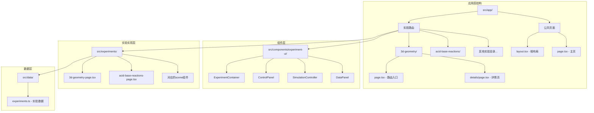
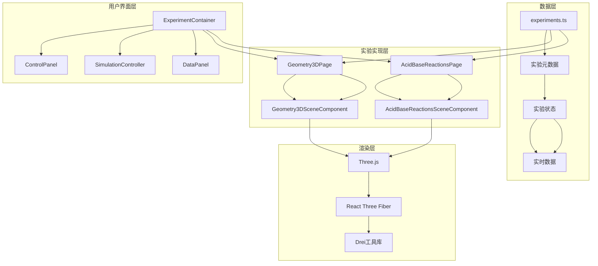
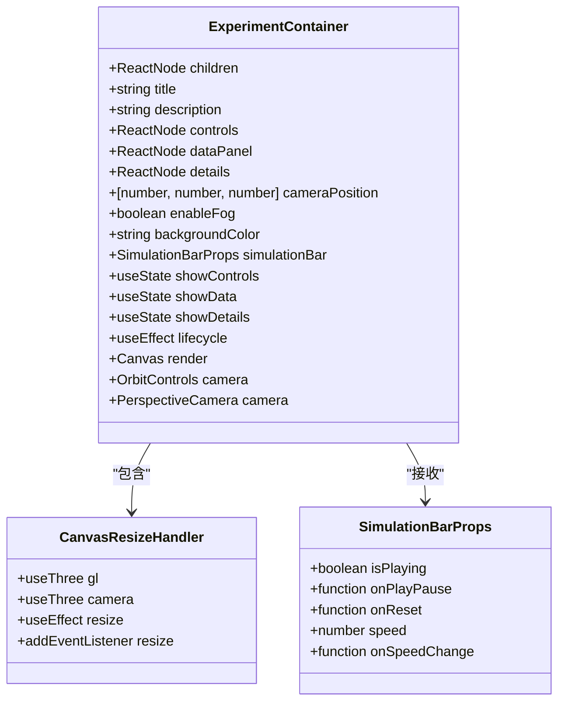
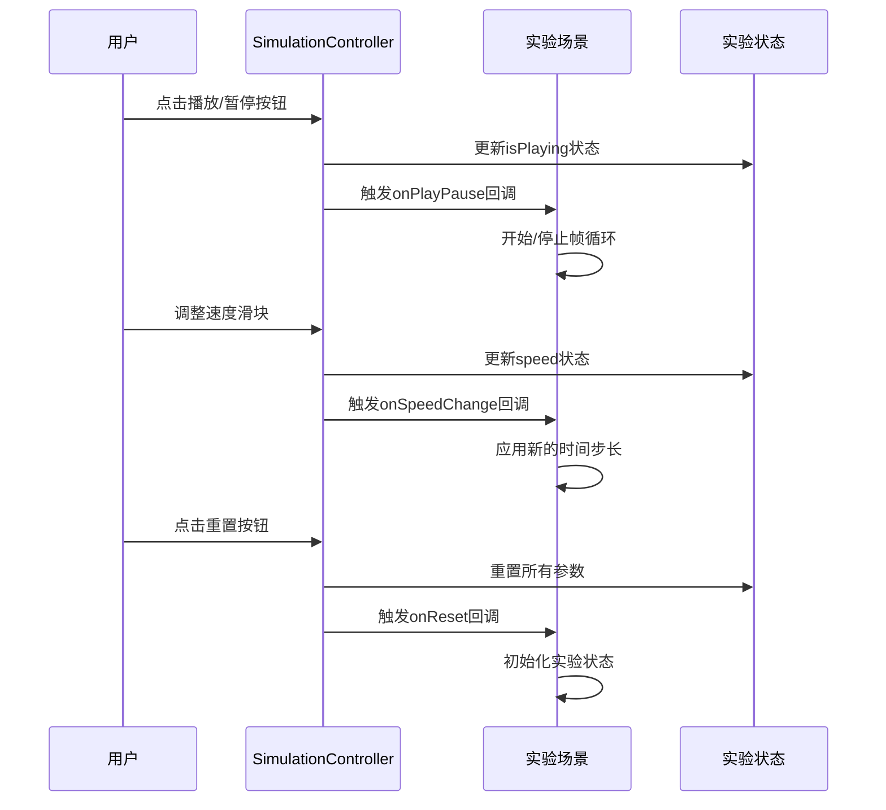
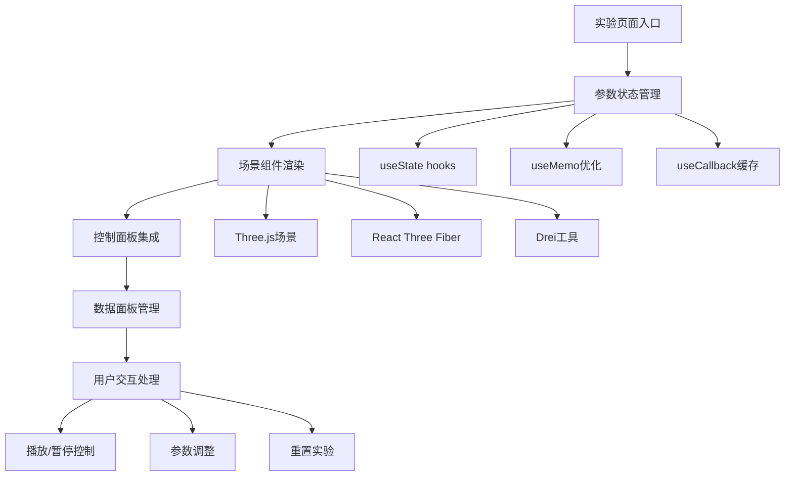
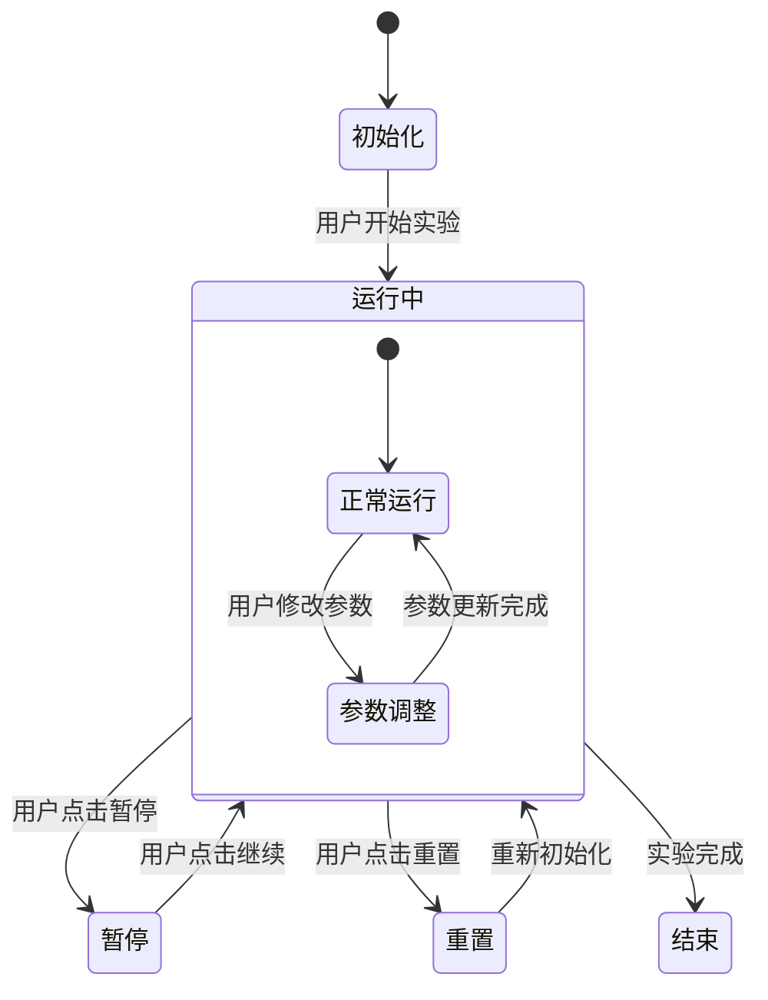
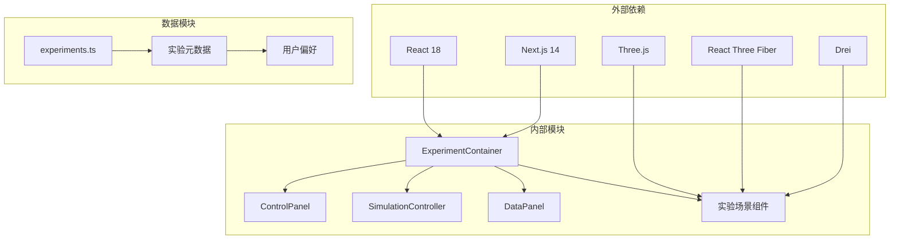

# 实验页面层

<cite>
**本文档引用的文件**
- [src/app/experiments/3d-geometry/page.tsx](file://src/app/experiments/3d-geometry/page.tsx)
- [src/experiments/3d-geometry-page.tsx](file://src/experiments/3d-geometry-page.tsx)
- [src/experiments/3d-geometry-scene.tsx](file://src/experiments/3d-geometry-scene.tsx)
- [src/app/experiments/acid-base-reactions/page.tsx](file://src/app/experiments/acid-base-reactions/page.tsx)
- [src/experiments/acid-base-reactions-page.tsx](file://src/experiments/acid-base-reactions-page.tsx)
- [src/experiments/acid-base-reactions-scene.tsx](file://src/experiments/acid-base-reactions-scene.tsx)
- [src/components/experiment-ui/index.ts](file://src/components/experiment-ui/index.ts)
- [src/components/experiment-ui/ExperimentContainer.tsx](file://src/components/experiment-ui/ExperimentContainer.tsx)
- [src/components/experiment-ui/ControlPanel.tsx](file://src/components/experiment-ui/ControlPanel.tsx)
- [src/components/experiment-ui/SimulationController.tsx](file://src/components/experiment-ui/SimulationController.tsx)
- [src/components/experiment-ui/DataPanel.tsx](file://src/components/experiment-ui/DataPanel.tsx)
- [src/data/experiments.ts](file://src/data/experiments.ts)
- [src/app/layout.tsx](file://src/app/layout.tsx)
- [src/app/page.tsx](file://src/app/page.tsx)
</cite>

## 目录
1. [引言](#引言)
2. [项目结构](#项目结构)
3. [核心组件](#核心组件)
4. [架构概览](#架构概览)
5. [详细组件分析](#详细组件分析)
6. [依赖关系分析](#依赖关系分析)
7. [性能考虑](#性能考虑)
8. [故障排除指南](#故障排除指南)
9. [结论](#结论)

## 引言

ScienceLab3D的实验页面层是一个高度模块化的React应用层，专门负责管理科学实验的交互式3D可视化体验。该层采用分层架构设计，通过清晰的组件边界和职责分离，实现了从用户界面到3D渲染的完整控制流程。

实验页面层的核心目标是为用户提供直观、响应迅速且教育性强的虚拟实验环境。它通过集成Three.js 3D渲染引擎、React Three Fiber框架和Drei工具库，构建了沉浸式的科学实验可视化平台。

## 项目结构

实验页面层遵循Next.js的文件系统路由约定，采用功能导向的组织方式：

**图表来源**
- [src/app/experiments/3d-geometry/page.tsx:1-9](file://src/app/experiments/3d-geometry/page.tsx#L1-L9)
- [src/components/experiment-ui/index.ts:1-43](file://src/components/experiment-ui/index.ts#L1-L43)
- [src/data/experiments.ts:1-492](file://src/data/experiments.ts#L1-L492)

**章节来源**
- [src/app/experiments/3d-geometry/page.tsx:1-9](file://src/app/experiments/3d-geometry/page.tsx#L1-L9)
- [src/experiments/3d-geometry-page.tsx:1-190](file://src/experiments/3d-geometry-page.tsx#L1-L190)
- [src/components/experiment-ui/index.ts:1-43](file://src/components/experiment-ui/index.ts#L1-L43)

## 核心组件

实验页面层由四个主要层次构成，每个层次都有明确的职责分工：

### 页面容器层
- **ExperimentContainer**: 提供统一的3D画布环境和UI框架
- **FloatingControlPanel**: 可拖拽的浮动控制面板
- **SimulationController**: 漂浮的仿真控制器
- **DataPanel**: 实时数据展示面板

### 场景层
- **几何实验场景**: Platonic固体可视化
- **酸碱反应场景**: 分子动力学模拟
- **其他实验场景**: 各学科特定的物理/化学/生物模拟

### 控制层
- **参数控制组**: 滑块、按钮等交互控件
- **状态管理**: 实验参数的实时更新
- **数据绑定**: 实验状态与UI的双向绑定

### 集成层
- **路由集成**: Next.js路由系统的无缝集成
- **数据流管理**: 父子组件间的数据传递
- **事件处理**: 用户交互的统一处理机制

**章节来源**
- [src/components/experiment-ui/ExperimentContainer.tsx:55-66](file://src/components/experiment-ui/ExperimentContainer.tsx#L55-L66)
- [src/experiments/3d-geometry-page.tsx:18-40](file://src/experiments/3d-geometry-page.tsx#L18-L40)
- [src/experiments/acid-base-reactions-page.tsx:16-55](file://src/experiments/acid-base-reactions-page.tsx#L16-L55)

## 架构概览

实验页面层采用分层架构，实现了关注点分离和高内聚低耦合的设计原则：

**图表来源**
- [src/experiments/3d-geometry-page.tsx:145-164](file://src/experiments/3d-geometry-page.tsx#L145-L164)
- [src/experiments/acid-base-reactions-page.tsx:184-203](file://src/experiments/acid-base-reactions-page.tsx#L184-L203)
- [src/data/experiments.ts:12-460](file://src/data/experiments.ts#L12-L460)

该架构的关键优势在于：
- **可扩展性**: 新增实验只需实现相应的场景组件
- **复用性**: 共享的UI组件可在不同实验中使用
- **维护性**: 清晰的职责分离便于代码维护
- **性能**: 基于React的高效渲染机制

## 详细组件分析

### ExperimentContainer 组件

ExperimentContainer是实验页面的核心容器，提供了完整的3D实验环境框架：

**图表来源**
- [src/components/experiment-ui/ExperimentContainer.tsx:55-66](file://src/components/experiment-ui/ExperimentContainer.tsx#L55-L66)
- [src/components/experiment-ui/ExperimentContainer.tsx:10-32](file://src/components/experiment-ui/ExperimentContainer.tsx#L10-L32)

#### 核心特性
- **自适应布局**: 支持桌面端和移动端的不同布局策略
- **设备检测**: 自动识别移动设备并调整渲染参数
- **响应式设计**: 使用ResizeObserver监听容器尺寸变化
- **性能优化**: 智能的像素比设置和抗锯齿配置

#### 生命周期管理
组件在挂载时执行以下初始化流程：
1. 设备类型检测（移动/平板/桌面）
2. 容器尺寸观察器注册
3. 画布大小初始化
4. 全局样式设置

**章节来源**
- [src/components/experiment-ui/ExperimentContainer.tsx:78-133](file://src/components/experiment-ui/ExperimentContainer.tsx#L78-L133)
- [src/components/experiment-ui/ExperimentContainer.tsx:137-371](file://src/components/experiment-ui/ExperimentContainer.tsx#L137-L371)

### SimulationController 组件

SimulationController提供了一个始终可见的漂浮控制器，用于管理实验的播放状态：

**图表来源**
- [src/components/experiment-ui/SimulationController.tsx:27-35](file://src/components/experiment-ui/SimulationController.tsx#L27-L35)
- [src/experiments/3d-geometry-page.tsx:33-40](file://src/experiments/3d-geometry-page.tsx#L33-L40)

#### 交互模式
- **拖拽操作**: 支持鼠标和触摸的拖拽操作
- **位置约束**: 自动限制在视口范围内
- **响应式设计**: 根据屏幕尺寸自动调整位置
- **视觉反馈**: 拖拽过程中的视觉效果

**章节来源**
- [src/components/experiment-ui/SimulationController.tsx:75-144](file://src/components/experiment-ui/SimulationController.tsx#L75-L144)
- [src/components/experiment-ui/SimulationController.tsx:148-225](file://src/components/experiment-ui/SimulationController.tsx#L148-L225)

### 实验页面实现模式

以几何实验为例，展示了标准的实验页面实现模式：

**图表来源**
- [src/experiments/3d-geometry-page.tsx:18-190](file://src/experiments/3d-geometry-page.tsx#L18-L190)
- [src/experiments/3d-geometry-scene.tsx:30-243](file://src/experiments/3d-geometry-scene.tsx#L30-L243)

#### 参数管理策略
- **集中式状态**: 所有实验参数集中在页面组件中管理
- **状态同步**: 通过props向下传递，通过回调向上更新
- **性能优化**: 使用useMemo避免不必要的重新计算
- **类型安全**: 完整的TypeScript类型定义

**章节来源**
- [src/experiments/3d-geometry-page.tsx:23-40](file://src/experiments/3d-geometry-page.tsx#L23-L40)
- [src/experiments/acid-base-reactions-page.tsx:18-55](file://src/experiments/acid-base-reactions-page.tsx#L18-L55)

### 数据流架构

实验页面层实现了清晰的数据流架构，确保状态的一致性和可预测性：

**图表来源**
- [src/experiments/3d-geometry-page.tsx:33-40](file://src/experiments/3d-geometry-page.tsx#L33-L40)
- [src/experiments/acid-base-reactions-page.tsx:37-47](file://src/experiments/acid-base-reactions-page.tsx#L37-L47)

## 依赖关系分析

实验页面层的依赖关系体现了清晰的分层架构：

**图表来源**
- [src/components/experiment-ui/ExperimentContainer.tsx:3-8](file://src/components/experiment-ui/ExperimentContainer.tsx#L3-L8)
- [src/experiments/3d-geometry-scene.tsx:3-6](file://src/experiments/3d-geometry-scene.tsx#L3-L6)

### 关键依赖特性
- **版本兼容性**: 所有依赖都经过精心选择以确保最佳兼容性
- **性能优化**: 依赖库都针对性能进行了优化配置
- **类型支持**: 完整的TypeScript类型定义支持
- **社区生态**: 基于成熟的开源生态系统

**章节来源**
- [src/components/experiment-ui/index.ts:1-43](file://src/components/experiment-ui/index.ts#L1-L43)
- [src/data/experiments.ts:1-492](file://src/data/experiments.ts#L1-L492)

## 性能考虑

实验页面层在多个层面实施了性能优化策略：

### 渲染性能优化
- **帧率控制**: 使用useFrame钩子精确控制渲染频率
- **批量更新**: 将多个状态更新合并到单个渲染周期
- **虚拟DOM优化**: 最小化不必要的组件重渲染
- **资源管理**: 及时清理Three.js资源和事件监听器

### 内存管理
- **引用优化**: 使用useRef存储频繁访问的对象
- **状态提升**: 将共享状态提升到合适的层级
- **垃圾回收**: 及时释放不再使用的对象引用
- **内存泄漏防护**: 在组件卸载时清理所有订阅

### 网络和加载优化
- **懒加载**: 实验组件按需加载
- **缓存策略**: 利用浏览器缓存减少重复请求
- **预加载**: 关键资源的预加载机制
- **CDN集成**: 静态资源的CDN加速

## 故障排除指南

### 常见问题及解决方案

#### 3D渲染问题
**症状**: 3D场景无法正常显示或渲染异常
**诊断步骤**:
1. 检查浏览器控制台是否有Three.js相关错误
2. 验证GPU支持和驱动程序版本
3. 确认实验容器的尺寸是否正确设置
4. 检查网络连接是否稳定

**解决方案**:
- 更新浏览器到最新版本
- 禁用可能干扰的浏览器扩展
- 调整实验容器的CSS样式
- 检查防火墙设置

#### 性能问题
**症状**: 实验运行卡顿或帧率不稳定
**诊断方法**:
1. 使用浏览器开发者工具的性能面板
2. 监控CPU和内存使用情况
3. 检查是否有过多的组件重渲染
4. 分析Three.js场景的复杂度

**优化措施**:
- 减少场景中的几何体数量
- 使用LOD（细节层次）技术
- 优化材质和纹理资源
- 实施适当的渲染批处理

#### 移动端兼容性问题
**症状**: 在移动设备上触摸操作不灵敏
**解决策略**:
1. 确保触摸事件正确处理
2. 调整交互元素的触控区域大小
3. 测试不同移动设备的兼容性
4. 实施适当的缩放和手势支持

**章节来源**
- [src/components/experiment-ui/ExperimentContainer.tsx:78-133](file://src/components/experiment-ui/ExperimentContainer.tsx#L78-L133)
- [src/components/experiment-ui/SimulationController.tsx:45-65](file://src/components/experiment-ui/SimulationController.tsx#L45-L65)

## 结论

ScienceLab3D的实验页面层展现了现代Web应用开发的最佳实践。通过清晰的分层架构、模块化的组件设计和完善的性能优化策略，该层成功地为用户提供了高质量的3D科学实验体验。

### 主要成就
- **架构清晰**: 分层设计确保了代码的可维护性和可扩展性
- **用户体验**: 直观的交互设计和流畅的动画效果
- **性能优异**: 多层次的性能优化确保了良好的运行效率
- **技术先进**: 采用最新的Web技术栈和最佳实践

### 技术亮点
- **React Three Fiber**: 高效的3D渲染解决方案
- **响应式设计**: 适配多种设备和屏幕尺寸
- **类型安全**: 完整的TypeScript支持
- **模块化架构**: 清晰的组件边界和职责分离

该实验页面层为ScienceLab3D项目奠定了坚实的技术基础，为未来的功能扩展和性能优化提供了良好的起点。通过持续的改进和优化，该项目将继续为用户提供卓越的科学实验学习体验。