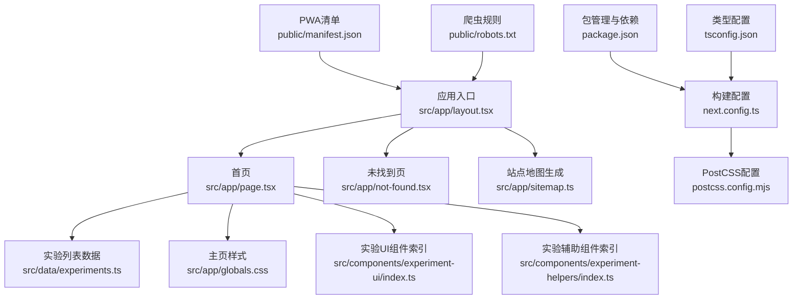
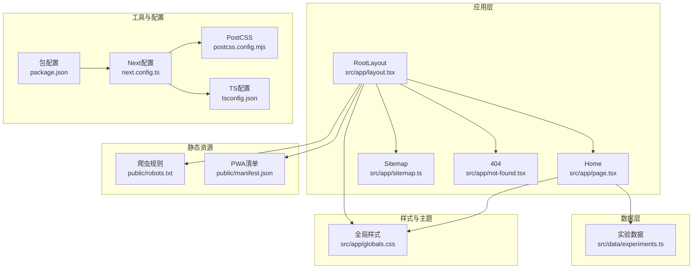
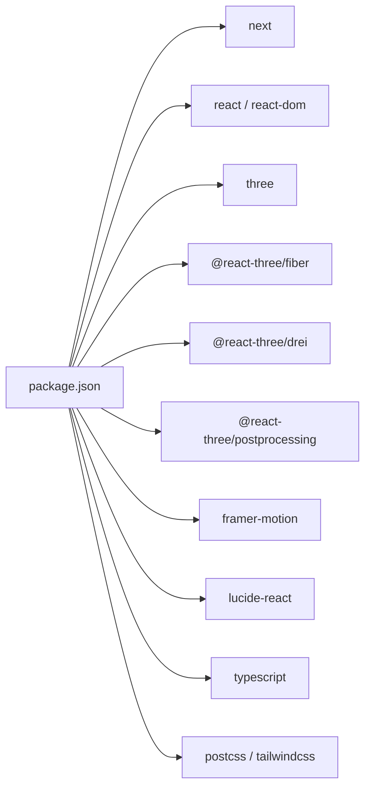

# 应用架构

<cite>
**本文引用的文件**
- [package.json](file://package.json)
- [next.config.ts](file://next.config.ts)
- [postcss.config.mjs](file://postcss.config.mjs)
- [tsconfig.json](file://tsconfig.json)
- [src/app/layout.tsx](file://src/app/layout.tsx)
- [src/app/page.tsx](file://src/app/page.tsx)
- [src/app/globals.css](file://src/app/globals.css)
- [src/app/not-found.tsx](file://src/app/not-found.tsx)
- [src/app/sitemap.ts](file://src/app/sitemap.ts)
- [src/data/experiments.ts](file://src/data/experiments.ts)
- [src/components/experiment-ui/index.ts](file://src/components/experiment-ui/index.ts)
- [src/components/experiment-helpers/index.ts](file://src/components/experiment-helpers/index.ts)
- [public/manifest.json](file://public/manifest.json)
- [public/robots.txt](file://public/robots.txt)
- [CONTRIBUTING.md](file://CONTRIBUTING.md)
- [CODE_OF_CONDUCT.md](file://CODE_OF_CONDUCT.md)
</cite>

## 目录
1. [引言](#引言)
2. [项目结构](#项目结构)
3. [核心组件](#核心组件)
4. [架构总览](#架构总览)
5. [组件与页面详解](#组件与页面详解)
6. [依赖关系分析](#依赖关系分析)
7. [性能优化策略](#性能优化策略)
8. [故障排查指南](#故障排查指南)
9. [结论](#结论)
10. [附录](#附录)

## 引言
本文件面向ScienceLab3D项目，系统化梳理其基于Next.js 14的应用架构设计，覆盖文件系统路由、页面与组件组织、全局样式与主题、元数据与SEO、PWA支持、响应式与移动端适配、性能优化（含代码分割与懒加载）、国际化与无障碍设计、应用启动流程与构建最佳实践等。文档以“可读性优先”的方式呈现，既适合开发者深入理解实现细节，也便于非技术读者把握整体架构。

## 项目结构
项目采用Next.js App Router的文件系统路由约定，页面位于src/app目录下，按路径自然形成URL；静态资源位于public目录；全局样式与主题变量在src/app/globals.css中集中管理；实验元数据与分类定义在src/data/experiments.ts中；UI组件通过src/components导出统一入口；构建与工具链配置位于根目录的配置文件中。

图示来源
- [src/app/layout.tsx:1-204](file://src/app/layout.tsx#L1-L204)
- [src/app/page.tsx:1-676](file://src/app/page.tsx#L1-L676)
- [src/app/not-found.tsx:1-56](file://src/app/not-found.tsx#L1-L56)
- [src/app/sitemap.ts:1-37](file://src/app/sitemap.ts#L1-L37)
- [src/data/experiments.ts:1-492](file://src/data/experiments.ts#L1-L492)
- [src/app/globals.css:1-165](file://src/app/globals.css#L1-L165)
- [src/components/experiment-ui/index.ts:1-43](file://src/components/experiment-ui/index.ts#L1-L43)
- [src/components/experiment-helpers/index.ts:1-8](file://src/components/experiment-helpers/index.ts#L1-L8)
- [next.config.ts:1-9](file://next.config.ts#L1-L9)
- [postcss.config.mjs:1-6](file://postcss.config.mjs#L1-L6)
- [tsconfig.json:1-22](file://tsconfig.json#L1-L22)
- [public/manifest.json:1-22](file://public/manifest.json#L1-L22)
- [public/robots.txt:1-9](file://public/robots.txt#L1-L9)

章节来源
- [src/app/layout.tsx:1-204](file://src/app/layout.tsx#L1-L204)
- [src/app/page.tsx:1-676](file://src/app/page.tsx#L1-L676)
- [src/app/globals.css:1-165](file://src/app/globals.css#L1-L165)
- [src/data/experiments.ts:1-492](file://src/data/experiments.ts#L1-L492)
- [src/components/experiment-ui/index.ts:1-43](file://src/components/experiment-ui/index.ts#L1-L43)
- [src/components/experiment-helpers/index.ts:1-8](file://src/components/experiment-helpers/index.ts#L1-L8)
- [next.config.ts:1-9](file://next.config.ts#L1-L9)
- [postcss.config.mjs:1-6](file://postcss.config.mjs#L1-L6)
- [tsconfig.json:1-22](file://tsconfig.json#L1-L22)
- [public/manifest.json:1-22](file://public/manifest.json#L1-L22)
- [public/robots.txt:1-9](file://public/robots.txt#L1-L9)

## 核心组件
- 全局布局与元数据：RootLayout负责设置viewport、站点元信息、Open Graph、Twitter Card、Schema结构化数据、图标与PWA清单链接，以及全局字体与样式注入。
- 首页与交互逻辑：Home组件提供导航栏、英雄区、实验筛选与搜索、收藏管理、难度过滤、实验卡片展示与进入实验详情页的动画过渡。
- 实验数据模型：experiments.ts定义了实验的完整元数据（ID、标题、类别、难度、描述、图标、颜色、主题标签）与分类集合。
- 组件体系：实验UI组件与辅助组件通过index.ts统一导出，便于页面按需引入。
- 未找到页：404页面采用动画与提示文案，引导用户回到主页或浏览实验列表。
- 站点地图：sitemap.ts动态生成静态页与每个实验的主页面及详情页的Sitemap条目。
- 构建与工具链：next.config.ts启用严格模式与特定包转译；postcss.config.mjs集成Tailwind；tsconfig.json配置严格类型检查与路径别名；package.json声明依赖与脚本。

章节来源
- [src/app/layout.tsx:1-204](file://src/app/layout.tsx#L1-L204)
- [src/app/page.tsx:1-676](file://src/app/page.tsx#L1-L676)
- [src/data/experiments.ts:1-492](file://src/data/experiments.ts#L1-L492)
- [src/components/experiment-ui/index.ts:1-43](file://src/components/experiment-ui/index.ts#L1-L43)
- [src/components/experiment-helpers/index.ts:1-8](file://src/components/experiment-helpers/index.ts#L1-L8)
- [src/app/not-found.tsx:1-56](file://src/app/not-found.tsx#L1-L56)
- [src/app/sitemap.ts:1-37](file://src/app/sitemap.ts#L1-L37)
- [next.config.ts:1-9](file://next.config.ts#L1-L9)
- [postcss.config.mjs:1-6](file://postcss.config.mjs#L1-L6)
- [tsconfig.json:1-22](file://tsconfig.json#L1-L22)
- [package.json:1-37](file://package.json#L1-L37)

## 架构总览
应用采用App Router的文件系统路由，页面组件与布局组件协同工作，全局样式与主题变量统一管理，数据通过本地模块导入，PWA与SEO通过清单与元数据配置实现，构建工具链确保开发体验与产物质量。

图示来源
- [src/app/layout.tsx:1-204](file://src/app/layout.tsx#L1-L204)
- [src/app/page.tsx:1-676](file://src/app/page.tsx#L1-L676)
- [src/app/not-found.tsx:1-56](file://src/app/not-found.tsx#L1-L56)
- [src/app/sitemap.ts:1-37](file://src/app/sitemap.ts#L1-L37)
- [src/data/experiments.ts:1-492](file://src/data/experiments.ts#L1-L492)
- [src/app/globals.css:1-165](file://src/app/globals.css#L1-L165)
- [next.config.ts:1-9](file://next.config.ts#L1-L9)
- [postcss.config.mjs:1-6](file://postcss.config.mjs#L1-L6)
- [tsconfig.json:1-22](file://tsconfig.json#L1-L22)
- [public/manifest.json:1-22](file://public/manifest.json#L1-L22)
- [public/robots.txt:1-9](file://public/robots.txt#L1-L9)
- [package.json:1-37](file://package.json#L1-L37)

## 组件与页面详解

### 文件系统路由与页面组织
- 路由约定：src/app下的目录与文件即为路由，如/experiments/:id/details对应src/app/experiments/[id]/details/page.tsx（同名文件存在时），/experiments/:id对应src/app/experiments/[id]/page.tsx。
- 布局与元数据：根布局文件src/app/layout.tsx提供全局viewport、元数据、Open Graph、Twitter Card、Schema结构化数据、图标与PWA清单链接。
- 首页：src/app/page.tsx作为根路由页面，负责渲染导航、英雄区、实验筛选与搜索、收藏管理、难度过滤、实验网格与分页/滚动加载的动画过渡。
- 未找到页：src/app/not-found.tsx处理404场景，提供返回主页与浏览实验的按钮。
- 站点地图：src/app/sitemap.ts根据实验数据动态生成Sitemap条目，提升SEO抓取效率。

章节来源
- [src/app/layout.tsx:1-204](file://src/app/layout.tsx#L1-L204)
- [src/app/page.tsx:1-676](file://src/app/page.tsx#L1-L676)
- [src/app/not-found.tsx:1-56](file://src/app/not-found.tsx#L1-L56)
- [src/app/sitemap.ts:1-37](file://src/app/sitemap.ts#L1-L37)

### 页面组件组织与职责
- Navbar：固定顶部导航，随滚动变化样式，提供主题切换与分类导航。
- HeroSection：全屏背景网格、浮动光晕与统计信息，配合Framer Motion动画增强视觉层次。
- CategoryBadge：分类标签，支持高亮与布局动画。
- ExperimentCard：实验卡片，包含收藏星标、难度徽章、主题标签、悬停发光效果与进入详情页的动效。
- Home：聚合所有功能，负责状态管理（活动分类、搜索词、收藏筛选、主题）、数据过滤与渲染。

章节来源
- [src/app/page.tsx:1-676](file://src/app/page.tsx#L1-L676)

### 全局样式与主题管理
- 主题变量：通过CSS自定义属性在:root与.light类中定义深色/浅色主题的颜色与阴影、过渡时间等。
- 暗/亮模式：通过切换html根元素的light类实现主题切换，localStorage持久化保存用户偏好。
- Glass效果：统一的毛玻璃样式在深浅主题下分别适配，支持backdrop-filter与边框。
- 动画与过渡：脉冲发光、平滑滚动、选择高亮、焦点环等。
- 移动端适配：针对小屏设备的滚动面板、画布容器高度与滚动条隐藏等。

章节来源
- [src/app/globals.css:1-165](file://src/app/globals.css#L1-L165)
- [src/app/page.tsx:305-328](file://src/app/page.tsx#L305-L328)

### 元数据配置与SEO策略
- 站点基础信息：站点名称、标题模板、描述、关键词、作者、发布者、分类等。
- Open Graph与Twitter Card：设置OG类型、语言、URL、图片、推文卡片类型与创作者信息。
- 结构化数据：通过JSON-LD提供WebApplication、WebSite与Organization的Schema，包含搜索入口与作者社交链接。
- 图标与清单：favicon与Apple Touch Icon，PWA清单指向public/manifest.json。
- 爬虫规则：robots.txt允许爬取并指定Sitemap地址，有助于搜索引擎收录。

章节来源
- [src/app/layout.tsx:13-118](file://src/app/layout.tsx#L13-L118)
- [src/app/layout.tsx:120-178](file://src/app/layout.tsx#L120-L178)
- [public/manifest.json:1-22](file://public/manifest.json#L1-L22)
- [public/robots.txt:1-9](file://public/robots.txt#L1-L9)

### PWA支持
- 清单字段：name、short_name、description、start_url、display、background_color、theme_color、orientation、icons、categories、lang、dir。
- 清单链接：在根布局中通过<link rel="manifest">指向/public/manifest.json。
- 行为建议：standalone显示模式与SVG图标，提升桌面与移动平台的安装体验。

章节来源
- [public/manifest.json:1-22](file://public/manifest.json#L1-L22)
- [src/app/layout.tsx:100-100](file://src/app/layout.tsx#L100-L100)

### 响应式设计与移动端适配
- 视口配置：width=device-width、initial-scale=1、maximumScale=5、userScalable=false、interactiveWidget=resizes-content、viewportFit=cover。
- 样式适配：媒体查询针对平板与手机调整信息面板最大高度与画布容器最小高度，滚动条隐藏工具类。
- 交互适配：卡片悬停发光、按钮聚焦可见轮廓、平滑滚动与滚动填充顶部间距。

章节来源
- [src/app/layout.tsx:4-11](file://src/app/layout.tsx#L4-L11)
- [src/app/globals.css:150-164](file://src/app/globals.css#L150-L164)

### 国际化与无障碍设计
- 国际化：当前元数据与界面文本以英文为主，未见专门的i18n配置文件或多语言路由约定。
- 无障碍：页面具备基本的键盘可达性与焦点可见性；建议补充语义化标签、ARIA属性与屏幕阅读器友好的文案。

章节来源
- [src/app/layout.tsx:19-118](file://src/app/layout.tsx#L19-L118)
- [src/app/page.tsx:36-71](file://src/app/page.tsx#L36-L71)

### 应用启动流程与构建优化最佳实践
- 启动流程：package.json中的dev脚本禁用Telemetry，使用next dev启动开发服务器；build与start分别用于生产构建与运行。
- 构建配置：next.config.ts启用reactStrictMode与three包转译；postcss.config.mjs集成Tailwind；tsconfig.json启用严格模式与路径别名。
- 最佳实践：遵循贡献指南中的代码风格（函数式组件、类型安全、小而专注的组件、可访问性属性、移动端响应式）；构建前先执行build确保无错误；开发时使用dev进行快速迭代。

章节来源
- [package.json:5-8](file://package.json#L5-L8)
- [next.config.ts:3-6](file://next.config.ts#L3-L6)
- [postcss.config.mjs:1-6](file://postcss.config.mjs#L1-L6)
- [tsconfig.json:2-17](file://tsconfig.json#L2-L17)
- [CONTRIBUTING.md:95-103](file://CONTRIBUTING.md#L95-L103)

## 依赖关系分析

图示来源
- [package.json:10-31](file://package.json#L10-L31)

章节来源
- [package.json:1-37](file://package.json#L1-L37)

## 性能优化策略
- 代码分割与懒加载：利用Next.js App Router的路由自动分割；页面组件使用use client并在需要时按需渲染（例如实验卡片的进入动画与滚动视口触发）。
- 样式与主题：通过CSS变量与主题切换减少重绘；Glass与backdrop-filter在现代浏览器上性能良好，但需关注低端设备的渲染开销。
- 资源加载：预连接Google Fonts，避免阻塞；图标库按需引入；PWA清单与图标优化加载速度。
- 构建优化：启用严格模式与类型检查，确保早期发现潜在问题；Tailwind按需生成，减少CSS体积。
- 缓存策略：建议在部署环境配置HTTP缓存头与CDN缓存；静态资源可利用浏览器缓存与Service Worker（PWA）实现离线访问。

章节来源
- [src/app/layout.tsx:188-194](file://src/app/layout.tsx#L188-L194)
- [src/app/globals.css:98-110](file://src/app/globals.css#L98-L110)
- [next.config.ts:4-6](file://next.config.ts#L4-L6)
- [postcss.config.mjs:1-6](file://postcss.config.mjs#L1-L6)
- [tsconfig.json:7-17](file://tsconfig.json#L7-L17)

## 故障排查指南
- 404页面：当访问不存在的实验路由时，not-found.tsx会渲染一个带有动画与返回按钮的页面，帮助用户回到主页或浏览实验列表。
- 数据一致性：若实验列表为空，请检查src/data/experiments.ts中的实验数组是否正确导出且无拼写错误。
- 样式异常：若主题切换无效，检查HTML根元素是否正确添加light类，以及localStorage中是否存在theme键值。
- PWA相关：若安装图标或启动行为异常，核对public/manifest.json字段与根布局中的manifest链接。

章节来源
- [src/app/not-found.tsx:1-56](file://src/app/not-found.tsx#L1-L56)
- [src/data/experiments.ts:1-492](file://src/data/experiments.ts#L1-L492)
- [src/app/page.tsx:312-328](file://src/app/page.tsx#L312-L328)
- [public/manifest.json:1-22](file://public/manifest.json#L1-L22)

## 结论
ScienceLab3D基于Next.js 14构建，采用文件系统路由与App Router组织页面，结合全局样式与主题变量、完善的元数据与PWA配置、响应式设计与移动端适配，形成了清晰、可扩展且具有良好用户体验的教育类3D科学实验平台。通过合理的组件拆分、构建配置与性能策略，项目在易维护性与运行效率之间取得了平衡。未来可在国际化与无障碍方面进一步完善，以服务更广泛的用户群体。

## 附录
- 贡献指南：包含新增实验的步骤、代码风格与测试流程，便于团队协作与持续演进。
- 行为准则：倡导包容与尊重的社区文化。

章节来源
- [CONTRIBUTING.md:65-91](file://CONTRIBUTING.md#L65-L91)
- [CONTRIBUTING.md:95-103](file://CONTRIBUTING.md#L95-L103)
- [CODE_OF_CONDUCT.md:1-26](file://CODE_OF_CONDUCT.md#L1-L26)