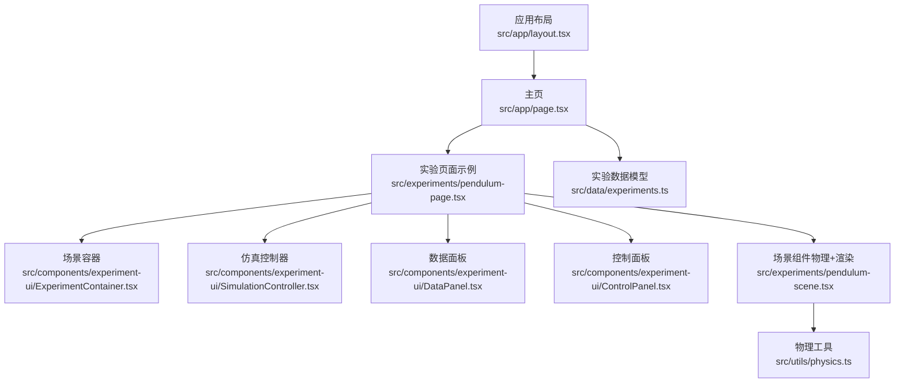
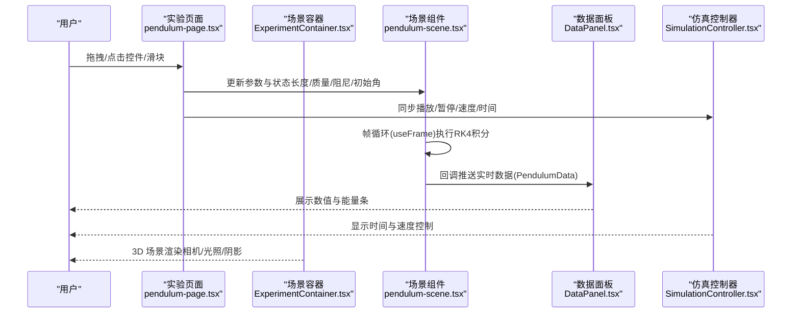
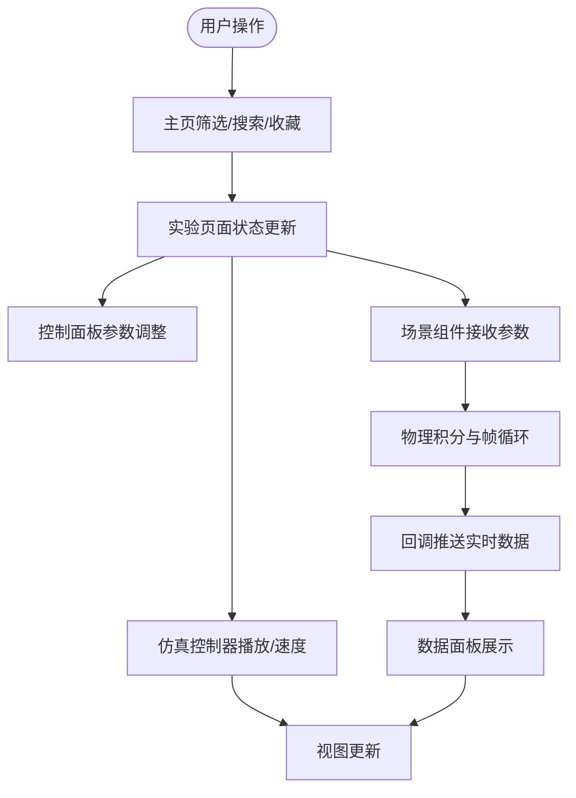
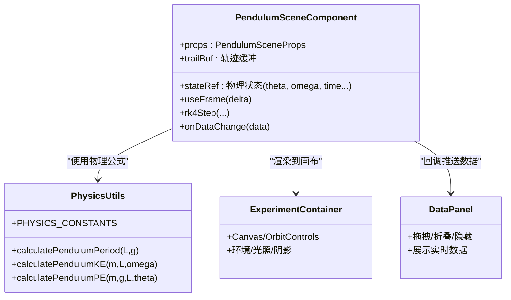
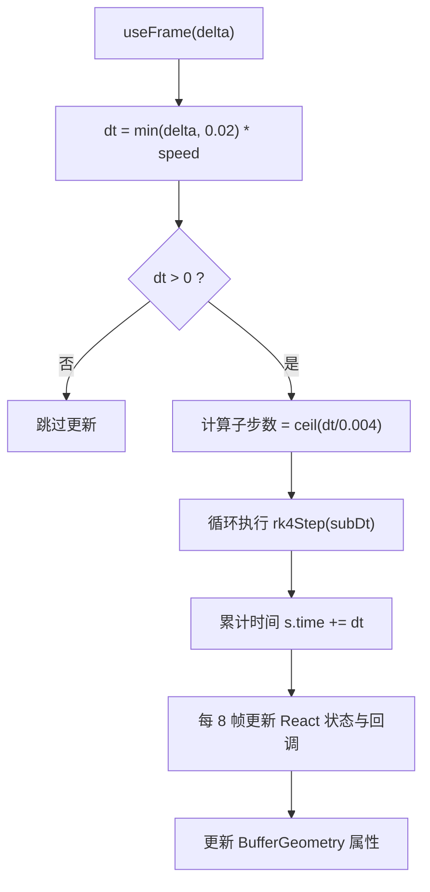
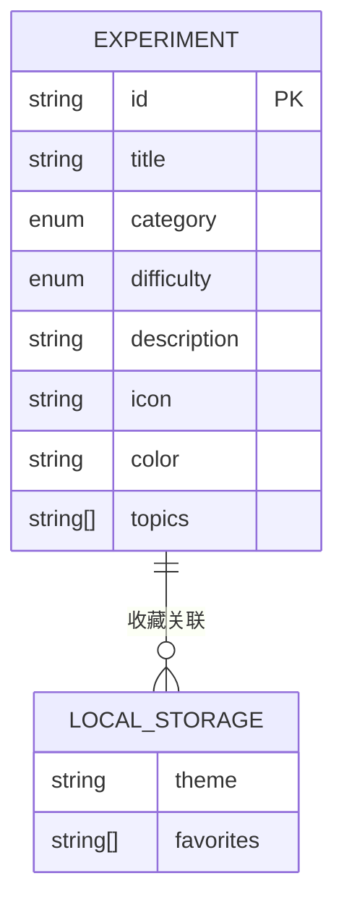
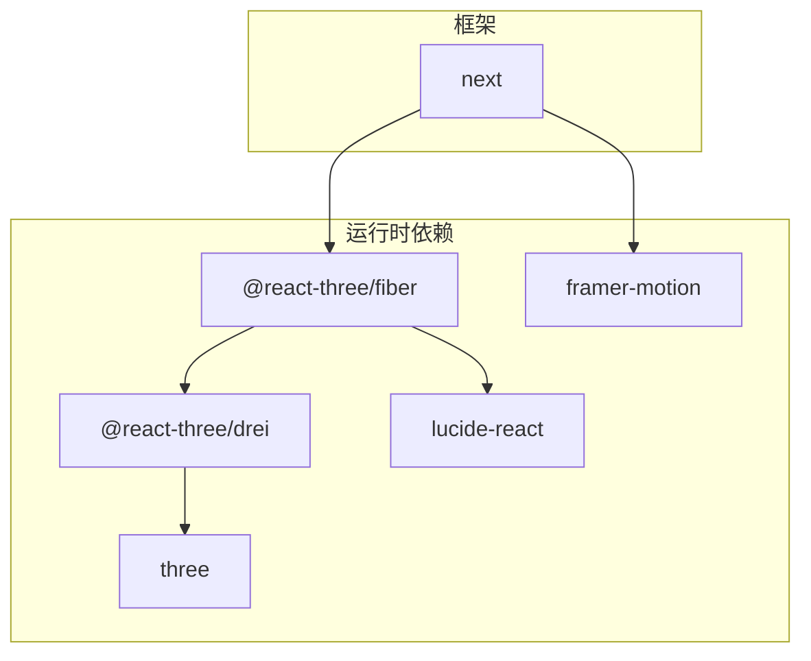

# 数据流架构

<cite>
**本文档引用的文件**
- [src/app/layout.tsx](file://src/app/layout.tsx)
- [src/app/page.tsx](file://src/app/page.tsx)
- [src/data/experiments.ts](file://src/data/experiments.ts)
- [src/utils/physics.ts](file://src/utils/physics.ts)
- [src/components/experiment-ui/ExperimentContainer.tsx](file://src/components/experiment-ui/ExperimentContainer.tsx)
- [src/components/experiment-ui/SimulationController.tsx](file://src/components/experiment-ui/SimulationController.tsx)
- [src/components/experiment-ui/DataPanel.tsx](file://src/components/experiment-ui/DataPanel.tsx)
- [src/components/experiment-ui/ControlPanel.tsx](file://src/components/experiment-ui/ControlPanel.tsx)
- [src/experiments/pendulum-page.tsx](file://src/experiments/pendulum-page.tsx)
- [src/experiments/pendulum-scene.tsx](file://src/experiments/pendulum-scene.tsx)
- [package.json](file://package.json)
</cite>

## 目录
1. [简介](#简介)
2. [项目结构](#项目结构)
3. [核心组件](#核心组件)
4. [架构总览](#架构总览)
5. [详细组件分析](#详细组件分析)
6. [依赖关系分析](#依赖关系分析)
7. [性能考虑](#性能考虑)
8. [故障排除指南](#故障排除指南)
9. [结论](#结论)

## 简介
本文件系统性梳理 ScienceLab3D 的数据流架构，覆盖从用户输入到状态管理、3D 渲染与物理计算之间的数据流转路径；解释实验数据的结构化存储、实时状态更新与跨组件数据共享机制；阐述物理引擎数据与 3D 渲染数据的同步策略、时间步长管理与性能优化；说明用户交互事件处理流程、状态变更传播与视图更新机制；并给出数据持久化策略、缓存管理与错误恢复建议及最佳实践。

## 项目结构
项目采用 Next.js 应用程序模式，前端以 React + Three.js 生态为核心，围绕“实验页面 + 场景组件 + UI 控制面板”的分层组织方式构建数据流：

- 应用布局与元数据：根布局负责全局样式、SEO 与主题注入
- 实验主页：提供实验列表、分类筛选、搜索与收藏持久化
- 实验页面：承载场景容器、控制面板、数据面板与仿真控制器
- 场景组件：封装物理仿真、3D 渲染与可视化输出
- 工具模块：统一的物理常量与公式计算

图表来源
- [src/app/layout.tsx:1-204](file://src/app/layout.tsx#L1-L204)
- [src/app/page.tsx:1-676](file://src/app/page.tsx#L1-L676)
- [src/experiments/pendulum-page.tsx:1-214](file://src/experiments/pendulum-page.tsx#L1-L214)
- [src/experiments/pendulum-scene.tsx:1-859](file://src/experiments/pendulum-scene.tsx#L1-L859)
- [src/components/experiment-ui/ExperimentContainer.tsx:1-374](file://src/components/experiment-ui/ExperimentContainer.tsx#L1-L374)
- [src/components/experiment-ui/SimulationController.tsx:1-228](file://src/components/experiment-ui/SimulationController.tsx#L1-L228)
- [src/components/experiment-ui/DataPanel.tsx:1-219](file://src/components/experiment-ui/DataPanel.tsx#L1-L219)
- [src/components/experiment-ui/ControlPanel.tsx:1-300](file://src/components/experiment-ui/ControlPanel.tsx#L1-L300)
- [src/data/experiments.ts:1-492](file://src/data/experiments.ts#L1-L492)
- [src/utils/physics.ts:1-687](file://src/utils/physics.ts#L1-L687)

章节来源
- [src/app/layout.tsx:1-204](file://src/app/layout.tsx#L1-L204)
- [src/app/page.tsx:1-676](file://src/app/page.tsx#L1-L676)
- [src/data/experiments.ts:1-492](file://src/data/experiments.ts#L1-L492)

## 核心组件
- 实验数据模型：集中定义实验元信息（类别、难度、主题等），用于主页筛选与导航
- 物理工具库：提供统一的物理常量与公式，支撑各实验的数值计算
- 场景容器：封装 Three.js 上下文、相机、光照、环境与响应式尺寸适配
- 仿真控制器：提供播放/暂停、重置、速度调节与时间显示的悬浮控件
- 数据面板：浮动的实时数据展示面板，支持拖拽、折叠与隐藏
- 控制面板：可折叠的参数控制面板，支持拖拽与移动端自适应
- 实验页面：聚合场景组件与 UI 面板，协调状态与回调
- 场景组件：实现物理积分器、帧循环、轨迹缓冲、向量可视化与能量条

章节来源
- [src/data/experiments.ts:1-492](file://src/data/experiments.ts#L1-L492)
- [src/utils/physics.ts:1-687](file://src/utils/physics.ts#L1-L687)
- [src/components/experiment-ui/ExperimentContainer.tsx:1-374](file://src/components/experiment-ui/ExperimentContainer.tsx#L1-L374)
- [src/components/experiment-ui/SimulationController.tsx:1-228](file://src/components/experiment-ui/SimulationController.tsx#L1-L228)
- [src/components/experiment-ui/DataPanel.tsx:1-219](file://src/components/experiment-ui/DataPanel.tsx#L1-L219)
- [src/components/experiment-ui/ControlPanel.tsx:1-300](file://src/components/experiment-ui/ControlPanel.tsx#L1-L300)
- [src/experiments/pendulum-page.tsx:1-214](file://src/experiments/pendulum-page.tsx#L1-L214)
- [src/experiments/pendulum-scene.tsx:1-859](file://src/experiments/pendulum-scene.tsx#L1-L859)

## 架构总览
数据流从用户交互开始，经由实验页面的状态管理，驱动场景组件的物理仿真与 3D 渲染，并通过回调将实时数据回传至数据面板与仿真控制器，形成闭环。

图表来源
- [src/experiments/pendulum-page.tsx:1-214](file://src/experiments/pendulum-page.tsx#L1-L214)
- [src/experiments/pendulum-scene.tsx:1-859](file://src/experiments/pendulum-scene.tsx#L1-L859)
- [src/components/experiment-ui/DataPanel.tsx:1-219](file://src/components/experiment-ui/DataPanel.tsx#L1-L219)
- [src/components/experiment-ui/SimulationController.tsx:1-228](file://src/components/experiment-ui/SimulationController.tsx#L1-L228)
- [src/components/experiment-ui/ExperimentContainer.tsx:1-374](file://src/components/experiment-ui/ExperimentContainer.tsx#L1-L374)

## 详细组件分析

### 用户输入与状态管理
- 主页：使用本地存储持久化主题与收藏；通过 useMemo 过滤实验列表；支持搜索、分类与难度筛选
- 实验页面：集中管理仿真状态（播放/暂停、速度、重置触发、时间）、物理参数（长度、质量、阻尼、初始角、重力）与显示选项（轨迹/矢量/角度弧/量角器）
- 控制面板：提供播放/暂停、重置、速度调节与参数控件的可折叠面板
- 仿真控制器：悬浮控件，支持拖拽、速度调节与时间显示
- 数据面板：浮动面板，支持拖拽、折叠与隐藏，用于展示实时数据

图表来源
- [src/app/page.tsx:305-676](file://src/app/page.tsx#L305-L676)
- [src/experiments/pendulum-page.tsx:29-214](file://src/experiments/pendulum-page.tsx#L29-L214)
- [src/components/experiment-ui/ControlPanel.tsx:1-300](file://src/components/experiment-ui/ControlPanel.tsx#L1-L300)
- [src/components/experiment-ui/SimulationController.tsx:1-228](file://src/components/experiment-ui/SimulationController.tsx#L1-L228)
- [src/components/experiment-ui/DataPanel.tsx:1-219](file://src/components/experiment-ui/DataPanel.tsx#L1-L219)

章节来源
- [src/app/page.tsx:305-676](file://src/app/page.tsx#L305-L676)
- [src/experiments/pendulum-page.tsx:29-214](file://src/experiments/pendulum-page.tsx#L29-L214)
- [src/components/experiment-ui/ControlPanel.tsx:1-300](file://src/components/experiment-ui/ControlPanel.tsx#L1-L300)
- [src/components/experiment-ui/SimulationController.tsx:1-228](file://src/components/experiment-ui/SimulationController.tsx#L1-L228)
- [src/components/experiment-ui/DataPanel.tsx:1-219](file://src/components/experiment-ui/DataPanel.tsx#L1-L219)

### 物理引擎与 3D 渲染同步
- 物理仿真：在场景组件中使用 useFrame 获取每帧时间步长，进行子步 RK4 积分，稳定处理高倍速运行
- 数据回传：每 N 帧（约 7.5Hz）将计算结果通过回调传递给实验页面，再由数据面板展示
- 3D 渲染：通过 Three.js BufferGeometry 维护轨迹点阵列，按需更新位置/颜色/年龄属性；同时渲染力矢量、角度弧与能量条等可视化元素

图表来源
- [src/experiments/pendulum-scene.tsx:1-859](file://src/experiments/pendulum-scene.tsx#L1-L859)
- [src/utils/physics.ts:1-687](file://src/utils/physics.ts#L1-L687)
- [src/components/experiment-ui/ExperimentContainer.tsx:1-374](file://src/components/experiment-ui/ExperimentContainer.tsx#L1-L374)
- [src/components/experiment-ui/DataPanel.tsx:1-219](file://src/components/experiment-ui/DataPanel.tsx#L1-L219)

章节来源
- [src/experiments/pendulum-scene.tsx:314-502](file://src/experiments/pendulum-scene.tsx#L314-L502)
- [src/utils/physics.ts:10-687](file://src/utils/physics.ts#L10-L687)

### 时间步长管理与性能优化
- 时间步长：每帧取 delta 并限制最大值，乘以速度得到 dt；当 dt 较大时拆分为多个子步，保证数值稳定性
- 帧节流：每 8 帧才更新一次 React 状态与回调，降低渲染压力
- 渲染优化：轨迹使用 BufferGeometry 与顶点着色器属性批量更新；移动端启用较低抗锯齿与 DPR；阴影与色调映射参数按设备能力调整

图表来源
- [src/experiments/pendulum-scene.tsx:314-502](file://src/experiments/pendulum-scene.tsx#L314-L502)

章节来源
- [src/experiments/pendulum-scene.tsx:314-502](file://src/experiments/pendulum-scene.tsx#L314-L502)

### 实验数据结构化存储与持久化
- 实验元数据：集中定义在 experiments.ts 中，包含 id、标题、类别、难度、描述、图标、颜色与主题标签
- 主页持久化：主题与收藏使用 localStorage 存储，避免刷新丢失
- 实验内状态：物理参数与显示选项在实验页面级状态管理，便于快速重置与分享

图表来源
- [src/data/experiments.ts:1-492](file://src/data/experiments.ts#L1-L492)
- [src/app/page.tsx:11-23](file://src/app/page.tsx#L11-L23)

章节来源
- [src/data/experiments.ts:12-460](file://src/data/experiments.ts#L12-L460)
- [src/app/page.tsx:11-23](file://src/app/page.tsx#L11-L23)

### 跨组件数据共享机制
- 回调驱动：场景组件通过 onDataChange 将实时数据推送到实验页面，再由数据面板展示
- 状态提升：播放/暂停、速度、重置等控制状态在实验页面集中管理，通过 props 下发到场景与控制器
- 受控/非受控：数据面板支持受控可见性，控制面板支持受控/内部两种可见性模式

章节来源
- [src/experiments/pendulum-page.tsx:31-60](file://src/experiments/pendulum-page.tsx#L31-L60)
- [src/experiments/pendulum-scene.tsx:223-237](file://src/experiments/pendulum-scene.tsx#L223-L237)
- [src/components/experiment-ui/DataPanel.tsx:40-73](file://src/components/experiment-ui/DataPanel.tsx#L40-L73)
- [src/components/experiment-ui/ControlPanel.tsx:41-111](file://src/components/experiment-ui/ControlPanel.tsx#L41-L111)

### 视图更新与用户交互
- 交互事件：鼠标拖拽（旋转/平移/缩放）、触摸手势、键盘快捷键（如返回按钮）
- 视图适配：响应式检测设备类型，动态调整相机参数、UI 布局与面板尺寸
- 动画与过渡：使用 Framer Motion 提供页面进入动画与徽标高亮效果

章节来源
- [src/components/experiment-ui/ExperimentContainer.tsx:78-121](file://src/components/experiment-ui/ExperimentContainer.tsx#L78-L121)
- [src/components/experiment-ui/ExperimentContainer.tsx:156-180](file://src/components/experiment-ui/ExperimentContainer.tsx#L156-L180)
- [src/app/page.tsx:94-128](file://src/app/page.tsx#L94-L128)

## 依赖关系分析
- 核心依赖：@react-three/fiber、@react-three/drei、three、framer-motion、lucide-react
- 包管理：Next.js 15 作为运行时与构建工具链

图表来源
- [package.json:10-21](file://package.json#L10-L21)

章节来源
- [package.json:1-37](file://package.json#L1-L37)

## 性能考虑
- 数值稳定性：高倍速下自动拆分子步，确保 RK4 积分稳定
- 帧率节流：每 8 帧更新一次 React 状态与回调，减少频繁重渲染
- 渲染优化：轨迹使用 BufferGeometry 批量更新属性；移动端降低抗锯齿与 DPR；合理设置阴影与色调映射
- 内存管理：轨迹缓冲区复用与及时释放；场景卸载时清理几何体引用

章节来源
- [src/experiments/pendulum-scene.tsx:314-502](file://src/experiments/pendulum-scene.tsx#L314-L502)
- [src/components/experiment-ui/ExperimentContainer.tsx:142-153](file://src/components/experiment-ui/ExperimentContainer.tsx#L142-L153)

## 故障排除指南
- 无渲染或黑屏：检查 Canvas 初始化与设备像素比设置；确认相机参数与远近裁剪范围
- 性能抖动：降低速度、关闭高成本可视化（轨迹/阴影/后处理）；检查帧循环中是否过度更新 DOM 属性
- 数据不更新：确认回调频率与节流设置；检查实验页面是否正确接收并转发数据
- 交互异常：验证 OrbitControls 参数与触摸事件监听；确保拖拽偏移计算未被表单元素拦截

章节来源
- [src/components/experiment-ui/ExperimentContainer.tsx:137-135](file://src/components/experiment-ui/ExperimentContainer.tsx#L137-L135)
- [src/experiments/pendulum-scene.tsx:314-502](file://src/experiments/pendulum-scene.tsx#L314-L502)

## 结论
ScienceLab3D 的数据流以“实验页面状态 + 场景组件物理/渲染”为核心，通过回调与 props 在组件间传递数据，结合帧循环与节流策略实现高效稳定的 3D 仿真与可视化。推荐在扩展新实验时遵循现有模式：集中管理参数与状态、使用回调回传数据、在场景组件中进行物理积分与渲染更新，并充分利用 Three.js 的 BufferGeometry 与设备能力自适应优化性能。